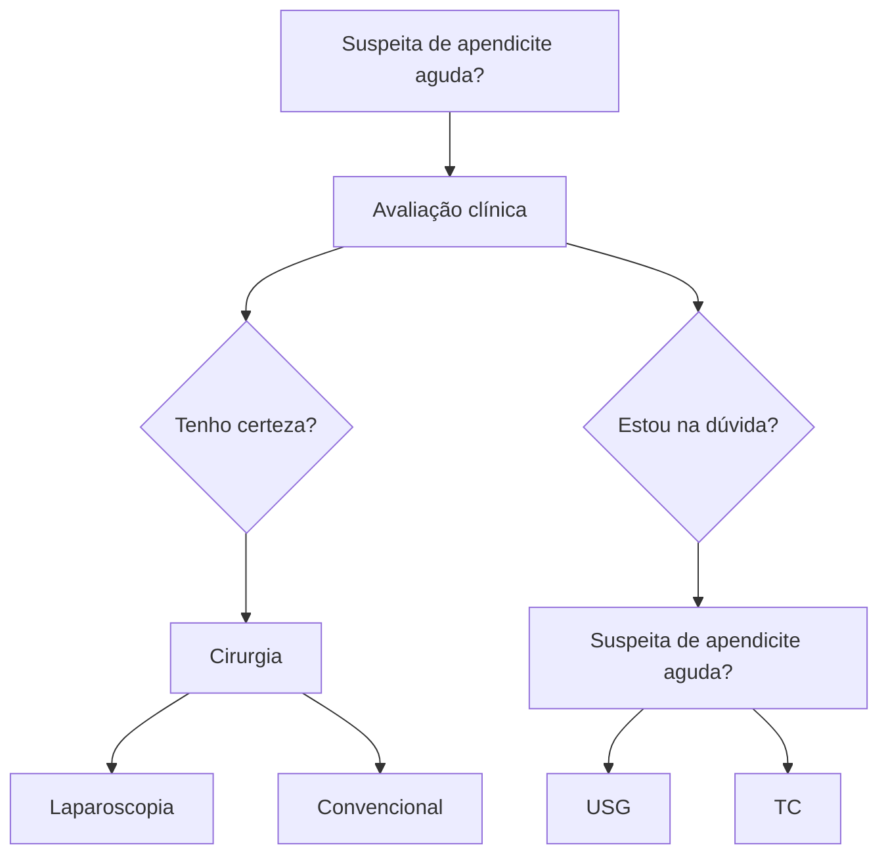
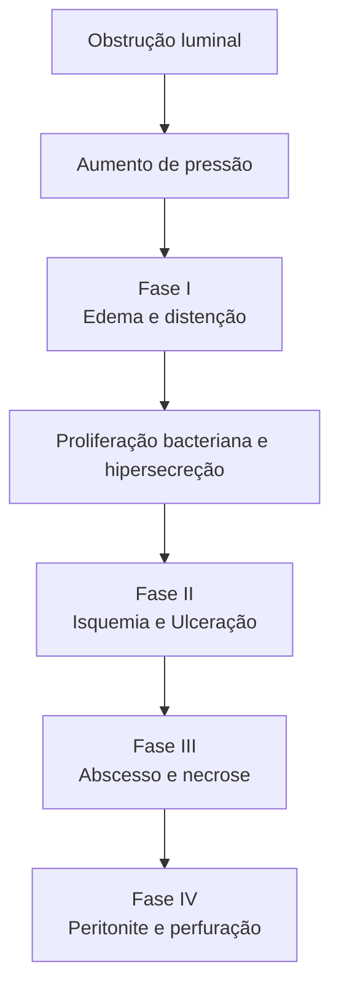
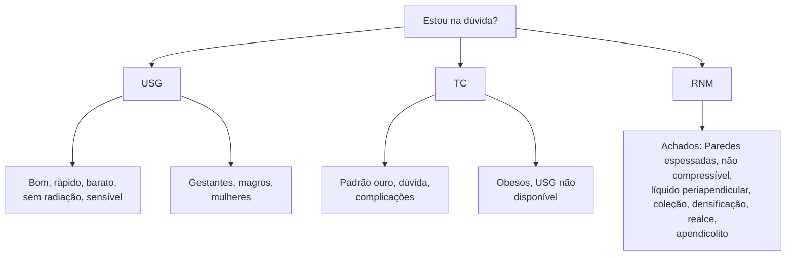
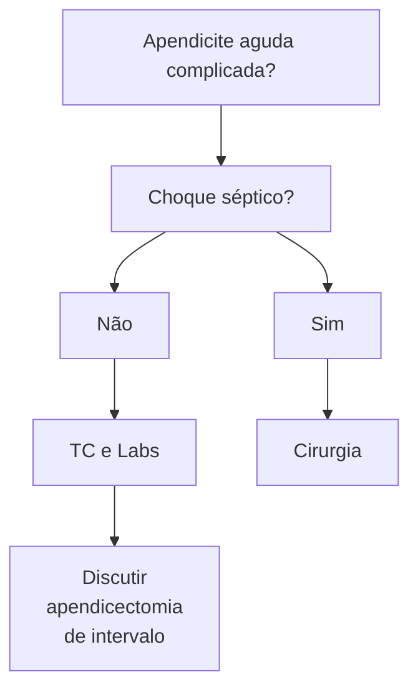

Apendicite Aguda

# ABDOME AGUDO INFLAMATÓRIO - APENDICITE AGUDA

**Figura 1** Suspeita de apendicite aguda

## 1. EPIDEMIOLOGIA

• É o abdome agudo cirúrgico mais comum: cerca de 8% da população vai evoluir com o quadro;
• Existem 3 picos de incidência:
  • Idade escolar;
  • Jovens – 2ª e 3ª década de vida;
  • Idosos.
• A prevalência é maior nos homens do que nas mulheres: 2:1;
• Mortalidade baixa – 0,5%;
• Quando é uma apendicite complicada (que ocorre em 25% dos casos), pode evoluir para óbito em 15% destes – principalmente idosos.

• O apêndice cecal fica na confluência das tênias, no final do cólon direito (ponta do ceco), normalmente na fossa ilíaca direita –1/3 distal entre o umbigo e EIAS;
• Ele pode estar em outros locais devido a variações anatômicas;
  • Ex.: pélvica, retroperitoneal etc.
• Irrigação: artéria apendicular (ramo da artéria ileocecocólica);
• Função do órgão:
  • Rico em linfócitos – IgA e imunidade intestinal;
  • Rico em flora bacteriana – reposição intestinal;
  • Há divergências na literatura no que tange ao tema, portanto, é muito relativo.

## 2. ANATOMIA

**Figura 2** Anatomia abdominal

## 3. FISIOPATOLOGIA

• Causas da obstrução luminal: hiperplasia linfoide (60% - crianças); fecalito (adultos), estase, parasitas, tumores (complicadas, idosos).

**Figura 3** Fisiopatologia

## 4. QUADRO CLÍNICO

• Dor epigástrica e periumbilical – difusa → Migra para FID;
• Associado aos sintomas anteriores, o paciente: anorexia, inapetência, vômitos, disúria, febre;
• A dor é progressiva;
• Pode ser em local diferente (devido às variações anatômicas);
  • Idosos, diabéticos e gestantes (dor em flanco direito) – quadro clínico atípico.

### 4.1 SINAIS CLÍNICOS

• Os principais sinais clínicos são:
  • Blumberg: descompressão brusca dolorosa em FID;
  • Rovsing: dor referida à palpação de FIE;
  • Os dois são os mais utilizados e os mais cobrados nas provas, entretanto existem alguns outros;
  • Dunphy: dor à percussão ou ao tossir;
  • Lenander: diferença de temperatura axilar e retal > 1 C;
  • Psoas: em decúbito lateral esquerdo, dor à extensão + abdução do MID.

## 5. DIAGNÓSTICO

• É clínico, baseado no quadro clínico e histórico compatível;
• Fazer avaliação clínica e exame físico;
  • Se tiver certeza = indicação de CIRURGIA!
  • Se tiver dúvida = Escore de Alvarado e Exames complementares.
• Score/Escala de Alvarado Figura 4;
• Mesmo com o Score de Alvarado > 7, 1 a cada 4 pacientes operados não apresentam apendicite aguda;
  • Levando isso em conta, elaboraram o Score de Alvarado Modificado.
• Confira Tabela 1 ao lado.

**Tabela 1** Alvarado modificado

| Alvarado modificado
Atributo                            | Alvarado modificado
Pontuação |
| ----------------------------------------------------------- | --------------------------------- |
| Dor migratória no quadrante inferior direito                | 1                                 |
| Anorexia                                                    | 1                                 |
| Náusea ou vômito                                            | 1                                 |
| Dor no quadrante inferior direito                           | 2                                 |
| Descompressão brusca positiva no quadrante inferior direito | 1                                 |
| Temperatura > 38 °C                                         | 1                                 |
| Leucocitose 10000 a 18000                                   | 2                                 |
| Total                                                       | 9                                 |

Dor Migratória

Anorexia

Náuseas                                    Manpdeld

Peritonite em FID                          0 - 9

DB +                                       < 3 = procurar outros diagnósticos

Febre                                      > 4 = investigar

Leucocitose

Desvio a esquerda

**Figura 5** Manpdeld

### Escala de Alvarado

| Sinais e sintomas                                                                                                                                                                                                                                       | Ponto                | Conduta                                                                                                                                  | Conduta               |                       |              |
| ------------------------------------------------------------------------------------------------------------------------------------------------------------------------------------------------------------------------------------------------------- | -------------------- | ---------------------------------------------------------------------------------------------------------------------------------------- | --------------------- | --------------------- | ------------ |
| **Tudo o que aponta com o dedo é 1 ponto**
Comida não entra (anorexia)
Comida sai (náusea)
Migração da dor
Dói quando tira 1 dedo (descompressão dolorosa)
Termômetro é o dedo (febre)
Apontando o desvio à esquerda com o dedo | **1 ponto**
cada | **1 - 4**
pontos                                                                                                                     | **ALTA**              |                       |              |
|                                                                                                                                                                                                                                                         |                      | **5 - 6**
pontos                                                                                                                     | **Observar/USG**      |                       |              |
|                                                                                                                                                                                                                                                         |                      | **Tudo o que entra são dois pontos**
Dói quando os 2 dedos entram no QID
Agulha entrando para coletar o sangue
(leucocitose) | **2 pontos**
cada | **7 - 10**
pontos | **Cirurgia** |

**Figura 4** Escala de Alvorado

ABDOME AGUDO INFLAMATÓRIO - APENDICITE AGUDA                                                                          3

**Figura 6** Procedimento diagnóstico em dúvida

## 6. TRATAMENTO

### 6.1 CONVENCIONAL (PRINCIPAL INCISÃO – MCBURNEY)
* A mais realizada, fácil e rápida;
* Alto índice de sucesso.

### 6.2 LAPAROSCOPIA
* Melhor visualização da cavidade;
* Dúvida diagnóstica;
* "Padrão ouro" – se disponível;

A técnica cirúrgica é a mesma em ambas as formas, tendo como ponto mais importante ligar a base do apêndice.

## 7. COMPLICAÇÕES

**Figura 7** Procedimento em complicações

### 7.1 APENDICECTOMIA DE INTERVALO (TRATAMENTO DE EXCEÇÃO)

**Premissas:**
* Apendicectomias realizadas na urgência; quando complicadas, aumentam taxas de colectomia direita;
* Apendicites agudas complicadas têm maior taxa de neoplasia envolvida.

**Solução:**
* Drenagem e ATB; colonoscopia; cirurgia programada;
* Condições (para solucionar):
  * Paciente estável; coleção puncionável ou pequena (4 cm);
  * Paciente tem condições de tratamento clínico e observação;
  * Melhora com o tratamento.
* Por fim, o que fazer (solucionar)?
  * Drenagem guiada;
  * ATB por 14 dias; TC de controle;
  * Colonoscopia 3 semanas;
  * Cirurgia em 6 semanas.

### 7.2 TRATAMENTO NÃO OPERATÓRIO

**Premissa:**
* Antibioticoterapia isolada em pacientes com apendicite aguda inicial resolve o problema e evita cirurgia.

**Resultados:**
* 30% de recidiva em menos de 1 ano.

**Quando fazer?**
* Dúvida;
* Altíssimo risco cirúrgico;
* Locais isolados.

### 7.3 ANTIBIOTICOTERAPIA
* Apendicite aguda não complicada/Apendicite aguda inicial – FASE I e II:
  * Antibioticoterapia profilática (até o momento cirúrgico).
* Apendicite aguda complicada ou perfurada – FASE III e IV:
  * Antibioticoterapia terapêutica.
* Na dúvida, coletar culturas/líquido peritoneal (sugerido).

### 7.4 GESTAÇÃO
* Cirurgia não obstétrica mais realizada na gestante;
* Conforme a gestação evolui, o quadro clínico varia;
  * No terceiro trimestre há maior risco de complicações;
  * Leucocitose fisiológica confunde o médico;
  * Laparoscopia pode ser feita – melhor momento é o segundo trimestre;
* RNM – exame de imagem de escolha.

## 8. DIAGNÓSTICOS DIFERENCIAIS

### 8.1 APENDAGITE EPIPLÓICA
* Trombose espontânea de veia central do apêndice epiplóico;
  * Necrose asséptica.
* TC – Massa paracólica com borramento; o tratamento: AINEs e analgésicos por 07 dias.

## 8.2 DIVERTÍCULO DE MECKEL

• Malformação congênita do TGI mais comum; → 4% de complicações durante a vida;
• Diagnóstico intra-operatório;
• Ressecar e anastomosar, se houver sintomas;
• Achado incidental = deixar lá e não mexer;
• Se ele foi a causa: fazer enterectomia segmentar e anastomose!
• Regra dos "2":
  • 2% da população tem;
  • Homens 2/1;
  • "2 pés" (60cm) da Válvula Ileocecal;
  • Tamanho médio de +/- 2cm; 2% dos pacientes tem sintomas;
  • Antes dos 2 anos de idade (ou seja, mais comum em crianças); 2 tipos de mucosas = normal e heterotópica.

## 8.3 OPEROU E NÃO É APENDICITE. FAZER OU NÃO APENDICECTOMIA?

• Tem sinais de inflamação? TIRA;
• Achou o diagnóstico diferencial? NÃO TIRA;
• Não achou nada? TIRA.
