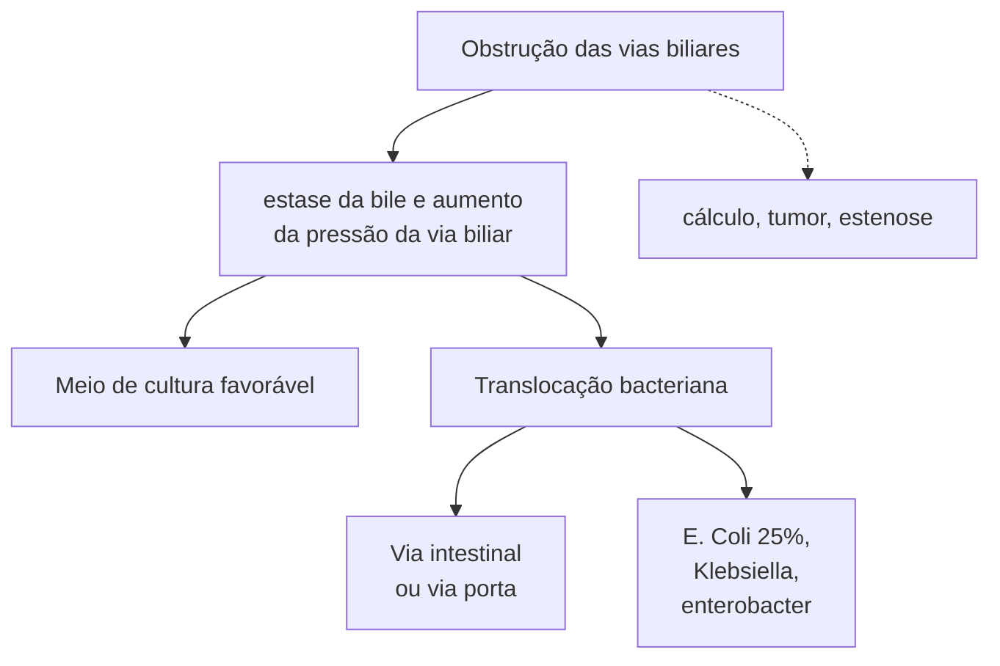

# ABDOME AGUDO INFLAMATÓRIO - COLANGITE

## Colangite = infecção da árvore biliar principal.

| **Diagnóstico**                    |                                    |                                                                                                                                                                                           |   |   |
| ---------------------------------- | ---------------------------------- | ----------------------------------------------------------------------------------------------------------------------------------------------------------------------------------------- | - | - |
| A- Sinais sistêmicos de inflamação | Leve                               | Sem nenhum critério + ATB + suporte drenagem em 24/48 horas                                                                                                                               |   |   |
| B-Colestase                        | Moderada                           | Leucocitose > 12.000 ou <4.000
Febre > 39° C
Idade > 75 anos
BT > 5
Hipoalbuminemia
ATB + suporte + drenagem imediata                                                 |   |   |
| C-Imagem compatível                | Grave                              | Disfunção orgânica
Cardiovascular → DVA
Neurológica → RNC
Renal→ Cr > 2
Hepática → INR> 1,5
Pulmonar, Coagulopatia
ATB + suporte + UTI
drenagem mega imediata |   |   |
|                                    | Classificação
e
Tratamento |                                                                                                                                                                                           |   |   |

## 1. COLANGITE = INFECÇÃO DAS VIAS BILIARES

**Figura 1** Infecção das Vias Biliares.

### 1.1 OBSTRUÇÃO

Cálculo, tumor, estenose;

Obstrução → estase da bile + aumento da pressão da via biliar;

• Meio de cultura favorável;

• Translocação bacteriana;
  • Via intestinal (contiguidade) ou via porta (drenagem venosa);
  • E. Coli é o principal agente (em 25% dos casos), Klebsiella e enterobacter.

### 1.2 QUADRO CLÍNICO

• Dor abdominal + sinais de sepse + icterícia obstrutiva;

• Sinais clássicos;

• Tríade de Charcot: febre + dor em hipocôndrio direito + icterícia;

• Pêntade de Reynolds: febre + dor em hipocôndrio direito + icterícia + hipotensão + confusão mental.

### 1.3 DIAGNÓSTICO

• Suspeita = USG + exames laboratoriais;

• Critérios de Tokyo, 2018;
  • A – sinais sistêmicos de inflamação: febre > 38 °C, calafrios; leucocitose;
  • B – colestase: bilirrubina > 2 mg/dL; TGO, TGP, FA, GGT elevadas;
  • C – imagem compatível: dilatação de vias biliares; etiologia visível.

| Suspeita = USG e Labs                                                                    |                                                        |
| ---------------------------------------------------------------------------------------- | ------------------------------------------------------ |
| A – sinais sistêmicos de inflamação                                                      | Febre > 38 °C, calafrios;
Leucocitose.             |
| B – colestase                                                                            | Bilirrubina > 2 mg/dL,
TGO, TGP, FA, GGT elevadas. |
| C – imagem compatível:                                                                   | Dilatação de vias biliares;
etiologia visível.     |
| A+ B + C → Colangite aguda
²/3 → Probabilidade apenas
Cuidado com hepatite aguda |                                                        |

**Figura 2** Critérios de Tokyo, 2018.

**Classificação (Tokyo, 2018)**

• Leve:
  • Sem nenhum critério positivo.
• Moderada:
  • Leucócitos > 12.000 células/mm3 ou < 4.000 células/mm3;
  • Febre > 39 °C;
  • Idade > 75 anos;
  • Bilirrubina total > 5 mg/dL;
  • Hipoalbuminemia.
• Grave: disfunção orgânica:
  • Cardiovascular = uso de drogas vasoativas;
  • Neurológico = rebaixamento do nível de consciência;
  • Renal = Cr > 2 mg/dl;
  • Hepática = INR > 1,5;
  • Pulmonar;
  • Coagulopatia.

**1.4 TRATAMENTO CONFORME A CLASSIFICAÇÃO**

• Leve:
  • ATB + suporte + drenagem em 24/48 horas.
• Moderada:
  • ATB + suporte;
  • Drenagem imediata.

• Grave:
  • ATB + suporte;
  • Drenagem imediata;
  • Encaminhamento para leito de UTI.

| Leve     | ATB + suporte + drenagem em 24/28 horas |
| -------- | --------------------------------------- |
| Moderada | ATB + suporte + drenagem imediata       |
| Grave    | ATB + suporte + UTI + drenagem imediata |

**Figura 3** Tratamento conforme a classificação.

• Drenagem conforme etiologia: se cálculo faz CPRE, em tumores pode-se passar prótese ou drenagem transparieto-hepático (DTPH);
• Conforme altura da obstrução, etiologia e disponibilidade do serviço;
• Sempre resolver a causa base após manejo inicial;
  • Colecistectomia (72h a 14 dias ou após 2 meses);
  • Cirurgia;
  • Prótese.
