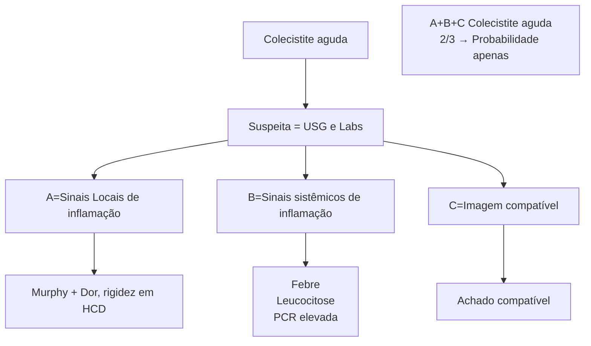

# ABDOME AGUDO INFLAMATÓRIO - COLECISTITE

Colecistite aguda = Inflamação da vesícula biliar

**Diagnóstico:**
- **A** - Sinais locais de inflamação;
- **B** - Sinais sistêmicos de inflamação;
- **C** - Imagem compatível;

**Classificação e Tratamento:**
- **Leve:** sem nenhum critério +;
- **Moderada:**
  - Leucocitose > 18.000;
  - Massa palpável;
  - Duração > 72h;

**Complicações locais.**

**Grave:**
- Disfunção orgânica;
- Hipotensão, IRA, RNC;
- Coagulopatia, Irpa.

O ideal é operar sempre que possível
- Pacientes de alto risco que respondem ao tratamento → Tardia;
- Pacientes de alto risco sem condições cirúrgicas → Drenagem.

## 1. COLECISTITE AGUDA = OBSTRUÇÃO DO DUCTO CÍSTICO COM INFLAMAÇÃO LOCAL

### 1.1 FISIOPATOLOGIA:
- Obstrução do ducto cístico = liberação de mediadores inflamatórios;
- Estase da bile = edema > distensão > inflamação > necrose. Proliferação bacteriana e infecção:
  - Aeróbios: E. Coli, Klebsiella, Proteus, Faecalis;
  - Anaeróbios: peptoestrepto, Clostridium, bacterioides.
- Colecistite crônica calculosa = agudizações recorrentes com inflamação subaguda-crônica.

### 1.2 QUADRO CLÍNICO:
- Dor abdominal em HCD (hipocôndrio direito) > 6 horas;
- Sinais de defesa abdominal **Figura 1**;
- Sinal de Murphy +;
  - Parada abrupta da inspiração quando realizada a palpação profunda no ponto de Murphy (rebordo costal direito);
  - NÃO É SINÔNIMO DE DESCOMPRESSÃO BRUSCA POSITIVA.
- Aumento de provas inflamatórias e leucocitose;
- Suspeita de complicações:

- Dor intensa;
- Febre alta;
- Associação com náuseas e vômitos;
- Leucocitose > 15.000 cels/mm3;
- Plastrão palpável.
- Diferenciais: coledocolitíase, síndrome de Mirizzi, colangite;
  - Avaliar presença de icterícia, TGO, TGP, FA, GGT...

### 1.3 DIAGNÓSTICO (TOKYO 2018)

**A.** Sinais locais de inflamação;
- Murphy +;
- Dor, rigidez em HCD.

**B.** Sinais sistêmicos de inflamação;
- Febre;
- Leucocitose;
- PCR elevado.

**C.** Imagem compatível;
- USG de abdome superior = MELHOR EXAME. **Figura 2**
- Espessamento (> 4 mm); edema de parede; Murphy ultrassonográfico; cálculo impactado; parede delaminada; edema e líquido perivesicular;
- TC de abdome = avaliar complicações e diferenciais. Espessamento (> 4 mm); edema de parede; cálculo impactado; parede delaminada; Edema e líquido perivesicular. **Figura 3**



**Figura 1** Quadro Clínico.

![Figura 2 Colecistite Aguda Imagem.]

![Figura 3 Colecistite Aguda.]

![Figura 4 Colecistite Aguda.]

• DISIDA/Colecistografia = padrão ouro (especialmente quando há dúvida em USG e TC). O exame é positivo quando não há enchimento da vesícula. Falso-positivos: jejum prolongado; cirrose; NPT; pancreatite. Usar colecistocinina para esvaziar vesícula; usar morfina para aumentar o tônus do esfíncter de Oddi e evitar vazamento rápido.

## 1.4 CLASSIFICAÇÃO

• Leve:
  • Sem nenhum critério positivo.
• Moderada:
  • Leucócitos > 18.000 células/mm3;
  • Massa palpável;

• Duração > 72 horas;
• Complicações locais.
• Grave:
  • Disfunção orgânica;
  • Hipotensão;
  • IRA;
  • RNC;
  • Coagulopatia;
  • Irpa.

```
Leve → Sem nenhum critério +

Moderada → Leucocitose > 18.000
           Massa palpável
           Duração > 72h
           Complicações locais

Grave → Disfunção orgânica
        Hipotensão, IRA, RNC,
        Coagulopatia, Irpa
```

**Figura 5** Classificação.

## 1.5 TRATAMENTO

• Conforme a classificação: colecistectomia precoce ou colecistectomia tardia ou colecistostomia (drenagem);
• Fatores para decisão;
  • ASA;
  • Charlson comorbidity index;
  • Resposta ao suporte inicial;
  • Capacidade do pronto-socorro.
• LEVE;
  • ASA < III/CCI < 6 (= paciente BOM). Padrão ouro = colecistectomia por videolaparoscopia. ATB pode ser suspenso após cirurgia;
  • ASA > III/CCI > 6 (= paciente RUIM). ATB + terapia de suporte (jejum, analgesia, hidratação venosa) e cirurgia tardia. ATB: ceftriaxone + metronidazol; alternativa → meropenem, tazocin.
• MODERADA;
  • Medidas iniciais: analgesia, ATB (cef+metro), jejum, hidratação;
  • Resposta inicial boa. ASA < III/CCI < 6 (= paciente BOM). Padrão ouro = colecistectomia por videolaparoscopia; ASA > III/CCI > 6 (= paciente RUIM). ATB e cirurgia tardia após melhora clínica;
  • Resposta inicial ruim ou piora clínica: ATB + DRENAR = COLECISTOSTOMIA.
• GRAVE;
  • Suporte INTENSIVO = UTI, jejum, hidratação, analgesia, DVA, IOT;
  • Paciente bom = colecistectomia (mesma lógica da moderada);
  • Paciente ruim = drenagem.
• Colecistostomia (drenagem):
  • Controle de foco infeccioso = esvaziar a vesícula biliar inflamada;

ABDOME AGUDO INFLAMATÓRIO - COLECISTITE<page_header>
ABDOME AGUDO INFLAMATÓRIO - COLECISTITE                                                                                                                                    3

• Métodos: colecistostomia percutânea; drenagem endoscópica; cirúrgica;
• Quanto mais grave o paciente (não tolera um procedimento cirúrgico), mais indicamos a drenagem percutânea.

Anatomical diagram showing cholecystostomy drainage procedure with gallbladder, liver, and drainage tube illustrated.

Figura 6 Colecistostomia (drenagem).

# REFERÊNCIAS

Figura 2 Colecistite Aguda Imagem.

Case courtesy of Luu Hanh, Radiopaedia.org, rID: 81591

Figura 3 Colecistite Aguda.

www.radiopaedia.org

Figura 4 Colecistite Aguda.

www.radiopaedia.org
