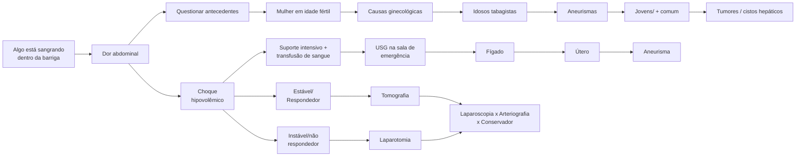

# ABDOME AGUDO HEMORRÁGICO

## 1. INTRODUÇÃO

• Alguma estrutura está sangrando dentro da cavidade abdominal.

## 2. CLÍNICA

• Dor abdominal súbita;
• Choque hipovolêmico.

### 2.1 CAUSAS

• Mulher em idade fértil: causas ginecológicas;
• Idoso, tabagista: aneurisma de aorta;
• Jovem, histórico prévio: tumor ou cisto hepático.

## 3. MANEJO

• Sala de emergência;
• Questionar antecedentes:
  • Coagulopatias;
  • Uso de anticoncepcionais orais (adenoma);
  • Tabagismo;
  • Gravidez.
• Suporte intensivo, transfusão maciça;
• Coleta de exames laboratoriais e beta HCG..

**USG na sala de emergência (POCUS):**
• Permite realizar diagnóstico diferencial.
  • Ectópica rota, aneurisma.
• Avalia presença de líquido livre na cavidade abdominal.

### 3.1 PACIENTE ESTÁVEL/RESPONDEDOR

• Tomografia de abdome;
• A depender da etiologia, considerar:
  • Laparoscopia;
  • Arteriografia com embolização (cisto com *blush*);
  • Conservador.

### 3.2 PACIENTE INSTÁVEL/NÃO RESPONDEDOR = LAPAROTOMIA!
