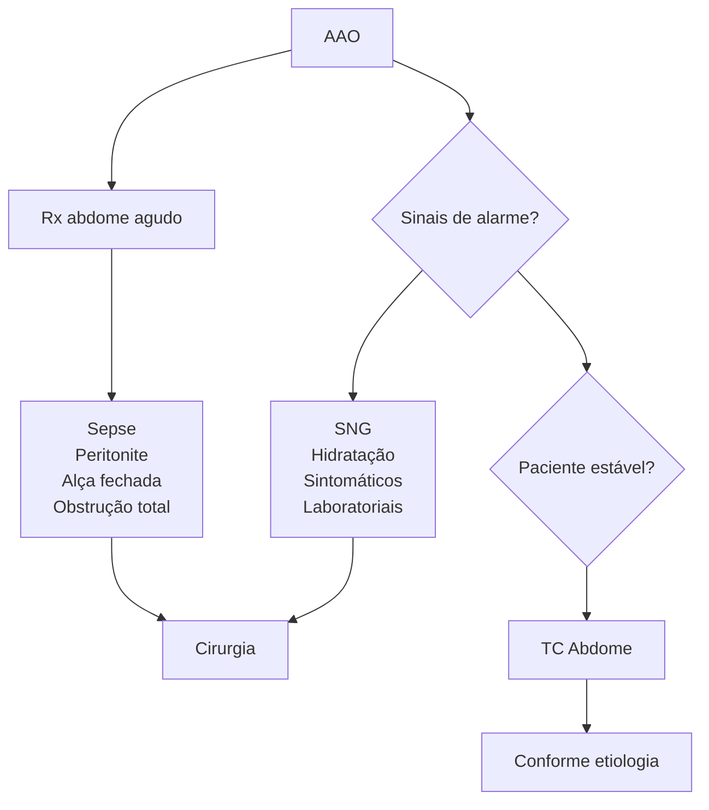
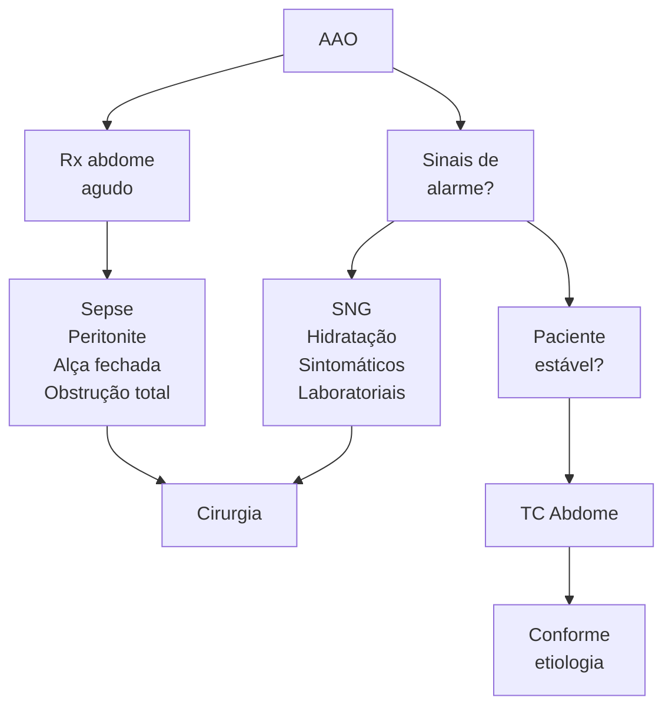

# ABDOME AGUDO OBSTRUTIVO

## 1. INTRODUÇÃO

O abdome agudo obstrutivo é caracterizado como uma parada de progressão do trânsito intestinal, causando dilatação proximal e esvaziamento distal → Mais pressão intestinal, o que leva ao aumento de força na tentativa de vencer a obstrução → Como o intestino não consegue vencer, há um sequestro de líquidos para o 3º espaço → Redução da perfusão → Isquemia → Necrose → Perfuração intestinal.

## 2. QUADRO CLÍNICO

* Tríade clássica: dor abdominal + distensão abdominal + parada de eliminação de fezes e flatos;
* Outros sintomas:
  * RHA aumentados;
  * Náuseas e vômitos;
  * Diarreia paradoxal;
  * Desidratação, sepse e peritonite.

## 3. CLASSIFICAÇÃO

### 3.1 OBSTRUÇÃO ALTA X BAIXA

* Obstrução Alta:
  * Obstrução de intestino delgado;
  * Clínica: vômitos precoces, biliosos, com menos distensão. Alcalose metabólica devido aos vômitos;
  * Causa: as principais são bridas. Outras causas: hérnia interna, tumor, bezoar e corpo estranho;
  * Radiografia: empilhamento de moedas.
* Obstrução Baixa:
  * Obstrução de cólon e reto;
  * Clínica: vômitos tardios, fecalóides. A distensão é maior. Paciente vai apresentar acidose, já que está perdendo para o 3º espaço;
  * Causas: a principal é a neoplasia colorretal. Outras causas: volvo, megacólon, doença inflamatória intestinal.

### 3.2 OBSTRUÇÃO PARCIAL X TOTAL

* Obstrução Parcial:
  * É uma suboclusão intestina;
  * Exemplo: o paciente apresenta fecaloma, mas ainda evacua.
* Obstrução Total:
  * É uma oclusão total;
  * Não há eliminação nem de flatos.

### 3.3 OBSTRUÇÃO MECÂNICA X FUNCIONAL

* Mecânica:
  * Há um processo mecânico obstruindo, como: brida, tumor, estenose, fecaloma, volvo.
* Funcional:
  * O paciente apresenta alguma condição que não deixa o intestino funcionar, como: síndromes metabólicas, medicamentosas, constipação, infecção, pós-operatório;
  * Raramente de conduta cirúrgica.

### 3.4 FORMA DE DOENÇA COMPLICADA OU NÃO COMPLICADA

* Complicada:
  * Paciente pode apresentar alguma complicação, como: sepse, isquemia, perfuração, necrose, obstrução em alça fechada.
* Não complicada:
  * Paciente não apresenta complicações.

## 4. DIAGNÓSTICO

### 4.1 ANAMNESE E EXAME FÍSICO

* Idoso?
* Perda de peso?
* Sintomas em evolução?
* Cirurgia prévia?
* Litíase/divertículo?
* Alta x Baixa?
* Sempre examinar a região inguinal (hérnia inguinal encarcerada?) e fazer o toque retal.

## 4.2 EXAME DE IMAGEM (RADIOGRAFIA DE ABDOME AGUDO) + EXAMES LABORATORIAIS

• Radiografia de abdome agudo: 3 incidências!
  • Auxilia na identificação de complicações como: obstrução em alta fechada, avaliar nível hidroaéreo, distinguir entre alta e baixa;

**Figura 1** Abdome agudo obstrutivo

• Se for confirmado algum sinal de alarme → CIRURGIA!
• Se paciente estável, realizar TC de abdome para confirmar a etiologia.

**TC de abdome**

• Indica o ponto de obstrução, altura, se a obstrução é total ou parcial;
• Mostra a etiologia e se há sinais de sofrimento de alças ou complicações;
• Obstrução de intestino delgado;
  • Indica o ponto de obstrução, altura, se a obstrução é total ou parcial;
  • Mostra a etiologia e se há sinais de sofrimento de alças ou complicações.

**Figura 2** TC de abdome

**Figura 3** TC de abdome

## 5. PRINCIPAIS ETIOLOGIAS

### 5.1 BRIDAS

• Etiologia mais comum de abdome agudo obstrutivo alto;
• É caracterizada por aderências pós-cirúrgicas. Quanto mais episódios, pior!
• Tratamento: inicialmente é clínico, pois o paciente apresenta uma suboclusão:
  • Sonda nasogástrica + jejum + hidratação + analgesia;
  • Caso o paciente não apresente melhora: faz-se TC abdome com contraste VO após 48/72 horas;
  • Indicações de CIRURGIA: casos refratários ao tratamento clínico; indicação por alterações tomográficas: visualização de uma brida única fazendo ponto de stop específico. Pode-se fazer uma laparoscopia e cortar o ponto único.

### 5.2 TUMOR

• Geralmente ocorre em pacientes idosos, com perda de peso, presença de massa abdominal palpável;
• Se confirmação de tumor como causa do abdome obstrutivo → cirurgia;
• Sempre que possível, mesmo na urgência, fazer cirurgia oncológica;
• Reconstruir o trânsito se possível.

### 5.3 VOLVO

**Figura 4** Volvo

• É mais comum em pacientes idosos, portadores de doença de Chagas e megacólon;
• Pacientes evoluem com dor abdominal súbita: urgência;
• Tratamento:
  • Se o paciente apresentar peritonite/sofrimento de alça = laparotomia!
  • Paciente estável = pode-se discutir realizar anastomose;
  • Se paciente instável = Hartmann;
  • **Se paciente não apresenta peritonite ou sofrimento = manobra de Bruusgaard - devolvulação por retossigmoidoscopia rígida.** Deixar sonda retal, retirar da urgência e após programar a cirurgia.

ABDOME AGUDO OBSTRUTIVO                                                                                   3

DETALHE: volvo de ceco é mais comum em mulheres jovens, gestante ou puérperas. A colono não alcança: decidir no intraoperatório sobre cecopexia ou colectomia.

## 5.4 FECALOMA

• É mais comum em idosos, acamados e constipados crônicos;
• Toque retal: sinal de Gersuny (crepitação e massa moldável à palpação do abdome);
• Conduta: lavagem, esvaziamento, laxativos;
  • Se refratário podemos tentar descompressão via colonoscopia;
  • Indicações de cirurgia: complicação com perfuração, isquemia ou necrose; apresentar fecaloma muito grande, que não se resolve clinicamente.

[Medical imaging showing fecaloma]

**Figura 5** Fecaloma

## 5.5 DOENÇA INFLAMATÓRIA INTESTINAL (DII)

• São estenoses inflamatórias, portanto não é bom operar!
• Realizar tratamento clínico se possível;
• Se for necessário operar: ressecar o mínimo possível.

## 5.6 SÍNDROME DE OGILVIE

• É uma pseudo-obstrução colônica aguda, sem ponto de obstrução;
• Geralmente são pacientes que apresenta:
  • Trauma raquimedular;
  • Imobilidade (pacientes de UTI, casas de repouso);
  • Politrauma, uso de narcóticos;
  • Distúrbios metabólicos, doença neurodegenerativa.
• Achados: dilatação maciça do cólon sem obstrução mecânica;
• Tratamento:
  • 1ª linha = tratamento clínico (retirar fatores desencadeantes, dieta laxativa, fisioterapia);

• 2ª linha = tratamento com neostigmina/ colonoscopia descompressiva;
• 3ª linha = cirurgia se refratário ao tratamento ou se ceco maior que 10-12 cm de diâmetro;
• Cirurgia: cecostomia ou colectomia.

[Two medical CT scan images showing Ogilvie Syndrome]

**Figura 6** Síndrome De Ogilvie

[Anatomical diagram showing:
- Aorta
- Artéria mesentérica superior (SMA)
- 45° angle on left side
- <10° angle on right side
- Ângulo da SMA
- Duodeno]

**Figura 7** SÍNDROME DE WILKIE

[Anatomical diagram showing:
- Ângulo de treitz
- 3ª porção duodenal
- Mesentérica superior
- Aorta]

**Figura 8** SÍNDROME DE WILKIE

• É uma obstrução intestinal alta, também chamada de síndrome da artéria mesentérica superior;
• Mais comum em pacientes que perdem muito peso/magros;
• Diagnóstico diferencial difícil → AngioTC;
  • Tratamento clínico: se paciente não melhorar, pode-se recorrer à duodenojejunostomia.

## 5.7 OUTRAS ETIOLOGIAS

• Outras etiologias: medicamentosas, constipação funcional, distúrbio hidroeletrolítico, íleo metabólico, infecção, carcinomatose peritoneal;
• Tratamento clínico e da causa base: laxativos, suporte, tratar causa base;
• Bezoar e/ou corpo estranho;
  • Clínica: pacientes psiquiátricos (que comem vários tufos de cabelo);
  • Tratamento: endoscopia.
• Hérnia interna, íleo biliar, hérnias de paredes, pós-operatório, enterite actínica → nas próximas aulas de cirurgia.

# REFERÊNCIAS

**Figura 1** Abdome agudo obstrutivo

https://radiopaedia.org/articles/small-bowel-obstruction?lang=us

**Figura 2** TC de abdome

https://radiopaedia.org/articles/small-bowel-obstruction?lang=us

**Figura 4** VOLVO

Case courtesy of Dr Wael Nemattalla, Radiopaedia.org,rID: 10633

**Figura 5** Fecaloma

Case courtesy of Dr Michael P Hartung, Radiopaedia.org, rID: 61999

**Figura 6** Síndrome De Ogilvie

https://radiopaedia.org search?scope=all&commit=Search&q=ogilvie+syndrome
