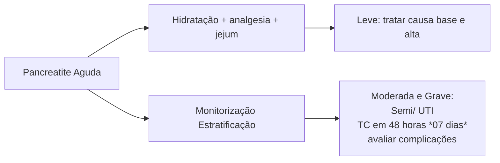

# ABDOME AGUDO INFLAMATÓRIO - PANCREATITE AGUDA

## Pancreatite aguda

**Causas: 1° Litíase Biliar/ 2°Álcool**

**Diagnóstico= 2 de 3:** → Quadro clínico | Amilase e lipase | Exame de imagem

**Tratamento** → Hidratação | Leve tratar causa base e alta
→ Analgesia | Moderada e Grave: Semi/UTI
→ Jejum | TC em 48 horas O7 dias (avaliar complicações) Antibiótico não! Apenas necrose infectada... Necrose Pancreáttica = Step-up-Approach

## 1. INTRODUÇÃO

- Possui incidência anual de 4 a 35 casos/100.000 na população geral;
  - 20% dos casos são graves.
- Nos casos leves, a mortalidade é baixa (1,5%)/Casos graves, alta (17%).

## 2. FISIOPATOLOGIA:

- Ativação de enzimas pancreáticas intratecidual → Autolesão pancreática, pancreatite aguda → Causa lesão na microcirculação → Liberação de mediadores inflamatórios → Inflamação sistêmica.

## 3. CAUSAS DE PANCREATITE AGUDA:

- Litíase Biliar – principal causa;
- Álcool – segunda principal causa;
  - Aqui temos o paciente que bebe muito agudamente, o etilista crônico vai causar inflamação crônica, pancreatite crônica.
- Outras:
  - Mecânicas: lama biliar, tumor, divertículos, áscaris;
  - Tóxicas: etanol, metanol, organofosforado, veneno de escorpião;
  - Metabólicas: hipertrigliceridemia, hipercalcemia;
  - Medicamentosa: metronidazol, azatioprina, sulfa, tiazídicos;
  - Infecciosa: vírus, bacteriana, fúngica, parasitas;
  - Trauma/- Pâncreas divisum/- Pós-CPRE/ - Vasculares /- Genéticas.

## 4. DIAGNÓSTICO

Inicialmente deve-se avaliar: antecedentes (litíase, alcoolismo).

### 4.1 QUADRO CLÍNICO TÍPICO
- Dor abdominal em faixa;
- Irradiando para dorso;
- Prece maometana;
- Náuseas e vômitos.

### 4.2 EXAMES LABORATORIAIS
- Amilase:
  - Pico precoce, meia-vida menor;
  - É menos específico – precisamos de uma amilase 3x o LSN para suspeitarmos de pancreatite aguda.
- Lipase:
  - Pico tardio, meia-vida maior;
  - É mais específico.

### 4.3 EXAMES DE IMAGEM
- Não é necessário no início;
- Pode-se fazer TC para estimar gravidade/ diagnóstico diferencial;
- USG para identificar etiologia.

Se o paciente possuir 2 critérios positivos dos 3 (quadro clínico, exames laboratoriais e exames de imagem), já confirmo pancreatite aguda!!!

- Sinais compatíveis com pancreatite aguda grave (necro-hemorrágica retroperitoneal);
- Confira Figura 1 e Figura 2 na página seguinte.

**Figura 1** Sinal de Cullen (equimose periumbilical)

**Figura 2** Sinal de Grey-Turner (equimose em flancos)

• Sinal de Fox: equimose na bolsa escrotal

## 5. CLASSIFICAÇÃO

• Leve:
  • Sem disfunção orgânica;
  • Sem complicação local;
  • A mais comum.
• Moderada:
  • Disfunção orgânica < 48h;
  • Complicação local.
• Grave:
  • Disfunção orgânica persistente.

## 6. ESCORES DE PROGNÓSTICO

### 6.1 RANSON
• Pouco específico, pouco usado, não muda conduta. Na admissão:
  • L - Leucócitos;
  • E – Enzima – TGO;
  • G – Glicose;
  • A - Age;
  • L - LDH;

• Após 48 h;
  • F - Fluídos;
  • E – Excesso de base;
  • C - Cálcio;
  • H - Hematócrito;
  • O – Oxigênio (PaO²);
  • U – Ureia.
• Se o paciente tiver > 3 pontos no Ranson ele tem um pior prognóstico.

### 6.2 BISAP
• Bun < 25 (ureia);
• Rebaixamento do nível de consciência;
• SIRS;
• Idade > 60;
• Derrame pleural.

### 6.3 APACHE – II
• Avalia 12 itens, idade, comorbidades;
• > 8 = grave.

### 6.4 BALTHAZAR
• Escore tomográfico, feito para avaliar complicações da pancreatite aguda;
• Tomografia é feita depois de 48h se o paciente evolui com pancreatite aguda grave;
• Quanto mais necrose e inflamação, mais grave e mais alta a morbimortalidade.

OBS: lembrar que o contraste não chega na necrose

### 6.5 ATLANTA
• Se tiver qualquer falência orgânica ou complicação = é grave!

## 7. TRATAMENTO

• Hidratação;
  • Feita com ringer lactato;
  • Hidratação adequada, avaliando sempre diurese, hematócrito e função renal.
• Analgesia;
  • Analgésicos potentes + sintomáticos. **Figura 3**
• Jejum;
• Devemos ainda:
  • Monitorar;
  • Classificar;
  • Descobrir a etiologia.

## 8. CONDUTA

Pancreatite aguda grave ou moderada:
• Se paciente possui uma pancreatite aguda intersticial edematosa;
  • Possui edema e mais nada = suporte.
• Se paciente possui coleção peripancreática aguda com líquido homogêneo difuso;
  • Suporte.
• Se paciente possui coleção necrótica aguda com líquido homogêneo difuso;

ABDOME AGUDO INFLAMATÓRIO - PANCREATITE AGUDA                                      3

**Figura 3** Fluxograma de tratamento.

• Suporte.
• *Walled-off necrosis* (coleção heterogênea bem delimitada), após 04 semanas;
• Observação ou drenagem.

## 9. PRINCIPAIS COMPLICAÇÕES

### 9.1 PSEUDOCISTO:

• Corresponde a uma coleção encapsulada homogênea, parede inflamatória bem definida e ausência de necrose após 4 semanas do quadro inicial;
• Conduta:
  • Drenagem, se sintomas;
  • Derivação definitiva com TGI é melhor;
  • Pode puncionar por radiointervenção.

### 9.2 NECROSE PANCREÁTICA:

• *Step-up-approach*;
• Os estudos apontam que operar a pancreatite aguda é catástrofe, no entanto a mortalidade é de 97%;
• O que vamos fazer com pacientes que apresentam pancreatite aguda grave arrastada:
  • 1º → Suporte clínico intensivo;
  • 2º → Drenagem de coleções por radiointervenção (principalmente quando infectado);
  • 3º → + drenos, endoscopia;
  • 4º → VLP retroperitoneal.
• Última → necrosectomia aberta (melhor após 4 semanas);
• Dieta;

• Pancreatite aguda leve: paciente com fome, RHA +, com melhora clínica e flatos → Dieta oral precoce;
• Pancreatite aguda moderada ou grave: paciente com pancreatite moderada ou grave → Dieta enteral precoce (72h);
• Pancreatite aguda grave com íleo prolongado: NPT.
• Antibiótico;
  • Nunca realizar no quadro inicial;
  • Não puncionar para cultura.

## 10. QUANDO OPERAR A VESÍCULA? SEMPRE!!

• Casos leves → Operar na mesma internação;
• Casos moderados/graves → Após resolução total (6 semanas);
• Em casos de cálculo impactados no colédoco → Muito raro → CPRE! Se possível colecistectomia tardia;
  • Primeiro deve-se tratar a pancreatite;
  • Após melhora, CPRE, tira-se o cálculo e opera-se a vesícula.
• Só não posso esperar se o paciente apresentar colangite (CPRE na urgência);
• Se não operar a vesícula → A pancreatite vai voltar e ele vai morrer.

# REFERÊNCIAS

**Figura 1** Sinal de Cullen (equimose periumbilical)

https://pt.wikipedia.org/wiki/Sinal_de_Cullen

**Figura 2** Sinal de Grey-Turner (equimose em flancos)

https://medizzy.com/feed/29777240
