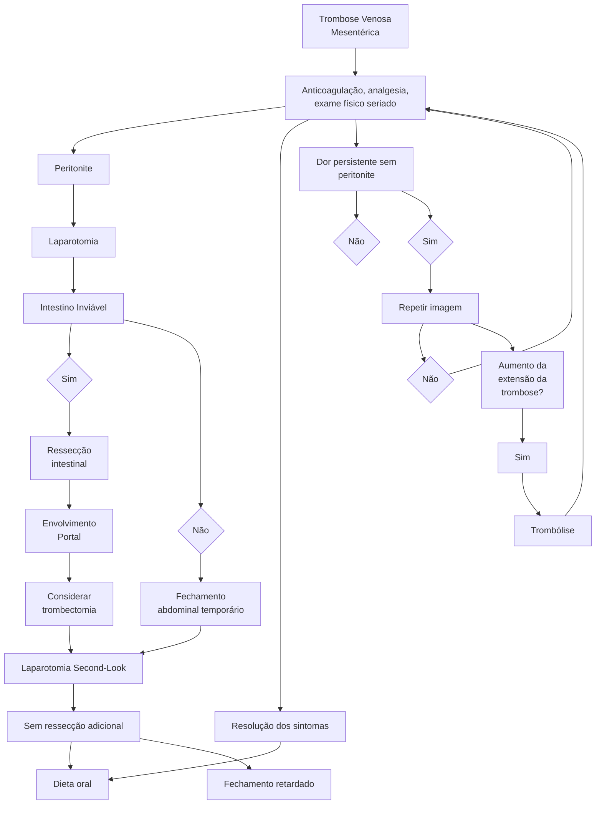

# ABDOME AGUDO VASCULAR

| AAV            | Aguda                           | Aguda                                          | Crônica                      | Crônica                             |
| -------------- | ------------------------------- | ---------------------------------------------- | ---------------------------- | ----------------------------------- |
| **Tipos**      | Arterial                        | Venosa                                         | Não oclusiva                 | Angina intestinal                   |
| **Etiologia**  | Embolia
x
Trombose      | Hipercoagulabilidade,
lesão direta, estase | Drogas, choque               | Aterosclerose                       |
| **Clínica**    | Súbito                          | Dor insidiosa                                  | Piora clínica,
distensão | Dor pós-prandial,
perda de peso |
| **Tratamento** | Embolectomia
x
Cirurgia | Anticoagulação                                 | Papaverina                   | Tratar comorbidades                 |

## 1. DEFINIÇÃO

• O abdome agudo vascular é caracterizado por uma **obstrução vascular da irrigação intestinal, causando isquemia de alças;**
• Possui alta morbimortalidade em pacientes graves;
• Deve-se ter alta suspeição diagnóstica devido à inespecificidade do quadro.

## 2. EPIDEMIOLOGIA

• Agudos → Mais comum em idosos, sexo feminino, com comorbidades (cardiopata, HAS, DM);
• Arterial:
  • Trombose → Aterosclerose.;
  • Embolia → FA, Flutter, aneurisma.
• Venoso:
  • Paciente com trombofilias, neoplasia, trombose de porta, trauma, abdome agudo inflamatório.
• Não oclusivo:
  • Ocorre por hipofluxo (choque, UTI, drogas).

## 3. CLÍNICA

• Quadro clínico – AAV agudo;
  • Dor abdominal intensa, súbita, periumbilical e difusa;
  • Evolui com **distensão abdominal, sem peritonite;**
  • **Sinal clássico: desproporção da dor com exame físico;**
  • Atentar aos antecedentes!
• Arterial:
  • Dor súbita intensa;
  • Checar antecedentes.
• Venoso:
  • Dor insidiosa e distensão. Paciente pode ter sangramento digestivo.
• Não oclusivo:
  • Distensão, leucocitose. É o mais inespecífico de todos.

## 4. INVESTIGAÇÃO

### 4.1 EXAMES AAV
• Solicitar labs: embora não sejam específicos, avaliam a gravidade;
• Marcadores de necrose intestinal:
  • CPK, DHL, lactato amilase, D-dímero.
• Marcadores de infecção:
  • Leucocitose, PCR, gasometria;

• **Na prova:**
  • **Acidose láctica com dor desproporcional = abdome agudo vascular!**

### 4.2 IMAGEM
• Radiografia e ultrassom têm baixa sensibilidade: vão servir para diagnóstico diferencial;
• ANGIOTOMOGRAFIA é o exame de escolha!
  • Permite avaliar vascularização intestinal, falha de enchimento, edemas de alças, espessamento e pneumatose intestinal.
• Arteriografia é o padrão ouro, mas é reservada para pacientes que vão passar por intervenção vascular!

### 4.3 CONDUTA
• Paciente apresenta dor e distensão abdominal + antecedentes e anamnese;
• Solicitar laboratoriais + angiotomografia.
• Hidratação venosa vigorosa devido perda de líquidos + antibioticoterapia EV (translocação) + suporte, SNG, SVD.

## 5. TRATAMENTO AAV

• Suporte intensivo para todos;
• Tratar causas bases;
• **Anticoagulação plena** + discutir desobstrução arterial + discutir abordagem intestinal;
• Para o **não oclusivo: tratar o choque** e a causa da descompensação (discutir papaverina);
• Arterial:
  • Embolia → Discutir embolectomia com Fogarty;
  • Se for trombótico → Trombectomia.
• Venoso:
  • Anticoagulação plena.
• Não oclusivo:
  • Suporte intenso;
  • Papaverina.

Indicações de **LAPAROTOMIA**:
• Realizar quando tiver sinais de sofrimento de alça:
  • Dor intensa, refratária;
  • Acidose, leucocitose;
  • Achados na tomografia;
  • Piora/refratariedade clínica.
• Tática: **laparotomia mediana + ressecar segmentos inviáveis**;
  • Se paciente estiver muito compensado → Anastomose;
  • A maioria dos pacientes são graves e ganham *damage control* (peritoneostomia - idealmente a vácuo).
• Muitos pacientes devemos programar o *second-look* em 48 horas – pacientes muito graves com áreas de penumbra nas alças intestinais.

## 6. ISQUEMIA INTESTINAL CRÔNICA

• É mais comum em idosos, fumantes, portadores de doença aterosclerótica avançada;
• Pacientes apresentam dor pós-prandial, em cólica → Perda de peso;
• Diagnóstico: a partir de história e anamnese. Suspeitar quando não achar outras justificativas para dor abdominal;
• Padrão ouro: angiotomografia;
  • Permite a visualização de obstrução de múltiplos vasos + circulação colateral;
  • USG *doppler* é um bom exame para triagem.
• Tratamento: tratar a causa base – aterosclerose. Tratamento endovascular é o preferível se o clínico não resolver.

## 7. COLITE ISQUÊMICA

• É caracterizada por uma isquemia transitória que é mais comum no cólon esquerdo decorrente de um **hipofluxo esplâncnico**;
• Causas:
  • Vasculites, trombose de veias, choque, iatrogenia/ procedimentos, drogas lícitas e ilícitas, pacientes em atividade física extenuante (maratona).
• Paciente evolui com **dor abdominal + diarreia + enterorragia**;
• Exames laboratoriais não são específicos;
• Diagnóstico: colonoscopia!
• Outra causa de colite isquêmica: pós-operatório de uma cirurgia muito grande!
• Tratamento:
  • Clínico e tratar causa base;
  • Se não melhorar é porque a colite evoluiu para um abdome agudo vascular – necrose intestinal;
  • Confira Figura 1 na página seguinte.

ABDOME AGUDO VASCULAR<page_header>
ABDOME AGUDO VASCULAR                                                                                                                                    3

**Figura 1** Abdome Agudo Vascular
