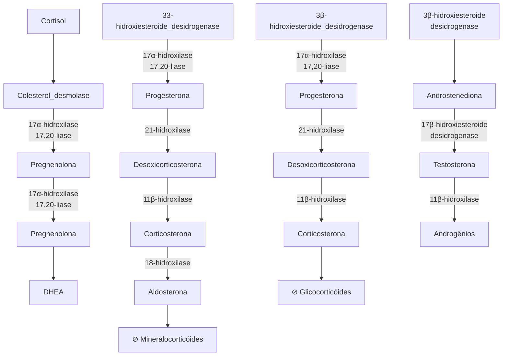
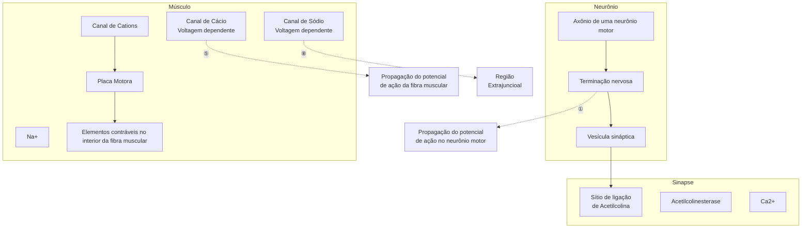

# ANESTESIA GERAL (AGENTES OPIOIDES, INDUTORES E BNM)

• Os pilares da anestesia são: analgesia (uso de opioides), hipnose (uso de hipnóticos) e relaxamento (uso de bloqueadores neuromusculares).
• Os opioides são fármacos utilizados para garantir a analgesia e têm sua ação de acordo com a afinidade para os receptores mi1 (analgesia), mi2 (depressão respiratória, bradicardia, sedação e dependência física), delta (modula atividade mi) e kappa (analgesia e sedação).
• O fentanil é o opioide mais utilizado na prática anestésica. É um opioide sintético, potente e que tem pico de ação entre 3-5 minutos.

• O propofol e os benzodiazepínicos são fármacos hipnóticos com ação agonista GABAa e possuem características cardiodepressoras. Possuem efeito cardiodepressor. O etomidato e a cetamina são hipnóticos que garantem cardioestabilidade.
• A junção neuromuscular é a região de íntimo contato entre o terminal nervoso e a membrana da fibra muscular esquelética. Esse é local de ação dos fármacos do tipo bloqueadores neuromusculares (BNM).
• Existem dois grupos de BNM: despolarizantes (succinilcolina) e adespolarizantes (cisatracúrio, rocurônio).

## 1. TÉCNICAS ANESTÉSICAS

### 1.1 PILARES DA ANESTESIA
• Analgesia;
• Hipnose;
• Imobilidade;
• Homeostase;
• Reversibilidade + segurança.

### 1.2 PRINCIPAIS TÉCNICAS ANESTÉSICAS
• Local;
• Regional;
• Geral.

## 2. ANESTESIA GERAL

### 2.1 OPIOIDES
• Agonistas dos receptores MOR (um), KOR (kappa), DOR (delta);
• Classificação quanto a potência: **potentes:** morfina, fentanil (e seus derivados), hidromorfona, metadona, oxicodona; **potência intermediária:** buprenorfina e nalbufina (agonistas parciais); **opioides fracos:** codeína, meperidina, tramadol, dextropropoxifeno, tapentadol.
• Fentanil - opioide mais utilizado na anestesiologia: Opioide sintético; 100x mais potente que a morfina; Pico em 3-5 min. – Desse modo, deve-se aguardar o efeito ocorrer. Duração curta em dose única; contudo, em infusão contínua, demonstra "meia-vida contexto--sensitivo desfavorável", isto é, em pouco tempo, é alcançado um acúmulo da substância muito grande no organismo, trazendo diversos malefícios.

### 2.2 FÁRMACOS HIPNÓTICOS INALATÓRIOS
• Inalatórios halogenados (ação GABAérgica):
  • Alcanos; halotano - obsoleto;
  • Éteres: sevoflurano (mais utilizado), desflurano, isoflurano;
  • Causam depressão miocárdica, broncodilatação, vasodilatação cerebral com aumento do FSC e PIC (halogenados);

• Óxido nitroso (N2O) - inalatório:
  • Inerte/"Gás hilariante";
  • Propriedades analgésicas (receptor NMDA)
  • Aumenta risco de NVPO (náusea e vômitos pós operatórios)
  • Gás com efeito estufa
  • Diminui síntese de vitamina B12
  • Mantém drive respiratório

**RECEPTORES OPIOIDES**

| RECEPTOR
mi                                | μ
μ1 | ANALGESIA                                                                   |
| ---------------------------------------------- | -------- | --------------------------------------------------------------------------- |
|                                                | μ2       | DEPRESSÃO RESPIRATÓRIA, BRADICAR-DIA, SEDAÇÃO, DEPENDÊNCIA FÍSICA E EUFORIA |
| LIGANTE AGONISTA ENDÓGENO DEμ 1: β - ENDORFINA |          |                                                                             |
| RECEPTOR
delta                             | δ        | MODULA A ATIVIDADE DO RECEPTOR μ                                            |
| LIGANTE AGONISTA ENDÓGENO DE δ : DINORFINAS    |          |                                                                             |
| RECEPTOR
kapa                              | K        | ANALGESIA E SEDAÇÃO SEM DEPRESSÃO RESPIRATÓRIA SIGNIFICATIVA                |
| LIGANTE AGONISTA ENDÓGENO DE K: ENCEFALINAS    |          |                                                                             |

**Figura 1** Receptores opioides

### 2.3 FÁRMACOS HIPNÓTICOS ENDOVENOSOS
**Propofol;** agonista GABAa; emulsão lipídica – branco: 10% óleo de soja; 2,25% glicerol; 1,2% de fosfato purificado de ovos (não é contraindicado em alérgicos a ovos).
• Apresenta dor à injeção;
• Dose: 1 – 2 mg/kg;

ANESTESIOLOGIA

• Rápido início e término de ação: 1 minuto – perda de consciência;
• Redistribuição;
• 2 – 8 minutos – despertar;
• Apresenta metabolização hepática e extra-hepática;
• Efeitos adversos: é cardiodepressor → hipotensão;
• Queda de base de língua → pode causar apneia;
• Síndrome da Infusão do propofol → evento raro, contudo, letal,
  • Ocorre quando a dosagem é maior que **4 mg/kg/h, por período > 48 horas** → geralmente ocorre em ambiente de UTI;
  • Ainda, observa-se evolução com rabdomiólise e hiperlipidemia;
• Acidose metabólica;
• Cardiomiopatia aguda;
• Hipercalemia;
• Esteatose hepática; pancreatite aguda.

**Cetamina:** antagonista NMDA (N-Metil-D-Aspartato) – provoca uma "anestesia dissociativa";

• **Broncodilatadora: mantém drive respiratório e reflexos de via aérea. Hemodinamicamente estável: liberação de catecolaminas – pode ocorrer taquicardia e hipertensão ao momento da injeção: atenção em pacientes depletados.**
• Rápido início de ação: 1 minuto – perda de consciência; 10-15 minutos – duração do efeito;
• Metabolismo hepático – norcetamina (20%-30% ativa);
• Efeitos adversos: aumento da PIC; sialorreia; taquicardia e hipertensão;
• Cistite intersticial – em qualquer dose;
  • Crise de esquizofrenia/surto psicótico;
  • Abuso.

**Tabela 1** Cetamina

| Cetamina (hipnótico) |                                             |
| -------------------- | ------------------------------------------- |
| Mecanismo principal  | Antagonista NMDA                            |
| Concentração         | 50 mg/mL (5%)                               |
| Via de administração | IV, IM, IN, VO                              |
| Dose habitual (IOT)  | 1-2 mg/Kg IV                                |
| Efeitos adversos     | Aumento da PIC
Sialorreia
↑FC e ↑PA |

**Etomidato:** agonista GABAa;
• Derivado de imidazol;
• Mínima repercussão hemodinâmica;
• Hipnótico rápido de indução: início do efeito: 2-4 minutos;
• Não usar em BIC, seja para sedação ou para manutenção (risco de insuficiência adrenal).
• Metabolização hepática e extra-hepática;
• Efeitos adversos:
  • Inibição da 11B-hidroxilase → A inibição da enzima impede a produção de cortisol;
  • Desse modo, em pacientes com insuficiência adrenal, deve-se considerar outras opções.
  • Aumento de náuseas e vômitos em pós-operatório;
  • Aumento do risco de convulsões;
  • Mioclonias;

• Dor com a injeção;
• Náusea e vômitos.

**Tabela 2** Etomidato

| Etomidato (hipnótico) |                                                                        |
| --------------------- | ---------------------------------------------------------------------- |
| Mecanismo principal   | Agonista GABAa                                                         |
| Concentração          | 2 mg/mL (0,2%)                                                         |
| Via de administração  | IV                                                                     |
| Dose habitual (IOT)   | 0,3 mg/Kg IV                                                           |
| Efeitos adversos      | Insuf. adrenal
↑NVPO; ↑Convulsões
Mioclonias
Dor à injeção |

• Confira na página seguinte a Figura 2

**Midazolam:** agonista GABAa: é um benzodiazepínico de efeito mais curto que o diazepam.
• Efeito: 1-3 minutos: início; 10-20 minutos: duração.
• Metabolismo hepático: metabólitos ativos (risco de ressedação).
• Amnésia e ansiólise em doses baixas;
• Anticonvulsivante;
• Efeitos adversos:
  • Apneia obstrutiva (em associação com opioides);
  • Delirium – principalmente em idosos;
  • Hipotensão leve;
  • Intoxicação – o antagonista é o flumazenil.

**Tabela 3** Midazolam

| Midazolam (hipnótico) |                                               |
| --------------------- | --------------------------------------------- |
| Mecanismo principal   | Agonista GABAa                                |
| Concentração          | 5 mg/mL (0,5%)
1 mg/mL (0,1%)             |
| Via de administração  | IV, IM                                        |
| Dose habitual (IOT)   | 0,2 - 0,4 mg/Kg IV                            |
| Efeitos adversos      | Delirium, apneia,
hipotensão, intoxicação |

**Dexmedetomidina: A2-agonista.** É 7-8x menos seletiva a2/a1. Duração de ação mais longa.
• Usos: sedação, analgesia, adjuvante – Poupador de opioide;
• Mantém drive respiratório;
• Padrão eletroencefalográfico semelhante ao do sono fisiológico;
• Efeitos adversos:
  • Bradicardia, hipo/hipertensão, poliúria – por inibição do ADH, Anti-sialogogo. Figura 3

**Tabela 4** Dexmedetomidina

| Dexmedetomidina (hipnótico) |                                                              |
| --------------------------- | ------------------------------------------------------------ |
| Mecanismo principal         | Alfa 2-agonista                                              |
| Concentração                | 200 mcg/mL (0,02%)                                           |
| Via de administração        | IV, IM, IN                                                   |
| Dose habitual (IOT)         | Atq: 0,5-1 mcg/Kg
(5-10 min)
Manut 0,2-1 mcg/Kg/h IV |
| Efeitos adversos            | Bradicardia
Hipo/hipertensão                             |

ANESTESIA GERAL (AGENTES OPIOIDES, INDUTORES E BNM)

**Figura 2** Fluxo de fármacos hipnóticos endovenosos.

## 2.4 BLOQUEADORES NEUROMUSCULARES (BNM)

• Observe o esquema didático a seguir, seguindo a numeração referente às etapas.

**Figura 3** Bloqueador neuromuscular.

ANESTESIOLOGIA

ATENÇÃO! Em pacientes queimados, críticos, acamados, os receptores de acetilcolina, que normalmente se localizam na placa motora (receptores juncionais), tendem a se deslocar para fora de tal região. Esses receptores, fora da região da placa motora, são denominados receptores extrajuncionais. Em período de abertura difusa dos receptores, juncionais e extrajuncionais, observa-se a entrada de sódio no axônio pelos canais de sódio voltagem dependente, e saída de potássio, agora tendendo a ser distribuído por toda a musculatura do paciente! Nesse momento, o uso de Quelicin (succinilcolina), aumenta exponencialmente o risco de parada cardíaca, por arritmias, pela despolarização difusa!

**Tabela 5** Bloqueador neuromuscular

| Bloqueador neuromuscular      | Succinilcolina                                                                                                                                     | Rocurônio                                                            | Cisatracúrio                                                   |
| ----------------------------- | -------------------------------------------------------------------------------------------------------------------------------------------------- | -------------------------------------------------------------------- | -------------------------------------------------------------- |
| **IOT
Dose
Latência** | 1 mg/kg
30 seg
70 kg → 70 mg                                                                                                               | 0,6 mg/kg
1 – 2 min
1,2 mg/kg
30 seg
70 kg → 85 mg   | 0,1 – 0,2 mg/kg
3 – 4 minutos
70 kg → 10 mg            |
| **Tipo**                      | Despolarizante                                                                                                                                     | Adespolarizante                                                      | Adespolarizante                                                |
| **Duração**                   | Ultracurta                                                                                                                                         | Intermediária                                                        | Intermediária                                                  |
| **Metabolismo**               | Colinesterases plasmáticas                                                                                                                         | Hepático 70%
Renal 30%                                           | Reação de Hoffman 30%
Hidrólise 70%
Órgão independente |
| **Efeitos adversos**          | Mialgia
Bradicardia
Hipercalemia
Anafilaxia
Gatilho para hipertermia maligna                                                       | Mínimos
Anafilaxia                                               | Mínimos
Anafilaxia                                         |
| **Antídoto**                  | ----------                                                                                                                                         | Sugamadex
2 – 4 mg/kg
16 mg/kg (após 1,2 mg/kg de rocurônio) | ----------                                                     |
| **Contraindicações**          | Hipercalemia
Hipertensão maligna
Deficiência de Pseudocolinesterase
Up-regulation de receptores extra-juncionais (situações especiais) | ----------                                                           | ----------                                                     |
