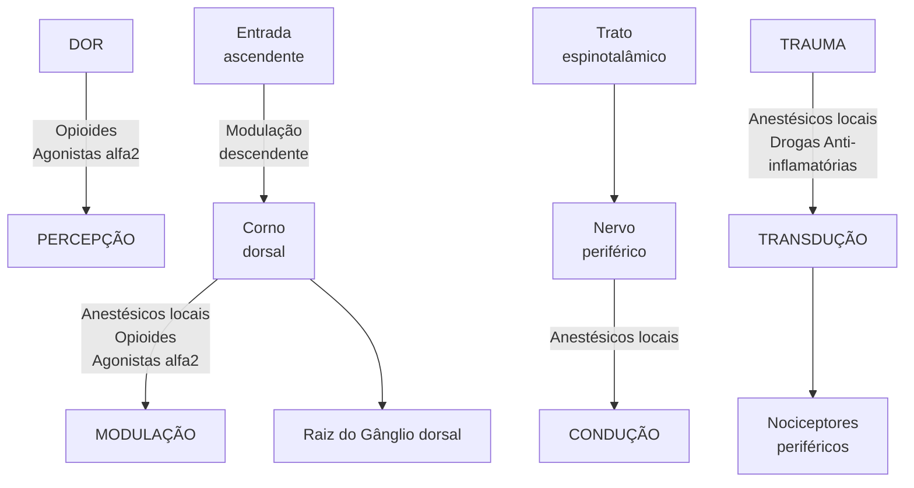

# ANESTÉSICOS LOCAIS E ANESTESIA REGIONAL (BLOQUEIOS DE NERVO PERIFÉRICO)

• Os anestésicos locais (AL) agem bloqueando os canais de sódio.
• Os AL são bases fracas e podem ser aminoamidas (lidocaína, ropivacaína, bupivacaína) ou aminoester (cocaína, procaína, tetracaína).
• O uso de vasoconstrictores associados aos AL garantem aumento da dose tóxica do medicamento, aumento da duração e diminui sangramento local.
• A potência do AL está associado a sua lipossolubilidade, enquanto a duração está relacionada à ligação proteína, e a latência à relação pH / pKa.
• O principal alvo de toxicidade sistêmica dos AL é o SNC.
• Sinais de toxicidade: vertigem, dormência periodal, formigamento facial, convulsões, hipotensão, bradicardia, apneia e PCR.
• Tratamento da intoxicação por AL: Monitorização multiparamétrica, Oxigenação e Ventilação (garantir VA S/N), Correção de acidose, Benzodiazepínicos ou Propofol se convulsão. Emulsão lipídica 20% em casos graves.
• A bupivacaína é o AL mais cardiotóxico.

## 1. COMPOSIÇÃO DOS ANESTÉSICOS LOCAIS (AL)

### 1.1 OS AL SÃO FORMADOS POR 3 PARTES:

• Anel aromático de benzeno (região hidrofóbica/ lipofílica)
• Cadeia intermediária (define o AL em éster ou amida)
• Grupamento amina (porção ionizável do AL)
• Aminoamidas: prilocaína, lidocaína, bupivacaína, ropivacaína (duas letras "i" no nome)
• Aminoésteres: cocaína, tetracaína, procaína

**Ligação Éster:**

[Hexagonal benzene ring] — CO — O — (CH)₄ — N with R₁ and R₂ branches

**Ligação Amida:**

[Hexagonal benzene ring] — NH — O — (CH₂)₄ — N with R₁ and R₂ branches

**Figura 1**

## 2. TÉCNICAS ANESTÉSICAS – ANESTESIA LOCAL

### 2.1 MECANISMOS DE AÇÃO DOS ANESTÉSICOS LOCAIS

• Confira ao lado a Figura 2, Figura 3
• Quanto mais lipossolúvel = maior capacidade de atravessar a membrana plasmática = maior potência do AL Tabela 1
• Etidocaína > Bupivacaína > Ropivacaína > Lidocaína

• Duração: ligação proteica – se liga com maior afinidade à alfa-1-glicoproteína ácida e mais comumente com a albumina (por ser a proteína mais disponível).
• Uso de vasoconstritor: aumenta sua duração, reduz sangramento, porém aumenta risco de isquemia em extremidades (dedos, pênis, nariz) Tabela 2
• Quanto maior a ligação proteína = Maior duração do AL

**Figura 2** Bloqueadores de Canais de Na+: Bases fracas – forma não ionizada; pouco solúveis em água

[Diagram showing membrane channels with labels: Extracelular, Ativação, Intracelular, Inativação, with Na+ and AL markers, and states A, B, C, D showing different configurations of the channel]

**Figura 3** Características importantes: Potência: lipossolubilidade

[Diagram showing membrane with Na+ and NaV+ channels, depicting:
- B + H+ ⟷ BH+
- Na+ entering through NaV+ channel
- B + H+ ⟷ BH+ at bottom]

ANESTESIOLOGIA

**Tabela 1 Anestésicos locais**

| Anestésico local | Lipossolubilidade |
| ---------------- | ----------------- |
| Bupivacaína      | 3420              |
| Etidocaína       | 7317              |
| Lidocaína        | 366               |
| Mepivacaína      | 130               |
| Prilocaína       | 129               |
| Ropivacaína      | 775               |

**Tabela 2 Anestésicos locais**

| Anestésico local | % ligação proteica |
| ---------------- | ------------------ |
| Bupivacaína      | 95                 |
| Etidocaína       | 94                 |
| Lidocaína        | 64                 |
| Mepivacaína      | 77                 |
| Prilocaína       | 55                 |
| Ropivacaína      | 94                 |

• Latência: relação pH/pKa.
  • Aumento de pH (associação com bicarbonato de sódio) ou diminuição do pKa (aquecimento do anestésico) reduzem a latência, ou seja, o início de ação do anestésico local é mais rápido
• ↑AL não ionizado = Passa mais rápido a membrana plasmática = ação mais rápida = ↓ latência
• pH = pKa + log AL não ionizado / AL ionizado

$$10^{pH - pKa} = \frac{apolar\ AL\ NÃO\ IONIZADO}{polar\ AL\ IONIZADO}$$

## 3. ANESTÉSICOS LOCAIS

**Anestésico local (AL) + Vasoconstritor (epinefrina)**
• 1: 200.000
• Em apresentações 5 mcg/ml ou 0,0005%.

**Vantagens:**
• Aumenta a dose tóxica do medicamento;
• Aumenta a duração;
• Diminui sangramento local;
• Detecção de injeção IV inadvertida;
• Risco de isquemia: Principalmente em extremidades, ou em vascularização terminal e em regiões pouco vascularizadas.

**Aminoamidas**
• Lidocaína → Uso IV como analgésico e antiarrítmico; IOT; Pka 7,7 – pela proximidade do pKa fisiológico, há presença maior da forma não ionizada: Diminuição da latência (menos ionizada, age mais rápido), Diminui duração. Dose limite: 4 – 5 mg/kg e 7 mg/kg (com epinefrina);
• Ropivacaína e bupivacaína →Sem aplicação sistêmica, demonstra toxicidade mais proeminente;

A duração é maior; Pka 8 x 8,1 – aumento da latência; Levobupivacaína (forma levógira da BUPI).

**Toxicidade sistêmica ao anestésico local – LAST**
• Toxicidade: Neurológica – zumbido, gosto metálico, diplopia, RNC, convulsões, coma.
• Cardiovascular: Arritmias, alterações de FC e PA, colapso cardiovascular, PCR.

**Doses tóxicas**

**Tabela 3 Anestésicos locais**

| Anestésico      | Dose           |                             |
| --------------- | -------------- | --------------------------- |
|                 | Sem adrenalina | Com adrenalina
(5μg/mL) |
| Procaína        | 7mg/kg         | 9mg /kg                     |
| Cloroprocaína   | 9mg/kg         | 12mg/kg                     |
| Lidocaína       | 5mg/kg         | 7mg/kg                      |
| Mepivacaína     | 5mg/kg         | 7mg/kg                      |
| Prilocaína      | 5mg/kg         | 7mg/kg                      |
| Bupivacaína     | 2mg/kg         | 3mg/kg                      |
| Levobupivacaína | 3mg/kg         | 4mg/kg                      |
| Ropivacaína     | 5mg/kg         | Não se aplica               |

**Fatores de risco para toxicidade sistêmica ao anestésico local - LAST:**
• Sítio de infiltração muito vascularizado – em região intercostal, por exemplo;
• Doses muito elevadas de anestésico local;
• Injeção intravascular inadvertida;
• Extremos de idade;
• Disfunções orgânicas importantes;
• Gravidez;
• Hipóxia ou hipercarbia.

**Tratamento:**
• Medidas de suporte;
• Emulsão lipídica endovenosa (casos graves).
  • Bolus 1,5 mL/kg + infusão contínua 0,25 mL/kg/min até retorno da função cardíaca
  • Se refratário, repetir bolus e aumentar infusão para 0,50 mL/kg/min

## 4. BLOQUEIO DIFERENCIAL

• Característica do nervo/barreiras;
• Concentração do anestésico local – ex.: analgesia do parto;
• Latência;

**"Anestésico tira dor e tira motor":**
• **A** – autonômico;
• **T** – temperatura;
• **D** – dor;
• **T** – tato/propriocepção;
• **Motor** – motricidade.

ANESTÉSICOS LOCAIS E ANESTESIA REGIONAL (BLOQUEIOS DE NERVO PERIFÉRICO)

**Tabela 4** Bloqueio diferencial

| Fibra  | Diâmetro  | Velocidadede condução(mm-1) | Mielinização | Anatomia Funcional                                                                          | Função                                      |
| ------ | --------- | --------------------------- | ------------ | ------------------------------------------------------------------------------------------- | ------------------------------------------- |
| Acχ    | 15 a 20   | 80 a 120                    | +++          | Aferentes e eferentes dos
músculos e articulações                                       | Motor, propriocepção                        |
| Aβ     | 8 a 15    | 80 a 120                    | +++          | Aferentes e eferentes dos
músculos e articulações                                       | Toque, pressão,
propriocepção           |
| Aδ, Aγ | 3 a 8     | 4 a 30                      | ++           | Eferente aos fusos
musculares, raízes
sensoriais e nervos
periféricos aferentes | Dor, temperatura fria,
tato/motricidade |
| B      | 4         | 10 a 15                     | +            | Pré-ganglionar simpático                                                                    | Várias Funções
autonômicas              |
| C      | 0,2 a 1,5 | 1 a 2                       | -            | Simpático, raízes sensoriais
pós-ganglionares e nervos
periféricos aferentes        | Dor, temperatura
quente, toque          |

Anestesia

# BLOQUEIO DE NEUROEIXO (RAQUIANESTESIA E PERIDURAL)

• No adulto, a medula espinal termina em 60% dos pacientes ao nível de L1; 30% pode terminar em T12; 10% em L3. Portanto, devido a esses aspectos anatômicos, a punção nos espaços L3-L4, e L4-L5 é mais segura (lembrar da linha de Tuffier).

• São efeitos após a raquianestesia: Bloqueio do sistema nervoso simpático (T1-L2) → bradicardia, hipotensão, vasodilatação, hipotermia, Bloqueio das fibras cardioaceleradoras (T1-T2) → queda do VS, DC e FC, Bexigoma (bloqueios acima de S3) → bloqueio do plexo sacral. Mais comum em homens > 50 anos e Redução do VRE e CVF: Bloqueio dos Mm. Expiratórios. Diafragma não é afetado (plexo cervical C3-C4-C5).

• Contraindicações absolutas a anestesia de neuroeixo: Recusa do paciente, Infecção local e aumento da pressão intracraniana. São relativas: Plaquetopenia < 50.000, estenose aórtica, Mielopatia, Coagulopatias, Tatuagem no local e Estenose de canal.

• A cefaleia pós-raquianestesia é o evento adverso mais frequente (24-48h após punção). São Fatores de risco: Sexo (feminino), Idade (10-50 anos), Agulha utilizada, gestação, desidratação, histórico de cefaleia prévia e número de punções.

• Características da cefaleia pós-raquianestesia: dor fronto-temporo-occipital que piora na posição sentada e ereta, piora com tosse e movimento brusco da cabeça, mas melhora com o decúbito. Associado ou não à rigidez de nuca. Tratamento: leve → repouso, hidratação, cafeína e analgésicos / incapacitante → blood stop (20 ml injetado no mesmo nível ou abaixo do local).

## 1. ANATOMIA

### 1.1 DESENVOLVIMENTO E POSIÇÃO DA MEDULA NO CANAL VERTEBRAL

• Primeiro trimestre de vida: medula espinhal se estende do forame magno até o final da coluna – a coluna cresce e alonga-se mais do que a medula

• Ao nascimento: medula termina ao nível de L3

• No adulto: 60% medula termina no nível de L1, 30% em T12; 10% em L3

• Por esses motivos, punção nos espaços L3, L4 e L4-L5 são as mais seguras

### 1.2 ESTRUTURAS TRANSPASSADAS NA RAQUIANESTESIA

• Punção mediana: pele, subcutâneo, ligamento supraespinhoso, ligamento amarelo, espaço peridural, duramater, aracnoide

• Punção paramediana (preferível em idosos com calcificação de ligamentos na coluna): pele, subcutâneo, musculatura paravertebral, ligamento amarelo, espaço peridural, duramater, aracnoide

## 2. TÉCNICAS ANESTÉSICAS – ANESTESIA REGIONAL

### 2.1 TÉCNICAS ANESTÉSICAS – ANESTESIA REGIONAL

• Bloqueio do neuroeixo: bloqueio sensitivo, motor e autonômico; as raízes do sistema nervoso autônomo passam pela região toracolombar, gerando hipotensão e bradicardia.

• Anatomicamente profundos: Risco de hematoma → pode gerar compressão da medula, produzindo lesão que pode ser irreversível.

• Contraindicações: Absoluta: recusa do paciente, infecção no local de punção, aumento da PIC;

Relativas: Choque, Cardiopatia, Anticoagulação, Discrasia, plaquetopenia < 50.000, estenose aórtica, mielopatia, estenose do canal, esclerose múltipla, tatuagem no local de punção;

• Raquianestesia: Atinge porção subaracnoidea, em região espinhal; injeção no líquor; Abaixo de L1-L2 – apenas existe a cauda equina: Linha de Tuffier (cristas ilíacas) – L4/L4-L5 a ideia da injeção nessa porção é desviar do cone medular. Contato direto do anestésico local, com dispersão no LCR: Redução da latência, Diminuição volume/dose: < 4 mL. Atualmente, utiliza-se agulhas finas – 27G: Ponta de lápis – Whitacre; Menor risco de cefaléia pós-punção da dura-máter. Baricidade da solução: Isobárica (permanece disperso localmente) x hiperbárica (precipita com a gravidade - mais utilizado; adicionado glicose). Efeitos sistêmicos da raquianestesia: bradicardia, hipotensão, vasodilatação e hipotermia (acometimento do sistema nervoso simpático T1-L2); queda de função cardíaca (extensão até T1-T5); bloqueio dos músculos respiratórios; bexigoma (bloqueio do plexo sacral)

![Figura 1 Anestesia regional - Diagram showing spinal anatomy with needle insertion points]

ANESTESIO

![Anatomical diagram showing spinal ligaments from two views - posterior and lateral. Labels indicate "Ligamento amarelo" (yellow ligament), "Ligamento interespinhoso" (interspinous ligament), and "Ligamento supraespinhoso" (supraspinous ligament)]

**Figura 2** Anestesia regional

OBS: Ainda assim, os principais riscos são de cefaléia pós-punção e retenção urinária (por bloqueio simpático do anestésico local).

• Confira abaixo a Tabela 1
• Peridural (epidural): Injeção no espaço epidural. Tecnicamente mais desafiador, por ser um espaço virtual. Técnica de "perda da resistência" das estruturas rígidas. É feita a identificação do espaço, com posterior dissecção. Atinge qualquer nível da coluna, a partir de seu mecanismo "em faixa"; Há a barreira das meninges entre o espaço e as raízes: Aumento da latência, Aumento do volume do anestésico. Agulha calibrosa – 16-18G: Resistência e cateter, Punção inadvertida da meninge: aumento do risco de cefaleia pós-punção da dura-máter.
• Pode ser feita em qualquer nível a depender do efeito desejado.
• Bloqueio de nervos periféricos.

## 2.2 CEFALEIA PÓS-PUNÇÃO DA DURA-MÁTER – CPPD;

• A partir do puncionamento, é gerado um orifício que permite o vazamento de líquor, causando hipotensão liquórica; Vasodilatação, Tração das estruturas.
• Principais fatores de risco: sexo feminino, idade (10-50 anos), agulha utilizada, gestação, desidratação, histórico de cefaleia prévia e inúmeras punções.
• Quadro clínico: Em geral, ocorre em < 72h pós-punção; Pode durar até 7 dias após a punção.
• Cefaleia posicional – piora com ortostase; É a principal característica.
• Outras manifestações associadas: Diplopia, zumbido, náuseas, vômitos;
• Autolimitado – 7-10 dias.
• Tratamento: Hidratação.
• Se leve ou moderado: Conduta conservadora – cafeína, dipirona, paracetamol, AINEs, gabapentinoide, corticoide etc./bloqueios.

**Tabela 1** Anestesia regional

| Ordem do bloqueio

↑                      | Tipo de fibra | Tamanho da fibra     | Função                                      | ↓ |
| ------------------------------------------------- | ------------- | -------------------- | ------------------------------------------- | - |
|                                                   | Aa            | 12-20                | Somatomotor, propriocepção                  |   |
|                                                   | Aβ            | 5-12                 | Toque, pressão                              |   |
|                                                   | Ay            | 3-6                  | Fuso muscular                               |   |
|                                                   | Aδ            | 2-5                  | Dor e temperatura                           |   |
|                                                   | B             | <3                   | Autonômico pré-ganglionar                   |   |
|                                                   | C             | 0,4-1,2 (amielínico) | Autonômica pós ganglionar, dor, temperatura |   |
| Recuperação do bloqueio
segue a ordem inversa |               |                      |                                             |   |

BLOQUEIO DE NEUROEIXO (RAQUIANESTESIA E PERIDURAL)                                                                                         3

OBS.: De modo simples, o tratamento baseia-se em cafeína + hidratação + analgésico.

• Mais grave = blood-patch (curativo): Injetar sangue do próprio paciente no espaço peridural, a fim de formar um tampão sanguíneo.

## 2.3 BLOQUEIO DOS NERVOS PERIFÉRICOS

• *Regional Patient Controlled Analgesia* (PCA): Em período pós-operatório, e dependendo do tipo de paciente, é possível montar uma bomba de infusão à disposição, com diversos tipos de medicamentos (morfina, metadona, fentanil...), em catéter peridural ou perineural, para melhor conforto do paciente.

| 70,630
Pessoas mortas por overdose de drogas em 2019²                                                                               | 10,1 milhões
Pessoas que usaram prescrições de opioides no ano passado¹                               |
| --------------------------------------------------------------------------------------------------------------------------------------- | --------------------------------------------------------------------------------------------------------- |
| 1,6 milhões
Pessoas que tiveram transtorno por uso de opioides no ano passado¹                                                      | 2 milhões
Pessoas que usaram metanfetamina no ano passado                                             |
| 745,000
Pessoas que usaram heroína no ano passado¹                                                                                  | 50,000
Pessoas que usaram heroína pela primeira vez¹                                                  |
| 1,6 milhões
Pessoas que usaram de forma inadequada analgésicos prescritos pela primeira vez¹                                        | 14,480
Mortes atribuídas à overdose de heroína (em um período de 12 meses no final de Junho de 2020)² |
| 48,006
Mortes atribuídas à overdose por opioides sintéticos além da metadona (em um período de 12 meses no final de Junho de 2020)² |                                                                                                           |

# 3. NOÇÕES BÁSICAS DE DOR

## 3.1 MECANISMO DA DOR

• O principal fato é que o mecanismo da dor é gerado a partir de uma resposta fisiológica ou não, diante de um estímulo nocivo;

• Dito isso, a informação da dor é conduzida por várias etapas, da periferia até o sistema central, para interpretação: Transdução, Condução, Modulação, Percepção.

**Figura 3** Mecanismo da dor.

Em cada ponto de transmissão da informação, é possível atuar com uma terapia medicamentosa, a fim de reduzir tais estímulos, e por consequência, reduzir a percepção da dor; Transdução: Anestésicos locais, Drogas anti-inflamatórias. Condução: Anestésicos locais. Modulação: Anestésicos locais, Opioides, Agonistas alfa-2. Percepção: Opioides, Agonistas alfa-2.

## 3.2 EPIDEMIOLOGIA

• 115 Americanos morrem todos os dias por conta de opioides: *1 Dose morfina → 30% de risco de abuso.*

• 75% das mortes por overdose, em 2020, foram relacionadas ao uso de opioides;

• A probabilidade de óbito por overdose é maior do que de acidente de carro (1:103 x 1:96);

• Observe o diagrama a seguir:

**Figura 4** Técnicas Anestésicas

## 3.3 AVALIAÇÃO DA DOR:

• História -> Cronologia: Início, Persistência – constante ou intermitente?; Padrão e grau de flutuação; Frequência das remissões; Duração.

• Qualidade/caráter: Aguda; Prolongada; Tipo: Em cólica, Queimação, Limitante, Lancinante.

• Gravidade.

• Localização: Localizada; Difusa; Profunda; Superficial.

• Padrões de dor referida.

• Fatores exacerbantes e atenuantes.

• Interferência em sono e humor.

• Exame físico.

## 3.4 QUAL O TIPO DA DOR?

• Existem várias classificações para a dor, seja nociceptiva, neuropática, nociplástica, aguda, crônica...

• **Nociplástica** -> Causas: Sensibilização difusa (fibromialgia); Dor visceral funcional (síndrome do intestino irritável, síndrome da dor na bexiga); Sensibilização somática regional (síndrome de dor regional complexa tipo 1, distúrbio temporomandibular). Alterações da nocicepção: (1) Sensibilização periférica (proliferação dos canais de sódio, acoplamento simpático-aferente; (2) Sensibilização central (ativação do N-metil-D-aspartato, reorganização cortical); (3) Inibição descendente diminuída (medula cinza periaquedutal e rostroventromedial); (4) Ativação do sistema imunológico (células gliais, quimiocinas, citocinas e outros mediadores inflamatórios).

• **Neuropática** -> Causa Central: (1) Traumática (lesão da medula espinhal); (2) Vascular (AVC); (3) Neurodegenerativa (doença de Parkinson); (4) Autoimune (esclerose múltipla); (5) Inflamatória (mielite transversa). Periférico; (1) Infecções (HIV, herpes zoster agudo ou neuralgia pós-herpética); (2) Compressão nervosa (síndrome do túnel do carpo); (3) Trauma (síndrome de dor regional complexa tipo 2);

(4) Metabólico (amiloidose, deficiências nutricionais); (5) Isquêmica (doença vascular periférica, diabetes); (6) Tóxico (neuropatia periférica induzida por quimioterapia); (7) Autoimune (síndrome de Guillain-Barré); (8) Genética (neuropatia hereditária).

• **Nociceptiva** → Somático: (1) Ossos (fratura óssea, metástases); (2) Músculos (distonia, espasmo muscular); (3) Articulações (osteoartrite); (4) Pele (dor pós-operatória, queimaduras). Visceral: (1) Lesão da mucosa (úlcera péptica); (2) Obstrução ou distensão capsular (cálculos biliares, pedras nos rins); (3) Isquemia (angina, isquemia mesentérica); (4) Lesão tecidual (câncer, cirrose).

## 3.5 CONSIDERAÇÕES SOBRE O TRATAMENTO ADJUVANTE:

• Anticonvulsivantes: Nociplástica; Neuropática.
• Analgésicos, antidepressivos: Nociplástica; Nociceptiva; Neuropática.
• Injeções guiadas por imagem: Nociceptiva; Neuropática.
• Intervenções no comportamento: Nociplástica; Nociceptiva; Neuropática.
• Neuromodulação: Nociceptiva: Neuropática.
• AINEs: Neuropática.
• Opioides: Nociceptiva; Neuropática.
• Exercícios: Nociplástica; Nociceptiva.
• A aplicação da abordagem 3L auxilia na diferenciação da dor neuropática da dor nociceptiva;
• Interpretação:
  • Dor nociceptiva: < 4 critérios preenchidos;
  • Dor neuropática: ≥ 4 critérios preenchidos.
• Confira na página seguinte a Tabela 2 Tabela 3

**Tabela 3** Manejo da dor

| ENTREVISTA COM O PACIENTE                                                                                                | ENTREVISTA COM O PACIENTE | ENTREVISTA COM O PACIENTE |
| ------------------------------------------------------------------------------------------------------------------------ | ------------------------- | ------------------------- |
| *Questão 1: a sua dor tem uma ou mais das seguintes características?*                                                    |                           |                           |
| 1 – Queimação                                                                                                            | ( ) sim                   | ( ) não                   |
| 2 – Sensação de frio dolorosa                                                                                            | ( ) sim                   | ( ) não                   |
| 3 – Choque elétrico                                                                                                      | ( ) sim                   | ( ) não                   |
| *Questão 2: Há presença de um ou mais dos seguintes sintomas na mesma área da sua dor?*                                  |                           |                           |
| 4 – Formigamento                                                                                                         | ( ) sim                   | ( ) não                   |
| 5 – Alfinetada e agulhada                                                                                                | ( ) sim                   | ( ) não                   |
| 6 – Adormecimento                                                                                                        | ( ) sim                   | ( ) não                   |
| 7 – Coceira                                                                                                              | ( ) sim                   | ( ) não                   |
| EXAME DO PACIENTE                                                                                                        |                           |                           |
| *Questão 3: A dor está localizada numa área onde o exame físico pode revelar uma ou mais das seguintes características?* |                           |                           |
| 8 – Hipoestesia ao toque                                                                                                 | ( ) sim                   | ( ) não                   |
| 9 – Hipoestesia à picada de agulha                                                                                       | ( ) sim                   | ( ) não                   |
| *Questão 4: Na área dolorosa, a dor pode ser causada ou aumentada por:*                                                  |                           |                           |
| 10 – Escovação                                                                                                           | ( ) sim                   | ( ) não                   |

## 3.6 A NOCICEPÇÃO

• É influenciada por vários fatores:
• Sociocultural: Expectativas sociais; Experiências passadas; Barreiras financeiras ou plano de saúde; Satisfação no trabalho; Abuso de substância; Suporte social; Barreiras de linguagem e cultura.
• Psicológico: Depressão; Ansiedade; Habilidade de enfrentamento; Personalidade de somatização ou catastrofização; Crenças cognitivas; Estresse emocional; Atitudes negativas ou medos.
• Biológico ou físico: Genética; Gravidade da doença ou injúria; Sexo; Características do sistema nervoso (limiar de dor, tolerância à dor, predisposição para sensibilização periférica e central); Sono; Idade.
• Tais etiologias são responsáveis por gerar dor e sofrimento, com os seguintes efeitos: Descondicionamento; Problemas biomecânicos; Perda de massa cinzenta; Vias nociceptivas alteradas; Uso ou abuso de medicamentos; Depressão; Comprometimento cognitivo; Desamparo aprendido; Ansiedade; Pobre concentração; Retraimento social; Relacionamentos disfuncionais; Isolamento; Aumento do risco de suicídio.
• Tratamento: Tabela 4

|                   | Dor moderada       | Dor intensa        | Dor refratária à famacoterapia      |
| ----------------- | ------------------ | ------------------ | ----------------------------------- |
| Dor leve          | Opioides fracos +  | Opioides fracos +  | Procedimentos intervencionistas +   |
| Analgésicos, AINE | Analgésicos, AINES | Analgésicos, AINES | Opioides fortes + Analgésicos, AINE |
| DROGAS ADJUVANTES |                    |                    |                                     |

**Figura 5** Manejo da dor

## 3.7 PSEUDOVÍCIO X VÍCIO X ABUSO:

Transtorno do uso de opioides: DSM-5 considera que o transtorno de uso de opioides ocorre se o padrão de uso causa comprometimento ou sofrimento clinicamente significativo que se manifesta pela presença de ≥ 2 dos seguintes ao longo de um período de 12 meses:

• Tomar opioides em quantidades maiores ou por um período de tempo mais longo do que o pretendido;
• Desejo persistente ou tentativa malsucedida de diminuir o uso de opioides;
• Tempo substancial é gasto para obter, usar ou se recuperar de opioides;
• Desejo de opioides;
• Falhar repetidamente em cumprir suas obrigações no trabalho, em casa ou escola por causa dos opioides;
• Continuar a utilizar opioides apesar de ter problemas sociais ou interpessoais recorrentes por causa dos opioides;
• Abandonar atividades sociais, profissionais ou recreacionais importantes por causa dos opioides;
• Usar opioides em situações que impliquem em perigo físico;

BLOQUEIO DE NEUROEIXO (RAQUIANESTESIA E PERIDURAL)

• Continuar a utilizar opioides apesar de haver um distúrbio físico ou mental causado ou agravado por eles;
• Ter a tolerância a opioides (não é um critério quando o uso é medicamente apropriado);
• Ter sintomas de abstinência de opioides ou tomá-los por causa da abstinência.

## 3.8 COMPLICAÇÕES DO USO DE OPIOIDES:

• Efeitos colaterais: Sedação e confusão mental; Náuseas e vômitos; Obstipação; Prurido; Depressão respiratória; Mioclonia.

**Atenção aos seguintes cenários;**

• Doenças hepáticas devido a retardo da metabolização do fármaco, particularmente com os preparados de liberação modificada;
• DPOC devido ao risco de depressão respiratória;

• Apneia obstrutiva do sono não tratada porque há o risco de depressão respiratória;
• Algumas doenças neurológicas, como demência, encefalopatia, devido ao risco de delirium;
• Insuficiência renal grave porque pode haver acúmulo de metabólitos e isso pode causar problemas (o acúmulo é menos provável com fentanil e metadona).

**ATENÇÃO!** A Metadona apresenta a maior taxa de mortes induzidas por opioides (com receita médica), dentre todos. A farmacocinética é variável, devendo ser mantida a avaliação sérica regular, em vista de que o limiar entre dose tóxica e terapêutica é reduzido. Ainda, o principal fator temido é o alargamento do intervalo QT → atenção em doença renal crônica, idosos, cardiopatas.

**Tabela 2** Dor

|                 | Ouvir                                                                                                                                                                               | Localizar                                                                                                            | Buscar                                                 |
| --------------- | ----------------------------------------------------------------------------------------------------------------------------------------------------------------------------------- | -------------------------------------------------------------------------------------------------------------------- | ------------------------------------------------------ |
| **Neuropática** | Resultado positivo nas ferramentas de exame LANSS, NPQ ou DN4.
Descritores comuns incluem "Latejante", "choque elétrico", "queimação", "formigamento", "coceira" e "dormência". | A região dolorida pode não ser necessariamente a mesma do local da lesão.                                            | Testes de coceira demonstram anormalidades sensoriais. |
| **Nociceptiva** | Descritores comuns incluem "ardência" e "latejante".                                                                                                                                | A região dolorida está localizada tipicamente no local da lesão.
Manipulação física causa dor no local da lesão. | Anormalidades sensoriais não indicadas.                |

**Tabela 4** Manejo da dor

| Item                                                                                                                                  | Marque cada item que se aplique | Pontuação do item, se feminino | Pontuação do item, se masculino |
| ------------------------------------------------------------------------------------------------------------------------------------- | ------------------------------- | ------------------------------ | ------------------------------- |
| **1- Histórico familiar de abuso de substâncias**
Álcool
Drogas ilegais
Medicamentos prescritos                           | { }
{ }
{ }             | 1
4                  | 3
4                   |
| **2- História pessoal de abuso de substâncias**
Álcool
Drogas ilegais
Medicamentos prescritos                             | { }
{ }
{ }             | 3
5                  | 3
5                   |
| **3- Idade**
(marque a caixa se 16-45)                                                                                            | { }                             | 1                              | 1                               |
| **4- História de abuso sexual pré-adolescente**                                                                                       | { }                             | 3                              | 0                               |
| **5- Doença psicológica**
Transtorno de déficit de atenção, transtorno obsessivo-compulsivo, bipolar, esquizofrenia
Depressão | { }

{ }      | 2

1         | 2

1          |
