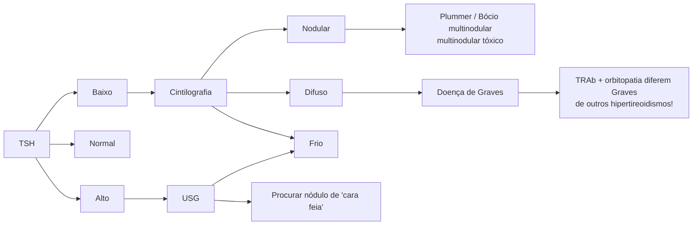
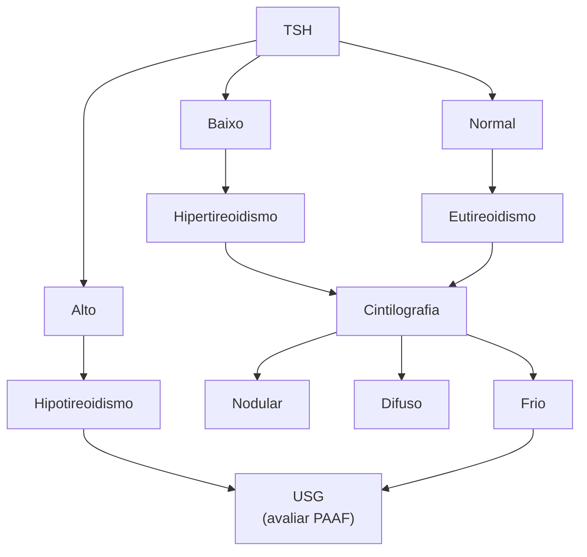
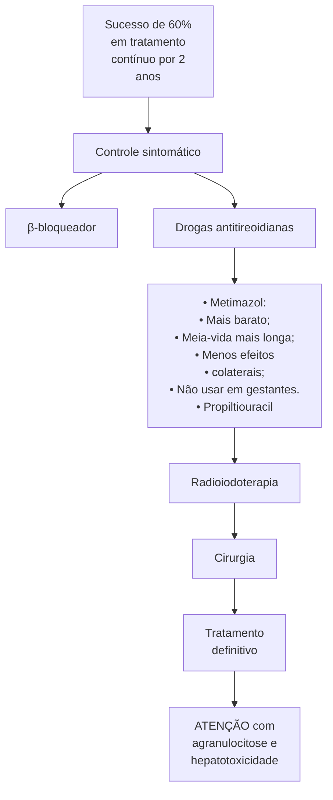
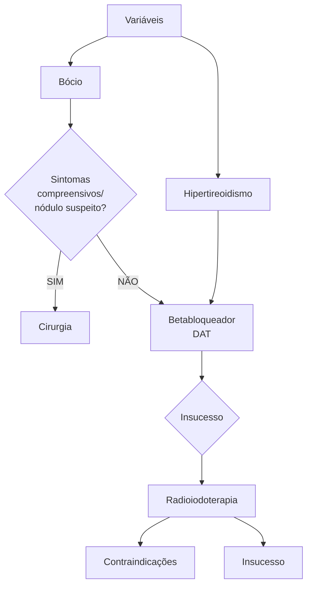
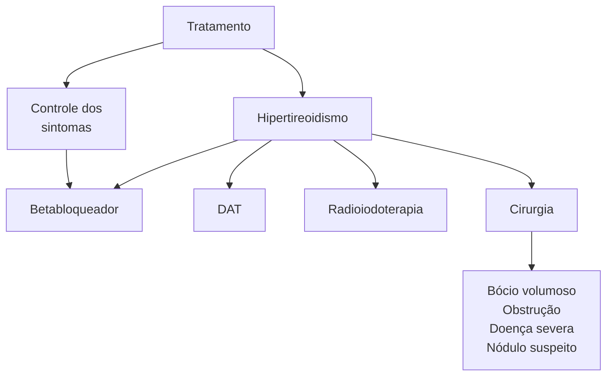
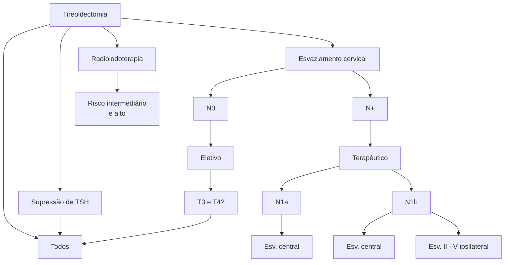
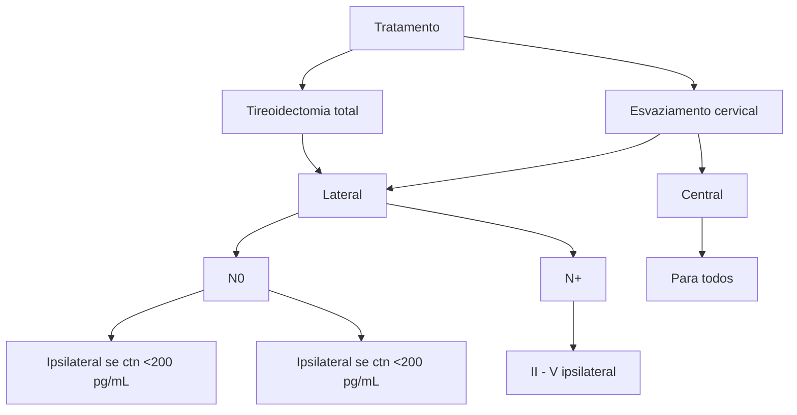

# CABEÇA E PESCOÇO: TIREÓIDE I-ANATOMIA, FISIOLOGIA E TIREOIDITES

**Nervo laríngeo superior:**
- Ramo interno → sensibilidade da supraglote e hipofaringe.
- Ramo externo → motor para o m. cricotireóideo.

**Nervo laríngeo inferior (recorrente):**
- Inerva todos os músculos intrínsecos da laringe, com exceção do m. cricotireóideo.
- Predominantemente motor (PPVV).

## 1. ANATOMIA

- A tireoide é uma glândula que apresenta formato de escudo;
- Etimologicamente, é uma palavra derivada do grego – *Thyreós*;
- Localiza-se ao nível do 2-4° anel traqueal;
- Ligamento de Gruber – adere a tireoide ao anel traqueal.

### 1.1 ESTRUTURAS ADJACENTES:

- Paratireoides;
  - Localizam-se no aspecto posterior do lóbulo tireoidiano.

### 1.2 VASCULARIZAÇÃO:

- Artérias tireoidianas superiores e inferiores;
  - A. Tireoidiana superior → é o 1° ramo da artéria carótida externa;
  - A. Tireoidiana inferior → ramo do tronco tireocervical → ramo da artéria subclávia.
- Veias tireoidianas superiores, médias e inferiores;
  - V. Tireoidiana superior → drena para veia jugular interna;
  - V. Tireoidiana média → drena para veia jugular interna, mas pode drenar para a veia subclávia ou veia inominada;
  - V. Tireoidiana inferior → pode drenar para a veia subclávia ou veia inominada.

### 1.3 NERVOS:

- Ambos os nervos são ramos do nervo vago;
- Nervo laríngeo superior;
  - Ramo interno (penetra a membrana tireohioidea) → sensitivo: confere sensibilidade à supraglote e à hipofaringe.
  - Ramo externo → motor: inerva o músculo cricotireóideo.
- Nervo laríngeo inferior (recorrente);
  - Inerva todos os músculos intrínsecos à laringe, com exceção do músculo cricotireóideo;
  - Sobe pelo sulco traqueoesofágico;
  - Motor (PPVV).

CIRURGIA DE CABEÇA E PESCOÇO

## 1.4 HISTOLOGIA:

• Observe a imagem a seguir; células foliculares → formam os coloides (folículos tireoidianos), repletos de hormônio tireoidiano;
• Células parafoliculares (células C) → advém da crista neural, produtoras de calcitonina.

**Figura 4** Histologia da tireoide.

## 2. FISIOLOGIA

**Figura 5** Fisiologia da Tireóide

## 2.1 CONSIDERAÇÕES GERAIS;

• O hipotálamo secreta TRH (hormônio liberador de tireotrofina), que estimula a hipófise a secretar o TSH (hormônio estimulador da tireoide);
• A tireoide, estimulada pelo TSH, produz tireoglobulina (T3 e T4);
• No sangue, a tireoglobulina se junta à TBG (globulina ligante de tireoglobulina – produzida no fígado) e é carreada no sangue;
• Aumentando a produção de T3 e T4, há feedback negativo no hipotálamo e, consequente, redução da produção.

## 3. TIREOIDITES

### 3.1 PONTOS IMPORTANTES:

• É um grupo heterogêneo de doenças causadas por alguma forma de inflamação na tireoide;
• Tireoidite dolorosa e mole à palpação → inflamação;
• Tireoidite indolor e dura → disfunção ou bócio.
• Confira **Tabela 1** na página seguinte

CABEÇA E PESCOÇO: TIREÓIDE I - ANATOMIA, FISIOLOGIA E TIREOIDITES

Tabela 1 Tireoidites

| Tireoidite                     | Sinônimo                                                   | Causa/característica                                                                 |
| ------------------------------ | ---------------------------------------------------------- | ------------------------------------------------------------------------------------ |
| **Tireoidite dolorosa e mole** |                                                            |                                                                                      |
| Subaguda                       | Granulomatosa subaguda Não supurativa subaguda De Quervain | Infecção viral                                                                       |
| Infecciosa                     | Aguda ou crônica                                           | Abscesso
Via hematogênica ou fístula                                             |
| Radioinduzida                  | -------------                                              | Radioiodoterapia                                                                     |
| Palpação/trauma induzida       | -------------                                              | Palpação vigorosa/trauma                                                             |
| **Tireoidite indolor e dura**  |                                                            |                                                                                      |
| Indolor                        | Silente
Linfocítica subaguda                           | Variante da Hashimoto                                                                |
| Associada ao parto             | Pós-parto                                                  | Similar à indolor                                                                    |
| Associada a drogas             | ---------------                                            | Interferon alfa
IL-2
Lítio - Inibidores de tirosina quinase
Imunoterapia |
| Linfocítica crônica            | Hashimoto                                                  | Hipotireoidismo                                                                      |
| Associada à amiodarona         | ---------------                                            |                                                                                      |
| Fibrosa                        | Riedel
Invasiva                                        | Invasiva e fibrosante                                                                |

# CABEÇA E PESCOÇO: TIREOIDE II - NÓDULO E BÓCIO

## 1. NÓDULO TIREOIDIANO

### 1.1 EPIDEMIOLOGIA

- Cerca de 20 a 76% da população geral apresenta nódulo tireoidiano; é algo comum, principalmente, em mulheres de meia-idade;
- A maioria dos nódulos é benigna. O carcinoma ocorre apenas entre 5-15%;
- NÃO fazer busca ativa de câncer de tireoide com USG sem indicação, pois os danos superam os benefícios;
- Fatores contribuintes para formação de nódulos: idade (idosos), sexo (feminino), radiação prévia, histórico familiar.

### 1.2 MANEJO DO NÓDULO TIREOIDIANO

- Primeiramente, avaliar o status funcional do nódulo através da dosagem do TSH;
- Paciente com TSH baixo (aumento da função) = Hipertireoidismo → Solicitar Cintilografia para diferenciar etiologia da hiperfunção da glândula: nodular (tóxica ou produtora de hormônio), difusa ou nódulo "frio" (pouca captação do iodo da cintilografia) → Solicitar USG e possivelmente PAAF);
- Paciente com TSH normal ou alto (redução da função) = Eutireoidismo/Hipotireoidismo → Solicitar USG de tireoide e avaliar necessidade de PAAF.

**Figura 1** Manejo do nódulo de tireoide a partir da avaliação do hormônio TSH e as indicações de realização de cintilografia e/ou ultrassonografia, associada possivelmente a PAAF.

## 2. BÓCIO

### 2.1 DEFINIÇÃO DE BÓCIO:

- "Alteração morfológica por aumento ou formação de nódulos de natureza benigna e não infecciosa;"
- Como não é infecciosa, faz diferencial com tireoidite.

**Figura 2** Paciente com bócio tireoideano.

## 2.2 CLASSIFICAÇÃO

**Epidemiologia:**
• Endêmico: está associado à deficiência de iodo em determinadas localizações;
• Esporádico: não está associado à carência de iodo.

**Morfologia:**
• Difuso: aumento difuso da glândula;
• Nodular (uni ou multinodular).

**Fisiologia:**
• Atóxico (simples): bócio que não secreta hormônios;
• Tóxico: associado à secreção de hormônios.

## 2.3 QUADRO CLÍNICO

• Abaulamento cervical anterior;
• Achado de exame de imagem é o mais comum;
• Hipertireoidismo (bócios tóxicos);
• Sintomas compressivos:
  • Dispneia;
  • Disfagia – compressão de faringe e esôfago;
  • Disfonia (raro) → compressão de nervo laríngeo inferior → pensar em patologia maligna.
• Bócio mergulhante: bócio de grandes proporções que invade a cavidade torácica total ou parcialmente (imagem a seguir) → pode gerar o sinal de Pemberton (pletora facial com a elevação dos membros).

**Figura 3** Bócio Mergulhante.

**Figura 4** Radiografia de um Bócio Mergulhante (área amarela) associada a desvio de traqueia (área pontilhada em azul).

**Figura 5** Bócio Mergulhante.

**Figura 6** Bócio Mergulhante.

## 2.4 EXAMES COMPLEMENTARES

**Laboratório**
• TSH → 1º exame a ser pedido;
• T4 livre (avaliação do eixo hormonal) se hipertireoidismo ou suspeita de tireoidite, solicitar anticorpos (anti-TPO e TRAb);
• Cálcio, PTH (rastrear doença da paratireoide) → rastreio pré-operatório.

**Imagem**
• USG;
• TC ou RM (bócios volumosos e/ou mergulhantes) → acesso preferencialmente cervical. Em bócios mergulhantes, o planejamento da cirurgia é um pouco diferente, por isso o exame de imagem é obrigatório. A cirurgia normalmente é por acesso cervical, por isso, a TC é de região cervical e torácica;
• Cintilografia (quando hipertireoidismo).

**PAAF**
• Pedir quando nódulos suspeitos para malignidade (nódulos grandes na USG, nódulos de consistência endurecida e aderido a planos profundos, nódulos em homens com histórico familiar de câncer de tireoide).

**Laringoscopia**
• Pré-operatório ou em caso de disfonia (avalia função laríngea).

**Cintilografia**
• Em casos de bócio difuso tóxico ou bócio uninodular tóxico → NÃO PUNCIONAR. Diagnóstico possivelmente benigno. Não há necessidade de prorrogar investigação.

CABEÇA E PESCOÇO: TIREÓIDE II - NÓDULO E BÓCIO

• Nódulo hipocaptante → suspeito de malignidade.
Proceder com USG e PAAF para elucidação diagnóstica.

| 
NORMAL                        | 
BÓCIO DIFUSO TÓXICO (GRAVES)        |
| --------------------------------------- | --------------------------------------------- |
| 
A
BÓCIO UNINODULAR TÓXICO | 
B
(PLUMMER) NÓDULO HIPOCAPTANTE |

**Figura 7** 1- Cintilografia da tireoide. Captação fisiológica do iodo pela glândula tireoide. 2 - Bócio difuso tóxico (Doença de Graves) com captação intensa e difusa de iodo. 3 - Bócio uninodular tóxico (Plummer) com captação intensa de iodo apenas em nódulo à esquerda (imagem em preto). 4 - Nódulo hipocaptante de iodo ("frio") - mais sugestivo de malignidade, proceder com USG e PAAF.

## 2.5 BÓCIO MERGULHANTE
• Componente intratorácico obrigatório;
• Sempre solicitar TC de pescoço e tórax → programação cirúrgica;
• Cirurgia → Acesso preferencialmente cervical.

## 2.6 BÓCIO NA DOENÇA DE GRAVES
• Definição: doença autoimune. Principal causa de hipertireoidismo;
• Causa: produção aumentada de anticorpo TRAb:
  • Causa ativação do receptor de TSH;
  • Aumenta a síntese e secreção de hormônios;
  • Crescimento glandular difuso → Bócio.

**Clínica:**
• Hipertireoidismo é o mais comum;
• Bócio;
• Orbitopatia (exoftalmia);
• *Lid lag* (posicionamento palpebral superior);
• Mixedema pré-tibial.

> OBS: TRAb + orbitopatia → difere Graves de outras causas de hipertireoidismo.

• Confira **Figura 8** e **Figura 9** ao lado

**Figura 8** Orbitopatia na doença de Graves com presença de Protrusão Ocular e Lid Lag.

**Figura 9** Mixedema pré-tibial na doença de Graves.

**Tratamento:**
• Seguimento clínico: maioria dos pacientes.

**Quando operar? → Tireoidectomia**
• Suspeita ou confirmação de malignidade;
• Hipertireoidismo refratário a tratamento não operatório;
• Sintomas compressivos;
• Bócio mergulhante;
• Queixa estética.
• Confira **Figura 10** na página seguinte.

**Terapia para bócio tóxico (produtor de hormônios):**
• Controle sintomático: betabloqueador;
• Drogas antitireoidianas (DAT):
  • Sucesso de 60% em tratamento contínuo por 2 anos.
• Opções de drogas:
  • Metimazol: mais barato, meia-vida mais longa, menos efeitos colaterais, não usar em gestantes;
  • Propiltiouracil: pode usar em gestantes.
• Efeitos colaterais do Metimazol:
  • Agranulocitose;
  • Hepatotoxicidade.

**Tratamentos definitivos:**

Radioiodoterapia:
• Contraindicações:
  • Alergia a iodo;
  • TRAb com títulos muito elevados (doença avançada);
  • Exoftalmia moderada ou severa (doença avançada);
  • Gestante ou com planos de engravidar para os próximos 6 meses;
  • Bócio volumoso com sintomas compressivos (indicação cirúrgica sempre);
  • Bócio mergulhante (indicação cirúrgica sempre).
• Cirurgia: tireoidectomia.

## Figura 10 Fluxograma de tratamento do Bócio Tóxico.

## Figura 11 Fluxograma de escolha terapêutica na doença de Graves.

## Figura 12 Fluxograma de escolha terapêutica na doença de Plummer ou bócio multinodular.

### Terapia específica para doença de graves:

• Avaliar três variáveis: hipertireoidismo, volume tireoidiano e orbitopatia;

• O tratamento será de acordo com a gravidade dos sintomas com a sequência: betabloqueador → DAT → Radioiodoterapia → cirurgia;

• NÃO operar se paciente descompensado com hipertireoidismo ou risco de crise tireotóxica;

• Terapia específica para Doença de Plummer (bócio multinodular);

• Confira Figura 11 e Figura 12 acima.

CABEÇA E PESCOÇO: TIREÓIDE II - NÓDULO E BÓCIO# REFERÊNCIAS

**Figura 2** Paciente com bócio tireoideano

Imagem cedida pelo Prof . Dr . Alberto R . Ferraz

**Figura 3** Bócio Mergulhante.

Shah's Head and Neck Surgery. 5ª ed.

**Figura 4** Radiografia de um Bócio Mergulhante (área amarela) associada a desvio de traqueia (área pontilhada em azul).

Case courtesy of Assoc Prof Frank Gaillard, Radiopaedia.org, rID: 15514

**Figura 5** Bócio Mergulhante.

Case courtesy of Frank Gaillard, Radiopaedia.org, rID: 4280

**Figura 6** Bócio Mergulhante.

Case courtesy of Assoc Prof Frank Gaillard, Radiopaedia.org, rID: 26877 TC Cervical

**Figura 7** 1- Cintilografia da tireoide. Captação fisiológica do iodo pela glândula tireoide. 2 - Bócio difuso tóxico (Doença de Graves) com capitação intensa e difusa de iodo. 3 - Bócio uninodular tóxico (Plummer) com captação intensa de iodo apenas em nódulo a esquerda (imagem em preto). 4 - Nódulo hipocaptante de iodo ("frio") - mais sugestivo de malignidade, proceder com USG e PAAF.

Sha's Head and Neck Surgery, 5ª ed. | Terris DJ, Duke WS. Thyroid and parathyroid diseases - mnedical and surgical management, 2ª ed. | Case courtesy of Ammar Ashraf, Radiopaedia.org, rID: 86352. www.radiopaedia.org

**Figura 8** Orbitopatia na doença de Graves com presença de Protrusão Ocular e Lid Lag.

Acervo pessoal

**Figura 9** Mixedema pré-tibial na doença de Graves.

Acervo pessoal

# CABEÇA E PESCOÇO: TIREOIDE III - CARCINOMA BEM DIFERENCIADO

## O que é um nódulo de cara feia?

- ↑ Hipoecogênico;
- ↓ Microcalcificações;
- ↓ Vascularização central;
- ↓ Margens irregulares;
- ↓ Extensão extratireoidiana;
- ↓ Mais alto que largo;
- ↓ Crescimento documentado.

## PAAF diagnóstica é recomendada para nódulos com suspeita:

- Alta ↑+↓ → ≥ 1,0 cm;
- Intermediária ↑ → ≥ 1,0 cm;
- Baixa ↓ → ≥ 1,5 cm;
- Muito baixa → ≥ 2,0 cm;
- (observação é ok)
- Cístico → Ø (benigno).

## 1. ASPECTOS GERAIS

**Figura 1** Linhagens celulares das neoplasias de tireoide

| Ca tireoide | Células foliculares     | Bem diferenciado   | Papilífero (80%) |
| ----------- | ----------------------- | ------------------ | ---------------- |
|             |                         |                    | Folicular (10%)  |
|             |                         | Pouco diferenciado | Insular (2%)     |
|             |                         | Indiferenciado     | Anaplásico (<1%) |
|             | Células parafoliculares |                    | Medular (5–10%)  |

### 1.1 CARCINOMA DE CÉLULAS FOLICULARES

- Observe a imagem a seguir – sobrevida para doença específica em 5 anos;
  - Os carcinomas papilíferos e os foliculares são mais prevalentes, contudo demonstram melhora na sobrevida;
  - Por outro lado, aqueles insulares ou anaplásicos tendem a ser infrequentes, mas apresentam pior sobrevida.

**>98%**

- Papilífero (80%)
- Folicular (10%)
- Insular (2%)
- Anaplásico (<1%)

**5%**

### 1.2 CARCINOMA DE CÉLULAS PARAFOLICULARES

- Mais raro do que o de células foliculares;
- Alteração na calcitonina;
- Dá origem ao CA de tireoide medular.

**Tabela 1** Distribuição dos carcinomas de tireoide de células foliculares em relação a faixa etária, sexo, modo de disseminação, resposta a iodoterapia e produção de tireoglobulina.

**Figura 2** Carcinomas de células foliculares e sua estimativa de sobrevida em 5 anos.

| Idade             | Sexo ♀ | Disseminação | Iodo         | Tireoglobulina |   |
| ----------------- | ------ | ------------ | ------------ | -------------- | - |
| Papilífero (80%)  | 45     | 85%          | Linfática    | +              | + |
| Folicular (10%)   | 50     | 80%          | Hematogênica | +              | + |
| Insular (2%)      | 60     | 60%          | Ambas        | ±              | ± |
| Anaplásico (< 1%) | > 65   | 55%          | Ambas        | ø              | ø |

CIRURGIA DE CABEÇA E PESCOÇO

# 2. CARCINOMA BEM DIFERENCIADO

## 2.1 CONSIDERAÇÕES GERAIS

• O que significa dizer que é um carcinoma bem diferenciado?

**Resguarda três características da célula folicular normal;**

• Capta iodo (NIS);
• Tratamento adjuvante com radioiodoterapia.
• Responde ao TSH;
• Tratamento adjuvante com supressão de TSH → inibe atividade celular neoplásica por consequência;
• Produz tireoglobulina: marcador sérico útil no seguimento para controle de doença. Aumento da tireoglobulina pode indicar uma recidiva.

## 2.2 QUADRO CLÍNICO

• Nódulo – é a principal queixa relatada;
• Linfonodo (cístico) – atente para a possibilidade de metástase;
  • O interior é preenchido por coloide (tireoglobulina)!
• Disfonia – alerta para invasão de nervo laríngeo inferior.

## 2.3 INVESTIGAÇÃO (DIAGNÓSTICO E ESTADIAMENTO)

**Laringoscopia;**

• Investigar pregas vocais e a potência do nervo laríngeo inferior.

**Laboratório;**

• Calcitonina → excluir câncer medular;
• Anti-tireoglobulina → parâmetro para seguimento;
• Cálcio e PTH → rastrear doença da paratireoide (oportunidade, não é obrigatório);
• TC/RM – Não obrigatório, recomendável na doença locorregional avançada (programação cirúrgica).
• Estudo radiológico do tórax → Radiografia ou TC.

**Ultrassonografia (USG) – padrão-ouro;**

• Avaliação de toda a tireoide (isto é, com avaliação do lobo contralateral);
• Linfonodos centrais e laterais;
• Características suspeitas? = PAAF!!! São os "nódulos de cara feia":
  • HIPOECOGÊNICO (sólido); →
  • Atenção! → Outras características:
  • Microcalcificações;
  • Vascularização central;
  • Margens irregulares;
  • Extensão extratireoidiana;
  • Nódulo mais alto do que largo;
  • Crescimento documentado.

**PAAF;**

• Cenários: nódulos → avalia a citologia (classificação de Bethesda) E/OU Linfonodos → pesquisa por tireoglobulina do lavado da agulha.
• PAAF diagnóstica é recomendada para (American Thyroid Association, 2015):
  • Nódulos ≥ 1 cm e alta suspeita;
  • Nódulos ≥ 1 cm e suspeita intermediária;
  • Nódulos ≥ 1,5 cm e baixa suspeita;
  • Nódulos ≥ 2 cm e muito baixa suspeita → nesses casos, é possível apenas observação, não é necessário puncionar;
  • Nódulos císticos (coloide) = benignos (Não há necessidade de puncionar).

## 2.4 COMO CLASSIFICAR UM NÓDULO EM RELAÇÃO À SUSPEITA?

**Alta suspeita;**

• Hipoecogênico + outra característica suspeita (>1 cm ou sintomas compressivos, irradiação prévia, linfadenopatia).

**Suspeita intermediária;**

• Hipoecogênico.

**Baixa suspeita;**

• Característica suspeita;
• Não é hipoecogênico → pode ser hiperecogênico ou isoecogênico.

**Muito baixa suspeita;**

• Nenhum sinal suspeito (ex: características espongiforme).

## 2.5 CLASSIFICAÇÃO DE TI-RADS

**Critérios avaliados:**

• Composição;
• Ecogenicidade;
• Forma;
• Margem;
• Calcificações.

**Intenção;**

• Classificar o risco de malignidade;
• Quanto maior o TI-RADS, maior o risco de malignidade;
• Tem valor preditivo sobre a realização da biópsia.

**Tabela 2** Classificação TI-RADS para avaliação ultrassonográfica de suspeita de malignidade.

| TI-RADS | Risco de malignidade (%) | Limite para biópsia (mm) |
| ------- | ------------------------ | ------------------------ |
| 1       | 0,3                      | Não biopsiar             |
| 2       | 1,5                      | Não biopsiar             |
| 3       | 4,8                      | 25                       |
| 4       | 9,1                      | 15                       |
| 5       | 35,0                     | 10                       |

CABEÇA E PESCOÇO: TIREÓIDE III - CARCINOMA BEM DIFERENCIADO

## 2.6 CLASSIFICAÇÃO CITOLÓGICA DE BETHESDA

**Tabela 3** Classificação citológica do Bethesda e conduta.

|     | Categoriadiagnóstica                                                                | Risco demalignidade | Condução                                                |
| --- | ----------------------------------------------------------------------------------- | ------------------- | ------------------------------------------------------- |
| I   | Amostra não
diagnóstica                                                         | 5 – 10%             | Repetir PAAF
(3 meses)                              |
| II  | Benigno                                                                             | 0 – 3%              | Seguimento                                              |
| III | Atipias ou
lesão folicular
de significado
indeterminado
(AUS/ FLUS) | 10 – 30%            | Repetir PAAF
ou teste
molecular ou
cirurgia |
| IV  | Suspeito de
neoplasia
folicular                                             | 25 – 40%            | Cirurgia
ou teste
molecular                     |
| V   | Suspeito de
malignidade                                                         | 50 – 75%            | Cirurgia                                                |
| VI  | Maligno                                                                             | 97 – 99%            | Cirurgia                                                |

• Características de malignidade – Bethesda VI:
  • Células de orfã Annie.

**Figura 8** Células de orfã Annie é um achado sugestivo de malignidade em PAAF de tireoide (Bethesda VI). Ao lado, imagem de desenho animado antigo, referência ao formato dos olhos que dá o nome a tal achado.

• Corpos psamomatosos;

**Figura 9** Corpos psamomatosos é um achado sugestivo de malignidade em PAAF de tireoide (Bethesda VI). Coloide "pegajoso" denso.

**Figura 10** Coloide de aspecto "pegajoso" denso é um achado sugestivo de malignidade em PAAF de tireoide (Bethesda VI).

**Vigilância ativa em PAAF – Bethesda VI**
• Quando é feita?
  • Microcarcinoma papilífero (<1 cm);
  • Ausência de metástase ou sinais de agressividade;
  • Alto risco cirúrgico;
  • Baixa expectativa de vida.

CIRURGIA DE CABEÇA E PESCOÇO

## 2.7 ESTADIAMENTO

**T:**
• T1: < 2 cm - Limitado a tireoide:
  • T1a: ≤ 1 cm;
  • T1b: 1-2 cm.
• T2: 2 a 4 cm - Limitado a tireoide;
• T3: > 4 cm ou extravasamento capsular para musculatura pré-tireoidiana:
  • T3a: > 4 cm e limitado à tireoide;
  • T3b: extravasamento capsular para musculatura pré-tireoidiana.
• T4: extravasamento grosseiro:
  • T4a: invasão de subcutâneo, laringe, traqueia, esôfago, nervo laríngeo recorrente;
  • T4b: invasão de fáscia pré-vertebral, envolvimento de carótida ou mediastino.

**N:**
• N0: sem linfonodos comprometidos;
• N1a: linfonodos no compartimento central;
• N1b: linfonodos no compartimento lateral.

Considerações: pacientes com menos de 55 anos são considerados, no máximo, estádio II, quando forem M1, independentemente de T e N.

## 2.8 TRATAMENTO

• Conduta principal → tireoidectomia com/sem esvaziamento cervical.

**Pode ser associado a radioiodoterapia e/ou supressão de TSH:**

• Tipos de tireoidectomia:
  • Total;
  • Parcial → Indicada em lesões ≤ 4 cm (T1 e T2), sem extensão extratireoidiana, cN0 (sem metástase linfonodal).

**Supressão de TSH → Hipertireoidismo medicamentoso:**
• Alvo de TSH:
  • Baixo risco: entre 0,5 - 2,0;
  • Risco intermediário: entre 0,1 - 0,5;
  • Alto risco: indetectável.
• Manter a supressão por: 3 anos ou na evidência de doença;
• Após 3 anos sem evidência de doença, manter TSH em torno de 1,0;
• Observar arritmia cardíaca e densitometria óssea.

**Radioiodoterapia → indicações:**
• Risco intermediário ou alto → Solicitar pesquisa de corpo inteiro (PCI) após e tireoglobulina estimulada no momento do tratamento.

**Figura 11** Imagem de Pesquisa de Corpo Inteiro (PCI) de paciente com carcinoma de tireoide com alta captação pulmonar (metástase pulmonar) - Imagem A.

## 2.9 ESTRATIFICAÇÃO DE RISCO DE RECIDIVA – ATA

**Baixo risco → T1N0M0 e T2N0M0:**
• Sem metástase local ou à distância;
• Todo tumor macroscópico ressecado;
• Sem invasão loco-regional ou vascular;
• Sem histologia agressiva (células altas, colunar, insular, hobnail) ou invasão capsular;
• ≤ 5 micrometástases (< 0,2 cm);
• Sem componente extratireoidiano.

**Risco intermediário:**
• Invasão microscópica loco-regional;
• Histologia agressiva (células altas, colunar, insular, hobnail) ou invasão capsular;
• Invasão vascular;
• Metástase linfonodal (> 5 metástases, < 3 cm);
• Microcarcinoma multifocal com extensão extratireoidiana e mutação BRAF.

CABEÇA E PESCOÇO: TIREÓIDE III - CARCINOMA BEM DIFERENCIADO

**Alto risco;**
• Invasão tumoral macroscópica "grosseira";
• Ressecção incompleta do tumor;
• Metástase à distância;
• pN ≥ 3 cm;
• Carcinoma folicular > 4 foci de invasão vascular.

**Figura 12** Fluxograma de tratamento de carcinoma bem diferenciado a tireoide a partir da tireoidectomia.

## 2.10 SEGUIMENTO DESSES PACIENTES
• USG;
• PCI – pesquisa de corpo inteiro - avaliar metástase ou dose de radioiodoterapia;
• Dosagem de tireoglobulina;
• Dosagem anti-tireoglobulina.

CIRURGIA DE CABEÇA E PESCOÇO

# REFERÊNCIAS

**Figura 8** Células de orfã Annie é um achado sugestivo de malignidade em PAAF de tireoide (Bethesda VI). Ao lado, imagem de desenho animado antigo, referência ao formato dos olhos que dá o nome a tal achado.

https://anatpat.unicamp.br/lamendo14.html

**Figura 9** Corpos psamomatosos é um achado sugestivo de malignidade em PAAF de tireoide (Bethesda VI).

https://anatpat.unicamp.br/lamendo14.html

**Figura 10** Colóide de aspecto "pegajoso" denso é um achado sugestivo de malignidade em PAAF de tireoide (Bethesda VI).

https://anatpat.unicamp.br/lamendo14.html

**Figura 11** Imagem de Pesquisa de Corpo Inteiro (PCI) de paciente com carcinoma de tireoide com alta captação pulmonar (metástase pulmonar) - Imagem A.

Oyen WJG, Bodei L, Giammarile F, et al. Targeted therapy in nuclear medicine--current status and future prospects. 2007;18(11):1782-92.

# CABEÇA E PESCOÇO: TIREOIDE IV - CARCINOMA MEDULAR E ANAPLÁSICO

| **Carcinoma medular:**
• Derivado de células C;
• Secreta calcitonina (diagnóstico, prognóstico, seguimento);
• Forma esporádica (75%) e familiar (NEM 2A e NEM 2B);
• Sempre pesquisar mutação do proto-oncogene RET:
• Se +, pesquisar em familiares de 1º grau
(tireoidectomia profilática).
• Tratamento: tireoidectomia total + esvaziamento
cervical central para todos; |   | • Esvaziamento níveis II a V quando N+ ou N0 e níveis
altos de calcitonina (esse último controverso).
**Carcinoma anaplásico:**
• Mortalidade altíssima;
• Geralmente metastático ao diagnóstico;
• PAAF pode não diagnosticar (às vezes
necessário histologia);
• Tratamento curativo quase nunca é possível. |
| -------------------------------------------------------------------------------------------------------------------------------------------------------------------------------------------------------------------------------------------------------------------------------------------------------------------------------------------------------------------------------------------------------------- | - | ------------------------------------------------------------------------------------------------------------------------------------------------------------------------------------------------------------------------------------------------------------------------------------------------------------------------------------------ |

## 1. CARCINOMA MEDULAR

### 1.1 CONSIDERAÇÕES GERAIS

• É derivado de células parafoliculares (células C) da crista neural;
• Diferenças em relação ao carcinoma bem diferenciado:
  • Secreta calcitonina;
  • CEA → Representa doença avançada, mau prognóstico, metástase a distância (indiferenciação);
  • Mais agressivo;
  • Demonstra pior prognóstico.

### 1.2 FORMAS

**Esporádico – 75% dos casos;**

**Familiar – mutação do gene RET;**

• NEM 2A (Neoplasias Endócrinas Múltiplas 2A)
  • Carcinoma medular (> 90 %);
  • Feocromocitoma (40 - 50 %);
  • Adenoma de paratireoide (10 - 20 %).
• NEM 2B:
  • Carcinoma medular;
  • Feocromocitoma (50%);
  • Ganglioneuromas de trato gastrointestinal;
  • Hábito marfanoide.

### 1.3 INVESTIGAÇÃO E DIAGNÓSTICO

• Pesquisar mutação do RET no paciente;
  • Se positivo, pesquisar em familiares de 1º grau • tireoidectomia profilática.
• Pesquisar feocromocitoma (metanefrinas);
  • Corrigir tempestade hormonal antes de operar! Risco de óbito!

### 1.4 CLASSIFICAÇÃO DE RISCO - ATA

• Confira Tabela 1 ao lado

### 1.5 PAPEL DA CALCITONINA

• Tem função de diagnóstico, estadiamento, seguimento e prognóstico.

**Estadiamento:**

• Aumentada em dezenas – doenças restritas à tireoide;
• Aumentada em centenas – metástase linfonodal;
• Aumentada em milhares – metástase a distância.

• Seguimento → aumento da calcitonina após tratamento pode indicar recidiva da doença;
• Prognóstico → quanto maior a calcitonina, pior o prognóstico.

**Tabela 1** Classificação de risco de acordo com a mutação de códons, indicação de screening e idade ideal para tireoidectomia profilática.

|               | Mutação(códon)                                                      | Inícioscreeninganual | Idade paratireoidectomiaprofilática |
| ------------- | ------------------------------------------------------------------- | -------------------- | ----------------------------------- |
| **Altíssimo** | 918                                                                 | NA                   | < 1 ano                             |
| **Alto**      | 634, 883                                                            | 3 anos               | < 5 anos                            |
| **Moderado**  | 533, 609, 611
618, 620, 630
666, 768, 790
804, 891, 912 | 5 anos               | Infância/
adolescência          |

### 1.6 TRATAMENTO

• Tireoidectomia total → neoplasia agressiva, tratamento agressivo;
• Observe o fluxograma: figura 1 na página seguinte.

**Considerações:**

• Não fazer esvaziamento eletivo do nível VI apenas quando:
  • Calcitonina < 20 (40) pg/mL + nódulo < 5mm → em geral, ocorre em contextos de tireoidectomia profilática;
• Tratamentos adjuvantes (QT e RT) são pouco efetivos.

**NÃO SE APLICA** à conduta com radioiodoterapia ou supressão hormonal.

### 1.7 SEGUIMENTO

• Calcitonina e CEA • massa de células "C":
  • Quanto mais desses dois houver, mais células C.
• Tempo de duplicação da calcitonina → avalia a sobrevida do paciente em 10 anos:
  • < 6 meses: 8 %;
  • 6-24 meses: 37 %;
  • > 24 meses: 96 %.

CIRURGIA DE CABEÇA E PESCOÇO

**Figura 1** Fluxograma de tratamento de carcinoma medular de tireoide.

## 2. CARCINOMA ANAPLÁSICO (INDIFERENCIADO)

### 2.1 EPIDEMIOLOGIA E CONSIDERAÇÕES

• Pode ter origem nas células foliculares (bem diferenciados), porém com evolução indiferenciada (comportamento maligno);
• Incidência anual → 1-2/1.000.000;
• Idade média do diagnóstico → 65 anos (mais velho que o bem diferenciado);
• Mais comum em mulheres (7:3);
• Representa aprox. 1% dos cânceres de tireoide → 40% dos óbitos;
• Mortalidade doença-específica → aprox. 100%;
• Sobrevida média de 3 a 7 meses.

### 2.2 APRESENTAÇÃO CLÍNICA

• Massa cervical endurecida na topografia da tireoide com crescimento rápido;
• Pode estar associada a dor, vermelhidão, invasão de estrutura adjacente, sintomas compressivos (tosse, dispneia, disfonia), síndrome consumptiva;
• 90% dos pacientes com metástase regional ou à distância no diagnóstico → Principal: pulmão, osso e cérebro.

### 2.3 CONDUÇÃO CLÍNICA

• Exames laboratoriais → Igual o CA bem diferenciado:
  • Calcitonina;
  • Anti-tireoglobulina;
  • Cálcio e PTH.

• Exames de imagem:
  • USG cervical;
  • TC/RM pescoço à pelve + cérebro;
  • PET/CT Pescoço à pelve (se disponível);
  • RX ósseo (se metástase).
• Patologia:
  • PAAF pode não diagnosticar → Core-biopsy ou biópsia incisional;
  • Teste molecular → Pesquisa de mutações (BRAF V600E, entre outras).
• Estadiamento - semelhante ao bem diferenciado;
• Mau prognóstico (mortalidade >85% em 6 meses);
• Todos a partir de estadio IV (muito agressivo):
  • IVa: Intratireoideo;
  • IVb: Extensão extratireoidiana grosseira ou metástase linfonodal cervical;
  • IVc: Metástase a distância.
• Tratamento:
• Neoplasia muito agressiva: sem tratamento curativo → discutir medidas de conforto logo no diagnóstico;
• É discutível a traqueostomia precoce;
• Sempre que possível, ressecção com QT+RT adjuvantes;
• Na presença da Mutação BRAF (pouca evidência científica):
  • Estadio IVa → Ressecção e QT+RT adjuvantes;
  • Estadio IVb e IVc → Neoadjuvância (dabrafenib + trametinib) e após, avaliação de ressecabilidade e QT+RT adjuvantes.
