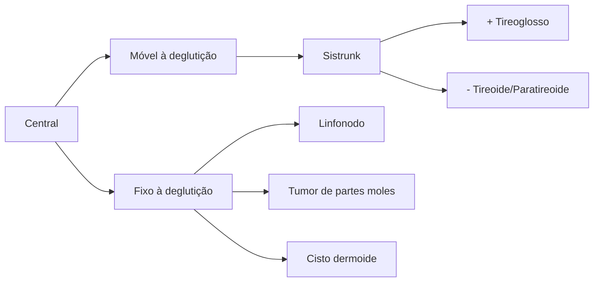
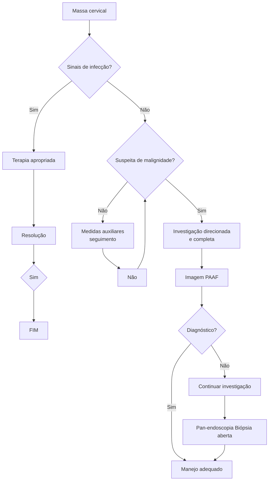

Massas cervicais

# DIAGNÓSTICOS DIFERENCIAIS DE MASSAS CERVICAIS

Alguns exemplos de massas cervicais tais como: Tireoidopatia, metástase cervical; Linfangioma; Toxoplasmose; Costela cervical; Tuberculose; Linfonodo recional; Sífilis secundária; Mononucleose; Rubéola; Lipomatose; Tumor marrom; Hemangioma; Linfoma; HIV; Paraganglioma; Cisto branquial; Sialoadenite; Caxumba; Citomegalovírus; Cisto dermoide; Sarcoma; Abscesso; Laringopatia; Paratireoidopatia.

[Grid of 26 clinical photographs showing various cervical masses and conditions]

## 1. TUMORES CERVICAIS

• Achado comum nas práticas médicas como manifestações de doenças locais ou sistêmicas.
• Dados importantes no raciocínio da diferenciação dos tumores cervicais:
  • Faixa etária;
  • História clínica;
  • Exame físico.

**Tabela 1** Etiologia dos tumores cervicais.

| CONGÊNITAS                 | INFLAMATÓRIAS       | NEOPLÁSICAS         |
| -------------------------- | ------------------- | ------------------- |
| Cisto do ducto tireoglosso | Linfonodo reacional | Tireoide            |
| Linfangioma                | Abscesso cervical   | Sarcoma             |
| Costela cervical           | Toxoplasmose        | Laringe             |
| Hemangioma                 | HIV                 | Glândulas salivares |
| Cisto branquial            | Sialoadenite        | Linfoma             |
| Cisto dermoide             | Mononucleose        | Paraganglioma       |
|                            | Rubéola             | Metástase cervical  |
|                            | Citomegalovírus     | Tumor marrom        |
|                            | Tuberculose         | Paratireoide        |
|                            | Sífilis secundária  |                     |

CIRURGIA DE CABEÇA E PESCOÇO

| Inflamatórios congênitos e outros | 20% |          |     |           |     |                                   |         |
| --------------------------------- | --- | -------- | --- | --------- | --- | --------------------------------- | ------- |
| Neoplasias                        | 80% |          |     |           |     |                                   |         |
|                                   |     | Benignos | 20% |           |     |                                   |         |
|                                   |     | Malignos | 80% |           |     |                                   |         |
|                                   |     |          |     | Primários | 20% |                                   |         |
|                                   |     |          |     | Metástase | 80% |                                   |         |
|                                   |     |          |     |           |     | 1º Infraclav. Tu cabeça e pescoço | 20% 80% |

**Figura 1** Avaliação das massas cervicais não tireoidianas em adulto.

## 3. INVESTIGAÇÃO DIAGNÓSTICA

A anamnese, exame físico e exames complementares, devem ter foco especial na abordagem dos diagnósticos diferenciais.

## 4. ANAMNESE

**Tabela 2** Idade do paciente.

|    | 0 – 15 anos               | 15 – 40 anos              | > 40 anos                 |
| -- | ------------------------- | ------------------------- | ------------------------- |
| 1º | Inflamatório / infeccioso | Inflamatório / infeccioso | Neoplasia                 |
| 2º | Congênitas                | Congênitas                | Inflamatório / infeccioso |
| 3º | Neoplasia                 | Neoplasia                 | Congênitas                |

**Tempo de Evolução:**
- < 30 dias – Doença aguda → Inflamatória/infecciosa
- 1 a 4 meses – Doença subaguda → Neoplasia;
- > 4 meses – Doença crônica → Congênitas, Neoplásicas benignas ou inflamatórias.

**Localização do tumor:**
- Linha média (região anterior) → pode estar relacionado com processo inflamatório/infeccioso;
- Triângulos (mais genéricos);
- Altas ou baixas;
- Níveis cervicais: São as cadeias linfonodais principais de drenagem (importante no estadiamento neoplásico).

**Triângulos cervicais:**
- Tr. Occipital: Região posterior – entre M. Esternocleidomastóideo e M. Trapézio;
- Tr. da Fossa Omoclavicular: Supraclavicular – entre o M. Omo-hioide e a clavícula;
- Tr. Submandibular: Abaixo da mandíbula – entre o M. Digástrico anterior e posterior;
- Tr. Submentoniano: Abaixo do mento – entre os ventres anteriores do M. Digástrico;

- Tr. Carótico: Localização das Aa. Carótidas – entre M. Esternocleidomastóideo e o M. Omo-hioide;
- Tr. Muscular: Entre o m. Esterno-hióideo e o M. Omo-hióideo.

**Figura 2** Imagem das divisões do pescoço em triângulos (em vermelho).
- Níveis cervicais: grupamentos linfonodais do pescoço organizados.

**Figura 3** Imagem da divisão do pescoço em Níveis cervicais.

**Aspecto da lesão:**
- Cística → geralmente são doenças congênitas;
- Fibroelástica → inflamatórias;
- Endurecida → neoplasias benignas ou malignas;
- Endurecida e fixa → neoplasia maligna.

**Sinais e sintomas associados:**
- Febre, rash cutâneo, dor → Inflamatórias
- Disfagia, dispneia, disfonia, otalgia → Neoplasia;
- Perda de peso → Neoplasia avançada;

DIAGNÓSTICOS DIFERENCIAIS DE MASSAS CERVICAIS                                                                         3

• Sintomas de compressão (extrínseca) → Congênitas ou neoplasias benignas.

**Antecedentes pessoais e familiares:**
• Tabagismo e etilismo;
• História familiar de câncer;
• HPV/HIV;
• História de radioterapia prévia.

**Dados epidemiológicos:**
• Contatos familiares;
• Contato com animais;
• Viagens.

## 5. EXAME FÍSICO

• Exame físico geral;
• Orofaringoscopia;
• Laringoscopia;
• Palpação cervical;
• Importante pesquisar:
  • Sítio primário dos tumores;
  • Número de linfonodos comprometidos
  • Cadeias linfonodais comprometidas
  • Aspecto da lesão: Cística, Fibroelástica, Endurecida, Dor, Tamanho, Mobilidade, Forma.

**Figura 4** Orofaringoscopia de paciente.

## 6. EXAMES COMPLEMENTARES

**Exames laboratoriais:**
• Sorologias:
  • Toxoplasmose;
  • Rubéola;
  • EBV;
  • CMV;
  • HIV;
  • Sífilis.
• Testes cutâneos: PPD;
• Hemograma;
• Cultura e antibiograma.

**Exames de imagem:**
• Ultrassonografia;
• Tomografia computadorizada;
• Ressonância magnética;
• Angiografia.

**Endoscopias:**
• Nasofibrolaringoscopia;
• Broncoscopia;
• Endoscopia digestiva alta.

**Biópsias**
• Core Biopsy: Punção por agulha grossa.
• PAAF: Punção por agulha fina.
  • **Método preferencial**, guiado ou não por USG;
  • **Contraindicações**: Lesões vasculares (ou suspeita), Distúrbios de coagulação;
  • Não avalia histologia → Pode ou não ser conclusivo;
  • Não prejudica o prognóstico.

**Biópsia aberta (incisional ou excisional):**
• Indicação deve ser criteriosa → doença linfoproliferativa ou TB;
• Piora do prognóstico em alguns tipos de neoplasia;
• Útil para planejamento de incisões;
• Sempre é a última opção.

## 7. FLUXOGRAMAS PARA INVESTIGAÇÃO DE MASSA CERVICAL



**Figura 5** Fluxograma de investigação de massa cervical de localização central.

# CIRURGIA DE CABEÇA E PESCOÇO

## Figura 6 Fluxograma de investigação de massa cervical de localização Lateral.

```mermaid
flowchart TD
    Lateral[Lateral] --> Cistico[Cístico]
    Lateral --> Fibroelastico[Fibroelástico]
    Lateral --> Endurecido[Endurecido]
    Lateral --> Pulsatil[Pulsátil]

    Cistico --> CistoBraquial[Cisto Braquial]
    Cistico --> Linfangioma[Linfangioma]
    Cistico --> LinfonodoCistico[Linfonodo Cístico]

    LinfonodoCistico --> Metastase1[Metástase]

    Metastase1 --> CECorofaringe[CEC orofaringe
HPV+]
    Metastase1 --> Tireoide1[Tireoide (papilífero)]

    Fibroelastico --> Linfonodo[Linfonodo]

    Linfonodo --> Reacional[Reacional]
    Linfonodo --> Metastase2[Metástase]
    Linfonodo --> Linfoma[Linfoma]

    Reacional --> Sorologias[Sorologias]

    Metastase2 --> CECtrato[CEC trato aerodigestivo]
    Metastase2 --> Tireoide2[Tireoide]

    Linfoma --> Glandulas[Glândulas salivares]

    Endurecido --> Sarcoma[Sarcoma]
    Endurecido --> TumorDesmoide[Tumor desmoide]

    Pulsatil --> Paraganglioma[Paraganglioma]
```

## Figura 7 Fluxograma de manejo da investigação de massas cervicais.



DIAGNÓSTICOS DIFERENCIAIS DE MASSAS CERVICAIS    5

# REFERÊNCIAS

**Figuras cofexpress**

Imagem de acervo pessoal Medcof.

**Figura 4** Orofaringoscopia de paciente.

Imagem de acervo pessoal Medcof.
