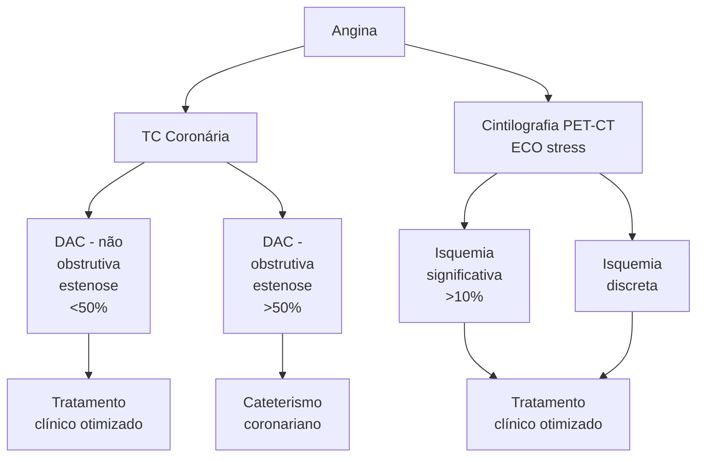
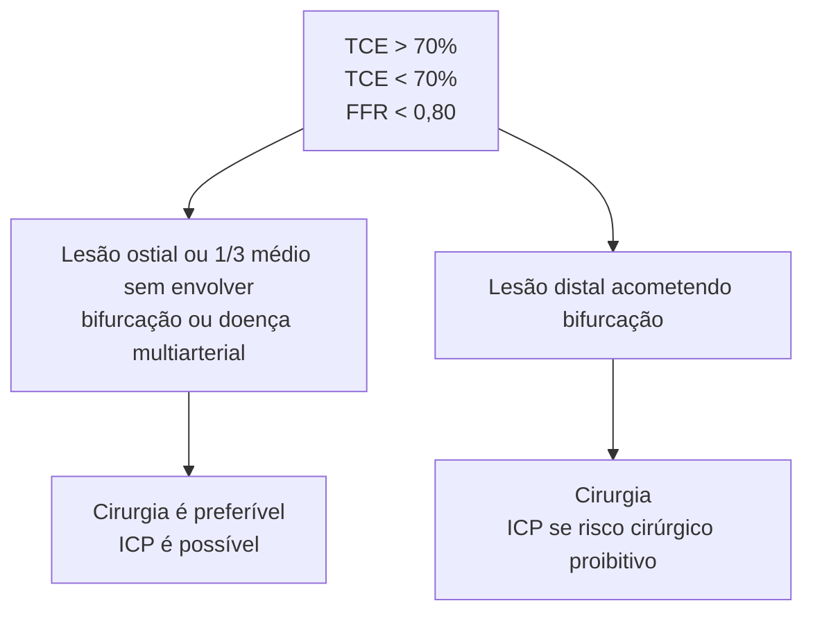
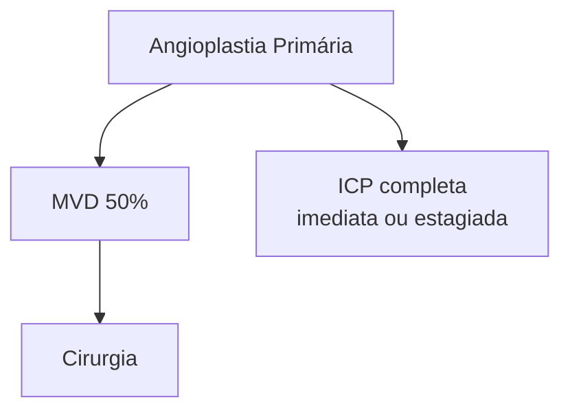
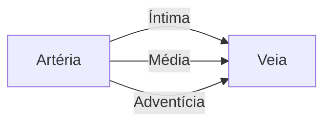
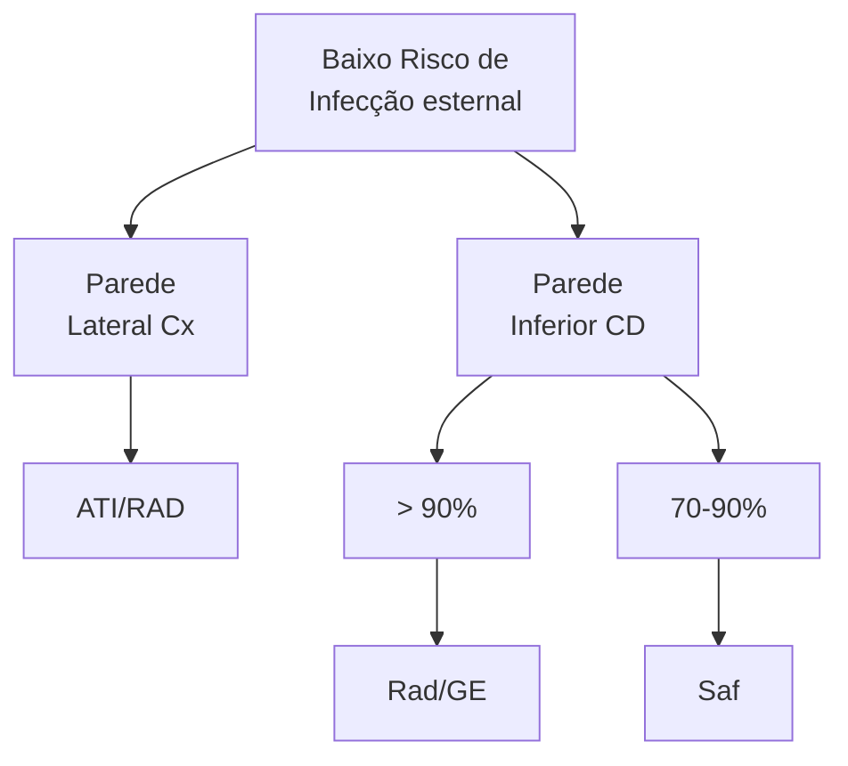
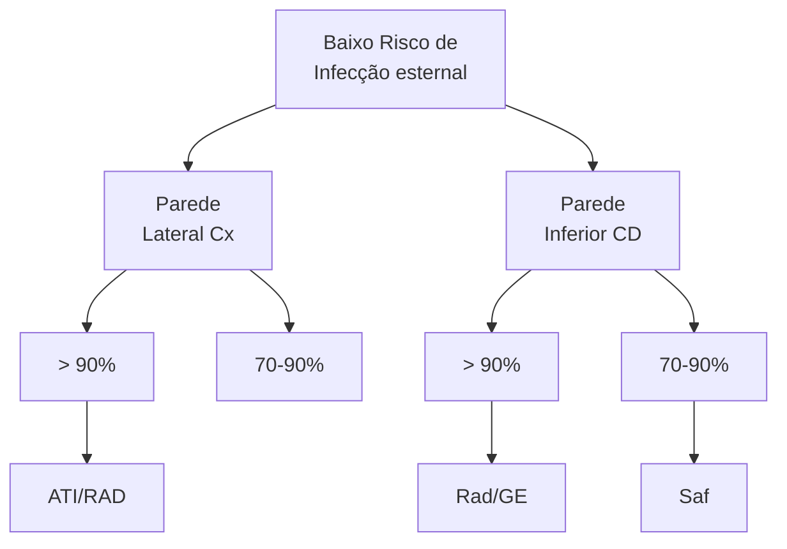

# DOENÇA CORONARIANA

• A cineangiocoronariografia (cateterismo cardíaco) é o exame padrão ouro para o diagnóstico da DAC. Testes não invasivos isoladamente são insuficientes para estratificação de risco destes pacientes.
• Na presença de disfunção ventricular esquerda e/ou sintomas de insuficiência cardíaca em pacientes com DAC, é recomendada a realização de cateterismo cardíaco para avaliar a anatomia coronariana e orientar uma potencial revascularização.
• Recomenda-se o uso de FFR para avaliação de lesões intermediárias/moderadas na angiografia coronária em pacientes com DAC sintomática.
• Em pacientes com angina associada a obstruções coronarianas importantes, a revascularização (cirurgia ou angioplastia) é indicada para melhora dos sintomas. Para aqueles com lesão grave de tronco da coronária esquerda (TCE) e/ou doença multiarterial com disfunção ventricular (FE < 35%), a revascularização é indicada para melhora da sobrevida.
• São indicações de revascularização cirúrgica do miocárdio: 1) lesão de tronco da coronária esquerda com obstrução > 50% + DAC complexa; 2) doença coronariana multiarterial complexa (SYNTAX > 33); 3) DAC multiarterial + disfunção ventricular (FE < 35%); 4) diabéticos com DAC multiarterial com lesão de DA proximal.
• A artéria torácica interna esquerda é preferivelmente usada para revascularizar a artéria descendente anterior. A artéria radial é recomendado em preferência à veia safena como segundo melhor enxerto para tratar estenoses graves.
• A revascularização do miocárdio sem circulação extracorpórea é indicada em pacientes com calcificação acentuada da aorta ascendente para reduzir o risco de AVC perioperatório

## 1. CONCEITOS

• A doença coronariana é uma das doenças cardiovasculares mais prevalentes no mundo com grande potencial de mortalidade;
• MACE (major adverse cardiovascular events): desfecho composto de AVC não fatal, infarto não fatal e morte por causa cardiovascular. Utilizado em diversos estudos para comparar o impacto das intervenções sobre as doenças cardiovasculares.

## 2. AVALIAÇÃO ANATÔMICA E FUNCIONAL

### • PET-CT/Cintilografia
• Localização do território isquêmico nas falhas de captação;
• Estratificação de risco (isquemia significativa > 10%) → nesses casos, está indicada a realização de um exame mais invasivo, sendo o padrão-ouro o cateterismo coronariano.

| Short Axis Slices                        |   |          | Vertical Long Axis Slices                     |   |          | Horizontal Long Axis Slices                     |   |      |
| ---------------------------------------- | - | -------- | --------------------------------------------- | - | -------- | ----------------------------------------------- | - | ---- |
| Anterior                                 |   |          | Anterior                                      |   |          | Apex                                            |   |      |
| \[Cardiac imaging showing anterior view] |   |          | \[Cardiac imaging showing vertical long axis] |   |          | \[Cardiac imaging showing horizontal long axis] |   |      |
|                                          |   |          |                                               |   |          | Inferior                                        |   |      |
| Anterior                                 |   |          |                                               |   |          |                                                 |   |      |
| \[Cardiac imaging showing anterior view] |   |          | \[Cardiac imaging showing vertical view]      |   |          | \[Cardiac imaging showing apex view]            |   |      |
|                                          |   | Inferior |                                               |   | Inferior |                                                 |   | Base |

Fonte: Videoaula.

### • TC coronária
• Pacientes sem diagnóstico de doença coronariana apresentando dor torácica típica ou atípica ou que se considere poder representar um equivalente isquêmico;
• Avaliação de pacientes após cirurgia de revascularização do miocárdio ou ICP com presença de sintomas para avaliação da patência dos enxertos ou stents.

### • Cateterismo coronariano
• Padrão-ouro para o diagnóstico e para guiar possível intervenção;
• Avaliação de pacientes com doença coronariana e persistência de sintomas de dor torácica apesar do tratamento clínico ou surgimento de sintomas de insuficiência cardíaca e disfunção ventricular;
• Injeção de contraste pela coronária direita ou pelo tronco da coronária esquerda;

• Recomenda-se o uso do FFR (reserva de fluxo fracionada) para avaliação de lesões intermediárias para guiar a decisão de revascularização durante a ICP (importante se < 0,8);
• A avaliação do SYNTAX score determina a gravidade da doença coronariana de acordo com 12 características anatômicas, sendo útil na predição de eventos adversos após ICP.
  • Syntax ≤ 2: baixo risco
  • Syntax 23-32: risco intermediário
  • Syntax ≥ 33: alto risco



Algoritmo para investigação de pacientes com dor torácica anginosa.
Fonte: Videoaula.

## 3. DIAGNÓSTICO DIFERENCIAL

• **Disfunção ventricular:**
  • ECO: fração de ejeção < 50%, com sintomas de insuficiência cardíaca ou não.
  • Nesses casos, é indicada a realização do cateterismo.

## 4. DIAGNÓSTICO

• **Lesões intermediárias (50-70%) ao cateterismo.**
  • Nesses casos, utiliza-se a Fraction Flow Reserve (FFR), que consiste na razão entre a pressão coronária distal (Pd) e a pressão coronária proximal (Pa) durante período de hiperemia máxima (injeção de adenosina), para identificar se a lesão é hemodinamicamente significativa. Quanto menor o valor, mais importante a lesão. FFR < 0,8 é significativo e indica abordagem.

**FFR = Pressão Coronária Distal (Pd) / Pressão Coronária Proximal (Pa)**

(Durante Hiperemia Máxima)

FFR

Reserva de Fluxo de Fração

FFR= Pd/Pa

Razão

**Hemodinamicamente Importante se < 0,8**

Fonte: Videoaula.

## 5. INDICAÇÃO CIRÚRGICA

• **Objetivos do tratamento intervencionista:**

**Melhora dos sintomas** (angina limitante) | **Prevenção de Eventos** (doença multiarterial) | **Melhora da sobrevida** (disfunção ventricular)

• **Indicações de intervenção (cirúrgica ou percutânea)**
  • Lesão de tronco da coronária esquerda > 50%;
  • Lesão proximal da artéria descendente anterior > 50%;
  • 2 ou 3 vasos com estenose > 50% associada a disfunção ventricular (< 35%); área de isquemia extensa (> 10%);
  • Artéria coronária derradeira com estenose > 50%;

• Estenose coronariana significativa na presença de angina limitante ou equivalente anginoso refratário ao tratamento clínico.

• **Cirurgia vs. ICP (intervenção coronariana percutânea):**

• Restaura o fluxo distalmente às lesões proximais;
• Proteção contra eventos isquêmicos futuros

• Trata o segmento coronariano ode o stent é implantado
• Maior taxa de infarto e necessidade de reintervenção

Fonte: Videoaula.

DOENÇA CORONARIANA                                                                                                                                    3

| ANGIOPLASTIA                                                                                                                           | REVASC CIRÚRGICA                                                                                                                                                         |
| -------------------------------------------------------------------------------------------------------------------------------------- | ------------------------------------------------------------------------------------------------------------------------------------------------------------------------ |
| Stent em CoronáriaStent
Lesão
limitanteLesão Não
limitanteCausa potencial de ruptura e oclusão trombótica não protegida!!! | Bypass Bypass BypassLesão
limitanteBypass Lesão Não
limitanteRevascularização cirúrgica promove proteção contra oclusões pela criação de colaterização cirúrgica |

Fonte: Videoaula.

• **Indicação cirúrgica**
  • Doença coronariana multiarterial (SYNTAX ≥ 33 ou presença de Diabetes Mellitus);
  • Lesão de tronco da coronária esquerda (lesão distal acometendo a bifurcação ou associado a doença multiarterial);
  • Doença coronariana multiarterial associado a disfunção ventricular (FE < 35%);
  • Cirurgia cardíaca por outra causa (ex: cirurgia valvar com presença de doença coronariana associada).

A angioplastia trata o segmento coronariano com lesão obstrutiva, mas não as lesões que não limitam o fluxo. A intervenção cirúrgica restaura o fluxo distalmente às lesões proximais com maior proteção contra eventos isquêmicos futuros (colaterização).

• **Lesão de tronco:**



Fonte: Videoaula.

## 6. ADENDO - SÍNDROMES CORONARIANAS AGUDAS

### 6.1 IAM com supra de ST (IAMCSST):



> **!** Nos pacientes com IAMCSST complicado com choque cardiogênico, a angioplastia de uma artéria não culpada no momento de angioplastia primária não deve ser realizada.

Nos pacientes com IAMCSST complicado com choque cardiogênico, a angioplastia de uma artéria não culpada no momento de angioplastia primária não deve ser realizada.

• **Tratamento cirúrgico de emergência:**
  • Infarto de uma área extensa e/ou choque cardiogênico a ICP não é possível ou mal sucedida.

• **Complicações mecânicas:**
  • CIV pós infarto (mais comum após o infarto anterior extenso, distribuição bimodal, presença de sobro novo holossistólico, supraST resistente > 3 dias).;
  • Ruptura de parede livre;

• Insuficiência mitral por infarto do músculo papilar (mais comum músculo papilar posteromedial, quadro agudo de insuficiência cardíaca por aumento súbito da pressão capilar pulmonar, flail da cúspide relacionada e falha de coaptação.
• Cirurgia: revascularização do miocárdio e troca mitral (plastia valvar não é factível na insuficiência valvar aguda).

### 6.2 IAM sem supra de ST (IAMSSST):

• Quando indicar estratégia invasiva precoce (<24h) - revascularização percutânea ou cirurgia:
  • Alto risco de evento isquêmico recorrente (GRACE > 140)
  • Angina refratária
  • Instabilidade hemodinâmica ou elétrica (arritmia ventricular, alteração dinâmica de ST ou inversão de T).

• **Pacientes estáveis com risco baixo/ intermediário:**
  • Estratégia invasiva até 48-72h;
  • Revascularização antes da alta hospitalar.

• **Considerar o tempo de suspensão do antiplaquetário antes da cirurgia:**
  • Clopidogrel: 5-7 dias
  • Ticagrelor: 3-5 dias
  • AAS não deve suspender

## 7. ENXERTOS

• **Enxertos:**
  • Arterial (a. Torácica interna, a. Radial, a. Gastroepiploica direita) → risco de competição de fluxo;
  • Venoso (v. safena magna) → risco de hiperplasia intimal.

**Enxerto venoso (em azul):** Safena; **Enxerto arterial (em vermelho):** mamária ou artéria torácica interna, artéria radial, artéria gastroepiplóica, artéria epigástrica.

DOENÇA CORONARIANA                                                                                                                                                                                                   5



Comparação entre as paredes arterial (esquerda) e venosa (direita). Fonte: Videoaula.

| para LAD
Estenose proximal (%)	Patência (em anos)
40	10
50	20
60	30
70	40
80	50
90	60
100	70
	100 |
| ----------------------------------------------------------------------------------------------------------------------------------------------------- |

ITA (linha superior, ~95-100%)
SVG (linha inferior, ~85-90%)
</td>
<td>

| para RCA              |                    |
| --------------------- | ------------------ |
| Estenose proximal (%) | Patência (em anos) |
| 40                    | 10                 |
| 50                    | 20                 |
| 60                    | 30                 |
| 70                    | 40                 |
| 80                    | 50                 |
| 90                    | 60                 |
| 100                   | 70                 |
|                       | 80                 |
|                       | 90                 |
|                       | 100                |

ITA (linha superior)
SVG (linha inferior)
</td>
</tr>
</table>

Conforme a lesão proximal no leito nativo diminui, aumenta a competição de fluxo. A redução do grau de lesão proximal diminui discretamente a patência da artéria torácica interna na DA, porém diminui significativamente a patência na CD. Fonte: Videoaula.

## Artéria torácica interna:
- A ATI esquerda é o enxerto padrão-ouro para revascularização da DA;
- Superior a safena em 10 anos (> 90% de patência);
- Menos suscetível a aterosclerose;
- Uso da ATI bilateral pode ser considerado se houver baixo risco de infecção (não diabéticos);
- Dissecção esqueletizada está associada a menor risco de infecção esternal e, por isso, é mandatória.

## Artéria radial:
- A artéria radial é recomendada como segundo enxerto para lesões coronarianas graves (superior a veia safena);
- Mais suscetível a vasoespasmo e competição de fluxo (camada média com maior espessura de fibras musculares);
- Utilidade da terapia anti-espasmo a longo prazo (bloqueador de canais de cálcio);
- De acordo com a gravidade das lesões, recomenda-se utilizá-la se: lesão > 70% no território da CE ou > 90% na CD.

Artéria torácica interna. Fonte: Videoaula. A artéria descendente anterior deve ser tratada com a mamária (Classe I); A artéria radial é recomendado acima da safena em pacientes com estenose coronariana importante.

Fonte: Gaudino M, Taggart D, Suma H, Puskas JD, Crea F, Massetti M. Choice of conduits in coronary artery bypass surgery. J Am Coll Cardiol 2015;66:1729–37.

Falha do enxerto

```mermaid
graph LR
    A[Taxa de risco: 0.44 (95% CI, 0.28-0.70)]
```

| Enxerto (%)     | 0-100 scale with curves showing Veia Safena and Artéria Radial over 9 years |     |    |    |
| --------------- | --------------------------------------------------------------------------- | --- | -- | -- |
| Índice de risco |                                                                             |     |    |    |
| Veia Safena     | 307                                                                         | 210 | 62 | 9  |
| Artéria Radial  | 345                                                                         | 233 | 48 | 20 |

• **Artéria gastroepiplóica direita:**
  • Ramo da artéria gastroduodenal, localizada entre as camadas do omento maior;
  • Baixa incidência de aterosclerose e bom fluxo, porém é pouco utilizada;
  • Melhor alvo: CD distal com lesão > 90%;
  • Dissecção esqueletizada apresenta melhores resultados de patência.

• **Veia safena magna**
  • A técnica "no-touch" potencialmente possui melhores resultados no longo prazo em comparação à técnica esqueletizada, mas aumenta o risco de complicações no membro;
  • A dissecção endoscópica reduz o risco de complicações de ferida;
  • Maior suscetibilidade a aterosclerose e **hiperplasia intimal (migração de células musculares da camada média para a íntima, levando à oclusão do enxerto)**;
  • **Indicada principalmente para lesões não críticas no território direito ou quando houver contraindicação de outro enxerto arterial.**

## 8. RESUMO - RECOMENDAÇÕES

• ATIE deve ser usada para revascularização da DA;
• Artéria radial deve ser usada como segundo enxerto arterial para tratar lesões graves;
• O uso de ATI bilateral deve ser evitada em pacientes com alto risco de infecção esternal (diabéticos, obesos, tabagista);

• A dissecção esqueletizada da ATI é recomendada para reduzir o risco de infecção;
• Artéria gastroepiploica direita esqueletizada pode ser usada para tratar lesões críticas (>90%) na CD;
• Veia safena é preferivelmente utilizada para tratar a CD em lesões não críticas (<90%) ou quando não for possível outro enxerto arterial.





Fonte: Videoaula.

## 9. REVASCULARIZAÇÃO SEM CEC

• Principal indicação: calcificação acentuada da aorta (aorta em porcelana) para diminuir o risco de AVC perioperatório por embolização de placas ao clampeamento da aorta;

• Pacientes com DPOC podem se beneficiar por se associar e menor tempo de ventilação mecânica.

DOENÇA CORONARIANA                                                                                                                                                                                                              7

Aorta em porcelana vista em corte axial pela tomografia de tórax. Fonte: Videoaula.
