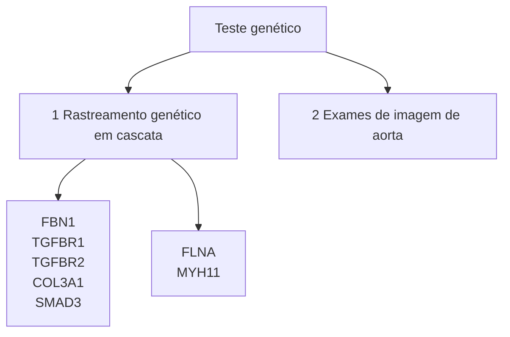

# DOENÇA DA AORTA

• As doenças da aorta incluem os aneurismas da aorta, as síndromes aórticas agudas (dissecção de aorta, hematoma intramural e úlcera penetrante de aorta) lesões traumáticas da aorta, afecções ateroscleróticas, infecciosas e inflamatórias, e doenças genéticas ou congênitas (ex: Sd. Marfan, valva aórtica bicúspide).

• O limite de diâmetro da aorta para indicação de abordagem cirúrgica em aneurismas da aorta ascendente esporádicos é de 55 mm. Naqueles com aneurismas hereditários e em cenários específicos, o limite de indicação pode ser menor.

• A velocidade rápida de crescimento para indicação de intervenção em pacientes com aneurismas esporádicos é definida como > 0,5 cm em 1 ano ou > 0,3 cm por ano em 2 anos consecutivos, ou > 0,3 cm em 1 ano para aneurismas hereditários ou valva aórtica bicúspide.

• Indica-se intervenção cirúrgica de urgência/ emergência na dissecção aguda de aorta tipo A de Stanford e na dissecção tipo B complicada (ruptura, má perfusão orgânica, dor refratária). Nesta última, o tratamento endovascular é preferível, quando possível.

• A angiotomografia de aorta tornou-se o exame padrão ouro para o diagnóstico das doenças da aorta, devido a sua ampla disponibilidade e rápida aquisição de imagens de alta resolução em 3 dimensões.

• Em pacientes com aneurismas da aorta ascendente e dissecção da aorta, recomenda-se o screening com exame de imagem aorta em parentes de 1º grau.

## 1. ANEURISMA DE AORTA

• É definida como: dilatação permanente e localizada de pelo menos 1.5x o diâmetro normal da artéria;

• 60% dos aneurismas são da raiz e da aorta ascendente;

• Dimensões Normais:

**Diagrama da aorta com dimensões:**
- Aorta ascendente: 2.5-35cm
- Arco Aórtico: 2.5-3cm
- Aorta descendente: 2-3cm
- Junção Sinotubular: 2-3cm
- Sinusóide de Valsalsa: 2.5-3.5cm
- annulus aórtico: 2-3cm
- Aorta diafragmática: 2-2.5cm
- aorta infrarrenal: 1.5-2cm

Dimensões de cada parte de uma aorta saudável.

**Ilustração das três camadas da aorta:**
- Íntima
- Média
- Adventícia

### 1.1 Histologia:

DOENÇA DA AORTA                                                                                                              239

## Comparação de métodos de imagem da aorta

| Vantagensdesvantagens:                   | ETT | ETE | TC      | RM    | Aorto-grafia |
| ---------------------------------------- | --- | --- | ------- | ----- | ------------ |
| Fácil de usar                            | +++ | ++  | +++     | ++    | +            |
| Confiabilidade de
diagnóstico        | +   | +++ | +++     | +++   | ++           |
| Uso/intervenção à
beira do leito (a) | ++  | ++  | -       | -     | ++           |
| Exames seriados                          | ++  | +   | +++ (b) | +++   | -            |
| Visualização da
parede aórtica       | +   | +++ | +++     | +++   | -            |
| Custo                                    | -   | -   | - -     | - - - | - - -        |
| Radiação                                 | 0   | 0   | - - -   | -     | - -          |
| Nefrotoxicidade                          | 0   | 0   | - - -   | - -   | - - -        |

+ significa uma observação positiva e - significa uma observação negativa. O número de sinais indica o valor potencial estimado; a → Ultrassom intravascular pode ser usado para orientar as intervenções (consulte os adendos da web); b → + + + apenas para acompanhamento após implante de stent aórtico (suportes metálicos), caso contrário limitar a radiação; c → PET pode ser usado para visualizar suspeita de doença inflamatória aórtica; TC = tomografia computadorizada; RM = ressonância magnética; ETE = ecocardiografia transesofágica; ETT = ecocardiografia transtorácica.

## Ressonância magnética:

• **Vantagens**: Não invasiva; Sem contraste ou irradiação; Imagens em vários planos; Patência coronariana (gadolínio);

• **Desvantagens**: Pacientes com MP, desfibriladores e clipes; Dificuldade de identificar regurgitação aórtica; Contra-indicado para pacientes instáveis (exame demorado).

## Ecocardiografia:

• **Vantagens**: Prontamente disponível, beira do leito; Não invasivo; Sem contraste ou irradiação; Informações funcionais sobre válvulas e derrame pericárdico / tamponamento;

• **Desvantagens**: Janela adequada (ETT); Limitação para aorta ascendente e arco devido a interposição da traquéia (ETE).

## Angiotomografia de aorta:

• **Vantagens**: não invasiva, rápida aquisição com alta resolução, identifica diâmetros com precisão, alta sensibilidaed para síndromes aórticas agudas.

• **Desvantagens**: contraste IV, não realiza avaliação funcional e dinâmica.

• **Angiografia**: Controversa; DAC associada (realizada durante o CATE).

• **ECG**: Excluir DAC (doença arterial coronariana) associada.

# 3. INDICAÇÕES

## 3.1 Indicações de rastreio

### Indicação de rastreio no aneurisma de aorta hereditário:

• História familiar de aneurisma de aorta, morte súbita inexplicada e aneurismas periféricos ou intracraniano;

• Características de síndrome de Marfan, Loeys-Dietz, Ehlers-Danlos, Turner;

• Idade < 60 anos com presença de aneurisma.

### Teste genético

Realizar o rastreio em familiares de primeiro grau. Fonte: Videoaula.

### Fatores de risco para dissecção e ruptura do aneurisma de aorta hereditário:

• História familiar de dissecção com diâmetro da aorta < 5,0 cm

• História de morte súbita inexplicada na família com idade < 50 anos

• Dilatação da aorta > 0,5 cm em 1 ano ou > 0,3 cm/ ano em 2 anos consecutivos.

## Síndrome de Marfan:

• Alta estatura, membros desproporcionalmente longos, alteração da caixa torácica, luxação do cristalino.

• Mutação do gene FBN1.

• Fatores de risco: história familiar de dissecção, dilatação > 0,3cm/ano, dilatação difusa da raiz e aorta ascendente, tortuosidade da artéria vertebral.

## Síndrome de Turner:

• Deleção parcial ou completa de um cromossomo X.

• Recomenda-se utilizar o diâmetro aórtico indexado (ASI).

• Fatores de risco para dissecção: dilatação da aorta, hipertensão arterial, BAV, e coarctação da aorta.

• Cirurgia pode ser recomendada em pacientes > 15 anos, com fatores de risco e ASI > 2,5 cm/m2.

## Valva aórtica bicúspide (BAV):

• Afeta 1% da população

• Pode ocorrer de forma isolada ou associado a outros defeitos congênitos e aortopatias.

• Geralmente se associa a disfunção valvar (estenose ou insuficiência) e possui risco aumentado de endocardite infecciosa.

• Pacientes que apresentam dilatação da raiz da aorta (root phenotype) podem ter uma velocidade de dilatação mais acelerada e risco maior de complicações.

• Fatores de risco para dissecção: história familiar de dissecção, dilatação > 0,3cm/ano, coarctação da aorta, dilatação da raiz da aorta.

## 3.2 Indicação cirúrgica:

**Todos os sintomáticos**

| 55 mm        | Aneurisma esporádico e assintomático                                                                                            |                                                                                                                                           |
| ------------ | ------------------------------------------------------------------------------------------------------------------------------- | ----------------------------------------------------------------------------------------------------------------------------------------- |
| 50 mm        | Aneurisma hereditário não sindrômico
Sd. de Marfan
Valva aórtica bicúspide + fatores de risco                           | História familiar de dissecção
Dilatação > 0,3 cm/ano
Coarctação da aorta
Dilatação da raiz da aorta                          |
| 45 mm        | Aneurisma hereditários + fatores de risco
Sd. de Marfan + alto risco de dissecção
Cirurgia cardíaca por outra indicação | História familiar de dissecção < 50 mm
Morte súbita < 50 anos
Dilatação > 0,5 cm/ano                                              |
| 40-45
mm | Loeys-Dietz ± alto risco de dissecção                                                                                           | Variantes genéticas (TGFBR, SMAD3)
Alterações craniofaciais importantes
História familiar de dissecção
Dilatação > 0,3 cm/ano |

Fluxograma de indicação cirúrgica no aneurisma de raiz e de arco de aorta. Fonte: Videoaula.

## 4. TRATAMENTO CLÍNICO:

**Diminuição do Stress na Aorta:**
• Betabloqueadores: efeito inotrópico e cronotrópico.

**Controle da PA:**
• Reduzir pressão arterial média e variações de pressão: bloqueadores do receptor da angiotensina.

## 5. TÉCNICAS CIRÚRGICAS

**5.1 O aneurisma é restrito à aorta ascendente ou compromete a raiz da aorta?**

• Interposição de tubo supracoronariano. Se houver disfunção da valva aórtica (estenose ou insuficiência), pode-se associar a troca da valva.

[Diagram showing aorta with graft interposition - labeled "Aorta" and "Graft"]

Fonte: Videoaula.

**5.2 Se a raiz da aorta é dilatada, a valva pode ser preservada?**

• Operação de Bentall-De Bono: tratamento de aneurisma acometendo a raiz da aorta. Utiliza-se um tubo de dacron valvado e realiza-se o reimplante das coronárias.

[Diagram showing Bentall-De Bono procedure with valve replacement and coronary reimplantation]

Fonte: Videoaula.

DOENÇA DA AORTA                                                                                                                                          241

## 5.3 O aneurisma se estende até o arco aórtico e aorta descendente?

• Substituição do arco total (Frozen Elephant Trunk): Substituição do arco aórtico. Prótese híbrida com endoprótese para aorta descendente.

[Two medical diagrams showing aortic arch replacement procedures]

Fonte: Videoaula.

Fonte: Videoaula.

• Operação de Tirone David: Aneurisma acometendo a raiz da aorta, com preservação da valva aórtica. É uma alternativa ao Bentall.

[Medical diagram showing Tirone David operation]

Fonte: Videoaula.

## 6. SÍNDROMES AÓRTICAS AGUDAS

| Aortic dissection | Intramural hematoma | Penetrating atherosclerotic ulcer | Aortic dissection | Intramural hematoma | Penetrating atherosclerotic ulcer |
| ----------------- | ------------------- | --------------------------------- | ----------------- | ------------------- | --------------------------------- |
|              |                |                              |              |                |                              |

Fonte: Videoaula.

## 6.1 Patogênese:

• Trauma;
• Degeneração da média – deterioração do colágeno e elastina;
• Idade;

• HAS;
• Marfan e Ehlers-Danlos – defeito do tecido conectivo;
• Arterites, coarctação da Ao, lesão valvar Ao, cateterismo, cirurgia, gravidez e drogaditos.

### Dissecção Clássica

Degeneração da Camada lédia

↓

Rotura da íntima

↓

Delaminação da média

↓

Falsa luz

**Dissecção Clássica.**

### Dissecção Atípica (Hematoma Intramural)

Hematoma intramural (rotura do vasa vasorum da média)

↓

Dissecção da parede aórtica

↓

Como ou sem rotura da íntima

↓

Falsa luz

**Dissecção Atípica (Hematoma Intramural).**

### Dissecção Atípica (Úlcera Aórtica Perfurada)

Substrato anatômico de Aterosclerose

↓

Rotura da íntima

↓

Dissecção

**Dissecção Atípica (Úlcera Aórtica Perfurada).**

DOENÇA DA AORTA<page_header>
DOENÇA DA AORTA                                                                                                                                                           243

## 6.2 Dissecção aórtica aguda

• Mortalidade 1%/hora nas primeiras 48h.
• Diagnóstico pode ser desafiador.

| Sinais clássicos                                                           | Causa                                                                                        |
| -------------------------------------------------------------------------- | -------------------------------------------------------------------------------------------- |
| Assimetria de pulsos e diferencial de pressão entre os membros (> 20 mmHg) | Compressão vascular com comprometimento do fluxo sanguíneo periférico                        |
| Dispneia                                                                   | Compressão do brônquio, edema agudo de pulmão (insuficiência aórtica), tamponamento cardíaco |
| Isquemia miocárdica                                                        | Dissecção ou compressão coronariana                                                          |
| Sopro de insuficiência aórtica                                             | Desabamento dos folhetos da valva aórtica ou dissecção envolvendo a raiz da aorta            |
| Choque circulatório                                                        | Tamponamento, ruptura da aorta, insuficiência aórtica grave, isquemia miocárdica             |
| Déficit neurológico/AVC                                                    | Envolvimento da artéria carótida ou vertebral                                                |
| Isquemia de membros inferiores                                             | Má perfusão da artéria ilíaca                                                                |
| Isquemia mesentérica                                                       | Má perfusão do tronco celíaco ou artéria mesentérica superior                                |
| Oligúria ou hematúria                                                      | Má perfusão das artérias renais                                                              |
| Paraplegia                                                                 | Má perfusão medular por acometimento dos ramos intercostais                                  |

Fonte: Videoaula.

**Síndrome de má perfusão:**
• Origem dos sinais e sintomas na dissecção aórtica.

Pode ocorrer por dois mecanismos:
• Invasão da dissecção em ramo visceral, obstruindo-o.
• Compressão de ramo visceral pela falsa luz.

**A**

Diagrama mostrando trombo, lúmen verdadeiro e lúmens falsos na dissecção aórtica.

**B**

Diagrama mostrando lúmen patente, lúmens falsos e lúmen verdadeiro na dissecção aórtica.

## 6.3 Insuficiência aórtica:

Três diagramas mostrando a progressão da dissecção aórtica e seu efeito na valva aórtica.

A dissecção leve à dilatação da aorta ascendente, afastando os folhetos da valva aórtica e levando à insuficiência (primeira imagem). Outros mecanismos seriam a invasão da valva pela dissecção (segunda imagem) ou a destruição da raiz da aorta (terceira imagem). Fonte: Videoaula.

## 6.4 Diagnóstico:

• Radiografia de tórax: não possui sensibilidade e especificidade suficientes, mas seus achados devem levantar suspeitas para o diagnóstico de dissecção de aorta.

Radiografia de tórax mostrando alargamento do mediastino.

São observados o alargamento do mediastino, a perda do contorno do botão aórtico e alargamento da silhueta cardíaca. Fonte: Videoaula.

## 6.5 Diagnóstico por imagem:

• Nos pacientes com suspeita de dissecção de aorta, a TC é o exame recomendado para o diagnóstico inicial;
• O ECO transesofágico pode ser uma alternativa para o diagnóstico (maior sensibilidade do que o transtorácico);
• O ECO transtorácico pode ser feito à beira-leito e pode ser útil em identificar complicações (IAo, tamponamento).

Imagens de ecocardiograma transtorácico mostrando:
- LA (átrio esquerdo)
- Ao (aorta)
- VI (ventrículo esquerdo)

Delaminação da aorta visível ao ECO transtorácico. Fonte: Videoaula.

Tomografia computadorizada mostrando:
- FL (lúmen falso)
- TL (lúmen verdadeiro)

www.radiopaedia.org
Tomografia demonstrando o lúmen falso (FL), que supera o verdadeiro (TL) em tamanho.

DOENÇA DA AORTA                                                                                                                          245

## Como diferenciar a lux verdadeira da luz falsa na angiotomografia?

|           | Luz Verdadeira   | Luz Falsa                                                                                 |
| --------- | ---------------- | ----------------------------------------------------------------------------------------- |
| Tamanho   | Geralmente menor | Geralmente maior (maior pressão, menor resistência)                                       |
| Formato   | Arredondada      | Crescente                                                                                 |
| Contraste | Normal           | Menos densa na fase arterial
Realce na fase tardia                                    |
| Trombose  | Incomum          | Comum                                                                                     |
| Sianais   |                  | Sinal do bico (beak),
Sinal da biruta (windsock)
Sinal da teia de aranha (cobweb) |

Fonte: Videoaula.

## 6.6 Classificação Anatômica:

**Classificação DeBakey**

Tipo I - envolvimento da aorta ascendente e descendente

Tipo II - apenas ascendente

Tipo IIIa - descendente respeitando o diafragma

Tipo IIIb - envolve aorta abdominal também

**Classificação de Sanford**

Tipo A - envolvimento da aorta ascendente

Tipo B - não envolve aorta ascendente

A classificação mais utilizada é de Stanford: Tipo A → envolvimento da aorta ascendente; Tipo B → não envolve aorta ascendente. Além da Stanford, também existe a de DeBakey: tipo 1 - ascendente e descendente, tipo 2 - apenas ascendente. Tipo 3a: descendente respeitando o diafragma, e, tipo 3b envolve aorta abdominal também.

## 6.7 Diagnóstico:

| Lesão                          | ETT | ETE | TC  | RM  |
| ------------------------------ | --- | --- | --- | --- |
| Dissecção da aorta ascendente  | ++  | +++ | +++ | +++ |
| Dissecção do arco aórtico      | +   | +   | +++ | +++ |
| Dissecção da aorta descendente | +   | +++ | +++ | +++ |
| Size                           | ++  | +++ | +++ | +++ |
| Tamanho                        | +   | +++ | +++ | +++ |
| hematoma intramural            | +   | +++ | ++  | +++ |
| Úlcera Aórtica Penetrante      | ++  | ++  | +++ | +++ |
| Envolvimento de ramos aórticos | +\* | (+) | +++ | +++ |

a: Pode ser melhorado quando combinado por ultrassom vascular (artérias carótidas, subclávias, vertebrais, celíacas, mesentéricas e renais);

+++: excelente; ++: moderado; + : ruim; (+) : pobre e inconstante;

**TC**: tomografia computadorizada;

**RM**: ressonância magnética;

**ETE**: ecocardiografia transesofágica;

**ETT**: ecocardiografia transtorácica.

## 6.8 Abordagem inicial:

### Paciente com diagnóstico de dissecção de aorta:

• Terapia anti-impulso: PAS < 120mmHg e FC 60-80 Betabloqueador intravenoso* e/ou nitroprussiato** *Exceto se IAo grave, BAV, bradicardia **Evitar como terapia inicial pelo risco de taquicardia reflexa

• Monitorização invasiva da PA

• Controle da dor, utilizando opióides

### Abordagem cirúrgica?

• Tipo A: Cirurgia de emergência: aorta ascendente e/ ou arco aórtico

• Tipo B: complicada*** TEVAR: *** Ruptura, má perfusão renal ou mesentérica, isquemia de extremidades, dor refratária. TEVAR: Reparação endovascular da aorta torácica.

## 6.9 Objetivos do tratamento

• Prevenir ou tratar a ruptura da aorta

• Prevenir a dissecção retrógrada para a raiz da aorta: risco de insuficiência aórtica e dissecção coronariana (ou seja, risco de IAM)

• Impedir a propagação distal da dissecção

• Restabelecer o fluxo para os órgãos com má perfusão

## 6.10 Pontos importantes

• Sítio da canulação: cirurgia com CEC geralmente é feita pela aorta ascendente. Nesses casos, são utilizados sítios menos habituais, como artéria axilar (preferível), tronco braquiocefálico, eventualmente o arco aórtico, ou até a artéria femoral.

• Hipotermia profunda: < 35 graus.

• Ressecção ampla

• Anastomose open distal: durante a anastomose distal, realizá-la sem o pinçamento da aorta.

• Parada circulatória + perfusão cerebral anterógrada

## 6.11 Técnica cirúrgica

| Dissecção De aorta Tipo A
Raiz < 45 mm | Dissecção De aorta Tipo A
Insuficiência aórtica         | Dissecção De aorta Tipo A
Insuficiência aórtica | Raiz > 45 mmou orifício de entrada dadissecção na raiz |
| ------------------------------------------ | ----------------------------------------------------------- | --------------------------------------------------- | ------------------------------------------------------ |
| Tubo supra coronariano ±
hemiarco      | Tubo supra ± hemiarco
Ressuspensão da valva
aórtica | Tubo supra ± hemiarco
Troca valvar aórtica      | Bentall–De Bono                                        |
| \* Revascularização do
miocárdio       | Dissecção Síndrome de má                                    | envolvendo a perfusão
miocárdica                | artéria coronária após o
reparo                    |

Fonte: Videoaula.

• **Ressuspensão valvar aórtica:** se houver algum grau de insuficiência valvar aórtica associada devido ao desabamento do folheto da valva. Realizada pela re-fixação dos pilares dos três folhetos.

[Two medical illustrations showing valve leaflet repair technique]

Fonte: Videoaula.

[Medical illustration showing surgical technique with valve replacement and coronary artery reimplantation, including a detailed view of the valve structure]

Fonte: Videoaula.
