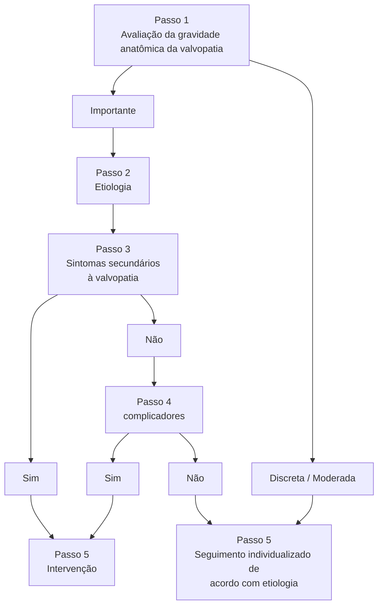
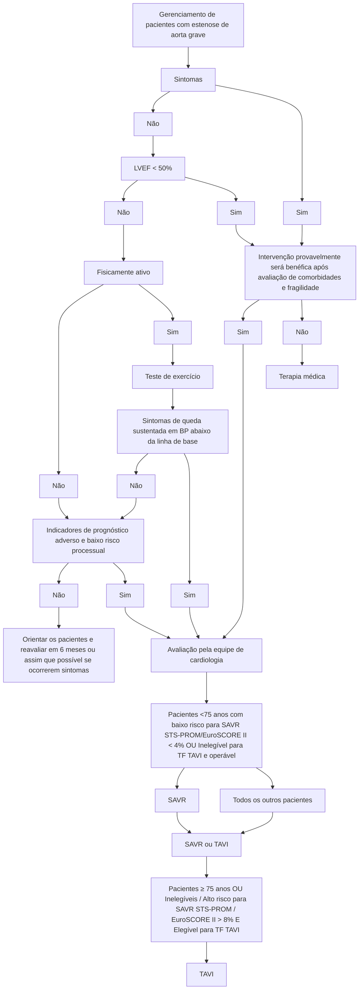
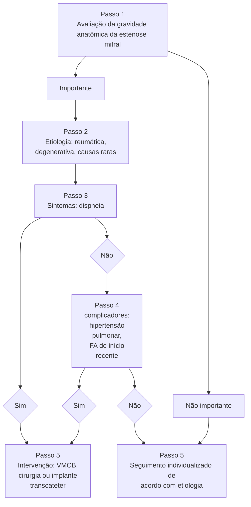
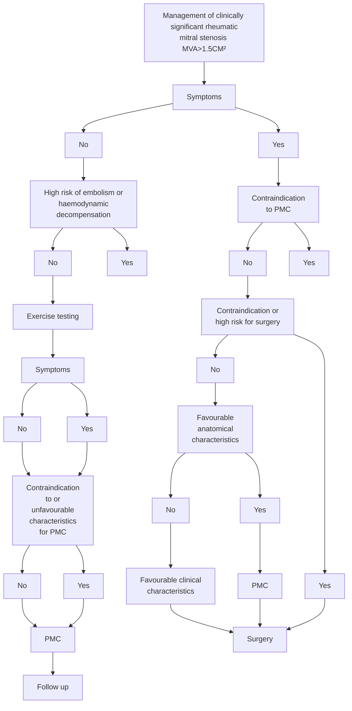
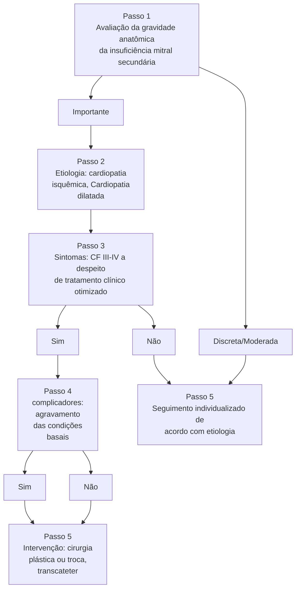
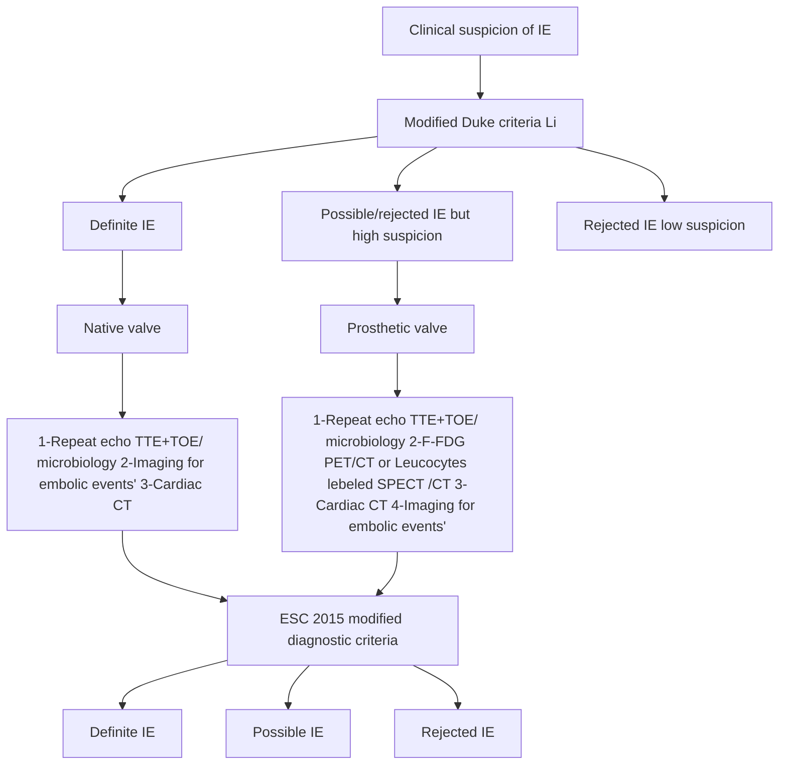

# DOENÇAS VALVARES

• Indica-se intervenção na valvopatia de grau importante sempre que associada a sintomas ou fatores complicadores.
• São sintomas clássicos da estenose aórtica: dispneia (IC), síncope e angina. Seu aparecimento implica mau prognóstico e uma sobrevida média de 2, 3 e 5 anos, respectivamente.
• Na estenose aórtica importante (AV < 1 cm2, ∆P > 40 mmHg, Vmax > 4 m/s) sintomática, a cirurgia é recomendada desde que não haja contraindicações. A TAVI é primeira escolha nos casos de risco alto ou proibitivo, podendo também ser uma alternativa em pacientes com idade superior a 70 anos e risco intermediário.
• TAVI é associado a um maior risco de leak paravalvar, maior necessidade de implante de marcapasso permanente e necessidade de reintervenção valvar.

• A valvoplastia mitral por cateter-balão é a intervenção indicada na estenose mitral reumática importante (AV < 1,5 cm2) com escore de Wilkins < 8, na ausência de trombo no átrio esquerdo, insuficiência > moderada e/ou evento embólico recente.
• A plastia da valva mitral é o tratamento de eleição para a insuficiência mitral primária não-reumática (prolapso - PVM), principalmente quando restrita à cúspide posterior. O tratamento transcateter (MitraClip) pode ser indicado nos casos de alto risco.
• O tratamento cirúrgico para endocardite bacteriana é recomendado nos casos de insuficiência cardíaca (edema pulmonar refratário, choque cardiogênico), infecção não-controlada (abscesso, organismos multirresistentes e fungos) ou para prevenção de embolia (vegetações > 10 mm ou após evento embólico).

## 1. INTRODUÇÃO

O manejo da valvopatia depende do momento ideal de se indicar o tratamento intervencionista, uma vez que esta é a única opção capaz de alterar a evolução natural da doença valvar.

O tipo de intervenção deve ser decidido com a participação de um Heart Team, de acordo com as características clínicas, anatômicas e específicas do procedimento.

## 2. ESTRATÉGIA PARA INDICAR UM PROCEDIMENTO:

• Determinar de a valvopatia é anatomicamente importante;
• Investigar etiologia;
• Avaliar sintomas;
• Se não houver sintomas, avaliar presença de complicadores;
• Indicar intervenção se valvopatia importante sintomática e/ou com complicadores.

**Algoritmo para decidir entre a intervenção ou o seguimento individualizado. Fonte: Atualização das Diretrizes Brasileiras de Valvopatias – 2020. Arq Bras Cardiol. 2020.**

# 3. FEBRE REUMÁTICA

## 3.1 Conceito:

• Resposta imune tardia à faringoamigdalite causada pelo estreptococo beta-hemolítico do grupo A (Streptococcus pyogenes) em indivíduos geneticamente predispostos.

## 3.2 Diagnóstico:

**Critérios de Jones Modificados pela AHA:**

• I – Evidência de Infecção Estreptocócica: Histórico de IVAS (infecção de via aérea superior);
• II – 2 critérios maiores ou 1 maior + 2 menores.

| Critérios Maiores   | Critérios Menores      |
| ------------------- | ---------------------- |
| Cardite             | Febre                  |
| Artrite             | Artralgia              |
| Coréia de Sydenhan  | Elevação de PCR ou VHS |
| Eritema Marginatum  | Prolongamento de PR    |
| Nódulos Subcutâneos |                        |

## 3.3 Profilaxia primária:

• A medicação de escolha é Benzilpenicilina G benzatina;
• Outras Penicilinas orais são recomendadas, mas a adesão dos pacientes ao tratamento pode ser um fator dificultante para realização da profilaxia primária;
• Como alternativa para os alérgicos às Penicilinas, pode-se utilizar Clindamicina, Azitromicina e Claritromicina.

**Regimes terapêuticos indicados para a faringoamigdalite estreptocócica - profilaxia primária de febre reumática.**

| Medicação                                 | Dose                         | Vias de administração/ Duração                                                 | Comentários              |                                                                                             |
| ----------------------------------------- | ---------------------------- | ------------------------------------------------------------------------------ | ------------------------ | ------------------------------------------------------------------------------------------- |
| **Penicilinas e derivados**               | Benzilpenicilina G benzatina | 600.000 UI até 25 kg, 1.200.000 UI acima de 25 kg                              | Intramuscular Dose única | Medicação de escolha: dose única, alta eficácia e baixo custo                               |
|                                           | Amoxicilina                  | 50 mg/kg para crianças e 1,5g diárias para adultos, divididos em 2 a 3 tomadas | Via Oral 10 dias         | Baixa aderência ao tratamento completo                                                      |
|                                           | Fenoximetilpenicilina        | 250 mg 2 a 3x ao dia até 25 kg, 500 mg 3x ao dia > 25 kg                       | Via Oral 10 dias         | Baixa aderência ao tratamento completo                                                      |
| **Para pacientes alérgicos à penicilina** | Clindamicina                 | 20 mg/kg dividido 3x ao dia, adultos: 300 a 600 mg 3x ao dia                   | Via Oral 10 dias         | Frequente intolerância gastrointestinal                                                     |
|                                           | Azitromicina                 | 12 mg/kg em dose única diária. Para adultos, 500 mg 1x ao dia                  | Via Oral 5 dias          | Única antibioticoterapia por via oral que pode erradicar o estreptococo em menos de 10 dias |
|                                           | Claritromicina               | 15 mg/kg 2x ao dia ou para adultos, 250 mg 2x ao dia                           | Via Oral 10 dias         |                                                                                             |

DOENÇAS VALVARES                                                                                       255

**Recomendações para profilaxia primária da febre reumática:**

Benzilpenicilina G benzatina para pacientes com amigdalite estreptocócica (mesmo sem confirmação diagnóstica).

Antibioticoterapia por via oral para pacientes com amigdalite estreptocócica nos pacientes alérgicos à penicilina.

Pode-se considerar o uso de antibióticos por via oral para tratamento de faringoamigdalite estreptocócica em pacientes não alérgicos à penicilina.

A realização de testes rápidos para a detecção de estreptococos em orofaringe pode ser feita para decisão sobre tratamento com penicilina.

Não é necessário realizar cultura de orofaringe em pacientes com suspeita de amigdalite para decisão sobre tratamento com penicilina.

## 3.4 Profilaxia secundária:

Para paciente que já teve febre reumática para se evitar um segundo surto.

**Profilaxia secundária para a febre reumática**

| Medicação                    | Dose e periodicidade                                                                                                           | Recorrência/Notas                                                                               |
| ---------------------------- | ------------------------------------------------------------------------------------------------------------------------------ | ----------------------------------------------------------------------------------------------- |
| Benzilpenicilina G benzatina | <25 kg-600.000UI > 25 kg
1.200.000 UI 15/15 dias nos dois
primeiros anos do surto 21/21 dias
nos anos subsequentes | Recorrência de 0,3% ao ano
Medicação de escolha                                             |
| Fenoximetilpenicilina        | 250 mg por boca 2x ao dia                                                                                                      | Recorrência de 5% ao ano - não
deve ser usada como alternativa à
penicilina G benzatina |

| Medicação                                            | Dose e periodicidade | Dose e periodicidade                           | Recorrência/Notas                                                                                                                             |
| ---------------------------------------------------- | -------------------- | ---------------------------------------------- | --------------------------------------------------------------------------------------------------------------------------------------------- |
| Para pacientes alérgicos
à penicilina            | Sulfadiazina         | <25 kg - 500 mg ao dia > 25
kg - 1g ao dia | Recorrência de 1,3% ao
ano Pode ser usado até
concluída dessensibilização
à penicilina                                            |
| Para alérgicos
à Penicilina e à
sulfadiazina | Eritromicina         | 250 mg 2x ao dia                               | Regime de profilaxia
empírico, não foi objeto
de estudos em profilaxia
secundária da FR - só deve
ser usado excepcionalmente. |

**Recomendações para a profilaxia secundária da febre reumática:**

**Benzilpenicilina G benzatina** para profilaxia secundária de FR, de 15/15 dias nos dois primeiros anos após o surto e de 21/21 dias nos anos subsequentes;

Uso de Benzilpenicilina G benzatina até os 18 anos, ou 5 anos após o último surto em pacientes com FR **sem** cardite;

Uso de Benzilpenicilina G benzatina até os 25 anos, ou 10 anos após o último surto em pacientes com FR **com** cardite, mas sem sequelas cardíacas ou sequelas leves, desde que não sejam lesões estenóticas;

Uso até os **40 anos** em pacientes com FR **com** cardite e com **sequelas graves ou cirurgia cardíaca** para correção da valvopatia;

Uso de Benzilpenicilina G benzatina após os 40 anos em pacientes com exposição ocupacional a estreptococos;

Sulfadiazina para antibioticoprofilaxia da FR em pacientes alérgicos à penicilina.

Uso de antibioticoprofilaxia via oral pode ser considerada para pacientes com FR em pacientes não alérgicos à penicilina.

Eritromicina pode ser considerada para antibioticoprofilaxia para pacientes com FR alérgicos à penicilina e as sulfas.

Não se deve suspender a antibioticoprofilaxia para FR após a realização de cirurgia cardíaca com implante de prótese valvar, mesmo que as outras valvas não tenham lesão aparente.

**Recomendações para a profilaxia secundária da febre reumática:**

| **Cardite**                                            |         |
| ------------------------------------------------------ | ------- |
| **Sim**                                                | **Não** |
| Sequela grave
Cirurgia para valvopatia
Sim	Não |         |

| Até 40 anos ou
por toda a vida,
se exposição
ocupacional | Até 25 anos ou
10 anos após
último surto |
| -------------------------------------------------------------------- | ------------------------------------------------ |

</td>
<td style="text-align: center; border: 2px solid #17a2b8;">Até 18 anos ou 5 anos
após último surto</td>
</tr>
</table>

## 4. ESTENOSE AÓRTICA

• Degenerativa:
  • **Mais prevalente (pacientes idosos);**
  • **Calcificação (esclerose) valvar.**
• Reumática:
  • **Pacientes mais jovens;**
  • **Fusão comissural.**
• Válvula aórtica bicúspide (congênita):
  • Predisposição para evoluir com estenose ou insuficiência aórtica;
  • É a malformação congênita mais comum (a malformação cardíaca cirúrgica mais comum é a CIV);
  • Associa-se a aneurisma, dissecção e coarctação da aorta.

### 4.2 Sintomas:

• Dispnéia: aumento da pressão capilar pulmonar e insuficiência cardíaca.
• Síncope: hipofluxo cerebral;
• Angina: isquemia subendocárdica (hipertrofia miocárdica).

| Age (years) | Survival (%) | Events                                                      |
| ----------- | ------------ | ----------------------------------------------------------- |
| 0           | 100          | Latent period (increasing obstruction, myocardial overload) |
| 10          | 100          |                                                             |
| 20          | 100          |                                                             |
| 30          | 100          |                                                             |
| 40          | 100          |                                                             |
| 50          | 100          |                                                             |
| 60          | \~90         | Onset of severe symptoms                                    |
| 62          | \~80         | Angina - Average survival: 5 years                          |
| 63          | \~60         | Syncope - Average survival: 3 years                         |
| 64          | \~40         | Failure - Average survival: 2 years                         |
| 65          | \~20         | Average death (age)                                         |
| 70          | \~5          |                                                             |
| 80          | 0            |                                                             |

Ross J, Braunwald E. Aortic stenosis. Circulation. 1968;37/38(suppl V): V-61–V-67.4.1 Etiologia

### 4.3 Diagnóstico e gravidade:

• **Ecocardiograma:**

| G  | **radiente sistólico médio**     | **≥ 40 mmHg**                       |
| -- | -------------------------------- | ----------------------------------- |
| R  | **azão das velocidades (VE/Ao)** | **< 0,25**                          |
| Á  | **rea valvar**                   | **≤ 1 cm²** (indexada ≤ 0,6 cm²/m²) |
| Ve | **locidade do jato aórtico**     | **≥ 4 m/s**                         |

• **Complicadores:**

| Velocidade                   |                                | Disfunção  |
| ---------------------------- | ------------------------------ | ---------- |
| "MAX"                        | GRA                            | VE         |
| **Jato aórtico**
> 5 m/s | **diente médio**
≥ 60 mmHg | (FE < 50%) |

• Teste ergométrico (TE):
  • Tolerância ao exercício reduzida;
  • Resposta pressórica inadequada (queda > 10-20 mmHg);
  • Arritmias: taquicardia ventricular ou mais que 4 extrassístoles ventriculares sucessivas;
  • Infradesnivelamento de segmento ST ≥ 2 mm horizontal ou descendente.
• BNP: elevação > 3x valor de referência.

DOENÇAS VALVARES                                                                                                                                                           257

## 4.4 Algoritmo:

• **Indicação de Cirurgia:**

| 1 Paciente sintomático | 2 Paciente assintomático |
|------------------------|--------------------------|
| Estenose importante
(GRAVe)
↓
**Sintomas**
(Dispneia, Síncope, Angina) | Estenose importante
(GRAVe)
↓
**Complicadores**
(**"MAIS" GRAVE**)
e/ou TE+ BNP > 3x |

## 4.5 Método:

• **Indicação de Cirurgia:**

| **TAVI
transfemoral**                                                                        | **TAVI
transapical**                                                              | **TAVI
transaórtica**                                                     | **Cirurgia
Aberta**                                                        | **Cirurgia Valvar
Minimamente Invasiva**                                 |
| ------------------------------------------------------------------------------------------------ | ------------------------------------------------------------------------------------- | ----------------------------------------------------------------------------- | ------------------------------------------------------------------------------ | ---------------------------------------------------------------------------- |
| \[Illustration showing transfemoral TAVI approach with catheter through femoral artery to heart] | \[Illustration showing transapical TAVI approach with catheter through apex of heart] | \[Illustration showing transaortic TAVI approach with catheter through aorta] | \[Illustration showing open heart surgery with chest opened and heart exposed] | \[Illustration showing minimally invasive valve surgery with small incision] |

Possíveis intervenções oferecidas ao paciente com Estenose Aórtica. (TAVI transfemoral; TAVI transapical; TAVI transaórtica; Cirurgia convencional de troca valvar aórtica; Cirurgia valvar minimamente invasiva).

## 4.6 Tratamento:

**Cirurgia Aberta (TVAo / SAVR);**

• Primeira opção; Classicamente em < 70a, sem contraindicação e baixo risco ou risco Intermediário; Idosos de Baixo risco.
• Transcateter (TAVI / TAVR):
• Heart Team;

**Transfemoral é preferência;**

• Primeira escolha: Risco cirúrgico proibitivo; Contraindicações à cirurgia convencional (ex. Ao porcelana); Fragilidade ou risco intermediário em idosos; Maior risco de BAVT (Bloqueio atrioventricular) e, por isso, há necessidade de Implante de MP (marca-passo) pós-procedimento.

**Valvoplastia aórtica por cateterbalão;**

• "Ponte terapêutica" em pacientes com instabilidade hemodinâmica ou sintomas avançados;
• Paliação nos casos com contraindicações;
• RESPOSTA ERRADA MAIS PROVÁVEL NAS QUESTÕES.

Uma estrutura simplificada com exemplos de fatores que favorecem SAVR, TAVI ou paliação em vez de intervenção na válvula aórtica favorece paliação:

|                                                             | Favorece SAVR                                                                                                                                                                                                                                                                                                                                               | Favorece o TAVI                                                                                                                                                                                                                                                            | Favorece paliação                                                                                                                                                                                                                   |
| ----------------------------------------------------------- | ----------------------------------------------------------------------------------------------------------------------------------------------------------------------------------------------------------------------------------------------------------------------------------------------------------------------------------------------------------- | -------------------------------------------------------------------------------------------------------------------------------------------------------------------------------------------------------------------------------------------------------------------------- | ----------------------------------------------------------------------------------------------------------------------------------------------------------------------------------------------------------------------------------- |
| Idade/expectativa de vida\*                                 | Idade mais jovem/expectativa de vida mais longa                                                                                                                                                                                                                                                                                                             | Idade avançada/menos esperados restantes
Expectativa de vida limitada anos de vida                                                                                                                                                                                     | Expectativa de vida limitada                                                                                                                                                                                                        |
| Anatomia da válvula                                         | BAV
Calcificação subaórtica (via de saída do VE)
Valvulopatia reumática
Anel aórtico pequeno ou grande                                                                                                                                                                                                                                          | AS cálcico de uma válvula trifolheto                                                                                                                                                                                                                                       |                                                                                                                                                                                                                                     |
| Preferência de válvula protética                            | Válvula bioprotética mecânica ou cirúrgica preferida
Preocupação com incompatibilidade paciente-prótese (aumento anular pode ser considerado)                                                                                                                                                                                                           | Válvula bioprotética preferida
Proporção favorável entre expectativa de vida e durabilidade da válvula
O TAVI oferece uma área de válvula maior do que o SAVR do mesmo tamanho                                                                                     |                                                                                                                                                                                                                                     |
| Condições cardíacas concomitantes                           | Dilatação aórtica diferente?
RM primária grave
DAC grave que requer enxerto de bypass Hipertrofia septal que requer miectomia AF                                                                                                                                                                                                                    | Calcificação grave da aorta ascendente (aorta de "porcelana")                                                                                                                                                                                                              | Disfunção sistólica grave irreversível do VE
RM grave atribuível à calcificação anular                                                                                                                                          |
| Condições não cardíacas                                     |                                                                                                                                                                                                                                                                                                                                                             | Doença pulmonar, hepática ou renal grave Problemas de mobilidade (alto risco de procedimento com esternotomia)                                                                                                                                                             | Sintomas provavelmente atribuíveis a condições não cardíacas
Demência grave
Envolvimento moderado a grave de > 2 outros sistemas de órgãos                                                                                  |
| Fragilidade                                                 | Não frágil ou com poucas medidas de fragilidade                                                                                                                                                                                                                                                                                                             | Fragilidade provavelmente melhorará após TAVI                                                                                                                                                                                                                              | Fragilidade severa com pouca probabilidade de melhorar após TAVI                                                                                                                                                                    |
| Risco estimado de procedimento ou cirúrgico de SAVR ou TAVI | Risco baixo de SAVR
Risco alto de TAVI                                                                                                                                                                                                                                                                                                                  | Risco de TAVI baixo a médio
Risco de SAVR alto a proibitivo                                                                                                                                                                                                            | Risco proibitivo de SAVR (>15%) ou expectativa de vida pós-TAVI <1 ano                                                                                                                                                              |
| Impedimentos específicos do procedimento                    | Anatomia valvar, tamanho anular ou baixa altura ostial coronariana impede TAVI
Acesso vascular não permite TAVI transfemoral                                                                                                                                                                                                                            | Cirurgia cardíaca anterior com enxertos coronários de risco
Irradiação torácica anterior                                                                                                                                                                               | A anatomia da válvula, o tamanho do anel ou a altura dos óstios coronários impede o TAVI O acesso vascular não permite o TAVI transfemoral                                                                                          |
| Metas de cuidados e preferências e valores do paciente      | Menos incerteza sobre a durabilidade da válvula
Evita a repetição da intervenção
Menor risco de marca-passo permanente
Prolongamento da vida
Alívio dos sintomas
Melhor capacidade de exercício a longo prazo e qualidade de vida
Evita complicações vasculares
Aceita maior tempo de internação, dor no período de recuperação | Aceita incerteza sobre a durabilidade da válvula e possível intervenção repetida
Maior risco de marca-passo permanente Prolongamento da vida Alívio dos sintomas
Melhor capacidade de exercício e QV Prefere menor tempo de internação, menos dor pós-procedimento | O prolongamento da vida não é um objetivo importante
Evite procedimentos diagnósticos ou terapêuticos fúteis e desnecessários
Evite o risco de AVC durante o procedimento
Evite a possibilidade de marca-passo cardíaco |

ACC/AHA Guidelines for the management of patients with valvular heart disease. Circulation. 2020.

DOENÇAS VALVARES                                                                    259

## Fatores que favorecem SAVR, TAVI:

|                                                                                                                                                                                                       | Favorece TAVI | Favorece SAVR |
| ----------------------------------------------------------------------------------------------------------------------------------------------------------------------------------------------------- | ------------- | ------------- |
| **Características clínicas**                                                                                                                                                                          |               |               |
| Menor risco cirúrgico                                                                                                                                                                                 | -             | +             |
| Maior risco cirúrgico                                                                                                                                                                                 | +             | -             |
| Idade mais jovem                                                                                                                                                                                      | -             | +             |
| Idade mais velho                                                                                                                                                                                      | +             | -             |
| Cirurgia cardíaca anterior (particularmente enxertos de revascularização do miocárdio intactos com risco de lesão durante esternotomia repetida)                                                      | +             | -             |
| Fragilidade severa                                                                                                                                                                                    | +             | -             |
| Endocardite ativa ou suspeita                                                                                                                                                                         | -             | +             |
| **Fatores anatômicos e de procedimento**                                                                                                                                                              |               |               |
| TAVI viável por via transfemoral                                                                                                                                                                      | +             | -             |
| Acesso transfemoral desafiador ou impossível e SAVR viável                                                                                                                                            | -             | +             |
| Acesso transfemoral desafiador ou impossível e SAVR desaconselhável                                                                                                                                   | +             | -             |
| Sequelas de radiação torácica                                                                                                                                                                         | +             | -             |
| Aorta de sintética                                                                                                                                                                                    | +             | -             |
| Alta probabilidade de incompatibilidade grave entre paciente e prótese (AVA <0,65 cm2/m2 BSA)                                                                                                         | +             | -             |
| Deformação torácica grave ou escoliose                                                                                                                                                                | +             | -             |
| Dimensões anulares aórticas inadequadas para os dispositivos TAVI disponíveis                                                                                                                         | -             | +             |
| Válvula aórtica bicúspide                                                                                                                                                                             | -             |               |
| Morfologia da válvula desfavorável para TAVI (por exemplo, alto risco de obstrução coronária devido a óstios coronários baixos ou folheto pesado/calcificação da via de saída do ventrículo esquerdo) | -             | +             |
| Trombo na aorta ou VE                                                                                                                                                                                 | -             | +             |
| **Condições cardíacas concomitantes que requerem intervenção**                                                                                                                                        |               |               |
| DAC multiarterial significativa que requer revascularização cirúrgica                                                                                                                                 | -             | +             |
| Doença valvular mitral primária grave                                                                                                                                                                 | -             | +             |
| Doença grave da válvula tricúspide                                                                                                                                                                    | -             | +             |
| Dilatação/aneurisma significativo da raiz da aorta e/ou aorta ascendente                                                                                                                              | -             | +             |
| Hipertrofia septal requerendo miectomia                                                                                                                                                               | -             | +             |

## 4.7 Indicação de intervenção:

**Fonte: ESC/EACTS Guidelines for the management of valvular heart disease. 2021.**

• Algoritmo de intervenção Europeu (ilustrado acima em inglês):
  • Paciente que já definiu cirurgia: < 75 anos, baixo risco cirúrgico e tem características que desfavorecem a TAVI → Cirurgia Aberta (SAVR); > 75 anos, alto risco para cirurgia → TAVI; Outros pacientes → Escolha do Heart Team em conjunto com o paciente.

• A sociedade Européia em seu último guideline favoreceu o uso de TAVI, mas, depois disso, vários especialistas publicaram trabalhos que demonstram que não há evidência para apoiar a ideia de que a TAVI é superior a SAVR em qualquer estrato ou risco cirúrgico e, por isso, as duas opções devem ser discutidas como recomendações de mesmo nível em qualquer situação.

### • COMPARAÇÃO DAS INDICAÇÕES DE INTERVENÇÃO – Estenose Aórtica:

|                                     | 🇺🇸AHA/ ACC (2020) | 🇪🇺ESC (2021)   | 🇧🇷SBC (2020)   |
| ----------------------------------- | ------------------- | ---------------- | ---------------- |
| EAO SEVERA SINTOMÁTICA              | INTERVENÇÃO (IA)    | INTERVENÇÃO (IB) | INTERVENÇÃO (IA) |
| EAO SEVERA ASSINTOM. + FE < 50%     | INTERVENÇÃO (IB)    | INTERVENÇÃO (IB) | INTERVENÇÃO (IB) |
| SAVR PARA < 70A E BAIXO RISCO       | IA (< 65 ANOS)      | IC (<75 ANOS)    | IA (<70 ANOS)    |
| TAVR > 70A OU ALTO RISCO (>8% MORT) | IA (> 80 ANOS)      | IA (>75 ANOS)    | IA (>70 ANOS)    |
| PROC. ASSOC.                        | SAVR (IB)           | SAVR (IC)        |                  |

**Fonte: Atualização das Diretrizes Brasileiras de Valvopatias – 2020. Arq Bras Cardiol. 2020. / ESC/EACTS Guidelines for the management of valvular heart disease. 2021. / Atualização das Diretrizes Brasileiras de Valvopatias – 2020. Arq Bras Cardiol. 2020.**

DOENÇAS VALVARES                                                                                             261

• Algoritmo Americano para intervenção (ilustrado abaixo em inglês): Tem como especificidade o tipo de prótese a ser utilizado:
  • < 50 anos e sem contraindicações (gestante, desejo de gravidez): Prótese mecânica: Autoenxerto pulmonar: Retira a válvula pulmonar do paciente e coloca na válvula aórtica e repõe

a pulmonar do paciente com a de um morto. O enxerto de melhor performance, mas não é muito indicado;
• > 65 anos e sem contraindicações: Prótese biológicaNão há necessidade de anticoagulação e possibilita a realização de TAVI dentro dela;
• **Com contraindicação:** Prótese biológica.

## 5. INSUFICIÊNCIA AÓRTICA

### 5.1 Etiologias:

• Febre reumática;
• Degenerativa;
• Valva aórtica bicúspide;
• Dilatação da aorta;
• Dissecção de aorta;
• Trauma;
• Endocardite.

### 5.2 Gravidade:

• **ECO TT:**
  • Etiologia da doença valvar;
  • Diâmetros e função ventricular;
  • **Quantificação da regurgitação:** Vena contracta > 0,6 cm; Ponte de menor diâmetro do jato regurgitante; Largura do jato > 0,65 cm; Área do jato ≥ 60%; **Fração regurgitante ≥ 50%**; Volume regurgitante ≥ 60 mL/batimento; **ERO ≥ 0,30cm**.

### 5.3 Complicadores:

• **ECO TT: FEVE < 50%:**
  • **DDVE (Diâmetro do ventrículo esquerdo):** > 70 mm (não reumático); > 75 mm (reumático);
  • **DSVE (Diâmetro sistólico do ventrículo esquerdo):** > 50 mm (não reumático); > 55 mm (reumático); DSVE indexado > 25 mm/m².
  • **AngioTC:** Valva Bicúspide com indicação de intervenção; Raiz de Aorta > 45mm;
  • **RM:** Fibrose Miocárdica; Fração Regurgitante > 33%; VDF (Volume diastólico final) > 246mL.

### 5.4 Insuficiência Aórtica - Algoritmo:

**Algoritmo Americano:**

**Cirurgia:**
• Sintomático e EA importante;
• Assintomático com FEVE ≤ 55%;
• Assintomático com FEVE > 55% e dilatação do VE > 25 mm/m2.
  • Nível de evidência 2a;
• Assintomático com FEVE < 55% - 60%, dilatação do VE > 65 mm/m2 e baixo risco cirúrgico:
  • Nível de evidência 2b.

**Algoritmo Brasileiro:**

| **Passo 1
Avaliação da gravidade anatômica da insuficiência aórtica**         |                     |
| --------------------------------------------------------------------------------- | ------------------- |
| Importante                                                                        | Discreta / Moderada |
| ↓                                                                                 | ↓                   |
| **Passo 2
Etiologia:
reumática, degenerativa,
bicúspide, aortopatia** |                     |
| ↓                                                                                 |                     |
| **Passo 3
Sintomas: dispneia,
síncope e angina**                          |                     |
| Sim	Não                                                                           |                     |

</td></tr>
<tr><td style="text-align: center;">↓</td><td style="text-align: center;">↓</td></tr>
<tr><td style="background-color: #00a0c6; color: white; text-align: center;">
Passo 4
complicadores
FEVE < 50%,
Reumáticos:
DDVE > 75mm,
DSVE > 55mm,
Não reumáticos:
DDVE > 70mm,
DSVE > 50mm
</td><td rowspan="3" style="text-align: center;">↓</td></tr>
<tr><td style="text-align: center;">| Sim | Não |
| --- | --- |

</td></tr>
<tr><td style="text-align: center;">↓</td></tr>
<tr><td style="background-color: #00a0c6; color: white; text-align: center;">
Passo 5
Intervenção:
cirúrgica
</td><td style="background-color: #00a0c6; color: white; text-align: center;">
Passo 5
Seguimento individualizado de
acordo com etiologia
</td></tr>
</table>

**Atualização das Diretrizes Brasileiras de Valvopatias – 2020. Arq Bras Cardiol. 2020.**

### 5.5 Tratamento Cirúrgico:

• **Anatomia:**
Importante relembrar algumas estruturas anatômicas como: Três cúspides (esquerda, direita e não coronariana); septo membranoso; cortina mitro-aórtica e Nó atrioventricular.

**→ Escolha do Tipo da Prótese (ACC/AHA guideline for the management of patients with valvular heart disease. Circulation. 2020):**

Decisão compartilhada:
• Informar ao paciente:
  • Necessidade de coagulação, necessidade de reintervenção, riscos e benefícios.
• Paciente com anticoagulação contraindicada:
  • Prótese biológica.
• Paciente < 50 anos sem contraindicação à anticoagulação:
  • Válvula mecânica.

• Paciente entre 50 - 65 anos sem contraindicação à anticoagulação:
  • Decisão individualizada.
• Paciente > 65 anos:
  • Prótese biológica.
• Paciente < 55 anos que prefere a prótese biológica e a válvula permite anatomicamente:
  • Autoenxerto pulmonar.

## Tratamento Cirúrgico:

Planejamento pré-operatório com cálculo do EOA/ BSA;
Medição do Anel Valvar em AngioTC e durante a Cirurgia.
• Importância:
  • Aumenta em 44% as internações por IC;
  • Quando grave pode aumentar 19% a mortalidade;
  • Aumentar em 2,3x a degeneração da prótese.

# 6. ESTENOSE MITRAL

Definição: Estreitamento da valva mitra;
A válvula mitral é uma válvula bicúspide;

**Etiologia:**
• Febre reumática → mais comum no Brasil:
  • Na febre reumática, a valva mitral é a mais acometida.
• Degenerativa → com o avanço da idade;
Outras:
• Congênita;
• Doenças infiltrativas (amiloidose);
• Lupus eritematoso sistêmico;
• Artrite reumatoide;
• Actínica;
• Síndrome carcinoide.

## 6.1 Sintomas:

• Palpitações (devido ao crescimento e fibrilação do átrio esquerdo);
• Eventos embólicos;
• Rouquidão (Ortner);
• Cardiomegalia comprime nervo laríngeo recorrente.
• Dispneia aos esforços;
• Ortopnéia;
• Dor torácica (devido ao desenvolvimento de hipertensão pulmonar - HP);
• Insuficiência cardíaca (IC) direita.

## 6.2 Gravidade:

**Ecocardiograma transtorácico (ECOTT):**
• É o exame mais importante na estratificação de gravidade;
• Considera-se que há uma estenose mitral importante quando:
  • AVM (área valvar mitral direita) < 1,5 cm²;
  • Gradiente diastólico médio AE/VE ≥ 10 mmHg;
  • PSAP (pressão sistólica do átrio esquerdo) ≥ 50 mmHg em repouso ou ≥ 60 mmHg com esforço.

**ECG:**
• Outro exame possível;
• Identificar:
  • Sobrecarga de AE;
  • Sobrecarga de câmaras direitas;
  • FA.

## 6.3 Complicadores:

**No ECO TT:**
• Hipertensão pulmonar:
  • PSAP ≥ 50 mmHg em repouso;
  • PSAP ≥ 60 mmHg ao esforço (teste ergométrico ou ecocardiografia com estresse farmacológico).
• No ECG:
  • FA de início recente;
  • Relação com remodelamento do AE;
  • Manter INR 2,0 a 3,0.

Sinais de estenose mitral na radiografia de tórax. Setas branca e preta: sinal do duplo contorno - branca átrio direito, preta átrio esquerdo; Seta azul: sinal da bailarina; Seta vermelha: quarto arco (átrio esquerdo aumentado). Fonte: learningradiology.com

DOENÇAS VALVARES                                                                                                                       263

## Algoritmo:

Atualização das Diretrizes Brasileiras de Valvopatias – 2020. Arq Bras Cardiol. 2020.

## 6.4 Tratamento:

• A escolha do tratamento pode ser realizada pelo score de Wilkins-Block:

### Escore ecocardiográfico de Wilkins-Block

**Mobilidade dos folhetos:**

1 - Mobilidade elevada da valva com apenas restrição nas extremidades dos folhetos;

2- Regiões medial e basal apresentam mobilidade normal;

3- A valva continua se movendo adiante na diástole, principalmente na base;

4- Nenhum ou mínimo movimento dos folhetos em diástole.

**Espessura dos folhetos:**

1 - Espessamento dos folhetos com espessura próxima do normal (4-5 mm);

2- Camadas médias normais, espessamento considerável de margens (5-8 mm);

3- Espessamento expandindo através de toda a camada (5-8 mm);

4- Espessamento considerável de toda a camada do tecido (>8-10 mm).

**Calcificação valvar:**

1 - Uma área única da ecoluminosidade aumentada;

2- Mínimas áreas de luminosidade confinadas às margens do folheto;

3- Luminosidade expandindo-se dentro da porção média dos folhetos;

4 - Luminosidade extensa, além dos limites dos folhetos.

Fonte: Atualização das Diretrizes Brasileiras de Valvopatias – 2020. Arq Bras Cardiol. 2020.

## Tratamento Medicamentosos:

Controle FC:
• Betabloqueador:
  • BCC não diidropiridínico (Diltiazem e Verapamil).
• Digitálicos.

Controle de volemia:
• Diuréticos (Furosemida, Espironolactona).

Anticoagulação:
• Varfarina: FA;
• Embolia prévia;
• trombo atrial esquerdo FA;
• AE > 55mm e evidência de contraste espontâneo;
• AAS: associar à varfarina se embolia ou trombo AE.

## Intervenção: Valvoplastia mitral por cateter-balão (VMCB):

• Escolha em Reumáticos;
• Indicado em sintomáticos ou assintomáticos com complicadores;
• Wilkins (≤ 8 e subvalvar e calcificação ≤ 2):
  • Gestantes e Alto risco → sobre o critério para ≤ 10.
• Contraindicado em:
  • Trombo no AE → o ecocardiograma transesofágico é mais sensível para detectar trombo no AE;
  • IM moderada ou importante;
  • Embolismo recente;

Valvoplastia mitral por cateter-balão. Fonte: Atualização das Diretrizes Brasileiras de Valvopatias – 2020. Arq Bras Cardiol. 2020.

• Tratamento cirúrgico (comissurotomia ou troca valvar):
  • EM reumática com sintomas CF III-IV com contraindicações à VMCB;
  • EM reumática com fatores complicadores, não elegíveis para VMCB;
  • EM degenerativa refratária ao tratamento clínico.
• Táticas para o tratamento cirúrgico:
  • Robótica;
  • Camuflação via femoral;
  • Mini-toracotomia lateral direita;
  • Clássicas - esternotomia mediana.

Esquerda: Robótica. Direta: Canulação Via Femoral.

Mini – Toracotomia Lateral Direita.

Clássica – Esternotomia Mediana.

Fonte: disponibilizada pelo Prof. Jóse Wanderley

Comissurotomia. Fonte: disponibilizada pelo Prof José Wanderley.

Troca valvar mitral. Fonte: disponibilizada pelo Prof José Wanderley.

• Indicações de Intervenção na estenose mitral (ACC/AHA):
  • Resumidamente: se há estenose clinicamente significativa com área valvar mitral < 1,5 cm³ e sintomático, há indicação de abordar. Observar fluxograma abaixo:

DOENÇAS VALVARES                                                                                                   265

Fonte: ACC/AHA guideline for the management of patients with valvular heart disease. Circulation. 2020; ESC/EACTS Guidelines for the management of valvular heart disease. 2021; Atualização das Diretrizes Brasileiras de Valvopatias – 2020. Arq Bras Cardiol. 2020.

## Tabela – Contraindicações para comissurotomia mitral percutânea na estenose mitral reumática

| Contraindicações                                                                                                                                                                                                                                                                                                         |
| ------------------------------------------------------------------------------------------------------------------------------------------------------------------------------------------------------------------------------------------------------------------------------------------------------------------------ |
| MVA >1,5 cm2a;
Trombo em AE;
Regurgitação mitral mais do que leve;
Calcificação grave ou bicomissural;
Ausência de fusão comissural;                                                                                                                                                                     |
| Doença valvar aórtica grave concomitante,
ou estenose tricúspide combinada grave e
regurgitação exigindo cirurgia;
DAC concomitante que requer cirurgia de bypass.                                                                                                                                           |
| DAC = doença arterial coronariana; AE=átrio
esquerdo/átrio esquerdo; AVM = área valvar mitral;
PMC = comissurotomia mitral percutânea.
\*CMP pode ser considerada em pacientes com
área valvar >1,5 cm2 com sintomas que não podem
ser explicados por outra causa e se a anatomia for
favorável. |

# 7. INSUFICIÊNCIA MITRAL

## 7.1 Etiologia:

• Primária:
  • Prolapso da valva mitral;
  • Febre reumática;
  • Endocardite infecciosa;
  • Deformidades congênitas.

• Secundária:
  • Miocardiopatia dilatada;
  • Miocardiopatia isquêmica.

|                   | Carpentier tipo I.                                                            | Carpentier tipo II.                   | Carpentier tipo IIIa.                                                                         | Carpentier tipo IIIb.                       |
| ----------------- | ----------------------------------------------------------------------------- | ------------------------------------- | --------------------------------------------------------------------------------------------- | ------------------------------------------- |
|                   | (movimento e posição normal do folheto).                                      | (movimento excessivo do folheto).     | (movimento restrito do folheto na sístole e na diástole).                                     | (movimento restrito do folheto na sístole). |
| IC
PRIMÁRIA   | 
Fenda de Perfuração do Folheto.                                     | 
Prolapso da válvula mitral. | 
Doença da Valva Reumática Calcificação do Anel Mitral IC Induzida por Medicamentos. |                                             |
| IC
SECUNDÁRIA | 
IC arterial (À esquerda); Cardiomiopatia não isquêmica (À direita). |                                       |                                                                                               | 
Cardiomiopatia Isquêmica.         |

Baseado em: El Sabbagh, A et al. J Am Coll Cardiol Img. 2018;11(4):628-43.

## 7.2 Gravidade:

• Gravidade importante → ECO TT:
  • Área do jato ≥ 40% da área do AE;
  • Fração regurgitante ≥ 50%;
  • Volume regurgitante ≥ 60 mL/batimento;
  • Vena contracta (porção mais estreita do jato regurgitante) ≥ 0,7 cm;
  • ERO (orifício valvar regurgitante efetivo) ≥ 0,40 cm².

Achados complicadores:
• No ECO TT:
  • FEVE ≤ 60% (superestimada);
  • Remodelamento progressivo (DSVE ≥ 40 mm);
  • PSAP ≥ 50 mmHg ou ≥ 60 mmHg ao exercício;
  • Volume de AE ≥ 60 ml/m².
• No ECG:
  • FA de início recente (< 1 ano).

## 7.3 Tratamento:

• Opções de Tratamento:
• Plástica da Valva Mitral:
  • Tratamento de escolha;
  • Reumáticos menos favoráveis.
• Troca da Valva Mitral;
• Clipagem percutânea da Valva Mitral (MitraClip®).
• Opções de acessos cirúrgicos:
  • Mini-toracotomia;
  • Esternotomia;
  • Robótica.
• Pode ser:
  • Via átrio esquerdo → incisão abaixo do sulco de Waterston-Sondergaar (linha pontilhada na imagem abaixo). Obtém-se uma visualização mais dificultosa, porém lesa menos tecido;
  • Via transeptal → mais reservado para átrios pequenos e reoperações. Nela, se realiza a abertura do átrio direito e do septo (por vezes, também do teto do átrio esquerdo). Boa visualização, porém lesa mais tecido.

DOENÇAS VALVARES                                                       267

## Técnicas no tratamento cirúrgico:

### • Plastia valvar mitral:
- Ressecção do segmento prolapsado;
- Anuloplastia com ou sem anel → o anel traz melhores resultados;
- Cordas artificiais (neocordas ou PTFE).

### • Troca valvar → resseca toda a válvula e idealmente mantém o folheto posterior (para manter a geometria do ventrículo esquerdo e não perder muita FE).

**Cordas artificiais.**

**Troca Valvar Mitral.**
- Técnicas no tratamento percutâneo

**Ressecção do segmento prolapsado.**

**Anuloplastia sem anel.**

**Anuloplastia com anel.**

## Algoritmo BRASILEIRO para Insuficiência Mitral PRIMÁRIA:

| **Passo 1**
Avaliação da gravidade anatômica
da insuficiência mitral primária |                                                                                                                       |
| ------------------------------------------------------------------------------------- | --------------------------------------------------------------------------------------------------------------------- |
| Importante                                                                            | Discreta/Moderada                                                                                                     |
| ↓                                                                                     |                                                                                                                       |
| **Passo 2**
Etiologia: reumática,
prolapso, outras causas                     |                                                                                                                       |
| ↓                                                                                     |                                                                                                                       |
| **Passo 3**
Sintomas: dispneia                                                    |                                                                                                                       |
| Sim                                                                                   | Não                                                                                                                   |
| ↓                                                                                     | ↓                                                                                                                     |
| ↓                                                                                     | **Passo 4**
complicadores:
FEVE < 60%,
DsVE ≥ 40 mm,
PSAP ≥ 50
mmHg,
FA de início
recente |
|                                                                                       | ↓                                                                                                                     |
| ↓                                                                                     | Sim	Não                                                                                                               |

</td>
</tr>
<tr>
<td style="text-align: center;">↓</td>
<td style="text-align: center;">| ↓ | ↓ |
| - | - |

</td>
</tr>
<tr>
<td style="background-color: #00b8d4; color: white; text-align: center;">
Passo 5

Intervenção: cirurgia
(plástica ou troca
valvar), transcateter</td>
<td style="background-color: #00b8d4; color: white; text-align: center;">
Passo 6

Seguimento individualizado de
acordo com etiologia</td>
</tr>
</table>

**Fonte: Atualização das Diretrizes Brasileiras de Valvopatias – 2020. Arq Bras Cardiol. 2020.**

### Indicações de Intervenção na Insuficiência Mitral Primária:
- Não-Reumáticos → Preferência por PLASTIA;
- Reumáticos → Preferência por TVMi.

## Quadro 14 - Insuficiência Mitral primária

| Intervenção                                           | Condição clínica                                                                                                                      | SBC                                                                                        | AHA   | ESC                                   |       |
| ----------------------------------------------------- | ------------------------------------------------------------------------------------------------------------------------------------- | ------------------------------------------------------------------------------------------ | ----- | ------------------------------------- | ----- |
| **Plástica da valva mitral (centro com experiência)** | **Reumáticos**                                                                                                                        |                                                                                            |       |                                       |       |
|                                                       | **Sintomático (CF ≥ II)**                                                                                                             | IIb C                                                                                      | IIb C |                                       |       |
|                                                       | **Assintomático com complicadores:**
FEVE entre 30 e 60% e/ou DSVE ≥ 40 mm;
**PSAP ≥ 50 mmHg ou FA**                          | IIb B                                                                                      | IIb B |                                       |       |
|                                                       |                                                                                                                                       | IIb B                                                                                      |       |                                       |       |
|                                                       | **IM reumática, assintomática, sem complicadores**                                                                                    | III                                                                                        |       |                                       |       |
|                                                       | **Não reumáticos**                                                                                                                    |                                                                                            |       |                                       |       |
|                                                       | **CF ≥ II com anatomia favorável**                                                                                                    | I B                                                                                        | I B   | I B                                   |       |
|                                                       | **favorável e com complicadores:**
FEVE entre 30 e 60% e/ou DSVE ≥ 40 mm;
**PSAP ≥ 50 mmHg ou FA**                            | I B                                                                                        | IB    | I B (DSVE ≥ 45mm)                     |       |
|                                                       | **PSAP ≥ 50 mmHg ou FA**                                                                                                              | IIa B                                                                                      | IIa B | IIa B                                 |       |
|                                                       | **Assintomático, IM por prolapso, com anatomia favorável sem complicadores**                                                          | IIa B                                                                                      | IIa B | IIa C (AE ≥ 60 ml/ m² e ritmo sinusal |       |
|                                                       | **Reumáticos**                                                                                                                        |                                                                                            |       |                                       |       |
|                                                       | **Sintomático (CF ≥ II)**                                                                                                             | I B                                                                                        |       |                                       |       |
|                                                       | **Assintomático com complicadores:**
FEVE entre 30 e 60% e/ou DSVE ≥ 40 mm;
**PSAP ≥ 50 mmHg ou FA**                          | I B                                                                                        |       |                                       |       |
| **Troca da valva mitral**                             |                                                                                                                                       | IIa B                                                                                      |       |                                       |       |
|                                                       | **IM reumática, assintomática, sem complicadores**                                                                                    | III                                                                                        |       |                                       |       |
|                                                       | **Não reumáticos**                                                                                                                    |                                                                                            |       |                                       |       |
|                                                       | **CF ≥ II com anatomia favorável**                                                                                                    | I B                                                                                        | I B   | I B                                   |       |
|                                                       | **Assintomático com anatomia favorável e com complicadores:**
FEVE entre 30 e 60% e/ou DSVE ≥ 40 mm;
**PSAP ≥ 50 mmHg ou FA** | I B                                                                                        | I B   | I C (DSVE ≥ 45 mm)                    |       |
|                                                       | **PSAP ≥ 50 mmHg ou FA**                                                                                                              | IIa C                                                                                      | IIa C | IIa B                                 |       |
|                                                       | **Assintomático, IM por prolapso, com anatomia favorável sem complicadores**                                                          | III                                                                                        | III   | III                                   |       |
|                                                       | **Clipagem percutânea da valva mitral**                                                                                               | **IM não reumática com alto risco ou contraindicação a cirurgia com sintomas refratários** | IIa B | IIb B                                 | IIb C |

Baseado em: ACC/AHA guideline for the management of patients with valvular heart disease. Circulation. 2020. ESC/EACTS Guidelines for the management of valvular heart disease. 2021 Atualização das Diretrizes Brasileiras de Valvopatias – 2020. Arq Bras Cardiol. 2020.

DOENÇAS VALVARES                                                                                                                                           269

## Algoritmo BRASILEIRO para Insuficiência Mitral SECUNDÁRIA:

**Fonte:** Atualização das Diretrizes Brasileiras de Valvopatias – 2020.
Arq Bras Cardiol. 2020.

## Recomendações na insuficiência mitral secundária

| Intervenção                         | Condição clínica                                                              | SBC   | AHA   | ESC                                      |
| ----------------------------------- | ----------------------------------------------------------------------------- | ----- | ----- | ---------------------------------------- |
| Troca ou plástica valvar mitral     | **Isquêmica**                                                                 |       |       |                                          |
|                                     | Sintomático (CF > III)                                                        | IIb B | IIb B | IIb C                                    |
|                                     | Revascularização associada                                                    | IIa B | IIa B | IC(FEVE >30%);
IIa C (FEVE <30> III) |
|                                     | **Dilatada**                                                                  |       |       |                                          |
|                                     | Sintomático (CF > III)                                                        | IIb B | IIb B | IIb C                                    |
|                                     | **Isquêmica**                                                                 |       |       |                                          |
| Clipagem percutânea da valva mitral | Sintomas refratários (CF > III), com alto risco ou contraindicação à cirurgia | IIa B |       | IIb C (FE < 30%)                         |
|                                     | **Dilatada**                                                                  |       |       |                                          |
|                                     | Sintomas refratários (CF > III), com alto risco ou contraindicação à cirurgia | IIa B |       | IIb C (FE < 30%)                         |

Baseado em: ACC/AHA guideline for the management of patients with valvular heart disease. Circulation. 2020. ESC/EACTS Guidelines for the management of valvular heart disease. 2021. Atualização das Diretrizes Brasileiras de Valvopatias – 2020. Arq Bras Cardiol. 2020.

## 7.4 ESCOLHA DA PRÓTESE (guideline europeia - 2021):

### • Recomendação na seleção para prótese mecânica:

- Uma prótese mecânica é recomendada de acordo com o desejo do paciente informado e se não houver contra-indicações para anticoagulação a longo prazo;
- Uma prótese mecânica é recomendada em pacientes com risco de SVD acelerada;
- Uma prótese mecânica deve ser considerada em pacientes já sob anticoagulação por causa de uma prótese mecânica em outra posição da válvula;
- Uma prótese mecânica pode ser considerada em pacientes já em anticoagulação de longo prazo devido ao alto risco de tromboembolismo;
- Sem contraindicação para anticoagulação a longo prazo;
- A prótese mecânica deve ser considerada em pacientes com idade <60 anos para próteses na posição aórtica e <65 anos para próteses na posição mitral;
- Uma prótese mecânica deve ser considerada em pacientes com uma expectativa de vida razoável;
- Paciente que já realiza anticoagulação por outro motivo;
- Paciente que seria alto risco para futura reoperação.

### • Recomendação na seleção para prótese biológica.

- Uma bioprótese é recomendada de acordo com o desejo do paciente informado;
- Uma bioprótese é recomendada quando a anticoagulação de boa qualidade é improvável

(problemas de adesão, não prontamente disponível), contraindicada devido ao alto risco de sangramento (hemorragia maior anterior, comorbidades, falta de vontade, problemas de adesão, estilo de vida, ocupação) e naqueles pacientes cuja expectativa de vida é inferior à durabilidade presumida da bioprótese;
- Uma bioprótese é recomendada em caso de reoperação por trombose valvar mecânica, apesar do bom controle anticoagulante a longo prazo;
- Uma bioprótese deve ser considerada em pacientes para os quais há uma baixa probabilidade e/ou baixo risco operatório de refazer a cirurgia valvar no futuro;
- Uma bioprótese deve ser considerada em mulheres jovens que pretendem engravidar;
- Uma bioprótese pode ser considerada em pacientes já em uso prolongado de NOACs devido ao alto risco de tromboembolismo.

**Observações:**
Sempre que possível: Plastia;
Não há superioridade clara descrita na literatura entre Valva Biológica ou Mecânica no contexto de Endocardite.

### Prótese Mecânica:

Demanda Anticoagulação:
- Varfarina;
- Controle pelo INR.

Diferentes faixas terapêuticas:
- Aórtica:
  - Ritmo Sinusal (alvo entre 2,0-3,0);
  - FA (alvo entre 2,5 - 3,5).
- Mitral (alvo entre 2,5-3,5).

## 8. ENDOCARDITE

### Fisiopatologia

- Lesão do endocárdio > Depósito de fibrina e plaquetas > Infecção secundária a bactérias circulantes (bacteremia) > Formação de vegetação no local da lesão;
- A lesão pode decorrer, por exemplo, de febre reumática. E, a bacteremia, de procedimento dentário ou uso de drogas.

### 8.1 Fatores de Risco:

- Condições Cardíacas como:
  - Portadores de Prótese Valvar;
  - Antecedente de Endocardite;
  - Cardiopatias Congênitas Cianóticas;
  - Cardiopatias Congênitas com uso de material protético na correção.
- Portadores de cateter de longa permanência;
- Usuários de Drogas Intravenosas.

### 8.2 Condições cardíacas

Condições cardíacas com maior risco de endocardite infecciosa para as quais a profilaxia deve ser considerada quando um procedimento de alto risco é realizado, segundo a ESC/EACTS Guidelines for the management of valvular heart disease (2021):

#### A profilaxia antibiótica

Deve ser considerada para pacientes com maior risco de Endocardite Infecciosa (EI) (classe 2a nível C):
- (1) Pacientes com qualquer válvula protética, incluindo uma válvula transcateter, ou aqueles nos quais qualquer material protético foi usado para reparo de válvula cardíaca;
- (2) Pacientes com episódio prévio de EI;
- (3) Pacientes com DCC:
  - (a) Qualquer tipo de DCC cianótica;
  - (b) Qualquer tipo de DCC reparada com um material protético, seja colocado cirurgicamente ou por técnicas percutâneas, **até 6 meses após o procedimento ou ao longo da vida se shunt** residual ou regurgitação valvular permanecer.

DOENÇAS VALVARES                                                                                                                    271

## Procedimentos odontológicos:

• A profilaxia antibiótica só deve ser considerada para procedimentos odontológicos que requeiram manipulação da região gengival ou periapical dos dentes ou perfuração da mucosa oral;
• Profilaxia odontológica: Amoxicilina 2g, 1 hora antes do procedimento.
• Não há evidências convincentes de que a bacteremia resultante de procedimentos do trato digestivo, procedimentos gastrointestinais ou geniturinários, incluindo parto vaginal e cesariana, ou dermatológicos ou causas de procedimentos musculoesqueléticos.

### Profilaxia recomendada para procedimentos odontológicos de alto risco em pacientes de alto risco.

| Situação                                | Antibiótico                | Dose única30-60 minantes doprocedi-mento
Adultos | Dose única30-60 minantes doprocedi-mento
Crianças | Dose única30-60 minantes do pro-cedimento |
| --------------------------------------- | -------------------------- | ---------------------------------------------------- | ----------------------------------------------------- | ----------------------------------------- |
| Sem alergia à penicilina ou ampicilina. | Amoxicilina ou ampici-lina | 2g VO ou IV                                          | 50mg/kg VO ou IV                                      |                                           |
| Alergia a penicilina ou ampicilina.     | Clindami-cina              | 600mg VO ou IV                                       | 20mg/kg VO ou IV                                      |                                           |

*Alternativamente, cefalexina 2 g i.v. para adultos ou 50 mg/kg i.v. para crianças, cefazolina ou ceftriaxona 1 g i.v. para adultos ou 50 mg/kg i.v. para crianças. Cefalosporinas não devem ser usadas em pacientes com anafilaxia, angioedema ou urticária após ingestão de penicilina ou ampicilina devido à sensibilidade cruzada. Baseado em: ESC/EACTS Guidelines for the management of valvular heart disease. 2021.

## 8.3 Diagnóstico de EI segundo os critérios de Duke:

### Critérios de Duke para EI

| EI definitiva                                                                                                                                                                                                                                                                                                                                                                                                                        | EI definitiva |
| ------------------------------------------------------------------------------------------------------------------------------------------------------------------------------------------------------------------------------------------------------------------------------------------------------------------------------------------------------------------------------------------------------------------------------------ | ------------- |
| **Critérios patológicos:**
Microrganismos demonstrados por cultura ou exame histológico de vegetação, vegetação embolizada ou espécime de abscesso intracardíaco; ou
Lesões patológicas; vegetação ou abscesso intracardíaco confirmado por exame histológico mostrando endocardite ativa
**Critérios clínicos:**
2 critérios principais; ou
1 critério maior e 3 critérios menores; ou
5 critérios menores. |               |
| EI Possível                                                                                                                                                                                                                                                                                                                                                                                                                          |               |
| 1 critério maior e 1 critério menor; ou
3 critérios menores                                                                                                                                                                                                                                                                                                                                                                      |               |
| EI descartada.                                                                                                                                                                                                                                                                                                                                                                                                                       |               |
| Diagnóstico alternativo firme; ou
Resolução dos sintomas sugestivos de EI com antibioticoterapia por <4 dias; ou
Nenhuma evidência patológica de EI na cirurgia ou autópsia, com antibioticoterapia por ≤4 dias; ou
Não atende aos critérios para possível IE, conforme acima                                                                                                                                            |               |

Definições dos termos usados nos critérios modificados da European Society of Cardiology (2015) para o diagnóstico de endocardite infecciosa.

| Critérios Maiores                                                                                                                                                                                                                                                                                                                                                                                                                                                                                                                                                                                                                                                                                                                                                                                                                                                                                                                                                                                                                                                                                                                                                                                                                                      | Critérios Maiores |
| ------------------------------------------------------------------------------------------------------------------------------------------------------------------------------------------------------------------------------------------------------------------------------------------------------------------------------------------------------------------------------------------------------------------------------------------------------------------------------------------------------------------------------------------------------------------------------------------------------------------------------------------------------------------------------------------------------------------------------------------------------------------------------------------------------------------------------------------------------------------------------------------------------------------------------------------------------------------------------------------------------------------------------------------------------------------------------------------------------------------------------------------------------------------------------------------------------------------------------------------------------ | ----------------- |
| 1. Hemoculturas positivas para EI:
• Microrganismos típicos consistentes com EI de 2 hemoculturas separadas:
• Viridans streptococci, Streptococcus gallolyticus (Streptococcus bovis), grupo HACEK, Staphylococcus aureus; ou
• Enterococos adquiridos na comunidade, na ausência de foco primário; ou
• Microrganismos consistentes com EI de hemoculturas persistentemente positivas:
• >2 hemoculturas positivas de amostras de sangue colhidas com intervalo >12 h; ou
• Todas as 3 ou a maioria de ≥4 culturas separadas de sangue (com a primeira e a última amostras coletadas com ≥1 h de intervalo); ou
• Hemocultura única positiva para Coxiella burnetii ou título de anticorpos IgG de fase I >1:800.

2. Imagem positiva para EI:
• Ecocardiograma positivo para EI:
• Vegetação;
• Abscesso, pseudoaneurisma, fístula intracardíaca;
• Perfuração valvular ou aneurisma;
• Nova deiscência parcial da prótese valvar.
• Atividade anormal ao redor do local de implantação da válvula protética detectada por 18F-FDG PET/CT (somente se a prótese foi implantada por >3 meses) ou leucócitos radiomarcados SPECT/CT.
• Lesões paravalvares definidas por TC cardíaca. |                   |
| Critérios Menores                                                                                                                                                                                                                                                                                                                                                                                                                                                                                                                                                                                                                                                                                                                                                                                                                                                                                                                                                                                                                                                                                                                                                                                                                                      |                   |
| • Predisposição, como condição cardíaca predisponente ou uso de drogas injetáveis.
• Febre definida como temperatura >38°C.
• Fenómenos vasculares (incluindo os detectados apenas por imagiologia): grandes embolias arteriais, enfartes pulmonares sépticos, aneurisma infeccioso (micótico), hemorragia intracraniana, hemorragias conjuntivais e lesões de Janeway.
• Fenômenos imunológicos: glomerulonefrite, nódulos de Osler, manchas de Roth e fator reumatóide.
• Evidência microbiológica: hemocultura positiva, mas não atende a um critério maior conforme observado acima ou evidência sorológica de infecção ativa com organismo compatível com EI                                                                                                                                                                                                                                                                                                                                                                                                                                                                                                                                                                      |                   |

Fonte: ESC/EACTS Guidelines for the management of valvular heart disease. 2021.

## 8.4 Algoritmo para diagnóstico na Endocardite Infecciosa

**CT** - computer tomography;
**FDG** - fluorodeaxyglucose;
**IE** - infective endocarditis;
**PET** - Positron emission tomography;
**SPECT** - sinfle photon emission computerized tomography;
**TOE** - transoesophageal echocardiography;
**TTE** - transthoracic echocardiography;

'may include cerebral MRI, whole body CT, and/or PET/CT

**Fonte: ESC Guidelines for the management of infective endocarditis. 2015.**

----

### Melhorando Resultados:

Endocardite Infecciosa: Estratégias Preventivas, Diagnóstico e Tratamento.

#### Estratégias preventivas:

• Reduzir a bacteremia adquirida no hospital
• Boa higiene oral para grupos de risco
• Antibioticoprofilaxia para grupos de alto risco
• No futuro, revestimentos/materiais antibacterianos

#### Melhorando o diagnóstico:

• Alto índice de suspeita clínica em grupos de risco
• Educação do paciente
• Ecocardiografia precoce
• Imagem adjuvante se a ecocardiografia não for diagnóstica
• Resultados microbiológicos rápidos com sensibilidade antibacteriana

#### Gerenciamento ideal:

• Avaliação por uma equipe de endocardite
• Estratificação de risco precoce
• Transferência antecipada para o centro de especialização
• Antibioterapia sob medida
• Cirurgia precoce para pacientes selecionados
• Monitoramento de complicações

**Baseado em: Cahill, T.J. et al. J Am Coll Cardiol. 2017;69(3):325-44.**

## 8.5 Tratamento:

### Antibioticoterapia:

• Iniciar imediatamente;
• 3 pares de hemoculturas coletados.

### Tratamento empírico:

• Considerar:
  • Antibioticoterapia prévia;
  • Valva Nativa x Prótese;
  • Infecção Comunitária ou nosocomial.

Esquemas antibióticos propostos para tratamento empírico inicial de endocardite infecciosa em pacientes gravemente enfermos (antes da identificação do patógeno):

**Observação: Se as hemoculturas iniciais forem negativas e não houver resposta clínica, considere a etiologia de endocardite infecciosa com hemocultura negativa (BCNIE) e talvez a cirurgia para diagnóstico molecular e tratamento, e a extensão do espectro antibiótico para patógenos negativos para hemocultura (doxiciclina, quinolonas) deve ser considerada.**

DOENÇAS VALVARES                                                                                                                     273

## Valvas nativas adquiridas na comunidade ou valvas protéticas tardias (≥12 meses após a cirurgia) endocardite

| Antibiótico                                                           | Dosagem e via                                                                                | Classe | Nível | Comentários                                                                                    |
| --------------------------------------------------------------------- | -------------------------------------------------------------------------------------------- | ------ | ----- | ---------------------------------------------------------------------------------------------- |
| Ampicilina com
Flucloxacilina ou
oxacilina
com Gentamicin | 12 g/dia IV em 4-6 doses
12 g/dia IV em 4-6 doses
3 mg/kg/dia IV ou IM em 1
dose | IIa    | C     | Pacientes com BCNIE devem ser tratados em consulta com um especialista em doenças infecciosas. |
| Vancomicina
com
Gentamicin                                    | 30-60 mg/kg/dia IV em 2-3
doses
3 mg/kg/dia IV ou IM em 1
dose                   | IIb    | C     | Para Pacientes alérgicos à Penicilina                                                          |

## PVE precoce (<12 meses após a cirurgia) ou endocardite associada a cuidados de saúde nosocomiais e não nosocomiais

| Antibiótico                                                 | Dosagem e via                                                                                                     | Classe | Nível | Comentários                                                                                                                                                                                                                                                                                                                                                                                                            |
| ----------------------------------------------------------- | ----------------------------------------------------------------------------------------------------------------- | ------ | ----- | ---------------------------------------------------------------------------------------------------------------------------------------------------------------------------------------------------------------------------------------------------------------------------------------------------------------------------------------------------------------------------------------------------------------------- |
| Vancomicina
com
Gentamicina
com
Rifampicina | 30 mg/kg/dia IV em 2 doses
3 mg/kg/dia IV ou IM em 1 dose
900-1200 mg IV ou VO em 2-3
doses divididas | IIb    | C     | A rifampicina é recomendada apenas para PVE e deve ser iniciada 3-5 dias depois do que a vancomicina e a gentamicina foram sugeridas por alguns especialistas. Na endocardite de válvula nativa associada a cuidados de saúde, alguns especialistas recomendam em ambientes com prevalência de infecções por MRSA > 5% a combinação de cloxacilina mais vancomicina até que tenham a identificação final de S. aureus. |

BCNIE = endocardite infecciosa com hemocultura negativa; DI = doença infecciosa; PVE = endocardite de válvula protética. Baseado em: ESC Guidelines for the management of infective endocarditis. 2015.

## Indicações de Intervenção (guideline europeia - 2015):

Indicações e momento da cirurgia na endocardite infecciosa da válvula do lado esquerdo (endocardite de vá lvula nativa e endocardite de válvula protética)

| Indicações de cirurgia                                                                                                                                | Timing            |
| ----------------------------------------------------------------------------------------------------------------------------------------------------- | ----------------- |
| **1. Insuficiência cardíaca**                                                                                                                         |                   |
| ENV ou EVP aórtico ou mitral com regurgitação aguda grave, obstrução ou fístula causando edema pulmonar refratário ou choque cardiogênico             | Emergência        |
| NVE aórtico ou mitral ou PVE com regurgitação grave ou obstrução causando sintomas de IC ou sinais ecocardiográficos de baixa tolerância hemodinâmica | Urgência          |
| **2. Infecção descontrolada**                                                                                                                         |                   |
| Infecção localmente descontrolada (abscesso, falso aneurisma, fístula, crescimento de vegetação)                                                      | Urgência          |
| Infecção causada por fungos ou organismos multirresistentes                                                                                           | Urgência/ eletivo |
| Hemoculturas positivas persistentes apesar da terapia antibiótica apropriada e controle adequado de focos metastáticos sépticos                       | Urgência          |
| PVE causada por estafilococos ou bactérias gram-negativas não HACEK                                                                                   | Urgência/ eletivo |
| **3. Prevenção de embolia**                                                                                                                           |                   |
| NVE aórtico ou mitral ou PVE com vegetações persistentes > 10 mm após um ou mais episódios embólicos apesar da terapia antibiótica apropriada         | Urgência          |
| NVE aórtico ou mitral ou PVE com vegetações > 10 mm, associadas a estenose valvar severa ou regurgitação, e risco operatório baixo.                   | Urgência          |
| NVE aórtico ou mitral ou PVE com vegetações isoladas muito grandes (>30 mm)                                                                           | Urgência          |
| NVE ou PVE aórtico ou mitral com grandes vegetações isoladas (>15 mm) e sem outra indicação para cirurgia¹                                            | Urgência          |

HACEK = Haemophilus parainfluenzae, Haemophilus aphrophilus, Haemophilus paraphrophilus, Haemophilus influenzae, Actinobacillus actinomycetemcomitans, Cardiobacterium hominis, Eikenella corrodens, Kingella kingae e Kingella denitrificans, IC = insuficiência cardíaca; EI = endocardite infecciosa; ENV = endocardite de válvula nativa; PVE = endocardite de válvula protética. "Cirurgia de emergência: cirurgia realizada dentro de 24 h; cirurgia urgente: dentro de alguns dias; cirurgia eletiva: após pelo menos 1-2 semanas de antibioticoterapia. ¹A cirurgia pode ser preferida se for viável um procedimento que preserve a válvula nativa. Baseado em: ESC Guidelines for the management of infective endocarditis. 2015.
