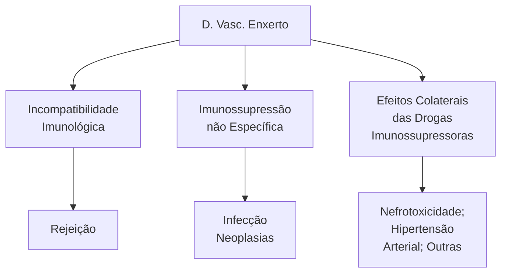
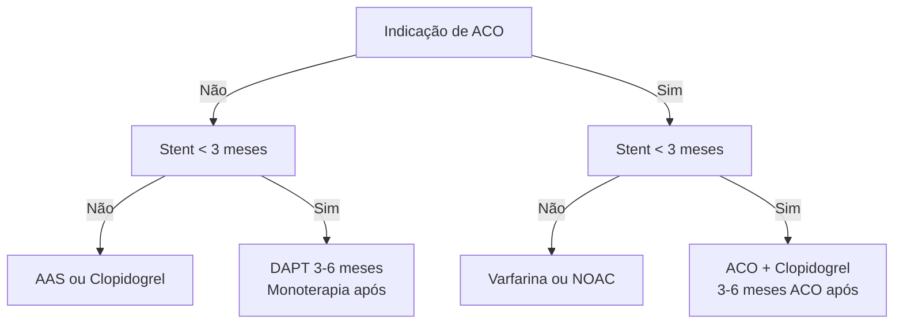
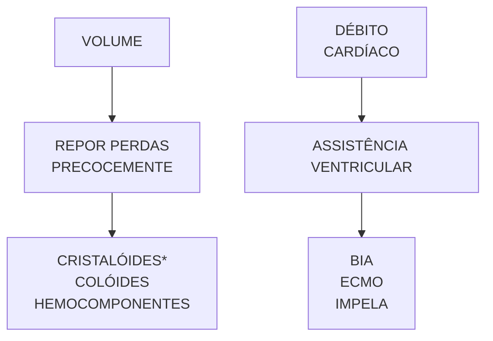

# TRANSPLANTE CARDÍACO

• O transplante cardíaco é o tratamento de escolha para pacientes com insuficiência cardíaca avançada refratária ao tratamento clínico otimizado.
• A miocardiopatia dilatada é a causa mais comum, seguida da doença cardíaca isquêmica e da doença de Chagas.
• As principais contra-indicações ao transplante são: hipertensão pulmonar fixa (resistência vascular pulmonar > 5 woods), idade avançada (em geral, > 70 anos), comorbidades com baixa expectativa de vida, neoplasia com risco alto de recorrência, tabagismo ativo, infecção sistêmica ativa.
• A priorização dos receptores varia de acordo com o tempo em fila e as condições hemodinâmicas. A necessidade de suporte

inotrópico ou de dispositivos de assistência circulatória (BIA, ECMO) aumentam o nível de prioridade.
• O tempo de isquemia total do órgão, desde a sua retirada do doador até a reperfusão, é idealmente de até 4 horas.
• A disfunção primária do enxerto é a principal causa de mortalidade precoce após o transplante cardíaco. Outras causas incluem: infecções, falência do ventrículo direito (secundária a hipertensão pulmonar) e rejeição. Como complicações tardias têm-se a doença vascular do enxerto, neoplasias e reativação da doença de Chagas (na miocardiopatia chagásica).

## 1. HISTÓRICO

• Barnard (1967) (África do Sul) obteve o primeiro transplante cardíaco com sucesso;
• Zerbini (1968: primeiro transplante cardíaco com sucesso da américa latina.

## 2. INDICAÇÕES

### 2.1 INDICAÇÃO DO TRATAMENTO CIRÚRGICO:

• Indicações Aceitas:
  • Classe Funcional IV Persistente, a despeito de tratamento otimizado;
  • Choque Cardiogênico;
  • Consumo Oxigênio (VO2) < 10 ml/Kg/min:
  • Taquicardia Ventricular Refratária ou Recorrente.

### 2.2 Contra-Indicações:

• Idade Superior a 60 Anos;
• Hipertensão Pulmonar com Resistência Vascular Pulmonar > 5 u Wood;
• Embolia / Infarto Pulmonar não Resolvidos;
• Infecção Aguda ou Crônica;
• Doenças Sistêmicas (SIDA, Lupus, Amiloidose);
• Doenças Associadas (Neoplasias, Diabete Mellitus, Úlcera Péptica, Doença Vascular);
• Doença Renal / Hepática Irreversível;
• Condição Psicossocial Desfavorável.

### 2.3 Etiologia:

• 44% → miocardiopatia dilatada;
• 24% → etiologia isquêmica;
• 4% → valvular;
• 18% → doença de Chagas;
• 5% → congênita.

A maioria desses pacientes são externos ao serviço hospitalar e são aqueles priorizados:
• Os priorizados normalmente estão sob algum tipo de assistência circulatória pré-transplante, sendo o mais comum o BIA (balão intraaótico);
• O paciente priorizado espera em média 2 meses para o TC, enquanto que o não priorizado espera em média 2 anos.

• INTERMACS → estruturação de priorização com base na segmentação do critério IV da NYHA (New York Heart Association):
  • Perfil 1 → maior prioridade;
  • Perfil 7 → menor prioridade.

TRANSPLANTE CARDÍACO                                                                                                      221

| Perfil | Descrição                                       | Condições hemodinâmicas                                                                                                                                                                                                   | Urgência da intervenção com DAV |
| ------ | ----------------------------------------------- | ------------------------------------------------------------------------------------------------------------------------------------------------------------------------------------------------------------------------- | ------------------------------- |
| 1      | Choque cardiogênico grave                       | Hipotensão persistente, disfunção orgânica progressiva, mesmo com uso de inotrópicos e dispositivos Horas temporários como BIA.                                                                                           | Hora                            |
| 2      | Declínio progressivo a despeito                 | Disfunção orgânica progressiva (renal, hepática, lactato e/ou nutricional/caquexia) a despeito de doses otimizadas do inotrópico; Também pode incluir a categoria que piora e não tolera doses crescentes de inotrópicos. | Dias                            |
| 3      | Estável, mas às custa de inotrópicos            | Consegue estabilizar com inotrópicos, mas piora se tentar desmame da amina, com hipotensão sintomático e/ou azotemia                                                                                                      | Semanas e meses                 |
| 4      | Sintomático em repouso e internações frequentes | NYHA IV e congestão persistentes, com múltiplas admissões hospitalares e atendimentos de emergência.                                                                                                                      | Semana e meses                  |
| 5      | Em casa, mas intolerante aos esforços           | Limitação marcante aos esforços, presença de congestão, mas confortável em repouso                                                                                                                                        | Variável                        |
| 6      | Limitação aos esforços                          | Limitações moderadas aos esforços, ausência de congestão relevante, confortável em repouso                                                                                                                                | Variável                        |
| 7      | NYHA III                                        | Estabilidade hemodinâmica, assintomático em repouso, ausência congestão relevante.                                                                                                                                        | Sem indicação DAV               |

Ayub-Ferreira SM, Souza Neto JD, Almeida DR, Biselli B, Avila MS, Colafranceschi AS, et al. Diretriz de Assistência Circulatória Mecânica da Sociedade Brasileira de Cardiologia. Arq Bras Cardiol 2016; 107(2Supl.2):1-33

## 3. ASSISTÊNCIA CIRCULATÓRIA

• Ecmo (oxigenação por membrana extracorpórea) funciona como um coração e um pulmão artificial → recebe o sangue do paciente, que passa por um oxigenador e volta ao corpo do paciente → aumenta o débito e oxigena o sangue;

ECMO.
Prashant Rao, Richard Smith, Zain Khalpey Venoarterial Extracorporeal Membrane Oxygenation in Cardiogenic Shock JACC: Heart Failure, Volume 6, Issue 10, October 2018, Pages 887

• BIA (Balão intra-aórtico) → balão preenchido com hélio, posicionado um 3- 5 cm depois da emergência de subclávia esquerda. Na sístole, o balão desinsufla, e na diástole, infla (melhora a perfusão da coronárias);

• Impella → caro e pouco disponível no Brasil. Propulsor do sangue;

A. Impella CP

B. Intra-Aortic Balloon Pump

• Coração Artificial (dispositivos de assistência ventricular - DAV - mecânica) → ainda pouco realizado e pouco acessível financeiramente, normalmente são pacientes judicializados:
  • O Heartmate e o Berlin Heart são os menos incomuns no nosso meio.

## 4. TÉCNICA CIRÚRGICA

• Existem duas técnicas principais:
  • Ortotópica;
  • Heterotópica.

### 4.1 Ortotópica (o coração está em seu local habitual):

• Ortotópica clássica-biatrial:
  • As suturas são realizadas nos átrios, do doador e do receptor. Normalmente inicia suturando o átrio esquerdo do doador no que sobrou do átrio esquerdo do receptor, onde chegam as veias pulmonares. Depois sutura o átrio direito do doador com o que sobrou do receptor. Por fim, sutura a aorta e pulmonar.
• Ortotópica bicaval:
  • Possível retirar o coração mais rápido, pois realiza os cortes nas Veias Cavas. Junta os átrios esquerdos do doador e receptor, e realiza a anastomose das cavas e artérias pulmonares.

• O paciente idealmente pode ficar 4 horas sem bater o coração enquanto faz a cirurgia. Acima de 6 horas o número de complicações é alto:
  • Há uma tendência a realizar a bicaval por ganhar "tempo de isquemia". Há um maior risco de estenose das veias cava, pois a anastomose ocorre diretamente nelas, porém com um coração de desempenho melhor pelo menor tempo de isquemia.

### 4.2 Heterotópico (quando o coração não está em seu local habitual):

• O transplante heterotópico age como um dispositivo de assistência ventricular, porém mecânica biológica. Dá suporte para o coração nativo.
• Normalmente realizado quando:
  • Paciente com hipertensão pulmonar;
  • Doador marginal (coração não é bom o suficiente).

Transplante heterotópico.

### 4.3 Xenotransplantes:

• Órgão doado por outro animal para o ser humano.
• VANTAGENS:
  • Ilimitada disponibilidade de órgãos;
  • Operação programada;
  • Prevenção de recorrência de doenças do coração transplantado;
  • Repetidos transplantes eletivamente.
• DESVANTAGENS:
  • Zoonoses – novas doenças;
  • Sociedades protetoras dos animais;
  • Grande diferenças imunológicas;
  • Incompatibilidade fisiológica entre as espécies.

## 5. SEGUIMENTO

### 5.1 Complicações:

• Rejeição;
• Infecção;
• Neoplasias;
• Doença vascular do enxerto;
• Nefrotoxicidade;
• Hipertensão arterial;
• Outras.

### 5.2 Complicadores:

• Incompatibilidade imunológica;
• Imunossupressão não específica;
• Efeitos colaterais das drogas imunossupressoras.
• Considera-se inevitável o desenvolvimento da

Doença Vascular do Enxerto (com o tempo, as coronárias desenvolvem uma proliferação da íntima, como uma "aterosclerose" disseminada).

TRANSPLANTE CARDÍACO                                                                              223

## 5.3 Rejeição:

• Espera-se que até 50% dos pacientes apresentem algum tipo de rejeição nos primeiros 2 anos;
• Pode ser:
  • Rejeição Hiperaguda (Aguda Humoral);
  • Rejeição Aguda Celular.
• Diagnóstico de Rejeição por Métodos Não-Invasivos:
  • A. Propriedades Fisiológicas: 1. Dados Clínicos; 2. ECG/Eletrofisiologia; 3. Ecocardiografia; 4. Ressonância Magnética; 5. Medicina Nuclear;
  • B. Ativação do Sistema Imune: 1. Monitorização Citoimunológica; 2. Outros Marcadores: Receptor de IL2; Receptor de Transferrina – Neopterina; Prolactina sérica; Beta 2 microglobulina; Poliamina urinária; TNF;
  • Mapeamento pelo Gálio (método pouco utilizado no nosso meio);

## 5.4 Infecção:

• A infecção pulmonar é a mais comum:
  • Pulmão → 28,8%;
  • Geniturinário → 11,5%;
  • Ferida → 10%;
  • Cardiovascular → 7,9%;
  • Gastrointestinal → 3,6%.

## 5.5 Doença Vascular do Enxerto: Proliferação intimal difusa.

## 5.6 Neoplasias:

• Alguns linfomas estão associados:
  • Linfoma de delgado;
  • Linfoma hepático;
  • Linfoma histiocístico.
• Kaposi pulmão;
• Kaposi subcutâneo;
• Carcinoma epidermoide.

**Perguntas e respostas**

• O transplante cardíaco prolonga a vida?
  • SIM. Média de sobrevida de 12 anos.

• Há melhora da qualidade de vida?
  • SIM.

# PÓS-OPERATÓRIO

• Ultrassom point-of-care (POCUS) é uma ferramenta útil no diagnóstico diferencial do choque no pós-operatório: obstrutivo (tamponamento), cardiogênico (disfunção miocárdica pós-CEC, infarto peri-operatório), distributivo (vasoplegia).

• O lactato sérico é um indicador de perfusão tecidual e sua elevação pode ser um preditor de mau prognóstico.

• A fibrilação atrial é uma das arritmias mais frequentes no pós-operatório de cirurgia cardíaca. Pode se relacionar a inflamação decorrente da manipulação cirúrgica e uso de circulação extracorpórea, isquemia, distúrbios metabólicos, sobrecarga volêmica e doenças estruturais (valvopatias).

• Bloqueios atrioventriculares são mais comuns após procedimentos valvares e em alguns tipos de cardiopatias congênitas (CIV, DSAV). A instalação do marcapasso provisório durante a cirurgia permite a estimulação cardíaca no período perioperatório, quando necessária.

• Sangramento no pós-operatório pode ocorrer por sangramento do sítio cirúrgico, distúrbios de coagulação (disfunção plaquetário, deficiência de fator de coagulação, fibrinólise) e efeito residual de anticoagulantes/antiplaquetários. O tromboelastograma é o exame mais indicado para o diagnóstico diferencial.

• As medidas para o manejo do sangramento pós-operatório incluem: evitar hipotermia, corrigir hipocalcemia e acidose, controlar a pressão arterial e indicar reexploração cirúrgica na evidência de tamponamento ou sangramento significativo com instabilidade hemodinâmica.

## 1. MONITORIZAÇÃO

### 1.1 Monitoração básica:

• ECG;
• Oximetria;
• Capnografia;
• SVD;
• PVC;
• PAi;
• Débito de Drenos: característica da drenagem venosa, arterial, débito seroso ou quiloso.
• Débito Urinário: característica do débito. Com ou sem hematúria.
• Exame físico: FC; TEC; pressão de pulso; ausculta cardíaca.

• **FAST HUGS BID**
  • Feeding (alimentação)
  • Analgesia
  • Sedação (minimizar benzodiazepínicos se sedação prolongada)
  • Tromboprofilaxia (mecânica/química)
  • Heads up (elevação da cabeceira)
  • Ulceras (prevenir)
  • Glicemia (controle de hipo e hiper)
  • Spontaneous breathing trial (extubar assim que possível)
  • Bowel (evacuação, laxativos, deambulação)
  • Invasivos (retirar invasões assim que possível)
  • Drogas (antibióticos)

• **Monitorização de drenos:**
  • Aspecto e volume.

• **Tempo de enchimento capilar:**
  • Normal é < 3 segundos.

### 1.2 Swan-Ganz:

• Cateter com Balonete insufláveis;
• Fornece pressão em diversas Câmaras;
  • Átrio Direito;
  • Ventrículo Direito;
  • Artéria Pulmonar.
• Pressão de Capilar Pulmonar (Equivalente a AE);
• Não muda desfecho de mortalidade, mas oferece informações relevantes para conduzir o paciente.

Ao posicionar o cateter no átrio direito, a partir da veia jugular interna direita, obtém-se a pressão nessa câmera, que deve ser de 2 a 6 mmHg. Após atravessar a válvula tricúspide, observa-se a pressão do ventrículo direito, na qual já é possível diferenciar uma pressão sistólica (20-30 mmHg) de uma pressão diastólica (0-5 mmHg). Continuando o cateter, ao ultrapassar a válvula pulmonar, percebe-se pressões bem maiores com uma sistólica de 20 a 30 mmHg e uma diastólica de 5 a 15 mmHg. Por fim, quando se posiciona o dispositivo na artéria pulmonar, observa-se a pressão capilar pulmonar, que é equivalente à pressão do átrio esquerdo.

### 1.3 Monitorização minimamente invasiva:

• Monitorização Hemodinâmica de acordo com variações da onda de pulso;
  • Informa o Débito Cardíaco e Índice Cardíaco, SvO2, Volume Sistólico, entre outros.

• Menos invasiva que o SG:
  • Eg.: Vigileo, EV1000, Flotrac, Volume View.
• Orienta manejo Hemodinâmico de vasopressores, inotrópicos e volemia;
• Monitorização da SvO2 permite avaliação do equilíbrio entre oferta e demanda de O2.

| Numerosos fatores afetam o Sv O2%     | Numerosos fatores afetam o Sv O2%
Aumentam a Sv O2%                                                  | Numerosos fatores afetam o Sv O2%
Diminuem a Sv O2%                                                        |
| ------------------------------------- | -------------------------------------------------------------------------------------------------------- | -------------------------------------------------------------------------------------------------------------- |
| Débito cardíaco                       | Débito cardíaco aumentado                                                                                | Débito cardíaco diminuído                                                                                      |
| Hemoglobina                           | Hemoconcentração                                                                                         | Anemia                                                                                                         |
| Oxigenação                            | Hiperóxia                                                                                                | Hipóxia                                                                                                        |
| Estado neurológico                    | Sedação, analgesia                                                                                       | Estresse, ansiedade, dor                                                                                       |
| Temperatura                           | Hipotermia                                                                                               | Hipertermia                                                                                                    |
| Atividade Muscular                    | Paralisia                                                                                                | Tremores, agitação, taquipnéia.                                                                                |
| Comportamento microvascular e celular | As células falham em usar oxigênio (por exemplo, disfunção mitocondrial em sepse ou isquemia-reperfusão) | Correspondência microvascular eficaz do fluxo com a demanda de oxigênio, utilização celular eficaz do oxigênio |

Adaptado de BOJAR. Perioperative Care in Adult Cardiac Surgery. 2021.
Monitorização da saturação venosa de oxigênio.

## 1.4 Pocus (ultrassom point-of-care):

• Avaliação Cardíaca Beira-leito;
• Avalia 3 locais básicos: janelas paraesternal, subxifóide e apical;
• Possível avaliar: Disfunção Miocárdica; Segmentar; Global;
  • Assincronia Septal;

• Marcador de má-proteção miocárdica;
• Tamponamento Cardíaco;
• Avaliação Geral de Próteses.
• Avaliação em pacientes em ECMO:
  • Drenagem;
  • Posicionamento de cânulas.

**Parasternal Long Axis (PLAX)** | **THE BASIC VIEWS OF FoCUS** | **Parasternal Short Axis (PLAX)**

**Subxiphoid 4-chamber** | | **Apical 4-chamber**

Eixos principais para avaliação Pocus. Paraesternal (em verde), Subxifoide (em vermelho) e Apical (em amarelo)

PÓS-OPERATÓRIO                                                                                           3

## 1.5 Bioquímica:

• Lactato:
  • Preditor de pior prognóstico (8- 10x); Estudos demonstram o uso do pico arterial de lactato pós-operatório para prever desfecho depois de cirurgia cardíaca;
  • Indicador de isquemia tecidual.

• Aumento de lactato no PO se associa a aumento da mortalidade
• Distúrbios Hidroeletrolíticos:
  • Hipocalemia;
  • Hipernatremia.
• Equilíbrio Ácido Básico;
• SvO2:
  • Indicador de perfusão tecidual.

## 2. PÓS-OPERATÓRIO IMEDIATO

### 2.1 Admissão da UTI:

• Cuidados no Transporte;
• Passagem adequada do Caso: Checklist de Passagem:
  • Atenção de toda equipe;
  • Diagnóstico da Cardiopatia;
  • Procedimento Realizado;
  • Intercorrências;
  • Complicações Esperadas; Sangramento, Arritmias;
  • **Invasões: Acessos, Drenos, Fios de MP.**

• **Plantonista já solicita na admissão:**
  • ECG e RX de Tórax de Admissão;
  • Gasometria de Entrada;
  • Coagulograma e Bioquímica.

### 2.2 Considerações:

• Espera-se função ventricular reduzida horas após a cirurgia devido a CEC e tempo de isquemia cardíaca
• Objetivar extubação precoce (< 6h)
• Sempre há comprometimento pulmonar relacionado à manipulação do tórax
• Corrigir hipotermia, que é realizada durante a cirurgia
• Pode haver sangramento mediastinal (no dreno) - avaliar coagulopatias

## 3. REVASCULARIZAÇÃO DO MIOCÁRDIO

Fibrilação atrial
• Até 25% dos casos
• Início precoce de betabloqueador
• ECG
  • Isquemia
  • Cateterismo de emergência (BIA se necessário_)
  • Arritmitas ventriculares - suspeita de isquemia
  • Supra de ST difuso pode ocorrer (pericardite)

• IAM peri-op
  • Alterações persistentes no ECG
  • Alterações de contratilidade segmentar no Eco
  • Elevação de troponina > 10x
• AAS + atorvastatina
  • Sempre iniciar entre 6-24h de pós-operatório (+ clopidogrel se SCA)
  • Aumenta a patência do enxerto e reduz a mortalidade

## 4. TROCA VALVAR

• Biológica
  • Não requer anticoagulação permanente
  • Usar AAS indefinidamente
  • Pode utilizar varfarina 3-6 meses para reduzir risco de AVC

• Metálica
  • Anticoagulação apenas com varvarina (INR > 2,0 - 2,5)
  • NOAC contraindicados

## 5. TAVI

• **Complicações**
  • Tamponamento
  • Isquemia
  • Bloqueio atrioventricular
    • Marcapasso definitivo indicado se BAVT 2 dias após TAVI (na cirurgia esperamos 5 dias devido à influência do edema local)

• AAS indicada (não utilizar clopidogrel, a menos que tenha outra indicação)
• Anticoagulação não é regra - se tiver indicação, anticoagular e não utilizar AAS

## Resumo: TAVI x Antiagregação

TAVI e antiagregação. Fonte: acervo Medcof

## 6. CARDIOPATIA DILATADA

• Melhorar performance sem elevar a demanda miocárdica por oxigênio:
  • Inotrópico;
  • Vasodilatadores.

## 7. CARDIOPATIA ISQUÊMICA

• Vasodilatador para preservar Enxertos;
• Nitroglicerina (1-80 mcg/kg/min):
  • Vasodilatação Venosa (musculatura lisa);
  • Diminui consumo de O2 por diminuir retorno venoso.

**Classificação Vasodilatadores Acordo com Sítio Ação**

| **Arterial**

**Venoso** | Hidralazina
Diazóxido

Nitroprussiato de Na+
Phentolamina

Nitroglicerina |
| ---------------------------------------------------------------------------------- | ------------------------------------------------------------------------------------------------------------------------------------ |

Local de Ação dos Vasodilatadores.

## 8. CARDIOPATIA HIPERTRÓFICA

• **Diminuir Pós-Carga;**
  • **Nitroprussiato:** foco na vasodilatação arteriolar.
  • Otimização da nalgesia;
  • Esses pacientes se beneficiam de pressão mais baixa;

• Atenção ao recrutamento com PEEP alta para preservar enxertos:
  • O aumento da PEEP (acima de 30 mmHg) pode romper o enxerto da artéria mamária, que é utilizada na cirurgia de revascularização e devido ao seu fluxo intenso causa uma hemorragia grave.

• **Volumes de enchimento menores:** não possui tempo de relaxar, por isso, há uma tendência de deixá-lo um pouco mais hipervolêmico.

PÓS-OPERATÓRIO                                                                                                                          5

## 9. ARRITMIAS

### 9.1 Bradicardias:

• **BAVT (Bloqueio atrioventricular total) é mais comum em:**
  • Procedimentos Valvares;
  • CIV;
  • Fios de Marcapasso provisório.

### 9.2 Taquiarritmias:

• É Possível Também Utilizar o Marcapasso Provisório, Estimulando uma Frequência Cardíaca Acima da Taquicardia;
• JET (Taquicardia Ectópica Juncional) também é comum: taquicardia supraventricular; cardiopatias congênitas.

• **Atentar para Taquicardia e Fibrilação Ventricular:**
  • Lembrar dos ritmos chocáveis, quando necessário.

• **ERAS (enhanced recovery after surgery): tentativa de acelerar a recuperação do pacientes após procedimento cirúrgico**
  • Extubação Precoce (Até 6 horas na UTI);
  • Retirada de Drenos e Fios de MP em 1º dia pós-operatório;
  • Deambulação precoce;
  • Prevenção de náuseas e analgesia efetiva;
  • Fluidoterapia guiada por metas;
  • Dieta enteral precoce.

• **O ERAS de cirurgia cardíaca não inclui apenas o pós-operatório, como vemos na imagem abaixo:**

| Pré-operatórioCasa                                | Dia da CirurgiaÁrea pré-cirúrgica                                                                                          | IntraoperatórioSala de operação                                                                                                                                                                                                                                                    | pós-operatórioUTI cardiológica eunidade stepdown                                                                                                                                                                      | AcompanhamentoCasa                                                                          |
| ------------------------------------------------- | -------------------------------------------------------------------------------------------------------------------------- | ---------------------------------------------------------------------------------------------------------------------------------------------------------------------------------------------------------------------------------------------------------------------------------- | --------------------------------------------------------------------------------------------------------------------------------------------------------------------------------------------------------------------- | ------------------------------------------------------------------------------------------- |
| - Educação
- Otimização médica pré-operatória | - Jejum de comida sólida por 8 horas
- Jejum de suco de fruta, chás e líquidos claros por 2 horas.
- Pré-medicação | - Cirurgia minimamente invasiva e reparação de qualidade
- Conservação de sangue e Fluidoterapia guiada por metas;
- Tratamento multimodal da dor com redução de opioides
- Prevenção de delirium e náusea pós-operatória
- Normotermia após bypass cardiopulmonar | - Extubação precoce
- Fluidoterapia guiada por metas
- Retirada de Drenos, tubo e fios;
- Deambulação precoce;
- Prevenção de náuseas e vômitos
- Analgesia efetiva;
- Dieta enteral precoce. | - Acompanhamento virtual precoce
- Monitorar a recuperação
- Pesquisa de satisfação |

Passo a passo para Pré-operatório, Intra Operatório, Pós-operatório e Seguimento. Baseado em: Boston Children's Hospital (Heart center).

## 10. CHOQUE

• **Todos os tipos de choque podem estar associados ao pós-operatório de CCV.**

• **Hipovolêmico:**
  • Sangramento Mediastinal;
  • Filtração exacerbada na CEC.

• **Cardiogênico:**
  • Disfunção Ventricular pós-CEC;
  • Proteção Miocárdica (Cardioplegia) Sub-ótima;
  • IAM periprocedimento ou lesão coronariana.

• **Obstrutivo:**
  • Tamponamento Cardíaco (Obstrução de dreno);
  • Pneumotórax.

• **Distributivo:**
  • Causa Vasoplegia pós-CEC.

## 10.1 Diagnóstico:

| Tipos de choque | DC    | RVP   | PCP      | PVC      | Sv02  |
| --------------- | ----- | ----- | -------- | -------- | ----- |
| Hipovolêmico    | Baixo | Alta  | Baixa    | Baixa    | Baixa |
| Cardiogênico    | Baixo | Alta  | Alta     | Alta     | Baixa |
| Obstrusivo      | Baixo | Alta  | Baixa    | Alta     | Baixa |
| Distributivo    | Alto  | Baixa | Variável | Variável | Alta  |

| Tipo          | Causa                                                          | DC  | RVP (pós-carga) | PoAP (pré-car-ga)  | Extremida-des         | Tratamento                 |
| ------------- | -------------------------------------------------------------- | --- | --------------- | ------------------ | --------------------- | -------------------------- |
| Cardiogê-nico | Disfunção ventri-cular esquerda. (IAM, arritmias);             | ↓ ↓ | ↑               | ↑                  | Frias; pegajosa.      | Ionotrópicos; Diuréticos.  |
|               | Disfunção ventri-cular direita (IC, IAM)                       |     |                 | ↓                  |                       |                            |
| Obstrusivo    | vascular pul-monar (embolia pulmonar, hiper-tensão pulmo-nar); |     |                 |                    |                       |                            |
|               | Mecânica (pneumotórax hipertensivo, tamponamento pericárdico)  | ↓ ↓ | ↑               | (tamponamento) ↓ ↑ | Frias; pegajosa.      | Desobstrução.              |
| Hipovolê-mico | Hemorrágico; Não hemorrágico (Desidratação severa)             | ↓   | ↑               | ↓ ↓                | Frias; pegajosa.      | Fluidos EV.                |
| Distributivo  | Séptico                                                        | ↑   | ↓ ↓             | ↓                  | Quente e Corado.      | Fluidos EV; Vasopressores. |
|               |                                                                |     |                 |                    | Quente e Pruriginoso. |                            |
|               | Anafilático; Neurogênico.                                      | ↓   |                 |                    | Quente e Seco.        |                            |

## 10.2 Choque cardiogênico (VE):

• **Tratamento com Inotrópicos:**
  • Dobutamina (1-20mcg/kg min);
  • Assistência Ventricular (Após dose máxima da Dobutamina): BIA; ECMO; LVAD.

• **Choque cardiogênico (devido ao VD):**
  • Tratamento com Inotrópicos: adrenalina; assistência ventricular, se necessário (BIA: auxiliar no débito; auxiliar na perfusão coronariana; centrimag; ECMO).

• **Choque obstrutivo - tratamento:**
  • Pneumotórax hipertensivo: drenagem de tórax.
  • Tamponamento cardíaco: pericardiocentese; janela pericárdica (Marfan); resternotomia e revisão de hemostasia.

• **Choque hipovolêmico - tratamento:**
  • Repor volume e, se necessário, hemoderivados;
  • Re-esternotomia e Revisão de Hemostasia, quando sangramento ativo.

• **Choque distributivo - tratamento:**
  • Vasopressores: Noradrenalina; Vasopressina;
  • Volume.

• **Síndrome de baixo débito**
  • **Normal:** IC > 2,2 L/min/m² + SvO2 > 65%
  • **Fatores de risco:** clínicos - idade avançada, desnutrição, diabetes, doença renal crônica, disfunção sistólica/ diastólica. Cirúrgicos - tempo de CEC/anóxia, reoperação, revascularização incompleta, cirurgia combinada, cirurgia da valva mitral;

PÓS-OPERATÓRIO                                                                                             7

• A função miocárdica tende a piorar após 6-8 horas por lesão de isquemia e reperfusão;
• Na ausência de dano miocárdico significativo, normalmente há recuperação após 24 horas;

• **Algoritmo**
  • Corrigir distúrbios ácido-base, hidroeletrolíticos e respiratórios
  • Otimizar pré-carga (observar pressões de enchimento)
  • Estabelecer FC adequada (se necessário estimular com marcapasso)
  • Controlar arritmias (amiodarona)
  • Suporte inotrópico, se IC < 2 L/min/m²
  • Iniciar vasopressor, se RVS baixa
  • Hemotransfusão para manter Ht > 22%
  • Considerar balão intra-aórtico/ECMO

• **Balão intra aórtico**
  • Oferece suporte hemodinâmico e diminui o impacto da isquemia miocárdica
  • Reduz consumo de oxigênio (VO2)
  • Aumenta perfusão coronariana

## 10.3 Mecanismo:

• reduz pós-carga do VE pela rápida desinsuflação antes da sístole (efeito de "vácuo")
• Aumenta a perfusão coronariana pela insuflação logo após o fechamento da valva aórtica

• **Indicações**
  • Isquemia refratária
  • Complicação mecânica do infarto
  • Síndrome do baixo débito pós-operatória
  • Descompensação da insuficiência cardíaca (choque cardiogênico)
  • Não é mais indicado passagem de BIA no contexto de choque cardiogênico pós-IAM

• **Contraindicações**
  • Insuficiência aórtica importante
  • Dissecção de aorta
  • Doença arterial periférica grave
  • Sepse

• **Análise da curva de pressão**

|  |                                                                                                                                                                                                                                                                                             |
| ----------------------------------------------------------------------------------------------------------------------------------------------------------------------------------------------------------------------------------------------------------------------------------------------- | ------------------------------------------------------------------------------------------------------------------------------------------------------------------------------------------------------------------------------------------------------------------------------------------- |
| **Sístole**                                                                                                                                                                                                                                                                                     | **Diástole**                                                                                                                                                                                                                                                                                |
|                                                                                                                                                                                       |  |
| **←** Esvaziar Inflar **→**                                                                                                                                                                                                                                                                     |                                                                                                                                                                                                                                                                                             |

Curva de pressão do balão intra-aórtico. Fonte: vídeo-aula Medcof.

• **Critérios de posicionamento adequado**
  • redução da pressão sistólica assistida
  • redução da pressão diastólica final assistida

• aumento diastólico > pressão sistólica não assistida

## 11. CIRCULAÇÃO EXTRA-CORPÓREA (CEC)

Circuito da circulação extracorpórea.

• **Impacto fisiológico da CEC:**
  • A CEC impõe uma série de alterações ao organismo:
    • Desvio de sangue para o circuito artificial;
    • Mudança do regime de fluxo: Pulsátil x Contínuo;
    • Stress mecânico do sangue em superfície não endotelizada;
    • Hemólise e destruição de plaquetas;
    • Resposta inflamatória pode gerar graus variados de severidade: Desencadeia a cascata das Citocinas e Interleucinas pró-inflamatórias; Vasoplegia.

• **Manejo hemodinâmico (confira os mapas mentais abaixo):**

| **VOLUME**

REPOR PERDAS
PRECOCEMENTE

↓
CRISTALÓIDES

COLÓIDES

HEMOCOMPONENTES | **DÉBITO
CARDÍACO**

INOTRÓPICOS

↓
BETA AGONISTAS
- DOBUTAMINA
- ADRENALINA EM DOSE BETA

INIBIDORES DE
FOSFODIASTERASE
- MILRINONE
- INOTRÓPISMO
- VASODILATAÇÃO

SENSIBILIZADORES DE CÁLCIO
- LEVOSIMEDAN
- MEIA-VIDA LONGA | **RESISTÊNCIA**

VASOPRESSORES VASODILATADORES

↓ ↓
NORADRENALINA NITROPRUSSIATO
VASOPRESSINA NITROGLICERINA

ADRENALINA HIDRALAZINA

IECA
\* SE PAS ADEQUADA |
| ------------------------------------------------------------------------------------------------------------------------ | ------------------------------------------------------------------------------------------------------------------------------------------------------------------------------------------------------------------------------------------------------------------------------------------------------ | --------------------------------------------------------------------------------------------------------------------------------------------------------------------------------------------------------- |

Adaptado de: BOJAR. Perioperative Care in Adult Cardiac Surgery. 2021.

PÓS-OPERATÓRIO    9

Adaptado de: BOJAR. Perioperative Care in Adult Cardiac Surgery. 2021.

## Indicações para implante de dispositivos de assistência circulatória mecânica (DACM) temporário

| Choque cardiogênico no contexto de insulto agudo                                                                                                                                                                                                                                                                                        | Choque cardiogênico em pacientes crônicos agudizados                                                                                                                         | Suporte em pacientes de alto risco cardiopulmonar                                                                                              |
| --------------------------------------------------------------------------------------------------------------------------------------------------------------------------------------------------------------------------------------------------------------------------------------------------------------------------------------- | ---------------------------------------------------------------------------------------------------------------------------------------------------------------------------- | ---------------------------------------------------------------------------------------------------------------------------------------------- |
| Choque cardiogênico pós-infarto agudo do miocárdio;

Miocardite aguda fulminante;

Periparto;
Intoxicação exógena;
Takotsubo;
Pós-cardiotomia;
Disfunção do enxerto cardíaco;
Disfunção ventricular direita pós-implante de DACM esquerda;
Valvopatias agudas;
Embolia pulmonar;
Sepse. | Miocardiopatias crônicas com indicação para transplante cardíaco;
Miocardiopatias crônicas elegíveis para dispositivo de longa permanência;
Cardiopatias congênitas. | Angioplastia coronariana;
Procedimentos de eletrofisiologia;
Procedimentos valvares percutâneos;
Cirurgia cardíaca e não cardíaca. |

## Contraindicações para implante de dispositivos de assistência circulatória mecânica (DACM) temporário

| Comorbidade grave que limite o prognóstico                                                                               | Situações que limitam a eficiência e o implante do dispositivo                                                                                             |
| ------------------------------------------------------------------------------------------------------------------------ | ---------------------------------------------------------------------------------------------------------------------------------------------------------- |
| Neoplasia;
Doença pulmonar;
Doença hepática;
Discrasias sanguíneas;
Doença neurológica e/ou psiquiátrica | Insuficiência aórtica sem correção cirúrgica;
Insuficiência arterial periférica;
Trombose ou tumor intracardíaco extensos;
Dissecção de aorta. |

BOJAR.PerioperativeCareInAdultCardiacSurgery.2021

## 12. SANGRAMENTO MEDIASTINAL

### Sangramento:

| Etiologia do sangramento mediastinal                                                                                                                                                                                                                                                                                            |
| ------------------------------------------------------------------------------------------------------------------------------------------------------------------------------------------------------------------------------------------------------------------------------------------------------------------------------- |
| 1. Locais de sangramento cirúrgico;
2. Efeitos anticoagulantes/antiplaquetários residuais de medicamentos;
3. Disfunção plaquetária;
4.Trombocitopenia;
5. Efeito da heparina - residual ou rebote;
6. Administração excessiva de protamina;
7. Deficiência do fator de coagulação;
8. Fibrinólise. |

PÓS-OPERATÓRIO

## 13. PARADA CARDIORRESPIRATÓRIA

• **PCR em POI (pós-operatório imediato) de CCV:**
  • Manejo diferente de acordo com a etiologia da PCR;
  • Foco em resolução rápida de causas reversíveis;
  • **Questionar:** Salvamento em Centro Cirúrgico ou Beira Leito?

• A incapacidade de obter uma pressão sistólica maior que 60 mmHg com massagem cardíaca externa indica que tamponamento ou hipovolemia severa são prováveis e a toracotomia de emergência deve ser realizada (Classe I, Nível C);
• **Sugestão:** massagem cardíaca interna é superior à externa no paciente com esternotomia recente, nos quais a ressuscitação deve durar mais do que 5 minutos.
