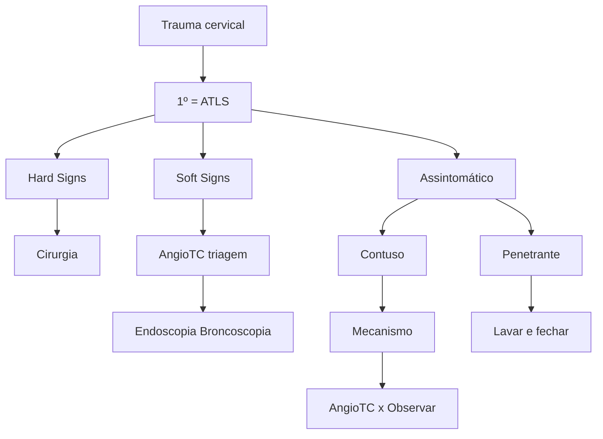
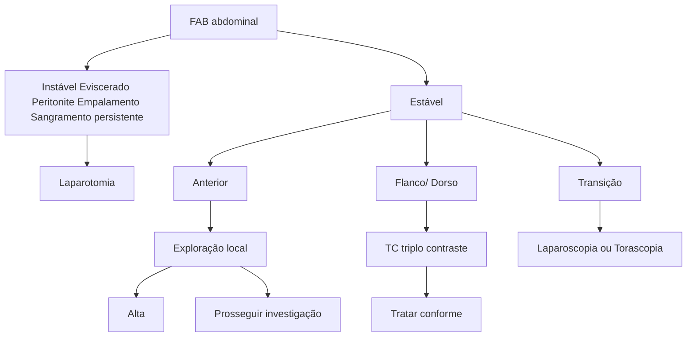
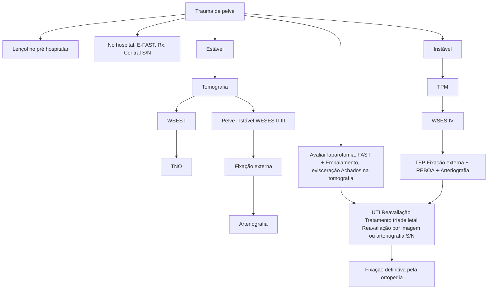
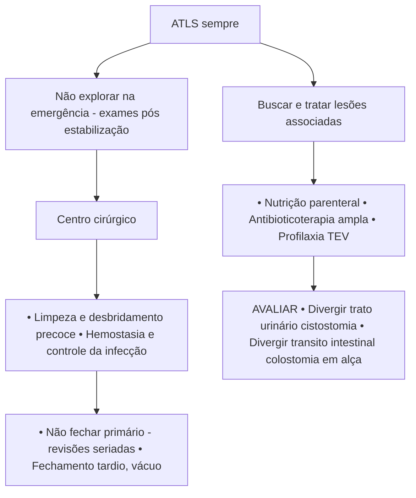
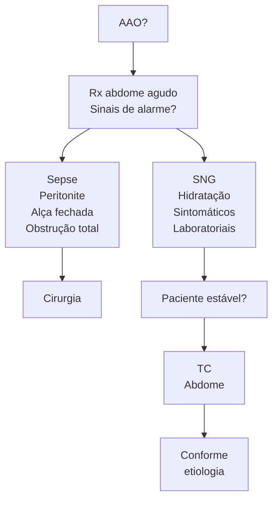
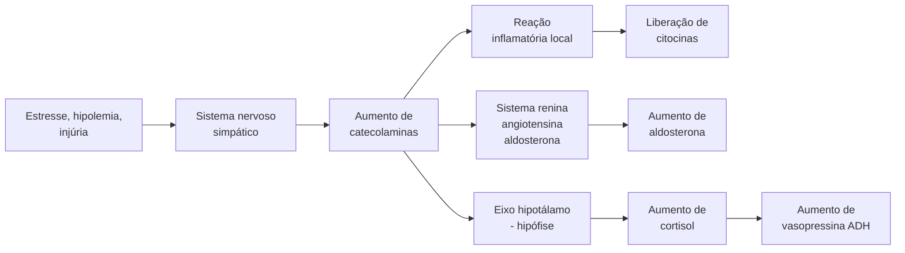

Miscelânia (CIR)

# RESUMÃO/ENCERRAMENTO

## 1. TRAUMA

### 1.1 O ATENDIMENTO INICIAL AO TRAUMA SEGUE UM FLUXO SISTEMÁTICO DE ATENDIMENTO

**Avaliação primária:**

• Dividida em 05 partes:
  - A. Via aérea e imobilização cervical;
  - B. Respiração / Ventilação;
  - C. Circulação e controle da Hemorragia;
  - D. "Disability";
  - E. Exposição e controle do ambiente.

Obs. Ao visualizar um problema, tem que ser feito o tratamento adequado no momento do diagnóstico

• Procedimento cirúrgico, toracotomia, intubação e transferência;
• Reavaliar a cada medida tomada para visualização dos parâmetros macro e micro hemodinâmicos.

**Completado a avaliação primária do paciente, mantendo estabilidade clínica e hemodinâmica:**

• Transferência do doente para tratamento definitivo;
• Avaliação secundária:
  • Consiste na avaliação de parâmetros clínicos, historia AMPLA e avaliação de exame físico da cabeça aos pés do paciente.

## 2. A: VIA AÉREA E IMOBILIZAÇÃO CERVICAL

• Conversar com o paciente - Lucido e orientado = via aérea pérvia;
• Em todo paciente com trauma, deve-se ofertar oxigênio com máscara não reinalante com FIO2 100%;
• Avaliar obstrução ou patencia de via aérea;
• Dispositivos supra-glóticos = Cânula de Guedel, máscara laríngea;
• Indicações de via aérea definitiva:
  • Obstrução de via aérea;
  • Trauma maxilofacial;
  • Queimadura de face;
  • Sangramento incoercível de via aérea;
  • Lesões inalatórias;
  • Apneia;
  • Insuficiência respiratória;
  • Hipoperfusão causando rebaixamento e agitação;
  • Inconsciência Glasgow <9.
• Outro ponto importante no cenário é avaliar o pescoço com visualização de hematoma, enfisema de subcutâneo, dor em região posterior, estase jugular, crepitação ou algum trauma penetrante;
• Nesta fase realizamos a imobilização cervical.

## 3. B: RESPIRAÇÃO / VENTILAÇÃO

• Trauma mais comum;

• Ocorre em 25% dos politraumatizados;
• 80% das lesões são tratáveis com suporte analgesia e drenagem;
• 15% necessitam de toracotomia.

### 3.1 LEMBRAR DAS 05 LESÕES COM RISCO DE MORTE IMINENTE

**Pneumotórax hipertensivo:** diminuição do MV no local afetado, hipertimpanismo, choque, redução do nível de consciência, estase de jugular

• Tratamento imediato: Toracocentese
• Definitivo: toracotomia tubular

**Hemotórax maciço:** diminuição do MV, macicez ou submacicez no exame físico, colabamento de veias jugulares, repercussão hemodinâmica.

• Tratamento imediato e diagnóstico: Toracostomia;
• Tratamento definitivo: Toracotomia de urgência.

**Pneumotórax aberto:** lesão com maior de ²⁄₃ do diâmetro da traqueia, ferimento soprante.

• Tratamento imediato: curativo em 03 pontas;
• Definitivo: drenagem + reconstrução da caixa torácica.

**Tamponamento cardíaco:** tríade de beck: abafamento de bulhas + hipotensão + estase jugular (mais proeminente no período expiratório).

• Tratamento imediato: pericardiocentese;
• Tratamento imediato: toracotomia de urgência.

**Lesão traqueobrônquica central:** pneumotórax com repercussão mesmo após drenagem tubular:

• Tratamento Imediato: colocação de outro tubo e/ou utilização de aspiração contínua;
• Tratamento Definitivo: toracotomia de urgência.

### 3.2 RISCO POTENCIAL DE MORTE

• Podem ou não necessitar de investigação;
• Mais visualizados na avaliação secundária:
  • Hemopneumothorax;
  • Contusão pulmonar e tórax instável;
  • Pneumomediastino;
  • Ruptura de aorta/ trauma cardíaco;
  • Lesões traqueobrônquicas;
  • Trauma de esôfago/ quilotórax;
  • Síndrome do esmagamento;
  • Fraturas / enfisema de subcutâneo;
  • Hernia diafragmática.

### 3.3 PREVENÇÃO

• Para traumas importantes que evoluem a óbito antes mesmo da chegada da equipe extra-hospitalar:
  1. Trauma de aorta;
  2. Contusão cardíaca;
  3. Traumas penetrantes graves.

### 3.4 TORACOTOMIA DE REANIMAÇÃO:

• Melhor indicada em casos de trauma penetrante com sinais de vida ao atendimento:

CIRURGIA GERAL

• Realiza-se toracotomia anterolateral esquerda com RCP intracardíaca.

**3.5 TRAUMAS EM TRANSIÇÃO TORACOABDOMINAL**
• Podem necessitar de videolaparoscopia ou videotoracoscopia para visualização e sutura do diafragma com fio inabsorvível.

## 4. C: CIRCULAÇÃO E CONTROLE DA HEMORRAGIA

**Procurar sinais de choque:**
• Pele;
• Mucosas;
• Pulsos;
• Perfusão;
• Nível de consciência;
• Sinais Vitais;
• TEC;
• Gasometria arterial;
• Diurese;
• Busca e tratamento de focos ativos de sangramento:
  • Tórax;

• Abdome;
• Pelve;
• Membros;
• Externamente.
• Realiza punção de 02 acessos calibrosos jelco 36 (Dois 18);
• Colhe-se exames de tipagem sanguínea, gasometria, Teste de gravidez e se administra dose de bolus de transamin em casos selecionados;
• Realiza-se expansão volêmica permissiva com 1L de Ringer Lactato;
• Pacientes podem necessitar de Hemoderivados e de Protocolo de transfusão maciça:
  • Pacientes com choque grau III e IV, não respondedor e de foco de sangramento de difícil controle pode necessitar de transfusão hemostática e Cirurgia de damage control.
• Cirurgia de damage control:
  • Inventário + Desbridamento + Rafia de lesões vasculares e entéricas + Sepultamento de cotos e Peritoniostomia.
• Confira Figura 1 Figura 2 Figura 3 Figura 4

**Figura 1** Fluxograma Cervical

**Figura 2** Fluxograma trauma Abdominal

CIRURGIA GERAL VIII: RESUMÃO/ENCERRAMENTO    3

**Figura 3** Fluxograma trauma de pelve

**Figura 4** Fluxograma trauma pelviperineal complexo

## Tratamento não operatório

- Realizado em centro de referência com UTI - e cirurgião 24 horas;
- Tomografia e diagnóstico preciso de lesão de víscera parenquimatosa em paciente com instabilidade hemodinâmica;
- Com banco de sangue, radiologia, endoscopia e laboratório;
- Se possível, tratamento com radiologia intervencionista;
- Centro cirúrgico capacitado 24 horas;
- Ausência de indicações cirúrgicas claras;
- Realização de monitorização controle clínico e avaliação laboratorial;
- Ausência de outras lesões associadas (TCE);
- Avaliar bem paciente e lesão.

## 5. D: '' DISABILITY''

- No atendimento inicial, prevenir lesões secundárias, visto que as primárias já ocorreram com etiologia traumática;
- Observação de pupilas + Lesões Focais + Nível de consciência (Glasgow).

### 5.1 SOFT PACK : MONITORIZAÇÃO E MANUTENÇÃO DE VALORES HEMODINÂMICOS PARA O PACIENTE NEUROCRÍTICO

- PAS> 100/ 110;
- Temperatura > 36;
- Glicose : 80-180;
- SPO2> 95;
- PAO2>100;
- Plaquetas >75 mil;

CIRURGIA GERAL

• Na: 135-145;
• Ph: 7,35-7,45;
• PaCO2: 35-45;
• Cabeceira elevada;
• PIC <15;
• PPC >60;
• Analgesia e sedação;
• RASS 0;
• INR <1,4;
• HB > 7.

## 5.2 TRAUMA RAQUIMEDULAR

**Choque Neurogênico:**
• Perda do tônus vasomotor;
• Denervação simpática;
• Normalmente ocorre em lesões acima da topografia de T6;
• Bradicardia + Hipotensão;
• Tratamento: Reposição de volume + início de Droga vasoativa.

**Choque Medular:**
• Flacidez e perda dos reflexos;
• Duras até 02 semanas após acidente;
• Regride posteriormente para deficit espástico;
• Em alguns pacientes, pode melhorar o nível de lesão;
• Necessita de tratamento definitivo;
• Corticoide não apresenta evidência para tratamento.

## 6. ABDOME AGUDO

**Apendicite**

**Escore de Alvarado**
• Confira Tabela 1 abaixo

### 6.1 COLECISTITE E COLEDOCOLITIASE
• Lembrar da visão crítica de segurança de Strasberg:
  - Dissecção do terço proximal da vesícula;
  - Dissecção do trígono hepatocístico;
  - Visualização de 02 estruturas tubulares adentrando a vesícula (Art. cística e ducto cístico).

**Tabela 1 Escore de Alvarado**

| Sinais / Sintomas                                                                                                                                                                                                                                      | Ponto         | Escala de AlvaradoConduta | Escala de AlvaradoConduta |
| ------------------------------------------------------------------------------------------------------------------------------------------------------------------------------------------------------------------------------------------------------ | ------------- | ------------------------- | ------------------------- |
| **Tudo que aponta com o dedo é 1 ponto**
Comida não entra (anorexia)
Comida sai (náusea)
Migração da dor
Dói quando tira um dedo (descompressão dolorosa)
Termômetro é o dedo (febre)
Apontando o desvio à esquerda com o dedo | 1 Ponto cada  | 1 -4 pontos               | ALTA                      |
|                                                                                                                                                                                                                                                        |               | 5-6 pontos                | Observar/USG              |
| **Tudo o que entra são 2 pontos**
Dói quando os dois dedos entram no QID
Agulha entrando para coletar o sangue                                                                                                                                 | 2 Pontos Cada | 7-10 pontos               | Cirurgia                  |

**Critérios de Tokyo**

| A - Sinais locais
de inflamação         | Murphy +
Dor, rigidez em HCD      |
| ------------------------------------------- | ------------------------------------- |
| B - Sinais
sistêmicos de
inflamação | Febre
Leucocitose
PCR elevada |
| C - Imagem
compatível                   | Achado compatível                     |

A + B + C - Colecistite aguda 2/3 - Probabilidade apenas

**Figura 5 Critérios de Tokyo**

**Classificação de tokyo para colecistite:**
• Tokyo I: Realizar colecistectomia;
• Tokyo II: Realizar colecistectomia ou colecistostomia dependendo da condição clínica do paciente;
• Tokyo III: Drenagem da via biliar (Colecistostomia).

**Critérios de Tokyo**

| A - Sinais
sistêmicos de
inflamação | Febre > 38º, calafrios
Leucocitose         |
| ------------------------------------------- | ---------------------------------------------- |
| B - Colestase                               | Bilirrubina > 2
TGO, TGP, FA, GGT elevadas |
| C - Imagem
compatível                   | Dilatação VB
Etiologia visível             |

A + B + C - Colangite aguda 2/3 - Probabilidade apenas Cuidado com hepatite aguda

**Figura 6 Critérios de Tokyo**

## 6.2 PANCREATITE

• Quadro clínico com dor abdominal + elevação da amilase e lipase + imagem compatível (necessário 2 de 3)
• Tratamento:
  • Hidratação;
  • Analgesia;
  • Jejum (Atualmente estudos demonstraram possibilidade de realimentação precoce ou passagem de SNE);
  • Monitorizar;
  • Classificar com etiologia (Biliar, Alcoólica, Medicamentosa, Autoimune, Hipertrigliceridemia);
  • Tratamento da Necrose Pancreática.

**Step-up-Approach**
- 1º → suporte clínico intensivo
- 2º → drenagem de coleções por radio intervenção
- 3º → + drenos, endoscopia
- 4º → VLP retroperitoneal
- Última → Necrosectomia aberta (melhor após 04 semanas)

• Diverticulite

| Não complicada | Antibiótico\*\* e alta (75% dos casos) |
| -------------- | -------------------------------------- |
| Hinchey I      | Antibiótico e observação               |
| Hinchey II     | Antibiótico e drenagem                 |
| Hinchey III    | Antibiótico e cirurgia                 |
| Hinchey IV     | Antibiótico e cirurgia de Hartmann     |

**Figura 7** Classificação de Hinchey

• Fluxograma Manejo no abdome agudo obstrutivo;

**Figura 8** Fluxograma AAO

## 6.3 HERNIAS

**02 principais grupos com fatores de risco:**
• Fraqueza abdominal;
• Aumento da pressão abdominal;
• O tratamento é cirúrgico com tela sem tensão;
• Lembrar da anatomia da região inguinal: Pele, subcutâneo (Tecido de Camper e Scarpa), Aponeurose do músculo oblíquo externo, anel inguinal externo, músculo oblíquo interno, fáscia transversalis, gordura pré-peritoneal e peritônio;
• Triângulo de Hasselbach: Triângulo formado pela margem lateral do mm. Reto abdominal + ligamento inguinal + Vasos epigástricos:
  • Hérnias mediais aos vasos epigástricos são hérnias diretas;
  • Hérnias laterais aos vasos epigástricos são hérnias indiretas;
  • Hérnias inferiores ao ligamento inguinal e medial aos vasos femorais são denominadas hérnias crurais (Femorais).

**Orifício miopectineo de Fruchaud:**
• Seus limites são a borda superior do púbis, músculo oblíquo interno/transverso medialmente, músculo reto abdominal medialmente, psoas lateralmente.
• Visão posterior do conteúdo inguinal e da topografia de falhas na parede abdominal
• Visualização do Y invertido:
  • Veia e artéria femoral inferior ao ligamento inguinal
  • Vasos epigástricos inferiores superiormente.

**Visualização de 05 triângulos:**
• Hernias diretas: suprainguinais medial aos vasos epigástricos;
• Hérnia Indireta: suprainguinal lateralmente aos vasos epigástricos;
• Hérnia femoral: infra Inguinais medial aos vasos femorais;
• Triângulo de Doom: Entre o ducto deferente medialmente e os vasos gonadais lateralmente, local da veia e artéria ilíaca externa;
• Triangulo Da Dor: lateralmente aos vasos gonadais, local do nervo cutâneo lateral da coxa.

**Figura 9** Orifício Miopectíneo de Frouchard

(Anatomical diagram showing: MEDIAL and LATERAL regions, with ANTERIOR and POSTERIOR orientations. Key structures labeled include: Epigastric Vessels, Umbilical Ligament, Pubic Symphysis, Inguinal Ligament, Iliac Crest, Vas Deferens, and Spermatic Vessels)

**Protocolo de cirurgia Segura:**
• Feita em 03 etapas: check in, Time out e Check out.

CIRURGIA GERAL

**Tabela 2 Lista de Verificação de Segurança Cirúrgica (Primeira Edição)**

| Antes da induçãoanestésica                                                                                                                                                                                                                                                                                                                                                                                                                                                                                                                                                                                             | Confirmação                                                                                                                                                                                                                                                                                                                                                                                                                                                                                                                                                                                                                                                                                                                                                                                                                                                                                                                                                                                                 | Antes de o paciente sairda sala de operações                                                                                                                                                                                                                                                                                                                                                                                                                                                                                                                                                                                                                                                                                                                                                           |
| ---------------------------------------------------------------------------------------------------------------------------------------------------------------------------------------------------------------------------------------------------------------------------------------------------------------------------------------------------------------------------------------------------------------------------------------------------------------------------------------------------------------------------------------------------------------------------------------------------------------------- | ----------------------------------------------------------------------------------------------------------------------------------------------------------------------------------------------------------------------------------------------------------------------------------------------------------------------------------------------------------------------------------------------------------------------------------------------------------------------------------------------------------------------------------------------------------------------------------------------------------------------------------------------------------------------------------------------------------------------------------------------------------------------------------------------------------------------------------------------------------------------------------------------------------------------------------------------------------------------------------------------------------- | ------------------------------------------------------------------------------------------------------------------------------------------------------------------------------------------------------------------------------------------------------------------------------------------------------------------------------------------------------------------------------------------------------------------------------------------------------------------------------------------------------------------------------------------------------------------------------------------------------------------------------------------------------------------------------------------------------------------------------------------------------------------------------------------------------ |
| Identificação                                                                                                                                                                                                                                                                                                                                                                                                                                                                                                                                                                                                          | Confirmação                                                                                                                                                                                                                                                                                                                                                                                                                                                                                                                                                                                                                                                                                                                                                                                                                                                                                                                                                                                                 | Registro                                                                                                                                                                                                                                                                                                                                                                                                                                                                                                                                                                                                                                                                                                                                                                                               |
| • Paciente confirmou
• Identidade
• Sítio Cirúrgico
• Procedimento
• Consentimento
• Sítio demarcado não se
aplica
• Verificação de segurança
anestésica concluída
• Oxímetro de pulso
no paciente e em
funcionamento
• O paciente possui:
• Alergia conhecida:
• NÃO
• SIM
• Via aérea difícil/risco de
aspiração:
• NÃO
• SIM, E EQUIPAMENTO/
ASSISTÊNCIA
DISPONÍVEIS
• Risco de perda sanguínea
> 500 ml (7ml/kg em
crianças)
• NÃO
• SIM, e acesso
endovenoso adequado e
planejamento para fluídos | • Confirmar que todos os membros da equipe
se apresentaram pelo nome e função
• Cirurgião, anestesiologista e a equipe de
enfermagem confirmam verbalmente:
• Identificação do paciente
• Sítio cirúrgico
• Procedimento
• Eventos críticos previstos:
• Revisão do cirurgião:
Quais são as etapas críticas ou
inesperadas, duração da operação, perda
sanguínea prevista?
• Revisão da equipe de anestesiologia:
Há alguma preocupação específica em
relação ao paciente?
• Revisão da equipe de enfermagem: os
materiais necessários (Ex: instrumentais,
próteses) estão presentes e dentro
do prazo de esterilização? (Incluindo
resultados do indicador)? Há questões
relacionadas a equipamentos ou quaisquer
preocupações?
• A profilaxia antimicrobiana foi realizada nos
últimos 60 minutos?
• SIM
• NÃO SE APLICA
• As imagens essenciais estão disponíveis?
• SIM
• NÃO SE APLICA | • O profissional da equipe de
enfermagem ou da equipe médica
confirma verbalmente com a equipe:
• Registro completo do
procedimento intra-operatório,
incluindo procedimento executado
• Se as contagens de instrumentais
cirúrgicos, compressas e agulhas
estão corretas (ou não se aplicam)
• Como a amostra para anatomia
patológica está identificada
(incluindo o nome do paciente)
• Se há algum problema com
equipamento para ser resolvido
• O cirurgião, o anestesiologista e a
equipe de enfermagem revisam
preocupações essenciais para a
recuperação e o manejo do paciente
(especificar critérios mínimos a
serem observados: ex: dor)

• ----------------------------
---------
• Assinatura |

**Figura 10 Fluxograma REMIT**

## 6.4 MELANOMA

• Neoplasia maligna de células basais da junção dermo-epidérmica;
• A biópsia excisional ainda constitui o principal método diagnóstico/terapêutico.

**Lembrar do ABCDE:**

• Assimetria;
• Bordas;
• Alteração de coloração;
• Diâmetro > 1 cm;
• Evolução.

CIRURGIA GERAL VIII: RESUMÃO/ENCERRAMENTO                                                                             7

**Indicação de ampliação de margens:**
• Breslow 0,5-1 mm ampliação de margens para 1 cm;
• Breslow maior que 1 mm: ampliação de margens para 2 cm.

**Pesquisa de linfonodo Sentinela:**
• Breslow > 0,8mm: pesquisar;
• Breslow < 0,8 mm: não pesquisar;
• Caso um paciente apresente adenomegalia com lesão suspeita, inicia-se o manejo através de uma PAAF no local de metástase;
• Micrometástase: Lesões ao redor de lesão primária com menos de 1cm de raio;
• Metástase em trânsito: Lesões ao redor de lesão primária com mais de 1cm de raio.

## 6.5 SARCOMAS
• Neoplasias de células mesenquimais;
• Apresentam-se como grandes massas em região de adipócitos, Musculatura e retroperitônio com crescimento acelerado e com tendência a invasão por contiguidade;
• Apresentam maior disseminação hematogênica.

## 6.6 SARCOMAS DE PARTES MOLES
• Inicia-se com exame de imagem, como RM OU TC;
• A biópsia deve ser realizada a fim de garantir estudo anatomopatológico, normalmente realizado por Tru-cut;
• Cirurgia realizada com retirada de todo o tecido de pele a musculatura.

## 6.7 SARCOMAS DE RETROPERITONEO

**Necessitam de avaliação em exames de imagem para visualização de ressecabilidade (Estadiamento)**
• TC, normalmente utilizada para avaliar retroperitônio, coluna, cavidade abdominal e procura de metástases pulmonares
• RM: Normalmente utilizada para avaliação pélvica
• PET-TC: Pode ser utilizado, mas não distingue tão bem lesões benignas de malignas
• Não se realiza biópsia
• Critérios de ressecabilidade
  • Sem sarcomatosis
  • Sem envolvimento extenso da coluna
  • Sem envolvimento renal bilateral
  • Sem invasão de raiz do mesentério
  • Sem invasão vascular importante
  • Sem invasão hilar hepática
• Programa-se a cirurgia, normalmente envolvendo exerese em monobloco de órgãos afetados

# REFERÊNCIAS

**Figura 9 Orifício Miopectineo de Frouchard**

Furtado M, Claus CMP, Cavazzola LT, Malcher F, Bakonyi-Neto A, Saad-Hossne R. Sistematização do reparo da hérnia inguinal laparoscópica (TAPP) baseada em um novo conceito anatômico: Y invertido e cinco triângulos. ABCD Arq Bras Cir Dig. 2019;32(1):e1426. DOI: /10.1590/0102-672020180001e1426
