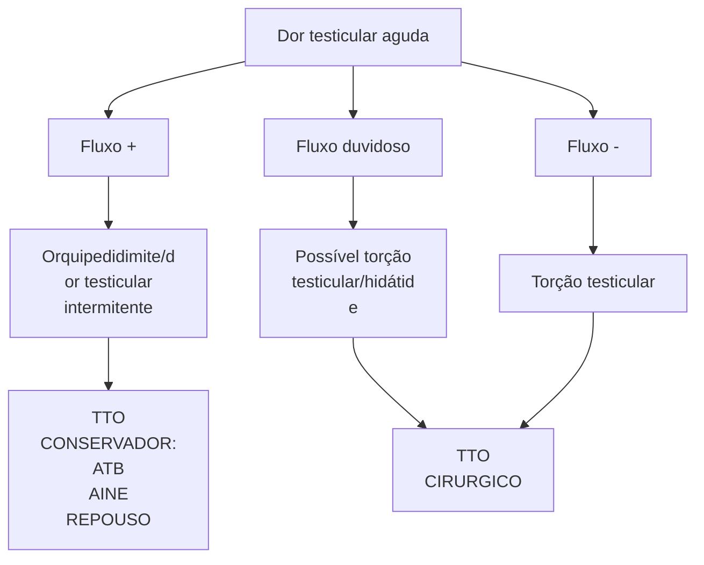

# O QUE UM PEDIATRA PRECISA SABER DE CIRURGIA PEDIÁTRICA - NO PRONTO-SOCORRO?

## Estenose Hipertrófica de Piloro:
- Vômitos NÃO-BILIOSOS! + não melhoram + desidratação + abdome escavado + oliva pilórica
- Quadro clínico + oliva pilórica = patognomônico
- Meninos / 2 – 12 semanas
- USG é o melhor método diagnóstico
- Estabilização clínica da alcalose metabólica
- Tudo ok? Cirurgia (piloromiotomia)!

## Intussuscepção:
- Dor em cólica + fezes mucossanguinolentas (geleia de morango) + FID vazia
- 3-30 meses de vida - 2/3 meninos!
- USG é o melhor método diagnóstico (pseudo-rim / sinal do alvo)
- Estável e sem sinais de alarme?
  - 1° tentar redução com enema
  - 2° laparotomia exploradora para redução

## Divertículo de Meckel:
- Enterorragia = mais comum

- Regra dos 2
- Diagnóstico com cintilografia (Tc-99)
- Cirurgia = se sintomático
- Achado acidental:
  - Imagem→ Acompanhar
  - Intraoperatório→ Considerar ressecção

## Apendicite Aguda:
- Diagnóstico CLÍNICO!!!
- Acima de 2 anos até os 50!
- Blumberg+ com hiporexia, vômitos e febre baixa
- USG e TC são apenas auxiliares
- TTO cirúrgico (!)
- Complicações: necrose, perfuração, abscesso, peritonite

## Escroto Agudo:
- Assimetria + hiperemia + dor unilateral = Escroto agudo
- Escroto agudo = USG doppler
- Sem fluxo? EMERGÊNCIA CIRÚRGICA!
- Com fluxo aumentado? Orquiepididimite

----

## 1. ESTENOSE HIPERTRÓFICA DE PILORO

### 1.1. O QUE É E COMO CHEGA AO PS?
- Hipertrofia progressiva da musculatura pilórica, causando estreitamento e alongamento persistentes do canal pilórico;
- Meninos / 2 – 12 semanas

**Figura 1** Estenose hipertrófica de piloro (EHP) com oliva pilórica e abdome escavado

### 1.2. QUADRO CLÍNICO
- Vômitos não-biliosos frequentes;
- Irritabilidade e desidratação;
- Abdome escavado;
- Alcalose Metabólica + acidúria paradoxal;

### 1.3. COMO DIAGNOSTICAR?
- Exame físico: **oliva pilórica →** patognomônico!
- **USG:** sinal do alvo + espessamento longitudinal;
- Exame **contrastado:** estreitamento bulbar;

| Ex. Físico
Oliva pilórica | Sinal do alvo + espessamento longitudinal | USG | Contrastado
Estreitamento bulbar |
| ----------------------------- | ----------------------------------------- | --- | ------------------------------------ |

**Figura 2** Oliva pilórica / sinal do alvo ao USG / Estreitamento bulbar ao exame contrastado

CIRURGIA

## 1.4. COMO TRATAR?
• ESTABILIZAÇÃO CLÍNICA! → Não é uma emergência!
• **Cirurgia:** Piloromiotomia a Fredet-Ramstedt;
• **Via cirúrgica:** convencional X videolaparoscópica;

**Figura 3** Explicação fisiopatológica da alcalose metabólica com acidúria paradoxal características da EHP

**Figura 4** Piloromiotomia a Fredet-Ramstedt convencional X

## 1.5. DIAGNÓSTICOS DIFERENCIAIS

**Tabela 1** Diferenciação de apresentação clínica e tratamento de: Estenose Hipertrófica de Piloro, Refluxo Gastroesofágico e Atresia Duodenal

|              | Est. Hipert.de Piloro   | RefluxoGastroeso-fágico | AtresiaDuodenal |
| ------------ | ----------------------- | ----------------------- | --------------- |
| Vômitos      | NÃO-
BILIOSOS       | Alimentares             | Biliosos        |
| Frequência   | INCOERCÍVEIS            | Pouco
frequentes    | Incoercíveis    |
| Abdome       | PLANO/
ESCAVADO     | --                      | Escavo          |
| Desidratação | +++                     | --                      | +++             |
| Tratamento   | CLÍNICO +
CIRÚRGICO | Clínico                 | CIRÚRGICO       |

# 2. INVAGINAÇÃO INTESTINAL

## 2.1. O QUE É?
• Intussuscepção acontece quando um intestino proximal telescopa no distal pelo peristaltismo;
• Forma primária: Meckel, pólipos;

**Figura 5** Invaginação intestinal
• Pico epidemiológico: 3-30 meses de vida;
• Mais comum em meninos: 2/3!
• A localização mais comum é a Ileocecal;

## 2.2. QUADRO CLÍNICO
• Fezes em Geleia de morango / framboesa;
• Cólica intestinal intensa, variável;
• Sinal de Dance (FID vazia);

**Figura 6** Sinais clínicos de Invaginação intestinal

## 2.3. DIAGNÓSTICO
• USG: **Sinal do alvo** e **Pseudo-rim;**
• Enema Contrastado: **Sinal do menisco;**

**Figura 7** Intussuscepção em crianças: avaliação por métodos de imagem e abordagem terapêutica

O QUE UM PEDIATRA PRECISA SABER DE CIRURGIA PEDIÁTRICA? - CIRURGIA PED NO PS

**Figura 8** Tratamento não operatório (enema)

## 2.4. TRATAMENTO

• Enema Contrastado / USG: iniciar por essa modalidade em pacientes **estáveis**;

• Laparotomia / laparoscopia: se falha da redução com enema ou instabilidade;

**Figura 10** Tratamento cirúrgico de invaginação intestinal.

**Figura 11** Cirúrgico (laparotomia) de invaginação intestinal

## 3. DIVERTÍCULO DE MECKEL

### 3.1. O QUE É?

• Persistência do conduto onfalomesentérico e a rotação intestinal embrionária;

• **Mucosa gástrica ectópica;**

**Figura 9** Sinais radiológicos de Invaginação intestinal

USG
Sinal do alvo
Pseudo-rim

**Figura 12** Embriologia do conduto onfalomesentérico

| **A**
Mesentério
Vasos mesentéricos superiores   | **B**
Divertículo de Meckel
Cordão Fibroso
Umbigo
Divertículo de Meckel | **C**
Fístula umbilico-ileal              |
| -------------------------------------------------------- | --------------------------------------------------------------------------------------- | --------------------------------------------- |
| **D**
Cistos Vitelinos
Parede abdominal anterior | **E**
Sinus umbilical
Cordão Fibroso                                            | **F**
Artéria Vitelina
Cordão Fibroso |

CIRURGIA

![Medical imaging scan showing multiple frames of a nuclear medicine study]

**Figura 15** Cintilografia como exame gold-standart para diagnóstico de divertículo de Meckel

## 3.2. EPIDEMIOLOGIA: REGRA DOS 2
- 2% da população (4% sintomáticos);
- Descoberta aos 2 anos;
- 2x mais homens;
- 2 pés da válvula ileocecal (60cm);
- 2 polegadas de tamanho (5 cm);

![Clinical photograph showing Meckel's diverticulum]

**Figura 13** Divertículo de Meckel

## 3.3. QUADRO CLÍNICO
- Sangramento;
- Obstrução - Intussuscepção ou volvo;
- Diverticulite;
- Hérnia de Littré;

- Neoplasia - adulto;

![Pathological specimen showing intestinal bleeding]

**Figura 14** sangramento intestinal baixo característico de portadores de divertículo de Meckel

## 3.4. DIAGNÓSTICO
- EDA e Colonoscopia para excluir outras causas;
- Acidental;
- Cintilografia com TC-99: **padrão-ouro** → destaca mucosa gástrica fora do estômago;

## 3.5. TRATAMENTO
**CIRURGIA?**
- **Achado acidental:**
  - **Intraoperatório:** Considerar ressecção;
  - **De imagem:** Expectante!
- **Sintomático:** abordar!

O QUE UM PEDIATRA PRECISA SABER DE CIRURGIA PEDIÁTRICA? - CIRURGIA PED NO PS                                                        5

![Figura 16: Tratamento cirúrgico de divertículo de Meckel (enterectomia segmentar com enteroanastomose primária)]

**Tabela 2** Métodos secundários para diagnóstico de apendicite por imagem

| Achados USG                               | Achados TC                      |
| ----------------------------------------- | ------------------------------- |
| Estrutura tubular não compressível na FID | Estrutura tubular na FID        |
| Fecalito                                  | Fecalito                        |
| Diêmetro >7mm                             | Diêmetro >7mm                   |
| Espessura da parede >2mm                  | Sinal do alvo adjacente ao ceco |
| Espessamento da gurdura adjacente ao ceco | Espessamento mesentérico        |
| Blumberg US+                              | Abscesso                        |
| Líquido livre em FID                      | Líquido livre em FID            |

## 4. APENDICITE AGUDA

### 4.1. CONCEITOS
- Doença que mais comumente requer **cirurgia abdominal de emergência** na criança;
- **Principal causa de abdome agudo** cirúrgico na criança > 2a;
- **10% admissões** em salas de emergências pediátricas;

![Figura 17: Apendicite aguda - mostrando intestino, apêndice normal e apêndice inflamado]

### 4.2. DIAGNÓSTICO:
- É clínico!

### 4.3. QUADRO CLÍNICO
- Dor na FID;
- Bloomberg positivo;
- Náuseas e vômitos;
- Hiporexia;
- Febre;
- Constipação ou diarreia;

![Figura 18: Gradação das complicações pré-operatórias da apendicite aguda - mostrando progressão de NORMAL (1) através de estágios não-complicadas (2-3) até complicadas (4)]

### 4.4. CLASSIFICAÇÃO:
- Complicada: Necrose → Perfuração → Abscesso localizado → Peritonite purulenta/fecal;

### 4.5. TRATAMENTO
- **CIRÚRGICO:**
  - Laparotomia – Incisão a Rocky-Davis;
  - Videolaparoscópica;

![Figura 19: Métodos cirúrgicos para tratamento de apendicite (laparotomia ou laparoscopia) - mostrando técnicas cirúrgicas com ilustrações de gauze walling off intestines, ileum, mesoappendix, appendiceal artery, right angle forceps, e ligated mesoappendix]

## 5. ESCROTO AGUDO

- **Etiologias**
  - Torção testicular
  - Torção de Hidátide
  - Orquiepididimite
  - Dor testicular intermitente

CIRURGIA

Figura 20

**Figura 20** Evidências clínicas e cirúrgicas de escroto agudo

• **Avaliação**
  • **Usg doppler de região testicular:** O USG da região testicular com doppler deve ser feito, mas não deve atrasar a conduta frente suspeita cirúrgica;

**Figura 21** Fluxograma de avaliação de dor Testicular aguda

## 5.1 ORQUIEPIDIDIMITE
• Bacteriana (10-15% dos EA);
• Viral (caxumba): raro;
• Dor e edema escrotais com **testículo móvel**;
• USG doppler com **fluxo aumentado** ou Exame de **urina alterado**;
• **AINE + ATB** de acordo com cultura;

## 5.2 DOR TESTICULAR INTERMITENTE
• Sintomas muito semelhantes à torção testicular...mas **melhoram com analgesia comum**;
• **USG doppler normal**;
• **História de recorrência**;

## 5.3 TORÇÃO DE HIDÁTIDE
• Sintomas muito semelhantes à torção testicular...mas **melhoram com AINE**
• **Blue-dot** (ponto azul)
• **Principal causa de escroto agudo** (subdiagnosticada)
• **Cirurgia é tratamento de exclusão!**

Figura 22

**Figura 22** *Blue dot* / **torção de hidátide**

Anatomia

**Figura 22 (continuação)** *Blue dot* / **torção de hidátide**

## 5.4 TORÇÃO DO TESTÍCULO
• **Sintomas não melhoram:** Se melhoram, sinal de isquemia do órgão;
• Testículo alto e horizontal com reflexo cremastérico ausente;
• **USG DOPPLER (FLUXO): Pouco ou ausência de fluxo;**
• **EMERGÊNCIA CIRÚRGICA:** Com orquidopexia contralateral;
  • > 24h de sintoma: < 10% de chance de salvamento testicular;

Figura 23

**Figura 23** Torção testicular com possível necrose do órgãos

## 5.5. DIAGNÓSTICO X TRATAMENTO:

Figura 24

**Figura 24** Torção testicular com evidência ao USG doppler

O QUE UM PEDIATRA PRECISA SABER DE CIRURGIA PEDIÁTRICA? - CIRURGIA PED NO PS                    7

**Figura 25** Torção testicular com evidência ao USG doppler

The first image shows two testicles side by side. The left testicle is labeled "Testículo Normal" (Normal Testicle) and appears pink/healthy. The right testicle is labeled "Testículo com isquemia" (Testicle with ischemia) and appears darker/bluish, indicating compromised blood flow.

**Figura 26** Tratamento cirúrgico evidenciando torção testicular esquerda

The second image is a medical illustration showing testicular torsion with the following labeled elements:

**Torção Testicular**
- Emergência cirúrgica que requer intervenção dentro de 6 horas (Surgical emergency requiring intervention within 6 hours)
- A torção do testículo e do cordão espermático resulta em isquemia (Torsion of the testicle and spermatic cord results in ischemia)
- Dor aguda e inchaço (Acute pain and swelling)
- Ultrassonografia Doppler demonstra diminuição do fluxo sanguíneo (Doppler ultrasound demonstrates decreased blood flow)

The illustration depicts the twisted spermatic cord and testicle, with cartoon-style characters representing the affected structures showing distress.

CIRURGIA

# REFERÊNCIAS

**Figura 2 Oliva pilórica / sinal do alvo ao USG / Estreitamento bulbar ao exame contrastado**

Estenose hipertrófica do piloro: caracterização clínica, radiológica e ecográfica. Radiol Bras 36 (2) • Mar 2003

**Figura 4 Piloromiotomia a Fredet-Ramstedt convencional X videolaparoscópica**

https://pre-med.jumedicine.com/wp-content/uploads/sites/9/2021/09/1-Intussusception-and-HPS-summary.pdf

**Figura 6 Sinais clínicos de Invaginação intestinal**

https://www.aboutkidshealth.ca/intussusception + www.sanarmed.com/sinais-classicos-no-abdome-agudo-posme

**Figura 7 Sinais radiológicos de Invaginação intestinal**

Intussuscepção em crianças: avaliação por métodos de imagem e abordagem terapêutica. Radiol Bras 38 (3) • Jun 2005

**Figura 9 Cirúrgico (laparotomia) de invaginação intestinal**

Intussuscepção em crianças: avaliação por métodos de imagem e abordagem terapêutica. Radiol Bras 38 (3) • Jun 2005

**Figura 11 Divertículo de Meckel**

https://www.researchgate.net/figure/Meckels-Diverticulum-shown-during-surgery_fig1_340214946

**Figura 13 Cintilografia como exame gold-standart para diagnóstico de divertículo de Meckel**

https://radiopaedia.org/cases/meckel-diverticulum-4

**Figura 14 Tratamento cirúrgico de divertículo de Meckel (enterectomia segmentar com enteroanastomose primária)**

https://www.goconqr.com/mapamental/20162841/diverticulo-de-meckel

**Figura 15 Apendicite aguda**

https://www.institutolaparo.com.br/cirurgia/apendicectomia/

**Figura 18 Gradação das complicações pré-operatórias da apendicite aguda**

https://imedicineapp.com/c/apendicite-aguda/M1zaLm

**Tabela 2 Métodos secundários para diagnóstico de apendicite por imagem**

Adaptado de https://www.institutolaparo.com.br/cirurgia/apendicectomia/

**Figura 19 Métodos cirúrgicos para tratamento de apendicite (laparotomia ou laparoscopia)**

Apendicectomia videolaparoscópica. Retirado de: Baley & Love's Short Practice of Surgery

**Figura 20 Evidências clínicas e cirúrgicas de escroto agudo**

Ashcraft - Cirurgia pediátrica. Holcomb III, George W. (Autor), Murphy, J. Patrick, 6ed

**Figura 21 Fluxograma de avaliação de dor Testicular aguda**

Arquivo Medcof

**Figura 22 Blue dot / torção de hidátide**

https://www.drmaitablog.site/2016/11/dolor-testicular.html

**Figura 22 Torção testicular com possível necrose do órgãos**

https://www.drmaitablog.site/2016/11/dolor-testicular.html

**Figura 23 torção testicular com evidência ao USG doppler / tratamento cirúrgico evidenciando torção testicular esquerda**

https://vialiv.com.br/2019/01/06/torcao-de-testiculo-torcao-do-cordao-espermatico/ + https://twitter.com/UroOnco/status/741198541071224832

**Figura 24 torção testicular com evidência ao USG doppler / tratamento cirúrgico evidenciando torção testicular esquerda**

https://vialiv.com.br/2019/01/06/torcao-de-testiculo-torcao-do-cordao-espermatico/ + https://twitter.com/UroOnco/status/741198541071224832

**Figura 25 Torção testicular com evidência ao USG doppler**

https://vialiv.com.br/2019/01/06/torcao-de-testiculo-torcao-do-cordao-espermatico/ + https://twitter.com/UroOnco/status/741198541071224832
