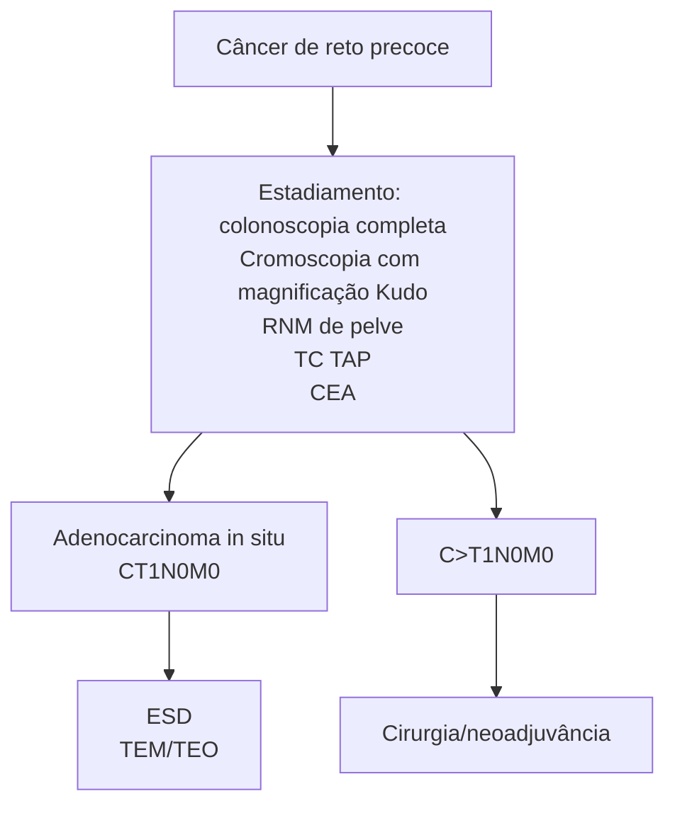

Coloproctologia    Câncer colorretal

# COLOPROCTOLOGIA CA COLORRETAL

**Carcinogênese do CCR**
- APC → B-catenina → K-Ras → P-53

**Rastreamento:**
- 45 – 85 anos → Colonoscopia a cada 10 anos

**Estadiamento e Tratamento:**
- Câncer de cólon Tc TAP. Reto intraperitoneal: TC Tórax, abdome e RM de pelve.

- Cirurgia com margens livres + linfadenectomia - 12 linfonodos

**Câncer de reto extraperitoneal (médio e distal):**
- TC Tórax e Abdome e RM de pelve
- Neoadjuvância (QRT para T3/T4 ou N+) + Retossigmoidectomia Excisão total do Mesorreto).

## 1. INTRODUÇÃO E CONSIDERAÇÕES GERAIS

### 1.1 DEFINIÇÕES
- É o tumor mais comum do trato gastrointestinal.

### 1.2 FATORES DE RISCO
- Sedentarismo;
- Estilo de vida não saudável – dieta pobre em fibras e rica em substâncias industrializadas; com maior consumo de alimentos ultraprocessados , padrão ocidental de alimentação.
- Diabetes
- Tabagismo;
- Etilismo;
- Obesidade;
- Idade.

### 1.3 CORRELAÇÃO CLÍNICA
- Hereditária: Polipose adenomatosa familiar; Polipose associada à MUTYH; Síndrome de Lynch (HNPCC). 100% dos pacientes que apresentam PAF podem desenvolver CCR até os 40 anos de idade
- Síndrome de Lynch: Também chamada de câncer colorretal hereditário não polipoide. Deve-se a mutação no MLH1, MSH2 E MSH6 e PMS2, obtém esse nome devido a maior facilidade de disseminação antes de atingir o estágio completo da formação polipoide
- Doença inflamatória intestinal: Retocolite ulcerativa; Doença de Crohn – eleva em 10 – 20x o risco de câncer colorretal. Tem maior risco de CCR devido ao grau de inflamação colônica associado ao tempo de atividade de doença apresentada, esses pacientes podem apresentar CCR com pior prognóstico e mais agressivos
- Colite actínica: Secundária à radiação abdominal; Pacientes podem apresentar sangramentos esporádicos em fezes (colite actínica). Normalmente, apresenta-se como um quadro de telangiectasias em cólon associado a maior rigidez do mesmo, obviamente, em pacientes que tiveram exposição a radiação nesta topografia.

**Tabela 1 Incidência de neoplasias**

| Homens
Localização primária | Homens
Casos | Homens
% | Mulheres
Localização primária | Mulheres
Casos | Mulheres
% |
| ------------------------------- | ---------------- | ------------ | --------------------------------- | ------------------ | -------------- |
| Próstata                        | 65.840           | 29,2         | Mama feminina                     | 66.280             | 29,7           |
| Cólon e reto                    | 20.540           | 9,1          | Cólon e reto                      | 20.470             | 9,2            |
| Traqueia, brônquio e pulmão     | 17.760           | 7,9          | Colo de útero                     | 16.710             | 7,5            |
| Estômago                        | 13.360           | 5,9          | Traqueia, brônquio e pulmão       | 12.440             | 5,6            |
| Cavidade oral                   | 11.200           | 5,0          | Glândula tireoide                 | 11.950             | 5,4            |
| Esôfago                         | 8.690            | 3,9          | Estômago                          | 7.870              | 3,5            |
| Bexiga                          | 7.590            | 3,4          | Ovário                            | 6.650              | 3,0            |
| Linfoma não-Hodgkin             | 6.580            | 2,9          | Corpo de útero                    | 6.540              | 2,9            |
| Laringe                         | 6.470            | 2,9          | Linfoma não-Hodgkin               | 5.450              | 2,4            |
| Leucemias                       | 5.920            | 2,6          | SNC                               | 5.230              | 2,3            |

Fonte: https://www.inca.gov.br/estimativa/estado-capital/brasil

*Números arredondados para múltiplos de 10.

CIRURGIA DO APARELHO DIGESTIVO

## 1.4 EPIDEMIOLOGIA

Observe a Tabela 1:

Apresenta-se como o 2º tumor em epidemiologia que acomete o sexo masculino perdendo em incidência apenas para o câncer de prostata, e o 3º em incidência no sexo feminino, com incidência menor apenas do câncer de mama e de colo do útero em nosso país. Distribuição proporcional dos dez tipos de câncer mais incidentes estimados para 2020, por sexo, exceto pele não melanoma*.

## 2. CARCINOGÊNESE DO CÂNCER COLORRETAL

### 2.1 EXISTE UMA SEQUÊNCIA CARCINOGÊNICA BEM ESTABELECIDA

• O processo leva, em média, 10 anos, na população geral.

OBS.: Tal fato se correlaciona com o tempo de rastreio por colonoscopia. O tempo entre um exame e o seguinte (em média, de 5 – 10 anos) da-se por esse motivo.

• Sequência: (1) Epitélio normal, sem alterações; (2) Agressão epitelial – tabagismo, sedentarismo e demais fatores de risco; (3) Mutação do gene **APC** (gene supressor tumoral) – predispõe à formação de pólipos; (4) Mutação da beta-catenina – demonstra potencial displásico; (5) Mutação do gene **K-Ras** (proto-oncogene) – evolui com aumento do potencial displásico, de baixo para alto grau; (6) Mutação do gene **p53** – origem de tumor com potencial invasivo da membrana basal; (7) Evolução carcinomatosa – com mutações finais da telomerase.

OBS: A origem da mutação do gene p53 marca a origem do carcinoma!!! Essa alteração fornece capacidade da neoplasia em estágio inicial invadir a submucosa e dessa forma ganhar a circulação hematogênica, assim como a linfática, tendo maior possibilidade de disseminação da mesma através de metástase

| Normal | Risco      | Adenomas   | Carcinomas |            |
| ------ | ---------- | ---------- | ---------- | ---------- |
|   |       |       |       |            |
| APC    | B-catenina | K-Ras P-53 |            | Telomerase |

**Figura 1** Sequência carcinogênica de risco.

## 3. PÓLIPOS

### 3.1 PÓLIPOS NEOPLÁSICOS

• Apresentam displasia, isto é, risco de malignização;

• A maioria dos pacientes que consomem uma dieta ocidental, terão pólipos após os 50 anos de idade, quanto mais displasia ou atipias, crescimento e comportamento viloso, maior capacidade de malignização e transformação neoplásica

• Subtipos: Adenomas: Tubular – possui melhor prognóstico; Viloso – pior prognóstico; Tubuloviloso – prognóstico intermediário. Serrilhados: Tais lesões apresentam morfologia plana, principalmente durante a insuflação do cólon; Ainda, evidenciam coloração semelhante à da mucosa normal, o que prejudica o diagnóstico e o tratamento endoscópico.

DICA! Adenomas **"viloso... vilão" → apresenta pior prognóstico!**

### 3.2 PÓLIPOS NÃO-NEOPLÁSICOS

• Não apresentam displasia;

• Subtipos: Hamartomas: Essas lesões são compostas de elementos que, normalmente, são encontrados no tecido local com crescimento desorganizado; Entretanto, acima do pólipo hamartomatoso, pode surgir um pólipo adenomatoso. Inflamatórios: antigamente, era denominados "pseudo-pólipos", sendo relacionados com etiologias inflamatórias; são áreas de cicatrização da mucosa. Hiperplásicos: são áreas com proliferações pequenas da mucosa.

COLOPROCTOLOGIA CA COLORRETAL<page_header>
COLOPROCTOLOGIA CA COLORRETAL

**Figura 2 e 3** Polipos neoplásicos.

## 4. RASTREAMENTO

### 4.1 RASTREAMENTO: 45 – 85 ANOS

• Populacional: a partir dos 45 anos - Exames: Colonoscopia a cada 10 anos; Demonstra bom custo benefício, com capacidade de identificação de pequenos pólipos, e pela possibilidade de polipectomia. Teste imunoquímico fecal (TIF) para sangue oculto, anualmente; Sigmoidoscopia, a cada 10 anos associado ao TIF, anualmente; Sigmoidoscopia, a cada 5 anos; Colonografia por tomografia computadorizada (CTC), ou Colono virtual, a cada 5 anos; Teste de DNA de fezes multitarefas com DNA-FIT (DNA-DTM-MT; Também conhecido como teste imunoquímico DNA fecal), a cada 3 anos. Teste de sangue oculto nas fezes baseado em Guaiac, anualmente;

• Até 85 anos (75 - 85 anos - rastreamento individualizado); Levar em consideração expectativa de vida e *performance status*; Individualizar cada paciente e garantir que o procedimento cirúrgico trará mais benefícios que malefícios

• Familiares de primeiro grau com câncer colorretal: A partir de 40 anos de idade ou, pelo menos, 10 anos antes da idade que o familiar apresentou câncer colorretal; O rastreamento é sempre realizado com colonoscopia, o que vier antes (Se uma paciente apresenta histórico de um familiar com CCR aos 45 anos, deve-se realizar o rastreio aos 35 anos da mesma);

• Alto risco (PAF, Lynch, RCU, Doença de Crohn): a depender do protocolo.

**Figura 4 e 5** Colonoscopia virtual.

### 4.2 COLONOSCOPIA VIRTUAL

• Indicação: Lesões intransponíveis em colonoscopia convencional, mas em cólon com capacidade de preparo; Em geral, a impossibilidade é dada pela visualização de tumor obstrutivo. Tem caráter principalmente para avaliar localização assim como averiguar novos tumores sincrônicos do cólon, dessa forma garantindo melhor proposta terapêutica para o paciente;

**Figura 6** Colonoscopia virtual.

• Demonstra eficácia semelhante à da colonoscopia óptica para a detecção de pólipos clinicamente pequenos e de câncer colorretal.

ATENÇÃO: as fezes podem simular lesões ou pólipos.

CIRURGIA DO APARELHO DIGESTIVO

# 5. MANIFESTAÇÕES CLÍNICAS

**Tabela 2 Manifestações clínicas.**

| Localização        | Manifestações clínicas                                                                                             |
| ------------------ | ------------------------------------------------------------------------------------------------------------------ |
| Cólon direito      | Anemia
Fadiga
Massa palpável
Dificilmente evolui com obstrução
intestinal, sangue oculto nas fezes |
| Cólon
esquerdo | Hematoquezia
Alteração do hábito intestinal e
consistência fecal
Obstrução                             |
| Reto               | Tenesmo
Dor
Calibre fecal reduzido
Obstrução                                                           |

• Atente-se ao seguinte: em geral, as afecções do cólon direito são menos sintomáticas!!! Neoplasias do cólon direito apresentam-se principalmente com quadro de anemia assintomático, tendo fator obstrutivo na progressão da doença, muitas vezes um paciente com esse quadro tem uma neoplasia em estágio mais avançado devido ao maior crescimento do tumor e necrose, o que favorece a hematoquezia e a anemia já citada. Já os tumores do colon esquerdo apresentam-se inicialmente com maior facilidade de obstrução devido a menor dimensão do retossigmoide. Neoplasias no reto tem como sintomatologia principal quadro de obstipação tenesmo e alteração no formato das fezes.

## 5.1 PROGNÓSTICO

• Tumores de cólon direito demonstram pior prognóstico em comparação àqueles do cólon esquerdo e reto; Primeiramente, pelo diagnóstico em estágios mais avançados e, também, pela maior associação com a síndrome de Lynch; (1) A síndrome de Lynch cursa com instabilidade de microssatélites, O que favorece a implantação ou então invasão da submucosa sem desenvolver o processo neoplásico de forma contígua, favorecendo o pior prognóstico.

## 5.2 TUMORES DE CÓLON ESQUERDO

• Os tumores do cólon esquerdo costumam evidenciar sintomas precocemente, principalmente pela presença de sangue vivo nas fezes (hematoquezia), além de apresentar maior sensibilidade aos quadros obstrutivos devido ao menor lumen apresentado e maior crescimento intraluminal concêntrico constrictivo.

**Figura 7 Manifestações clínicas.**

Cólon Transverso 10%

Cólon esquerdo 15% (descendente)

Cólon sigmoide 25% (sintomas de obstrução mais frequentes que o sangramento)

Cólon direto ascendente 30% (sangramento oculto, anemia)

Reto 20% (Tenesmo, dor, sangramento)

# 6. ESTADIAMENTO

## 6.1 CÂNCER DE RETO X CÂNCER DE CÓLON:

**Tabela 3 Câncer de reto X Câncer de Cólon**

| Reto                                                          | Cólon                                                         |
| ------------------------------------------------------------- | ------------------------------------------------------------- |
| Tomografia de tórax e de abdome superior                      | Tomografia de tórax e de abdome superior                      |
| Ressonância magnética de pelve                                | Tomografia de pelve                                           |
| CEA (antígeno carcinoembrionário)                             | CEA (antígeno carcinoembrionário)                             |
| Colonoscopia completa (exclusão de outras lesões sincrônicas) | Colonoscopia completa (exclusão de outras lesões sincrônicas) |

OBS.: O CEA é um bom marcador prognóstico e para acompanhamento.

## 6.2 RESSONÂNCIA MAGNÉTICA DE PELVE – PARA ESTADIAR OS TUMORES DE RETO.

• Devido a maior quantidade de tecido adiposo, favorece uma melhor visualização das estruturas, assim como invasão do músculo elevador do anus
• Consegue identificar melhor invasão extramural, e disseminação angiolinfática;
• Ainda, há possibilidade de localizar o tumor de reto acima (tumores altos; intraperitoneais) ou abaixo (tumores médios ou baixos; extraperitoneais) da reflexão peritoneal.

## 6.3 ESTADIAMENTO TNM:

**Tabela 4 Câncer de reto X câncer de cólon**

| Nx | Linfonodos não avaliados     |
| -- | ---------------------------- |
| N0 | Sem linfonodos comprometidos |
| N1 | 1 – 3 linfonodos positivos   |
| N2 | 4 ou + linfonodos positivos  |

COLOPROCTOLOGIA CA COLORRETAL                                                                              5

| M0 | Sem metástase |
| M1 | Metástases à distância |

| 0 | Tis N0M0 (in situ) |
| I | T1-T2 N0M0 |
| II | T3-T4 N0M0 |
| III | Tx N+M0 |
| IV | TxNx M1 |

**Figura 8 Estadiamento TNM**

[Diagram showing intestinal tissue cross-section with labels:]
- Tecido intestinal normal (seção transversal do trato digestivo)
- Tis - mucosa
- T1 - submucosa
- T2 - muscular
- T3 - subserosa
- T4a - serosa
- T4b - órgãos adjacentes

## 7. TRATAMENTO

### 7.1 CÂNCER DE CÓLON OU RETO (INTRAPERITONEAL):

• A princípio, não existe neoadjuvância para tais tipos; Dessa, forma pensar em quimioterapia apenas em caráter adjuvante, ou seja após o tratamento cirúrgico

• Cirurgia; O procedimento depende da localização neoplásica: Cólon direito: colectomia direita; Cólon esquerdo: colectomia esquerda; Colon transverso: transversectomia; Sigmoide: retossigmoidectomia. Em alguns casos, deve-se realizar ressecção em bloco com exérese multivisceral de focos acometidos pela neoplasia. Pode ser necessário ressecção de parte da bexiga, ureterectomia e em alguns casos até nefrectomia para controle do foco.

• Ainda, associa-se a uma linfadenectomia – com ligadura dos vasos na origem – com retirada de, pelo menos, 12 linfonodos: Cólon direito: artéria ileocecoapendicocólica em sua base com a mesentérica superior, assim como o ramo direito da cólica média, podendo ainda estender para a cólica média dependendo da localização do tumor (Flexura hepática); Cólon transverso: artéria cólica média; Cólon esquerdo: artéria mesentérica inferior. (1) Ramos retal superior, sigmoideana, cólica esquerda.

OBS.: A retirada de menos de 12 linfonodos na peça cirúrgica pressupõe a realização de procedimento cirúrgico "não oncológico", isto é, sem o estadiamento adequado. Ainda, nesses casos, o paciente deve ser encaminhado à quimioterapia sistêmica, mesmo que não existam mais linfonodos comprometidos. Dessa forma a retirada incompleta de linfonodos nos dara na patologia um TNM com a avaliação do status linfonodal NX (Sem possibilidade de avaliação), impedindo estadiamento correto do paciente

ATENÇÃO!!! A margem cirúrgica colônica deve ser de, pelo menos, 5 cm!

[Two anatomical diagrams showing:]
- Colectomia Direita
- Colectomia direita estendida

**Figura 9 Colectomia direita e esquerda.**

CIRURGIA DO APARELHO DIGESTIVO

![Anatomia: nódulos e nós - Diagram showing the colon and rectum with labeled lymph nodes and anatomical structures]

**Figura 10** Anatomia: nódulos e nós.

**Margem: 5cm**

## 7.2 CÂNCER DE RETO (EXTRAPERITONEAL)

• Localizam-se há, aproximadamente, 7 cm da borda anal, estando abaixo da reflexão peritoneal;

• A ressonância magnética é o exame mais adequado para estadiamento de lesões na região pélvica; Identifica: Invasão de estruturas adjacentes; Lesões extramurais; Situação do mesorreto;

• Neoadjuvância; Indicações: Lesões T3 ou T4; Linfonodo positivo; Tumores distais que envolvem o esfíncter anal (pela tentativa de preservação esfincteriana); Envolvimento da fáscia mesorretal (pela tentativa de melhor da margem comprometida);

• Esquema terapêutico: Quimiorradioterapia → 5-fluorouracil + Leucovorin, associado à 5040cG de radioterapia;

• Benefícios: *Downstaging* tumoral; Eleva a taxa de preservação esfincteriana; Redução das taxas de recidiva local do tumor; Em 15 – 30% dos pacientes, ocorre o desenvolvimento de resposta patológica completa (o tumor desaparece clinicamente) – proceder com *Watch and wait*;

OBS.: A quimiorradioterapia convencional demonstra capacidade de reduzir a taxa de recidiva local, contudo não altera a taxa sistêmica.

ATENÇÃO: O esquema padrão-ouro é dado por: neoadjuvância – aguardo de 12 semanas – cirurgia.

![MRI image showing pelvic region]

**Figura 11** Ressonância magnética da região pélvica.

• TNT – Terapia neoadjuvante total: Esquema terapêutico é um pouco diferente, com outros quimioterápicos (por exemplo folfirinox ou mflox) + radioterapia; Benefícios: Melhor resposta clínica completa; Demonstra maior sobrevida;

• Terapia Alvo e Imunoterapia: São tratamentos sistêmicos utilizados em condições específicas que favorecem a resposta tumoral ao tratamento e

COLOPROCTOLOGIA CA COLORRETAL                                                                                    7

promovem diminuição de foco tumoral assim como melhor estadiamento e proposta cirúrgica curativa

• Bevacizumab: Fármaco que promove inibição do fator de crescimento endotelial vascular (VEGF) dessa forma, inibe angiogênese e suprimento tumoral

• Nivolumab ou Pembrolizumab: Terapia alvo para mutações do MSH1, principalmente utilizado em pacientes que possuam instabilidade de microssatélites e Síndrome de Lynch

• Excisão total do mesorreto – reto extraperitoneal: É a retirada do reto acompanhado de toda a gordura adjacente que o cerca; O mesorreto é composto de diversos linfonodos e vasos sanguíneos com potencial metastático; Assim, a excisão total é associada com melhora das taxas de recidiva local e sistêmica;

• O guia são as fáscias de Denovelier e Waldeyer: Fáscia anterior (Septo Retroprostático) – Denovelier; Fáscia posterior (Pré-sacral) – Waldeyer;

• Em relação ao reto, a presença de margem distal, desde que livre (se extraperitoneal), de neoplasia é suficiente para ressecção R0! A indicação da amputação de reto depende do acometimento do esfíncter; Normalmente a margem de segurança situa-se a 2cm da linha pectínea

OBS: Em provas gostam de causar confusão, ao diferenciar a distância da linha pectínea (2cm) da borda anal (5cm)

• Amputação abdominoperineal do reto; A cirurgia é realizada, ou não, após o resultado obtido pela neoadjuvância; Indicação: Ressonância magnética com evidência de invasão da musculatura elevadora do ânus. Essa cirurgia, também chamada de procedimento de Miles, é uma abordagem abdominal e perineal na qual envolve a retirada do espécime cirúrgico através da dissecção perineal, com ressecção dos músculo elevador do ânus associado a retirada do reto distal com seu mesorreto e sigmoide e confecção de uma colostomia definitiva.

**Figura 12** Procedimento de Miles.

## 8. CÂNCER DE RETO PRECOCE

• É definido como uma lesão precoce que alcança, no máximo, a camada mucose e submucosa, independente de acometimento linfonodal.

### 8.1 FLUXOGRAMA GERAL DE ATENDIMENTO:

**Figura 13** Fluxograma geral de atendimento

### 8.2 PADRÕES DE CRIPTA DE KUDO

• Chance de Câncer (Sm) no Vi aprox. 30% e Vn 90%;: I – IV – Ressecção endoscópica; Vi – 30% de probabilidade de invasão submucosa - Ressecção endoscópica ou Cirurgia; Vn – invasão grosseira da camada submucosa - Cirurgia;

• Tratamento do câncer de reto precoce: Ressecção endoscópica do câncer de reto precoce; Requisitos: SM1; Menor de 4 cm de diâmetro; Margens livres após a ressecção; Menos de 30 – 40% da circunferência; < 6 cm de distância da margem anal; Ausência de sinais de comprometimento linfonodal; Ausência de metástase; Histologia bem diferenciada. TEO/TEM apresenta-se como método de ressecção nessas neoplasia que apresentam-se na magnificação de imagem de I-IV assim como ressecção colonoscópica, a vantagem seria a maior passibilidade de ressecção de neoplasias que invadem a submucosa com excisão total da parede retal. Cuidado ao realizar após 6 cm da linha pectínea pois poderá ser o reto intraperitoneal e dessa forma contaminar a cavidade desnecessariamente.

• Quimioterapia adjuvante – indicações: Presença de linfonodos positivos (III); Configura indicação principal. Presença de menos de 12 linfonodos ressecados com a peça cirúrgica ; Tumor T4; Cirurgia de urgência em tumores obstruídos e perfurados; Tumores pouco diferenciados; Invasão angiolinfática e perineural.

CIRURGIA DO APARELHO DIGESTIVO

# REFERÊNCIAS

**Figura 2 e 3** polipos neoplasicos

https://endoscopiaterapeutica.com.br/assuntosgerais/lesoes-sesseis-serrilhadas/

**Figura 4 e 5** Colonoscopia virtual

https://endoscopiaterapeutica.com.br/

**Figura 6** Colonoscopia virtual

**Figura 11** Ressonância magnética da região pélvica.

www.radiopaedia.org

**Figura 12** Procedimento de Miles.

Fischer mastery Of surgery 8ed.
