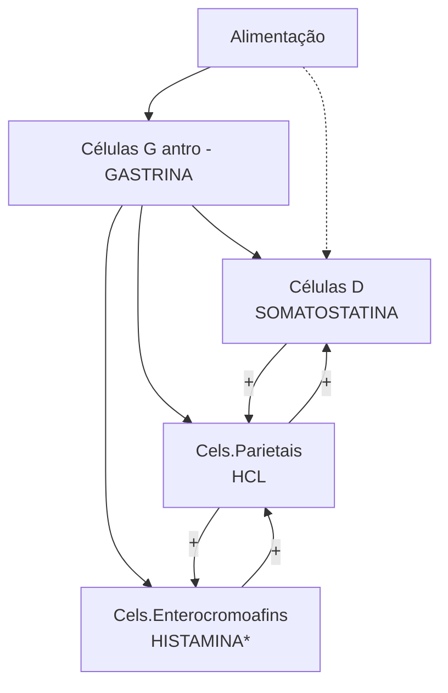

# ESTÔMAGO: ANATOMIA 1. ANATOMIA

![Anatomical diagram showing stomach arterial supply with labeled structures including: Vasos breves, Art. hepática própria, Art. gástrica direita, Art. gástrica esquerda, Art. gastroduodenal, Art. esplênica, Art. pancreatoduodenal superior, Artéria hepática comum, Art. gastro-omental direita, Art. gastro-omental esquerda]

## 1.1 INTRODUÇÃO E CONCEITOS

• Relações anatômicas com órgãos da cavidade abdominal – anteriormente;

![Anatomical illustration showing stomach and surrounding organs in cross-section]

**Figura 1** Anatomia
• Fígado;
• Omento menor: Ligamento hepatogástrico → atravessa os vasos do hilo-hepático (artéria hepática, veia porta e via biliar principal)
• Omento maior: Arcada gastro-omental → conecta a grande curvatura do estômago com o cólon transverso.
• Forame de Winslow

• Manobra de Pringle → facilita o controle de sangramentos através do clampeamento (por corda, sonda, clampe) da irrigação hepática.
• É dividido em algumas porções;
  • Cardia → tem seu início após a transição esofagogástrica;
  • Fundo gástrico ;
  • Corpo gástrico;
  • Antro;
  • Piloro → ambém conhecido como o esfíncter "verdadeiro" do estômago (anatômico + funcional).
• Relações anatômicas com órgãos da cavidade abdominal – posteriormente;
• Confira na página seguinte a Figura 2
• Pâncreas;
• Aorta;
• Região do tronco celíaco → configura a principal irrigação do estômago; É um ramo anterior da artéria aorta, composto de 3 ramos principais: Artéria gástrica esquerda → geralmente não gera ramos, irriga a pequena curvatura, é a principal das quatro artérias do estômago; Artéria esplênica → margeia o pólo superior do pâncreas, gerando alguns ramos superiores e inferiores, vascularizando o baço; Gera um ramo importante → artéria gastro-omental da esquerda. Artéria hepática comum → irriga o fígado; Emite um ramo: artéria gastroduodenal → artéria hepática própria → artéria hepática esquerda e direita; A artéria gástrica direita, normalmente, é um ramo da

artéria hepática própria → forma shunt com a artéria gástrica esquerda, irrigando principalmente a pequena curvatura, na região pré-pilórica.

OBS.: Variação anatômica da artéria gástrica esquerda → em 5-10% dos casos, esta artéria origina a artéria hepática esquerda (vasculariza o lobo esquerdo do fígado).

OBS.: A artéria gastroduodenal emite um ramo gástrico (artéria gastro-omental da direita) e um ramo duodenal (artéria pancreatioduodenal superior).

Figura 2 Anatomia

## 1.2 ARTÉRIAS DO ESTÔMAGO

• Irrigação do estômago; Arterial – 4 vasos; Artéria

gástrica esquerda; Artéria gástrica direita; Artéria gastro-omental da esquerda; Artéria gastro-omental da direita (esta deve ser preservada em ressecções para construção de tubo gástrico).

• Confira na página seguinte a Figura 3

## 1.3 TIPOS DE CÉLULAS NO ESTÔMAGO

**Células Caliciformes**
Produção de muco
Proteção gástrica

**Células Parietais**
Produção de ácido clorídrico

**Células principais**
Produção de pepsinogênio

**Células D**
Produção de Somatostatina
(inibição)

**Células G**
Produção de gastrina

Figura 3 Histologia

ESTÔMAGO: ANATOMIA

## 1.4 MECANISMO HORMONAL DO ESTÔMAGO

**Figura 4** Fisiologia

• Tumores neuroendócrinos:
  • Neoplasias derivadas das células enterocromafins-like do corpo gástrico
  • Normalmente componente indolente

![Anatomical diagram showing vascular anatomy of the stomach with labeled arteries including: Art. hepática própria, Art. gastroduodenal, Art. gástrica direita, Art. gástrica esquerda, Vasos breves, Art. esplênica, Art. pancreatoduodenal superior, Artéria hepática comum, Art. gastro-omental direita, Art. gastro-omental esquerda]

**Figura 5** Anatomia vascular
