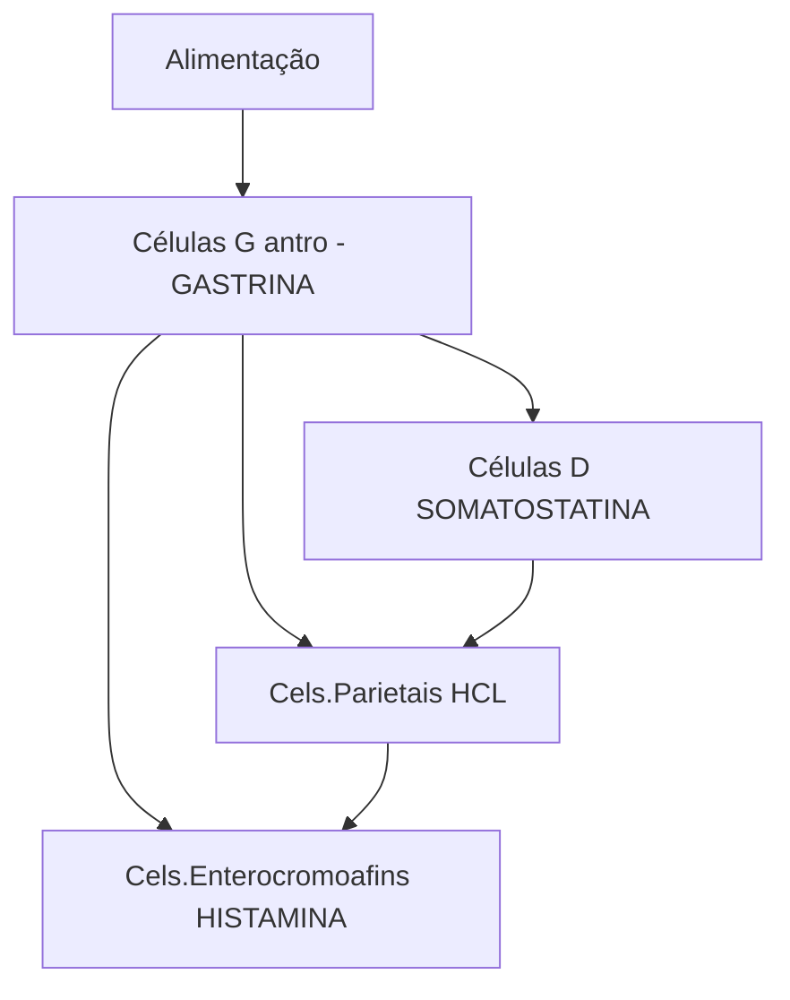

# ESTÔMAGO: TUMORES NEUROENDÓCRINOS

|                       | Tipo 1                                       | Tipo 2                   | Tipo 3               |
| --------------------- | -------------------------------------------- | ------------------------ | -------------------- |
| Porcentagem           | 80%                                          | 5-10                     | 15-25                |
| Tamanho               | <1cm, múltiplos                              | 1-2cm, múltiplos         | 2 a 5 cm, único      |
| Idade                 | 65                                           | 50                       | 55                   |
| Sexo                  | Feminino > masculino                         | Feminino = masculino     | Masculino > feminino |
| Patologias Associadas | Gastrite crônica atrófica, anemia perniciosa | Zollinger Ellison, MEN-1 | Esporádico           |
| Gastrina sérica       | Elevada                                      | Elevada                  | Normal               |
| Ph do suco gástrico   | Elevado                                      | Baixo                    | Normal               |
| Metástases (%)        | Baixo                                        | Baixo                    | > 50                 |
| Prognóstico           | Bom                                          | Bom                      | Ruim                 |

## 1. INTRODUÇÃO

• São neoplasias derivadas das células enterocromafins-like do corpo gástrico;

• Normalmente comportamento indolente:

• Células enterocromafins estimuladas → tumor neuroendócrino.

**Figura 1** Mecanismo hormonal do estômago

## 2. TIPO 1

• Corresponde a 80% dos casos;

• Doença autoimune – **gastrite crônica atrófica;**

• **Anticorpos anti-célula parietal / anti fator - intrínseco;**

• Gera destruição de células parietais → levam a hipergastrinemia → estímulo de células enterocromafins → tumor neuroendócrino.

### 1.1 CARACTERÍSTICA DO ESTÔMAGO

• Gastrite atrófica, Mucosa pálida, sem prega gástrica, vasos evidentes e vários tumores polipoides múltiplos – avermelhados;

• Observa-se que o pH gástrico elevado > 7 e carência de vitamina B12;

• Os tumores têm baixo potencial metastático.

**Figura 2** Gastrite atrófica: mucosa pálida, amarelada e com vasos sanguíneos evidentes, contrastando com a mucosa avermelhada e lisa das áreas normais

CIRURGIA DO APARELHO DIGESTIVO

## 3. TIPO 2

**Figura 3** Trígono dos gastrinomas

• Corresponde a 7% dos casos. Está relacionado com a Gastrinoma – Sd. Zollinger – Ellison ou com o NEM 1 (PPP);
• Presença de vários tumores polipoides, pH muito ácido
  → Apresenta lesões múltiplas e pequenas;
• **Possui baixo potencial metastático:**
  • Diagnóstico: EDA com biópsia gástrica - mucosa é normal ou há hipertrofia das pregas gástricas pelo excesso de estímulo da gastrina; pH < 2.
• Os gastrinomas estão localizados no triângulo de Passaro:
  • Triângulo dos gastrinomas (Passaro): ducto cístico com o ducto hepático comum, transição da segunda para terceira porção duodenal e colo pancreático.
• Tratamento do gastrinoma → identificar onde está o gastrinoma e realizar a ressecção.

## 4. TIPO 3

• Também conhecido como carcinoma neuroendócrino;
• Normalmente é uma lesão única, ulcerada, infiltrativa e com **alto potencial metastático** → péssimo prognóstico;
• Presença de lesões esporádicas;
• Apresenta pH estômago normal: EDA: lesão única em mucosa gástrica normal.

**Figura 4** Lesão subepitelial

## 5. IMUNOHISTOQUÍMICA

• Auxilia no Diagnóstico: Cromogranina A e sinaptofisina:
  • Moléculas muito relacionadas com os TNEs.
• Para noção de prognóstico e agressividade: Ki-67 e o número de mitoses por campo.

**Tabela 1** Classificação histológica

| Classificação Histológica | Bem diferenciado (baixo grau, G1) | Moderadamente Diferenciado (G2) | Pouco Diferenciado (alto grau, G3) |
| ------------------------- | --------------------------------- | ------------------------------- | ---------------------------------- |
| Mitoses / 10 HPF          | <2                                | 2 a 20                          | >20                                |
| Ki-67                     | <3                                | 3 a 20                          | >20                                |

• Fatores de Mau Prognóstico:
  • Lesão maior ou igual a 2 cm;
  • Invasão a partir da submucosa profunda (24% são metastáticas);
  • Ki67 maior ou igual 3%;
  • Baixo grau de diferenciação estrutural;
  • Atipia;
  • Necrose.
• Estadiamento:
  • TNE tipo 1 e tipo 2 → baixo risco → EDA: Se é tipo 2, deve-se identificar e ressecar o tumor produtor de gastrina;
  • Risco de metástase: TC TAP + EDA: TNE tipo 1 ou 2 → maiores que 2 cm ou invasivos; TNE tipo 3;
  • Pet Gálio, Octreoscan ou RM podem ser solicitados para avaliações minuciosas.

## 6. TRATAMENTO

• Tipo 1 – EDA seriada e ressecção por EDA;
• Tipo 2 – Ressecção do Gastrinoma (+ EDA, se necessário);
• Tipo 3 – Gastrectomia com Linfadenectomia D2:

Obs.: tipo 1 ou tipo 2 com critérios de mau prognóstico → gastrectomia.

## 7. SÍNDROME CARCINOIDE

• É uma síndrome rara associada a TNEs de localização gástrica;
• Sintomatologia:
  • Rubor devido à produção de histamina e metabólitos de serotonina na circulação.
• Tratamento dos sintomas:
  • Análogos da somatostatina de curta ou longa duração (octreotide e lanreotide);
  • Interferon alfa em baixas doses (se refratário).

## 8. SEGUIMENTO CARCINOIDE

• Os TNEs dos tipos I e II menores que 2 cm e sem fatores de mau prognóstico: anamnese, exame físico e EDA a cada 6-12 meses;
• TNEs tipo III ou mau prognóstico: anamnese, exame físico, EDA, TC ou RNM de abdome e dosagem sérica de cromogranina A.

ESTÔMAGO: TUMORES NEUROENDÓCRINOS

# REFERÊNCIAS

**Figura 2** Gastrite atrófica: mucosa pálida, amarelada e com vasos sanguíneos evidentes, contrastando com a mucosa avermelhada e lisa das áreas normais

https://endoscopiaterapeutica.com.br/

**Figura 4** Lesão subepitelial

https://endoscopiaterapeutica.com.br/
