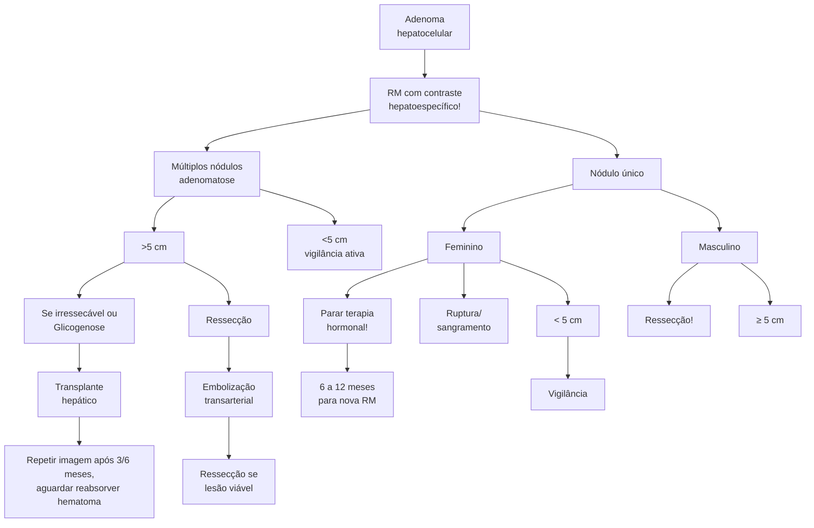
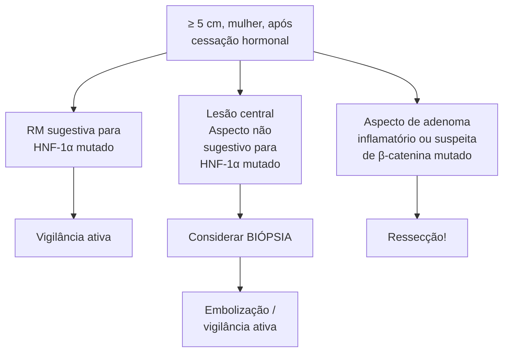

# FÍGADO: ADENOMA HEPÁTICO

| **Fatores:**- Hormonal (anticoncepcional e anabolizante).
- Composição corporal (obesidade/esteatose hepática).
- Homem SEMPRE opera. Em mulher depende (tamanho e sintomas). | **Classificação molecular:**- "Bonzinho" – HNF1a (ESTEATÓTICO).
- Sangra – Sonic Hedgehog/inflamatório.
- Vira câncer – beta-catenina. |
| ----------------------------------------------------------------------------------------------------------------------------------------------------------------------------- | -------------------------------------------------------------------------------------------------------------------------------------- |

## 1. EPIDEMIOLOGIA

### 1.1 TERCEIRO TUMOR HEPÁTICO INCIDENTAL MAIS COMUM (E O MAIS COBRADO EM PROVA)

- Preponderância feminina (10:1);
- Idade entre 35-40 anos;
- Antes do advento do uso de contraceptivos, a incidência era de 1 caso/1 milhão. Hoje, a incidência em mulheres jovens é de 30-40 casos/1 milhão (também influenciado pelo sedentarismo, obesidade e outros fatores);
- O uso de contraceptivos hormonais é um fator de risco importante.

### 1.2 OUTROS FATORES DE RISCO

- Esteroides anabolizantes (crescimento na população masculina);
- Obesidade/esteatose hepática;
- Hemocromatose;
- Doenças do Glicogênio: glicogenose tipo I (associação com adenoma em 50% dos casos) e III (associação em 25% dos casos).

## 2. QUADRO CLÍNICO

- Dor e desconforto abdominal, normalmente mais insidiosa e eventual (alguns pacientes são assintomáticos):
  - Quando o paciente se apresenta com dor aguda, suspeitar de complicações, como trombose ou rotura.
- Complicações (sobretudo se > 5 cm):
  - Hemorragia (15%-30%) → maior chance durante a gravidez, devido ao aumento dos hormônios femininos e estímulo ao crescimento do adenoma;
  - Risco de degeneração maligna (pode se transformar em carcinoma hepatocelular).

## 3. DIAGNÓSTICO

- Realizado por meio de exames de imagem (TC ou RM), idealmente RM:
  - Boa sensibilidade para componente gorduroso e usa do meio de contraste para avaliar padrão de vascularização (no geral, hipervasculares);
  - Pode apresentar realce vascular na periferia (telangiectasias);
  - Componente hipodenso (gordura);
  - Hiperdensidade (se sangramento recente).
- A TC ou a RM apresentam limitações nos seguintes casos:
  - Lesões pequenas (3 cm ou menores) podem ser confundidas com HNF;
  - Apresentação variada conforme subtipo.

**Figura 1** TC (fase arterial): lesão hipervascular, heterogênea, região hipodensa que pode corresponder a deposição gordurosa ou focos de hemorragia no interior.

**Figura 2** TC (fase arterial): duas lesões hipervasculares e homogêneas.

CIRURGIA DO APARELHO DIGESTIVO

## 4. CLASSIFICAÇÃO

### 4.1 CLASSIFICAÇÃO MOLECULAR DOS ADENOMAS HEPÁTICOS (2006)

• O adenoma hepático é uma entidade heterogênea. Subtipos mais indolentes; outros com potencial risco de crescimento/sangramento; outros com potencial maior para degenerar para câncer;

• Essa classificação passou por atualizações e é reconhecida e adotada pela OMS desde 2010.

### 4.2 SUBTIPOS CONFORME A CLASSIFICAÇÃO DE 2006:

• HNF-1 → Inativado (30%-40% dos adenomas): Um dos mais frequentes; fator associado na diferenciação hepatocitária e no controle do metabolismo; maior parte das mutações são adquiridas; hereditárias em caso de adenomatose (> 10 adenomas) ou diabetes MODY3. Particularidade: são adenomas esteatóticos (com componente gorduroso importante): marcador de imuno-histoquímica: LFABP (proteína de ligação para ácidos graxos). Achados na RM: homogêneos; esteatóticos; hiperintenso em T2 sem supressão de gordura; hipointensidade na fase com supressão de gordura; hipodensidade em T1 fora de fase. S 87%-91% / E 89%-100%;

Figura 3 HNF-1 → Inativado (T2 sem supressão de gordura).

Figura 4 HNF-1 → Inativado (T2 com supressão de gordura).

Figura 5 HNF-1 → Inativado (T1 em fase).

Figura 6 HNF-1 → Inativado (T1 fora de fase).

Figura 7 T2 com hiperrealce periférico (sinal de atol).

Figura 8 Ilustração do sinal de atol.

FÍGADO: ADENOMA HEPÁTICO                                                                                                                             3

• Inflamatórios (40%-55% dos adenomas): associado a mutações da via JAK/STAT, obesidade e síndrome metabólica ou num contexto de alto consumo de álcool; aspecto telangiectásico à microscopia; imuno-histoquímica para proteína C-reativa e proteína amiloide A (SAA). Achados na RM: aspecto telangiectásico; sinal hiperintenso em T2: pode ser difuso ou num formato de anel ao longo da periferia da lesão (sinal do Atol). T1: Iso a hiperintenso; hiperintensidade persiste mesmo com supressão de gordura ou out phase. Marcadamente hipervasculares com realce persistente ou tardio: sensibilidade de 85%-88%/especificidade de 88%-100%;

• β-catenina ativado (10%-20% dos adenomas): risco aumentado de degeneração para CHC. Mutações do gene da β-catenina (CTNNB1), que podem ser em alguns éxons diferentes: éxons 3 - associação com DEGENERAÇÃO MALIGNA; éxons 7 e 8; o exoma (sequenciamento) permite avaliar qual o éxon mutado (pouco disponível). Representação maior em sexo masculino. Por isso, o homem com adenoma hepático tende a ser mais complicado. Presença de atipias, formações pseudoglandulares e colestase; imuno-histoquímica positiva para glutamina-sintase (um alvo da β-catenina) e expressão nuclear da própria β-catenina; não possui características típicas que possam diferenciá-lo à RM;

• Não classificável (5%-10% dosadenomas): à época da proposta da classificação (2006), esses adenomas não eram associados a nenhuma mutação ou morfologia específica;

• A classificação foi revista em 2017 pelo mesmo grupo e houve a transformação de quatro para oito subtipos, porém, não ganhou grande adesão devido às dificuldades para compreensão. Além disso, foi construída uma ilustração com os principais subtipos e suas particularidades (não necessário decorar), como: a influência dos contraceptivos orais; mutações documentadas; apresentações clínicas; achados histológicos; corante utilizado na imunohistoquímica para marcação da lesão. Destaque para o achado de um subtipo adicional: SONIC hedgehog pathway. Uma parcela dos adenomas não classificáveis cujo risco para sangramento (sintomático e assintomático) é muito maior, comparado às demais classificações.

• O fluxograma abaixo foi baseado nesse artigo (2021).

## 5. MANEJO

• O fluxograma abaixo foi baseado nesse artigo (2021):

**Figura 9** Artigo base para o fluxograma.

Journal of Gastrointestinal Surgery (2021) 25:1494–1502
https://doi.org/10.1007/s11605-020-04724-1

ORIGINAL ARTICLE

**Guidelines for the Treatment of Hepatocellular Adenoma in the Era of Molecular Biology: An Experience-Based Surgeons' Perspective**

Paulo Herman¹ · Gilton Marques Fonseca¹ · Jaime Arthur Pirola Kruger¹ · Vagner Birk Jeismann¹ · Fabricio Ferreira Coelho¹

Received: 28 May 2020 / Accepted: 28 June 2020 / Published online: 14 July 2020
© 2020 The Society for Surgery of the Alimentary Tract

**Figura 10** Adenoma hepatocelular.

CIRURGIA DO APARELHO DIGESTIVO

**Figura 10 (continuação)** Adenoma hepatocelular.

Paciente com adenoma hepatocelular → solicitar RM com contraste hepatoespecífico.

• Múltiplos nódulos (adenomatose hepática) > 5 cm: se irressecável ou glicogenose → transplante hepático em casos selecionados. Ressecável → ressecção. Pode ressecar os maiores que 5 cm e realizar vigilância ativa dos menores.; < 5 cm → vigilância ativa;

• Nódulo único: feminino = parar terapia hormonal. < 5 m → vigilância; ≥ 5 cm → repetir RM após 6–12 meses da interrupção da terapia hormonal, pois a

maioria tende a diminuir; ≥ 5 cm em mulher mesmo após cessação hormonal; RM sugestiva para HNF–1α mutado → vigilância ativa; lesão central, aspecto não sugestivo para HNF–1α mutado → considerar biópsia e embolização ou vigilância ativa. Aspecto de adenoma inflamatório ou suspeita de β-catenina mutado → ressecção.

• Ruptura/sangramento (caso agudo) → embolização transarterial + ressecção se lesão viável. Repetir imagem após 3–6 meses e aguardar reabsorver hematoma. Masculino → Ressecção.

# REFERÊNCIAS

**Figura 1** TC (fase arterial): lesão hipervascular, heterogênea, região hipodensa que pode corresponder a deposição gordurosa ou focos de hemorragia no interior.

www.radiopaedia.org

**Figura 2** TC (fase arterial): duas lesões hipervasculares e homogêneas.

www.radiopaedia.org

**Figura 3** HNF-1 → Inativado (T2 sem supressão de gordura).

www.radiopaedia.org

**Figura 4** HNF-1 → Inativado (T2 com supressão de gordura).

www.radiopaedia.org

**Figura 5** HNF-1 → Inativado (T1 em fase).

www.radiopaedia.org

**Figura 6** HNF-1 → Inativado (T1 fora de fase).

www.radiopaedia.org

**Figura 7** T2 com hiperrealce periférico (sinal de atol).

www.radiopaedia.org

**Figura 8** Ilustração do sinal de atol.

www.radiopaedia.org
