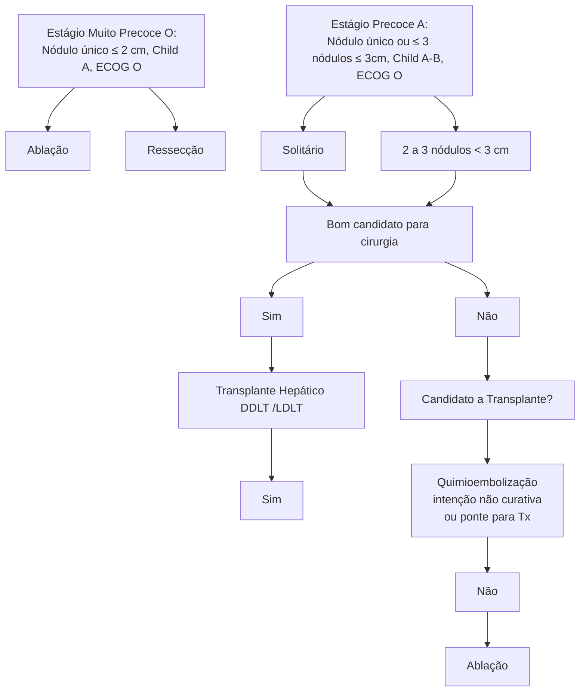
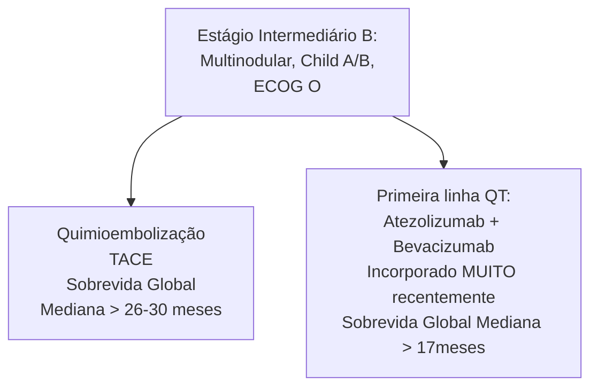

Fígado (CIR)

# FÍGADO: CARCINOMA HEPATOCELULAR

| **Principal causa: CIRROSE (90%)**- Aumento da importância da NASH ao longo dos anos

- Menor incidência de hepatites virais

- Rastreio: Cirróticos: USG (+ AFP) 6/6 Meses; Hepatite B Crônica: USG em periodicidade variável (conforme fatores de risco)

- Achado de nódulo > 1 cm → TC ou RM (preferencialmente RM!)

- Nestes exames (TC/RM):

  * Lesão hipervascular (fase arterial), com Washout (fase venosa) e realce periférico (fase equilíbrio) praticamente CONFIRMAM o diagnóstico de CHC!
  * Estadiamento: TC Tórax; Cintilografia óssea se suspeita de doença avançada (AFP muito elevada, lesão primária extensa) |   | **Estadiamento BCLC: Avalia a lesão, o paciente e o estágio da hepatopatia**- 0 - Muito precoce, lesão única < 2cm (geralmente ablação ou cirurgia)
- A - Precoce, nódulo único ou até 3 nódulos com < 3 cm, Child A ou B (questão geralmente pergunta se é de operar ou transplantar!)
- B - Intermediário, multinodular, Child A/B (Vai pra TACE; Já deixa de ser curativo, a menos que consiga downstaging)
- C - Avançado, com invasão vascular ou metástase, performance já afetada (QT)
- D - Terminal, com performance ruim / Child C (paliativo exclusivo). |
| ------------------------------------------------------------------------------------------------------------------------------------------------------------------------------------------------------------------------------------------------------------------------------------------------------------------------------------------------------------------------------------------------------------------------------------------------------------------------------------------------------------------------------------------------------------------------------------------------------------------------------------ | - | ------------------------------------------------------------------------------------------------------------------------------------------------------------------------------------------------------------------------------------------------------------------------------------------------------------------------------------------------------------------------------------------------------------------------------------------------------------------------------------------------------------------------------------------------------------------- |

## 1. INTRODUÇÃO

- Principal tumor maligno primário do fígado. O segundo lugar é o colangiocarcinoma.
- 5° Câncer mais comum mundialmente e terceira principal causa de morte por câncer (Ferlay et al, 2014):
  - África subsaariana e Ásia são áreas de alto risco (> 20 casos/100.000 pessoas ao ano);
- Vacinação contra HBV e vigilância para fatores de risco associados ao HCV tem diminuído a incidência do carcinoma hepatocelular (CHC) relacionado às hepatites virais;
- Cirrose – principal fator de risco (presente em aproximadamente 90% dos casos);
- No entanto, houve o aumento da prevalência de NASH (esteatohepatite não alcoólica), principalmente por causa do aumento da prevalência de obesidade.

## 2. PATOGÊNESE

- A Injúria hepatocelular cronificada (por diversos fatores, como o álcool) causa proliferação celular acelerada, e, consequentemente, ao aumento do risco para mutações de DNA:
- Presente na cirrose e nas hepatites virais.
- HBV (Vírus DNA) – Incorporação do DNA viral ao do hepatócito, causando maior tendência à mutagênese de forma direta:
  - O que explica o surgimento de CHC em pacientes com hepatite B crônica SEM cirrose.
- Outras vias: deficiência da alfa-1-antitripsina e ação de carcinógenos externos (aflatoxinas, pesticidas, tabagismo).

## 3. PREVENÇÃO

### 3.1 PRIMÁRIA

- Combate e conscientização sobre riscos do etilismo;
- Programas de vacinação contra HBV;
- Controle da obesidade;
- Controle da contaminação de alimentos e pesticidas;
- Se hepatite viral presente: Tratar! O tratamento leva à resposta virológica sustentada, que está associada à regressão de fibrose e menor risco de progressão para câncer. Principalmente se hepatite C.

### 3.2 SECUNDÁRIA

- Rastreio da população de risco:
- Quem? Cirróticos (Child A e B). Child C apenas se listáveis para Transplante Hepático.; Infecção pelo HBV: História familiar de CHC; Homens asiáticos com idade > 40 anos; Mulheres asiáticas com idade > 50 anos; Africanos / Afro-americanos; Hepatite exuberante em atividade (elevação de enzimas hepáticas, PCR quantitativo > 100.000 cópias/ml);
- Como? USG (ultrassonografia) de Abdomen Superior a cada 6/6 meses. Em pacientes cujo USG é prejudicado (obesos, esteatose severa ou cirrose avançada), TC ou RM estão indicados.; Alfa-fetoproteína (AFP) ≥ 20 ng/ml: Segundo o UpToDate®, sua solicitação é opcional;
- Associada ao aumento de falso-positivos. Nem todo paciente com CHC irá expressar alfa-fetoproteína. No Brasil ainda é rotineiramente solicitada. Valores anormalmente elevados (> 400 ng/ml) são praticamente confirmatórios de CHC em pacientes com alto risco. E, quão maior o valor, suspeitar de metástases. Valores muito elevados podem tornar um paciente não elegível a transplante hepático (p.ex.: > 1000 ng/ml);

CAD

• Se achado positivo: Nódulos inferiores a 1 cm → redução do intervalo de nova ultrassonografia (ex. 3 meses). Maior que 1 cm → exame axial (TC/RM) trifásico para confirmação diagnóstica.

## 4. DIAGNÓSTICO

### 4.1 TOMOGRAFIA OU RESSONÂNCIA MAGNÉTICA CONTRASTADAS:
• Lesão hipervascular, com wash-out na fase venosa;
• Hiperatenuação periférica nas fases venosa e tardia (cápsula / pseudocápsula).

### 4.2 DISPENSA BIÓPSIA NA MAIORIA DOS CASOS (A IMAGEM JÁ É MUITO FIDEDIGNA).

**Figuras 1 e 2** Fase arterial com tumoração hipervascular em fígado (acima), e fase venosa com Wash-Out. Tomografia ou Ressonância Magnética contrastadas.

**Figuras 3 e 4** Tomografia ou Ressonância Magnética contrastadas. Aspecto de lesão hepática compatível com CHC à tomografia - a esquerda, fase arterial; a direita, fase venosa/portal

**Figura 5** Aspecto do realce periférico (rim enhancement / pseudocápsula) visto na ressonância magnética.

**Figura 6** Lesão avançada com trombose tumoral do ramo portal direito.

## 5. CLASSIFICAÇÃO LI-RADS

### 5.1 AVALIA O GRAU DE SUSPEIÇÃO DO RADIOLOGISTA PARA CHC, DE:
• LR-NC: Não categorizável;
• LR-1: 100% Benigno;
• LR-2: Provavelmente benigno;
• LR-3: Probabilidade intermediária para CHC;
• LR-4: Provável CHC;
• LR-5: 100% de certeza de CHC.

FÍGADO: CARCINOMA HEPATOCELULAR                                                                                          3

## 5.2 CONDUTAS

• LR-NC: Repetir exame (ou mudar método) dentro de 3 meses;
• LR-1: Manter rastreio de rotina;
• LR-2: Manter rastreio, considerar reduzir intervalo para novo exame;
• LR-3: Encurtar intervalo para novo exame;
• LR-4: Planejamento multidisciplinar. Pode incluir biópsia;
• LR-5: Planejar tratamento, sem necessidade de biópsia.

## 6. QUADRO CLÍNICO

• Pacientes com diagnóstico em rastreio – assintomáticos;
• Na vigência de sintomas – doença avançada e na maioria das vezes não candidata a tratamento curativo:
  • Descompensação de hepatopatia preexistente;
  • Hipercalcemia da malignidade (sobretudo na vigência de metástase óssea);
  • Situações especiais: Sangramento tumoral / Rotura; Icterícia obstrutiva (por invasão de via biliar); Febre (associada à necrose tumoral).

## 7. EXAMES PARA ESTADIAMENTO

• As metástases extra-hepáticas mais comuns são para pulmão, linfonodos intra abdominais, osso e adrenais (em ordem): Tomografia de tórax – rotina; Cintilografia óssea de corpo inteiro (Tc-99m) – casos selecionados.

### 7.1 BARCELONA CLINIC LIVER CANCER (BCLC) CRITERIA

• Sistema para estadiamento mais utilizado globalmente;
• Cinco estágios baseados em: Extensão da lesão primária.; Performance-status.; Condição da hepatopatia (Child-Pugh).; Invasão vascular.; Disseminação extra-hepática;
• Última atualização em 2022.

### 7.2 CONDUTA DE ACORDO COM O ESTÁGIO

• Muito precoce (0): nódulo único ≤ 2 cm, Child A, ECOG 0.: Ablação (candidato se longe de vasos sanguíneos e outras estruturas). Ressecção (importante não ter hipertensão portal, ter MELD baixo e plaquetas > 100.000);
• Precoce (A): nódulo único ou ≤3 nódulos ≤ 3 m, child A-B, ECOG 0. Solitário: Se bom candidato para cirurgia: ressecção. Se não, questionar se é candidato a transplante.
  • Se sim, realizá-lo. Se não, ablação ou quimioembolização (intenção não curativa ou para para o transplante).
• 2-3 nódulos < 3 cm: Questionar se é candidato à transplante e seguir o fluxo já citado:
  • Se sim, realizá-lo. Se não, ablação ou quimioembolização (intenção não curativa ou para para o transplante).

**OBS! Condutas com intenção curativa: ressecção, ablação e transplante. O transplante possibilita maior sobrevida. Sobrevida mediana de 10 anos para o transplante, e > 6 anos para ressecção/ablação.**

• Intermediário (B): Multinodular, Child A/B, ECOG 0.: Quimioembolização (TACE) → sobrevida global mediana > 26-30 meses. Primeira linha de tratamento sistêmico (QT) com atezolizumab + Bevacizumab (opção incorporada muito recentemente) → sobrevida global mediana > 17 meses;
• Avançado (C): Invasão portal, N1, M1, Child A/B, ECOG 1/2.: Primeira linha de tratamento sistêmico (QT) com atezolizumab + Bevacizumab (opção incorporada muito recentemente) → sobrevida global mediana > 17 meses. Segunda linha: sorafenib ou lenvatinib (Sobrevida global mediana de 12-15 meses). Terceira linha: várias drogas em estudo (antiangiogênicos, anti-PD1) → Sobrevida Global Mediana de 8-12 meses;
• Estágio terminal (D): Child C, ECOG >3.: Best Supportive Care → sobrevida global mediana de 3 meses.

## 8. TRATAMENTO

### 8.1 QUANDO ESTÁ PERMITIDO REALIZAR A RESSECÇÃO CIRÚRGICA:

• Child A: Em casos MUITO selecionados de pacientes Child B podem ser submetidos a ressecções minor. Mas, em provas, no geral sempre CONTRAINDICAR!
• MELD ≤ 8;
• Ausência de hipertensão portal: EDA sem varizes (obrigatório); Sem circulação colateral visível aos exames de imagem;
• Ausência de coagulopatia (INR normal, Plaquetas > 100.000);
• Idealmente ressecções regradas (sabemos que isso nem sempre é possível);
• Fígado remanescente deve ser adequado: Na teoria, o objetivo é manter o fígado remanescente de 40%. Na prática, sempre que possível ≥ 50% (melhores desfechos, como menos risco de infecção, internação em UTI e mortalidade).

CAD

**Figura 7** Fluxograma estágios muito precoce e precoce.

**Figura 8** Fluxograma estágios intermediário.

**Figura 9** A - Sem contraste. B. Tumor hipervascular na fase arterial no fígado. C. fase venosa com tumor hipodenso. D. Quimioembolização com cateterismo que ultrapassa a aorta, tronco celíaco, hepática comum, hepática própria até alcançar ramificações atingidas pelo tumor, onde serão injetadas partículas que promovem a vasooclusão (isquemia do tumor) e agente quimioterápico.

[Four medical CT scan images labeled A, B, C, and D showing different phases of liver imaging and treatment]

FÍGADO: CARCINOMA HEPATOCELULAR                                                                                 5

**Estágio Avançado (C):**
**Invasão portal, N1, M1, Child A/B, ECOG 1/2**

↓

**Primeira linha (QT):**
Atezolizumab + Bevacizumab (Incorporado MUITO recentemente) Sobrevida Global Mediana > 17 meses

↓

**Segunda linha:**
Sorafenib ou Lenvatinib (SG Mediana 13 a 15 meses)

↓

**Terceira Linha:**
Várias drogas em estudo (antiangiogênicos, anti-PD1)
SG Mediana 8 a 12 meses

**Figura 10** Fluxograma estágio avançado.

**Estágio Terminal (D):**
**Child C, ECOG > 3**

↓

**Best Supportive Care**
Sobrevida Global Mediana 3 meses

**Figura 11** Fluxograma estágio terminal.

## 8.2 CIRURGIA

• Muitas vezes, o paciente não se encontra em condições de realizar cirurgia devido risco de remanescente hepático insuficiente. Neste caso, mesmo que possua todos os critérios prognósticos positivos, o recomendado é adotar táticas que permitam redução ou controle do tumor primário e hipertrofia do remanescente. Por exemplo:

• Associação de embolização da veia porta (PVE) com quimioembolização arterial (TACE)
• Associação de radioterapia estereotáxica (SBRT) ou mesmo radioembolização (TARE com Yttrium 90 - se lesão única inferior a 8 cm)

Dentre outras possibilidades.

## 8.3 DEMAIS RECURSOS

• Ablação por Radiofrequência / Microwave (objetivo de indução de necrose do tumor): Potencial curativo; Lesões < 3 cm sem invasão macrovascular; Lesões distantes da via biliar principal;
• Uso crescente (e animador) da radioterapia: Prévio – receio por toxicidade rádio-induzida. Atual: Dosimetria e cálculo refinado de campo diminui risco de tal toxicidade: SBRT (Stereotactic Body Radiation Therapy).; TARE (Transarterial radioembolization).; Proton Beam Irradiation.

## 8.4 TRANSPLANTE HEPÁTICO (DOADOR CADÁVER)

• Critérios e normativas obedecem normas e variam conforme país e legislação vigente;
• Critério de Milão/Brasil (CMB): 1 nódulo de até 5 cm.; Até 3 nódulos de até 3 cm.; Desconsidera nódulos inferiores a 2 cm;
• Pontuação especial no MELD: Dropout pode chegar a 40% em um ano – **PRIORIZAÇÃO**. Entrada na fila: pontuação virtual de 20; Se em 3 meses ainda não transplantou, sobe para 24 pontos; Se em 6 meses ainda não transplantou, sobe para 29 pontos. Melhor posição na fila de transplante com o passar do tempo.

# REFERÊNCIAS

**Figuras 1 e 2** Fase arterial com tumoração hipervascular em fígado (esquerda), e fase venosa com Wash-Out. Tomografia ou Ressonância Magnética contrastadas.
Radiopaedia. Case courtesy of Natalie Yang.

**Figuras 3 e 4** Tomografia ou Ressonância Magnética contrastadas.
Radiopaedia. Case courtesy of Natalie Yang.

**Figura 5** Aspecto do realce periférico (rim enhancement / pseudocápsula) visto na ressonância magnética.
Radiopaedia. Case courtesy of Natalie Yang.

**Figura 6** Lesão avançada com trombose tumoral do ramo portal direito.
Radiopaedia. Case courtesy of Natalie Yang.

**Figura 8** Fluxograma estágios intermediário.
Adaptado de: Radiopaedia. Case courtesy of Natalie Yang.

**Figura 9** A - Sem contraste. B. Tumor hipervascular na fase arterial no fígado. C. fase venosa com tumor hipodenso. D. Quimioembolização com cateterismo que ultrapassa a aorta, tronco celíaco, hepática comum, hepática própria até alcançar ramificações atingidas pelo tumor, onde serão injetadas partículas que promovem a vasooclusão (isquemia do tumor) e agente quimioterápico.

Hong SW, Lee WY, Chang YG, Lee B, Lee HK, Kim HK. Inflammatory myofibroblastic tumor mimicking hepatocellular carcinoma with dense lipiodol uptake. J Korean Surg Soc. 2013 Aug;85(2):89-92. doi: 10.4174/ jkss.2013.85.2.89. Epub 2013 Jul 25. PMID: 23908967; PMCID: PMC3729993.

**Figura 11** Fluxograma estágio terminal.
• Adaptado de: Radiopaedia. Case courtesy of Natalie Yang.
