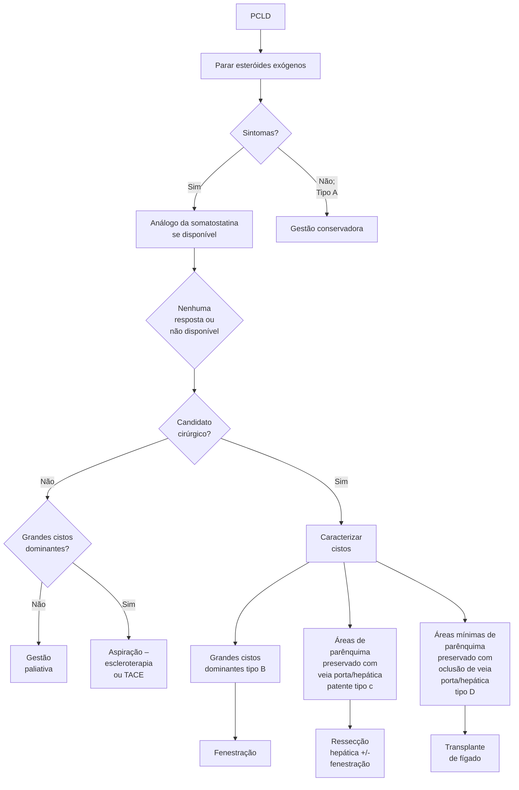

# FÍGADO: CISTO HEPÁTICO

**Diagnóstico frequentemente INCIDENTAL, + comuns em MULHERES**
• Adquiridos (hidático, pós traumático e inflamatório) + comuns em HOMENS

**Cistos simples (+ Comuns)**
• Congênitos
• Confirmação no USG
• Conservador exceto se sintomático (+ comumente destelhamento VLP)

**Cisto hidático:**
• Parasitose (Echinococcus granulosus); Homem - hospedeiro intermediário acidental; "Cistos Filhos" na imagem; tratamento c/ anti-helmíntico antes da cirurgia. (Cuidado: rotura pode desencadear ANAFILAXIA)

**Cistadenoma biliar:**
• "Cenhora" (meia idade)
• "Cegmento" 4
• Contraste realça parede/septações do cisto
• (pode) Comunicar com via biliar
• (pode virar) Câncer

**Doença Policística:**
• Assoc. com doença renal policística autossômica dominante; Sintomas associados a crescimento/rotura/sangramento/infecção; INTERROMPER CONTRACEPTIVO (ação estrogênica); Tratamento conforme Class. Gigot

## 1. CONSIDERAÇÕES INICIAIS

• Os cistos hepáticos compõem um grupo heterogêneo de lesões hepáticas;
  • Variam conforme prevalência, manifestações clínicas e prognóstico.

• Muito frequentemente, são achados incidentais.

## 2. EPIDEMIOLOGIA

• Anteriormente ao surgimento dos exames de imagem, os achados eram basicamente cirúrgicos;
  • 17 a cada 10.000 casos – referência da década de 1970.

• Atualmente, o diagnóstico vem sendo mais observado, apesar de incidental, pelo uso mais acessível dos exames imagiológicos;
  • Nos EUA, as taxas de prevalência variam entre 2,5 – 18%.

• São mais comuns em indivíduos do sexo feminino, com pico de apresentação entre 40 – 70 anos de idade;

• Os cistos de etiologia adquirida – cisto hidático, pós-traumático e inflamatórios – são mais comuns na população masculina, entre 30 – 50 anos.

## 3. CISTOS SIMPLES

• É a apresentação mais comum;
  • A prevalência estimada gira em torno de 2,5 – 5%; Algumas referências apontam para valores de até 18%.
  • Ainda, observa-se discreta predominância da população feminina (1,5:1).

• A maioria das lesões são de caráter congênito;

• Etiologia: Epitélio ductal que não se comunica com a árvore biliar.

• Manifestações clínicas:
  • Boa parte é assintomática;
  • Em menor número, podem existir quadros sintomáticos com: Dor abdominal, saciedade precoce, vômitos → considerar efeito de massa; Massa palpável – hepatomegalia; Raramente – cistos muito grandes: Hemorragia; Rotura; Obstrução biliar – por compressão.

www.radiopaedia.org

• Diagnóstico:
  • Ultrassonografia: Confirmatória na grande maioria dos casos; S > 90% e E > 90%;

Características: Conteúdo anecóico; Sem septações; Bordas finas; Realce acústico posterior – se volumoso; Avascular ao doppler.

www.radiopaedia.org

www.radiopaedia.org

• Tomografia computadorizada: Padrão bem delimitado; Hipodenso (0 – 10 HU); Sem realce nas fases contrastadas.
• Ressonância magnética: Em T1: baixo sinal, homogêneo; Em T1 contrastada: sem realce; Em T2: hipersinal.
• Conduta terapêutica:
  • Acompanhamento – considerar se > 4 cm;
  • Tratamento: apenas quando sintomático;
  • Opções: Aspiração percutânea (com ou sem

injeção de agente esclerosante); Cirurgia: Destelhamento – mais comum; Excisão; Hepatectomia.
• Operar ou não? Os tratamentos são equivalentes em eficácia, e efeitos adversos; Caso a conduta seja pelo procedimento cirúrgico, a via preferencial é a laparoscopia!

FÍGADO: CISTO HEPÁTICO                           3

## 4. CISTO HIDÁTICO

• Lembre-se do parasita: Echinococcus granulosus;
  • Cão é o hospedeiro definitivo; Ocorre a fase assexuada da reprodução.

**Equinococose (CISTO HIDÁTICO)**
Echinococcus granulosus sensu lato
Scolex ligado ao intestino

**Ciclo de vida do parasita:**

**6** Scolex ligado ao intestino

**5** Protoescólex do Cisto → **6** Scolex ligado ao intestino → **1** Adulto no intestino delgado

↓

Ingestão de cistos (em órgãos) ← **4** Cisto Hidático em diversos órgãos (comumente em fígado e pulmão) ← **3** Oncosphere penetra na parede do intestino ← **2** Ovos embrionários nas fezes ← Ingestão de ovos (em fezes)

**2** Ovos embrionários nas fezes

**3** Oncosphere liberada

**4** Cisto hidático em vários órgãos

☣ Estágio infeccioso

🔬 Estágio de diagnóstico

• Fígado é o órgão mais comumente afeta do no ser humano (52-77%), seguido por pulmão (10-40%), cérebro e outras vísceras;
  • Acometimento subclínico pode durar muitos anos;
  • Pode evoluir com complicações e até mesmo óbito (2-5%).
• Atenção a fatores de risco;
  • Morador de área rural;
  • Origem de região endêmica.
• Manifestações:
  • Sintoma mais comum - Dor em hipocôndrio direito e/ou epigástrico;
  • Náusea, febre ou dispepsia;
  • Icterícia ou anafilaxia; Alertam para doença avançada.

• Ruptura do cisto; Pode desencadear anafilaxia (inclusive fatal) – o conteúdo cístico é bastante imunogênico.
• Ruptura do cisto para via biliar (colangite).
• Diagnóstico:
  • Teste sorológico; Mais usado – ELISA = Baixa acurácia.
  • Melhor resultado com testes que detectam antígenos específicos do parasita (immunoblotting). O problema para o uso é relacionado com o custo!!
  • Exames de imagem - USG específico em aproximadamente 90%; 2001 – Classificação da OMS; Avalia o estágio da doença; Auxilia na tomada de decisões.

• Critérios da Classificação da OMS – 2001;
  • CL (Cystic Lesion) - Igual ao cisto simples.

[Ultrasound image showing a large cystic lesion]

www.radiopaedia.org

• CE (Cystic Echinococcosis): (1) CE1 - Sombras internas / "hydatid sand"; (2) CE2 - Septação interna (cistos "filhos");

[Two ultrasound images showing cystic structures with internal septations]

www.radiopaedia.org

• CE3 - Desprendimento de cistos filhos; Sinal do lírio d'água;

[Two ultrasound images showing detached daughter cysts with water lily sign]

www.radiopaedia.org

• CE4 - Ausência de cistos filhos, conteúdo irregular;

[Two ultrasound images showing cysts with irregular content and no daughter cysts]

www.radiopaedia.org

• CE5 – Calcificação.

[Ultrasound image showing a calcified cyst]

www.radiopaedia.org

• Interpretação: Ativos - 1 e 2; Transicional – 3; Inativos - 4 e 5.

• TC e RM são úteis a fim de confirmar o diagnóstico!
  • São capazes de demonstrar pontos de calcificações, cistos-filhos e cistos extra-hepáticos.

[CT scan image showing large hepatic cysts]

www.radiopaedia.org

FÍGADO: CISTO HEPÁTICO                                                                                   5

• Conduta:
  • Tratamento envolve eliminação do parasita e prevenção da recorrência: Para eliminação parasitária, é necessário um tratamento sistêmico com anti-helmíntico (mebendazol / albendazol).
  • Cirurgia ou PAIR ("Puncture, aspiration, injection, re-aspiration"): PAIR mais eficaz em doença mais precoce, sem cistos filhos; Cirurgia pode

ser conservadora (destelhamento) ou radical (pericistectomia, hepatectomia propriamente dita); É imprescindível evitar o derramamento do conteúdo do cisto, pelo risco de implante secundário ou anafilaxia; Injeção com solução salina hipertônica previamente à manipulação do cisto; Campo protegido (PVPI).

## 5. CISTADENOMA BILIAR

• Lesão com potencial de evolução para malignidade, em até 30% dos casos!
  • Rara (1 a 5 / 100.000), de crescimento lento
  • Surge dos ductos biliares; Ductos embrionários não involuídos ou ductos aberrantes.
• Preponderância feminina (9 : 1);
  • Idade média de 45 anos;
  • O segmento hepático IV é o mais afetado.
• Manifestações:
  • Maior parte assintomático ou com sintomas inespecíficos;
  • Em anatomopatológico: Cisto multiloculado com conteúdo mucinoso e dividido por

septos / paredes espessadas, com tamanho variado; OMS considera duas apresentações histopatológicas: Neoplasia Cística Mucinosa (estroma ovariano); IPMN-B (Neoplasia intraductal papilar da via biliar; comunicação com via biliar).
• Diagnóstico:
  • Exames axiais (TC e RM) são padrão-ouro; RM + ColangioRM → avalia a comunicação com a via biliar; A densidade é maior em comparação ao cisto simples (pela presença de conteúdo mucinoso); Nas fases contrastadas, observa-se realce das septações ou nas paredes do cisto.

Three medical imaging scans showing cystic lesions in the liver. Image A shows a CT scan with a large multiloculated cystic mass. Image B shows two MRI sequences demonstrating a cystic lesion with internal septations and wall enhancement.

www.radiopaedia.org

• E o marcador tumoral? (CEA / CA 19.9); Alguns pacientes podem expressar dosagem sérica aumentada; Achado variável → valor normal não exclui cistoadenoma biliar

ATENÇÃO!!! Comumente não se faz punção percutânea de cistoadenomas biliares! A decisão de operar é pautada pela imagem.

• Tratamento:
• Tratamento visa a ressecção completa da lesão;
• Propostas menos agressivas podem ser consideradas: Casos onde ressecção completa seja de alto risco ou tecnicamente impossível; Ressecção poupadora de parênquima com ablação de parede residual do cisto.

## 6. DOENÇA POLICÍSTICA

• É caracterizada pela presença de múltiplos cistos hepáticos simples;
  • Pode estar associada com doença renal policística autossômica dominante (50%).
• Doença hepática policística:
  • Rara → Atinge 1 / 160.000 pessoas;
  • Ligeira predominância feminina;
  • Subestimada - muitos são assintomáticos.
• Lesão com potencial de evolução para MALIGNIDADE! (até 30%);
• Manifestações:
  • Sintomas manifestam-se mais nas mulheres por ação estrogênica (com múltiplas gestações) - fatores de risco para progressão dos cistos;
  • Minoria com complicações agudas: Rotura; Sangramento; Infecção; Compressão de estruturas vitais - VCI, porta, via biliar.

• Diagnóstico:
  • Testes de função hepática comumente são normais; Por vezes, há elevação de enzimas hepáticas ou canaliculares.
  • Ultrassonografia: Capaz de fornecer diagnóstico na maioria dos casos! A classificação de Gigot avalia a distribuição da doença e sua gravidade; Gigot Tipo 1: (1) Poucos cistos volumosos (> 7 cm), focais; (2) Tratamento; Destelhamento + Omentoplastia. Gigot Tipo 2: (1) Múltiplos cistos pequenos a médios, (2) Tratamento: Combinação de ressecções + destelhamentos, se cabível. Gigot Tipo 3: (1) Parênquima tomado por cistos; (2) Critério especial para Tx Hepático.

[Three illustrations showing progressive liver cyst development from left to right]

• Tratamento:
• Conduta inicial; Interromper contraceptivo (e demais terapias hormonais).
• Tratamento: apenas em casos sintomáticos!

• Esquemas terapêuticos: Cirurgia; Aspiração + Esclerose; Farmacológico (análogo de somatostatina, inibidor de mTOR).

