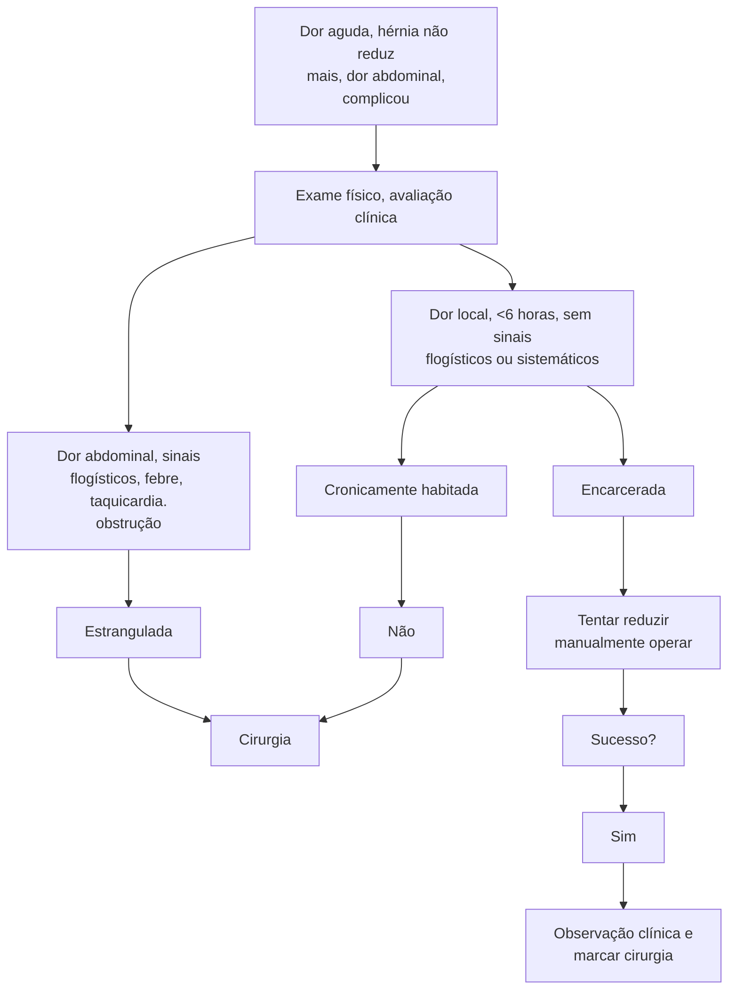
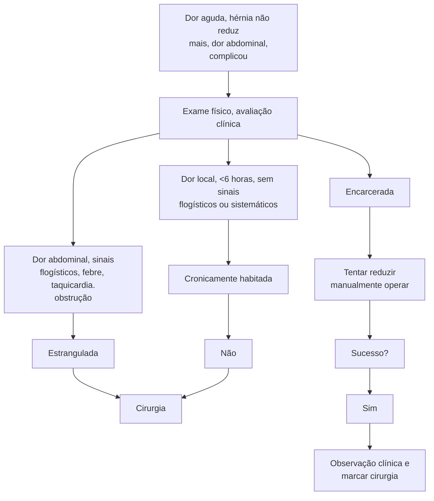

Hérnias

# HÉRNIAS (INGUINAL, FEMORAL E UMBILICAL) - REVALIDA

## Hérnia Inguinal

### Hérnia Femoral
- Mulheres mais velhas
- Abaixo do ligamento inguinal
- Dentro do orifício miopectíneo de Fouchard
- Medial aos vasos femorais
- Diagnóstico mais difícil - sintomas mais frustros
- Alto risco de encarceramento (40%) ao diagnóstico
- Eletivo precoce

### Hérnia Umbilical
- No adulto, adquirida
- Grande prevalência na população (estimativa 23% - 50%)
- Grande maioria assintomática
- Quadro clínico > dor periumbilical, abaulamento
- Fatores de risco semelhantes às hérnias inguinais

### Quando operar
- Sintomáticos
- Grandes defeitos
- Encarceramento - raro
- Adelgacamento de pele
- Ascite incontrolável - pode romper e causar morte
- Isquemia, ulceração, cirurgia por outras causas

**Atualmente + grande discussão de qual o melhor**
- < 1cm - fechamento primário
- > 2cm - colocação de tela
- Pode ser qualquer posição / pré-peritoneal
- 1 - 2cm - fator de risco persistente, hernia incisional
- Preferir tela

## 1. HERNIA INGUINAL

### 1.1 EPIDEMIOLOGIA

Acomete cerca de 25% dos homens e 5% das mulheres. Com cerca de 96% inguinais e 4% femorais – as mulheres têm mais hérnias femorais do que os homens.

- Inguinais: 9 homens acometidos para 1 mulher acometida.
- Femorais: 4 mulheres acometidas para 1 homem acometido.
  - Mas as mulheres ainda apresentam mais hérnias inguinais do que femorais, apesar da prevalência maior de hérnias femorais nas mulheres do que nos homens.
- A incidência é maior na direita do que na esquerda.

| Direta | Indireta |
|--------|----------|
| Fraqueza de parede | +comum |
| Medial aos vasos | Patência do conduto peritônio-vaginal (congênito) |
| Epigástricos | Fatores de risco → Hérnia |
| Lateral ao dedo | Pelo canal- inguinal |
| Por baixo do canal inguinal | Lateral aos vasos epigástricos |
| Encarcera menos | Exame físico → Ponta do dedo |

**Tratamento cirúrgico é o mesmo**

**Femoral – Abaixo do ligamento inguinal**

**Figura 1 Diferenças das hernias inguinocrurais**

**Classificação de Nyhus = classificação anatômica das hérnias inguinocrurais. (4 tipos):**
- Tipo 1: Hérnia inguinal indireta
- Tipo 2: Hérnia inguinal indireta com anel inguinal interno dilatado.
- Tipo 3: Fraqueza na parede posterior.
  - **A.** Direta
  - **B.** Indireta
  - **C.** Femoral
- Tipo 4: Recorrência
  - **A.** Direta
  - **B.** Indireta
  - **C.** Femoral
  - **D.** Mista

## 1.2 DIAGNÓSTICO

- Baseado principalmente no exame clínico:
  - Dor em peso, incômodo na região, piora com esforço
  - Exame físico em pé e deitado, realizando a manobra de Valsalva
  - Avaliação de direta ou indireta através de palpação do anel inguinal externo
- Exames laboratoriais são inespecíficos - auxiliam apenas em casos de complicações
- Imagem: realizar na dúvida diagnóstica (dificuldade de palpação, obesos, hidrocele, pubeíte, hérnia gigante) e planejamento terapêutico.

| USG | TC | RNM |
|-----|-----|-----|
| Rápido
Acessível
Barato
Boa especificidade | Diagnósticos
Diferenciais
Planejamento difícil | Padrão ouro
Planos musculares e adiposos |

**Hérnia como achado em exame de imagem = observar**

**Figura 2 Hérnia como achado de exame de imagem exclusivo = observar**

## 1.3 TRATAMENTO

- Cirúrgico Eletivo → Hernioplastia
  - Exceções: Complicações agudas; contraindicação ao procedimento.
- Porque operar todo mundo?
  - Risco de encarcerar sempre existe; cirurgia eletiva tem menor risco de complicar.
- Watchful waiting → aceito em homens assintomáticos com risco cirúrgico muito alto, é necessário discutir caso a caso.

## 1.4 COMPLICAÇÕES

- Encarceramento → cirurgia de urgência
  - Hérnia irredutível/permanente
  - Compressão das estruturas → Diminui retorno venoso e linfático → Edema → Isquemia → Necrose (estrangulamento)
- Perda de domicílio/ hérnia cronicamente habitada:
  - Hérnias crônicas, habitualmente gigantes
  - Pacientes obesos, desnutridos
  - Nova cavidade: não está encarcerada, porém não reduz

**Tabela 1 Hernia inguinal = urgências**

| Quadro Clínico       | Encarceramento                | Estrangulamento | Perda de Domicílio |
| -------------------- | ----------------------------- | --------------- | ------------------ |
| Tempo de sintomas    | Súbito                        | > 6 horas?      | Crônico            |
| Sinais flogísticos   | Não                           | Pode            | Lesões de pele     |
| Dor                  | Sim                           | Em piora        | Crônica            |
| Sinais sistêmicos    | Não                           | Sim e em piora  | Não                |
| Obstrução intestinal | Não                           | Pode (omento?)  | Não                |
| Imagem?              | Pode, ajuda, não muda conduta |                 | Planejamento       |

- Estrangulamento ou encarceramento → a princípio, cirurgia de urgência → Inguinotomia ou videolaparoscopia
  - Realizar laparotomia apenas se sinais de comprometimento visceral: peritonite, sepse, paciente muito grave.
- Colocar tela?
  - Sim, sempre na hernioplastia inguinal – exceção se pus ou fezes no local da ferida, nesses casos pode-se realizar um damage control e em uma segunda abordagem colocar a tela.
  - E sempre usar fios absorvíveis de longa duração (vicryl e PDS)

• Reduzir e Observar?
  • Pode ser feito para encarceramento recente, no qual não há comprometimento sistêmico.
  • Nesses casos é prudente observar o paciente por um tempo diante da possibilidade de ter reduzido conteúdo em sofrimento.
  • Marcar a cirurgia para o mais precoce possível.

• Mais comum em mulheres mais velhas
• Abaixo do ligamento inguinal
• Dentro do orifício miopectíneo de Frouchard
• Medial aos vasos femorais
• Diagnóstico mais difícil, pois sintomas são mais frustos
• Alto risco de encarceramento (40%) ao diagnóstico
• O melhor exame para visualização é a tomografia

## 1.5 FLUXOGRAMA

**Figura 3** Fluxograma hernias inguinais

## 2. HÉRNIA FEMORAL

**Figura 4** Anatomia região inguinal anterior

• O tratamento é cirurgia eletiva precoce
  • Idealmente vamos tratar com videolaparoscopia – padrão ouro
• Cirúrgico = Hernioplastia femoral precoce
  • Cirurgia de McVay: Sutura do tendão conjunto com o ligamento de Cooper. Necessidade de incisões relaxadoras.
  • Plug femoral: Rápida, fácil, barata → melhor se acesso infra inguinal

## 3. HÉRNIA UMBILICAL

### 3.1 EPIDEMIOLOGIA
• Grande prevalência na população (estimativa 23-50%)
• Grande maioria assintomática

### 3.2 QUADRO CLÍNICO
• Dor periumbilical, abaulamento.
• No adulto = adquirida
• Quando sintomas → dor periumbilical, abaulamento
• Fatores de risco semelhantes às hérnias inguinais

## 3.3 TRATAMENTO

• Cirúrgico
  • Não operar sempre e nem sempre colocar tela.
  • Operar quando tem sintomas, quando é grande, quando encarcera (raro), ascite incontrolável (pode romper e causar morte), adelgaçamento de pele, isquemia, ulceração.
• Antigamente usava-se a técnica de Mayo (sobreposição de fáscias → 30% de recidiva devido à tensão)
• Atualmente: grande discussão de qual a melhor conduta, de forma geral:
  • <1cm = fechamento primário

• >2cm = colocação de tela (qualquer posição)
• 1-2cm – se fator de risco persistente, hérnia incisional = preferir tela

## 3.4 CONCEITOS

**Femoral**
• Pior, diagnóstico mais difícil
• Operar logo → McVay, Plug, VLP, Rives-Stoppa

**Umbilical**
• Muito comum
  • Operar apenas se necessário, pôr tela, exceto se menor que 1cm.

# REFERÊNCIAS

**Figura 1** Diferenças das hernias inguinocrurais

Acervo pessoal Medcof

**Figura 2** Hérnia como achado de exame de imagem exclusivo = observar

Acervo pessoal Medcof

**Figura 3** Anatomia após esofagectomia

Anatomia região inguinal anterior
