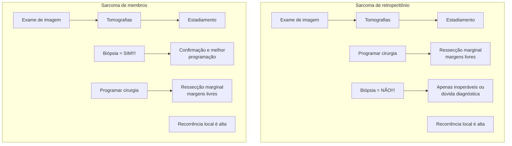

# ONCOCIRURGIA: SARCOMA

## SARCOMA

• Neoplasia de partes moles, originária de tecido mesenquimal pluripotente:
  • Advém do tecido conectivo. Logo, pode se originar de diversos sítios: osso, músculo,
  • adiposo, cartilagem;
  • A nomenclatura é dada conforme a origem;
  • Mais de 60 doenças.
• Comportamento biológico parecido:
  • É um tecido primitivo que se diferencia, portanto pode acometer qualquer região; Variam desde casos benignos a malignos;
  • Tumores expansivos, não infiltrativos! ;
  • Apresenta pseudocápsula – reação fibrótica adjacente;
  • A metástase mais comum é a pulmonar, investigar sempre.

### 1.1 EPIDEMIOLOGIA

• Representa < 1% dos casos de câncer em adultos;
• Ainda, totalizam 12% dos casos de câncer em criança;
• Inicia-se a partir de uma mutação esporádica ou genética, influenciada por um estímulo (hormonal, externo, genético);
• Aproximadamente 80% dos casos derivados de partes moles, e o restante originando-se em tecidos ósseos.

### 1.2 ETIOLOGIA

• Genética: Síndrome de Gardner, neurofibromatose, Li-Fraumeni; Tumores desmoides, tumor de bainha neural, rabdomiossarcoma;
• Infecção viral: Herpes vírus 8, Epstein-Barr, HIV; Sarcoma de Kaposi;
• Irradiação: > 50 Gy/10 anos; Angiosarcomas; Não pode ser igual ao primário; Sem síndromes associadas;
• Linfedema crônico;
• Fatores ambientais (ex: exposição laboral a tóxicos).

### 1.3 LOCALIZAÇÃO - SARCOMAS DE PARTES MOLES

• 45% - membros inferiores (MMII);
• 15% - membros superiores (MMSS);
• 18% - dorso;
• 13% - retroperitônio.

### 1.4 QUADRO CLÍNICO

• Massa de partes moles;
• Lesão de crescimento progressivo e indolor;
• Sintomas: as manifestações dependem da compressão das estruturas adjacentes, já que o seu crescimento é expansivo.

OBS.: Pegadinha! A lesão não surge a partir de trauma, mas pode ser percebido após pelo paciente – já que sua progressão é normalmente indolor

### 1.5 QUANDO SUSPEITAR?

• Características: Massa > 5 cm; Crescimento progressivo; A tendência é duplicar o tamanho em 6 meses. Massa profunda; Fibroso ou pétreo; Recorrência após ressecção;
• Investigação adicional: Não possui essas características; Massa benigna (lipoma); Muito mais frequente, ressecção direta;
• Possui essas características: Pode ser maligno; Pesquisar sintomas constitucionais (sintomas B); Linfoma: associado a febre, perda de peso, ONCOCIRURGIA: SARCOMA 2 sudorese. Palpar todas as cadeias linfonodais e testículo;
• Pode ser metástase ou tumor primário de testículo com metástase para retroperitônio. Mantida a suspeita de sarcoma? Exames de imagem! Guiar biópsia e confirmar suspeita; Evitar áreas de necrose; Realizar o estadiamento.
• Sarcoma de partes moles mais comum: lipossarcoma.

CIRURGIA GERAL

ATENÇÃO! Não pode ser feita a cirurgia de imediato pela probabilidade de complicações e recidivas.

## 1.6 DIAGNÓSTICO DIFERENCIAL

• Massas benignas: Massa < 5 cm; Sem mudança de padrão; Massa superficial, bem delimitada; Fibroelástica ou gordurosa;

ATENÇÃO! A ressecção marginal é resolutiva! Contudo, deve-se ressecar sem que haja o violamento da lesão, com posterior envio para análise anatomopatológica.

• Metástases de outras neoplasias; Melanoma → linfoma;
• Tumores de retroperitônio (germinativos, neurogênicos);
• Massas sólidas não neoplásicas (fibrose retroperitoneal, etc);
• Hematoma; Abscesso;
• Válido ressaltar que o sarcoma é uma patologia rara e de difícil manejo, então as chances de ser outra patologia são maiores.

## 2.SARCOMA DE PARTES MOLES (MEMBROS)

• Se suspeita>: Exame de imagem primário (USG, TC ou RNM); Sugerem etiologia; Mostram extensão local e metástase à distância; Guiam a biópsia;
• Partes moles - Inicialmente realizar a tomografia: Atenção! A ressonância magnética (avalia o acometimento local, e planos de clivagem) é padrão-ouro; Contudo, a abordagem inicial é com tomografia já que fornece muitas informações;
• Retroperitônio – tomografia; (1) TC tórax; (2) Sempre deve ser realizada, a fim de investigar a presença de metástases pulmonares;
• Radiografia de membros e USG de testículos; Útil para excluir diagnósticos diferenciais;

OBS.: A USG e radiografia são mais utilizados quando se está em dúvida a respeito de acometimentos fora daquele sítio.

• PET - avaliar resposta em doença avançada;

**Figura 1** Sarcoma de partes moles

• Biópsia: **Trucut (agulha grossa) - método de escolha;** Diferencia malignidade em 97% dos casos;
• Incisional (segunda opção): Incisão longitudinal ao membro; A cicatriz deve ser ressecada no procedimento final;
• Excisional: Para massas benignas (NÃO fazer em sarcomas);
• PAAF: Fornece apenas citológicos, usada em outras neoplasias (não para sarcoma).

## 2.2 ESTADIAMENTO (TNMG)

**Tabela 1** Estadiamento Sarcomas

| Tumor(T)           | N(linfonodo) | M(metástases) | G( grau)                                                                                                 |
| ------------------ | ------------ | ------------- | -------------------------------------------------------------------------------------------------------- |
| < 5 cm
= 1     | 0 ou 1       | 0 ou 1        | Mede o pior
prognóstico;                                                                             |
| 5 – 10
cm = 2  |              |               | Quanto maior o
grau de necrose,
contagem
mitótica e
indiferenciação,
mais agressivo. |
| 10 – 15
cm = 3 |              |               |                                                                                                          |
| > 15
cm = 4    |              |               |                                                                                                          |

• Grau: Em relação ao anatomopatológico, avalia alguns critérios;
• Diferenciação patológica;
  • Diferenciada – semelhante ao tecido de origem;
  • Pouco diferenciada – tipo histológico é determinante;
  • Indiferenciada, primitiva ou embrionária;
• Contagem mitótica: 0 – 9; 10 – 20; > 20;
• Necrose: Sem necrose; Necrose < 50%; Necrose > 50%.

OBS.: Biópsia ou Exame de imagem?

**Avaliar o risco de recorrência, gravidade e pior prognóstico**
• Critérios:
• > 5 cm T2
• Profundos à fáscia
• Grau 2 ou 3
• N+ / M +

### 2.3 TRATAMENTO

• Em virtude da grande variabilidade de tipos, histológica e de estadiamento, o tratamento deve ser individualizado e preferencialmente realizado em um centro especializado;
• Objetivos: Sobrevida (funcionalidade); Reduzir recorrência local; Maximizar funcionalidade; Minimizar morbidade; **TRATAMENTO IDEAL: cirurgia com margens de 2 cm;** Evitar amputação;
• Cirurgia - curativo!
• **Margens de 2 cm; Abordagem com ressecção R0 (margens macroscópica e microscópicas livres).**
• Preservar o membro e estruturas nobres (vaso, nervo, osso) → ressecção marginal, nesses casos.
• Ressecção marginal → recidiva de 80%;

ONCOCIRURGIA: SARCOMA                                                                                                3

• Contudo, a realização de cirurgias de maior porte, não altera a morbimortalidade em longo prazo;
• Logo, considerar o tratamento multimodal;
• Encaminhar ao especialista e discutir radioterapia e imunoterapia.

Observações: Pseudocápsula é margem R1 – assim, existem células tumorais externas; Sempre marcar margens e proceder com a congelação intra-operatória; (1) É útil para obter o conhecimento sobre o local de origem do sarcoma, em caso de recidiva. Dermatofibrossarcoma protuberans e tumor desmóide = 04 cm de margem;

**Figura 2** Cirurgia para ressecção de sarcoma

## 3. SARCOMA DE RETROPERITÔNIO

• Neoplasia muito rara, mais comum em idoso;
• 80% = lipossarcoma ou leiomiossarcoma;
• Suspeita: aumento do volume abdominal e síndrome consumptiva:
  • Manifestações associadas: Inapetência, perda de peso, constipação;
  • Pela localização da lesão, o diagnóstico tende a ser difícil e tardio.
• A maioria são tumores grandes quando descobertos;
• Diagnóstico diferencial:
  • Linfonodomegalia;
  • Metástases;
  • Abscessos.

### 3.1 PROTOCOLO

• Exame de imagem → tomografia → estadiamento;

**Programar cirurgia → ressecção marginal R0 (margens livres):**
• Diferença em relação ao sarcoma de partes moles: a cirurgia é programada antes e **NÃO É FEITA BIÓPSIA!**
• A recorrência local é alta;
• Biópsia = NÃO FAZER; **Apenas se inoperável ou dúvida diagnóstica;**
• A realização da biópsia aumenta o potencial de disseminação do tumor, além de mudar seu prognóstico;

**Cirurgia:**
• É a primeira opção;
• Ressecção R0, sem margem definida;
• Ressecção radical não muda evolução.
• Cirurgia de grande porte:
• Risco de ressecar órgãos adjacentes;
• Preparo pré-operatório adequado;

**Biópsia:**
• Não é um exame de rotina;
• Apenas inoperáveis – para guiar um tratamento específico;
• Implantes peritoneais;
• Metástases à distância;
• Envolvimento vascular extenso;
• Envolvimento de medula espinhal;
• Paciente sem condições cirúrgicas.
• Dúvida diagnóstica:
• Linfoma, metástase, outros tumores ou massas.
• Candidatos a tratamento neoadjuvante; Tumor > 10cm;
• Borderline ressecável;
• Sempre *core-biopsy*.

**Opções: Radioterapia:**
• O objetivo é reduzir a recorrência local;
• Deve-se avaliar condições como:
  • (1) Margens inadequadas;
  • (2) Recidiva tumoral;
  • (3) Tumor de alto grau → Profundidade? Tamanho?
• Neoadjuvantes x adjuvantes: (1) Neoadjuvante – como é feita antes, pode-se utilizar uma menor dose, porém com maior taxa de complicações operatórias; (2) Adjuvantes – como é feita depois, menor risco de complicação cirúrgica;

ATENÇÃO! Deve haver a tentativa de redução de tumores limítrofes, em face de diminuir o risco de recorrência local.

• Quimioterapia – muito discutível;
• Braquiterapia – cateter no leito tumoral;
• Perfusão isolada de membro: Perfundir apenas o membro acometido pelo sarcoma com quimioterápico; Opção nova, boa em alguns casos → preservar membro; Casos refratários ou recidivados após radioterapia; Casos irressecávei
• Evitar toxicidade sistêmica e permite o uso de altas doses das drogas. Pode permitir redução da lesão e cirurgia com preservação do membro.

## 2.4 DOENÇA AVANÇADA

• Metástases (M+):
• Disseminação hematogênica → pulmão;
• Maioria paliativo: A ressecção é uma opção em casos muito selecionados (metástase em localizações de fácil retirada, únicas);
• Linfonodo acometido: Raro, prognóstico muito ruim; Principais sarcomas que acometem linfonodos: Mnemônico "ESCAR" (subtipos que mais causam metástase): (1) Epitelioide; (2) Sinovial; (3) Células claras; (4) Angiosarcoma; (5) Rabdomiossarcoma;
• Disseminação por contiguidade: Apenas desloca, não invade; Pseudocápsula é o limite, com microcélulas que extravasam.

OBS.: Observem a imagem abaixo: retirada de sarcoma em coxa. Lembre-se: o tratamento curativo é a retirada da lesão com margens!

CIRURGIA GERAL

# REFERÊNCIAS

**Figura 1** Sarcoma de partes moles

UpToData. Clinical presentation, histopathology, diagnostic evaluation, and staging of soft tissue sarcoma

**Figura 2** Cirurgia para ressecção de sarcoma

Acervo pessoal – cortesia Dr Felipe / autorizado pelo paciente
