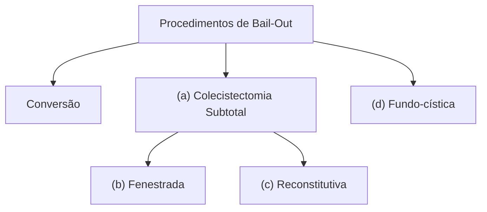

Pâncreas e vias biliares

# PÂNCREAS E VIAS BILIARES: LESÃO IATROGÊNICA DA VIA BILIAR

## Principal fator de risco é a COLECISTECTOMIA

- Região anatômica muito sujeita a variações
- Situações de urgência (inflamação/aderências)
- Dificuldades do paciente (obesidade) e do serviço (material de videolaparoscopia de pior definição/procedência)
- Mais frequentemente detectada no PÓS OPERATÓRIO
- Se detectar no intra, o reparo depende da experiência do cirurgião e das condições do serviço

## Fístula biliar:

- Cirúrgica se coleperitônio difuso, paciente instável, séptico, com peritonite difusa ou fístula de alto débito
- Tratamento conservador tende a ser bem sucedido se fístula adequadamente drenada / paciente estável / baixo débito (< 200-500 ml em 24h)

## Macete: Classificação de Bismuth-Strasberg

- A - A mais "benigna" (cístico ou Lushcka)
- B - "Bifei" e clipei o hepático posterior direito
- C - Só "Cortei" o hepático posterior direito
- D - DEU RUIM. Cortei o colédoco
- E - ESTENOSES (Varia de E1 a E5 conforme topografia e lesões concomitantes)

## Obs.:

- O tipo D é lesão do colédoco mas é uma lesão parcial/tangencial
- Está como "ESTENOSES", mas são todas as lesões completas (secção ou ligadura ou estenose) do colédoco/hepático comum.

## 1. INTRODUÇÃO

- A principal causa da lesão de via biliar é a COLECISTECTOMIA, uma das cirurgias mais realizadas no Brasil. A cirurgia laparoscópica é considerada tratamento-padrão mundialmente, devido à redução de dor, permanência hospitalar, custos e menor curva de aprendizado;
- Inicialmente a incidência de lesão das vias biliares era estimada até 10x maior na via laparoscópica. Entretanto, com o melhor aprendizado e padronização da técnica, melhoria dos equipamentos, houve queda e equiparação da incidência entre laparoscopia e laparotomia ao longo dos anos (aproximadamente 0,2%). A via aberta passou a ser reservada para casos mais complexos.

## 2. ANATOMIA

- Área muito sujeita a variações;
- Pode haver ductos segmentares extra-hepáticos:
  - **Ducto hepático posterior direito** - podem ter apresentação extra-hepática em até 12% dos pacientes.
- Colangiografia intra-operatória – pode confirmar a existência de variações aumenta segurança e permite identificação em caso de lesão intra-operatória.
- Veja na figura ao lado, alguns exemplos de variações:

**Figura 1** Variações da anatomia da via biliar.

(Five anatomical variations labeled a, b, c, d, and e showing different configurations of the biliary tree)

### 2.1 RELACIONADOS À PRÓPRIA DOENÇA

- Colecistite de repetição: Inflamação crônica e fibrose podem distorcer anatomia, encurtar comprimento do ducto cístico ou mesmo fistulização da vesícula ou via biliar para demais estruturas. Exemplo: Síndrome de Mirizzi.

### 2.2 RELACIONADOS AO PACIENTE

- Obesidade severa: dificuldade técnica de acesso à vesícula;
- Cirurgia prévia no abdome superior;
- Doença hepática subjacente, como cirrose.

## 3. CAUSAS

- A principal causa é lesão térmica:
  - Pode inicialmente passar despercebida, mas o calor pode levar à cicatrização patológica.
- Demais causas:
  - Clipagem e secção inadvertida da via biliar;
  - Isquemia (lesão vascular associada) → artéria hepática direita, importante no suprimento da via biliar.

## 4. MANEJO

• A lesão pode ser detectada no intra ou no pós-operatório;
• Caso a detecção seja no intraoperatório (minoria):
  • Reparo primário (conforme classificação de Bismuth-Strasberg ), se cirurgião experiente e confortável em cirurgia hepatobiliar;
  • Drenar, acabar a cirurgia e encaminhar para serviço especializado, se o cirurgião não estiver habilitado para tal reconstrução.
• Quando a lesão é detectada no pós-operatório, a manifestação varia conforme o ocorrido:
  • Exames de imagem no pós-operatório: USG ou TC com líquido livre peri-hepático (presunção); ColangioRM ou Colangiografia por CPRE (padrão-ouro);

**Figura 2** Ducto hepático extravasando para o leito da vesícula.

**Figura 3** Colangiografia da RM.

**Fístula Biliar:** identificada no pós-operatório precoce: extravasamento transmural de bile:
• Coleperitônio ou Biloma (coleção delimitada de bile) visto em exame de imagem;
  • Febre;
  • Dor abdominal de difícil controle;
  • Icterícia;
  • Avaliação quanto ao débito da fístula biliar: Chance de o tratamento conservador dar certo: paciente estável, sem peritonite difusa, sem coleção em tomografia, sem sinais de sepse. Parâmetro clínico: < 200-500mL/24h = baixo débito; Parâmetro colangiográfico: Extravasamento após

preenchimento da árvore biliar = baixo débito. Reabordagem: coleperitôneo, paciente instável, séptico, com peritonite difusa, fístula de alto débito. Biloma + sinais clínicos de infecção: dreno percutâneo.
• **Estenose Cicatricial da Biliar:** identificada no pós-operatório mais tardio;
  • Icterícia obstrutiva;
  • A depender do grau de lesão e da topografia, a fístula biliar pode evoluir para estenose cicatricial;
  • Se estenose de manifestação tardia: Presença de colangite – antibioticoterapia e drenagem da via biliar (CPRE/DTPH) e estudo com ColangioRM para correção posterior; Ausência de colangite: investigação com ColangioRM e resolução conforme tipo da estenose.

### 4.1 Classificação de Bismuth-Strasberg

• **Tipo A:** Tipo mais comum. Lesões possíveis: Ramos secundários do ducto posterior direito; Ductos de Luschka: quando parede posterior está muito grudada no leito hepático, e pode atingir algum canalículo biliar, e passar despercebido; Ducto cístico; Fístula normalmente de baixo débito, normalmente evoluem bem apenas com dreno, mas pode haver necessidade de papilotomia endoscópica (ou stent); Alto débito → papilotomia + Stent (diminui pressão da papila duodenal);

**A**

• **Tipo B:** Ligadura de ducto hepático direito aberrante (no lugar do cístico) → colestase focal por drenagem ruim de segmento 6 e 7 do fígado; Tratamento: Hepaticojejunostomia ou Hepatectomia (se segmento inviável, detectado tardiamente);

**B**

PÂNCREAS E VIAS BILIARES: LESÃO IATROGÊNICA DA VIA BILIAR

• **Tipo C:** Secção de ducto hepático D posterior aberrante (sem comunicação com a via biliar principal). Tratamento: Drenagem, biliodigestiva, clipagem do ducto;

![Diagram C showing biliary duct anatomy]

• **Tipo D:** Lesão lateral do ducto biliar comum. Tratamento: Diagnóstico intra-op → rafia + Kehr; Pode associar CPRE com papilotomia + prótese; Diagnóstico pós-op → papilotomia + prótese;

![Diagram D showing biliary duct anatomy]

• **Tipo E (Bismuth):** Lesões circunferenciais do ducto biliar principal; E1 → lesão > 2 cm da confluência; E2 → lesão < 2 cm da confluência. E3 – Lesão na altura da confluência dos ductos direito e esquerdo (porém preservada!); E4 – Lesão da confluência dos ductos direito e esquerdo (não preservada!); E5 – Lesão combinada do ducto hepático posterior D aberrante com o ducto comum. Tratamento: Dilatações e próteses endoscópicas; Maior chance de sucesso em estenoses mais distais (E1 e E2) e com menor extensão; Demais: Derivação Biliodigestiva.

![Diagrams E1 through E5 showing different types of biliary duct lesions]

**E₁** >2 cm | **E₂** <2 cm | **E₃** | **E₄** | **E₅**

**Figuras 4, 5, 6 e 7** Classificação de Bismuth-Strasberg

## Procedimentos de Bail-Out

**Figura 8** Procedimentos de Bail-Out

CIRURGIA DO APARELHO DIGESTIVO

## 5. PROGNÓSTICO

### LESÃO ARTERIAL ASSOCIADA AUMENTA SIGNIFICATIVAMENTE A MORBIDADE DE COMPLICAÇÃO

• Artéria hepática direita (92% dos casos de lesão vascular)
• 40% do suprimento arterial da via biliar extra-hepática
• Classificação de Stewart-Way (descreve lesões vasculares associadas a lesão de vias biliares)

### ESTENOSE DE ANASTOMOSE BILIODIGESTIVA OU TRATAMENTO TARDIO:

• Cirrose biliar secundária
  • Colangites de repetição
  • Drenos transparieto-hepáticos

## REFERÊNCIAS

**Figura 1** Variações da anatomia da via biliar.

Tirkes, T., Akisik, F. (2013). Gallbladder and Biliary Tree Anatomy, Variants, Cystic Lesions. In: Hamm, B., Ros, P.R. (eds) Abdominal Imaging. Springer, Berlin, Heidelberg. https://doi.org/10.1007/978-3-642-13327-5_144

**Figura 2** Ducto hepático extravasando para o leito da vesícula.

www.radiopaedia.org

**Figura 3** Colangiografia da RM.

www.radiopaedia.org

• Transplante extremamente mórbido

### PREVENÇÃO

• Máxima tração da pinça auxiliar em direção cefálica
• Tração lateral da mão esquerda do cirurgião
• Visão crítica de segurança (Strasberg, 1995)
• Usar cautério com baixa energia
• Dar preferência ao modo corte
• Liberar peritônio e estruturas junto a vesícula por transparência
• Soltar infundíbulo da placa cística
• Dissecção acima do sulco de Rouviere
• Conversão / fundo cística
• Colecistectomia subtotal (fenestrada ou reconstitutiva)
