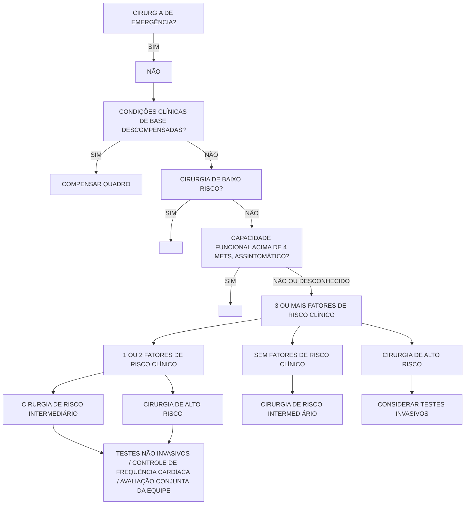
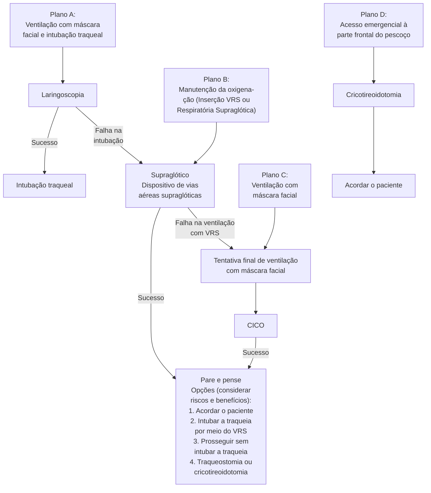

# AVALIAÇÃO PRÉ-ANESTÉSICA

• **Não é obrigatório que o anestesiologista que realiza a avaliação pré-anestésica (APA) seja o mesmo responsável pelo procedimento anestésico.**
• **A APA é um requisito obrigatório estabelecido pela Lei CFM 1.802; sua não realização constitui negligência médica e pode acarretar processos legais.**
• **Para estratificar o risco cardíaco em pacientes agendados para cirurgia não cardíaca, são empregados os Critérios de Lee Modificados.**
• **O jejum prévio visa prevenir a aspiração pulmonar e a subsequente pneumonite química de prognóstico reservado; os protocolos atuais são mais flexíveis, permitindo a ingestão de líquidos claros até 2 horas antes da anestesia. Outros períodos são: 4 horas para amamentação, 6 horas para refeições leves e fórmula infantil, e 8 horas para refeições pesadas.**
• **São necessários 4 METs para autorizar a realização da cirurgia.**
• **O principal indicador de via aérea difícil é o histórico de via aérea difícil prévio (VAD).**
• **A classificação de Mallampati, por si só, não consegue prever a dificuldade na via aérea.**

## 1. AVALIAÇÃO PRÉ-ANESTÉSICA (APA)

Consiste na avaliação dos seguintes pontos:
• Estado de saúde: anamnese e exame físico;
• Estratificação e redução de riscos;
• Planejamento de técnica anestésica: orientação ao paciente e Termo de Consentimento Livre e Esclarecido.

OBS.: Não há intervalo mínimo padrão, o que costuma ser determinado pela própria instituição. O anestesista que fez a APA não precisará ser o mesmo anestesista que vai realizar o caso.

### 1.1 Estratificação e redução de riscos – Classificação ASA;

| ASA I: sem comorbidades – (0,05 – 0,08% óbito);                        |
| ---------------------------------------------------------------------- |
| ASA II; comorbidades leves, tabagismo, etilismo (0,27 – 0,4% óbito);   |
| ASA III: comorbidades graves/mal controladas (1,8 – 4.3% óbito);       |
| ASA IV: condição sistêmicas grave com ameaça à vida (7,8 – 23% óbito); |
| ASA V: moribundo (9,4 – 51% óbito);                                    |
| ASA VI: morte encefálica;                                              |

OBS: Emergência = E. Exemplo: ASA IV-E.

### 1.2 Exames pré-operatórios:

• Hemograma: Idosos; Em situações de perda sanguínea esperada.
• Eletrólitos: Uso de medicações que causam alterações hidroeletrolíticas; Doença renal; Diabetes.
• Eletrocardiograma: Homens > 40 anos de idade e Mulheres > 50 anos de idade, com doença sistêmica; Diabetes; Suspeita de doença cardiovascular; Fatores de risco cardiovasculares presentes.
• Radiografia de tórax: Suspeita de edema; Atelectasia; Pneumonia; Antecedentes de doenças cardíacas e pulmonares; História de tabagismo por mais de 20 anos; Idosos.
• Coagulação: Doença hepática; História pessoal de distúrbios de coagulação; Quimioterapia; Uso de medicamentos que alteram a coagulação.
• Teste de gravidez – mulheres em idade fértil.

### 1.3 Estratificação de risco cardíaco – Critérios de Lee Modificados;

• Utilizado para estratificação do risco cardíaco em pacientes com programação de cirurgia não cardíaca;
• Avaliação de: Cirurgia de alto risco (Abordagens vasculares, intratorácicas, intraperitoneais); Diabetes mellitus insulino-dependente; Doença cerebrovascular; História de coronariopatia; História de insuficiência cardíaca; Insuficiência renal (CR >2) .
• Interpretação – chance de eventos cardiovasculares; 0 fator de risco = 0,4%; 1 fator de risco = 0,9%; 2 fatores de risco = 6,6%; 3 ou mais fatores de riscos = 11%.

• Idealmente deve-se aguardar 14 dias após angioplastia com balão para indicar tratamento cirúrgico eletivo e 6-12 meses após angioplastia com Stent

## 1.4 Populações Especiais;

• Pulmonar: normalmente não se indica Raio x de tórax de rotina para todos os pacientes, exceto em pacientes obesos, que irão realizar procedimentos torácicos ou vasculares ou mesmo que tenham histórico de patologias cardiotorácicas . Outros pontos importantes a serem considerados é o status tabágico do paciente que idealmente deve ser suspenso 14 dias antes do procedimento. Em alguns pacientes, pode-se realizar espirometria pré operatória a fim de estabelecer a reserva pulmonar do paciente, seja em cirurgias cardiotorácicas ou pacientes que tenham DPOC. Esses pacientes se beneficiam de anestesia peridural durante o procedimento.

• Renal: Pacientes que tenham DRC ou IRA podem apresentar diversas complicações no pós-operatorio, seja por alterações metabólicas e hemodinâmicas por maior incidência de patologias cardiovasculares, distúrbios hidroeletrolíticos ou uremia com ou sem diátese hemorrágica. nesses pacientes vale-se um screening de distúrbios hidroeletrolíticos, hemograma completo, raio X, busca de coagulopatias e determinação da TFG

• Hepatobiliar: Pacientes que convivem com cirrose estão predispostos a inúmeras complicações no período pós-operatórias, seja pela descompensação de doença de base, maior predisposição a infecção, maior dificuldade de manutenção do tônus intravascular levando a posterior IRA, menor clearance hepático de fármacos. Utiliza-se critérios como MELD e Child-Pugh para observar o grau de patologia evidenciada. Pacientes com MELD <10 ou Child A podem passar por cirurgias eletivas mais complexas, visto que possuem maior reserva hepática. Já pacientes com classificação maior, recomenda-se apenas intervir caso realmente necessário. Estes pacientes se beneficiam do ROTEM e elastografia para transfusão adequada sem descompensação hemodinâmica.

• Nutrição: Pode resultar inúmeras complicações no pós-operatório, seja por maior facilidade de infecção, assim como maior capacidade de falha cicatricial, com deiscencias. Pode-se utilizar a mensuração de Pré albumina, transferrina e Albumina assim como diversas Classificações clínicas/hemodinâmicas para verificar o risco nutricional para o procedimento cirúrgico (NRS 2002), assim como IMC, visualização de pregas cutâneas, valor da circunferência de panturrilha,

• Remato: pacientes com patologias reumatológicas são propensas a diversas complicações assim como dificuldades de preparação pré-operatória.

devido ao uso de imunomoduladores e corticóides, estes se mostram como um grande desafio para o cirurgião. universalmente metotrexato e corticoides são mantidos durante o procedimento cirúrgico. Pacientes que se desconfie de supressão do eixo hipotálamo-pituitária-adrenal pode se realizar dose de ataque com hidrocortisona com novas doses de 8 em 8 horas simulando resposta adrenal

## 1.5 Estratificação e redução de riscos – Capacidade funcional;

• Equivalente metabólico – MET: Quantos METs são necessários para liberar a cirurgia? 4 METs.



## 1.6 Estratificação e redução de riscos – Classificação de Karnofsky

| 100% | Sem sinais ou queixas, sem evidências de doença                                    |
| ---- | ---------------------------------------------------------------------------------- |
| 90%  | Mínimos sinais e sintomas, capaz de realizar suas atividades sem esforço           |
| 80%  | Sinais e sintomas maiores, realiza suas atividades com esforço                     |
| 70%  | Cuida de si mesmo, não é capaz de trabalhar                                        |
| 60%  | Necessita de assistência ocasional, capaz de trabalhar                             |
| 50%  | Necessita de assistência considerável e cuidados médicos frequentes                |
| 40%  | Necessita de cuidados médicos especiais                                            |
| 30%  | Extremamente incapacitado, necessita de hospitalização, mas sem iminência de morte |
| 20%  | Muito doente, necessita de suporte                                                 |
| 10%  | Moribundo, morte iminente                                                          |

AVALIAÇÃO PRÉ-ANESTÉSICA                                                                                           3

OBS: classificação utilizada principalmente em pacientes paliativos com resultado equivalente a possibilidade de realizar procedimentos cirúrgicos no paciente. Utilizamos normalmente um resultado maior que 70.

## 1.7 Jejum pré-operatório;

- 2h: líquidos claros/sem resíduos;
- 4h: amamentação;
- 6h: refeições leves, fórmula infantil;
- 8h: refeições pesadas.

ATENÇÃO! Cuidado com o risco de pneumonia aspirativa, na medida que apresenta taxa de mortalidade de 70%.

## 1.8 Risco de broncoaspiração:

| Abdome agudo                   | Vagotomia cirúrgica          |
| ------------------------------ | ---------------------------- |
| Oclusão intestinal             | Trabalho de parto            |
| Íleo paralítico                | DRC ou Uremia                |
| HDA ativa                      | Doença de Parkinson          |
| Estenose esofágica             | Seq. neurológica c/ disfagia |
| Megaesôfago, acalásia          | História de regurgitação     |
| Neoplasia esofagogástrica      | Análogos de GLP-1            |
| História de gastroparesia      | Politrauma                   |
| DM (neuropatia / disautonomia) | TCE ou HIC                   |

## 1.9 Avaliação das vias aéreas:

- História; História prévia de manejo de via aérea? Via aérea difícil? IOT prolongada?; Intercorrências prévias; Radioterapia cérvico-facial; Cirurgias de cabeça, pescoço, coluna cervical;
- Condições clínicas associadas: Diabetes; Artrite reumatóide; Bócio; Acromegalia; Espondilite anquilosante; Síndrome de Marfan; Tumores/ abscesso/malformação; Obesidade, Esclerose sistêmica, doenças neurológicas
- Existe ainda uma condição em que uma via aérea se torna fisiologicamente difícil, ou seja, um paciente que anatomicamente não possui uma via aérea difícil, entretanto devido a seu

quadro hemodinâmico (hipotensão, trauma, hemorragia, choque ou sangramentos) torna-se uma confecção de uma via aérea definitiva mais complexo.

OBS.: Obesidade não é fator de preditor de via aérea difícil.

- Escore de preditores de risco independentes para ventilação mecânica sob máscara facial (a presença de dois ou mais fatores implica dificuldade): Presença de barba; Índice de massa corporal > 26 kg/m²; Ausência de dentes; Idade > 55 anos; História de roncos.

OBS.! Mnemônico OBESE – para ventilação com bolsa válvula máscara difícil;

- Obesidade (IMC > 26 kg/m2 – sobrepeso);
- Barba;
- Envelhecimento (elderly > 55 anos);
- Sons ao dormir (roncos);
- Edentado.

## 1.10 Classificação de Mallampati;

- Avaliação deve ser realizada com o paciente em pé, ou sentado;
- Isoladamente, não é capaz de predizer via aérea difícil;
- Dica está na avaliação da úvula (visualização completa, ápice da úvula, base da úvula, sem visualização).

```
Palato duro
Palato mole
Pilar anterior
Úvula

[Classe I]    [Classe II]    [Classe III]    [Classe IV]
```

## 1.11 Cormack Lehane;

- I: maior parte da fenda glótica visível
- IIA: parte posterior da fenda glótica visível com a visualização de cartilagens aritenóides
- IIB: apenas as cartilagens aritenóides são visíveis
- IIIA: epiglote visível com sua elevação
- IIIB: epiglote aderida a laringe
- IV: não se visualiza nada

obs: normalmente pacientes com Cormack de I-IIA são passíveis de ISR entretanto estagio IIB-III sao necessario procedimentos como utilização de bougie e IIIB-IV podem ser intubados através de broncoscopia

The page shows four endoscopic images labeled as Classe I, Classe II, Classe III, and Classe IV, showing different views of the airway.

• 1.12 Preditores de laringoscopia direta difícil:
• Abertura de boca limitada;
• Protrusão mandibular limitada;
• Palato arqueado;
• Distância tireomentoniana reduzida;
• Teste de Mallampati classe III ou IV;
• Complacência submandibular diminuída;
• Distância esternomentoniana reduzida;

• Extensão cervical limitada;
• Circunferência cervical aumentada.
• Preditores de via aérea difícil 🡪 2 ou + preditores = possível via aérea difícil: Abertura da boca < 3 cm; Mallampati III/IV; Distância esternomentoniana < 12,5 cm; Extensão cervical limitada; Retrognatismo; Mobilidade mandibular (Upper lip bite test).

The page shows four profile diagrams illustrating Classe I, Classe II, and Classe III classifications, with "Borda vermelha" (vermillion border) labeled on the first diagram. The diagrams show progressive changes in jaw and teeth positioning.

## 1.13 Exame físico da via aérea e achados não desejáveis:

| Parâmetros                                                                                 | Achados não desejáveis                                                                                     |
| ------------------------------------------------------------------------------------------ | ---------------------------------------------------------------------------------------------------------- |
| Comprimento dos dentes incisivos superiores                                                | Relativamente longos                                                                                       |
| Relação entre incisivos maxilares e mandibulares durante o fechamento normal da mandíbula  | Arcada superior protrusa (incisivos maxilares anteriores aos mandibulares                                  |
| Relação entre incisivos maxilares e mandibulares durante protrusão voluntária da mandíbula | Paciente não consegue trazer os incisivos mandibulares adiante ou em frente dos incisivos maxilares        |
| Distância interincisivos                                                                   | Menor que 3 cm                                                                                             |
| Visibilidade da úvula                                                                      | Não visível quando a língua é protraída com o paciente em posição sentada (p. ex., classe Mallampati > II) |
| Conformação do palato                                                                      | Altamente arqueado ou muito estreito                                                                       |
| Complacência do espaço mandibular                                                          | Firme, endurecido, ocupado por massa ou não elástico                                                       |
| Distancia tireomentoniana                                                                  | Menor que a largura de três dedos médios                                                                   |
| Comprimento do pescoço                                                                     | Curto                                                                                                      |
| Largura do pescoço                                                                         | Grosso                                                                                                     |
| Extensão do movimento de cabeça e pescoço                                                  | Paciente não consegue tocar a ponta do queixo no tórax, ou não consegue estender o pescoço                 |

Adaptado de: Anestesiologia - Manica 4aEd

AVALIAÇÃO PRÉ-ANESTÉSICA                                                                                  5

## 1.14 Posicionamento para intubação orotraqueal;

• A ideia parte do princípio de alinhar ao máximo o trajeto por onde o tubo será inserido conhecido como o sniffing position com alinhamento dos eixos, oral laringe e faringe;
• Auxílio de coxim para posicionar o tragus na altura do esterno principalmente em topografia suboccipital, em pacientes obesos se utiliza o método da rampa.

| **A** Head on bed
neutral position

OA
PA
LA         | **A**
OA

PA
LA |
| ------------------------------------------------------------------------ | ------------------------------- |
| **B** Head elevated
on pad neutral
position
OA
PA
LA | **B**
OA
PA
LA      |
| **C** Head elevated
on neck

OA
PA
LA                |                                 |

## 1.14 Algoritmo de via aérea difícil – VORTEX;

• Dispositivos: Ventilação não invasiva; Intubação orotraqueal; Dispositivo supraglótico.
• Tentativas: Observar posicionamento; Instrumentos auxiliares; Tamanho e tipo; Aspiração e fluxo de oxigênio; Tônus muscular.
• Em pacientes que não conseguem realizar a intubação, mesmo com medidas auxiliares, como BURP e Bougie, porém consigo realizar sua ventilação, pode-se utilizar métodos com dispositivos supraglóticos como máscara laríngea para garantir uma via aérea avançada. Porém se eu não consigo realizar sua ventilação deve-se realizá-la através de uma via aérea cirúrgica como uma cricotireoidostomia

**O VÓRTICE**

PARA CADA LINHA DE VIDA CONSIDERE:
- MANIPULAÇÕES:
  - CABEÇA E PESCOÇO
  - LARINGE
  - DISPOSITIVO
- ADJUNTOS
- TAMANHO/ TIPO
- SUCÇÃO/FLUXO DE O₂
- TÔNUS MUSCULAR

MÁXIMO DE TRÊS TENTATIVAS EM CADA LINHA DE VIDA (AO MENOS QUE GAMECHANGER) PELO MENOS UMA TENTATIVA DEVE SER PELO MÉDICO MAIS EXPERIENTE

A FALÊNCIA AUMENTA COM O MELHOR ESFORÇO SEM SUCESSO EM QUALQUER LINHA DE VIDA OU COM TENTATIVAS SEM SUCESSO EM DUAS LINHAS DE VIDA CONSECUTIVAS


