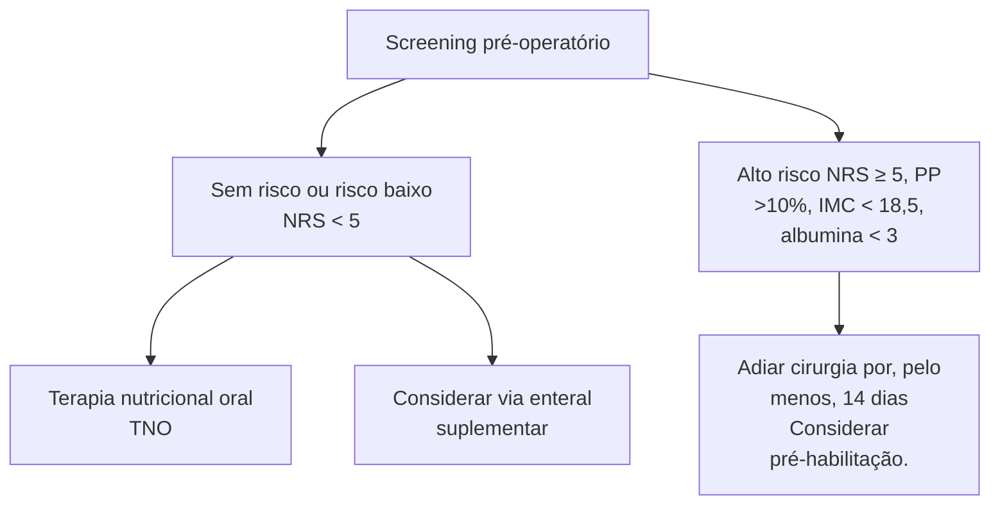
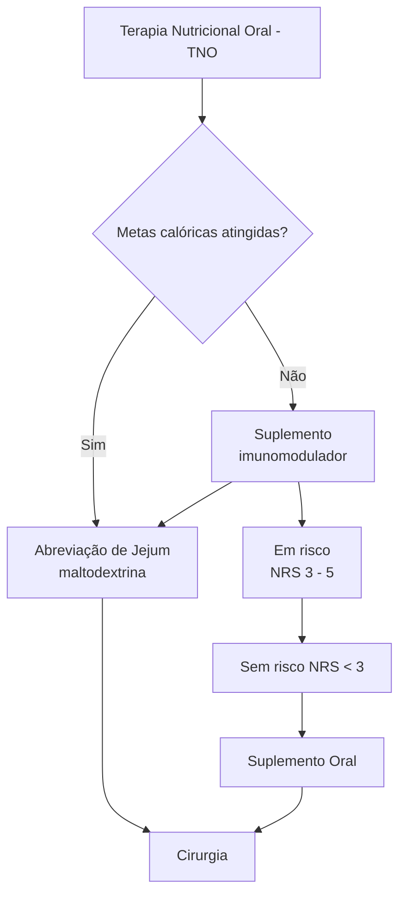

Miscelânea (CIR)

# NUTRIÇÃO PERIOPERATÓRIA

• Desnutrição pode ocorrer em até 50% dos pacientes cirúrgicos. Limiar de suspeição sempre deve ser baixo (atentar para perda ponderal, perda de massa muscular, baixa ingesta calórica, edema etc.);
• Escores (PONS/ASG) podem ser usados para triagem:
  • Critérios laboratoriais ISOLADAMENTE não podem dar diagnóstico de desnutrição, e devem ser interpretados com cautela;
  • A terapia nutricional PREFERENCIALMENTE deve ser sempre a mais fisiológica (oral > enteral > parenteral);

• Pré-habilitação corresponde a medidas auxiliares à terapia nutricional perioperatória, que visa diminuir desfechos negativos (parar de fumar, controle de comorbidades, tratamento da anemia, suporte psicológico, exercícios supervisionados);
• Imunonutrição pode ser um importante aliado em pacientes de mais alto risco (diminuição de risco infeccioso e de distúrbios da cicatrização).

## 1. CONSIDERAÇÕES INICIAIS

• A desnutrição é prevalente em pacientes cirúrgicos, ocorrendo em até 50% dos casos;
  • Traz impactos muito negativos – maiores taxas de internação, maior risco de infecções, maior mortalidade.
• O procedimento cirúrgico é traumático!
  • De certa forma, todo trauma é capaz de levar a um aumento do consumo energético;
  • Demandas basais: 25 – 35 kcal/kg/dia; 0,8 – 1 g/kg/ dia de proteína; 30 mL/kg/dia. Ainda, a realimentação tardia é algo frequente em pacientes cirúrgicos;
• Quem se beneficia?
  • Atenção! É necessário ter um baixo limiar de suspeição para desnutrição;
  • Pontos para suspeição:
  • Baixa ingesta calórica;
  • Perda ponderal;
  • Perda de massa muscular;
  • Perda de gordura do tecido subcutâneo;
  • Edema – localizado ou generalizado; Pode ser um fator confundidor para a perda de peso.
  • Perda do status funcional.
• Consequências da desnutrição:
  • A desnutrição perioperatória pode influenciar diversas micro e macrorreações na resposta do hospedeiro ao trauma cirúrgico. Pode influenciar numa maior resposta TH2 pela resposta imune diminuindo capacidade de lidar com processos infecciosos e por fim gerando maior risco de infecções peri e pós-operatórias. Diminui a capacidade de cicatrização, favorecendo a deiscência de aponeurose ou anastomótica. Pacientes desnutridos normalmente têm maior dificuldade de realizar o desmame do ventilador mecânico

## 2. RASTREIO PARA DESNUTRIÇÃO

**Algumas ferramentas podem ser utilizadas para screening** Figura 1

**Avaliação laboratorial;**
• *Protein status* apresenta correlação com desfechos clínicos desfavoráveis. Isoladamente, tem relevância questionável.

• Há um marcador ideal? Não! Albumina: meia-vida de 18 – 20 dias; é o marcador mais utilizado. Transferrina: meia-vida de 8 – 9 dias; Também reflete os níveis de reserva férrica. Assim sendo, pode ser visto como um fator confundidor. Pré-albumina: também conhecida como transtirretina; Tem meia-vida de 2 – 3 dias; Acesso difícil na prática clínica. PCR – marcador de fase aguda: Atente-se para o fato de que, muitas vezes, a queda da proteína sérica é decorrente de inflamação, e não somente pela desnutrição. Ocorre mudança no balanço de produção de proteínas, prevalecendo as de fase aguda . Atualmente não são utilizados unicamente como fator fidedigno da nutrição do paciente.

| Etapa 1
IMC                                                                  | Etapa 2
Pontuação de
perda de peso                      | Etapa 3
Escore de ingestão
(modificado) |
| -------------------------------------------------------------------------------- | --------------------------------------------------------------- | ----------------------------------------------- |
| IMC <18,5
(<20 se a idade for >65)                                           | Perda de peso não
planejada >10% nos
últimos seis meses | IMC <18,5
(<20 se a idade for >65)          |
| ↓
Qualquer resposta afirmativa                                               |                                                                 |                                                 |
| E/OU
Albumina <3,0                                                           |                                                                 |                                                 |
| ↓
Clínica de nutrição
pré-operatória ou
intervenção de nutricionista |                                                                 |                                                 |

**Figura 1** PONS – *Preoperative nutrition screen malnutrition screening tool.*

**Sarcopenia:**
• *Hand-grip test:* é um teste capaz de avaliar, de modo objetivo e prático, a perda de força muscular;
  • Valor alterado: < 26 kg, em homens; < 16 kg, em mulheres.
  • Avalia a força muscular, pela contração isométrica, por cinco segundos, dos músculos da mão e do antebraço.
• *Dual-energy X-ray absorptiometry* (DEXA):é o exame padrão-ouro para avaliação de sarcopenia; é usado na maioria dos trabalhos. Consegue quantificar quantidade de tecido muscular, gordura, osso e água, com consequência de padronização em Z e T-score;

CIRURGIA DO APARELHO DIGESTIVO

• Uso de USG/TC/TM pode ser preditor fidedigno de perda de massa muscular: Psoas index: mensuração da área do músculo psoas maior.

## 3. MANEJO

• Primeiramente, é preciso definir a via preferencial:
  • Opções:
    • Oral: enteral: mantém quadro fisiológico, com estabilidade da barreira mucosa gastrointestinal favorecendo a menor endotoxemia e bacteremias com toxinas e bactérias adentrando o sistema porta. Tem maior facilidade de biodisponibilidade, diminui atrofia vilosa;
    • Parenteral: mais cara; demonstra necessidade de ambiente hospitalar; altas taxas de complicações – sejam infecciosas (ICS), DHE e outras.
  • A via mais fisiológica é pelo TGI;
  • Importância da EMTN;
    • Triagem e acompanhamento dos pacientes em risco nutricional;
    • Cálculo da taxa metabólica basal e do consumo calórico de forma individualizada: cálculos estimados ou métodos mais aprofundados (calorimetria indireta).
    • Estimativa da meta de macro (carboidratos, gorduras e proteínas) e de micronutrientes (minerais, vitaminas).
• Pré-habilitação:
  • Recomenda-se iniciar em quatro a seis semanas que antecedem a cirurgia:
  • Esquemas: exercícios físicos estruturados – prevenção da sarcopenia/miopenia; suporte psicológico; combate/tratamento da anemia; controle de comorbidades; interrupção de comportamentos negativos para a saúde: tabagismo (pelo menos 4-8 semanas); etilismo; consumo de substâncias psicoativas.
• Abreviação do jejum:
  • Pacientes sem risco de broncoaspiração podem receber líquidos claros em até duas horas da anestesia: Solução rica em carboidratos (maltodextrina): Associada com menor descontrole glicêmico perioperatório, sem diferença em desfechos negativos. Nos restos dos casos, recomenda-se quatro horas de jejum para amamentação, seis horas para refeição leve ou papa infantil e oito horas para uma refeição pesada;
  • Exceção: DM2 descompensado; gastroparesia; obstrução intestinal.
• Imunonutrição: útil para os pacientes de alto risco nutricional, podem ser candidatos à terapia imunomoduladora (arginina, ômega-3, nucleotídeos etc); há estudos promissores apontando efeito benéfico em complicações infecciosas e período de permanência hospitalar. Demonstrada eficácia quando utilizada pelo período mínimo de sete dias em caráter pré-operatório;
• Dietas especiais:
  • Paciente pulmonar: dietas nesses pacientes envolvem diminuição do nível de carboidratos com

maior disponibilidade de gordura e proteína. A fim de diminuir a quantidade de CO2 produzido.
  • Renal: tem menor quantidade de água livre em sua dieta e menor quantidade de magnésio, fósforo e potássio, visto seu possível acúmulo. Antigamente utilizavam-se dietas com baixo teor de proteína, entretanto, em pacientes críticos e com sarcopenia podem ser utilizadas doses maiores do que em um paciente eutrófico.
  • Diabéticos: apresentam diminuição de carboidratos e troca para lipídeos a fim de garantir menor variação no nível de glicemia no sangue, devem ter fibras para garantir maior tempo de esvaziamento gástrico e favorecer maior absorção de nutrientes.
  • Hepático: a dieta do paciente hepático deve apresentar ácidos graxos de cadeia média, já que estes não necessitam dos sais biliares para absorção intestinal, além de proteínas de cadeia ramificada devido a sua menor chance de produzir encefalopatia hepática.

### Como manejar o pré-operatório?

**Figura 2** Rastreio pré-operatório.

**Figura 3** Terapia oral nutricional.

### Manejo pós-operatório:

• Prevenção da hiper-hidratação! Risco de congestão pulmonar/edema (perda para terceiro espaço); íleo paralítico.
• Fazer hidratação guiada por metas!!! Cálculo do balanço hídrico; vigilância do débito urinário.
• Realimentação precoce! Deve ser realizada conforme protocolos de otimização perioperatória (ERAS, ACERTO). O complemento nutricional já deve estar presente na dieta de prova! Se não for possível...

NUTRIÇÃO PERIOPERATÓRIA

contatar nutrição se: jejum por cinco dias; ofertar menos de 50% do aporte calórico necessário em sete dias.

ATENÇÃO! Cuidado com síndrome da realimentação!!

• Avaliação de alta hospitalar: o paciente demonstra capacidade de receber todo seu aporte calórico por via oral exclusiva? Se não, programar retorno ambulatorial com EMTN; suplemento hipercalórico/ hiperproteico; considerar passagem de SNE.
