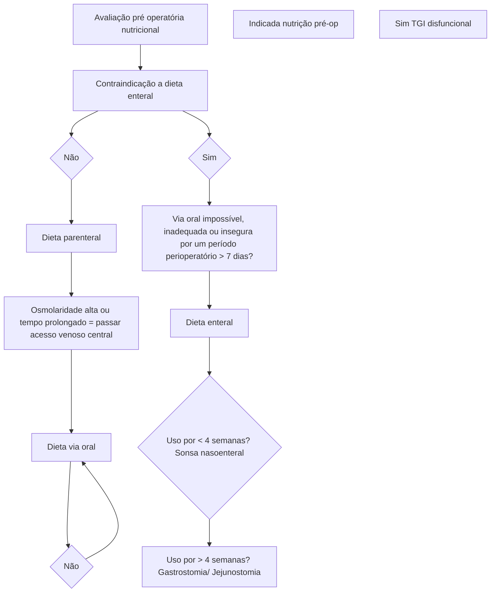
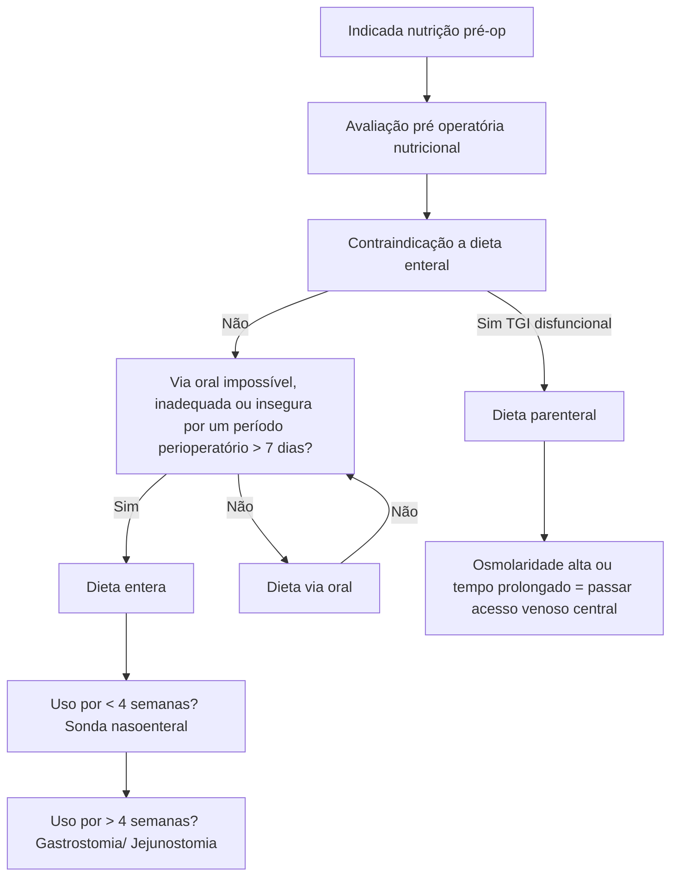

# PERIOPERATÓRIO: PRÉ-OPERATÓRIO

## Exames pacientes hígidos e cirurgias pequenas

- <40 anos
  - Mulheres: Teste de Gravidez
  - Homens: nenhum
- 40-49 anos
  - Mulheres: Hb/Ht + Teste de gravidez

- Homens: ECG
- 50-64 anos
  - Mulheres: Hb/Ht + ECG
  - Homens: ECG
- >65 anos
  - Todos: Hb/Ht, Ur/Cr, glicemia, Rx de tórax

## 1. PRÉ-HABILITAÇÃO

- Medidas pré-operatórias associadas a melhor preparo e desfechos:
  - Perda de peso;
  - Cessar tabagismo;
- Intervenções nutricionais e psicossociais;
- Tratamento de comorbidades e doenças associadas.

## 2. EXAMES PRÉ-OPERATÓRIOS

### 2.1 Pacientes hígidos com procedimentos sem risco de sangramento

- Cirurgias ambulatoriais; hernioplastia inguinal; biópsias superficiais; rinoplastias; anestesia local; endoscopia; outros;
- Paciente hígido = ASA 1 ou 2.
- Indicações de exames, conforme idade:

Exames pacientes hígidos e cirurgias pequenas
- <40 anos
  - Mulheres: Teste de Gravidez
  - Homens: nenhum
- 40-49 anos
  - Mulheres: Hb/Ht + Teste de gravidez
  - Homens: ECG
- 50-64 anos
  - Mulheres: Hb/Ht + ECG
  - Homens: ECG

- >65 anos
  - Todos: Hb/Ht, Ur/Cr, glicemia, Rx de tórax

### 2.2 Pré-operatório de pacientes internados com comorbidades e/ou procedimentos maiores

- Hemograma: Insuficiência renal; Sangramento > 500ml; Suspeita clínica de anemia ou Policitemia; Neoplasias; Esplenomegalia; Uso de anticoagulantes; Presença de infecção, radio ou quimioterapia recentes; Mulheres > 45 anos, homens > 65 anos;
- Coagulograma: História de sangramentos anormais; Operações vasculares, oftalmológicas, neurológicas ou com circulação extracorpórea; Hepatopatias e síndrome de mal absorção; Neoplasias avançadas; Esplenomegalia;

• Tipagem: Procedimentos cirúrgicos de grande porte; Possibilidade de perda sanguínea elevada; Deve ser acompanhada de reserva de sangue;
• Glicemia: Pancreatopatias, nutrição parenteral; Paciente acima de 40 anos; História pessoal ou familiar de diabetes; Uso de hipoglicemiantes, como corticóides ou tiazídicos; Lembrar que o que conta é a glicemia de jejum e não a hemoglobina glicada;
• Ureia e creatinina: Pacientes acima de 40 anos; História pessoal ou familiar de nefropatias; Hipertensão, diabetes;
• Urocultura: Pacientes com indicação de cateterismo vesical + grupo de risco para bacteriúria assintomática; Idosos, diabéticos, história de infecção urinária de repetição, litíase, urinária, bexiga neurogênica, malformações de vias urinárias, gravidez e síndrome de imunodeficiência adquirida (AIDS); Urina 1 não é necessária;

• Radiografia de tórax: > 60 anos; Cirurgia torácica ou do abdome superior; Cardiopatas, pneumopatas e portadores de neoplasias; Tabagistas de mais de 20 cigarros/dia;
• ECG: Homens > 40 anos e mulheres > 50 anos; Cardiopatas, coronariopatas ou com sintomas de angina; Diabéticos, hipertensos e portadores de outras doenças que cursam com cardiopatas ou em uso de drogas cardiotóxicas;
• Eletrólitos: Uso de diurético ou corticoide; Nefropatias, hiperaldosteronismo secundário; Cardiopatias ou hepatopatias com síndrome edemigênica;
• Protoparasitológico de fezes: Intervenções sobre o tubo digestivo;
• Outros: Albumina: desnutridos e idosos; Ecocardiograma: cardiopatas; Exames hepáticos: hepatopatopatias, específico; Tomografia: conforme patologia.

## 3. MEDICAMENTOS

### 3.1 Suspender

• Anticoagulantes orais: Suspender 7 dias antes → iniciar heparina ou enoxaparina; Suspender heparina e enoxaparina 12 horas antes e reintroduzir 24 a 48 horas após (varia conforme fonte e risco de sangramento + INR);
• Antiplaquetários: AAS e clopidogrel; Suspender 7 a 10 dias antes; Pesar risco benefício em pacientes com AVCi ou IAM a depender do risco de sangramento – não adianta suspender depois ou reintroduzir antes; Reintroduzir 05 a 07 dias após;
• Antidepressivos;
• Diuréticos inibidores do potássio;
• Ganglioplégicos;
• Anti-inflamatórios não esteroidais (AINEs): Altera a função plaquetária; Suspender 24 a 48h antes;
• Hipoglicemiantes orais: Hipoglicemiante oral tem que ser suspensos na véspera; Trocados por insulina regular e controle de dextro; Soro glicosado conforme necessidade; NPH → 1/3 ou ½ da dose na manhã da cirurgia.

### 3.2 Manter

• Anti-hipertensivos;
• Betabloqueadores;
• Cardiotônicos;
• Broncodilatadores;
• Corticoides: Paciente com uso crônico de corticoide: Risco de evoluir com crise addisoniana (hipoadrenal); > 5mg de Prednisona por > 2 semanas; Redução prévia em 02/04 semanas; Adrenalectomia prévia. Quadro clínico: Letargia e mal estar; Náuseas e vômitos; Hipotensão, hipoglicemia, hiponatremia, coma. Se uso crônico;→aumentar dose de corticoide VO pouco antes da cirurgia e realizar dose de corticóide EV pré-operatória. Se crise→hidrocortisona 100mg EV 08/08h;
• Insulina;
• Psiquiátricos e todos os demais.

## 4. DIETA

• UptoDate acerca de dieta no pré-operatório:
  • Líquidos claros → até 02 horas antes;
  • Leite materno → até 04 horas antes;
  • Dieta leve, leite normal, fórmulas → até 06 horas antes;
  • Comida sólida, carne gordurosa → até 08

horas antes: Para anestesia geral: → risco de broncoaspiração e complicações na indução anestésica; Cirurgias e pacientes sem complicações; Sem grande mobilização do TGI.
• Colégio Brasileiro de Cirurgiões → 08 horas para qualquer alimento / líquido.

## 5. NUTRIÇÃO PRÉ-OPERATÓRIA

• Realizada em pacientes com desnutrição ou de alto risco:
  • IMC baixo;
  • Obesidade mórbida;
  • Doenças consumptivas;

• Doenças do TGI que afetam a absorção;
• Perda ponderal > 5% nos últimos 30 dias;
• Albumina < 3,5 g/Dl, linfócitos < 1500 / mm3, anemia.

PERIOPERATÓRIO: PRÉ-OPERATÓRIO                                                                         3

Obs: Carece de avaliação multidisciplinar, exame físico e antropométrico, exames conforme indicação. Lembrando que a nutrição deve ser realizada cerca de 7 a 14 dias antes, para que as proteínas de fase longa comecem a se formar;

• Fórmula Harris – Benedict → calcula a taxa metabólica basal, necessidades calóricas diárias. Leva em consideração sexo, idade, peso, altura + fator de estresse:
• 15% se sepse e ou trauma;
• 15-20% em cirurgias abdominais eletivas;
• 100% em queimados.

## 6. FLUXOGRAMA MEDCOF

# PRÉ-OPERATÓRIO II

## Lista de verificação de segurança cirúrgica (primeira edição)

| WORLD ALLIANCE FOR PATIENT SAFETY \| SUS \| ANVISA \| RESL \| World Health Organization                                                                                                                                                                                                                                                                                                                                                                                                                                                                                                                                                 |                                                                                                                                                                                                                                                                                                                                                                                                                                                                                                                                                                                                                                                                                                                                                                                                                                                                                                                                                                                                                                                                        |                                                                                                                                                                                                                                                                                                                                                                                                                                                                                                                                                                                                                                                                                            |
| --------------------------------------------------------------------------------------------------------------------------------------------------------------------------------------------------------------------------------------------------------------------------------------------------------------------------------------------------------------------------------------------------------------------------------------------------------------------------------------------------------------------------------------------------------------------------------------------------------------------------------------- | ---------------------------------------------------------------------------------------------------------------------------------------------------------------------------------------------------------------------------------------------------------------------------------------------------------------------------------------------------------------------------------------------------------------------------------------------------------------------------------------------------------------------------------------------------------------------------------------------------------------------------------------------------------------------------------------------------------------------------------------------------------------------------------------------------------------------------------------------------------------------------------------------------------------------------------------------------------------------------------------------------------------------------------------------------------------------- | ------------------------------------------------------------------------------------------------------------------------------------------------------------------------------------------------------------------------------------------------------------------------------------------------------------------------------------------------------------------------------------------------------------------------------------------------------------------------------------------------------------------------------------------------------------------------------------------------------------------------------------------------------------------------------------------ |
| Lista de verificação de segurança cirúrgica (primeira edição)                                                                                                                                                                                                                                                                                                                                                                                                                                                                                                                                                                           |                                                                                                                                                                                                                                                                                                                                                                                                                                                                                                                                                                                                                                                                                                                                                                                                                                                                                                                                                                                                                                                                        |                                                                                                                                                                                                                                                                                                                                                                                                                                                                                                                                                                                                                                                                                            |
| **Entrada**

□ Paciente confirmou
• Indentidade
• Sítio cirúrgico
• Procedimento
• Consentimento

□ Sítio demarcado/não se aplica

□ Verificação de segurança
Anestésica concluída

□ Oxímetro de pulso no paciente e
Em funcionamento

O paciente possui:
Alergia conhecida?
□ Não
□ SIM

Via aérea difícil/risco de aspiração?
□ Não
□ SIM, e equipamento/assistência disponíveis

Risco de perda sanguínea > 500 ML
(7 ML/KG em crianças)?
□ Não
□ SIM, e acesso endovenoso adequado
e planejamento para fluidos | **Pausa cirúrgica**

□ Confirmar que todos os membros da
equipe se apresentaram pelo nome
e função

□ Cirurgião, anestesiologista e
enfermeiro confirmam verbalmente:
• Identificação do paciente
• Sítio cirúrgico
• Procedimento

Eventos críticos previstos
□ Revisão do cirurgião:
Quais são as etapas críticas ou
inesperadas, duração da operação,
perda sanguínea prevista?

□ Revisão da equipe de anestesia:
Há alguma preocupação específica
em relação ao paciente?

□ Revisão da equipe de enfermagem:
Os materiais necessários, como
instrumentais, próteses e outros
estão presentes e dentro da validade
de esterilização?
(incluindo resultados do indicador)?
há questões relacionadas a
equipamentos ou quaisquer
preocupações?

A profilaxia antimicrobiana FOI
realizada nos últimos 60 minutos?
□ SIM
□ Não se aplica

As imagens essenciais estão disponíveis?
□ SIM
□ Não se aplica | **Saída**

O profissional da equipe de
enfermagem ou da equipe médica
confirmam verbalmente com a equipe:

□ O nome do procedimento registrado

□ Se as contagens de instrumentais
cirúrgicos, compressas e agulhas
estão corretas (ou não se aplicam)

□ Como a amostra para anatomia
patológica está identificada
(incluindo o nome do paciente)

□ Se há algum problema com
equipamento para ser resolvido

□ O cirurgião, o anestesiologista
e a equipe de enfermagem revisam
preocupações essenciais para a
recuperação e o manejo deste
paciente

Assinatura |
| **Antes de indução anestésica** ►►►►►►►►► **Antes de incisão** ►►►►►►►►►►►► **Antes de o paciente sair de sala de operações**                                                                                                                                                                                                                                                                                                                                                                                                                                                                                                           |                                                                                                                                                                                                                                                                                                                                                                                                                                                                                                                                                                                                                                                                                                                                                                                                                                                                                                                                                                                                                                                                        |                                                                                                                                                                                                                                                                                                                                                                                                                                                                                                                                                                                                                                                                                            |

## 1. ANTIBIOTICOPROFILAXIA PRÉ-OPERATÓRIA

• Com o objetivo de diminuir ou prevenir o risco de infecção de ferida operatória.
• Cirurgias já infectadas tem indicação antibioticoterapia, a antibioticoprofilaxia é para evitar infecção do sítio cirúrgico.
• A boa técnica operatória é o principal fator de prevenção.

### 1.1 Em quem fazer?

• Procedimentos com risco de infecção do sítio cirúrgico e ferida operatória;
• Pacientes que apresentariam alta morbimortalidade caso evoluísse com infecção:
  • Pacientes ASA III, IV, V;
  • Cirurgias potencialmente contaminadas, contaminadas e de longa duração.

### 1.2 Como fazer?

• Momento do início = na indução anestésica ou 60 minutos antes da incisão (ou antes de induzir);
• Duração = até término do procedimento cirúrgico;
• Escolha da droga: Microbiota do órgão manipulado; Dados epidemiológicos dos agentes mais frequentes;
• Doses: Dose inicial elevada; dose de ataque; Doses convencionais intraoperatórias a cada 2x da meia vida da droga – se o paciente apresentar sangramento abundante é importante administrar a droga perdida no sangramento.

### 1.3 Classificação

| Classificação              | Critério                                                                                       | Taxa de infecção |
| -------------------------- | ---------------------------------------------------------------------------------------------- | ---------------- |
| Limpa                      | Limpa, não traumática, sem inflamação, sem quebra de técnica                                   | 2,1%             |
| Potencialmente contaminada | TGI, TGU, trato respiratório sem contaminação, mínima quebra de técnica asséptica              | 3,3%             |
| Contaminada                | Trauma, contaminação grosseira, quebra de técnica asséptica                                    | 6,4%             |
| Infectada                  | Ferida traumática/ contaminada tardia com tecidos desvitalizados, pus, fezes ou corpo estranho | 7,1%             |

**Cirurgias limpas:**
• Exemplo: hérnias eletivas, mama, vascular e ortopédica com prótese, cardíaca, neurocirurgia sem prótese, torácicas.
• Germe: S. aureus.
• Droga: Cefalosporina de 1a geração (se instituição com alto risco para MRSA → vancomicina);
• Não fazer x fazer profilaxia (controverso).

**Cirurgia potencialmente contaminada:**
- Exemplo: Neurocirurgia através de mucosa, cabeça e pescoço, esôfago.
  - Germe: anaeróbios gram positivo e negativos + anaeróbios da cavidade oral.
  - Droga: Amoxicilina + Clavulanato (Clavulin).
- Exemplo: próstata e vias urinárias com cultura pré-operatória de urina negativa:

- Germe: enterobactérias;
- Droga: ciprofloxacino;

**Cirurgias contaminadas:**
- Exemplo: jejuno com obstrução, íleo, cólon, reto, apendicite aguda sem perfuração.
- Germe: gram negativos aeróbios e anaeróbios.
- Droga: gentamicina + clindamicina ou metronidazol; clavulim, bactrim; cefoxitina.

## 2. TRANSFUSÃO

- Muito controverso;
- Varia conforme risco do paciente e risco cirúrgico;
- Colégio Brasileiro de Cirurgiões indica para Hb < 10g/dL;
- Uptodate: avaliação clínica pré-operatória e risco cirúrgica:
  - Tratamento e investigação da anemia;
  - Ferro, eritropoetina;
  - Minimizar transfusões desnecessárias.

- Sintomáticos → < 8g/dL;
- Coronariopatia → < 10g/dL;
- Trauma com sangramento agudo → decisão clínica;
- Cirurgia não cardíaca → > 8g/dL;
- Paciente oncológico → > 7g/dL;
- Paciente ambulatorial → sem estudos.

## 3. ELEMENTOS ESSENCIAIS PARA UMA CIRURGIA SEGURA

- Preparo pré-operatório;
- Equipe treinada;
- Planejamento;
- Protocolo institucional;

- Seguir recomendações gerais;
- Comunicação;
- Cuidados pós-operatórios.

## 4. CHECKLIST DA CAMPANHA DE CIRURGIA SEGURA DA OMS

- Comprovado que diminui morbimortalidade:
  - Diminui erros evitáveis;
  - Diminui morbimortalidade no ato cirúrgico;
  - Procedimento seguro e padronizado;
  - Melhor cuidado para com o paciente.

### 4.1 FASE 1 = Check-in ou Sign-in.

- É o procedimento feito antes da indução anestésica no qual deve participar o anestesista e o enfermeiro e consiste em realizar as seguintes medidas:
  - Confirmar o paciente, o procedimento e o Termo de Consentimento Livre e Esclarecido (TCLE);
  - Confirmar a marcação do local da cirurgia (deve ser marcado com um ponto e não com um X, pois o X pode levar a interpretação que não é o local a ser realizado);
  - Confirmação de material anestésico e risco anestésico;
  - Avaliar alergias, via aérea e risco de broncoaspiração.

### 4.2 FASE 2 = Time-out. Antes da incisão na pele:

- Todos envolvidos no procedimento devem participar:
  - Confirmação dos nomes e funções;
  - Confirmação verbal do nome do paciente, local e procedimento a ser realizado;
  - Avaliar risco de sangramento;
  - Checar realização de antibioticoprofilaxia (60 minutos antes da incisão ou na indução anestésica);
  - Checar se as imagens essenciais para realização do procedimento estão disponíveis.

### 4.3 FASE 3 = Check-out ou Sign-out. No fechamento da ferida operatória:

- Toda equipe deve participar (principalmente o instrumentador):
  - Confirmar os procedimentos realizados, materiais utilizados, contagem de compressas e perfurocortantes;
  - Separar material em local adequado para envio ao anatomopatológico;
  - Relatar equipamentos com defeitos;
  - O cirurgião, anestesista e a equipe de enfermagem revisam preocupações para a recuperação e o manejo do paciente.

PRÉ-OPERATÓRIO II                                                                                      3

## 5. ANTISSEPSIA E ASSEPSIA

• Finalidade: eliminar a microbiota transitória da pele e reduzir a microbiota residente;
• Duração: 3 a 5 minutos (primeiro procedimento) / Cirurgias subsequentes (2 a 3 minutos);
• Tricotomia (sem lâmina – 24 horas antes);
• Solução para banho no dia anterior;
• Colocação de avental e luvas.

## 6. MONTAGEM DE MESA

• Padrão: dividir mesa em 4 quadrantes (A/B/C/D):
  • D – Diérese → bisturi e tesoura;
  • C – Hemostasia → Kelly, Kocher e Allis;
  • B – Síntese → ponta agulha, pinça e fios;
  • A – Especiais → Bacia, compressa, afastadores e grampeadores.
• Instrumentador fica do lado do auxiliar;
• Cirurgião fica ao lado oposto do instrumentador.

[Image showing surgical instruments organized in quadrants A/C and B/D on a surgical table]

## 7. INSTRUMENTOS

• Afastadores autostáticos: Finochetto, Belfour, Gosset;
• Afastadores manuais: Farabeuf, Volkmann, Richardson, Doyen.

----

### Lista de verificação de segurança cirúrgica (primeira edição)

| Antes de indução anestésica                                                                                                            | Antes de incisão                                                                                                                                                                                       | Antes de o paciente sair de sala de operações                                                                                           |
| -------------------------------------------------------------------------------------------------------------------------------------- | ------------------------------------------------------------------------------------------------------------------------------------------------------------------------------------------------------ | --------------------------------------------------------------------------------------------------------------------------------------- |
| **Entrada**                                                                                                                            | **Pausa cirúrgica**                                                                                                                                                                                    | **Saída**                                                                                                                               |
| ☐ Paciente confirmou
• Indentidade
• Sítio cirúrgico
• Procedimento
• Consentimento                                    | ☐ Confirmar que todos os membros da equipe se apresentaram pelo nome e função                                                                                                                          | O profissional da equipe de enfermagem ou da equipe médica confirmam verbalmente com a equipe:                                          |
| ☐ Sítio demarcado/não se aplica                                                                                                        | ☐ Cirurgião, anestesiologista e enfermeiro confirmam verbalmente:
• Identificação do paciente
• Sítio cirúrgico
• Procedimento                                                             | ☐ O nome do procedimento registrado                                                                                                     |
| ☐ Verificação de segurança Anestésica concluída                                                                                        | Eventos críticos previstos
☐ Revisão do cirurgião:
Quais são as etapas críticas ou inesperadas, duração da operação, perda sanguínea prevista?                                                 | ☐ Se as contagens de instrumentais cirúrgicos, compressas e agulhas estão corretas (ou não se aplicam)                                  |
| ☐ Oxímetro de pulso no paciente e Em funcionamento                                                                                     | ☐ Revisão da equipe de anestesia:
Há alguma preocupação específica em relação ao paciente?                                                                                                         | ☐ Como a amostra para anatomía patológica està idntificada (incluindo o nome do paciente)                                               |
| O paciente possui:
Alergia conhecida?
☐ Não
☐ SIM                                                                          | ☐ Revisão da equipe de enfermagem:
Os materiais necessários, como instrumentais, próteses e outros estão presentes e dentro da validade de esterilização?
(incluindo resultados do indicador)? | ☐ Se há algum problema com equipamento para ser resolvido                                                                               |
| Via aérea difícil/risco de aspiração?
☐ Não
☐ SIM, e equipamento/assistência disponíveis                                       | há questões relacionadas a equipamentos ou quaisquer preocupações?                                                                                                                                     | ☐ O cirurgião, o anestesiologista e a equipe de enfermagem revisam preocupações essenciais para a recuperação e o manejo deste paciente |
| Risco de perda sanguínea > 500 ML (7 ML/KG em crianças)?
☐ Não
☐ SIM, e acesso endovenoso adequado e planejamento para fluidos | ☐ A profilaxia antimicrobiana FOI realizada nos últimos 60 minutos?
☐ SIM
☐ Não se aplica
As imagens essenciais estão disponíveis?
☐ SIM
☐ Não se aplica                           | Assinatura                                                                                                                              |
