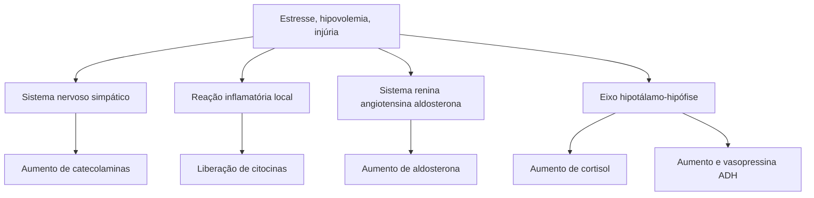

# PERIOPERATÓRIO: REMIT E PÓS-OPERATÓRIO

## 1. DEFINIÇÃO

• Resposta endócrina e metabólica inflamatória (imunológica) ao trauma;

• Toda e qualquer cirurgia é um trauma ao paciente;

• Nada mais é do que uma resposta de luta ou fuga, acontecendo vários mecanismos:

• Ativação dos mecanismos de coagulação;

• Desvio de líquidos do extravascular para o intravascular;

• Redistribuição do fluxo sanguíneo;

• Manutenção do equilíbrio ácido-básico e eletrolítico;

• Mobilização de leucócitos;

• Produção de macrófagos e linfócitos T;

• Aumento do débito cardíaco;

• Lipólise e proteólise;

• Aumento da glicogenólise e gliconeogênese.

• Pacientes submetidos a procedimentos cirúrgicos sofrem alterações súbitas das funções metabólicas e fisiológicas normais, que variam em intensidade.

**Tabela 1 Alterações no REMIT**

| Ação                          | Efeito                                                                   |
| ----------------------------- | ------------------------------------------------------------------------ |
| Aumento de Catecolaminas      | Catabolismo, vasoconstrição, taquicardia, aumento DC, HAS, hiperglicemia |
| Aumento de Cortisol           | Gliconeogênese e glicogenólise, hiperglicemia                            |
| Aumento de vasopressina (ADH) | Retenção de água intravascular                                           |
| Aumento de aldosterona        | Retenção de sódio e água intravascular                                   |
| Liberação de citocinas        | Reação inflamatória local                                                |

**Figura 1** Fluxograma de alterações no REMIT

## 2. FASES DO REMIT

• 1. Fase corticoadrenérgica (inicial) -> catabolismo e hipermetabolismo;
• 2. Transição -> redução do catabolismo;
• 3. Anabolismo precoce -> início da síntese de proteínas e deposição de gorduras;
• 4. Anabolismo tardio -> balanço energético positivo:
  • O anabolismo precoce começa entre o 3º e o 10º dia, a depender da resposta inicial e da magnitude do trauma;
  • O anabolismo tardio começa muito depois, apenas quando já existe uma regulação completa da homeostase do doente e ele se recuperou por completo.

## 3. PÓS-OPERATÓRIO

• Conhecer a evolução esperada e identificar precocemente os problemas;
• Exame físico deve ser diário, assim como a avaliação dos controles.

### 3.1 MNEMÔNICO = FAST HUG EX

• Fasting (dieta) → se sem contraindicações = liberar precoce;
• Analgesia e sintomáticos → evitar dor e náuseas, elas pioram os quadros;
• Sedação (se necessário) → cirurgias específicas, evitar esforços;
• Tromboprofilaxia → definir risco.
  • Baixo: < 40 anos, cirurgia que não trauma, não ortopédicas, < 60 minutos intraoperatório. Paciente sem fatores de risco. Tratamento não farmacológico → deambulação precoce, meias elásticas, compressão pneumática intermitente;
  • Moderado: Cirurgias menores em > 40 anos e/ ou fatores de risco; Cirurgias maiores em <

40 anos sem fatores de risco: Obesidade, uso de ACO, neoplasias, restrição no leito, doenças cardiovasculares, histórico de TVP e TEP, duração prolongada; Tratamento não farmacológico + tratamento farmacológico; Heparina 5000 UI 12/12h ou 8/8h; Enoxaparina 40mg 1x ao dia;
  • Alto: Cirurgias maiores em > 40 anos ou com fatores de risco; Obesidade, uso de ACO, neoplasias, restrição no leito, doenças cardiovasculares, histórico de TVP/TEP, duração prolongada; Tratamento não farmacológico + tratamento farmacológico: Heparina 5000 UI 12/12h ou 8/8h; Enoxaparina 40mg 1x ao dia;

Lembrar do Score de Caprini, que diz respeito à tromboprofilaxia no pós-operatório (5 ou > pontos = alto risco)

• Hidratação → reposição hidroeletrolítica conforme avaliação médica: Glicose 5% —> perdas insensíveis e calorias basais (hipoglicemia); Ringer lactato → sondas, drenos, urina (líquido extracelular); SF 0,9% -> hipertônica (muito Na) → acidose, hipercloremia;
• Ulceroprofilaxia: indicações: Paciente crítico (queimado, UTI, trauma grave); Redução da barreira mucosa e diminuição do fluxo sanguíneo; Úlcera de stress → pode levar a sangramento. Indicar se 1 critério maior ou 2 critérios menores. Critérios maiores: Coagulopatia (plaquetas < 50.000; INR > 1,5); Ventilação mecânica por mais do que 48 horas; Antecedentes de úlcera gastroduodenal no último ano; Trauma encefálico grave, raquimedular ou grande queimado. Critérios menores: Sepse ou trauma grave, UTI> 01 semana; Uso de AINES, corticoide ou antiplaquetários. Medicação via oral é melhor que endovenosa;
• Glicemia - controle de dextro e glicemia, se risco;
• Exames - conforme necessidade.
