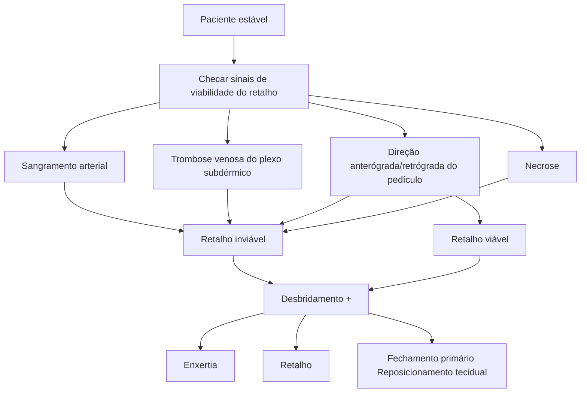
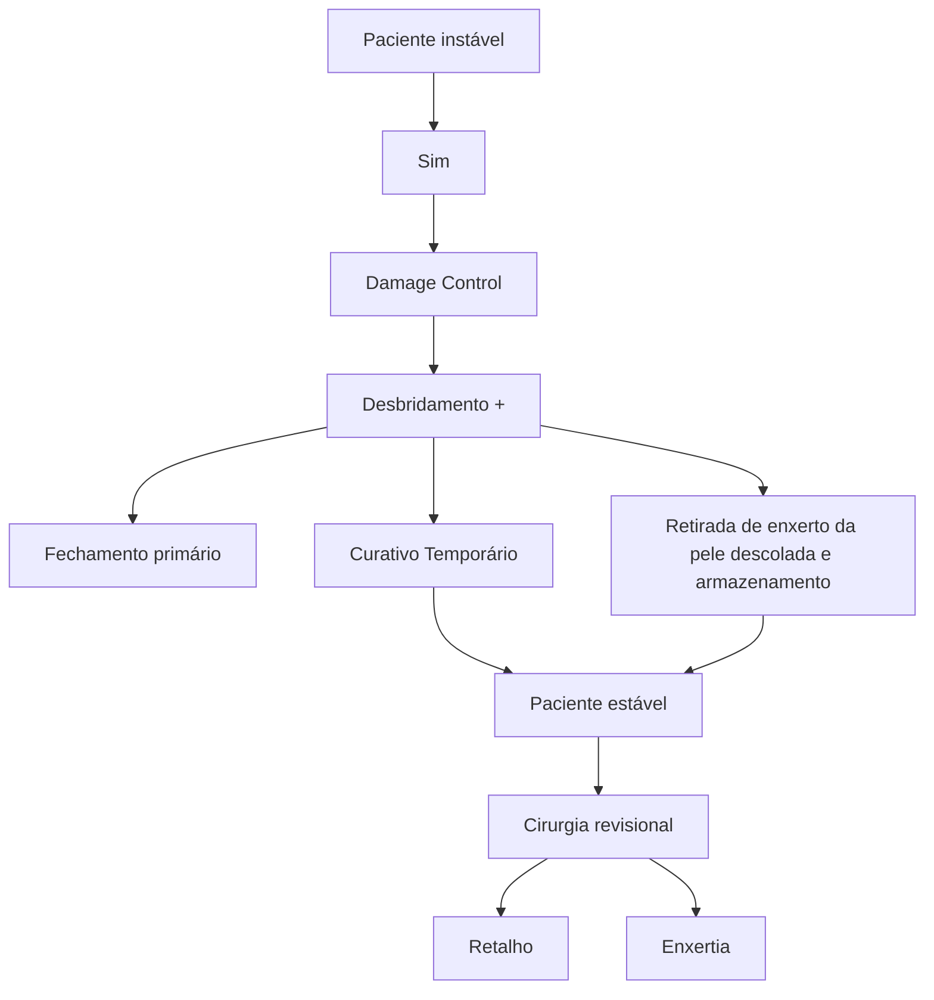
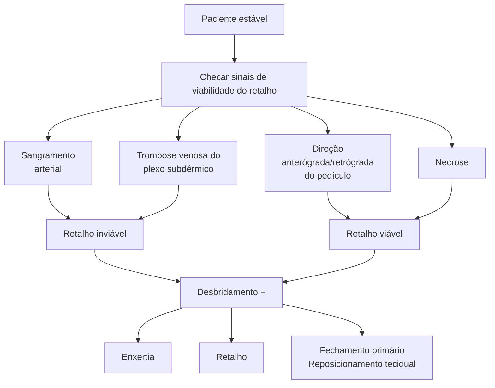

Outros temas em cirurgia plástica

# CIRURGIA PLÁSTICA: FERIMENTO DESCOLANTE

## 1. INTRODUÇÃO

• Fechamento primário está associado a alto risco de falha e aumento da morbidade;

• Mecanismo do trauma:
  • Trauma de alta intensidade → cisalhamento da pele → descolamento da pele dos tecidos profundos → Comprometimento da vascularização arterial e/ou venosa.

• 90% dos casos são nos membros inferiores (MMII).

• Normalmente o raciocínio não será para realizar o fechamento primário. Somente temos uma chance para realizar esta confecção de forma adequada, se caso não realizarmos o preparo adequado do paciente, assim como do tecido, pode-se necessitar um novo desbridamento, com retirada total do retalho e necessidade de um enxerto de outra topografia;

• Para se garantir uma boa adaptação de um retalho, deve-se focar, principalmente, em duas camadas
  • **Epiderme e derme:** Opticamente indistinguíveis a olho nu, e sua aproximação correta promove uma tensão e alinhamento da região do ferimento
  • **Subcutâneo:** Local proveniente da vascularização e inervação, dessa forma, ao realizar sutura nesse compartimento, promove uma redução na tensão da ferida assim como melhor objetivo cosmético.

![Image showing comparison of trunk and limb degloving injuries]

**Figura 1** Desenluvamentos de tronco e membros: comparação dos resultados da avaliação precoce ou tardia pela cirurgia plástica.

DOI 10.1590/0100-69912015003003.

### 1.1 APRESENTAÇÃO

• Variável extensão e perda cutânea;

• Com traumas isolados ou associados;

• No trauma isolado, no geral, há pouco sangramento, pois a hemostasia ocorre por distensão, com cisalhamento local, que promove uma força de tração. Ao retornar à posição habitual, promove uma trombose dos vasos do plexo subdérmico

• Nesses pacientes, deve-se garantir uma ótima visualização, tanto com a eversão da borda como também de sua parte inferior (visualização de periósteo, osso ou articulações, podem modificar a terapeutica instalada).

![Two medical images showing presence of degloving injury in anterior region of lower limb with subdermal plexus thrombosis]

**Figura 2** Presença de ferimento descolante em região anterior de MMII com trombose do plexo subdérmico

## 2. ALGORITMO

• O início do tratamento do paciente será sempre seguindo o algoritmo e raciocínio do ATLS, com intervenção imediata em lesões que ameaçam a vida. Nesses casos, pode-se realizar o procedimento cirúrgico em conjunto com a equipe da cirurgia plástica e assim garantir uma melhor chance de salvar tecido e membro do paciente **Figura 3**

## 2.1 PACIENTE INSTÁVEL

• Controle de danos;
• Cirurgia conservadora de debridamento, associando a uma das 3 seguintes condutas:
  • Fechamento primário, essa conduta pode promover um curativo biológico, impedindo a exposição do tecido subcutâneo, muscular e adiposo, entretanto, existe grande chance de falha do enxerto com necrose e posterior necessidade de outra abordagem para desbridamento e retalho com doação de outro sítio do paciente (alto risco de falha se maior ferida).
  • Curativo temporário, utilizado principalmente quando o tecido da parte lacerada esta contaminado, tornando-o inviável para posterior desbridamento e fechamento primário. Dessa forma estabiliza-se o paciente para posterior enxerto.
  • Retirada de enxerto da pele descolada e armazenamento, assim conseguimos emagrecer o tecido o tornando apto para posterior enxerto e, enquanto o paciente é estabilizado na UTI ou em outro departamento, realiza-se a estocagem do mesmo em banco de tecidos com soro fisiológico para posterior programação de confecção de enxerto. Normalmente esse tecido armazenado tem validade de 07 dias;
• Quando o paciente estiver estável novamente, será realizada a cirurgia revisional com retalho ou enxertia.
• Em pacientes que se apresentem com quadro de ferimentos pequenos, <5cm com pequena desvitalização tecidual ou contaminação da mesma, sem ser em MMII, pode-se optar por fechamento primário com poucas incidências de infecção ou perda do retalho.

**Figura 3** Fluxograma de manejo de ferimento descolante em paciente instável

FERIMENTO DESCOLANTE                                                                                                                         3

• Ao se optar pela realização de um desbridamento com ou sem armazenamento do tecido para posterior enxertia, pode-se utilizar com grande ajuda na prática cirúrgica o curativo de pressão negativa. O mesmo proporciona uma maior contração da ferida, de modo a tentar reduzir o tamanho do defeito apresentado, retirada constante de secreções, assim como espoliação de bactérias, promovendo uma boa terapia ponte para o tratamento definitivo em tempo hábil.

![Figura 4: Ferimento descolante extenso em região de MID associado a trombose venosa do plexo subdérmico com grande exposição muscular]

![Figura 5: Paciente instável, realizado desbridamento e curativo temporário.]

![Figura 6: Paciente instável, realizado fechamento primário.]

![Figura 7: Paciente do fechamento primário evoluiu com necrose do retalho.]

• Confira Figura 8 na página seguinte.

## 2.2 PACIENTE ESTÁVEL

• Checar sinais de viabilidade do retalho: Sangramento arterial; Trombose venosa do plexo subdérmico; Direção anterógrada/ retrógrada do pedículo; Necrose ao realizar a manipulação do tecido, deve-se evertê-lo e revisar capacidade de nutrição pelo plexo subdérmico, assim como suprimento arterial do mesmo.;

• Além disso, será importante, também, verificar a direção do tecido descolado. Torna-se mais provável uma confecção sem complicações de um retalho no sentido distal-proximal, do que um que está em sentido oposto, devido à manutenção do trajeto da vascularização no tecido.

• Avaliar se o retalho é viável ou inviável → desbridamento se houver necessidade + alguma das seguintes opções: Enxertia; Retalho; Fechamento primário e reposicionamento tecidual.

• Confira Figura 9 Figura 10 Figura 11

![Figura 9: Retalho fino e trombose. Optado por desbridar e realizar enxertia ou retalho.]

Figura 10 **Figura 10** Ferimento descolante com exposição óssea e grande exposição muscular com trombose de plexo subdérmico

Figura 11 **Figura 11** Realizado enxerto de pele + fasciotomia (síndrome compartimental).

obs. Importante verificar e atentar para síndrome compartimental nesses pacientes, até mesmo estando indicado em certos casos que se apresentem com trauma vasculares importantes associados a uma fasciotomia profilática. Ou seja, em pacientes com grandes chances de evoluírem para uma síndrome compartimental, pode-se realizar tal procedimento como forma de impedir a perda do membro ou do enxerto/retalho.

## 3. DESCOLANTE OCULTO

• Descolorante oculto (Morel-Lavallée) → plano descolado nos planos profundos, logo, não há perda tecidual visível;

• Elevar suspeição no acúmulo de líquidos na região, por exemplo. Na cronificação, ocorre a formação de pseudobursa: + formação de abscesso;

• Diagnóstico clínico ou radiológico (TC ou RNM).

### 3.1 TRATAMENTO

• Pequeno (conservador): Esvaziamento por punção; Curativos compressivos;

• Extenso ou com perda tecidual: Cirurgia. Desbridamento; Drenagem/aspiração; Enxerto; Retalho; Escleroterapia.

• Pacientes que apresentam esse tipo de ferimento podem cronificar, resultando em uma pseudo-bursa, uma cápsula de tecido fibroso que armazena o conteúdo líquido (hemático, seroso ou linfoide). Dessa forma, normalmente opta-se por ressecção do conteúdo com sua cápsula, devido à elevada taxa de recorrência.

**Figura 8** Fluxograma de manejo do ferimento descolante em paciente estável

FERIMENTO DESCOLANTE

# REFERÊNCIAS

**Figura 1** Desenluvamentos de tronco e membros: comparação dos resultados da avaliação precoce ou tardia pela cirurgia plástica.

DOI 10.1590/0100-69912015003003.

**Figura 2** Presença de ferimento descolante em região anterior de MMII com trombose do plexo subdérmico

Acervo pessoal Medcof.

**Figura 4** Ferimento descolante extenso em região de MID associado a trombose venosa do plexo subdérmico com grande exposição muscular

Acervo pessoal Medcof.

**Figura 5** Paciente instável, realizado desbridamento e curativo temporário.

Acervo pessoal Medcof.

**Figura 6** Paciente instável, realizado fechamento primário.

Acervo pessoal Medcof.

**Figura 7** Paciente do fechamento primário evoluiu com necrose do retalho.

Acervo pessoal Medcof.

**Figura 9** Retalho fino e trombose. Optado por desbridar e realizar enxertia ou retalho.

Acervo pessoal Medcof.

**Figura 10** Ferimento descolante com exposição óssea e grande exposição muscular com trombose de plexo subdérmico

Acervo pessoal Medcof.

**Figura 11** Realizado enxerto de pele + fasciotomia (síndrome compartimental).

Acervo pessoal Medcof.
