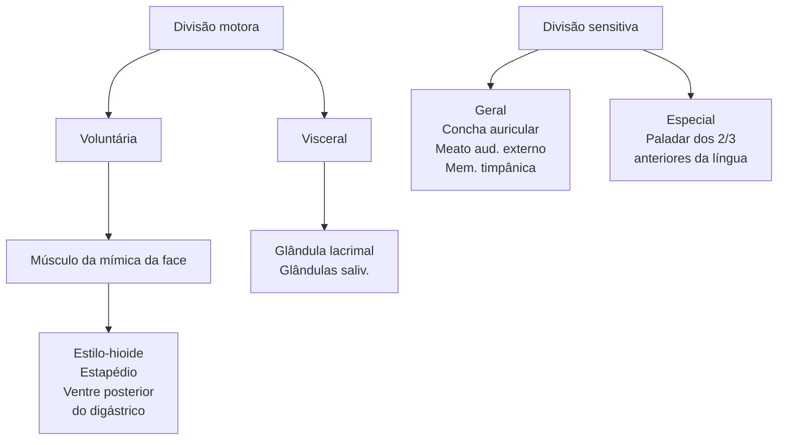
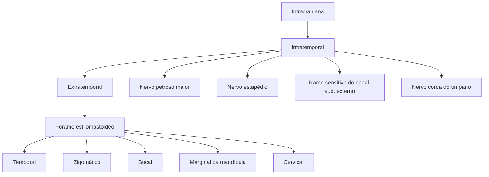
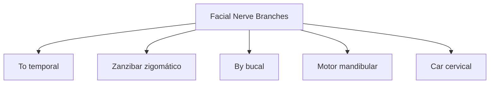
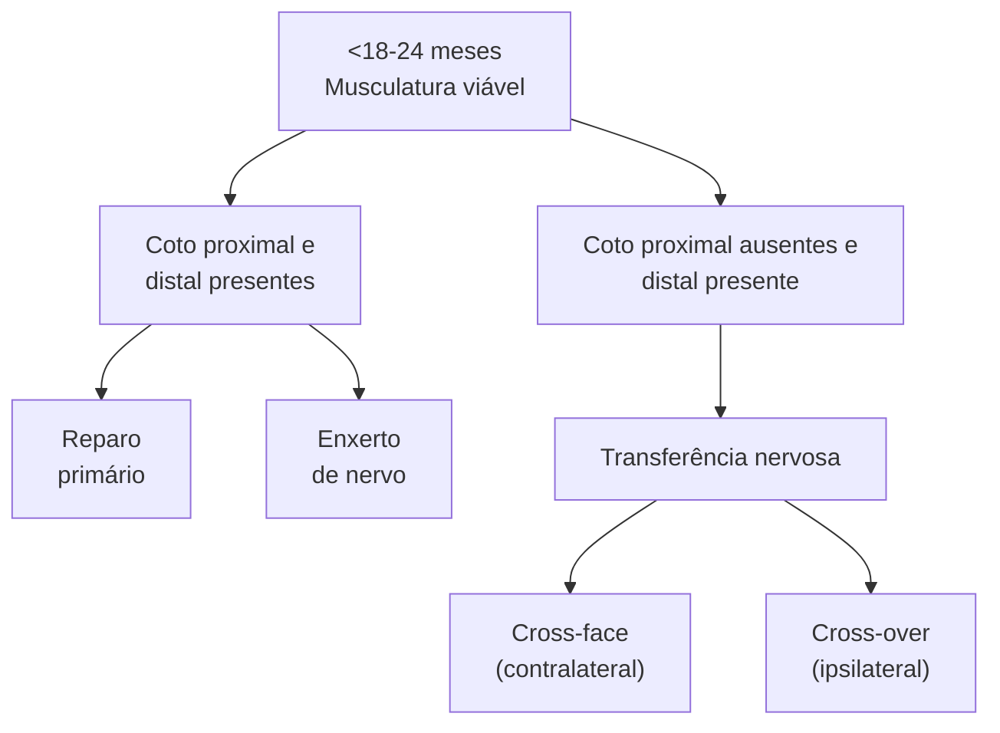

Outros temas em cirurgia plástica

# PARALISIA FACIAL

|  \*\*N. facial\*\* • Função motora da mímica. \*\*Lesão intracraniana\*\* • Anormalidades vasculares; • Tumores; • Trauma. \*\*Lesão intratemporal\*\* • Paralisia de Bell; • Trauma; • Infecções; | • Tumores. \*\*Lesão extratemporal\*\* • Trauma; • Tumores da parótida. \*\*Paralisia de Bell\*\* • Condição benigna: recuperação ocorre em mais que 70%; • Tratamento conservador: corticoide; • Tratamento cirúrgico: raro. \*\*Tratamento\*\* • Toxina botulínica (simetrizar); • Estática ou dinâmica; • Avaliar viabilidade do nervo; • Reconstrução de nervo; • Retalhos; • Peso de ouro (lagoftalmo). \*\*Objetivos:\*\* corrigir lagoftalmo, continência oral, simetria. \*\*Objetivo n.º1 do TTO:\*\* \*\*Corrigir lagoftalmo → evitar úlcera de córnea.\*\* |
| -------------------------------------------------------------------------------------------------------------------------------------------------------------------------------------------------------------------------------------------------------------------------------------------------------------------------------- | --------------------------------------------------------------------------------------------------------------------------------------------------------------------------------------------------------------------------------------------------------------------------------------------------------------------------------------------------------------------------------------------------------------------------------------------------------------------------------------------------------------------------------------------------------------------- |

## 1. ANATOMIA

### 1.1 ANATOMIA DO NERVO FACIAL

• Porção motora:
  • Voluntária → responsável pela inervação de todos os músculos da mímica da face, assim como também dos músculos estilo-hioide, estapédio e o ventre posterior do digástrico. Visceral → responsável pela inervação das glândulas lacrimais e salivares;
  • Visceral → responsável pela inervação das glândulas lacrimais e salivares;
• Porção sensitiva:

• Geral → promove a sensibilidade e possui três ramos: concha auricular; meato auditivo externo; membrana timpânica;
• Especial → promove a sensibilidade do paladar dos 2/3 anteriores da língua.

### 1.2 ANATOMIA DO TRAJETO DE NERVO FACIAL

• O nervo facial possui origem na porção frontal intracraniana, se exterioriza através do forame estilomastoideo. Em seguida percorre um trajeto por dentro da parótida, e, ao sair, subdivide-se nos seus cinco principais ramos: temporal; zigomático; bucal; marginal da clavícula; cervical.

**Figura 1** Ramos do nervo facial (mnemônico: "To Zanzibar By Motor Car"): temporal, zigomático, bucal, mandibular e cervical.

PLÁSTICA

**Figura 2** Nervo facial solta o nervo corda do tímpano (paladar) e sai pelo forame estilomastoide.

**Anatomical diagram showing facial muscles with the following labeled structures:**

- Aponeurose epicraniana
- Occipitofrontal, corpo frontal
- Depressor do supercílio
- Prócero
- Corrugador do supercílio
- Levantador do lo superior e da asa nasal
- Orbicular do olho, parte palpebral
- Levantador do lábio superior e da asa nasal
- Nasal
- Orbicular do olho, parte orbital
- Levantador do lábio superior
- Levantador do lábio superior
- Zigomático menor
- Zigomático menor
- Zigomático maior
- Zigomático maior
- Glândula parótida
- Orbicular da boca, parte marginal
- Levantador do ângulo da boca
- Coxim adiposo facial
- Depressor do septo nasal
- Risório
- Bucinador
- Depressor do ângulo da boca
- Masseter, parte superficial
- Depressor do lábio inferior
- Orbicular da boca, parte labial
- Depressor do ângulo da boca
- Mentual
- Depressor do lábio inferior
- Platisma

**Figura 3** Músculos da face.

PARALISIA FACIAL                                                                                                              3

**Figura 4** Os cinco ramos principais serão responsáveis pela inervação de todos os músculos da mímica da face (17 músculos pareados + m. orbicular da boca).

## 2. CAUSAS

### 2.1 LESÃO INTRACRANIANA
- Anormalidades vasculares;
- Desordens degenerativas (ex.: Guillain-Barré, sarcoidose);
- Tumores;
- Trauma;
- Anormalidades congênitas (ex.: síndrome de Moebius).

### 2.2 LESÃO INTRATEMPORAL
- **Paralisia de Bell (mais comum das intratemporais);**
- Trauma;
- Infecções virais e bacterianas (Lyme, HIV, VZV, HSV, EBV);
- Tumores (colesteatoma, neurinoma do acústico);
- Doenças sistêmicas (diabetes mellitus).

### 2.3 LESÃO EXTRATEMPORAL
- Trauma;
- **Tumores da parótida;**
- Iatrogênica;
- Outras neoplasias.

## 3. PARALISIA DE BELL

**Figura 5** Paralisia facial periférica.

[Two images showing facial paralysis - Image A shows normal face, Image B shows facial paralysis affecting one side]

- Principal causa (> 50% dos casos);
- Recuperação >70% dos casos (85% em três semanas);
- Doença idiopática;
- Fatores de riscos:
  - Mulheres em idade fértil;
  - Gestantes.
- Tratamento conservador: esclarecimento sobre a condição + curso curto de corticoterapia (reduzir neurite); pode ser feito aciclovir (sem muito consenso)
- Tratamento cirúrgico: casos selecionados através da descompressão temporal.

## 4. TRAUMA

- Trauma:
  - Segunda causa;
  - Fraturas do osso temporal;
  - Lesões penetrantes extratemporais
  - Tratamento sempre cirúrgico: reconstrução do nervo.

## 5. TUMOR

**Figura 6** Tumor suspeito.

[Two images showing suspected tumor cases - frontal and lateral views of elderly patient]

### 5.1 QUANDO SUSPEITAR DE TUMOR
- Evolução unilateral progressiva > três semanas;
- Início abrupto, sem retorno após seis meses;
- Hipercinesia associada (através do estímulo nervoso, vários músculos são ativados de forma descoordenada e juntos).

## 6. QUADRO CLÍNICO

### 6.1 APRESENTAÇÃO DEPENDE SE A PARALISIA É
- Completa ou incompleta;
- Uni ou bilateral.

### 6.2 EXAME FÍSICO CONFORME O RAMO AFETADO
- Temporal → inerva o músculo frontal → incapacidade de franzir a testa + queda do supercílio;
- Zigomático-bucal → incapacidade de fechar o olho (lagoftalmo e risco de úlcera de córnea) (afeta o m. orbicular dos olhos) e sorrir + queda do ângulo da boca;
- Marginal da mandíbula e cervical → inervam os músculos depressores do lábio inferior → incapacidade de mostrar os dentes de baixo/incontinência oral;

PLÁSTICA

• Retalho temporal → solução dinâmica. Utilização de retalho do músculo temporal, passando fibras por cima e por baixo do olho. Assim, quando o paciente morder, irá fechar o olho.

**Figura 7** Áreas do exame físico.

Lembrar!! Orbicular dos olhos (nervo craniano VII - facial) → responsável pelo fechamento ocular; levantador da pálpebra superior (nervo craniano III - oculomotor) → responsável pela abertura ocular.

## 7. DIAGNÓSTICO

• Diagnóstico clínico + investigar causa;
• Exames complementares = prognóstico:
  • Normalmente não são solicitados inicialmente, pensando-se na paralisia de Bell. Quando o quadro se prolonga além de três semanas a seis meses, pode-se suspeitar de outras causas;
  • Nesses casos, são solicitados: exames hematológicos (ex. sorologias); exames de imagem; eletroneurografia: dá prognóstico precoce: se o exame constatar que há uma desnervação importante (> 75%-95%) em 14-21 dias, significa que o nervo está sendo comprimido. Com isso, pode-se indicar tratamento cirúrgico para descompressão do nervo; eletromiografia: prognóstico tardio (>14-21 dias); se houver fibrilação muscular, indica atrofia muscular irreversível (não passível de reinervação).

## 8. TRATAMENTO

• Tratar causa de base;
• Medidas clínicas
• **Prioridade:** proteção da córnea → correção do lagoftalmo;

**No lagoftalmo leve, medidas clínicas podem ser suficientes:**
• Medidas clínicas → lubrificante, pomada, tampões específicos, passar micropore para manter a pálpebra fechada ao dormir e evitar atrito no travesseiro.

**No lagoftalmo moderado-grave, considerar medidas cirúrgicas:**
• Tratamento cirúrgico: restabelecer função esfincteriana.
  • Peso de ouro → solução estática. O peso é calculado para cada paciente, para que seja possível que o músculo levantador da pálpebra tenha força para levantá-lo, quando voluntário.

**Figura 8** Paralisia facial.

**Figuras 9** Tratamento protetores oclusivos

**Figuras 10** Micropore na pálpebra.

**Figura 11** Peso de ouro.

PARALISIA FACIAL

**Figura 12** Manejo.

**Figura 13** Dinâmico: retalho temporal.

## 8.1 RESTABELECER SIMETRIA FACIAL (FUNÇÃO MUSCULAR)

• Formas:
  • Estática;
  • Dinâmica → espontânea ou voluntária;
• Duração da paralisia:
  • < 18-24 meses: musculatura viável = reinervação;
  • > 18-24 meses: atrofia muscular irreversível = substituição muscular;
  • Dúvida quanto à viabilidade: eletromiografia.

**Conduta na musculatura viável (< 18-24 meses):**
• Se coto proximal e distal presentes → realizar reparo primário ou enxerto de nervo;
• Se coto proximal ausente e distal presente → necessidade de transferência nervosa (providenciar outro nervo) → técnicas
• Cross-face (contralateral - melhor opção):
  • Sorriso espontâneo;
  • Média de seis meses para reinervar;
  • Melhor resultado se realizado precocemente e em pacientes jovens.

• Cross-over (ipsilateral):
  • Sorriso não espontâneo. Resultado não natural;
  • Movimento em massa;
  • Sacrifica a função do nervo doador (normalmente relacionado a mastigação). Reinervação mais rápida.

**Figuras 14** Enxerto de nervo (ex.: sural, o mais utilizado, pois nervo sensitivo, com pouca disfunção em área doadora) no coto proximal e distal presentes.

**Figura 15** Antes e depois do cross-face.

**Conduta na musculatura inviável (> 18-24 meses):**
• Tratamento estático:
  • Sling com tendão (ex.: tendão do palmar longo);
  • Suspensão facial (ex.: ritidoplastia).
• Tratamento dinâmico (substitui o músculo paralisado por músculos funcionantes):

PLÁSTICA

• Retalho de m. temporal ou m. masseter;
• Retalho microcirúrgico inervado (indicado principalmente em pacientes jovens).

**Lado paralisado    Lado normal**

Nervo masseter | Enxerto em cabo | Nervo facial contralateral

Cotos do nervo facial ipsilateral | Enxerto de nervo facial cruzado

**Figura 16** Transferência nervosa (cross-face na face esquerda e cross-over na face direita) no coto proximal ausente e distal presente.

![Diagram showing facial nerve transfer with labels for "Lado paralisado" (paralyzed side) and "Lado normal" (normal side), indicating nerve masseter, cable graft, contralateral facial nerve, ipsilateral facial nerve stumps, and crossed facial nerve graft]

**Figura 17** Ritidoplastia.

![Diagram showing rhytidoplasty technique with arrows indicating surgical approach on the face]

**Figura 18** Sling (tendão plantar).

![Surgical photograph showing sling procedure using plantar tendon]

**Figura 19** Retalho microcirúrgico do músculo grácil à esquerda associado a enxerto de nervo sural cross-face até ramo bucal à direita para recuperação do sorriso espontâneo.

![Four photographs showing: top left - young boy smiling before surgery, top right - post-operative view with surgical markings, bottom left - surgical view showing gracilis muscle flap, bottom right - young boy smiling after surgery showing spontaneous smile recovery]

PARALISIA FACIAL

# REFERÊNCIAS

**Figura 5** Paralisia Facial Periférica

Plastic Surgery - P. Neligan, 4th, vol 3.

**Figura 6** Tumor suspeito.

Plastic Surgery - P. Neligan, 4th, vol 3.

**Figura 7** Áreas do exame físico

Plastic Surgery - P. Neligan, 4th, vol 3.

**Figura 8** Paralisia facial

Plastic Surgery - P. Neligan, 4th, vol 3.

**Figuras 9 e 10** Micropore na pálpebra.

Plastic Surgery - P. Neligan, 4th, vol 3.

**Figura 11** peso de ouro.

Plastic Surgery - P. Neligan, 4th, vol 3.

**Figuras 14** Enxerto de nervo (ex: sural, o mais utilizado , pois nervo sensitivo, com pouca disfunção em área doadora) no coto proximal e distal presentes.

Plastic Surgery - P. Neligan, 4th, vol 3.

**Figura 15** Antes e depois do Cross-face.

Plastic Surgery - P. Neligan, 4th, vol 3.

**Figura 18** Sling (tendão plantar).

Plastic Surgery - P. Neligan, 4th, vol 3.

**Figura 19** Retalho microcirúrgico do músculo grácil à esquerda associado a enxerto de nervo sural cross-face até ramo bucal à direita para recuperação do sorriso espontâneo.

Plastic Surgery - P. Neligan, 4th, vol 3.
