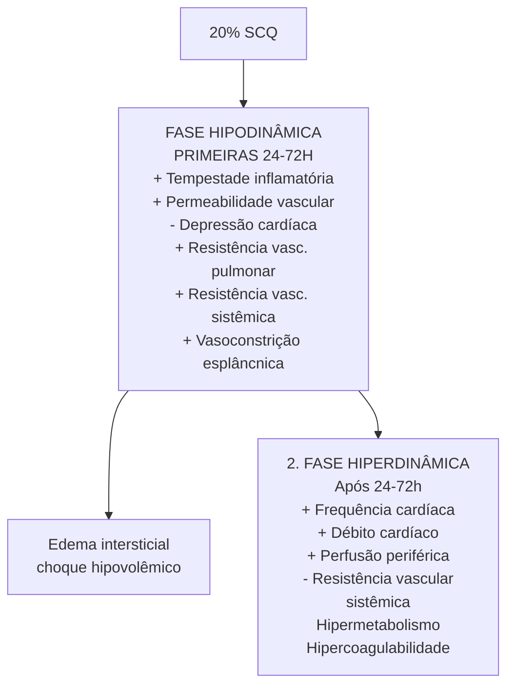
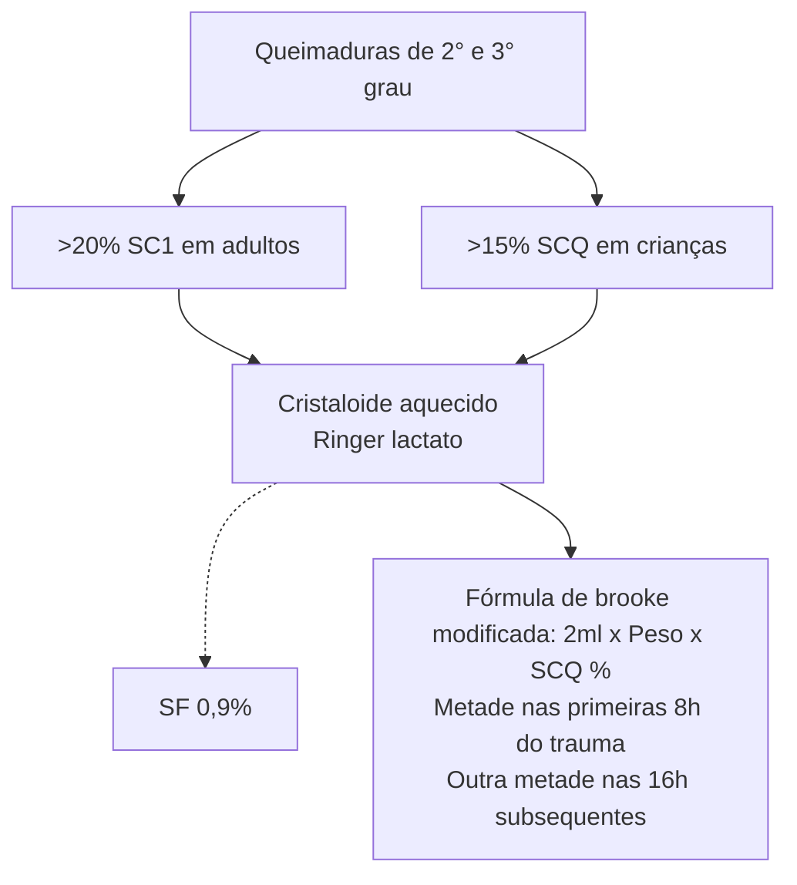

# CIRURGIA PLÁSTICA: QUEIMADOS - ATENDIMENTO INICIAL

| **A** | **AIRWAY**      |
| ----- | --------------- |
| **B** | **BREATHING**   |
| **C** | **CIRCULATION** |
| **D** | **DISABILITY**  |
| **E** | **EXPOSURE**    |

| **A - Intubação imediata?**- Eritema ou inchaço da orofaringe
- Rouquidão, tosse áspera
- Estridor, taquipneia ou dispneia
- Partículas carbonáceas na face
- Queimaduras faciais extensas e profundas
- 40-50% SCQ**C - Reposição volêmica**- Térmicas
- 2xSCQxPeso em 24h; 50% nas primeiras | 8h desde a queimadura- Descontar volume ofertado no pré-hospitalar
- Regra de Wallace ("dos 9")
- 2º e 3º Grau**E - Lesões**- 1º: hiperemia, epiderme
- 2º sup.: bolhas, derme papilar, discromias
- 2º prof.: bolhas, derme reticular, excisão e enxerto
- 3º: espessura total, carbonizado, desbridamento e enxerto |
| ---------------------------------------------------------------------------------------------------------------------------------------------------------------------------------------------------------------------------------------------------------------------------------------------- | --------------------------------------------------------------------------------------------------------------------------------------------------------------------------------------------------------------------------------------------------------------------------------------------------------------------- |

## 1. INTRODUÇÃO

### 1.1 PRINCIPAIS TIPOS DE QUEIMADURA TÉRMICA
- Chama;
- Sol;
- Sólidos;
- Líquidos aquecidos (escaldadura);
- Vapor.

### 1.2 FATORES DE RISCO
- Crianças < 5 anos;
- Adultos: Alcoolismo; Senilidade; Epilepsia, doenças psiquiátricas.
- Gravidade depende de: Agente causador; Área corporal de contato; Temperatura do agente; Tempo de contato; Características individuais.

- Em geral, acomete a epiderme;
- Características: dor; eritema;
- Tratamento: Analgesia; Hidratação; Melhora em 48-72 horas; Regeneração em 7 dias.

## 2. GRAUS DE QUEIMADURA

### 2.1 PRIMEIRO GRAU

**Figura 1** Queimadura de primeiro grau.

### 2.2 SEGUNDO GRAU

**Figura 2** Queimadura de segundo grau.

- Acomete a epiderme e derme: Superficial – derme papilar (não há presença de muitos anexos); Profunda – derme reticular.
- Características: Dor, eritema; Presença de bolhas; Leito rosado ou rosa pálido; De uma maneira geral, a ferida de cor rosa claro fala mais a favor de um acometimento superficial. Pode acometer anexos – dependendo da gravidade.

ATENÇÃO!!! Desbridar ou não desbridar as flictenas? Para o ATLS: NÃO!! Entretanto, quando esse paciente chega em um serviço de queimados, o cirurgião plástico vai realizar esse desbridamento.

• Tratamento: Analgesia; Hidratação; Curativo; Queimaduras predominantemente superficiais: conduta tende a ser mais conservadora com manejo clínico. Se, predominantemente, 2º grau profundo: internar paciente para avaliar conduta potencialmente cirúrgica.

## 2.3 TERCEIRO GRAU

**Figura 3** Queimadura de terceiro grau.

• Acomete toda epiderme e derme: Por vezes, há destruição dos tecidos subcutâneos, músculos e ossos.
• Características clínicas: Indolor – as terminações nervosas também foram destruídas; Branco nacarado/ carbonizado; Firme, coriáceo; Evolui com formação de cicatriz; Adjacências com queimadura de segundo e primeiro grau.
• Tratamento: Cirúrgico; Tempo de cicatrização maior que 3 - 4 semanas demonstra correlação com o aumento do risco de infecção.

## 2.4 ZONAS DE JACKSON

**Figura 4** Zonas de jackson.

• Coagulação (necrose): Destruição celular total.
• Estase (isquemia): " a queimadura aprofunda": Células viáveis, com risco de evoluir para morte celular.
• Hiperemia (inflamação): Vasodilatação compensatória, dor, edema; Todas as células viáveis.

## 2.5 GRANDE QUEIMADO

**Figura 5** Grande queimado. Observe a extensa área de superfície queimada.

• Considera-se um grande queimado um paciente com queimadura de 2° ou 3° grau que possuem: > 15% SCQ, em crianças; > 20% Superfície Corpórea Queimada (SCQ) em adultos; Cristalóide aquecido (Ringer lactato) ou SF 0,9%; Conduta: Fórmula de Parkland: 4mL x Peso x % SCQ; Metade nas primeiras 8h do trauma; Outra metade nas 16 horas subsequentes.
• Resposta sistêmica – SIRS.

**Figura 6** Fluxograma da evolução do grande queimado.

## 3. AVALIAÇÃO INICIAL E SECUNDÁRIA

• Protocolo ABCDE;
• História AMPLA;
• Exames complementares;
• Sondagem nasogástrica/nasoenteral;
• Analgesia e sedação;
• Imunização anti-tetânica.

## 4. CÁLCULO DA SUPERFÍCIE CORPÓREA QUEIMADA (SCQ)

### 4.1 CONSIDERAR APENAS ÁREAS ACOMETIDAS POR 2° E 3° GRAU;

Regra dos 9 (Wallace): Na criança – cabeça é proporcionalmente maior; Palma das mãos com os dedos são +1%.

CIRURGIA PLÁSTICA: QUEIMADOS - ATENDIMENTO INICIAL                                                                  3

## Adulto

[Anatomical diagrams showing body surface area percentages: head 4.5%, each arm 4.5%, anterior torso 18%, posterior torso 18%, genital area 1%, each leg section 9%]

**Figura 7** Regra dos 9.

[Hand diagram with palm highlighted]

**Figura 8** 1% SCQ" nessa parte grifada da imagem

[Pediatric body diagrams showing percentages: head 9%, each arm 4.5%, anterior torso 13%, posterior torso 18%, each buttock 2.5%, each leg section 7%]

**Figura 9** Como calcular a superfície corporal queimada em crianças.

• A melhor forma é com o diagrama de Lund & Browder: Cada região do corpo tem uma porcentagem pré-determinada; Varia de acordo com a idade.

**Tabela 1** Correspondência entre idade e superfície corporal dos segmentos cefálico (A), coxa (B) e perna (C).

| (Idade)anos | Área
A | Área
B | Área
C |
| ----------- | ---------- | ---------- | ---------- |
| 0           | 9 ½        | 2 ¾        | 2 ½        |
| 1           | 8 ½        | 3 ¼        | 2 ½        |
| 5           | 8 ½        | 4          | 2 ¾        |
| 10          | 5 ½        | 4 ½        | 3          |
| 15          | 4 ½        | 4 ½        | 3 ¼        |
| Adulto      | 3 ½        | 4 ¾        | 3 ½        |

## 5. INDICAÇÕES DE INTERNAÇÃO

### 5.1 CRITÉRIOS

• Queimaduras de 2° e 3° graus: Com mais de 20% da SCQ em qualquer idade; Com mais de 10% da SCQ em pacientes < 10 ou > 50 anos; Em face, períneo, mãos, pés e grandes articulações.
• Queimaduras de 3° grau em qualquer extensão (algumas fontes citam 5%);
• Suspeita de lesão inalatória;
• Queimaduras circunferenciais;
• Queimaduras elétricas, químicas, associadas a politraumatismo;
• Queimaduras em pacientes com doenças crônicas, com questões sociais.

## 6. AVALIAÇÃO SECUNDÁRIA

• História AMPLA;
• Exames complementares;
• Sondagem nasogástrica/nasoenteral;
• Analgesia e sedação;
• Imunização anti-tetânica;
  • 3 doses <1 ano;
  • Reforço com 15 meses e 4 anos de idade – a partir daí a cada 10 anos;
  • Dose de reforço, se dose de reforço há mais de 5 anos.

## 7. REPOSIÇÃO VOLÊMICA I

**Figura 10** Fluxograma sobre a reposição volêmica inicial no grande queimado.

• A fórmula nos traz nada mais do que uma estimativa do volume a ser administrado, para orientar nossa reposição devemos nos basear em alguns parâmetros:
  • Diurese – principal parâmetro. Objetivo de: 0,5 mL/kg/h no adulto; 1 mL/kg/h na criança.
  • Frequência cardíaca;
  • PAi;Lactato.
• Situações especiais
  • Coloide: Mostrou-se aumento de mortalidade com o seu uso, além do alto preço; Reservado em situações específicas, e, em geral, após 24 horas – por exemplo, após as 24h nos grandes queimados.
  • Crianças: Na criança, calcular a reposição volêmica através da fórmula: 3 mL RL x Peso x SCQ; Se a criança apresentar menos de 30kg, deve-se acrescentar glicose na solução a fim de evitar quadros de hipoglicemia.

## 8. TRATAMENTO

### 8.1 CONDUTA

• Escarotomia – incisão nas escaras para melhorar a perfusão e expansão tecidual. Identificar se o paciente é candidato ainda no ABCDE

**Figura 11** Escarotomia em grande queimado.

• Desbridamento e assepsia: Dá-se para manter a pele melhor higienizada, com retirada de possíveis corpos estranhos; O curativo é estéril.

**Figura 12** Primeiros cuidados de desbridamento e assepsia.

• Curativos estéreis: O nitrato de cério pode ser associado a Sulfadiazina de prata. Porque o tecido queimado tem efeito imunossupressor e forma complexo lipídico-proteico (LPC); O nitrato de cério é um imunomodulador (neutraliza LPC); Aplicação precoce – 24 - 48h.
• Curativo estéril (revestidos por prata): Dura 7 dias / ótimo resultado / Caríssimo.

**Tabela 2** Vantagens e desvantagens do uso de sulfadiazina de prada 1% e de acetato de mafenide no paciente queimado.

|                          | VANTAGENS                                               | DESVANTAGENS                                                                                                  |
| ------------------------ | ------------------------------------------------------- | ------------------------------------------------------------------------------------------------------------- |
| Sulfadiazina de prata 1% | Indolor
Amplo espectro
Penetração intermediária | Leucopenia
Lesão de córnea
Retarda a cicatrização
Despigmentação                                  |
| Acetato de Mafenide      | Amplo espectro
Alta penetração                      | Doloroso
Acidose
Metabólica
(inibe anidrase carbônica)
Hipocalemia
Indisponível no Brasil |

### 8.2 NÃO CIRÚRGICO

• 1° grau;
• 2° grau superficial;
• Queimaduras em crianças - alta capacidade de regeneração da pele.

### 8.3 CIRÚRGICO

• Quando há baixa probabilidade de cicatrização em 3 semanas, ou os resultados funcionais e estéticos sem cirurgia seriam ruins;
• 2° grau profunda;
• 3° grau.

CIRURGIA PLÁSTICA: QUEIMADOS - ATENDIMENTO INICIAL                                                              5

## 8.4 TÉCNICAS CIRÚRGICAS UTILIZADAS

- Excisão simples – queimaduras profundas e pequenas;
- Excisão fascial.
  - Vantagens: Menos sangramento; Melhor controle de infecções invasivas e graves.
  - Desvantagens: Linfedema; Maior deformidade corporal;

**Excisão tangencial seguida de enxertia de pele parcial – Padrão-Ouro.**

- Maior preservação tecidual;
- Maior sangramento (100 mL/1% SCQ desbridada);
- Limitar até 20% SCQ por cirurgia.
- Deve ser feito de maneira precoce – até 5° dia;
- Uma vez desbridado, faz-se o enxerto de pele (parcial):
- Lâmina ou Malha;
  - Grandes queimados;
  - Maior área de cobertura.
  - Priorizar áreas funcionais e estéticas: Face; Mãos, pés; Articulações.
  - Retalho; Amputação;
- Novas tecnologias – substitutos de pele: Banco de pele (aloenxerto); Matriz dérmica acelular; Cultura de queratinócitos; Membrana amniótica; Xenoenxerto (pele porcina, tilápia).

## 9. LESÃO DE VIAS AÉREAS

### 9.1 LESÃO DAS VIAS AÉREAS

- Cursa com aumento da mortalidade;
- Diagnóstico é clínico: tosse, rouquidão, estridor, odinofagia. Ainda, observar: Queimadura intraoral, de vibrissas e cílios; Impregnação carbonácea na face e no escarro; Edema facial.
- Apresentação aguda ou subaguda (> 24h);
- Tratamento: O2 – 100%; Não é necessário intubar todo mundo; Casos leves – O2 inalatório 100% em máscara; Casos moderados a graves; (1) Avaliar via aérea definitiva se: (a) Franca insuficiência respiratória; (b) Piora progressiva do padrão respiratório; (c) Queimaduras extensas e profundas em face; (d) Rebaixamento do nível de consciência; (e) Queimaduras >40-50% SCQ.
- Avaliação endoscópica. Avaliar: Eritema; Edema; Apagamento de anéis traqueais; Descamação da mucosa; Exsudato fibrinoso; Partículas carbonáceas; Pneumonia.
- O tratamento é de suporte. Sem consenso na literatura: Corticoterapia; Irrigação brônquica com heparina; N-acetilcisteína endotraqueal.

### 9.2 INTOXICAÇÃO POR CO (MONÓXIDO DE CARBONO)

- Em geral, a intoxicação ocorre em ambientes fechados;
- Afinidade 24x > O2; meia-vida 4h;
- Diagnóstico. Gasometria arterial: CC. HbCO > 10%; PaO2 baixa, acidose metabólica; Nem todos os aparelhos são capazes de realizar a leitura adequada. Oximetria de pulso: Não diferencia a fonte da saturação. Usar a medida sanguínea de HbCO ou oxímetro de HbCO.

- Tratamento: FiO2 – 100%; Câmera hiperbárica; Reduz a meia-vida da carboxi-hemoglobina.

**Tabela 3** Sintomas presentes na intoxicação por carboxi-hemoglobina.

| Níveis de carboxi-hemoglobina | Sintomas                                   |
| ----------------------------- | ------------------------------------------ |
| 0 – 10%                       | Mínimos (nível normal em fumantes pesados) |
| 10 – 20%                      | Náuseas, dor de cabeça;                    |
| 20 – 30%                      | Sonolência, letargia                       |
| 30 – 40%                      | Confusão, agitação                         |
| 40 – 50%                      | Coma, depressão respiratória               |
| > 50%                         | Morte                                      |

### 9.3 INTOXICAÇÃO POR CIANETO

- Alta suspeição e alta mortalidade: Lembrar em pacientes em ambientes fechados que pegaram fogo.
- Manifestações clínicas: Confusão mental; Depressão respiratória; Acidose metabólica e hipercalemia persistentes.
- Tratamento: O2 a 100% + hidroxicobalamina (vitamina B12).

# REFERÊNCIAS

**Figura 1** Queimadura de primeiro grau.

Acervo Pessoal Medcof.

**Figura 2** Queimadura de segundo grau.

Acervo Pessoal Medcof.

**Figura 3** Queimadura de terceiro grau.

Acervo Pessoal Medcof.

**Figura 4** Zonas de jackson.

Hettiaratchy, S., & Dziewulski, P. (2004). ABC of burns: pathophysiology and types of burns. BMJ (Clinical research ed.), 328(7453), 1427–1429. https://doi.org/10.1136/bmj.328.7453.1427

**Figura 5** Grande queimado. Observe a extensa área de superfície queimada.

Acervo Pessoal Medcof.

**Figura 8** 1% SCQ" nessa parte grifada da imagem

Acervo Pessoal Medcof.

**Figura 11** Escarotomia em grande queimado.

https://www.scielo.br/

**Figura 12** Primeiros cuidados de desbridamento e assepsia.

https://www.scielo.br/

Queimados

# CIRURGIA PLÁSTICA: QUEIMADOS - TRATAMENTO ESPECÍFICO

## Elétricas
- Lesões profundas e progressivas;
- Efeito Joule: aumento de temperatura;
- Lesões graves em pontos de entrada e saída;
- Mais graves do que aparentam pela SCQ;
- Sd. compartimental (fasciotomia);
- IRA → lesão muscular > mioglobinúria;
- Diurese 0,75-1mL/Kg/h + alcalinização;
- Utilizar Parkland (4xSCQxPeso);
- ECG + monitoramento por 24h.

## Químicas
- Lesões por álcalis são piores que por ácidos;
- Ácido: Necrose por coagulação, úlceras superficiais;

- Álcalis: Necrose por liquefação, mais profundas e dolorosas (cal, cimento e etc);
- Irrigação abundante com água;
- Nunca neutralizar (exotérmica).

## Sequelas
- Cicatrizes hipertróficas;
- Malha compressiva e hidratação;
- Bridas e sinéquias;
- Tratamento cirúrgico: reposicionamento de tecidos - zetaplastia, trata contratura;
- Enxertos e retalhos, quando há falta de tecido;
- Úlcera de Marjolin - CEC que se desenvolve em cicatrizes instáveis (longo período de latência).

## 1. QUEIMADURA ELÉTRICA

### 1.1 GRAVIDADE DETERMINADA POR:
- Voltagem: Alta voltagem > 1000V → lesões graves; Baixa voltagem < 1000V → lesões limitadas;
- Corrente alternada promove contrações tetânicas (direta não);
- Trajeto da corrente -> estimativa do ponto de entrada e saída;
- Duração de contato;
- Área corporal que teve contato com a corrente.

### 1.2 RESISTÊNCIA TECIDUAL
- Lei de Joule: quanto maior a resistência, maior a dissipação de calor;
- Osso > Pele > Músculo > vasos > Nervos: Queimadura de dentro pra fora, pois o osso libera calor de dentro pra fora;
- Ponto de entrada e saída → estimativa do trajeto.

### 1.3 DIFERENÇAS EM RELAÇÃO ÀS QUEIMADURAS TÉRMICAS
- Monitoração eletrocardiográfica;
- Alto risco de síndrome compartimental;
- Rabdomiólise;
- Reposição volêmica.

### 1.4 MONITORAÇÃO ELETROCARDIOGRÁFICA
- ECG → realizar para todos; principal causa de morte é cardíaca;
- Indicação de monitoração contínua (24-48h): Perda de consciência; Alterações no ECG; Arritmias ou ressuscitação cardiopulmonar;
- Sem indicação de monitoração contínua: Baixa voltagem; Pacientes estáveis; Ausência de alterações no ECG;
- Seriar marcadores de necrose miocárdica é controverso.

### 1.5 SÍNDROME COMPARTIMENTAL
- Fisiopatologia: edema -> maior pressão -> isquemia -> necrose;

- Fatores de risco: Alta voltagem > 1000V; Queimaduras circunferenciais profundas; Lesões por esmagamento; Fraturas associadas; Extremidades;
- Manifestações clínicas (5P´s): Pain – dor à movimentação passiva – sinal mais precoce; Parestesia; Poiquilotermia; Palidez; Perda do pulso – sinal mais tardio;
- Diagnóstico: Clínico (5P's); Membro firme, edemaciado, tenso, duro à palpação; Dosagem de CPK; Pressão compartimental > 30mmHg;
- Tratamento: Escarotomia; Fasciotomia: Centro cirúrgico – o paciente vai sentir dor, vai sangrar; Cobertura temporária; Revisão 24 – 72h após a abordagem inicial.

### 1.6 RABDOMIÓLISE
- Risco de lesão renal aguda por obstrução tubular por mioglobina → lesão renal aguda;
- Diagnóstico: Aumento de CPK; Hipercalemia; Hipocalcemia; Mioglobinúria;
- Tratamento: Hidratação venosa – ATLS 10ª edição - Meta de diurese: 1 – 1,5 mL/kg/h; Adulto 70 – 100 ml/h;

**Cristaloide aquecido Ringer lactato**
**Fórmula de Parkland: 4ml x Peso x SCQ (%)**
Metade nas primeiras 8h do trauma
Outra metade nas 16h subsequentes

- Outros: Alcalinização urinária; Diuréticos osmóticos (ex: manitol); Correção de distúrbios hidroeletrolíticos; Descompressão cirúrgica; Amputação;
- Padrão ouro → excisão tangencial + enxertia de pele parcial.

### 1.7 FLASHBURN
- Por vezes confundida com queimadura elétrica, no flashburn há a ausência de circulação de corrente elétrica pelo corpo. O mecanismo de lesão é duplo, por dissipação de calor e por contusão;
- Corrente fonte – objeto metálico;

• Tratamento → lesão ao tratamento da lesão térmica, na dúvida tratar como lesão elétrica.

Verdadeira lesão por corrente alta tensão - Flashburn - Efeito Flashburn de queimadura

**Figura 1** Efeito Flashburn de queimadura.

## 2. TRAUMA POR RAIO

• O Brasil é o 7º colocado mundialmente em traumas por raio, respondendo por cerca de 110 mortes/ano, o raio por si só tem milhões de volts;
• Apresentação clínica variada: Lesões cutâneas mínimas a queimaduras profundas; Queimaduras de espessura total nas pontas dos dedos dos pés; Lesão de Lichtenberg: patognomônica;
• Fatal em 10% dos casos, tratamento: ATLS; Ressuscitação cardiopulmonar (RCP) precoce; Reanimação volêmica.

## 3. QUEIMADURAS QUÍMICAS

• Queimaduras potencialmente graves, geralmente causadas por produtos caseiros e ocupacionais;
• Gravidade determinada por agente, duração do contato, local, extensão, características individuais.

### 3.1 LESÕES POR ÁLCALIS SÃO PIORES QUE POR ÁCIDOS

• Ácido: Necrose por coagulação, úlceras superficiais;
• Álcalis: Necrose por liquefação, mais profundas e dolorosas (cal, cimento etc).

### 3.2 MECANISMOS DE LESÃO

• Redução → ligação a elétrons de proteínas;
• Oxidação → fornecedor de átomos;
• Corrosivo → desnaturação de proteínas;
• Envenenamento protoplásmico → quelação/inibição de eletrólitos;
• Vesicante → isquemia e necrose;
• Dessecante → desidratação e liberação de calor.

### 3.3 TRATAMENTO

• Proteção individual;
• Descontaminação;
• Irrigação abundante em água corrente: Não neutralizar (reação exotérmica gera mais liberação de calor);
• Antídotos;
• Diphoterine -> solução anfótera, polivalente e hipertônica, capaz de reduzir as lesões por substâncias químicas através de quelação: !!!! Guidelines não recomendam seu uso rotineiramente;
• Desbridamento cirúrgico se necessário.

### 3.4 PRINCIPAIS AGENTES

• Fenol – ácido carbólico – normalmente no uso de Peelings. Manifestações: Dermatite; **Arritmias; Lesão renal aguda**; Edema pulmonar. Tratamento: Polietilenoglicol (PEG); Bicarbonato de Sódio;
• Ácido clorídrico (muriático) / Ácido sulfúrico – mais comumente encontrados em produtos caseiros. Manifestações: Úlceras brancas/acinzentadas; Lesão inalatória e de mucosas; dor abdominal. Tratamento: Irrigação; Desbridamento e reconstrução, se necessário;
• Ácido fluorídrico: Corrosivo e envenenamento protoplasmático -> quelação do cálcio. Manifestações: Dor intensa; Arritmias; Insuficiência respiratória; Tetania. Laboratório: Hipo-Ca; Hipo-Mg; Hiper-K; Acidose metabólico. Tratamento: Gluconato de cálcio; Tópico e intra-arterial - Correção dos outros DHE; Bicarbonato de sódio; Hemodiálise;
• Ácido fosfórico: Produtos de limpeza, fertilizantes, aditivos, pesticidas, fogos de artifício e armas militares. Manifestações: Úlceras dolorosas e amareladas; Lesões oculares e respiratórias; Odor de alho. Tratamento: Irrigação; Retirada mecânica das partículas; Sulfato de cobre a 0,5%;
• Álcalis: tendem a ser mais profundas e dolorosas. Ex: NAOH (soda caústica), KOH, CaOH, LiH, BaH, NH4OH. Tratamento: irrigação;
• Cimento (CaO): mecanismo dessecante e álcali. Tratamento: irrigação;
• Soluções de hipoclorito (ex: água sanitária). Tratamento: irrigação;
• Hidrocarbonetos (ex: óleo cru, piche). Queimaduras após resfriamento – liquefação; Tratamento : resfriamento e remoção com substâncias oleosas.

# QUEIMADOS - SEQUELAS DE QUEIMADURA

## 1. SEQUELAS DAS QUEIMADURAS

- Depende da gravidade e local da lesão;
- Mais comum (+ de 50% dos casos) = cicatrizes hipertróficas:
  - Tratamento: Malhas compressivas; Hidratação.

### 1.1 CONTRATURA

- É a contração da pele com perda de função (note que a contração apenas faz parte do processo fisiológico);
- Disponibilidade de tecido: Ressecção + Fechamento Primário: Rearranjo tecidual; Plástica em Z (Zetaplastia). Objetivos: Alongar uma cicatriz; Quebrar uma linha reta; Mover tecidos de uma área à outra; Obliterar ou criar uma fenda.
- Se falta tecido: Enxertia; Expansão tecidual; Retalhos; Opção menos disponível: Uso de substitutos dérmicos, enxertia.

### 1.2 ÚLCERA DE MARJOLIN

- CEC invasivo indiferenciado;
- Aparece através de cicatrizes instáveis, com latência em média de 20-30 anos: Metástase linfonodal em 30% dos casos ao diagnóstico; Sobrevida em 5 anos <10%;
- Tratamento: Excisão cirúrgica com margens amplas; Linfonodo sentinela; *Esvaziamento linfonodal.

### 1.3 COMPLICAÇÕES ESPECÍFICAS DO TRAUMA ELÉTRICO

- Oftálmicas ( em 5-20% dos casos ): Catarata;
- Neuropsiquiátricas: Neuropatia periférica; Hiperatividade simpática; Perda de memória; Dor crônica; Ansiedade; Pesadelo; Insônia; Estresse pós-traumático.
