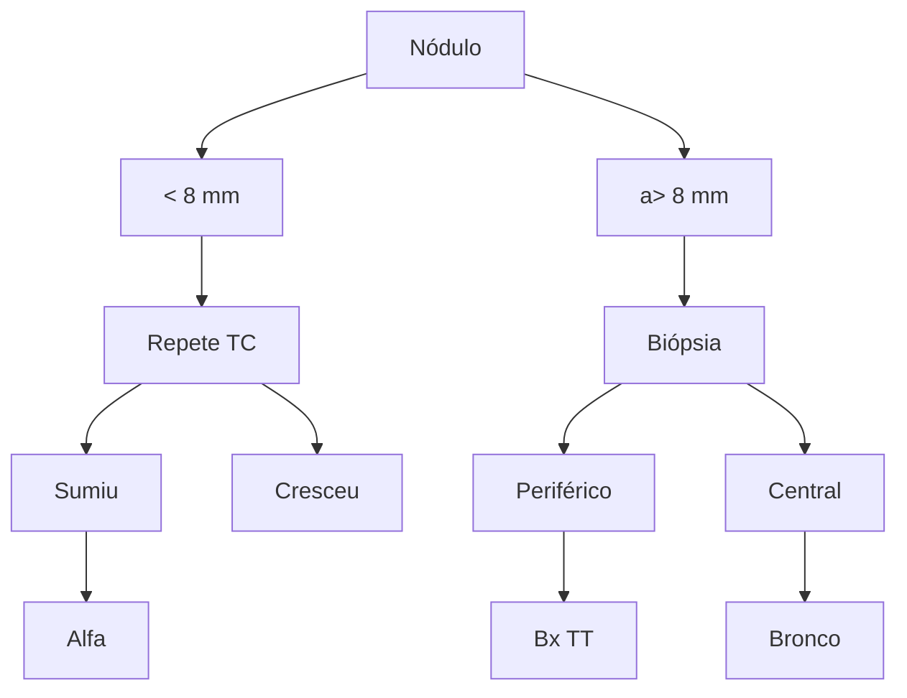

# CANCER DE PULMÃO: PARTE 1

| Fatores de Risco do Paciente
- Tabagismo
- Idade
- Sexo feminino
- DPOC
- História familiar
- Etnia asiática	Paciente com nódulo pulmonar na TC	Fatores de Risco do Nódulo
- Tamanho (>8 mm)
- Crescimento (com exames prévios)
- Bordas (espiculada)
- Componete de vidro fosco
- Calcicação (padrão excêntrico) |   |   |
| ------------------------------------------------------------------------------------------------------------------------------------------------------------------------------------------------------------------------------------------------------------------------------------------------------------------------------------------------------------- | - | - |

</td>
</tr>
<tr>
<td colspan="3" style="text-align: center;">

Tipo

</td>
</tr>
<tr>
<td colspan="2" style="text-align: center;">

Sólido

</td>
<td style="text-align: center;">

Sub sólido
(com vidro
fosco)

</td>
</tr>
<tr>
<td style="text-align: center;">

<6 mm

</td>
<td style="text-align: center;">

6 ~ 8mm

</td>
<td style="text-align: center;">

> 8mm

</td>
<td style="text-align: center;">

< 6mm e
único

</td>
<td style="text-align: center;">

> 6mm ou
múltiplos

</td>
</tr>
<tr>
<td style="text-align: center;">

Risco

</td>
<td></td>
<td style="text-align: center;">

Risco

</td>
<td style="text-align: center; background-color: #00a0c6; color: white;">

Alta

</td>
<td></td>
</tr>
<tr>
<td style="text-align: center; background-color: #00a0c6; color: white;">

Baixo risco

</td>
<td style="text-align: center; background-color: #00a0c6; color: white;">

Alto risco

</td>
<td></td>
<td style="text-align: center; background-color: #00a0c6; color: white;">

Baixo risco

</td>
<td style="text-align: center; background-color: #00a0c6; color: white;">

Alto risco

</td>
</tr>
<tr>
<td style="text-align: center; background-color: #00a0c6; color: white;">

Alta

</td>
<td style="text-align: center; background-color: #00a0c6; color: white;">

Repete TC
em 1 ano

</td>
<td style="text-align: center; background-color: #00a0c6; color: white;">

Repete TC
em 6
meses

</td>
<td style="text-align: center; background-color: #00a0c6; color: white;">

Repete TC
em 3
meses

</td>
<td style="text-align: center; background-color: #00a0c6; color: white;">

Repetir TC
em 6
meses

</td>
</tr>
<tr>
<td colspan="5" style="text-align: center;">

Cresceu?
 →
Indicar
biópsia
 ←
Cresceu ou
solidificou?

</td>
</tr>
<tr>
<td colspan="2" style="text-align: center;">

Biópsia percutânea

- Nódulos periféricos

- Tamanho > 1 cm

- Guiado por TC
</td>
<td style="text-align: center;">

Método

</td>
<td colspan="2" style="text-align: center;">

Biópsia
Transbrônquica

- Nódulos centrais

- Nódulos
endobrônquicos

- Tamanho > 2 cm
</td>
</tr>
</table>

## 1. NÓDULO PULMONAR

• Conceito: Lesão pulmonar (no parênquima) arredondada medindo até 3 cm no seu maior eixo:
  • Se maior que 3 cm = **massa** pulmonar;

• Na imagem de TC de tórax abaixo, à esquerda, podemos ver a presença de nódulos pulmonares na língula, e à esquerda uma massa pulmonar considerável.

www.radiopaedia.org
À esquerda: nódulo. À direita: massa pulmonar.

## 2. TIPOS

### 2.1 SÓLIDOS:

• Lesões totalmente radiopacas, que impedem a visualização das demais estruturas na janela do pulmão;
• Na imagem tomográfica conseguimos ver um nódulo sólido com opacidade parenquimatosa ao redor dela;
• Esse tipo de lesão apresenta um elevado risco para vir a se tornar um câncer de pulmão.

### 2.2 SUB-SÓLIDOS:

• Lesões que possuem algum componente em vidro fosco:
  • Opacidade parenquimatosa que permite a visualização dos vasos e brônquios.
• Quando temos uma lesão como essa, no lobo inferior do pulmão esquerdo. É possível ver dentro da estrutura nodular a presença de vasos;
• Esse é o conceito do vidro fosco → não destrói o parênquima do pulmão;
• Característico de lesão não invasiva, no estágio inicial da doença.

Vidro fosco puro. Fonte: www.radiopaedia.org

### 2.3 SEMI SÓLIDOS:

• Mistura de sólidos com sub-sólidos;
• O adenocarcinoma inicia-se como aparência de lesão em vidro fosco, que vai adquirindo componente sólido com o avançar da doença.

Lesão semi sólida: parte sólida rodeada de opacidade parenquimatosa em vidro fosco. Elevado risco para câncer. www.radiopaedia.org

CÂNCER DE PULMÃO - CONCEITOS INICIAIS                                                         3

## 3. RISCO DE MALIGNIDADE

• Para caracterizar um nódulo com risco de malignidade é necessário avaliar:

### 3.1 Características do paciente:

• **História de tabagismo (ativo ou passivo);**
• **História familiar** (síndromes genéticas);
• **Idade (> 55 – 60 anos);**
• Sexo feminino (mesmo não tabagistas);
• **Etnia asiática** (principalmente mulheres);
• Enfisema pulmonar.

### 3.2 Características da lesão:

• **Tamanho do nódulo (lembre que pra ser nódulo, necessário ser <3cm) – especialmente válido para pacientes de alto risco:**
  • **Quanto maior, maior risco de malignidade:**
    • < 4mm – 0% (geralmente tido como nódulo indeterminado);
    • 4-7mm – 1%;
    • 8-20mm – 15%;
    • 8-20mm – 15%;
    • >20mm – 75%.

### 3.3 Padrão de calcificação:

• A presença de calcificação em si sugere benignidade. Os padrões típicos de benignidade são: Difuso, central, laminar e pipoca.

Difuso (totalmente calcificado), central, laminar e pipoca, respectivamente.

• Qualquer outro padrão de calcificação, que não se enquadre nos 4 (ex.: excêntrica), deve-se elevar a suspeita de malignidade.
• **Importante: o nódulo totalmente calcificado em pacientes com antecedente de osteossarcoma é sinal de malignidade!**

### 3.4 Padrão de crescimento:

• Se cresceu, deve ser câncer! Taxa de duplicação típica: 183 – 365 dias;
• Mas lesões que crescem muito rapidamente tem chance maior de serem infecciosas;
• Sempre questionar ao paciente se ele tem alguma outra TC anterior a consulta para mostrar, pois a comparação com exames prévios é uma das mais importantes ferramentas diagnósticas.

### 3.5 Localização:

• A malignidade, geralmente, está atrelada aos lobos superiores;
• Benignidade, por sua vez associada a lobos inferiores e subpleurais.
• Exceção: as metástases são mais comuns nos lobos inferiores, pois são mais vascularizados.

www.radiopaedia.org

## 3.6 Borda:

• O câncer tem a capacidade de infiltrar os tecidos subjacentes, levando a formação de imagens típicas;
• Imagem Espiculada (coroa radiada) na TC;
• Retração pleural (o tumor faz uma espécie de pinçamento da pleura em direção a ele).

Tumores espiculados.
www.radiopaedia.org

## 3.7 Componente de vidro fosco:

• Nódulos com algum componente em vidro fosco tem uma possibilidade maior de malignidade:
  • Totalmente sólidos – 7%;
  • Vidro fosco puro – 18%;
  • Parte sólida – 63%.

# 4. CONDUTA FRENTE AO ACHADO INCIDENTAL DE NÓDULO PULMONAR

## 4.1 SÓLIDO:

• <6mm:
  • Alto risco (idoso, tabagista): repete TC em 1 ano;
  • Baixo risco: alta do acompanhamento.
• 6-8mm:
  • Repete TC em 6 meses.
• >8mm:
  • Biópsia;
  • *se baixo risco, pode repetir a TC em 3 meses!

## 4.2 SUB-SÓLIDO:

• <6mm:
  • Alta, se lesão única;
  • Se múltiplas lesões repetir TC em 6 meses.
• 6mm ou mais:
  • Repetir TC em 6 meses.
• Se o nódulo cresceu ou se solidificou = BIÓPSIA.

# 5. BIÓPSIA

• Existem 3 métodos → basear escolha em: TAMANHO e LOCALIZAÇÃO:

## 5.1 Broncoscopia:

• Nódulos próximos aos brônquios de grande calibre:
  • Lesões endobrônquicas;
  • Lesões centrais;
  • Tumores > 2mm.
• Sensibilidade de 80%.

Fonte: videoaula.

CÂNCER DE PULMÃO - CONCEITOS INICIAIS                                                                  5

## 5.2 Percutânea (biópsia transtorácica):

• Lesões periféricas;
• Pode ser guiada por imagem, inclusive;
• Tumores de 1cm ou mais;
• Pode-se tirar mais material → sensibilidade de 95%;
• Principal complicação: Pneumotórax (15%):
  • 6% é necessária drenagem torácica. Pode ser resolvido por aspiração do ar pelo radiologista durante o procedimento;
  • Maior risco em pacientes com enfisema, e lesões próximas a fissuras → considerar broncoscopia.

## 5.3 Cirúrgica.

• A biópsia cirúrgica é sempre a última opção, mas quando necessária, realizar por videotoracoscopia (VATS).

## 5.4 Quando operar sem biópsia?

• **Fatores que favorecem:**
  • Lesões altamente suspeitas com estadiamento negativo;
  • Ressecções menores;
  • Pacientes de baixo risco cirúrgico.
• **Fatores que desfavorecem:**
  • Dúvida diagnóstica;
  • Lobectomia;
  • Alto risco cirúrgico.

Pneumotórax pós punção em biópsia de nódulo pulmonar guiada por tomografia computadorizada. Fonte: Acervo.

## 6. CONSOLIDANDO

• Características do nódulo + paciente;
• Operar direto: Nódulo muito suspeito (vidro fosco -> sólido) em paciente de baixo risco para complicações.

Bx TT: Biópsia transtorácica. Bronco: broncoscopia.

TOR

# CÂNCER DE PULMÃO - MANEJO INICIAL

**Câncer de pulmão é dividido entre:**
* Pequenas Células:
  * Síndrome da Veia Cava Superior;
  * Altamente agressivo;
  * Linfonodomegalia;
  * Alta carga tabágica.
* Não Pequenas Células:
  * Adenocarcinoma → Mais comum e relação com mutações genéticas;
  * CEC → 2° mais comum. Alta carga tabágica;
  * Carcinoide: Endobrônquico (Típico e Atípico).

## 1. OBJETIVOS
* Epidemiologia do câncer de pulmão;
* Etiologia e fisiopatologia;
* Prevenção e diagnóstico precoce;
* Tratamento e promoção de qualidade de vida e sobrevida, se possível.

## 2. CÂNCER DE PULMÃO
* Neoplasia de maior incidência na população geral (excluindo tumores de pele) e é a que mais mata no mundo;
* Segundo dados de 2018, as mortes por câncer de pulmão ainda é maior que a soma das mortes pelos próximos 4 cânceres (cólon, fígado, estômago e mama) que mais matam depois do de pulmão;

* O estágio de diagnóstico dos pacientes é muitas vezes tardio → casos de alta gravidade, inclusive com metástase à distância (confira o gráfico abaixo):
  * Não há política de rastreamento para população geral;
  * A sobrevida dos pacientes é inversa ao estágio (estádio) ao diagnóstico (confira o gráfico abaixo).

| Estágio ao diagnóstico           | Localizada | Distância | Todos estágios |
| -------------------------------- | ---------- | --------- | -------------- |
| Pulmão e brônquios (Porcentagem) | 15-17-13   | 22-22-22  | 57-57-51       |

| Sobrevida                        | Localizada | Distância | Regional | Todos estágios |
| -------------------------------- | ---------- | --------- | -------- | -------------- |
| Pulmão e brônquios (Porcentagem) | 55-55-52   | 30-30-22  | 5-5-5    | 19-19-15       |

### 2.1 Tipos de neoplasia pulmonar:

* Tumores epiteliais (maioria representada pelos 4 primeiros da lista):
  * **Adenocarcinoma;**
  * **Carcinoma de células escamosas;**
  * **Tumores neuroendócrinos;**
  * **Carcinoma de grandes células;**
  * Carcinoma adenoescamoso;

* Carcinoma sarcomatoide;
* Outros;
* Tumor do tipo glândula salivar;
* Papilomas;
* Adenomas.
* Tumores mesenquimais;
* Tumores linfo-histiocitários;
* Tumores de origem ectópica.

TOR

![Anatomical diagram showing pulmonary anatomy with labeled parts in Portuguese]

**Compartimento central** (Central compartment) showing:
- Brônquio primário (Primary bronchus)
- Brônquio secundário (Secondary bronchus)
- Brônquio terciário (Tertiary bronchus)
- Bronquíolo (Bronchiole)
- Bronquíolo terminal (Terminal bronchiole)
- Alvéolo (Alveolus)

**Brônquio grande** (Large bronchus) showing cellular detail:
- Célula ciliada (Ciliated cell)
- Células mucosas (Mucous cells)
- Célula neuro-endócrina (Neuroendocrine cell)
- Célula basal (Basal cell)
- Membrana basal (Basal membrane)

**Compartimento periférico** (Peripheral compartment) showing:
- Bronquíolo respiratório (Respiratory bronchiole)
- Alvéolos (Alveoli)
- Ducto Alveolar (Alveolar duct)
- Bronquíolo respiratório (Respiratory bronchiole)

**Bronquíolo respiratório** (Respiratory bronchiole) detailed view showing:
- Célula ciliada (Ciliated cell)
- Célula clara (Clear cell)
- Membrana basal (Basal membrane)
- Interstício (Interstitium)
- Tipo I Pneumócito (Type I Pneumocyte)
- Tipo II Pneumócito (Type II Pneumocyte)
- Alvéolos (Alveoli)

Diversidade histológica da anatomia pulmonar.

## 2.2 Subdivisão

• Os principais tipos de neoplasias pulmonares são subdivididos entre:
• Carcinoma pulmonar não pequenas células (CPNPC): adenocarcinoma de pulmão + carcinoma de células escamosas + tumor carcinoide;
• Carcinoma pulmonar de pequenas células (CPPC): muito mais agressivo. Trata-se de um tipo de tumor neuroendócrino;
• 15% dos tipos de câncer de pulmão são CPPC, e 85% são CPNPC.

## 2.2 Especificidades:

• **Adenocarcinoma:**
  • Mais prevalente;
  • Relação com não tabagistas, porém o principal fator de risco ainda é o tabagismo;
  • Maior relação com Orientais e mulheres jovens;
  • Mutações: EGFR e ALK o favorecem.
• **Carcinoma escamocelular:**
  • 2° mais prevalente;
  • Mesmo perfil do paciente que tem CEC de cabeça e pescoço;
  • Alta carga tabágica;
  • Cigarro de palha;
  • Pior prognóstico.

## 3. TUMOR NEUROENDÓCRINO

• Em ordem de agressividade, tem-se do menos agressivo para o mais agressivo: carcinoide típico → carcinoide atípico → pequenas células.

### Neoplasia neuroendócrina

![Warning triangle symbol]

**Grau de agressividade** (Degree of aggressiveness)

[Diagram showing increasing gradient from left to right with three categories:]

Carcinoide Típico | Carcinoide Atípico | Pequenas Células

TOR

CÂNCER DE PULMÃO - MANEJO INICIAL'

## 3.1 CÂNCER DE PULMÃO DE PEQUENAS CÉLULAS:

• Pacientes grandes tabagistas;
• Tumor agressivo de alta taxa de metástase mediastinal (conglomerados linfonodais);
• Comum síndrome da veia cava superior: disfunção na drenagem venosa, causando edema, pletora facial, circulação colateral venosa no tórax;
• Tratamento cirúrgico é raro.

Paciente com Síndrome da veia cava superior.
https://www.msdmanuals.com/pt-pt/profissional/multimedia/image/superior-vena-cava-syndrome

## 3.2 TUMOR CARCINOIDE:

• Pacientes jovens com sintomas infecciosos;
• Atelectasia e lesão endobrônquica.
• **Diferenciação histopatológico:**
  • **Típico:** menos invasivo, indolente (cresce invadindo a via aérea, a obstruindo), sem necrose e menos de 2 mitoses;
  • **Atípico:** mais agressivo (mais nodular), com necrose e maior taxa de mitose.
• O que diferencia um do outro é o exame histopatológico;
• Quase sempre possui proposta de tratamento cirúrgico e em geral responde mal a quimio e radioterapia.

Acervo pessoal - Medcof - Dr Eserval
Lesão tumoral endobrônquica.

Lesão tumoral ocluindo o brônquio principal esquerdo.
www.radiopaedia.org

## 4. ADENOCARCINOMA

### 4.1 Processo fisiopatológico:

TOR

• A agressão contínua, que na grande maioria das vezes provém do cigarro, acaba gerando alterações moleculares na estrutura celular;
• A primeira lesão visualizada, ao iniciar a proliferação epitelial, é a em vidro fosco;
• Quando essa lesão se mantém nas paredes do alvéolo, é chamado de adenocarcinoma in situ (lesão pré-maligna/pré-invasiva);
• Quando a lesão primária começa a invadir o tecido pulmonar, temos a formação do carcinoma invasivo. Esse processo é lento, levando décadas para avançar de uma lesão para outra, adquirindo aspecto sólido à TC.

Lesão primária.
www.radiopaedia.org

Carcinoma invasivo.
www.radiopaedia.org

## 4.2 FATORES DE RISCO:

• Tabagismo (principal):
  • 80% das neoplasias primárias são associadas ao tabagismo;
  • Quem fuma tem 20x mais chances de morrer devido a câncer de pulmão que um indivíduo não fumante.
• Tabagismo passivo:
  • 20% dos óbitos por câncer de pulmão em pessoas que não fumam estão ligados ao tabagismo passivo;
  • Tem 2x mais chances de desenvolver câncer de pulmão que indivíduos que não tem esse fator de risco.
• História familiar (mutações genéticas);
• Radiação;
• Poluição de grandes cidades;
• Ocupação (mineradores, metais pesados).

### Trends in Tobacco Use and Lung Cancer Death Rates in the U.S.

| Year | Per capita cigarette consumption \[Among those aged 18+] | Male lung cancer death rate \[Sum of Male lung cancer death rate] |
| ---- | -------------------------------------------------------- | ----------------------------------------------------------------- |
| 1900 | 0K                                                       | 0                                                                 |
| 1910 | \~0K                                                     | 0                                                                 |
| 1920 | \~0.5K                                                   | 0                                                                 |
| 1930 | \~1.5K                                                   | \~5                                                               |
| 1940 | \~2K                                                     | \~10                                                              |
| 1950 | \~3.5K                                                   | \~20                                                              |
| 1960 | \~4K                                                     | \~40                                                              |
| 1970 | \~4K                                                     | \~55                                                              |
| 1980 | \~3.5K                                                   | \~75                                                              |
| 1990 | \~2.5K                                                   | \~80                                                              |
| 2000 | \~2K                                                     | \~70                                                              |
| 2010 | \~1.5K                                                   | \~60                                                              |

O gráfico demonstra a relação direta entre consumo per capita de cigarro e a mortalidade por câncer de pulmão.

TOR

CÂNCER DE PULMÃO - MANEJO INICIAL'

## 5. SINTOMAS

• Geralmente surgem em doenças avançadas:
  • Invasão de parede;
  • Invasão de via aérea;
  • Derrame pleural;
  • Invasão pericárdica;
  • Rouquidão (invasão do nervo laríngeo recorrente);
  • Caquexia, por aumento da demanda metabólica neoplásica.

Derrame pleural.
www.radiopaedia.org

Invasão de parede no estreito superior.
www.radiopaedia.org

### 5.1 Tumor de Pancoast:

• Acometimento do ápice pulmonar e estruturas adjacentes, que pode causar dor no membro superior, parestesia, além da Síndrome de claude bernard-horner → caracteriza-se pela tríade:
• Anidrose;
• Ptose palpebral;
• Miose.

Ptose palpebral.
https://www.msdmanuals.com/pt-pt/profissional/multimedia/image

Tumor de Pancoast.

## 6. RASTREAMENTO

• É extremamente necessário a implementação de políticas de rastreamento para pacientes com alto risco de câncer de pulmão;
• Estudo realizado nos EUA com 53 mil pacientes, entre 55-74 anos, com tabagistas e ex-tabagistas abstêmios (15 anos) com carga tabágica de 30 maços/ano:

• Esses pacientes ao fazerem TC de tórax de baixa dose para rastreamento de CA de pulmão, tiveram uma redução em 20% da mortalidade.
• Ainda não foi instituído no SUS devido aos altos custos gerados, mas certamente, aqui no brasil seria possível alcançar números melhores de redução da mortalidade que nos EUA.

## 7. CONSOLIDANDO O CONHECIMENTO

• Câncer de pulmão é dividido entre:
  • **Pequenas Células:**
    • Síndrome da Veia Cava Superior;
    • Altamente agressivo;
    • Linfonodomegalia;
    • Alta carga tabágica.

• **Não Pequenas Células.**
  • Adenocarcinoma → Mais comum e relação com mutações genéticas;
  • CEC → 2° mais comum. Alta carga tabágica;
  • Carcinóide: Endobrônquico (Típico e Atípico).

## 8. METÁSTASE PULMONAR

• Sítios mais frequentes: mama, cólon, cabeça e pescoço e sarcomas (tumores de partes moles).

### 8.1 Quando ressecar as metástases?

• Primário controlado (NECESSÁRIO);
• Todas as metástases podem ser ressecadas (NECESSÁRIO);
• Intervalo livre de doença maior que 2 anos (NÃO É OBRIGATÓRIO);
• Menos de 4 nódulos pulmonares (NÃO É OBRIGATÓRIO).

The images show multiple metastatic pulmonary lesions visible in both a chest X-ray (showing bilateral lung fields with multiple nodular opacities) and a CT scan (showing an axial view of the chest with multiple round lesions in both lungs).

Múltiplas lesões metastáticas pulmonares em ambas as imagens.
www.radiopaedia.org

# CÂNCER DE PULMÃO PARTE 3

| **Tratamento neoplasia de pulmão:**
• **Local:**
• Cirurgia: É o método mais consagrado;
• Radioterapia;
• Ablação.

• **Sistêmico:**
• Quimioterapia citotóxica;
• Terapia alvo: Depende da genética específica de cada tumor;
• Imunoterapia. | • **Estadiamento:**
• T – Importante saber;
• T1: até 3 cm
T2: até 5 cm
T3: até 7 cm
T4: mais de 7 cm
• N – Importante entender:
• N2 representa uma chance maior de doença sistêmica.
• M – Entender que representa doença sistêmica conhecida:
• O derrame pleural é igual à metástase. |
| ----------------------------------------------------------------------------------------------------------------------------------------------------------------------------------------------------------------------------------------------------------------------------------- | ----------------------------------------------------------------------------------------------------------------------------------------------------------------------------------------------------------------------------------------------------------------------------------------------------------------------------- |

## 1. CONSIDERAÇÕES INICIAIS

### 1.1 Conceitos iniciais sobre o tratamento:

• **Local:**
  • Cirurgia: É o método mais consagrado;
  • Radioterapia;
  • Ablação.

• **Sistêmico:**
  • Quimioterapia citotóxica;
  • Terapia alvo: Depende da genética específica de cada tumor;
  • Imunoterapia.

## 2. ESTADIAMENTO

• É necessário conhecer as características tumorais, bem como as relações com os tecidos adjacentes. Define o prognóstico do paciente.

### 2.1 Disseminação:

• Linfática – via mais importante (pela pleura e linfonodos);
• Atenção para a avaliação dos linfonodos hilares e mediastinais;
• Hematogênica.

### 2.2 Órgãos mais acometidos – metástase por via hematogênica:

• Mediastino;
• Osso;
• Adrenal;
• Fígado;
• Crânio;
• Pulmão.

• É feito através da análise das cadeias mediastinais:
  • O nível da cadeia acometida identifica o "N" no estadiamento TNM:
    • Linfonodos 11 – 14: N1 – intrapulmonares;
    • Linfonodos 10: N1 – hilar;
    • Linfonodos 5 – 6: pré-vasculares e janela aorto-pulmonar;
    • Atenção! É uma cadeia que não está próxima à traqueia;
    • Ainda, vale salientar que a traqueia é o limite cirúrgico para a realização da mediastinoscopia e para o EBUS;
    • O acesso apenas é feito por videotoracoscopia à esquerda ou por mediastinotomia à Chamberlain.

CÂNCER DE PULMÃO - TRATAMENTO<page_header>
CÂNCER DE PULMÃO - TRATAMENTO                                                                                                                    2

Cadeias de drenagem linfática do pulmão. Atenção às cadeias mediastinais 2, 4 e 7 (seu acometimento demonstra chance de 20-30% de haver células tumorais na circulação sanguínea e, consequentemente, doença metastática → indicação de tratamento sistêmico). Fonte: Videoaula.

| Não invasivo     | Invasivo          |
| ---------------- | ----------------- |
| TC de tórax      | EBUS-TBNA         |
| PET-CT           | Mediastinoscopia  |
| TC/RNM de crânio | Videotoracoscopia |

## 2.3 Não invasivo: iniciar com esse protocolo.

• **TC de tórax;**
  • Na maioria das vezes, já foi realizada;
  • Visualiza linfonodos > 1 cm, em seu maior eixo;
  • Sensibilidade = 57%, especificidade = 82%.

• **PET-CT com FDG;**
  • SUV > 2,5;
  • Sensibilidade = 84%,
  • acervo pessoal.
  • especificidade = 89%.

acervo pessoal.

• **TC/RNM de crânio.**
  • Deve-se complementar com RNM de crânio na presença de tumores > 2 cm.

## 2.4 Invasivo:

• **EBUS-TBNA:**
  • Confirma alterações visualizadas no PET ou na presença de suspeitas maiores (> 4 cm);
  • É minimamente invasivo (menos invasivo que a mediastinoscopia);
  • Requer sedação;
  • Possibilita avaliação citológica;
  • Contudo, deve ser realizado por um patologista experiente;
  • Sensibilidade = 88%, especificidade = 100%.

• **Videotoracoscopia.**

acervo pessoal

• **Mediastinoscopia;**
  • É minimamente invasivo;
  • Requer anestesia geral e internação;
  • Sensibilidade e especificidade comparáveis ao EBUS se realizado por profissional experiente.
  • Possibilita avaliação tecidual: é o exame padrão-ouro.

| Estádio          | T             | N          | M        |
| ---------------- | ------------- | ---------- | -------- |
| Carcinoma Oculto | Tx            | N0         | M0       |
| 0                | Tis           | N0         | M0       |
| IA1              | T1a(mi), T1a  | N0         | M0       |
| IA2              | T1b           | N0         | M0       |
| IA3              | T1c           | N0         | M0       |
| IB               | T2a           | N0         | M0       |
| IID              | T2b           | N0         | M0       |
| IIB              | T1a, T1b, T1c | N1         | M0       |
|                  | T2a           | N1         | M0       |
|                  | T2b           | N1         | M0       |
|                  | T3            | N0         | M0       |
| IIIA             | T1a, T1b, T1c | N2         | M0       |
|                  | T2a, T2b      | N2         | M0       |
|                  | T3            | N1         | M0       |
|                  | T4            | N0, N1     | M0       |
| IIIB             | T1a, T1b, T1c | N2         | M0       |
|                  | T2a, T2b      | N2         | M0       |
|                  | T3            | N2         | M0       |
|                  | T4            | N2         | M0       |
| IIIC             | T3            | N3         | M0       |
|                  | T4            | N3         | M0       |
| IVA              | Qualquer T    | Qualquer N | M1a, M1b |
| IVB              | Qualquer T    | Qualquer N | M1c      |

## 2.5 O que é necessário memorizar?

• T – importante saber;
• N:
  • Importante entender;
  • Conseguir distinguir que o N2 representa uma chance maior de doença sistêmica.
• M:
  • Entender que representa doença sistêmica conhecida;
  • O derrame pleural é igual à metástase.

CÂNCER DE PULMÃO - TRATAMENTO                                                   4

T1: até 3 cm
T2: até 5 cm
T3: até 7 cm
T4: mais de 7 cm

DICA!!! Algumas características do TNM!! Diferencial a mais nas questões da prova!

- Tis: sem comprometimento sólido;
- Tmin: 5 m de componente sólido;
- Pleural visceral: T2;
- Parede torácica: T3 (mesmo se a lesão for < 5 cm);
- Nervo laríngeo: T4 (rouquidão).

## 3. TRATAMENTO

### 3.1 Modalidades:

• **Tratamento cirúrgico;**
  • Ideal para os estágios iniciais, sem a presença de linfonodos mediastinais;
  • É o padrão-ouro;
  • Apresenta morbidade entre 3 – 6%;
  • Ressecção completa: Lobectomia com dissecção linfonodal mediastinal (padrão-ouro) ou segmentectomia anatômica com dissecção linfonodal mediastinal (para casos selecionados).

**Diagram showing lung lobectomy procedure:**
- Left side: "Lobo superior direito contendo tumor e linfonodos" (Upper right lobe containing tumor and lymph nodes) - shown as isolated pink lung lobe with yellow tumor and green lymphatic structures
- Center/Right: Full lung diagram showing:
  - "Lobectomia superior direita" (Right superior lobectomy)
  - "Câncer" (Cancer) - indicated with arrow
  - "Lobo removido" (Removed lobe) - shown with black arrow
  - "Linfonodos normais" (Normal lymph nodes)
  - Trachea and bronchial tree in blue-green
  - "Pulmão direito" (Right lung)
  - "Pulmão esquerdo" (Left lung)
  - Dotted line showing surgical resection area

• **Segmentectomia anatômica (em casos selecionados):**
  • apresenta resultados similares à lobectomia, com mortalidade menor (segundo trial publicado em estudo japonês). É indicado nas seguintes situações:
    • Adenocarcinoma de pulmão;
    • Vidro fosco – com até 50% de componente sólido;
    • Periférico < 2 cm.

## Veias intersegmentares, Brônquio, Artéria, Plano intersegmentar, Tumor, Lóbulo, Veia subpleural, Pleura

[Anatomical diagram showing thoracic structures with labeled components: Veias intersegmentares (Intersegmental veins), Brônquio (Bronchus), Artéria (Artery), Plano intersegmentar (Intersegmental plane), Tumor, Lóbulo (Lobe), Veia subpleural (Subpleural vein), and Pleura]

**Segmentectomy versus lobectomy in small-sized peripheral non-small-cell lung cancer (JCOG0802/WJOG4607L): a multicentre, open-label, phase 3, randomised, controlled, non-inferiority trial**

Hisashi Saji ¹, Morihito Okada ², Masahiro Tsuboi ³, Ryu Nakajima ⁴, Kenji Suzuki ⁵, Keiju Aokage ³, Tadashi Aoki ⁶, Jiro Okami ⁷, Ichiro Yoshino ⁸, Hiroyuki Ito ⁹, Norihito Okumura ¹⁰, Masafumi Yamaguchi ¹¹, Norihiko Ikeda ¹², Masashi Wakabayashi ¹³, Kenichi Nakamura ¹³, Haruhiko Fukuda ¹³, Shinichiro Nakamura ¹⁴, Tetsuya Mitsudomi ¹⁵, Shun-ichi Watanabe ¹⁶, Hisao Asamura ¹⁷; West Japan Oncology Group and Japan Clinical Oncology Group

**Lobar or Sublobar Resection for Peripheral Stage IA Non-Small-Cell Lung Cancer**

Nasser Altorki ¹, Xiaofei Wang ¹, David Kozono ¹, Colleen Watt ¹, Rodney Landrenau ¹, Dennis Wigle ¹, Jeffrey Port ¹, David R Jones ¹, Massimo Conti ¹, Ahmad S Ashrafi ¹, Moishe Liberman ¹, Kazuhiro Yasufuku ¹, Stephen Yang ¹, John D Mitchell ¹, Harvey Pass ¹, Robert Keenan ¹, Thomas Bauer ¹, Daniel Miller ¹, Leslie J Kohman ¹, Thomas E Stinchcombe ¹, Everett Vokes ¹

## 3.2 Segmentos pulmonares:

• Convenção adotada para o cálculo de prova de função pulmonar;
• Pulmão direito – 10 segmentos e pulmão esquerdo – 9 segmentos.

[Anatomical diagram showing pulmonary segments with bilateral bronchial tree and labeled segments:
Left side: Apical, Posterior, Anterior, Lateral, Medial, Anterior basal, Lateral basal, Med. basal, Post. basal
Right side: Apical, Posterior, Anterior, Lateral, Medial, Superior, Anteromedial basal, Post. basal, Lateral basal]

CÂNCER DE PULMÃO - TRATAMENTO                                                                              6

**Observe a imagem abaixo (pulmão DIREITO):**
• 1. Imagem à esquerda: pulmão direito (visão anterior) – dividido em lobo superior (cinza), lobo médio (amarelo), lobo inferior (vermelho);
• 2. Subdivisão lobo superior: apical (S1), posterior (S2) e anterior (S3);
• 3. Subdivisão lobo médio: lateral (S4) e medial (S5);
• 4. Subdivisão lobo inferior: apical (S6), medial (S7), anterior (S8), lateral (S9) e posterior (S10);
• 5. Imagem à direita: pulmão direito (visão hilar).

[Diagrama anatômico mostrando dois pulmões direitos com subdivisões numeradas de 1-10, com cores diferentes para cada lobo: cinza (lobo superior), amarelo (lobo médio) e vermelho (lobo inferior)]

• **Observe a imagem abaixo (pulmão ESQUERDO):**
  • 1. Imagem à esquerda: pulmão esquerdo – dividido em lobo superior (cinza), língula (amarelo), lobo inferior (vermelho);
  • 2. Subdivisão lobo superior: apicoposterior (S1 + S2), anterior (S3);
  • 3. Subdivisão língula (faz parte do lobo superior esquerdo): superior (S4) e inferior (S5);
  • 4. Subdivisão lobo inferior: apical (S6) anteromedial (S7 + S8), lateral (S9) e posterior (S10);
  • 5. Imagem à direita: pulmão esquerdo (visão hilar).

[Diagrama anatômico mostrando dois pulmões esquerdos com subdivisões numeradas de 1-10, com cores diferentes para cada lobo: cinza (lobo superior), amarelo (língula) e vermelho (lobo inferior)]

• **A cirurgia pode ser minimamente invasiva:**
  • Preferível pelo benefício pós-operatório;
  • **Métodos:**
    • VATS;
    • RATS (roboticamente assistida).

## 3.3 Tratamento sistêmico:

• Indicado a partir do estádio IB.
• **Modalidades:**
  • Quimioterapia citotóxica;
  • Imunoterapia;
  • Terapia alvo.
• **Objetivos:**
  • Reduzir a recorrência de doença à distância;

• Ganho de sobrevida;
• Por adjuvante ou neoadjuvante.

• A escolha da modalidade é definida pelo estadiamento:
  • Há acometimento de estruturas adjacentes ou à distância?
  • Mediastino;
  • Osso;
  • Adrenal;
  • Fígado;
  • Crânio;
  • Pulmão.

• Sendo assim, após tal informação, é realizada a escolha para algum grupo de tratamento:
  • Tratamento cirúrgico;

[Imagem cirúrgica mostrando procedimento minimamente invasivo]

*acervo pessoal*

[Imagem cirúrgica mostrando equipamento robótico durante procedimento]

*acervo pessoal*

• Tratamento cirúrgico + sistêmico;
• Radioterapia + tratamento sistêmico.

## 3.4 Tratamento local não cirúrgico;

• Radioterapia estereotáxica fracionada corpórea ou extracraniana (SBRT):
• **Indicações:**
  • Estádios I e II (doença inicial, geralmente até 4 cm);
  • Pacientes não candidatos a cirurgia por baixa condição clínica;
  • Tratamento de segundo primário pulmonar em paciente com baixa reserva funcional.
  • Peculiaridade: não remove os linfonodos e a lesão.

## 3.5 Avaliação pré-operatória:

• **Aval do risco cardiovascular:**
  • ppoVEF1 > 60% e ppoDLCO > 60%: Baixo risco;
  • ppoVEF1 < 60% e ppoDLCO < 60%: fazer a ergoespirometria (Vo2max);
  • < 10 ml/kg/L – alto risco;
  • Entre 10 – 20 ml/kg/L – médio risco;
  • > 20 ml/kg/L – baixo risco.

## 4. MESOTELIOMA PLEURAL

Tumor primário da pleura.

## 4.1 Palavas-chave:

• Asbesto (amianto), circunferencial (acometimento circunferencial da pleura), PET-CT, pleurectomia

## 4.2 Tratamento:

• Pleurectomia total (cirurgia padrão-ouro e curativa).

# CÂNCER DE PULMÃO - QUIZ

## UNICAMP - 2024

Homem, 65 anos, com neoplasia primária de pulmão à direita, apresenta tríade de Horner no momento do diagnóstico. Há 2 dias iniciou quadro de rouquidão e à laringoscopia observou-se paralisia da prega vocal esquerda. DIANTE DESTE QUADRO CLÍNICO, PODEMOS CONSIDERAR QUE:

A) Sugere comprometimento linfonodal N3
B) A rouquidão faz parte da síndrome de Horner
C) Há comprometimento neoplásico do sistema nervoso parassimpático
D) Sugere metástase acometendo o nervo oculomotor

**Resposta: Letra A.**

O acometimento da cadeia linfonodal peri nervo laríngeo recorrente leva à rouquidão. Atente-se para o fato que a paralisia de prega vocal é esquerda e a lesão primária do paciente é no pulmão direito. Logo, é necessário haver um acometimento linfonodal da janela aortopulmonar esquerda que leve ao sintoma explicitado.

B) FALSA. A síndrome de Horner engloba anidrose ipsilateral, miose e ptose palpebral.
C) FALSA. A supressão é do sistema nervoso simpático.
D) FALSA. A ptose palpebral é parte da síndrome de Horner.

## USP-SP - 2023

Frente ao diagnóstico de câncer de pulmão de 2,1cm e sem suspeita de mestástase linfonodal hilar, mediastinal ou à distância, qual extensão da ressecção pulmonar é recomendada?

A) Segmentectomia pulmonar
B) Ressecção em cunha envolvendo o câncer com uma margem de 1,0 cm
C) Ressecção em cunha envolvendo o câncer com uma margem de 2,0 cm
D) Lobectomia pulmonar

**Resposta: Letra D.**

Lesões maiores que 2 cm ou com linfonodos positivos não comportam ressecções sublobares (conforme sugerido nas letras A, B e C). O tratamento padrão ouro é a lobectomia pulmonar.

## UNICAMP - 2020

Paciente com diagnóstico de adenocarcinoma pulmonar primário. Realizou tomografia computadorizada: massa sólida periférica em lobo inferior direito com 5 cm de diâmetro, junto à parede torácica com sinais de infiltração da pleura parietal; linfonodos mediastinais homolaterais e contralaterais com 2,5 cm no menor eixo. Qual o tratamento adequado?

A) Lobectomia inferior direita com ressecção da parede torácica
B) Quimioterapia e radioterapia exclusiva
C) Quimioterapia neoadjuvante seguida por cirurgia
D) Radioterapia exclusiva

**Resposta: Letra B.**

No estadiamento não invasivo, trata-se de paciente T3 (devido à invasão da parede torácica, independente de seu tamanho) e N3. Por se tratar de doença avançada, é necessário tratamento sistêmico (quimioterapia) e localizado (radioterapia), não sendo candidato à cirurgia no momento.

## UNICAMP - 2024

Mulher, 55a, com antecedente de colectomia direita por adenocarcinoma de cólon apresenta após um ano de seguimento, lesão única de 2 cm em lobo inferior direito. QUAL A AFIRMAÇÃO ESTÁ CORRETA EM RELAÇÃO ÀS METÁSTASES PULMONARES?

A) A concomitância de metástases hepática contraindica a cirurgia nos casos de metástase de carcinoma de cólon
B) O intervalo livre entre o tratamento do tumor primário e o surgimento de metástase menor do que um ano é contraindicação de cirurgia
C) O controle local da neoplasia primária é condição fundamental para elegibilidade ao tratamento cirúrgico
D) O comprometimento linfonodal mediastinal no estadiamento por imagem é indicativo de cirurgia

**Resposta: Letra C.**

A) FALSA. Ambas lesões metastáticas pulmonares e hepáticas são podem ser removidas, desde que o paciente apresente critérios de ressecabilidade e operabilidade.
B) FALSA. Contraindicam a ressecção de metástase pulmonar: o tumor primário não estar tratado e impossibilidade de ressecção de todas as metástases.
C) CORRETA e autoexplicativa.
D) FALSO. É necessário ressecar toda a doença para se considerar a metastasectomia.

----

**SES-PE – 2018**

A respeito das metástases pulmonares, assinale a afirmativa CORRETA:

----

A) Radiograficamente, a maioria das lesões se apresenta com aspecto espiculado, irregular e predominante nos lobos pulmonares superiores.
B) O tratamento cirúrgico, quando indicado, deve ser agressivo optando-se, preferencialmente, por ressecções pulmonares extensas, como a lobectomia.
C) O tempo livre da neoplasia primária ressecada maior que 36 meses e até três lesões metastáticas pulmonares são fatores de melhor prognóstico.
D) Em geral, a via de disseminação é linfática.
E) A metastasectomia pulmonar bilateral no mesmo tempo cirúrgico nunca deve ser realizada.

**Resposta: Letra C.**

A) FALSA. As metástases pulmonares predominam nos lobos inferiores.
B) FALSA. Evita-se realizar ressecções pulmonares extensas para preservar reserva pulmonar. Quando indicado, preferem-se ressecções em cunha ou segmentectomias.
C) CORRETA. O tempo livre de doença superior a 2 anos demonstra comportamento de menor agressividade tumoral.
D) FALSO. A via de disseminação é hematogênica.
E) FALSO. É possível realizar a ressecção de metástases no mesmo tempo da ressecção cirúrgica do tumor primário, mesmo em caso de acometimento pulmonar bilateral.

----

**UNIFESP – 2021**

Homem, 60 anos de idade, tabagista 30 anos-maço, sem antecedentes de neoplasia prévia, realizou tomografia computadorizada de tórax de rotina que revelou nódulo pulmonar solitário de 6 mm, de contornos regulares em lobo superior direito. PET negativo. Qual é a conduta mais adequada?

----

A) Cirurgia para biópsia de nódulo, congelação e lobectomia se confirmar malignidade
B) Seguimento com tomografia a cada 6 meses por 2 anos
C) Biópsia transtorácica do nósulo urgente
D) Não há necessidade de seguimento

**Resposta: Letra B.**

Paciente de alto risco para câncer pulmonar, com nódulo de baixo risco ( < 8 mm e contornos regulares, apesar da localização em lobo superior). O PET negativo é esperado para o nódulo pequeno.

A) FALSA. A cirurgia prévia sem biópsia em um paciente com lesão de baixo risco para malignidade não é rotineiramente indicada.
B) CORRETA. O seguimento tomográfico irá definir as condutas subsequentes.
C) FALSA. A biópsia transtorácica em nódulos < 8 mm tem baixa sensibilidade, e o seguimento por imagem é preferível.
D) FALSA. Paciente de alto risco para câncer de pulmão e nódulo (ainda que de baixo risco) presente, deve ser seguido por imagem.

----

**SANTA CASA-SP – 2021**

Um paciente de 52 anos de idade apresenta nódulo pulmonar solitário em lobo inferior do pulmão direito. Com base nessa situação hipotética, é correto afirmar que a característica morfológica que é altamente sugestiva de malignidade é a calcificação:

----

A) Nodular central
B) Difusa
C) Laminar
D) Em "pipoca"
E) Excêntrica

**Resposta: Letra E.**

Questão conceitual e objetiva. Calcificação em nódulo pulmonar é sugestivo de benignidade, exceto no padrão "excêntrico".

CÂNCER DE PULMÃO - QUIZ

A) FALSO. O PET-CT positivo ou negativo não define o teor histológico de uma lesão, mas auxilia no auxílio da decisão de qual lesão biopsiar e estadiamento.

B) CORRETO. O PET-CT não define malignidade de lesão e não substitui a biópsia.

C) FALSO. A quimioterapia deve ser precedida do diagnóstico histológico do paciente.

D) FALSO. Repetir o PET-CT não irá trazer informação adicional. Não há relato de realização inadequada de exame. O DOTA-PET-CT é um exame realizado para identificar tumores neuroendócrinos (análogo da somatostatina). Isso porque são tumores de baixo metabolismo que não são tão evidentes ao PET-CT habitual. De qualquer maneira, não se trata da suspeita diagnóstica no caso clínico da questão.
