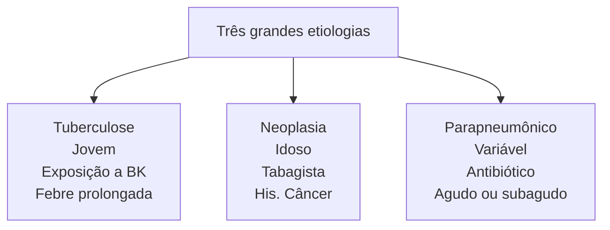

# DERRAME PLEURAL

## Criterios de LIGHT = Exsudato X Transudato (1 positivo = Exsudato).

* Relação entre as proteínas no líquido pleural/soro > 0,5
* Relação entre LDH no líquido pleural/soro > 0,6
* LDH no líquido pleural mais de dois terços do limite superior normal do soro (normal = 115 até 225 UI/L).

### Exsudato:
* Tuberculose
  * Jovem
  * Exposição a BK
  * Febre prolongada
* Neoplasia
  * Idoso

* Tabagista
* His. Câncer
* Parapneumônico
  * Variável
  * Antibiótico
  * Agudo ou Subagudo

### Transudato:
* Etiologias mais comuns: Insuficiência Cardíaca esquerda e Cirrose hepática
* Menos comuns: Hipoalbuminemia; Diálise peritoneal; Hipotireoidismo; Síndrome nefrótica; Estenose mitral
* Raras: Pericardite constritiva; Urinotórax; Síndrome de Meigs.

## 1. FISIOLOGIA PLEURAL

* O líquido pleural é produzido para manter a lubrificação das pleuras, com uma produção aproximada de 700mL/dia e volume residual de 20mL. Deve haver um balanço entre a produção e a absorção.

**Figura 1** Fisiologia Pleural

* Os desbalanços dessa homeostasia podem ocorrer devido:
  * Elevação da pressão hidrostática capilar;
  * Elevação da pressão oncótica intrapleural;
  * Aumento da permeabilidade capilar;
  * Redução da absorção linfática pleural.
* O acúmulo de líquido entre as pleuras pode funcionar como uma barreira para a passagem de substâncias entre os capilares da pleura visceral e da pleura parietal, entre elas, os antibióticos. O espaço morto gerado pelo acúmulo de líquido impede que o espaço pleural seja vigiado pelos mecanismos de defesa existentes nos tecidos. Um dos princípios básicos para a saúde pleural, é que a pleura visceral precisa estar em aposição (encostando) na pleura parietal.
* O líquido pleural fisiológico é mantido através do equilíbrio da pressão hidrostática e oncótica:
  * Se há um desbalanço das pressões, havendo um aumento da pressão hidrostática, há uma perda de líquido dos capilares para dentro do espaço pleural;
  * A mesma coisa acontece se existir uma produção proteica muito grande no espaço pleural – fazendo com que a pressão oncótica se eleve, causando de influxo líquido para dentro do espaço.
* Algumas forças também exercem funções na dinâmica respiratória. A força de retração pulmonar e a força de expansão da cavidade torácica:
  * Nossa pressão intrapleural em repouso é negativa devido basicamente à força elástica do pulmão. Lembre que o pulmão em repouso fica atelectasiado, ou seja, murcho. Justamente devido à força elástica do tecido pulmonar;
  * Por isso, quando ocorre um trauma penetrante no tórax, há perda da integridade desse sistema hermeticamente fechado e o ar atmosférico é sugado para dentro do espaço pleural.

### 1.1 DINÂMICA PULMONAR

* Quando inspiramos nossa caixa torácica se expande, fazendo uma força contrária à força elástica do pulmão, gerando uma pressão dentro do alvéolo negativa (o que vai sugar o ar para dentro dos pulmões) e uma pressão intrapleural ainda mais negativa;
* Por isso, na inspiração a coluna do selo d'água sobe;
* Na expiração a cavidade torácica relaxa e diminui, aumentando a pressão alveolar e pleural;
* Por isso, na expiração a coluna do selo d'água desce.

TORÁCICA

**Figura 2** Dinâmica pulmonar

![Graph showing pulmonary dynamics with Volume pulmonar (lung volume in liters) on top axis ranging from 0 to 0.50, and Pressão (Pressure in cmH₂O) on bottom axis ranging from -8 to +2. The graph shows curves for alveolar pressure, transpulmonary pressure, and pleural pressure during inspiration and expiration phases.]

## 2. AVALIAÇÃO GERAL

• Na avaliação de um derrame pleural devemos observar:
• Avaliação clínica: idade, condição clínica, fator de risco e duração dos sintomas;
• Avaliação radiológica: radiografia, ultrassonografia e tomografia;
• Análise do líquido: toracocentese.

### 2.1 DIAGNÓSTICO POR IMAGEM:

• São diversas as modalidades de imagem que auxiliam o diagnóstico.

**Radiografia**

• PA: Sensibilidade de 200ml de líquido livre! Sinal clássico = parábola de Damoiseau (líquido adquire esse formato em decorrência da gravidade);

![Chest X-ray showing Parábola de Damoiseau - a curved line indicating fluid accumulation in the pleural space]

**Figura 3** Raio-x derrame pleural

• Perfil: Sensibilidade de 50ml de líquido livre! (mais sensível!) Sinal Clássico = opacificação do seio costofrênico;

![Lateral chest X-ray showing pleural effusion with opacification of the costophrenic angle]

**Figura 4** Raio-x derrame pleural

• AP: Opacidade difusa. O líquido estará atrás do pulmão de maneira homogênea devido decúbito do paciente, aumentando sua opacidade como um todo. Só realizar em AP se o paciente não conseguir ficar em posição ortostática.

![AP supine mobile chest X-ray showing diffuse opacity from pleural effusion, with R and AP SUPINE MOBILE labels visible]

**Figura 5** Raio-x derrame pleural

` tags. There is no additional content to continue transcribing from this page.

### 5.3 RARAS:
• Pericardite constritiva; Urinotórax; Síndrome de Meigs.

## 6. EXSUDATO

• Sempre observar as 3 grandes etiologias:

**Figura 9** fluxograma das 3 grandes etiologias

**Citologia**

**Figura 10** Etiologias

**1º passo após concluir que é um EXSUDATO= citologia diferencial;**
• Parapneumônico = predomínio neutrofílico;
• Tuberculose ou neoplasia = predomínio linfocítico:
• Para diferenciar um do outro, recorremos primeiramente à história clínica.
• Qual avaliação do líquido pleural possui maior importância na elucidação diagnóstica da etiologia do derrame exudativo?
• Resp: Citologia diferencial e oncótica.

## REFERÊNCIAS

**Figura 3** Raio-x derrame pleural
www.radiopaedia.org

**Figura 4** Raio-x derrame pleural
www.radiopaedia.org

**Figura 5** Raio-x derrame pleural
www.radiopaedia.org

**Figura 6** Raio-x derrame pleural
www.radiopaedia.org

**Figura 8** Feixe vascular abaixo da borda da costela
Acervo pessoal
