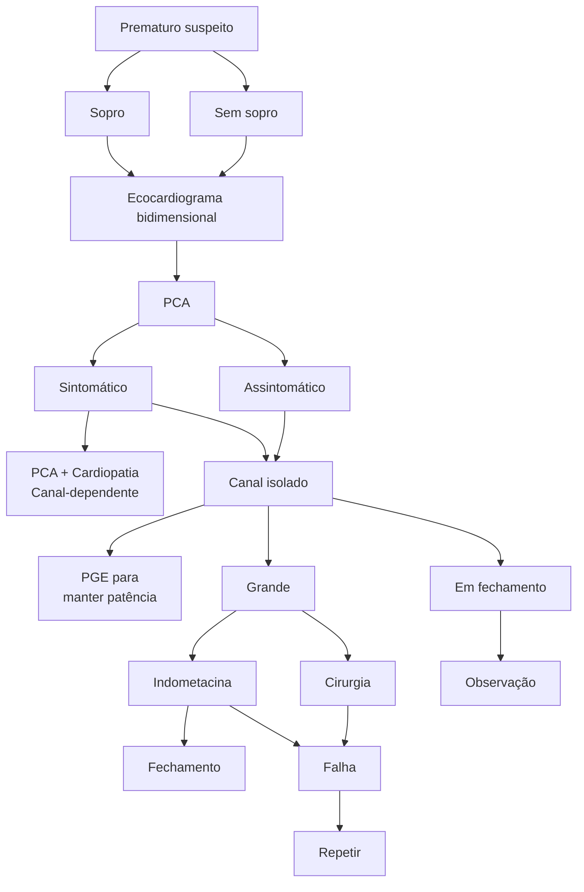

# DOENÇAS CONGÊNITAS PARTE 1

• As cardiopatias congênitas acianóticas podem cursar com hiperfluxo (shunt esquerda-direita), como a CIA, CIV, PCA e DSAV; ou normofluxo pulmonar (sem desvio), como a coarctação da aorta, estenose aórtica e estenose mitral.
• A CIV é a cardiopatia congênita mais frequente, sendo o tipo perimembranoso mais comum. Embora a valva aórtica bicúspide seja uma condição congênita mais frequente, nem sempre possui significado patológico.
• Inibidores da prostaglandina (ex: indometacina) podem induzir o fechamento do canal arterial. Caso haja falha na intervenção farmacológica, indica-se o tratamento cirúrgico, mesmo no período neonatal, nos casos de PCA associada a IC descompensada.
• O fechamento da CIA tipo ostium secundam é indicado preferencialmente através de dispositivos de oclusão percutânea, sempre que tecnicamente adequado. Indica-se em todos pacientes com evidência de repercussão hemodinâmica, independente dos sintomas.
• A síndrome de Eisenmenger é uma complicação tardia associada ao hiperfluxo pulmonar, caracterizada por hipertensão pulmonar fixa, resistência vascular elevada (> 5 woods), cianose e inversão do shunt. Neste contexto, não se recomenda a correção do defeito congênito primário.

## 1. EPIDEMIOLOGIA

• Cardiopatia Congênita é a malformação congênita mais comum, afeta 10 em cada 10.000 nascidos vivos, e, no Brasil são mais de 24 mil novos casos ano:
  • A maioria destes vai demandar intervenção, seja cirúrgica ou Percutânea.

• Importância da Cardiologia e CC Pediátrica:
  • Grande envolvimento das sociedades (SBC e SBCCV) e governo na sua melhoria;
  • Uma das maiores causas de mortalidade infantil;
  • Por ser evitável, a diminuição da mortalidade infantil depende hoje da mudança desses dados.

## 2. INTRODUÇÃO

### 2.1 Quadro Clínico:

• Assintomáticos, principalmente na primeira infância, podendo ser encontrado sopro cardíaco;
• Cianose;
• Insuficiência Cardíaca Congestiva (avançar da doença/maior gravidade):
  • Cansaço;
  • Taquipnéia;
  • Baixo ganho de peso;
  • Sudorese/Palidez cutânea.

### 2.2 Classificação das cardiopatias congênitas:

• Quanto à cianose:
  • ACIANÓTICAS;
  • CIANÓTICAS (Por convenção, SatO2 < 85%).
• Quanto ao Ventrículo:
  • Univentriculares → apenas um ventrículo tem a responsabilidade de dar conta da circulação;
  • Biventriculares.
• Quanto aos Tipos de Correção (Tratamento):
  • Corrigindo TODOS os defeitos: Correção Anatômica (Total); Cirurgia Corretiva;
  • Corrigindo PARCIALMENTE os defeitos Ou modificando apenas a fisiologia da circulação da criança: Correção Fisiológica; Cirugia Paliativa.

CAR

CIRURGIA CARDÍACA

## 2.3 ESCORE DE RISCO:

Escore Rachs

| Rachs 1                                                   | Rachs 2                                                                                                                                                                                                                                                                                                        | Rachs 3                                                                                                                                                                                                                                                                                                                     | Rachs 4                                                                                                                                                                                                                                                                | Rachs 5                                     | Rachs 6                                  |
| --------------------------------------------------------- | -------------------------------------------------------------------------------------------------------------------------------------------------------------------------------------------------------------------------------------------------------------------------------------------------------------- | --------------------------------------------------------------------------------------------------------------------------------------------------------------------------------------------------------------------------------------------------------------------------------------------------------------------------- | ---------------------------------------------------------------------------------------------------------------------------------------------------------------------------------------------------------------------------------------------------------------------- | ------------------------------------------- | ---------------------------------------- |
| CIA
PCA > 30d
CoAo > 30d
DAPVP
Aortopexia | Valvoplastia Ao > 30d
Estenose SubAo
Valvoplastia Pulmonar
PCA < 30d
Ampliação VSVD
Fístula Coronariana
CIV + CIA
DSAV parcial
CIV
CIV + banda VD
T4F
DATVP > 30d
Glenn
Anel Vascular
Janela Ao-Pulm
CoAo < 30 d
Átrio único
Fístula VE-AD | TV Ao/TV Mitral
Plastia Mitral
Ross
Ampliação VSVE
Plastia tricúspide
Ebstein > 30d
ALCAPA
Tubo VD-TP
DVSVD
Fontan
DSAV-T
Bandagem TP
T4F com AP
Cor triatriatum
Shunt Sist-pulm latente
Art pulm anomala
Senning/Mustard
CoAo + CIV
Tumor cardíaco | Plastia Ao < 30d
Konno
Ampliação CIV
DATVP < 30d
Ampliação CIA
Rastelli
Senning + CIV
Senning +EPIV
Jatene pós BAP
Jatene + CIV
Jatene + EPIV
Truncus
IAAo
Hipoplasia Arco Ao
Unifocalização
Double Switch | Ebstein
neonatal
Truncus +
IAA. | Norwood
Híbrido -
SHCE
Damus |

CIA: comunicação interatrial. PCA: persistência do canal arterial. CoAo: coarctação de aorta..DAPVP: drenagem anômala parcial de veias pulmonares. VSVD: via de saída do ventrículo direito. DSAV: defeito de septo atrioventricular. T4F: Tetralogia de Fallot. ELCAPA: anomalous left coronary artery from the pulmonary artery. DVSVD: dupla via de saída de ventrículo direito. EPIV: estenose infundíbulo-valvar. SHCE: Síndrome do coração esquerdo hipoplásico

## 3. CARDIOPATIAS ACIANOGÊNICAS

• Não causam cianose.

### 3.1 Classificação:

• Normofluxo pulmonar (obstrutivas sem desvio):
  • Esquerda: Coarctação da aorta; Interrupção do arco aórtico; Estenose aórtica; Estenose mitral;
  • Direita: Estenose pulmonar.

• Hiperfluxo pulmonar (desvio esquerda-direita):
  • 45% dos casos: CIV (comunicação interventricular) → a patologia mais comum de todas as cardiopatias congênitas. Porém, existe uma condição mais comum que a CIV (não necessariamente patológica, pode ser apenas uma variação anatômica), que é a valva aórtica bicúspide. CIA (comunicação interatrial). PCA (persistência do canal arterial);
  • DSAV (defeito de septo atrioventricular) → uma "mistura da CIA e CIV", com defeito do coxim endocárdico (parte do meio) do coração;
  • Janela aortopulmonar.

CAR

## Classificação didática das cardiopatias congênitas

| Classificação didática das cardiopatias congênitas                                                                                                                                                                                                                                                                    |              |
| --------------------------------------------------------------------------------------------------------------------------------------------------------------------------------------------------------------------------------------------------------------------------------------------------------------------- | ------------ |
| Acianogênicas                                                                                                                                                                                                                                                                                                         | Cianogênicas |
| "Normofluxo pulmonar"
Obstrutivas
sem desvio"	"Hiperfluxo pulmonar"
"Desvio esquerda-direita"
Esquerda:
Coarctacao da aorta
Interrupção do
arco aórtico
Estenose aórtica
Estenose mitral
Direita:
Estenose pulmonar	CIV
CIA
PCA
DSAV
Janela aortopulmonar |              |

</td>
<td>

| "Hipofluxo pulmonar"
"Obstrutivas com desvio direita-esquerda"                                                                                                                                                          | "Normofluxo pulmonar"
"Circulação em paralelo" | "Hiperfluxo pulmonar"
"Mistura"                                            |
| --------------------------------------------------------------------------------------------------------------------------------------------------------------------------------------------------------------------------- | -------------------------------------------------- | ------------------------------------------------------------------------------ |
| Tetralogia de Fallot
Atresia tricuspide
Atresia pulmonar
com CIV
Atresia pulmonar
sem CIV
TGA com EP
Doença de Ebstein
TGA sem CIV
SCEH
CATVP
Cardiopatias
complexas com EP | TGA com CIV                                        | Tronco arterial comum
Atresia mitral
Cardiopatias
complexas sem EP |

</td>
</tr>
</table>

## 3.2 Fisiologia do fluxo pulmonar dentro do coração:

• O sangue não oxigenado chega no coração pelas veias cava inferior e superior. O átrio direito apresenta pressão venosa entre 0-6 mmHg e sangue saturando por volta de 70%;

• Do átrio direito, o sangue passa, através da válvula tricúspide, para o ventrículo direito, com pressão sistólica de 25 mmHg e diastólica de 0-5 mmHg, saturando ainda 70%, claro;

• O sangue passa pela valva pulmonar para o tronco pulmonar e ser levado para os dois pulmões onde será oxigenado. No tronco pulmonar, a pressão será 25 mmHg (sistólica) e 10 mmHg (diastólica), com sangue à 70%;

• O sangue retorna para o átrio esquerdo, com pressão entre 5-10 mmHg (pressão capilar-pulmonar), saturando > 95%;

• No ventrículo esquerdo, a pressão fica 100 mmHg (sistólica) e 5 mmHg (diastólica), com a mesma saturação:
  • Se a oxigenação do sangue no ventrículo esquerdo e direito variar do esperado (aumentar na direita e diminuir na esquerda), provavelmente há uma CIV;
  • A mistura de sangue mais efetiva comumente ocorre nos átrios, em que o átrio direito tem a saturação mais superior na CIA, comparado ao ventrículo esquerdo na CIV.

• Sangue passa pela valva aórtica e é propulsionado para todo o corpo, com pressão média de 100 x 60 mmHg, com sangue saturando > 95%.

Fonte: acervo pessoal
Caso de PCA (Persistência do Canal Arterial). Ocorre shunt da aorta para a artéria pulmonar, causando hiperfluxo pulmonar.

CAR

Ducto arterial patente conectando aorta e tronco pulmonar.

## 4. PERSISTÊNCIA DO CANAL ARTERIAL

### 4.1 Conceitos:

• Remanescente do ducto arterioso → Normalmente, com 10 a 15 horas do nascimento, já há contração da musculatura lisa, e, com 2 a 3 semanas, ocorre proliferação fibrosa da íntima;
• Envolvimento de substâncias mediadoras:
  • Se quiser manter a patência do canal: Prostaglandinas (PG); Logo, inibidores da PG estimulam o fechamento;
  • O fechamento usual é modelado pela PaO2: PaO2 elevada: estímulo ao fechamento.

• Riscos da PCA:
  • Insuficiência Cardíaca;
  • Hipertensão Pulmonar;
  • Endocardite.

### 4.2 Fisiologia do ducto arterial patente:

• Na PCA, ocorre diminuição do fluxo sistêmico, pois há o desvio (shunt) da esquerda para a direita através do ducto arterial patente. Além disso, ocorre o aumento do fluxo pulmonar (sobrecarga do volume pulmonar > hipertensão pulmonar) e hipertrofia do ventrículo esquerdo.

**Fisioterapia do ducto arterial patente**

- Diminuição do fluxo sistêmico
- Desvio (shunt) da esquerda para a direita através do ducto arterial patente
- Aumento do fluxo pulmonar (sobrecarga do volume pulmonar)
- Hipertrofia ventricular esquerda

CAR

DOENÇAS CONGÊNITAS PARTE 1                                                                    5

• O fechamento do ducto arterial patente pode ser
via esternotomia ou toracotomia lateral esquerda,
por meio da clipagem ou sutura com fio de
algodão:
  • Nesse processo, deve-se ter cuidado para não
  lesar o nervo laríngeo recorrente, que levaria à
  alteração da fala.

## 4.3 Indicação Cirúrgica:

• Ideal tratar até 1 ano:
  • < 1 mês: ICC descompensada;
  • 1 a 6 meses: Sintomáticos;
  • > 6 meses: Cirurgia Eletiva.

• Prematuros:
  • Apenas se relação AE/Ao > 1,5.

**Algoritmo no prematuro suspeito de PCA.**

CAR

• Recomendações para intervenção em pacientes adultos com PCA:
  • Preferencialmente via percutânea.

## 4.4 Evolução:

• Mortalidade:
  • 10% nos prematuros na cirurgia;
  • Próximo de 0% nos demais casos.

• Sobrevida:
  • Similar a da população normal.
• Complicações:
  • Lesão nervo laríngeo recorrente;
  • Paralisia frênica;
  • Quilotórax.

# 5. COMUNICAÇÃO INTERATRIAL

• Comunicação Interatrial (CIA).

## 5.1 Fisiopatologia:

• Desvio sangue AE-AD → Sobrecarga de volume no VD → Aumento do Fluxo pulmonar → Hipertensão Pulmonar.

Fluxo sanguíneo pela comunicação interatrial. Fonte: adaptado de: Croti. Cardiologia e Cirurgia Cardiovascular Pediátrica. 2013.

## 5.2 Clínica:

• Usualmente assintomático, no primeiro momento;
• Desdobramento fixo de B2 (atraso do fechamento da valva pulmonar);
• Hiperfluxo pulmonar;
• Falência ventricular direita;
• Hipertensão pulmonar;
• Síndrome de Eisenmenger.

## 5.3 Anatomia:

• Importante para reconhecer "zonas de perigo" durante a correção da CIA, demandando maior atenção:
  • Atenção para não lesar o nó atrioventricular.
• Observe na imagem abaixo os principais locais de CIA:
  • Ostium secundum → o mais comum;
  • Ostium premium;
  • No seio coronariano;
  • No seio venoso inferior ou superior.

Seio venoso superior, Ostium Primum, Ostium secundum, Seio coronário, Seio venoso inferior

• Em crianças pode haver o fechamento espontâneo.

## 5.4 Indicação Cirúrgica:

• Indica-se entre 1-2 anos, pois antes dos 4 anos ainda está ocorrendo a maturação pulmonar (depois disso, há repercussões para a vida);
• Indicações:
  • Presença de dilatação cavitária;
  • ICC (independente da idade, deve intervir);
  • Relação Qp/Qs > 1,5/1 (Se fosse menor, haveria maior chance de fechamento espontâneo);
  • Também depende do: Quadro clínico; Tipo de comunicação.

DOENÇAS CONGÊNITAS PARTE 1                                            7

## 5.5 Técnica Cirúrgica:

• Atriosseptorrafia por aproximação das bordas → se CIA pequena;
• Atriosseptorrafia com patch autólogo ou bovino, para fechar o canal.

• Técnica Percutânea:
  • Fechamento da comunicação interatrial com dispositivo expansor, via cava inferior, passando o septo interatrial.

## 6. COMUNICAÇÃO INTERVENTRICULAR

• A Comunicação Interventricular (CIV) pode estar em diferentes localizações:
  • Defeito em septo ventricular tipo perimembranoso é o mais comum (80%) → relação com formação de aneurisma e insuficiência aórtica;
  • Defeito em septo ventricular subarterial-infundibular (6% no mundo e 30% em asiáticos) → fechamento espontâneo é incomum;
  • Defeito no septo ventricular tipo muscular (20%) → fechamento espontâneo é incomum;
  • Defeito no septo atrioventricular → relação com síndrome de down.

Localizações possíveis para a CIV.

Defeito em septo ventricular (Subarterial-infundibular) - 6% global, 30% Asiáticos, Fechamento espontâneo incomum

Defeito em septo ventricular (Tipo perimembranoso) - 80%, Formação de Aneurisma e Insuficiência aórtica

Defeito no septo atrio-Ventricular (Síndrome de Down)

Defeito no septo ventricular (tipo muscular) - 20%, Fechamento esponâneo incomum

Localizações possíveis para a CIV.

CAR

## 6.1 Detalhes na anatomia:

• Cuidado com o nó atrioventricular (risco de causar BAVT iatrogênico), com o ramo do feixe de hiss, com a porção membranosa do septo interventricular e cúspides da valva aórtica, estruturas sob risco de lesão durante a cirurgia.

## 6.2 Indicação Cirúrgica:

• Considerar:
  • Se há possibilidade de fechamento espontâneo;
  • Se sintomático;
  • Tipo de comunicação.

• Outras Indicações:
  • Caso afete outras estruturas;
  • IAo moderada ou importante;
  • Endocardite;
  • Qp/Qs > 1,5/1 e RVP < 4 Woods/m2.

## 6.3 Técnica Cirúrgica:

• Patch cardio autólogo ou bovino, com pontos separados ou contínuos.

# 7. COARTAÇÃO DA AORTA

• Coarctação de Aorta (CoAo); estreitamento da aorta.

## 7.1 Neonatal:

• Dependente Canal Arterial (Prostin);
• Associado Com Civ E Hipertensão Pulmonar;
• Pode Causar:
  • Choque Cardiogênico;
  • Acidose Metabólica;
  • Óbito.

## 7.2 Adulta:

• Hipertensão Arterial;
• Circulação Colateral;
• Dissecção Aorta.

## 7.3 Patologia:

• Diminuição do fluxo da aorta descendente, apresentando circulação colateral e artérias Intercostais bem desenvolvidas. Além de poder apresentar:
  • Sobrecarga VE;
  • Hipertrofia;
  • Insuficiência cardíaca;
  • PCA.
• Hipertensão aorta ascendente.

• A coarctação normalmente é próxima do canal arterial.

## 7.4 Técnicas Cirúrgicas:

• Ampliação com retalho e anastomose término – terminal;
• Ampliação com artéria subclávia, com a técnica de Teles – Mendonça;
• Interposição de enxerto tubular;
• Ampliação do arco;

• Interposição de prótese: Dacron ou PTFE.

# DOENÇAS CONGÊNITAS PARTE 2

• As cardiopatias cianóticas podem cursar com hipofluxo pulmonar (shunt direita-esquerda), como a tetralogia de Fallot, atresia tricúspide/pulmonar, doença de Ebstein e TGA sem CIV; normofluxo (circulação em paralelo) como a TGA com CIV; ou hiperfluxo (mistura), como o truncus arteriosus.

• A tetralogia de Fallot é caracterizada pela presença de comunicação interventricular, dextroposição/cavalgamento da aorta, hipertrofia do ventrículo direito e estenose pulmonar.

• A correção total da tetralogia de Fallot é

idealmente realizada após os 6 meses de vida. Em crianças menores refratárias ao tratamento clínico, principalmente no período neonatal, o shunt de Blalock-Taussig pode ser realizado de maneira paliativa.

• Na TGA sem CIV, deve-se manter o canal arterial aberto (Prostaglandina) após o nascimento. Se não houver CIA, deve-se realizar a atriosseptostomia por cateter balão. A cirurgia definitiva (arterial switch) deve ser realizada no período neonatal em até 5 dias.

## 1. CARDIOPATIAS CIANOGÊNICAS

### Classificação didática das cardiopatias congênitas

| Acianogênicas                                                                                                                                         |                                                       |                                                                                                                                                                                                                                  | Cianogênicas                                       |                                                                                  |   |
| ----------------------------------------------------------------------------------------------------------------------------------------------------- | ----------------------------------------------------- | -------------------------------------------------------------------------------------------------------------------------------------------------------------------------------------------------------------------------------- | -------------------------------------------------- | -------------------------------------------------------------------------------- | - |
| "Normofluxo pulmonar"
"Obstrutivas sem desvio"                                                                                                    | "Hiperfluxo pulmonar"
"Desvio esquerda-direita"   | "Hipofluxo pulmonar"
"Obstrutivas com desvio direita-esquerda"                                                                                                                                                               | "Normofluxo pulmonar"
"Circulação em paralelo" | "Hiperfluxo pulmonar"
"Mistura"                                              |   |
| **Esquerda:**
Coarctação da aorta
Interrupção do arco aórtico
Estenose aórtica
Estenose mitral
**Direita:**
Estenose pulmonar | CIV
CIA
PCA
DSAV
Janela aortopulmonar | **Tetralogia de Fallot;**
Atresia tricúspide;
Atresia pulmonar com CIV;
Atresia pulmonar sem CIV;
TGA com EP;
Doença de Ebstein;
TGA sem CIV;
**SCEH;**
CATVP;
Cardiopatias complexas com EP | **TGA com CIV**                                    | **Tronco arterial comum;**
Atresia mitral;
Cardiopatias complexas sem EP |   |

Croti. Cardiologia e Cirurgia Cardiovascular Pediátrica. 2013.

As cardiopatias congênitas cianogênicas são divididas em de:

• Hipofluxo pulmonar (obstrutivas com desvio direita-esquerda):
  • Tetralogia de Fallot;

• Atresia tricúspide;
• Atresia pulmonar com ou sem Comunicação interventricular (CIV);
• Transposição das Grandes Artérias (TGA) com Estenose pulmonar (EP);
• Doença de Ebstein;

CAR

• TGA sem CIV;
• Síndrome do Coração Esquerdo Hipoplásico (SCEH);
• Conexão anômala total de veias pulmonares (CATVP);
• Cardiopatias complexas com EP.

• Normofluxo pulmonar (circulação em paralelo):
  • TGA com CIV.

• Hiperfluxo pulmonar (mistura):
  • Tronco arterial comum (exemplo clássico);
  • Atresia mitral;
  • Cardiopatia complexas sem EP.

## 2. TETRALOGIA DE FALLOT

TETRALOGIA DE FALLOT (T4F):
• A tetralogia de Fallot é a mais comum e mais cobrada em prova!
• Apresenta 4 componentes principais:
  • EP;
  • CIV;
  • Aorta sobreposta ao defeito septal (cavalgamento da aorta);
  • Hipertrofia de ventrículo direito (VD).
• Regra dos 50% → se a aorta estiver mais que 50% em direção ao VD, chama-se dupla via de saída do VD. Se < 50%, é a T4F clássica:
  • Quando muito à direita, é mais difícil corrigir.

**Tetralogia de Fallot**

[Diagram showing a heart with labeled components:
- Aorta sobreposta ao defeito septal (Cavalgamento da Aorta)
- Estenose Pulmonar
- Comunicação interventricular
- Hipertrofia de Ventrículo Direito]

T4F: Tetralogia de Fallot.

• Indicações cirúrgicas da T4F (variados graus e clínicas):
  • Estenose infundibulovalvar e dependência do PCA no período neonatal = cirúrgica precoce;
  • Estenose infundibular moderada pode-se manter tratamento clínico até 6m-1a;
  • A correção pode ser Total (crianças maiores) ou Paliativa (Shunt de Blalock Taussig - para crianças menores/ no período neonatal).
• Técnicas cirúrgicas paliativas:
  • Blalock Taussig Thomas Modificado: comunicação entre circulação sistêmica e pulmonar para diminuir o hipofluxo pulmonar. Comumente realizado à direita em comunicação com a artéria subclávia;
  • Colocação de Stent em Via de Saída de VD: atualmente evitada, pois sua retirada é difícil para a posterior correção total.
• Técnicas cirúrgicas definitivas:
  • Correção total (anatômica) → correção da CIV com pericárdio (material pode ser autólogo, bovino, sintético) e da EP.

## 3. TRANSPOSIÇÃO DAS GRANDES ARTÉRIAS

• Ocorre um defeito no momento em que a aorta e a artéria pulmonar invertem/ giram. Assim, o tronco pulmonar sai do ventrículo esquerdo, e o aórtico do VD.
• Anatomia:
  • Resumo: A aorta sai do ventrículo direito, a artéria pulmonar sai do ventrículo esquerdo, há um defeito do septo ventricular (CIV) comunicando as câmaras, e um defeito do septo atrial promovendo a mistura de sangue;
  • Se não houver uma CIV, ocorre o fenômeno de sangue paralelo. O sangue que vem do corpo, pelas veias cavas, é lançado diretamente na aorta, voltando ao corpo sem ser oxigenado. Por isso é importante a presença da CIV, porque permite a mistura de sangue e uma oxigenação menos deficitária.

CAR

## DOENÇAS CONGÊNITAS PARTE 2

### 1. Aorta emergindo do VD
### 2. Artéria Pulmonar emergindo do VE
### 3. Defeito do seto ventricular
### 4. Defeito do septo atrial
### 5. Ducto arterial patente

**Diagrama do coração mostrando:**
- Do corpo → Para o corpo
- Para os pulmões
- Dos pulmões → Para os pulmões
- Dos pulmões → Para o corpo

**Transposition of the great arteries**

Diagrama mostrando:
- Blood flow
- Balloon catheter
- Balloon catheter

**Balloon Atrial Septostomy - Rashkind Procedure.**

Técnica cirúrgica do tratamento definitivo:
- "ARTERIAL SWITCH" → técnica produzida pelo brasileiro Jatene (operação de Jatene) → secciona a aorta e a artéria pulmonar e as troca de lugar:
  - As coronárias são re-inseridas no tronco pulmonar (a neo-aorta);
  - Manobra de Le Compte → deslocamento do tronco pulmonar anteriormente (antes estava posterior).

**Operação de Jatene + manobra de le compte.**

[Série de diagramas ilustrando os passos cirúrgicos]

**Manobra de le compte.**

Indicação do tratamento: se há o diagnóstico, deve ser intervido:

- Diagnóstico intra-útero → possibilitar parto em local com suporte para cirurgia cardíaca pediátrica e cuidados neonatais apropriados:
  - Ao nascer, coloca-se um cateter umbilical e inicia o Prostin. O Prostin está indicado como intervenção não definitiva para manutenção temporária da funcionalidade do canal arterial, até que se possa proceder à cirurgia corretiva ou paliativa em recém nascidos cuja sobrevivência seja dependente da funcionalidade do canal arterial;
  - Se não houver comunicação interatrial ou seu orifício for muito pequeno, realiza-se uma atriosseptostomia por cateter balão ("rasga o septo");
  - A cirurgia deve ser realizada no período neonatal, em no máximo 5 dias.
- Procedimento: Arterial ou atrial switch.

- Preparo ventricular:
  - A sequência de intervenções inicia com o início do Prostin, e, se necessária, a septostomia atrial (Balloon Atrial Septostomy - Rashkind Procedure), como já mencionado;
  - Procedimento para abrir um orifício na parede septal que divide os átrios esquerdo e direito. A abertura no septo permite que o sangue rico em oxigênio e o pobre em oxigênio se misturem, melhorando a circulação;
  - O cateter é inserido no orifício septal e inflado. Após a inflação, o cateter é puxado de volta pelo orifício, e, assim, é produzida a septostomia.

- "ATRIAL SWITCH" SENNING (TECIDO PRÓPRIO) OU MUSTARD (PATCH SINTÉTICO):
  - Mais realizada em crianças mais velhas (> 1 mês), quando perdeu a janela temporal adequada para o arterial switch. Ou em caso de TGA com septo íntegro com contraindicação de operação de Janete;
  - Mais comumente utiliza a técnica de Senning,

CAR

com tecido próprio;
• O fluxo vindo das veias cava é redirecionado para o VE, permitindo passar pelo tronco pulmonar e seja oxigenado;
• O sangue oxigenado retorna pelo átrio esquerdo, será direcionado para o ventrículo direito e será distribuído pela aorta para o corpo.

Técnica de RASTELLI → indicada quando há TGA + ESTENOSE PULMONAR:

[Three diagrams showing heart anatomy labeled A, B, and C showing the Rastelli technique]

Técnica de Rastelli.

## 4. SÍNDROME DO CORAÇÃO ESQUERDO HIPOPLÁSICO

[Two diagrams showing hypoplastic left heart syndrome - one showing a cross-section view and another showing an anatomical view with numbered labels 1, 2, 3, and 4]

Coração esquerdo hipoplásico.

Os detalhes anatômicos são muito variados e quatro subtipos morfológicos podem ser definidos para a SCEH, com base no estado das valvas:
• Atresia aórtica e atresia mitral: mais comum;
• Atresia aórtica e estenose mitral:
  • Pior prognóstico.
• Estenose aórtica e atresia mitral: menos comum (cerca de 5%);
• Estenose aórtica e estenose mitral.

Adaptado de: Croti. Cardiologia e Cirurgia Cardiovascular Pediátrica. 2013.

• A SCEH é uma doença quase sempre fatal, e os óbitos ocorrem, em geral, em um mês;
• Diagnóstico = Cirurgia, ao menos que seja fútil:
  • Primeiros dias de vida.

• SCHE - Tratamento Estagiado:

CAR

DOENÇAS CONGÊNITAS PARTE 2• Tentativa de fazer o coração funcionar com apenas um ventrículo;
• A circulação sistêmica será realizada pelo ventrículo, e a pulmonar será de forma passiva.

• Estágios:
• 1º reparo (Norwood) → ampliação de aorta hipoplásica com patch de pericárdio + Junção de artéria pulmonar com a aorta + colocação do tubo VD-TP, para o manter a circulação para o tronco pulmonar, momentaneamente:
  • Permite que o lado direito do coração forneça sangue para o corpo.

•
• Estágio 2 (Glenn bidirecional) → Realizada quando o bebê tem por volta de seis meses de idade. Realiza-se a conexão da veia cava superior à artéria pulmonar, de forma bidirecional, permitindo que o sangue vindo da circulação sistêmica superior vá de forma passiva para o sistema pulmonar. Por fim, retira o tubo VD-TP;

•
• Estágio 3 (Fontan) → conexão da veia cava inferior com a artéria pulmonar, com o mesmo objetivo de permitir a circulação passiva pelo sistema pulmonar;

•
• Estágio 4 (transplante cardíaco) → realizado posteriormente (ex. > 15, 20 ou 30 anos).

|             1º Reparo
(Norwood)             |          2º Reparo
(Glenn Bidirecional)
VCS
conectada na
artéria
Pulmonar          |                3º Reparo (Fontan)                |
| :---------------------------------------------: | :----------------------------------------------------------------------------------------------------: | :----------------------------------------------: |
| *\[Diagram showing heart with surgical repair]* | *\[Diagram showing heart with VCS connection]*
VCI em
comunicação com
VCS por tubo externo | *\[Diagram showing heart with Fontan procedure]* |

CAR
