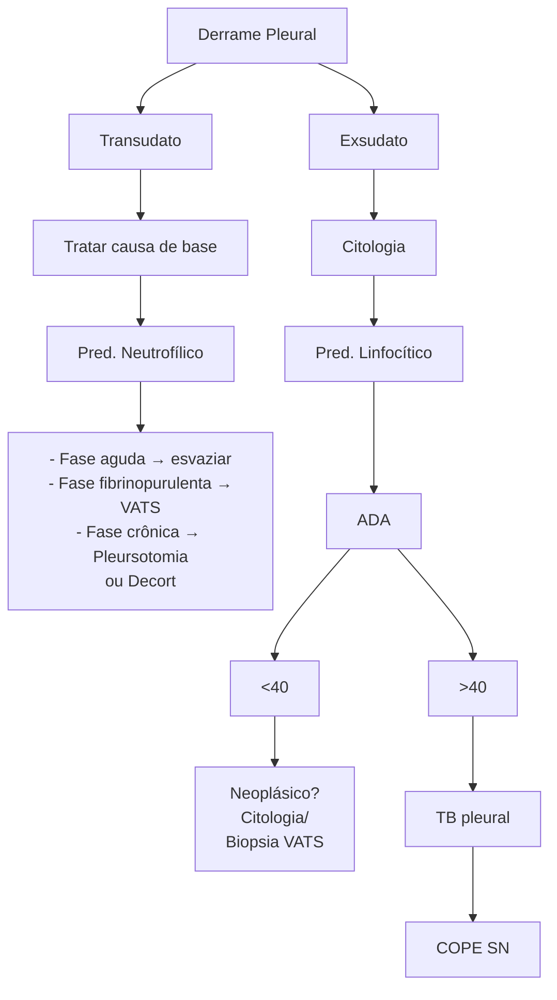
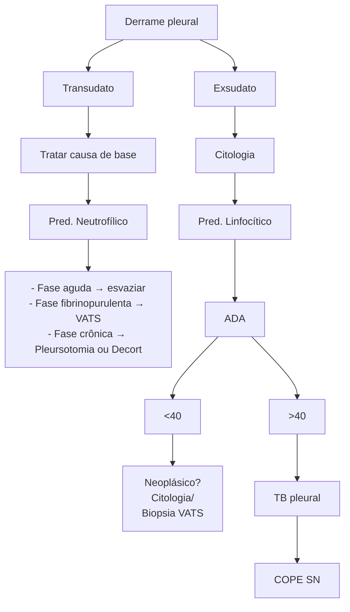

# EXSUDATO LINFOCÍTICO

## 1. CONCEITOS GERAIS

### 1.1 DEFINIÇÃO DO EXSUDATO LINFOCÍTICO:

• Mais de 50% de linfócitos (mononucleares);

• Causas mais comuns no mundo: Tuberculose e Neoplasia.
  • Melhor amigo no diagnóstico diferencial é a história clínica do paciente;
  • Além da história clínica podemos contar com dados objetivos como a dosagem da ADA e a citologia oncótica;

• ADA – produto da degradação de células brancas, um valor maior do que 35U/L sugere etiologia tuberculosa;

• A ADA, no entanto, também se eleva no empiema e no derrame neoplásico. Então seu poder diagnóstico deve ser levado em consideração nas populações específicas – paciente jovem, baixo risco de neoplasia e que faz parte de região onde a tuberculose é epidêmica;

**Tabela 1 Exsudato Linfocítico**

| Tuberculose                                                            |   | Neoplastia                                                    |
| ---------------------------------------------------------------------- | - | ------------------------------------------------------------- |
| Jovem
Exposição a BK
Febre prolongada
Citrino
ADA > 35 | ≠ | Idoso
Tabagista
His. Câncer
Serohemático
ADA? |

• Citologia = sensibilidade de 60%, mas pode nos mostrar células tumorais;

• Biópsia (diagnóstico definitivo): pode ser feita por videotoracoscopia (VATS), por Agulha de Cope ou por céu aberto (exclusão).

• Outras causas menos comuns: artrite reumatoide, pós-operatório.

## 2. BIÓPSIA PLEURAL

• Se a suspeita é de **NEOPLASIA**:
  • A doença pleural será localizada uma vez que teremos implantes pleurais. O local mais comum é o seio costofrênico onde o líquido fica mais acumulado;
  • Devido à difícil determinação às cegas, o melhor é a videotoracoscopia que possibilita, inclusive, tratamentos terapêuticos como pleurodese.

**Figura 1** Biópsia Pleural

• Se a suspeita é de Tuberculose o acometimento é difuso:
  • Pode ser feita a biópsia às cegas usando a agulha de COPE.

**Figura 2** Biópsia Pleural

## 3. TUBERCULOSE PLEURAL

• Comumente associada com a forma pulmonar:
  • Todo paciente com tuberculose pleural precisa ser submetido a baciloscopia do escarro para investigação de doença pulmonar.
• Reação de hipersensibilidade da pleura à presença do bacilo;
  • Não há a presença de bacilos no derrame pleural – exceto se empiema tuberculoso. Na biópsia da pleura também não vai haver bacilos.

**Figura 3** Tuberculose Pleural

## 4. DERRAME NEOPLÁSICO

• Tumor primário → mesotelioma pleural (rara);
• Tumores secundários → maioria absoluta;
• Geralmente temos: pacientes idosos, com histórico de câncer, histórico de tabagismo, líquido de aspecto hemático na maioria dos casos (mas pode variar);
• Idoso com exsudato linfocítico sem risco para TB = sempre biopsiar a pleura, via videotoracoscopia;

**Figura 4** Derrame Neoplástico

• Quando na TC de tórax há um espessamento da pleura mediastinal, é um sinal típico de derrame neoplásico;

EXSUDATO LINFOCÍTICO                                                                                      3

• Quando na TC de tórax há um espessamento da pleura mediastinal, é um sinal típico de derrame neoplásico;
• O tratamento vai ser baseado principalmente na causa-base;
• Mas o tratamento paliativo dos sintomas também envolve procedimentos cirúrgicos e devem ser feitos a fim de diminuir as idas ao pronto-socorro e aumentar a qualidade de vida;
• A dispneia gerada pelo acúmulo do líquido é a principal causa de sintoma. Podemos optar por pleurodese, toracocentese de repetição ou dreno de longa permanência para tratamento do derrame. Para decidir entre as opções terapêuticas vamos nos basear nas perguntas abaixo:
  • *Já tratou a doença?*
  • *É sintomático?*
  • *É recidivante?*
  • *KPS > 70*
  • *Após punção o pulmão expande?*

## 4.1 OPÇÕES DE TRATAMENTO:

• **Pleurodese:**
  • Gerar inflamação pleural para ocasionar aderência entre a pleura visceral e a mediastinal, visando controle dos sintomas.
• **QUÍMICA:**
  • Talco, tetraciclina, bleomicina, iodo; agente mais recomendado, com eficácia superior a 80%;
  • Talc Sulrry: instilação pelo dreno;
  • Talc Poudrage: pulverização cirúrgica;

**Figura 5** Exsudato linfocítico
• Efeitos Colaterais: Reação inflamatória aguda; Piora da função renal (principalmente com talco); Febre; Dor torácica;
• Contraindicação: Expansão pulmonar incompleta <60-50%.
• Dreno de longa permanência:
  • Utilizado em casos nos quais não há expansibilidade pulmonar suficiente para a realização da pleurodese, possui um alto custo e não é disponível no SUS.

**Figura 6** Toracocentese de repetição

## FLUXOGRAMA

**Figura 7** Derrame pleural

TORÁCICA

# REFERÊNCIAS

**Figura 1** Biópsia Pleural

www.radiopaedia.org

**Figura 3** Tuberculose Pleural

Acervo pessoal - Dr Eserval Rocha

**Figura 4** Derrame Neoplástico

www.radiopaedia.org

**Figura 5** Exsudato linfocítico

Acervo pessoal
