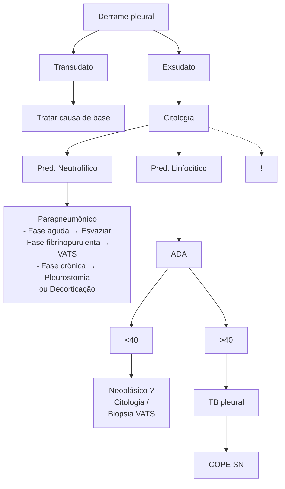

Derrame pleural (CIR)

# EXSUDATO NEUTROFÍLICO

| \*\*Critérios de exsudato neutrofílico complicado:\*\* - Ph < 7 (7,2); - LDH > 1000; - Glicose < 40; - Bacterioscopia positiva; - Pus. \*\*FASE 01 = Fase exsudativa ou aguda:\*\* - 1 a 2 semanas de história; - Líquido livre e estéril; - Tratamento: esvaziamento pleural + antibiótico. \*\*FASE 02 = Fase fibrinopurulenta:\*\* - 2 a 3 semanas de história; - Líquido turvo; |   | - Bactérias presentes; - Loculações – líquido não respeita a gravidade; - Imagens em favo de mel no USG; - Tratamento: videotoracoscopia com "deloculação". \*\*FASE 03:\*\* - Fase de organização – miofibroblastos; - 3 a 4 semanas de história; - Espessamento, encarceramento e retração do hemitórax – fibrotórax; - Na radiografia vemos a presença de nível hidroaéreo; - Tratamento: Decorticação X Toracostomia. |
| ----------------------------------------------------------------------------------------------------------------------------------------------------------------------------------------------------------------------------------------------------------------------------------------------------------------------------------------------------------------------------------- | - | ------------------------------------------------------------------------------------------------------------------------------------------------------------------------------------------------------------------------------------------------------------------------------------------------------------------------------------------------------------------------------------------------------------------------- |

## 1. CONCEITOS GERAIS

- Pensar diretamente em infecção aguda supurativa → habitualmente derrame parapneumônico.

## 2. FISIOPATOLOGIA

- Quando temos, por exemplo, uma bactéria caindo no espaço pleural, ocorrem mudanças no processo fisiológico habitual:
- Os macrófagos intrapleurais começam a combater a infecção. Produzem citocinas inflamatórias (que são proteínas), gerando inflamação capilar e aumento da pressão oncótica:
  - Esse desbalanço promove um acúmulo de líquido dentro do espaço pleural, que vai gerar um exsudato neutrofílico;
  - O exsudato neutrofílico – que você vai automaticamente lembrar do derrame pleural parapneumônico - possui mais do que 50% de sua celularidade de polimorfonucleares.

| \*\*Alvéolos\*\* (Three circular cell-like structures shown in purple) | \*\*Pleura visceral\*\* (Red dots representing cells) | \*\*P. Hidrostática \~5cmH2O\*\* (Central green circular structure with surrounding cells) | \*\*Pleura parietal\*\* (Red dots representing cells) | \*\*Linfáticos\*\* (Wavy lines) |
| ---------------------------------------------------------------------- | ----------------------------------------------------- | ------------------------------------------------------------------------------------------ | ----------------------------------------------------- | ------------------------------- |
|                                                                        | \*\*P. Oncótica \~30cmH2O\*\*                         |                                                                                            |                                                       |                                 |
|                                                                        | \*\*Capilares brônquicos\*\*                          | \*\*Capilares intercostais\*\*                                                             |                                                       |                                 |

**Figura 1** Fisiopatologia

## 3. EXSUDATO NEUTROFÍLICO COMPLICADO

- Aquele derrame que necessita de ao menos **esvaziamento** da pleura para ser resolvido (não consegue resolver só com antibiótico e repouso - ou seja, não se resolve com o tratamento clínico apenas). Não é necessário drenar, apenas realizar esvaziamento completo que pode ser por dreno, por toracocentese ou ser necessária uma pleuroscopia. O intuito aqui é levar a aposição das pleuras! Lembra? A saúde pleural vem da pleura visceral encostar na parietal.

### 3.1 CRITÉRIOS DE EXSUDATO NEUTROFÍLICO COMPLICADO:

- Ph < 7 (7,2);
- LDH > 1000;
- Glicose < 40;
- Bacterioscopia positiva;
- Pus.
- Qual exame bioquímico de maior sensibilidade para definir o estado de complicação de um derrame exsudativo?
  - Resposta teórica (para resolução de questões em prova): pH do líquido pleural colhido em seringa de gasometria heparinizada;
  - No dia-a-dia prático: Medida da glicose pleural (2ª opção).

## 4. EMPIEMA

- Presença de pus ou bactéria no espaço pleural.

### 4.1 CONDUTA NO EMPIEMA:

- Dreno de tórax em "99%" das vezes;
- Exceção: clinicamente bem ou com derrame livre mínimo. Habitualmente causado por S. Pneumoniae.

## 5. DRENO DE TÓRAX

• **Tipos:**
  • Tubular;
  • Pigtail.

**Calibres:**
• Grosso calibre: >20Fr;
  • Fine calibre: <20Fr:
  • Se o quadro não está sendo resolvido com um dreno de fino calibre, pouco adianta trocar para um dreno de grosso calibre, o paciente precisa de uma abordagem cirúrgica.

### 5.1 DRENAGEM DE TÓRAX EM SELO D'ÁGUA (SISTEMA):

**Figura 2** Drenagem de tórax em selo d'água (sistema)

• Existem sistemas com 2 ou 3 frascos:
  • 2 frascos: o segundo frasco que estabelece o selo d'água - ficando o primeiro apenas com o objetivo de acumular líquido pleural;
  • 3 frascos: permite realizar um sistema com função aspirativa (estabelecendo uma pressão negativa).

### 5.2 DRENAGEM POR VÁLVULA DE HEIMLICH (VÁLVULA UNIDIRECIONAL)

**Figura 3** Drenagem por Válvula de Heimlich (válvula unidirecional)

• Paciente tem maior mobilidade para fisioterapia, por exemplo, devido ao fato de ser pequena.

### 5.3 SISTEMA DE DRENAGEM ELETRÔNICO
• É computadorizado e muito mais moderno;
Mostra o histórico de escape de ar e de saída de líquido.

## 6. FASES DO DERRAME

**FASE 01**
• Fase exsudativa ou aguda;
• 1 a 2 semanas de história;
• Líquido livre e estéril.
• **Tratamento**
  • Esvaziamento pleural + antibiótico.

**Figura 4** Fases do derrame

**FASE 02**
• Fase fibrinopurulenta;
• 2 a 3 semanas de história;
• Líquido turvo;
• Bactérias presentes;
• Loculações – líquido não respeita a gravidade;
• Imagens em favo de mel no USG.
• **Tratamento:**
  • Videotoracoscopia com "deloculação" (VATS);
  • Pode ser chamado de decorticação (bancas mais velhas);
  • Fibrinolítico (apenas em casos onde a VATS não é possível).

CIRURGIA TORÁCICA: EXSUDATO NEUTROFÍLICO<page_header>
CIRURGIA TORÁCICA: EXSUDATO NEUTROFÍLICO

**Figura 5** Fases do derrame

**Figura 6** Fases do derrame

**Figura 7** Fases do derrame

## FASE O3

• Fase de organização – miofibroblastos;
  • 3 a 4 semanas de história;
  • Espessamento, encarceramento e retração do hemitórax – fibrotórax;
  • Na radiografia, vemos a presença de nível hidroaéreo.

**Figura 8** Fases do derrame

## • Tratamento:
  • Decorticação → Jovem, sem tuberculose pleural não tratada, sem neoplasia pleural, suporte adequado de terapia intensiva;
  • Toracostomia → Idosos, pacientes fragéis, tuberculose pleural, neoplasias pleurais, pulmão ruim;
  • Toracostomia com prótese de Filomeno → mesmo perfil da convencional, porém consegue manter uma abertura menor. Pacientes, todavia, queixam-se de dor com mais frequência.

**Figura 9** Pleurostomia

**Figura 10** Pleurostomia

TORÁCICA

## 7. FLUXOGRAMA DE MANEJO

**Figura 11** Derrame pleural

## REFERÊNCIAS

**Figura 3** Drenagem por Válvula de Heimlich (válvula unidirecional)

Acervo pessoal

**Figura 4** Fases do derrame

Acervo pessoal

**Figura 5** Fases do derrame

www.radiopaedia.org

**Figura 6** Fases do derrame

Acervo pessoal

**Figura 7** Fases do derrame

Acervo pessoal

**Figura 8** Fases do derrame

Acervo pessoal

**Figura 9** Pleurostomia

www.radiopaedia.org

**Figura 10** Pleurostomia

Acervo pessoal
