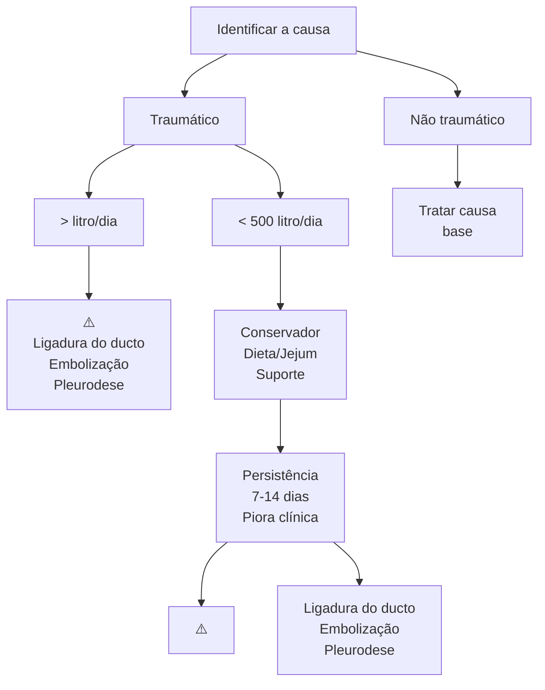
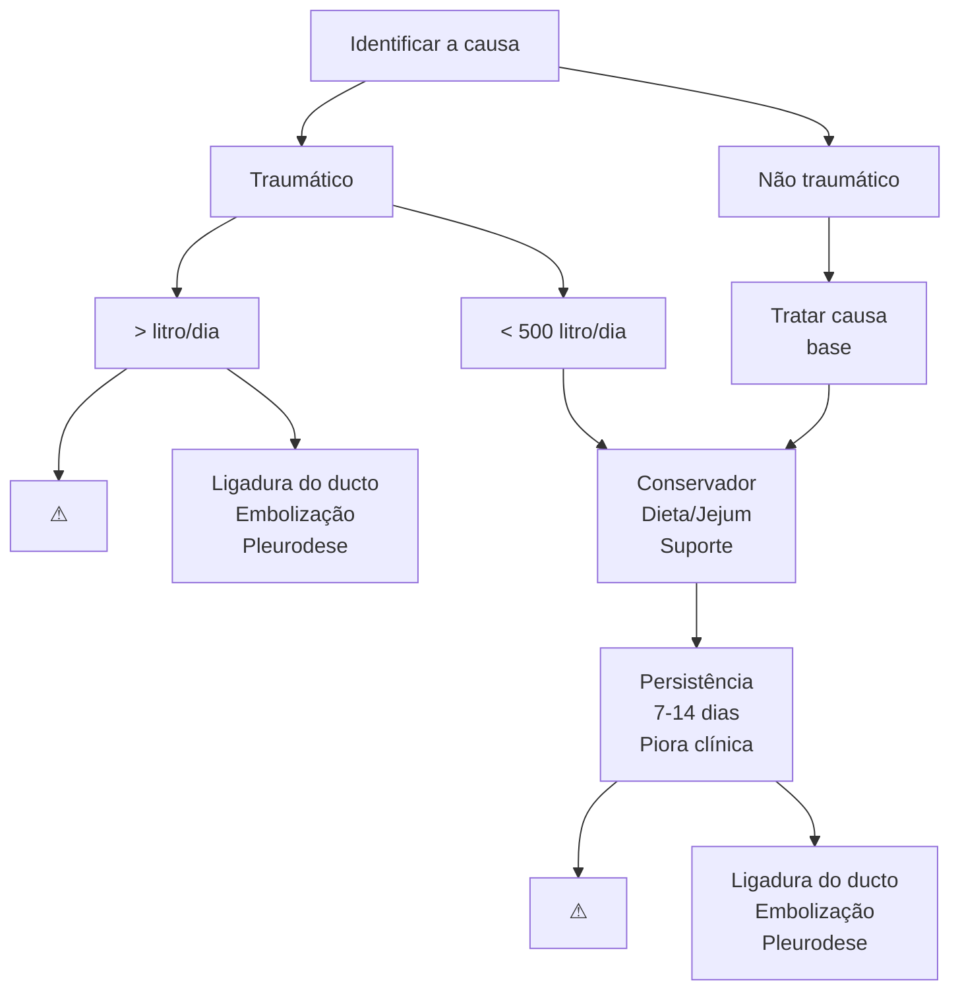

Outros temas em Cirurgia Torácica

# CIRURGIA TORÁCICA: QUILOTÓRAX

## 1. SISTEMA LINFÁTICO

### 1.1 FORMAÇÃO DO SISTEMA LINFÁTICO:

• 6ª semana: formam-se os sacos linfáticos jugular, axilar e sacro-ilíaco;

• Estruturas em pares (para conectar o sacro-ilíaco aos demais):
  • Parte inferior do tronco direito;
  • Parte superior do tronco esquerdo;
  • União ao nível de T4-T6.

• Sacos linfáticos dão então origem aos linfonodos.

### 1.2 DUCTO TORÁCICO:

• Via expressa que leva toda a linfa do intestino (quilo) para a circulação sanguínea;

• Tamanho: 38-45 cm; diâmetro: 0,5 – 1 cm;

• Origem em L2 – cisterna do quilo; penetra pelo hiato aórtico; término na base do pescoço – V. subclávia esquerda;

• Ocorrem variações anatômicas em até 50% das pessoas, principalmente variações com ductos torácicos acessórios;

• Cruza da direita para a esquerda ao nível de T4-T5;

• Transporta 70% da gordura dos intestinos (quilo) para a circulação sanguínea;

• 2,4L por dia.

• Características:
  • Contém proteínas, vitaminas e eletrólitos;
  • Estéril e bacteriostático – **por ser bacteriostático, os pacientes com quilotórax apresentam pouco empiema.**

• Contém linfócitos e imunoglobulinas:
  • O paciente que perde quilo, provavelmente vai ter baixa imunidade, distúrbios de coagulação etc.

## 2. DEFINIÇÃO DE QUILOTÓRAX

• Acúmulo de conteúdo linfático na cavidade pleural.

### 2.1 CONSEQUÊNCIAS:

• Desnutrição severa;

• Distúrbios eletrolíticos;

• Imunossupressão;

• Sepse;

• Coagulopatia.

• Quilotórax tem baixo índice de evolução para empiema? Cuidado com essa questão, pois o quilotórax infecta, porém há baixo risco de formação de empiema. Todavia, há alto risco de infecções (sepse – pulmão, trato urinário).

TORÁCICA

## 3. ETIOLOGIA

### 3.1 TRAUMÁTICA:
• Iatrogênica;
• Cirurgia torácica (inc: 0,2-0,4%);
• Esofagectomia (inc: 4-5%).

### 3.2 NÃO TRAUMÁTICA:
• Linfoma (70%);
• Cirrose hepática;
• Linfangioleiomiomatose (inc:66%);
• Doença de Gorham (inc:17%).
  • ATENÇÃO! Pacientes pediátricos pós cirurgia cardíaca, com quadro de dispneia sub-aguda pensar em quilotórax:
    • Cirurgia cardíaca (Glenn ou Fontan)! Não é um hemotórax, é um quilotórax!! Nas cardiopatias congênitas, há um aumento da pressão venosa central, aumentando a pressão da subclávia esquerda, competindo com a pressão linfática e o ducto torácico. Devido a esse aumento de pressão, o ducto torácico tem dificuldade de drenar para a subclávia, acarretando extravasamento da linfa para o terceiro espaço.

**Figura 1** Quilotórax

## 4. DIAGNÓSTICO

### 4.1 LABORATORIAL:
• O aspecto será quiloso em apenas 50% dos casos, portanto somente análise macroscópica não é fiel;
• QUILOMÍCRONS = é patognomônico de quilotórax (muito pouco disponível nos hospitais);

**Figura 2** TRATAMENTO - Quilotórax

CIRURGIA TORÁCICA: QUILOTÓRAX                                                                                           3

• Triglicerídeos > 110mg/dl (sensibilidade e especificidade suficientes para diagnóstico);
• Colesterol < 200mg/dl (sensibilidade e especificidade suficientes para diagnóstico).

## 4.2 DIAGNÓSTICO DIFERENCIAL:
• PRINCIPAL DIAGNÓSTICO DIFERENCIAL = PSEUDOQUILOTÓRAX (artrite reumatoide);
  • Líquido rico em CRISTAIS DE COLESTEROL = patognomônico;
  • Triglicerídeos < 50mg/dl (sensibilidade e especificidade suficientes para diagnóstico);
  • Colesterol > 200mg/dl (sensibilidade e especificidade suficientes para diagnóstico).
• Sempre correlacionar com os dados da anamnese, como: idade, condição clínica, fatores de risco, duração.

## 5. TRATAMENTO

• SEMPRE DO MENOS INVASIVO PARA O MAIS INVASIVO!

### 5.1 TRATAMENTO CONSERVADOR:
• Inicia com jejum;
• Tratar desidratação, perda dos fatores de coagulação, anticorpos, imunoglobulina etc;
• Dieta hipogordurosa com triglicerídeos de cadeia média.

### 5.2 DRENAGEM TORÁCICA:
• Objetivo de controle de sintomas respiratórios;
• Risco de infecção, distúrbios hidroeletrolíticos e desnutrição.

## 6. ETAPAS DO TRATAMENTO INTERVENCIONISTA

• LINFOCINTILOGRAFIA – identificar de onde está ocorrendo o extravasamento de quilo → causas não iatrogênicas ou iatrogênicas não claras;
• RESSONÂNCIA MAGNÉTICA ou CINEANGIORESSONÂNCIA;
• LINFOGRAFIA – diagnóstica e terapêutica (embolização):
  • É feita a linfografia com cateterização de cisternas;
  • Navegação é feita pelo ducto torácico e permite realizar liberação de molas e aplicação de cola (embolizar).
• LIGADURA DO DUCTO TORÁCICO:
  • Somente se não tiver a linfografia ou se ela não resolver;
  • Cirúrgica e por vídeo-toracoscopia;
  • Não pode ter dúvidas quanto ao extravasamento do líquido no ducto torácico, tem que ter certeza que não é acima, pois em pacientes com ascite quilosa podem complicar, pois o extravasamento de quilo para o abdome será ainda maior!
