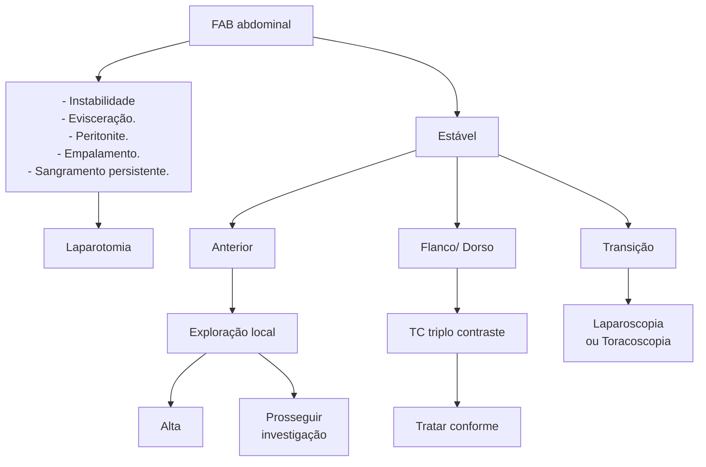
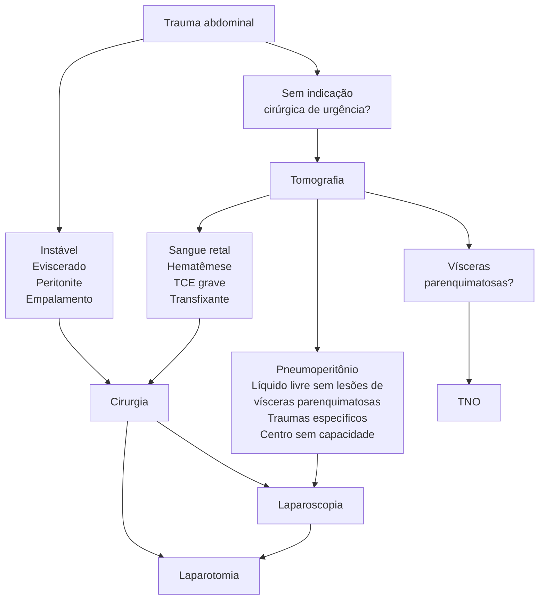
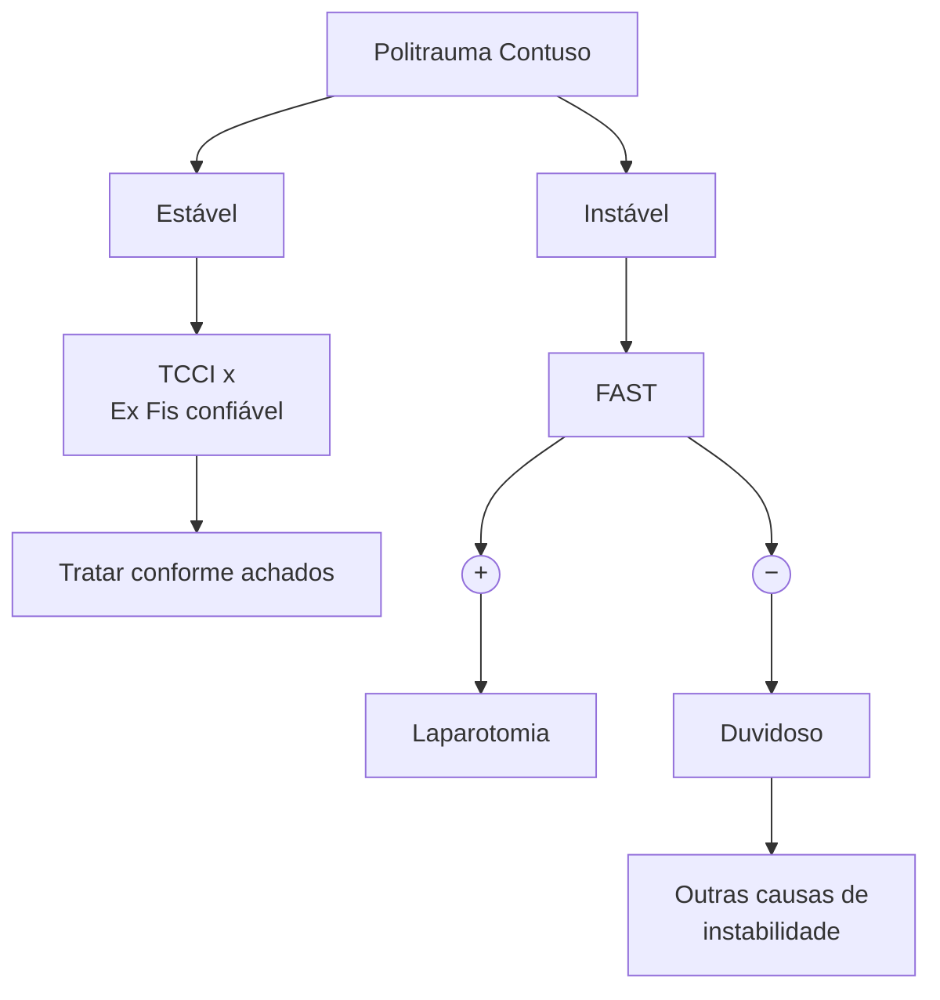

# TRAUMA: TRAUMA ABDOMINAL PENETRANTE



## 1. DIVISÃO ANATÔMICA DO ABDOME

**Figura 1** Divisão anatômica do abdome.
- **Verde:** transição toracoabdominal;
- **Azul:** flanco;
- **Laranja:** dorso;
- **Cor de pele:** anterior.

**Tabela 1** Mecanismo de Trauma: penetrante vs. contuso

| Penetrante                                                                                                                 | Contuso                                                              |
| -------------------------------------------------------------------------------------------------------------------------- | -------------------------------------------------------------------- |
| 20% (FAB ou FAF)                                                                                                           | 80% (acidentes automobilísticos)                                     |
| Tiro, facada, empalamento                                                                                                  | Desaceleração, compressão, esmagamento, cisalhamento                 |
| FAB → Fígado 40% / Delgado 30% / Diafragma 20% / Cólon 15%
FAF → Delgado 50% / Cólon 40% / Fígado 30%
Vascular 25% | Baço 50% / Fígado 40% / Delgado 10%                                  |
| Diagnóstico + fácil → exame físico                                                                                         | Diagnóstico + desafiador → FAST/TC
Associado a múltiplos traumas |

## 2. CONCEITOS INICIAIS

**Trauma muito comum**

**Causa prevenível de morte**
- Sempre começar com um ABCDE bem-feito;
- Diagnosticar e tratar precocemente o trauma abdominal relevante tem um impacto significativo na mortalidade.

**Mecanismo de trauma**
- Penetrante;
- Contuso.

## 3. TRAUMA ABDOMINAL PENETRANTE

### 3.1 PROBLEMAS
- Acometem múltiplas estruturas;
- Lesões que causam sangramento grave;
- Áreas abdominais acometidas e trajetos variam muito.

### 3.2 QUANDO OPERAR?
- Instabilidade hemodinâmica;

CIRURGIA GERAL

• Peritonite clara e persistente;
• Empalamento;
• Evisceração;
• Lesões órgão-específicas;
• Líquido livre sem lesões de vísceras ocas;
• Ferimentos transfixantes.

## 4. FERIMENTO PENETRANTE POR ARMA BRANCA

Faca, peixeira, lança, objeto cortante, espada etc.

### 4.1 É CIRÚRGICO?

**Laparotomia, se apresentar algo abaixo:**
• Peritonite clara e persistente;
• Instabilidade hemodinâmica: não respondedor;
• Hematêmese e sangue retal;
• Empalamento;
• Evisceração.

### 4.2 NÃO É CIRÚRGICO?

• Qual região foi acometida?

**Abdome anterior – exploração local**
• Antissepsia e assepsia;
• Limpeza;
• Anestesia local;
• Procedimento estéril;
• Ampliação do ferimento;
• Não enfiar objetos às cegas.

**Avaliação local negativa**
• Analgesia;
• Sutura estéril;
• Avaliação secundária.

**Figura 2**

**Avaliação local positiva ou duvidosa**
• As recomendações são conflitantes com base em cada paciente, por isso devemos avaliar caso a caso. Nessas situações, podemos abrir mão de laparotomia, laparoscopia, tomografia, exame físico seriado e exames laboratoriais.

**Lesão em flanco e dorso e paciente sem indicação cirúrgica**
• Tomografia triplo contraste: regiões mais protegidas por musculatura, mais espessa; não dá para realizar efetivamente a exploração local; tratar conforme as lesões encontradas.

**Ferimento na transição toracoabdominal (revisar aula de trauma torácico)**
• Toracoscopia e/ou videolaparoscopia. **Figura 2**

## 5. FERIMENTO PENETRANTE POR ARMA DE FOGO (FAF)

• Revólver, espingarda, metralhadora, bazuca etc.

**É cirúrgico? Laparotomia, se apresentar algo abaixo:**
• Peritonite clara e persistente;
• Instabilidade hemodinâmica: não respondedor;
• Hematêmese e sangue retal;
• Transfixante;
• Evisceração.

**Não é cirúrgico de urgência? Considerar tomografia**
• FAF sem indicação cirúrgica de urgência → Tomografia com contraste;
• Avaliar trajeto;
• Considerar tratamento não operatório;
• Preparo para cirurgia → Laparoscopia? **Figura 3**

**Trauma abdominal penetrante – Tomografia**
• Pacientes estáveis – laparoscopia;
• Ferimentos tangenciais – observação;
• Ferimentos específicos – observação.


**Figura 2** fluxograma – FAB abdominal

TRAUMA ABDOMINAL PENETRANTE

## Atendimento Primário → C

```mermaid
flowchart TD
    A[Ferimento penetrante por
arma de fogo?] -->|Sim| B[É cirúrgico?]
    A -.->|Nota| A1[Revólver, espingarda,
metralhadora, bazuca, etc...]
    B -->|Não| C[Laparotomia X TC**]
    B -.->|Nota| B1[• Peritonite clara e persistente;
• Instabilidade, não respondedor;
• Hematêmese, sangue retal;
• Transfixante*; Evisceração.]
    C -->|Sim| D[Continua]
    C -.->|Nota| C1[1° Exame físico: excluir "raspão"]
```

**Figura 3** fluxograma ferimento por arma de fogo

# TRAUMA: TRAUMA ABDOMINAL CONTUSO



## 1. TRAUMA ABDOMINAL CONTUSO

### Problemas
- Associado a múltiplos traumas;
- Difícil diagnóstico, merece alta suspeição;
- Pode se apresentar de maneira silenciosa no início.

No atendimento primário, devemos inferir se o paciente apresenta ou não trauma abdominal.

### Trauma abdominal presente
- Focar em sangramento abdominal e observar:
  - Exame físico confiável (dor, equimose);
  - FAST +;
  - Sinal do cinto de segurança;
  - História muito clara.

### Em caso de trauma abdominal presente
- Nossa próxima pergunta deve ser: é cirúrgico?
  - Peritonite clara e persistente;
  - Instabilidade;
  - Não respondedor;
  - Hematêmese, sangue retal.

### Em caso de trauma cirúrgico de urgência
- Laparotomia:
  - Se não, podemos abrir mão da realização de tomografia.

### Trauma abdominal descartado com segurança

- Continuar atendimento e manter observação seriada, com exames laboratoriais:
  - Exame físico negativo;
  - Ausência de confusão mental e/ou TRM.

### Não consigo descartar com segurança
- Exame físico duvidoso ou paciente mantém instabilidade sem outras causas evidentes:
  - Tomografia, ou até mesmo considerar laparotomia em casos específicos.
  - FAST falso negativo - Pode ser sinal de lesão de retroperitonio;
  - Atenção a progressão de lesão.

### Quando considerar a tomografia?
- Sempre que o paciente estiver estável, vamos preferir a realização desse exame de imagem, diante de suspeita clínica de trauma abdominal:
  - Principalmente se passou por trauma de mecanismo de alta energia; Apresentar sinal do cinto de segurança; Fratura de fêmur ou pelve; alterações laboratoriais ou sinais clínicos (dor ou sintensão abdominal);
  - A tomografia computadorizada é ruim para avaliar diafragma e vísceras ocas diretamente.

### Quando operar no trauma abdominal contuso?
- Instabilidade hemodinâmica;
- Peritonite clara e persistente;
- Essas duas são indicações absolutas, as outras indicações devem ser avaliadas no contexto de cada paciente (ou de cada questão): pneumoperitônio;

CIRURGIA GERAL

hematêmese, sangue retal; hérnia diafragmática; lesões órgão específicas; líquido livre intra-abdominal sem lesões de vísceras parenquimatosas:
• Contraindicações à laparoscopia: instabilidade, peritonite difusa e traumas graves.

## 2. POLITRAUMA CONTUSO – RESUMÃO

### 2.1 ESTÁVEL HEMODINAMICAMENTE
• Tomografia de corpo inteiro + exame físico confiável;
• Tratar conforme os achados.

### 2.2 INSTÁVEL HEMODINAMICAMENTE
**FAST +**
• Laparotomia:

**FAST – / FAST duvidoso**
• Outras causas de instabilidade;
• Não achei outras causas:
  • FAST confiável?
  • Laparotomia.
• Laparotomia no trauma em paciente instável hemodinamicamente com sangramentos de difícil controle, principalmente em órgãos que não podem ser retirados com facilidade, deve ser realizada através da estratégia de controle de danos:
  • 1º tempo → controlar infecções e sangramentos com cirurgias curtas → fechamento temporário;
  • 2º tempo → controle da tríade letal (hipotermia, acidose e coagulopatia) em UTI;
  • 3º Tempo → Revisão cirúrgica em 48/72h → tratamento definitivo. **Figura 1**



**Figura 1** fluxograma politrauma contuso

Trauma Abdominal

# TRAUMA: TRAUMA ABDOMINAL ESPECÍFICO - PARTE 1

## Tratamento não operatório

- Centro de referência → Com UTI e cirurgião 24 horas;
- Tomografia e diagnóstico preciso;
- Banco de Sangue, laboratório, radiologia; endoscopia;
- Se possível, radiologia intervencionista – Arteriografia S/N;

- Centro cirúrgico capacitado 24 horas;
- Ausência de indicações cirúrgicas;
- Monitorização, exame físico e controle laboratorial;
- Ausência de lesões associadas (TCE);
- Avaliar bem paciente e lesão.

## 1. TRAUMA ABDOMINAL ESPECÍFICO

### 1.1 QUANDO PRECISO OPERAR?

- Instabilidade hemodinâmica e/ou não respondedor com piora clínica;
- Traumas de alto grau;
- Sangramento persistente;
- Lesões associadas graves;
- Peritonite persistente;
- Presença de outras lesões cirúrgicas;
- Centro sem capacidade para tratamento não operatório;
- Falha do tratamento não operatório.

### 1.2 QUANDO POSSO NÃO OPERAR O DOENTE?

- Centro de referência:
  - Com UTI e cirurgião 24 horas.
- Tomografia e diagnóstico preciso;
- Banco de sangue, laboratório, radiologia e endoscopia;
- Se possível, radiologia intervencionista – Arteriografia S/N;
- Centro cirúrgico capacitado 24 horas;
- Ausência de indicações cirúrgicas;
- Monitorização, exame físico e controle laboratorial;
- Ausência de lesões associadas (TCE);
- Avaliar bem o paciente e a lesão.

### 1.3 QUEM SE BENEFICIA MAIS DO TRATAMENTO NÃO OPERATÓRIO?

- Pacientes com lesão, principalmente em vísceras parenquimatosas, como: fígado; baço; pâncreas; rim e adrenal; hematomas e contusões; bexiga extra-peritoneal;
- Quais são os pacientes que não vão se beneficiar de tratamento não operatório?
  - Vísceras ocas → pode cursar com pneumoperitônio, perfuração etc;
  - Diafragma → hérnia diafragmática;
  - Vasos → sangramento ativo;
  - Bexiga intraperitoneal → urina. Normalmente esses são achados intraoperatórios indiretos.

## 2. FÍGADO

- Órgão muito lesado no trauma;
- A sociedade americana de trauma classifica as lesões hepáticas em graus de I a VI; quanto maior o grau, mais grave é o trauma;
- A maioria das lesões são leves (graus I a III)

- Em cerca de 80% das vezes há outras lesões associadas;
- Até grau V é possível ser conservador;
- O tratamento cirúrgico apresenta alta mortalidade;
- Hepatectomia é exceção – sangra mais, demora, é a exceção da exceção, o mais comum é a realização ou de tratamento não operatório ou cirurgia de controle de danos;
- Paciente estável: TC e classificação.

**Achado intraoperatório → indiquei laparotomia na urgência**

- Fazer evisceração das alças + tamponamento com compressas + luxação hepática (secção dos ligamentos hepáticos) → o objetivo é a hemostasia;
- Manobra de Pringle: Clampeamento do hilo hepático para descobrir a origem do sangramento:
  - Se parar o sangramento → originário do fígado ou da veia hepática. - Considerar ligadura de artéria hepática ou ramos;
  - Se não parar de sangrar → originário da cava retro-hepática → lesão grave com mortalidade > 95%.
    - Conduta: Clampeamento de aorta; Shunt átrio-caval; Endoprotese.

**Paciente estava estável e consegui realizar a tomografia, então, vamos classificar as lesões.**

### 2.1 CLASSIFICAÇÃO:

**Grau I**
- Hematoma subcapsular < 10% de superfície;
- Laceração < 1 cm;
- Tratamento conservador.

**Grau II**
- Hematoma subcapsular 10-50%;
- Laceração 1-3 cm;
- Tratamento conservador.

**Grau III**
- Hematoma subcapsular > 50% de superfície;
- Hematoma intraparenquimatoso > 10 cm;
- Laceração > 3 cm ou sangramento ativo em parênquima;
- Tratamento conservador, podendo abrir mão da arteriografia com embolização.

**Grau IV**
- Laceração entre 25-75% até 3 segmentos;
- Sangramento ativo para cavidade peritoneal;
- Tratamento conservador, se o centro de referência for apto: arteriografia e embolização; UTI; especialistas.

**Grau V**
- Laceração > 75% ou 3 segmentos;
- Lesão vascular (VCI, hepática);

CIRURGIA GERAL

• Tratamento conservador, se: arteriografia e embolização; endovascular; centro de referência e tudo disponível.

**Grau VI**
• Avulsão hepática;
• Normalmente, óbito;
• Considerar transplante hepático de urgência.

## 2.2 POSSÍVEIS COMPLICAÇÕES DO TRAUMA HEPÁTICO

• Falha do tratamento não operatório; sangramento, hematoma, abscessos, necrose; bilioma e fístula biliar; IRA; infecções; coagulopatia;
• Devemos repetir a tomografia em casos graves e/ou com piora clínica suspeita.

## 3. VIAS BILIARES EXTRA-HEPÁTICAS

• Acometimento muito raro, mais comum no trauma penetrante;
• Se presente, realizar coledocoplastia ou derivação biliodigestiva.

## 4. BAÇO

• Órgão mais lesado no trauma contuso;
• Função:
  • Opsonização de microrganismos encapsulados.
• Alta suspeita se fraturas de costelas à esquerda;
• Menos tolerância para tratamento conservador, porque o tratamento cirúrgico é rápido e fácil;
• Esplenectomia parcial e rafia é exceção;
• Achado intraoperatório → indiquei laparotomia de urgência:
  • Esplenectomia total → quase sempre;
  • Rafia e hemostasia local → Grau I e II;
  • Esplenectomia parcial – alto risco de sangramento.

**Paciente estava estável, então vamos realizar a tomografia e classificar a lesão**

### 4.1 CLASSIFICAÇÃO

**Grau I**
• Hematoma subcapsular < 10%;
• Laceração < 1 cm;
• Tratamento conservador.

**Grau II**
• Hematoma subcapsular 10-50%;
• Laceração 1-3 cm;
• Tratamento conservador.

**Grau III**
• Hematoma roto ou em expansão;
• Laceração de vasos trabeculares;
• Tratamento conservador se arteriografia disponível.

**Grau IV**
• Sangramento ativo;
• Laceração com desvascularização;
• Tratamento conservador se arteriografia disponível – embora a maioria dos cirurgiões vai proceder com a esplenectomia.

**Grau V**
• Fragmentação completa;
• Avulsão esplênica;
• Laparotomia com esplenectomia.

### 4.2 SEGUIMENTO PÓS-ESPLENECTOMIA

• Vacinação após 14 dias contra germes encapsulados, como: Haemophilus, Streptococcus, Neisseria;
• Possíveis complicações no pós-operatório → Sangramento, abscessos e infecções.

## 5. PÂNCREAS

• Trauma raro pois é um órgão retroperitoneal, relacionado comumente a traumas contusos de alta energia que podem cursar com as fraturas de Chance, podendo cursar com evolução tardia;
• Amilase não é fidedigna;
• Perceber as regiões da lesão:
  • Lesões na cabeça do pâncreas são mais graves que as lesões na cauda.

**Achado intraoperatório → indiquei laparotomia de urgência.**

• Hematoma de retroperitônio na zona I;
• Secção do ligamento gastrocólico e manobra de Kocher para permitir a visualização do pâncreas;
• A avaliação do grau de lesão, nesses casos, deve ser feita no intraoperatório;
• Se possível, pancreatografia intraoperatória;
• Principais suspeitas de trauma pancreático:
  • Achados na tomografia, quadro clínico típico, elevação persistente de enzimas pancreáticas → realizar CPRE.

**Paciente estável, consegui realizar a tomografia, vamos classificar**

### 5.1 CLASSIFICAÇÃO

**Grau I**
• Hematoma, contusão mínima;
• Laceração mínima;
• Observação.

**Grau II**
• Contusão maior;
• Laceração maior;
• Drenagem;
• Achado intraoperatório → Hemostasia/rafia + jejum + SNE + exames seriados.

**Grau III**
• Transecção de parênquima distal (esquerda da veia mesentérica superior);
• Pancreatectomia distal + drenagem + avaliação do baço.

**Grau IV**
• Transecção proximal;
• Discutir abordagem com damage control ou com gastroduodenopancreatectomia (GDP deve ser exceção), a depender do status do paciente. Assim como no Grau V.

**Grau V**
• Ruptura da cabeça do pâncreas;

TRAUMA: TRAUMA ABDOMINAL ESPECÍFICO - PARTE 1                                                                    3

## 5.2 RESUMÃO

• Cauda pancreática sem lesão ductal:
  • Desbridamento, rafia e observação.
• Cauda pancreática com lesão ductal:
  • Pancreatectomia do corpo ductal.
• Cabeça pancreática sem lesão ductal:
  • Desbridamento, rafia e observação.
• Cabeça pancreática com lesão ductal:
  • Controle de danos e rebordagem controlada.

## 5.3 SEGUIMENTO

• Cuidados:
  • Manter jejum, considerar SNE e nutrição precoce;
  • Avaliação seriada, CPRE na dúvida; TC de controle.
• Complicações: Fístula (30%) – por isso, drenagem quase sempre:
  • Baixo débito = < 200 ml/dia: Fecha sozinha;
  • Alto débito = > 500 ml/dia: CPRE ou cirurgia.

## 6. TRATO GASTROINTESTINAL ALTO

• Esôfago, estômago e duodeno;
• Trauma raro, sendo mais comum no trauma penetrante;
• Suspeitar quando:
  • Pneumoperitônio – fazer laparotomia exploradora ou laparoscopia;
  • Sangue na sonda nasogástrica ou achados na tomografia;
  • Podemos abrir mão da endoscopia digestiva alta.

**Achado intraoperatório → indiquei laparotomia de urgência**

• Como fazer:
  • Inspeção completa, parede anterior e posterior;
  • Na dúvida → irealizar teste do borracheiro;
  • Lavagem da cavidade;
  • Procura ativa de demais lesões;
  • Hematomas pequenos → observar.

### 6.1 ESÔFAGO

• Dependendo do grau de lesão, podemos proceder com: rafia primária; reforço com fundoplicatura; drenagem; gastrostomia ou jejunostomia;
• Esofagectomia e gastrostomia em casos graves;
• Paciente pode apresentar disfagia, sialorreia, saliva pelo ferimento;
• É um trauma raro;
• 98% dos assintomáticos não apresentam lesões;
• EDA é o melhor exame para o alto risco.

### 6.2 ESTÔMAGO

• Lesões menores que 03cm podem ser rafiadas em 2 planos;
• Lesões maiores → gastrectomias subtotais;
• Se reconstruir → realizar drenagem ampla, pois a anastomose é de risco.

### 6.3 DUODENO

• Raciocínio parecido com trauma de cabeça de pâncreas;

• Lesão pequena → rafia em 2 planos, fecha e realiza drenagem ampla;
• Se necessário, derivação para desvio do trânsito – (Vaughan – Exclusão pilórica + duodenorrafia);
• GDP é exceção – destruições.

## 7. TRATO GASTROINTESTINAL BAIXO

• Delgado, cólon e reto;
• Mais comum no trauma penetrante;
• Em traumas contusos devemos ter um alto índice de suspeição:
  • Sinal do cinto de segurança;
  • Fratura de chance;
  • Líquido livre sem lesão de vísceras parenquimatosas;
  • Pneumoperitônio;
  • Queda de tanque em tronco/guidão de bicicleta;
  • Hematoma de meso, alterações de parede de alça;
  • Toque retal com sangue;
  • Na dúvida, laparoscopia diagnóstica.
• Achados.

### 7.1 CÓLON

• Damage control = sepultamento e revisão;
• Lesões pequenas – rafia;
• Lesões grandes – colectomia segmentar e anastomose primária;
• Colostomia em casos muito graves sem indicação de damage control.

### 7.2 RETO

• Pacientes estáveis, sem suspeita de outras lesões intra-abdominais → pode-se considerar retossigmoidoscopia;
• Difícil acesso, difícil manejo;
• Reto intraperitoneal – semelhante ao cólon:
  • Lesões puntiformes/pequenas: rafia em 2 planos;
  • Lesões maiores: rafia em 2 planos; Drenagem local; colostomia em alça; lavagem do coto distal.
• Reto extraperitoneal – acesso direto e difícil:
  • Acesso fácil via transabdominal? Mesma coisa do reto intraperitoneal;
  • Acesso difícil? Considerar acesso via perineal/retal ou não acessar; drenar e realizar ostomia + lavagem.
• 4 Ds do trauma de reto:
  • Desbridamento;
  • Deriva (colostomia);
  • Drenagem;
  • Distal lavagem.

## 8. TRAUMA UROLÓGICO

• Renal → muito mais comum no trauma contuso, tentar ser conservador o máximo possível, podendo-se abrir mão de arteriografia e duplo J;
• Ureter → bem raro, geralmente apresentando sintomas tardios;
• Bexiga;

• Extraperitoneal = SVD;
• Intraperitoneal = Cirurgia.

## 9. TRAUMA VASCULAR

• Mais comum no trauma penetrante;
• Devemos realizar controle temporário e, se vaso grande lesado, realizar controle proximal e distal;
• Shunt temporário/ligadura.

**Como acessar o retroperitônio em uma cirurgia? Retroperitônio (dividido em 3 zonas)**

• Zona I:
  • Aorta;
  • Cava inferior;
  • Origem das veias renais;
  • Duodeno;
  • Pâncreas.
• Zona II:
  • Adrenais;
  • Rins;
  • Veias renais;
  • Ureteres;
  • Cólon ascendente.
• Zona III:
  • Pelve.

## 10. TRAUMA RETROPERITONEAL

• Sintomatologia frustra, devemos ter uma alta suspeita;
• Contuso mais comum; zona II mais comum;
• Pode ser causa de instabilidade hemodinâmica oculta → FAST negativo em ⅓:
  • Paciente instável sem causa aparente: LE;
  • Paciente estável: AngioTC e tratar conforme achados.

### 10.1 HEMATOMA DE RETROPERITÔNIO

• Achado de imagem:
  • Pacientes estáveis sem indicação de cirurgia por outras causas podem ser tratados de forma conservadora, a princípio.
• Achado intraoperatório:
  • Quando for indicada cirurgia, a necessidade de exploração do hematoma ou não depende da zona e do mecanismo do trauma.

### 10.2 TRAUMA PENETRANTE

• Zona I:
  • Explorar.
• Zona II → depende da estrutura lesada:
  • Rins – explorar sangramento ativo;
  • Cólon – precisa rodar e excluir lesão;
  • Ureter – se tiver lesão próxima, explorar;
  • Manejo pode ser conservador, considerar angiotomografia.
• Zona III:
  • Explorar;
  • Considerar arteriografia.

### 10.3 TRAUMA CONTUSO

• Zona I:

• Explorar.
• Zona II:
  • Apenas intervir em hematoma em expansão ou em falha de tratamento.
• Zona III:
  • Não explorar:
  • Raciocínio de trauma de pelve.

### 10.4 MANOBRAS CIRÚRGICAS

**Mattox → rotação das vísceras da esquerda para direita**

• Acesso das zonas I e II à esquerda, para medial;
• Rotação medial do cólon;
• Luxação esplênica e da cauda do pâncreas;
• Luxação renal, se necessária;
• Tração medial do esôfago, se necessário;
• Acesso à aorta desde o diafragma até sua bifurcação;
• Quando o hematoma é grande, já faz o trabalho por você.

**Figura 1** Manobras cirúrgicas de acesso ao retroperitônio Matrox

**Figura 2** Manobras cirúrgicas de acesso ao retroperitônio Matrox

**Cattel-Brasch → rotação das vísceras para direita.**

• Acesso da zona II à direita, para medial;
• Rotação medial do cólon;
• Manobra de Kocher associada: Rotação medial do duodeno; luxação renal, necessária; acesso à veia cava, vasos mesentéricos, duodeno e cabeça do pâncreas.

TRAUMA: TRAUMA ABDOMINAL ESPECÍFICO - PARTE 1                                                                                                                                     5

**Figura 3** Manobras cirúrgicas de acesso ao retroperitônio Cattel Braasch
