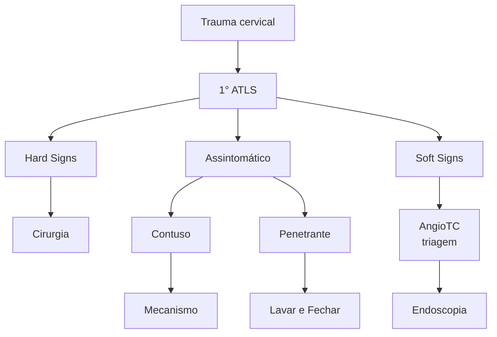
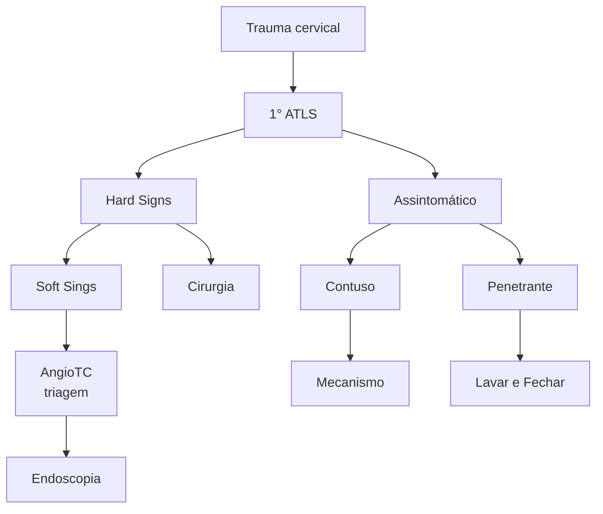

# TRAUMA CERVICAL

## 1. INTRODUÇÃO

- Responde por até 5 a 10% de todos os traumas;
- Alta morbimortalidade: acomete estruturas nobres;
- Pode acometer principalmente 5 sistemas:
  - Vascular;
  - Respiratório;
  - Digestivo;
  - Neurológico/Ósseo;
  - Endócrino.
- Não há consenso na literatura, então vamos observar múltiplas abordagens diferentes:
  - Contuso e penetrante;
  - Abordagem por zonas;
  - Sintomas x assintomático;
- Quanto ao mecanismo de trauma:
  - Penetrante: é o mais estudado, geralmente por FAB ou FAF;
  - Contuso: mais raro, comumente associado a acidentes automobilísticos e enforcamento, acomete a coluna cervical. Raramente causa lesões graves.

**Figura 1** Ilustração: zonas cervicais no trauma.

[Anatomical illustration showing cervical zones labeled as Zona III (upper), Zona II (middle), and Zona I (lower) on a lateral view of the skull and cervical spine]

## 2. ZONAS CERVICAIS NO TRAUMA (1, 2 E 3, DE BAIXO PARA CIMA)

- Confira Figura 1
- **Zona 1:**
  - Fúrcula esternal até cartilagem cricóide.
- **Zona 2:**
  - Cartilagem cricóide até ângulo da mandíbula.
- **Zona 3:**
  - Ângulo da mandíbula até a base do crânio.

## 3. TRAUMA CERVICAL → HARD SIGNS (SINAIS DE EMERGÊNCIA, E DE GRAVIDADE)

- Hemorragia incontrolável;
- Hematoma em expansão ou pulsátil;
- Hemoptise ou hematêmese massiva;
- Choque;
- Insuficiência respiratória: tiragem, agitação, cianose, taquidispneia;
- Déficit neurológico compatível com isquemia cerebral, ausência de pulso;
- Ferida "soprante".

CIRURGIA GERAL

## 4. TRAUMA CERVICAL → *SOFT SIGNS* (SINTOMAS MODERADOS)

• Hemorragia pequena;
• Hematoma não expansivo/pulsátil;
• Hemoptise ou hematêmese pequena;
• Hipotensão responsiva a volume;
• Enfisema subcutâneo;
• Disfonia;
• Disfagia.

## 5. COMO MANEJAR/QUANDO OPERAR TRAUMA CERVICAL?

• 1º sempre o ABCDE/ATLS;
  • Controle de via aérea → atenção redobrada.
• Manejo varia conforme zonas, sintomas e apresentação. Existem vários fluxogramas propostos.

## 5.1 DE MANEIRA GERAL

• *Hard Signs* → intervenção cirúrgica;
• *Soft Signs* → AngioTC de triagem para definição de conduta.
• Se a angiotomografia for inconclusiva, orientar-se por zonas:
  • Zona 1: investigar melhor; podemos abrir mão de angiograma, esofagograma, endoscopia, laringoscopia etc;
  • Zona 2: cirúrgico;
  • Zona 3: arteriografia.

## 5.2 MANEJO CIRÚRGICO

• Nunca explorar ferida fora do centro cirúrgico;
• Se for operar, realizar cervicotomia ampla acompanhando ECM:
  • Zona I → Esternotomia/Toracotomia;
  • Zona III → Luxação de mandíbula;
  • Em caso de sangramentos profusos, passar sonda Foley para tamponar sangramento até chegar no centro cirúrgico.

# TRAUMA: TRAUMA CERVICAL ESPECÍFICO

## 1. TRAUMA CERVICAL – VIAS AÉREAS

• Urgência = IOT ou cricotireoidostomia;
• Sintomas: estridor, insuficiência respiratória, rouquidão, enfisema subcutâneo, ferida soprante, hematoma, equimose local;
• Raro mais frequentemente contuso. Maioria de tratamento cirúrgico;
• Pequenos e iatrogênicos → raramente conservador;
• 1º passo: garantir via aérea definitiva;
• 2º passo: cirurgia ou broncoscopia, se possível.

### 1.1 LARINGE

• Enforcado, sinais de equimose em região cervical, fratura palpável;
• Tríade de apresentação: fratura palpável, rouquidão e enfisema subcutâneo;
• Contraindicação relativa à intubação e a cricotireoidostomia.

### 1.2 ESÔFAGO

• Apresentação clínica: disfagia, sialorreia, saliva pelo ferimento;
• Trauma raro;
• A maioria dos pacientes assintomáticos – 90% – não apresenta lesão;
• Alto risco. Endoscopia é o melhor exame;
• Se lesão → cirurgia precoce;
• Se < 24h:
  • Desbridamento + limpeza com SF + rafia primária + interposição retalho muscular (evitar fístula T.E.) + drenagem;
  • Considerar tubo T.
• Se > 24h:
  • Esofagostomia + gastrostomia + toracotomia.

### 1.3 VASCULAR

• Instável = cirurgia;
• Estável = AngioTC → arteriografia e endovascular;
• Pequenos vasos – controle rigoroso de hemostasia;
• Tentar reparos, se estável;
• Ligadura de quase todos os vasos, se necessário;
• Menos carótida interna → alguns estudos já falam sobre a ligadura de carótida interna em casos extremos.

### 1.4 *SCREENING*

• Assintomáticos → quando fazer angio TC cervical/pescoço?
  • Fratura com desvio *Le Fort* II ou III;
  • Fratura de mandíbula;
  • Fratura de base de crânio;
  • Imagem sugestiva de LAD com ECG < 6;
  • TRM cervical;
  • Tentativa de enforcamento;
  • Sinal do cinto de segurança;
  • Mecanismo compatível com hiperextensão + rotação / flexão;
• Alguns protocolos recomendam, mesmo com a AngioTC, realizar endoscopia e broncoscopia – por ser mais específico.
