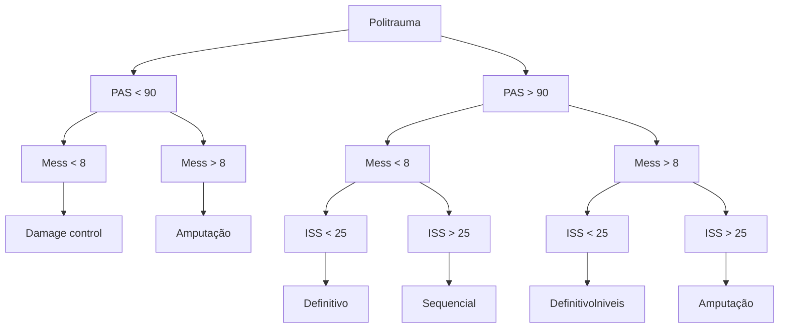

# TRAUMA: TRAUMA MUSCULOESQUELÉTICO

## 1. TRAUMA MUSCULOESQUELÉTICO

• Associado a traumas de alta energia;

• Traumas complexos: lesões em ossos, músculos, vasos, nervos e partes moles;

• Causam sangramento importante, rabdomiólise, dor e disfunção;

• Pode ser causa de choque hipovolêmico e morte;

• Tratamento multidisciplinar, principalmente na fase subaguda;

• Prioridades não mudam: ABCDE.

### 1.1 AVALIAÇÃO PRIMÁRIA

• Lesões com risco de morte: amputação traumática, síndrome do esmagamento; fraturas bilaterais de fêmur e lesão arterial grave;

• 1º → ABCDE do trauma; reposição volêmica → PTM; controle do sangramento:
  • Compressão externa; torniquete somente se a compressão externa não resolver;
  • Acima da lesão ou uma articulação acima, apertar até parar o sangramento;
  • Uso de torniquete é indicativo de cirurgia, pois, ao retirá-lo, o sangramento volta e, se o mantiver, há risco de perda de membro. O torniquete é temporário e deve ficar o mínimo possível.

• Tração e fixação de fraturas:
  • Podemos tracionar fraturas fechadas, não fraturas expostas;
  • Diminui sangramento, dor e lesão secundária;
  • Consulta precoce com especialista → cirurgia.

**Amputação traumática:**

• Pode matar por sangramento externo e na cena;

• Repor perdas;

• Compressão externa → torniquete → cirurgia;

• Colocar membros em saco com água + gelo ao redor do saco. Não deixar membro em contato direto com o gelo, pois pode causar queimaduras;

• Transferir para especialista: regularizar coto ou reimplantar; depende do status do membro e do paciente; MESS, superiores, estável, jovens.

**Lesões arteriais graves:**

• Mais comuns em ferimentos penetrantes;

• Comprimir → torniquete → avaliação vascular;

• Não explorar na sala.

**Crush síndrome:**

• Sangramento + rabdomiólise e SIRS;

• Mioglobina → Choque e IRA;

• Acidose metabólica, hipercalemia, CIVD;

• Tratamento: suporte intensivo, hidratação e bicarbonato.

**Fraturas bilaterais de fêmur:**

• Perna encurtada, rodada, deformidade;

• Cada fêmur pode sangrar até 1,5L;

• Repor perdas;

• Tracionar e imobilizar;

• Operar precocemente: fixação definitiva (quando lesão de fêmur isolada) x *damage control* (fixador externo).

### 1.2 AVALIAÇÃO SECUNDÁRIA

• Lesões com risco de perda de membro: vasculares, fraturas expostas e síndrome compartimental;

• Fazer o AMPLA: exame físico, alergias, uso de medicações, passado, do que se alimentou, como foi o trauma e antecedentes;

• Exame físico:
  • Palpar pulsos (antes e após imobilizar);
  • Procurar hematomas;
  • Procurar fraturas;
  • Procurar descolantes;
  • Examinar os 04 membros.

CIRURGIA GERAL

**Fraturas expostas:**
• Comunicação do meio externo com fratura;
• Limpeza, lavagem, controle do sangramento; analgesia; antibioticoterapia; profilaxia antitetânica;
• Cirurgia.

**Lesões vasculares:**
• Avaliar pulso, perfusão;
• Trauma contuso x penetrante;
• Tracionar e alinhar melhora a perfusão;
• Sintomas → cirurgia;
• Alto risco assintomático → investigar com exames de imagem;
• Lesão vascular associada (shunt vascular na urgência): fixação de fratura por ortopedia + tratamento definitivo por cirurgia vascular (conduta preconizada se não houver cirurgião vascular disponível de imediato).

**Síndrome compartimental:**
• Aumento de pressão intracompartimental por sangramento ou edema. Porém, a pele e fáscia só expandem até um certo limite, pois compõem um espaço fechado: o aumento da pressão comprime vasos e nervos, podendo evoluir para isquemia e necrose.
• Diagnóstico clínico: dor maior do que a esperada; dor na extensão ou flexão; edema duro; perda de sensibilidade, parestesias; ausência de pulsos (sinal tardio); isquemia, palidez e cianose (sinal tardio).
• Tratamento cirúrgico: fasciotomia.
• Alta suspeição para o diagnóstico.

**Fraturas de ossos longos:**
• Tracionar e imobilizar;
• Analgesia;
• Rx articulação acima e abaixo;
• Ortopedista;
• Quanto mais demorar para operar, maior o risco de embolia gordurosa.

## 1.3 AVALIAÇÃO TERCIÁRIA → DEMAIS LESÕES
• Examinar todo o corpo e todos os membros:
  • Ferimentos corto-contusos;
  • Ferimentos descolantes;
  • Paresias e lesões nervosas.
• Conduta cirúrgica, amputação x damage control x correção definitiva (ver fluxograma).

**Tabela 1** MESS - Critérios

| Idade              | < 30 anos = 0 pt
30 a 50 anos = 1 pt
> 50 anos = 2 pt                                                                                                                                                                                 |
| ------------------ | --------------------------------------------------------------------------------------------------------------------------------------------------------------------------------------------------------------------------------------------- |
| Mecanismo          | Baixa energia (FAB, fx simples) = 1 pt
Média energia (múltiplas fraturas) = 2 pt
Alta energia (FAF, politrauma) = 3 pt
Altíssima energia (avulsão, exposta) = 4 pt                                                                |
| Isquemia           | Com pulso e boa perfusão = 1 pt
Com pulso e boa perfusão > 6 horas = 2pt
Extremidade fria e sem movimento
< 6 horas = 3 pt
Sem pulso e má perfusão > 6 horas = 4 pt
Extremidade fria e sem movimento
> 6 horas = 6 pt |
| Status
clínico | PAS > 90 = 0 pt
Hipotensão transitória = 1 pt
Choque persistente = 2 pt                                                                                                                                                               |

**Figura 1** Fluxograma Amputação X Damage control X Correção definitiva
