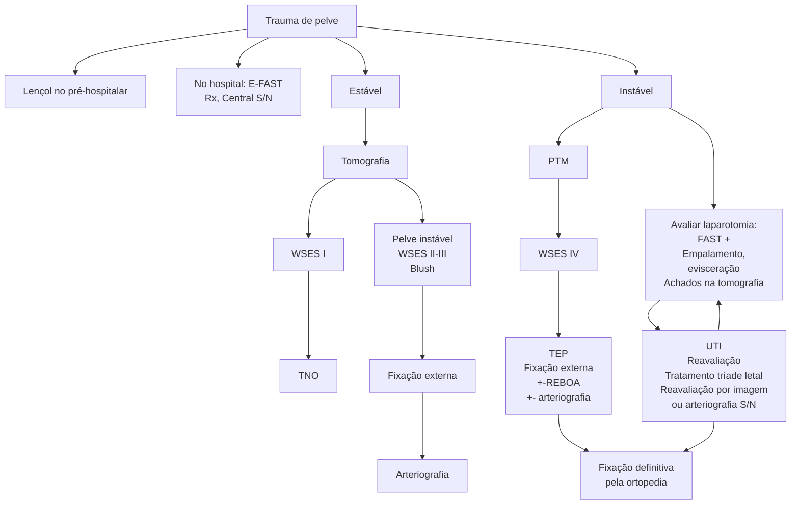

# TRAUMA DE PELVE

**Figura 1** Fluxograma de trauma de Pelve.

## 1. CONCEITOS GERAIS

• Habitualmente, trauma contuso de alta energia, logo, de alta mortalidade;

• No C do ABCDE → Fixação da pelve se houver suspeita de lesão;

  • Acionar protocolo de transfusão maciça (PTM) e realizar hipotensão permissiva;

  • Reanimação volêmica;

  • A pelve pode coletar toda a volemia; em alguns casos, deve-se considerar até ocluir aorta com balão de inserção femoral (REBOA).

• 90% dos sangramentos são venosos → 86% por fratura óssea (plexo ósseo) e 4% de origem do plexo venoso;

• 10% dos sangramentos são arteriais → a. pudenda interna (principal), glútea superior, sacral lateral e ilíaca interna.

## 2. MANEJO

### 2.1 INSPEÇÃO

• Deformidades, rotação, membro encurtado.

### 2.2 PALPAÇÃO

• Se um positivo, já configura pelve instável → não mobilizar novamente sob o risco de piorar lesão;

• Sínfise púbica;

  • Mobilização antero-posterior;

  • Mobilização supero-inferior;

  • Imobilização = fechamento da pelve;

  • Objetivo = diminuir hemorragia;

  • Lençol, faixa ou cinta. Ao nível do trocanter maior → laçar e comprimir bem. Deixar abdome livre para examinar o paciente;

  • Examinar períneo antes, pois após a imobilização a avaliação desta região fica prejudicada.

## 3. FRATURAS DE PELVE

### 3.1 A - LATERAL

• Mecanismo: colisões de automóveis;

• Sangra menos, porém lesiona mais estruturas – uretra, bexiga etc.;

• Rotação medial do anel;

CIRURGIA GERAL

3.2 B- ANTEROPOSTERIOR/LIVRO ABERTO
• Mecanismo: atropelamentos, quedas, compressão;
• Sangramento abundante.

3.3 C – VERTICAL/CISALHAMENTO
• Queda/Trauma unilateral;
• Rotura ligamentar complexa, sangra muito.

3.4 MANEJO DO TRAUMA DE PELVE
• Se paciente estiver estável → tomografia e tratar conforme achado;
• Se o paciente estiver instável → FAST. Positivo (+) = trauma pélvico e abdominal. Seguir a ordem de tratamento abaixo, podendo iniciar por tamponamento, caso o abdome esteja menos grave:
  1. Laparotomia supra-umbilical;
  2. Tamponamento pélvico extraperitoneal;
  3. Retomar laparotomia;
  4. Fixar externamente pelve (ortopedia);
  5. Arteriografia e embolização (se necessário).
• FAST Negativo (–) = trauma pélvico. Seguir a ordem abaixo de tratamento:
  1. Tamponamento pélvico extraperitoneal;
  2. Fixar pelve externamente (ortopedia);
  3. Arteriografia e embolização, se necessário.
• Sempre chamar o ortopedista para realizar o fixador externo:
  • Redução do volume da pelve;
  • Redução do sangramento;
  • Evita lesões adicionais.
• Incisão infraumbilical extraperitoneal (separado da laparotomia):

• Aplicar compressas bilateralmente e no retropúbico;
• Fechar;
• Em 48/72h voltar e retirar as compressas.

3.5 ARTERIOGRAFIA – QUANDO FAZER?
• Novo episódio de piora clínica;
• Não melhora e apresenta alto risco de sangramento;
• Blush em tomografia;
• Fratura de bacia + comunicação com meio externo através de lesão cutânea, urogenital ou anorretal;
• Associado a trauma pélvico e de membros;
• Atropelamentos, quedas, acidentes automobilísticos.

## 4. TRAUMA PELVIPERINEAL COMPLEXO

4.1 MANEJO INICIAL
• ABCDE.

4.2 O QUE FAZER?
• Limpeza e hemostasia;
• Suporte clínico;
• Derivar trato gastrointestinal e genitourinário, se acometer essas regiões;
• Antibioticoterapia;
• Profilaxia TEV;
• Suporte nutricional.

4.3 O QUE NÃO FAZER?
• Exploração local;
• Cirurgias longas;
• Fechamento primário.
