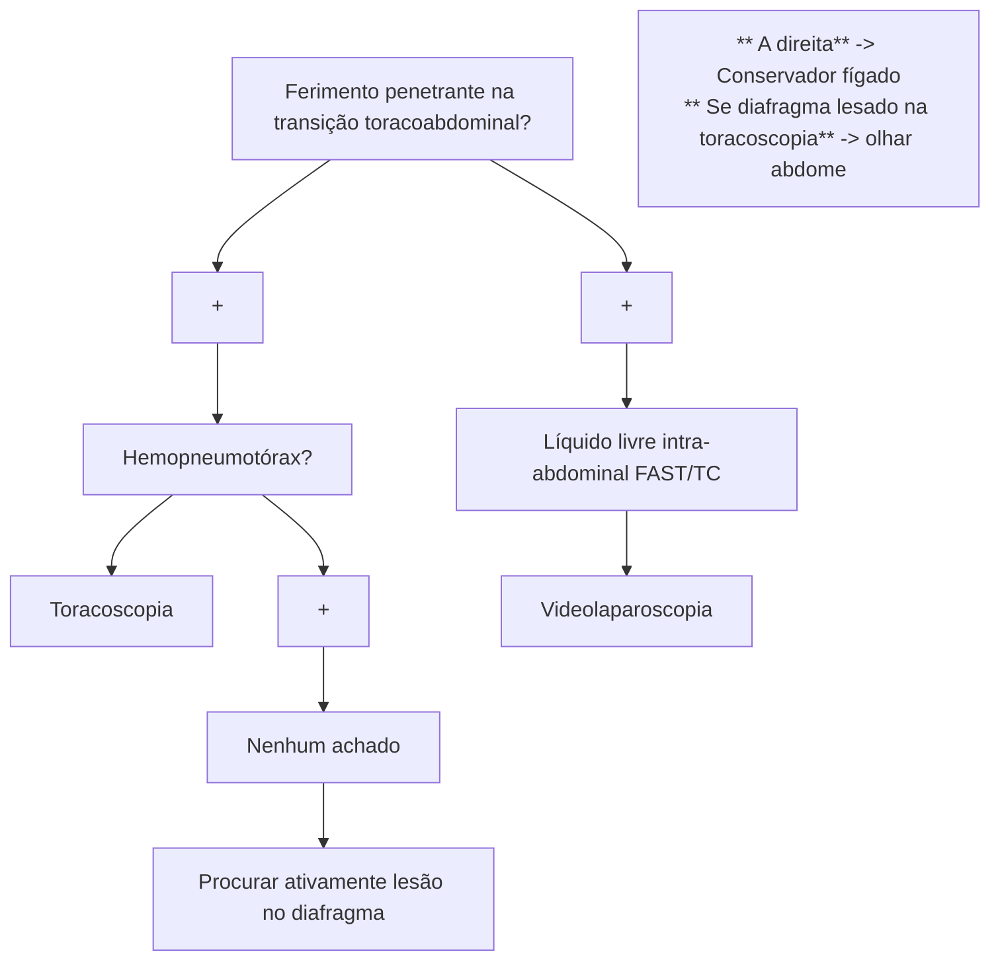

# TRAUMA: TRAUMA DE TÓRAX

## Risco iminente de morte

| Diagnóstico clínico, tratamento imediato | Diagnóstico clínico, tratamento imediato |
| ---------------------------------------- | ---------------------------------------- |
| 1.Pneumotórax hipertensivo               | 1.Drenagem de tórax                      |
| 2.Hemotórax maciço                       | 2.Drenagem → Toracotomia                 |
| 3.Pneumotórax aberto                     | 3.Curativo em 03 pontas → Drenagem       |
| 4 Tamponamento cardíaco                  | 4 Toracotomia                            |
| 5.Lesão traqueobrônquica central         | 5. Drenagem → Toracotomia                |

## 1. DADOS EPIDEMIOLOGICOS

- O trauma de tórax é o mais comum no paciente politraumatizado;
- Responsável por 20% a 25% das mortes em politraumatizados;
- 80% das lesões são tratáveis com suporte, analgesia e drenagem;
- 15% necessitam de toracotomia de urgência.

## 2. COMO AVALIAR E DIFERENCIAR AS LESÕES TORÁCICAS TRAUMÁTICAS?

- Lesão com risco imediato de morte = resolução na avaliação primária:
  - Diagnóstico clínico e tratamento imediato;
  - Lesões: pneumotórax hipertensivo, hemotórax maciço, pneumotórax aberto, tamponamento cardíaco, lesão traqueobrônquica central.
- Lesão com risco potencial de morte = resolução na avaliação secundária:
  - Pode ou não precisar de exames complementares (Raio-X, tomografia, entre outros);
  - Diagnóstico e tratamento na avaliação secundária;
  - Lesões: hemopneumotórax, contusão pulmonar e tórax instável, pneumomediastino, ruptura da aorta/trauma cardíaco, lesões traqueobrônquicas, trauma de esôfago / quilotórax, síndrome do esmagamento, fraturas / enfisema de subcutâneo, hérnia diafragmática;
- Mortes imediatas (ex.: ruptura de aorta, contusão cardíaca, ferimentos transfixantes);

## 3. MANEJO INICIAL

- Seguir o ABCDE/ATLS, realizar diagnóstico clínico das lesões com risco iminente de morte e tratar imediatamente;
- Cinco complicações de lesões torácicas traumáticas com risco iminente de morte;
- Confira Figura 1 na próxima página.

## 4. PNEUMOTÓRAX HIPERTENSIVO

- É uma lesão pleuropulmonar com vazamento de ar unidirecional para a pleura;
- Compressão de estruturas, desvio do mediastino → comprometimento de retorno venoso → choque obstrutivo → óbito;
- Manifestações semiológicas: turgência de jugulares, MV abolido, percussão timpânica e desvio de traqueia;
- Manifestações clínicas: taquicardia, dispneia, dor torácica e insuficiência respiratória;
- Diagnóstico: clínico → tratamento imediato;
- Conduta: drenagem de tórax (é o tratamento definitivo, que vai resolver o problema do paciente, não só os sintomas), punção de alívio (conduta imediata, punção no 5º espaço intercostal no mesmo local da drenagem e é feita quando o paciente está em iminência de parada) ou digito descompressão (é uma medida salvadora de urgência).

CIRURGIA GERAL

## Risco iminente de morte

| **Diagnóstico clínico, tratamento imediato** |   | **Diagnóstico clínico, tratamento imediato** |               |
| -------------------------------------------- | - | -------------------------------------------- | ------------- |
| 1.Pneumotórax hipertensivo                   | → | 1.Drenagem de tórax                          |               |
| 2.Hemotórax maciço                           | → | 2.Drenagem                                   | → Toracotomia |
| 3.Pneumotórax aberto                         | → | 3.Curativo em 03 pontas                      | → Drenagem    |
| 4 Tamponamento cardíaco                      | → | 4 Toracotomia                                |               |
| 5.Lesão traqueobrônquica central             | → | 5. Drenagem                                  | → Toracotomia |

**Figura 1** Fluxograma: risco eminente de morte

• Choque hipovolêmico – paciente instável.

## 5. PNEUMOTÓRAX ABERTO

• É um ferimento aberto na parede torácica com diâmetro > 2/3 da traqueia, em que há entrada de ar pelo orifício e consequente falência respiratória – o ar vai ter preferência para entrar pelo orifício torácico, e não pela traqueia, então o paciente não consegue realizar a ventilação;
• Conduta: curativo em 3 pontas (conduta imediata → o ar sai, mas não entra) seguida por drenagem de tórax (conduta definitiva) → avaliar a necessidade de cirurgia após o procedimento.

## 6. HEMOTÓRAX MACIÇO

• Ocorre quando há sangue em grande quantidade no espaço pleural (1500 ml) – diagnóstico de hemotórax maciço, pela quantificação de volume, só vai ser possível após a drenagem;
• Causa choque hipovolêmico ou choque obstrutivo (mais raro);
• Manifestações semiológicas: jugulares colabadas (diagnóstico diferencial com o pneumotórax hipertensivo), percussão maciça (diagnóstico diferencial com o pneumotórax hipertensivo), menos desvio de traqueia;
• Manifestações radiológicas: hemitórax opaco e desvio do mediastino (nesse caso, o desvio do mediastino é contralateral ao hemitórax opaco, oposto ao que acontece no pneumotórax hipertensivo);
• Conduta: drenagem torácica e transfusão sanguínea agressiva ou autotransfusão (cell saver);
• Quando fazer toracotomia de urgência?
  • Débito de dreno de tórax de 1500 ml imediatos;
  • 200 ml/h em 02 a 04 horas;
  • Necessidade contínua de transfusão de hemocomponentes;

Cuidado: IOT + VM abolidos + dessaturação e taquicardia + hemitórax opaco → pode ser intubação seletiva.

## 7. LESÕES TRAQUEOBRÔNQUICAS CENTRAIS

• Lesões de alta mortalidade e raras;
• Mais frequentemente próximas à carina;
• Manifestações clínicas: cianose, hemoptise, enfisema de subcutâneo (frequente) e dispneia;
• Normalmente, podem estar associadas a fraturas de costelas e pneumotórax;
• Nesses casos, a drenagem de tórax pode ser procedida da colocação de um dreno adicional e eventualmente em aspiração contínua.
• Paciente instável após conduta imediata: intubação seletiva e intervenção cirúrgica de urgência;
• Paciente estável após conduta imediata: TC *multislice* e broncoscopia → programar tratamento.

## 8. TAMPONAMENTO CARDÍACO

• Manifestações clínicas: tríade de Beck – estase jugular, hipotensão e abafamento de bulhas – presente somente em 30% dos doentes;
• É uma das causas de choque obstrutivo e ocorre quando há sangue no pericárdio devido a um trauma penetrante que impede a contração cardíaca e ejeção ventricular ideal;
• O trauma penetrante mais comum de causar tamponamento ocorre no quadrilátero de Ziedler (entre o 2º espaço intercostal, o 10º espaço intercostal, a linha paraesternal direita e a linha axilar anterior esquerda) – imagem abaixo;
• Normalmente, a ausculta pulmonar estará normal;
• *FAST*: exame de USG com janela pericárdica

TRAUMA: TRAUMA DE TÓRAX                                                                                            3

que auxilia no diagnóstico;
• Conduta: toracotomia anterolateral esquerda. Punção de Marfan será realizada no paciente grave e sem possibilidade de realização de toracotomia naquele momento, como uma ponte para o tratamento definitivo;
• A janela pericárdica subxifoidea pode ser realizada na dúvida diagnóstica, quando há indicação de cirurgia por outro motivo ou em pacientes com derrame pericárdico sem tamponamento.

## 9. TORACOTOMIA DE REANIMAÇÃO

### 9.1 PCR NO TRAUMA
• 1º → intubação, RCP, acesso e reposição:
  • Não voltou ou já estava invadido?
• 2º → descompressão torácica digital bilateral:
  • Não voltou? 3º → toracotomia de reanimação.

### 9.2 O QUE É?
• É uma toracotomia anterolateral esquerda feita na sala de emergência em um paciente vítima de trauma que apresenta parada cardiorrespiratória;
• É importante diferenciar a toracotomia de reanimação da toracotomia de urgência. Nesse segundo caso, é uma toracotomia realizada no centro cirúrgico em um paciente com tamponamento, hemotórax maciço ou outra condição em que o paciente ainda está vivo.

### 9.3 QUANDO FAZER?
• Seguir os níveis de evidência abaixo. Mas essas indicações podem variar dependendo do local e disponibilidade do cirurgião:
• Nível IA = ferimento penetrante torácico em, pacientes ainda com sinais de vida. Conduta: deve fazer toracotomia de reanimação;
• Nível IB = ferimento torácico penetrante em paciente sem sinais de vida. Conduta: pode fazer a toracotomia de reanimação;
• Nível II = ferimento extratorácico penetrante em paciente com sinais de vida. Conduta: pode fazer a toracotomia de reanimação;
• Nível IIC = ferimento extratorácico penetrante em paciente sem sinais de vida. Conduta: pode fazer a toracotomia de reanimação;
• Nível III = ferimento contuso em paciente com sinais de vida. Conduta: pode fazer a toracotomia de reanimação;
• Nível IV = ferimento contuso em paciente sem sinais de vida. Conduta: não fazer a toracotomia de reanimação.

### 9.4 COMO FAZER?
• Na sala de emergência, com paramentação estéril, faz-se: incisão anterolateral esquerda seguindo o 4º EIC, divulsão por planos e abertura da caixa torácica.

### 9.5 O QUE FAZER?
• Abertura do pericárdio (coração), twist pulmonar (pulmão), clampeamento da aorta descendente (abdominal), massagem cardíaca intratorácica (PCR) e revisão da hemostasia (parede).

Trauma de Tórax

# TRAUMA: TRAUMA DE TÓRAX II

Ferimento penetrante na transição toracoabdominal? + Hemopneumotórax? = Toracoscopia

+ + Nenhum achado

Procurar ativamente lesão no diafragma

Líquido livre intra-abdominal (FAST/TC) → Videolaparoscopia

** A direita** → Conservador (fígado)
** Se diafragma lesado na toracoscopia** → olhar abdome

## 1. DIAGNÓSTICO - LESÕES COM RISCO POTENCIAL DE MORTE

Exame físico completo + exames complementares vão auxiliar nesses casos.

### 1.1 EPIDEMIOLOGIA

• Pneumotórax simples → Iatrogênico;
• Pneumotórax hipertensivo → Ventilação positiva;
• Hemotórax → Ferimento penetrante (FAB x FAF);
• FAB - Ziegler = tamponamento;
• FAF - transfixante de mediastino - maior risco.

**Pneumotórax simples**
• Manifestações clínicas: dor, dispneia e ausculta alterada;
• É importante solicitar radiografia de tórax e o E-Fast. O chamado pneumotórax oculto é o que não é visto na radiografia e apenas é detectado na TC → conduta pode ser conservadora nesse caso;
• Todo pneumotórax traumático deve ser drenado.

**Hemotórax**
• Manifestações clínicas: dor, dispneia e ausculta ;
• Também vamos solicitar a radiografia de tórax e o E-Fast. Hemotórax com conteúdo menor que 200 ml só vai aparecer na tomografia;
• Todo hemotórax traumático deve ser drenado;
• Para o hemotórax retido, devemos proceder com a videotoracoscopia, pelo risco de infecção.

## 2. CONDUTA - LESÕES COM RISCO POTENCIAL DE MORTE

### 2.1 CONTUSÃO PULMONAR

• É uma insuficiência respiratória que é letal em idosos;
• Não aparece na radiografia inicialmente, só as fraturas normalmente associadas;
• Em crianças não há fraturas.

**Conduta:**
• Ventilação com suporte agressivo e gasometria para vigilância.

### 2.2 TÓRAX INSTÁVEL

• Fratura de 2 ou mais arcos costais em dois pontos diferentes. Com isso, há perda da continuidade da parede torácica;
• Associado a contusão pulmonar grave e movimento paradoxal da parede torácica Figura 1;
• Pode matar devido a uma insuficiência respiratória.

**Conduta:**
• Suporte de O₂, analgesia e balanço hídrico negativo.

**Figura 1** Ilustração: Torax instável

### 2.3 PNEUMOMEDIASTINO TRAUMÁTICO

• Geralmente é um achado de exame de imagem porque o paciente não apresenta sintomas;
• Se assintomático, a conduta é observar ou fazer endoscopia e broncoscopia (para investigar lesões de esôfago e/ou via aérea associadas);
• Achados associados à lesão do esôfago: derrame pleural e disfagia;
• Achados associados à lesão de traquéia: enfisema de subcutâneo e dispneia.

Consultar Figura 2 na próxima página

CIRURGIA GERAL

![CT scan image showing findings associated with tracheal injury: subcutaneous emphysema and dyspnea]

**Figura 2** Achados associados à lesão de traquéia: enfisema de subcutâneo e dispneia.

## 2.4 RUPTURA TRAUMÁTICA DE AORTA

• São traumas contusos de alta energia como desacelerações;
• Se o paciente conseguir chegar ao pronto-socorro, a rotura está tamponada e não é prioridade, pois, se tem uma ruptura livre, ele morre no local devido à exsanguinação. Se tem achado de hipotensão = procurar outras causas.

**Manifestações radiológicas:**
• Alargamento do mediastino (>6 cm);
• Boné apical;
• Apagamento do botão aórtico;
• Obliteração da janela aortopulmonar;
• Hemotórax esquerdo;
• Fratura dos 2 primeiros arcos costais;
• Fratura de escápula;
• Desvio de traquéia para a direita;
• Desvio do brônquio fonte esquerdo para baixo. Figura 3

![Chest X-ray showing deviation of left main bronchus downward]

**Figura 3** Desvio do brônquio fonte esquerdo para baixo.

• Se for realizada uma radiografia e os achados acima forem encontrados, pedir uma TC para confirmar o diagnóstico.

**Conduta:**
• 1º = tratamento com controle da FC e da PA e de outras lesões;
• Definitivo = cirúrgico endovascular após controle das demais lesões.

## 2.5 HÉRNIA DIAFRAGMÁTICA TRAUMÁTICA/AGUDA

• Associada a traumas contusos de alta energia, em geral, em pacientes com traumas que causam aumento súbito da PIA. É mais comum à esquerda, porque à direita há a barreira imposta pelo fígado;
• Diagnóstico: alteração clínica compatível + exame de imagem e/ou drenagem de tórax com palpação de estrutura "borrachosa".

Consultar Figura 4 na próxima página

• Manifestações clínicas: dor abdominal, líquido livre, dor torácica e insuficiência respiratória;
• Manifestação semiológica: MV abolido do lado da lesão;
• Manifestações radiológicas: diafragma elevado do lado da lesão/irregularidade diafragmática, SNG no tórax, nível hidroaéreo no tórax, desvio do mediastino e derrame pleural associado.

**Conduta:**
• Laparotomia exploradora e redução do conteúdo herniado. Se o defeito for grande, fazer rafia com ou sem uso de tela e, se necessário, toracoscopia e/ou drenagem torácica.

## 2.6 HÉRNIA DIAFRAGMÁTICA TRAUMÁTICA CRÔNICA/SUBAGUDA

• Associada com falha de diagnóstico de lesão do diafragma na fase aguda – mais comum em traumas penetrantes na transição toracoabdominal que não foram corretamente investigados.

**Lembrar a topologia da transição toracoabdominal**
• Borda superior: parede anterior no 4º EIC – mamilo e parede posterior no 7 EIC – ângulo da escápula;
• Borda inferior: borda da última costela.

**Abordagem de ferimento penetrante na transição toracoabdominal – sempre procurar ativamente lesões diafragmáticas.**
• Se hemopneumotórax → Toracoscopia;
• Se líquido livre intra-abdominal ou até mesmo se não houver nenhum achado → Videolaparoscopia

Consultar Figura 4 na próxima página

## 2.7 TRAUMA CARDÍACO CONTUSO

• Manifestações clínicas: dor, instabilidade inexplicável, arritmias e elevação das enzimas cardíacas. Associa-se a fraturas de costela e de esterno.

**Conduta**
• Suporte clínico intensivo.

## 2.8 LESÕES TRAQUEOBRÔNQUICAS MENORES

• Mesmo raciocínio que a lesão traqueobrônquica central, porém, não causam insuficiência respiratória.
• Manifestações: enfisema de subcutâneo e pneumomediastino.

TRAUMA: TRAUMA DE TÓRAX II

**Figura 4** lesões traqueobrônquicas menores

**Conduta:**
• Broncoscopia.

## 2.9 QUILOTÓRAX
• Muito raro e mais comum em traumas iatrogênicos. Ocorre com lesão do ducto torácico;
• Diagnóstico: na drenagem de tórax, sai um líquido leitoso com alta quantidade de triglicérides.

**Conduta:**
• Cirurgia se não houver resolução após 14 dias.

## 2.10 FRATURAS ÓSSEAS
• Se fratura do esterno, investigar contusão cardíaca e de grandes vasos;
• Se fratura de costelas inferiores, investigar contusão de órgãos intra-abdominais (baço e fígado, principalmente);
• Se fratura de costelas superiores, investigar contusão pulmonar e lesão de vasos;
• Se fratura de escápula, investigar lesão de vasos, pulmão e vias aéreas;
• Manifestações clínicas: dor, hipoventilação, atelectasia e pneumonia.

**As fraturas ósseas podem causar embolia gordurosa, que se manifesta com:**
• Hipotensão;
• Petéquias;
• Insuficiência respiratória;
• Rebaixamento do nível de consciência.

**Conduta:**
• Tratar a fratura e suporte clínico.

**Quando fixar?**
• Controverso: cirurgião do trauma e geral → Não fixar. Torácico → Fixar;
• Fixar se: dor crônica, movimento paradoxal, deformidade importante.

## 2.11 SÍNDROME DO ESMAGAMENTO
• É uma compressão torácica vigorosa que causa insuficiência respiratória, lesão osteomuscular grave (pode evoluir para rabdomiólise), pletora, petéquias, compressão da veia cava e edema maciço.

**Conduta:**
• Suporte e hidratação.

## 2.12 DRENAGEM DE TÓRAX

**Drenagem de tórax em selo d'água:**
• 5º EIC;
• Sob visão direta;
• Dreno tubular 28 (preferencialmente) - 32 Fr.

**Passo a passo:**
1. Preparo e posicionamento;
2. Aviso;
3. Materiais;
4. Antissepsia e assepsia;
5. Escolha do local;
6. Anestesia local até pleura;
7. Incisão seguindo a borda superior da costela inferior;
8. Dissecção por planos até perfuração pleural;
9. Dígito exploração;
10. Medida do tubo e passagem do mesmo (direção cranial e posterior);
11. Fixação;
12. Conectar ao selo d'água;
13. RX de controle.

**Complicações:**
• Tubo mal posicionado/dobrado;
• Enfisema de subcutâneo;
• Drenagem abdominal/hérnia;
• Sangramento intercostal;
• Lesão nervosa.

CIRURGIA GERAL

# REFERÊNCIAS

**Figura 2** Achados associados à lesão de traquéia: enfisema de subcutâneo e dispneia.

www.radiopaedia.org

**Figura 3** Desvio do brônquio fonte esquerdo para baixo.

Case courtesy of RMH Core Conditions, Radiopaedia.org, rID: 27918
