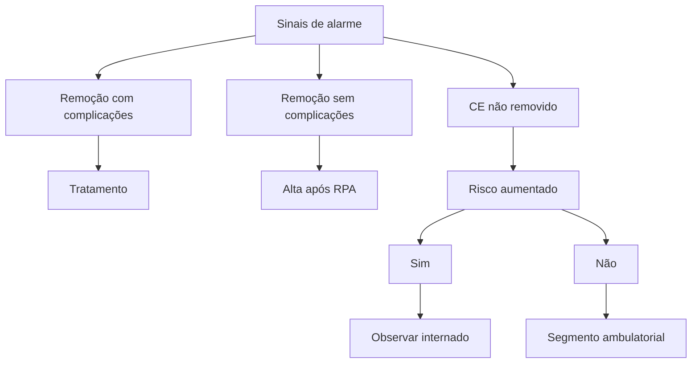

# CORPO ESTRANHO

**Emergência (<6h):** ingesta de bateria; obstrução por perfurocortante

**Urgência (até 24h):** objetos > 6cm no estômago ou duodeno proximal, ímãs ao alcance da endoscopia; outros corpos estranhos em esôfago que não promovam obstrução

**Não urgente:** Moeda ou corpo estranho com diâmetro >2,5cm no estômago

Suspeita de complicação / perfuração: Iniciar investigação com tomografia pois a endoscopia pode piorar a complicação

Corpo estranho **fora do alcance da endoscopia**: Observação e radiografia seriada.

## 1. EPIDEMIOLOGIA

• É uma comorbidade clínica que demonstra baixa mortalidade;
  • Contudo, é necessário manter atenção quanto à presença dos sinais de alarme.

• Aproximadamente 80% dos casos têm resolução espontânea;
  • Ainda, cerca de 10-20% requerem abordagem por endoscopia digestiva alta.

**Em adultos, a principal causa é a impactação alimentar;**

• Em 80% dos pacientes, o esôfago não evidencia alterações;

• No restante dos indivíduos (20%), tem-se alguma alteração esofágica.
  • A alteração mais comum é a esofagite eosinofílica.

• Em crianças, o risco mais proeminente dá-se pela ingestão de moedas;

• Por fim, 98% das apresentações são acidentais!

## 2. CONSIDERAÇÕES IMPORTANTES

**DIFERENÇAS ENTRE MOEDA E BATERIA;**

**Moeda:**
• Opaca;
• Sem bordas.

**Figura 1** Corpo estranho esofágico

**Bateria:**
• "Sinal do duplo halo".

**Figura 2** Corpo estranho esofágico

**PONTOS DE IMPACTAÇÃO ESOFÁGICA;**

• Esfíncter esofágico superior (músculo cricofaríngeo);
• Constrição do esôfago;
  • Pode ser provocada pelas estruturas gastrointestinais, arco aórtico, brônquio-fonte.
• Esfíncter esofágico inferior.

## 3. PROPEDÊUTICA

**Avaliação inicial do paciente:**
• História clínica direcionada;
• Sintomas e sinais de alarme;
• Atenção para:
  • Pacientes com comorbidades psiquiátricas;
  • Indivíduos privados de liberdade;

ENDOSCOPIA

• Crianças.
• Tempo desde a ingesta/tempo de jejum;
• Tipo de corpo estranho;
  • Pontiagudo;
  • Bateria;
  • Moeda
• Há disfagia associada? Afagia?
• Há presença de dor após a retirada do corpo estranho? Via de regra, passa-se o endoscópio novamente após retirada do corpo estranho para avaliar presença de laceração

**Sinais de alarme: modificam a conduta!!**
• Tipo do corpo estranho: maior risco nos pontiagudos
• Há salivação?
  • Suspeitar de obstrução total do esôfago.
• Há sintomas respiratórios associados?
  • Considerar compressão da via aérea.
• Alteração do padrão respiratório?
  • Proceder com protocolo ABCDE do trauma;
  • Garantir perviedade da via aérea.
• Febre/taquicardia/enfisema subcutâneo?
  • Considerar a possibilidade de perfuração esofágica.

OBS.: Na realização da tomografia, solicitar com incidências cervical, torácica e de abdome.

• Abscesso/mediastinite/lesão vascular.

**Esquematização do atendimento:**

**Observações importantes:**
• Radiografia, sempre em duas incidências;
• Ingestão de espinhos de peixe?
  • Não é bem visualizado através da radiografia;
  • Solicitar tomografia!
• Suspeita de mediastinite, abscesso cervical, enfisema subcutâneo ou de lesão vascular;
  • A prioridade é solicitar a tomografia, preferencialmente com contraste.
• Ainda, é preciso tomar ciência para os seguintes itens:
  • Perfuração = tomografia;
  • A presença de corpo estranho perfurante no esôfago é classificada como urgência;
  • Moeda, fora do alcance da endoscopia = observação.

## 4. MEDIDAS ANATÔMICAS

• É importante o conhecimento das medidas anatômicas, para compreender se o corpo estranho é capaz de ultrapassar as estruturas do trato gastrointestinal;
  • Piloro: em média, possui 2,5 cm;
  • Ângulo duodenal: 5 – 6 cm.

OBS.: Caso não tenha ultrapassado o estômago, procede-se com a realização da EDA em 3-4 semanas.

**Medidas não endoscópicas:**
• A partir da passagem pelo piloro:
  • A eliminação, geralmente, ocorre em 4 – 6 dias (diâmetro < 2,5 cm; comprimento < 5 – 6 cm).

## 5. CONDUTAS EXTRAS

**Atentar para as seguintes situações:**
• A observação é aceitável caso haja:
  • Corpo estranho não perfurocortante – com exceção de pilhas, baterias e imãs;
  • Objetos < 2 cm de diâmetro e < 5 cm de comprimento;
  • Em casos distintos dos citados acima, deve ser realizada a radiografia de abdome, semanalmente;
  • Normalmente, o prazo para eliminação é de 3-4 semanas.

**Ingestão de pacote de drogas;**
• Não tentar a remoção endoscópica - risco de romper o pacote;
• Na maioria dos casos, o tratamento conservador é bem sucedido;
• Optar pelo procedimento cirúrgico, quando necessário.

## 6. INDICAÇÕES DE ENDOSCOPIA

**Indicações gerais:**
• Objetos rombos maiores que 2 cm;
• Objetos impactados no esôfago;
• Objetos que permanecem no estômago após 4 semanas.

**Emergência;**
• A remoção deve ocorrer, preferencialmente, em 2 horas (máximo de 6 horas);
• O corpo estranho tende a promover obstrução esofágica;
• A bateria possui ação para causar: isquemia, descarga elétrica, lesão química;
• Os objetos perfurantes esofágicos perfuram em até 35% dos casos.

**Urgência;**
• A remoção deve ocorrer em até 24 horas;
• Considera-se outros corpos estranhos esofágicos, sem obstrução;
• Ainda,
  • Corpo de característica perfurativa, ou bateria no estômago ou duodeno proximal;
  • Imãs no alcance da EDA, ou seja, impactados no esôfago, estômago e duodeno;
  • Objetos > 6 cm de comprimento.

**Não urgente;**
• Conduta ambulatorial;
• Moeda no estômago (pode aguardar até 4 semanas);
• Objeto > 2,5 cm de diâmetro.
• Objetos rombos impactados no duodeno por mais de 7 dias

**Conduta complementares;**
• Intubação orotraqueal - IOT, se necessário;
• Manter o paciente em jejum, avaliar complicações e o risco de broncoaspiração;
• Solicitar biópsias, se necessário! Principalmente: tumor obstrutivo ou suspeita de esofagite eosinofílica (traqueização do esôfago)

CORPO ESTRANHO

## 7. CONSIDERAÇÕES FINAIS

**Figura 3** Manejo CE

**Remoção do corpo estranho;**
- Complicação na remoção? Tratamento direcionado e abordagem multidisciplinar;
- Remoção sem complicação? Alta após recuperação pós-anestésica;
- Não houve remoção → há risco?
  - Sim – internar o paciente e mantê-lo sob observação;
  - Não – prosseguir para o seguimento ambulatorial.

OBS.: Atenção aos pacientes com comorbidades psiquiátricas.

- Objetos sem risco aumentado: ponta romba, < 2,5 cm x 5 cm;
- Ingestão de bateria? Objeto perfurante? Observar em internação + radiografias seriadas.

OBS.: Considerar a cirurgia, se não houver progressão por 3 dias.

## REFERÊNCIAS

**Figura 1** Corpo estranho esofágico
www.endoscopiaterapeutica.com.br

**Figura 2** Corpo estranho esofágico
www.endoscopiaterapeutica.com.br
