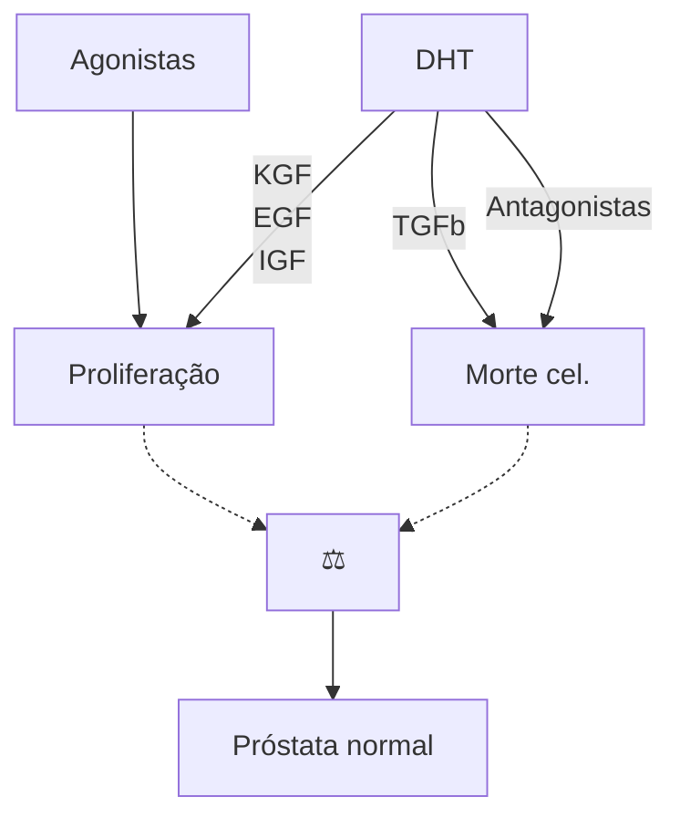
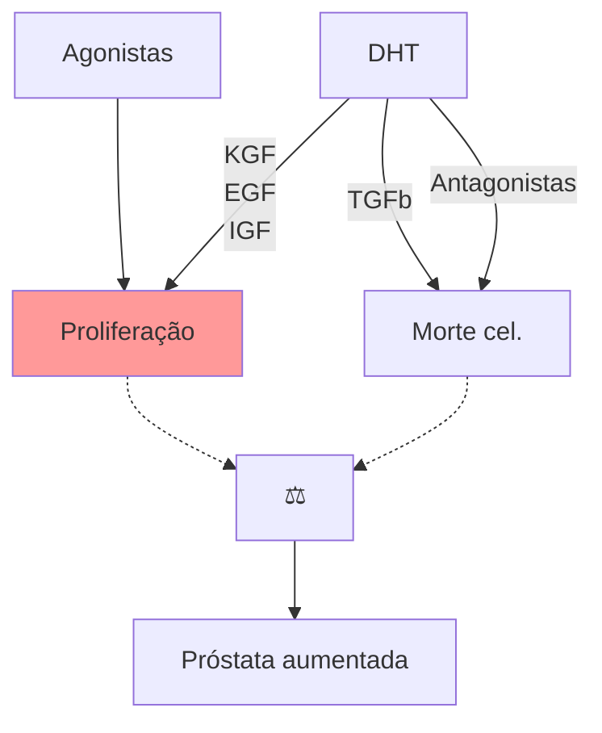
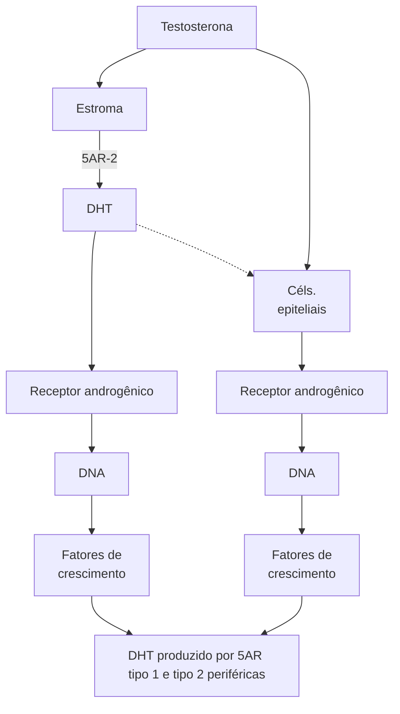

# HPB (HIPERPLASIA PROSTÁTICA BENIGNA)

**Tabela 1** Crescimento da zona de transição.

| Definição             | Crescimento da zona de transição.                     |
| --------------------- | ----------------------------------------------------- |
| Epidemiologia         | O principal fator é a idade.                          |
| Sintomas e sinais     | LUTS.                                                 |
| Exames complementares | PSA, USG, urofluxometria e UDN em casos selecionados. |
| Diagnóstico           | Clínico, exames em indicações específicas.            |
| Diferenciais          | Hipocontratilidade vesical e estenose de uretra.      |
| Tratamento            | Monoterapia, terapia combinada, cirurgia.             |
| Seguimento            | Atentar recidiva de sintomas e novas patologias.      |

## 1. ZONA PROSTÁTICA DE MCNEAL

• Zona central (20% do parênquima de uma próstata normal): periuretral;

• Zona periférica (grande volume do parênquima): muito associada a neoplasias;

• Zona anterior (ou fibromuscular);

• Zona de transição (10% do parênquima) → principal zona afetada pelo HPB, que cresce com o estímulo da testosterona.

## 2. FISIOPATOLOGIA

• Papel importante da testosterona em sua forma ativa (di-hidrotestosterona - DHT), que age nas células do estroma e epiteliais. Nas células do estroma prostático, leva ao estímulo agonista da proliferação celular, levando ao crescimento prostático;

• Na célula do estroma, a enzima 5-alfa-redutase age na conversão da testosterona para DHT, permitindo o estímulo de proliferação celular.

**Figura 1** Zona prostática de Mcneal.

| Zona periférica
Neoplasias | 20%
Zona central              |
| ------------------------------ | --------------------------------- |
| Posterior                      | 10%
Zona de Transição
HPM |
| Direita                        | Zona anterior
Fibromuscular   |
| Anterior                       |                                   |

UROLOGIA

## Próstata normal

## Próstata aumentada

## Fisiopatologia

**Figura 2** Fisiopatologia.

HPB (HIPERPLASIA PROSTÁTICA BENIGNA)                                                                        3

## 3. EPIDEMIOLOGIA

• Acomete:
  • 50% dos homens com > 50 anos;
  • 90% dos homens com > 80 anos.
• Não encontrada abaixo dos 30 anos → investigar outras etiologias diante de sintomas.

## 4. LUTS (LOWER URINARY TRACT SYMPTOMS - SINTOMAS DO TRATO URINÁRIO INFERIOR)

• Pode ser dividido entre sintomas de:
• Armazenamento (refere-se a capacidade da bexiga de acomodar a urina):
  • Aumento da frequência;
  • Urgência;
  • Urgeincontinência;
  • Noctúria.
• Esvaziamento (relacionado ao jato urinário):
  • Hesitação;
  • Esforço;
  • Jato fraco;
  • Intermitência.

**Escala IPSS (índice de sintomas prostáticos)** Tabela 2

## 5. MNEMÔNICO PARA OS CRITÉRIOS AVALIADOS NO IPSS (CADA CRITÉRIO PONTUA DE 0-5)

• Frequência;
• Urgência;
• Noctúria;
• Weak (jato);
• Intermitência;
• Straining (força);
• Esvaziamento.

## 6. EXAMES COMPLEMENTARES

• PSA → possui relação direta com o tamanho da próstata, útil para estimar o volume prostático e afastar suspeita de neoplasia;
• Urina I/urocultura → afastar ITU;
• Urofluxometria → < 12 ml/segundo é considerado um fluxo reduzido para homens.
• Exames de imagem:
  • USG → avalia todo o trato urinário, inclusive o volume da próstata e suas características, e outros componentes, como sinais de:
  • Bexiga de esforço (espessada);
  • Dilatação das vias (traduz grau de gravidade);

**Tabela 2** Escala IPSS (índice de sintomas prostáticos).

|   |                                                                                                                   | Nenhuma vez | Menos que 1 vez em cada 5 | Menos que a metade das vezes | Cerca de metade das vezes | Mais que a metade das vezes | Quase sempre |
| - | ----------------------------------------------------------------------------------------------------------------- | ----------- | ------------------------- | ---------------------------- | ------------------------- | --------------------------- | ------------ |
| 1 | No último mês, quantas vezes você teve a sensação de não esvaziar completamente a bexiga após terminar de urinar? | 0           | 1                         | 2                            | 3                         | 4                           | 5            |
| 2 | No último mês, quantas vezes você teve de urinar novamente em menos de 2 horas após ter urinado?                  | 0           | 1                         | 2                            | 3                         | 4                           | 5            |
| 3 | No último mês, quantas vezes você observou que ao urinar, parou e recomeçou várias vezes?                         | 0           | 1                         | 2                            | 3                         | 4                           | 5            |
| 4 | No último mês, quantas vezes você observou que foi difícil conter a urina?                                        | 0           | 1                         | 2                            | 3                         | 4                           | 5            |
| 5 | No último mês, quantas vezes você observou que o jato urinário estava fraco?                                      | 0           | 1                         | 2                            | 3                         | 4                           | 5            |
| 6 | No último mês, quantas vezes você teve de fazer força para começar a urinar?                                      | 0           | 1                         | 2                            | 3                         | 4                           | 5            |
| 7 | No último mês, quantas vezes em média você teve de se levantar à noite para urinar?                               | 0           | 1                         | 2                            | 3                         | 4                           | 5            |

**Figura 3** Estudo urodinâmico.

• Avaliar resíduo pós-miccional (resíduo > 100-150 Ml indica repercussão da obstrução infravesical).

**Recomendações para utilização da USG (guideline europeu).**

**Tabela 3** Recomendações.

| Recomendações                                                                                                                                     | Força da recomendação |
| ------------------------------------------------------------------------------------------------------------------------------------------------- | --------------------- |
| Realize exames de imagem da próstata ao considerar o tratamento médico para LUTS masculinos, se isso ajudar na escolha do medicamento apropriado. | Fraco                 |
| Realize exames de imagem da próstata ao considerar o tratamento cirúrgico.                                                                        | Forte                 |

• Estudo urodinâmico → Indicado em alguns casos:
  • Sintomas importantes de LUTS, mas urofluxometria com fluxo máximo normal (Qmáx > 15);
  • Início precoce ou tardio dos sintomas: < 50 ou > 80 anos;
  • Resíduo pós-miccional (RPM) grande > 300;
  • Fator de risco para bexiga neurogênica (BN);
  • Sintomas com próstatas pequenas (< 30 g);
  • Dúvida diagnóstica.

## 7. DIAGNÓSTICO

• Diagnóstico é clínico;
• Exame apenas com indicações claras;
• Seguimento com PSA → para triagem de neoplasia.

## 8. DIAGNÓSTICOS DIFERENCIAIS

• Questionar se há hipocontratilidade vesical ou obstrução infravesical;
• Na dúvida, fazer o estudo urodinâmico (UDN):
  • Diante da constatação de obstrução infravesical, pode ser HPB ou estenose uretra, que são diferenciados pela uretrocistografia (UCM).

## 9. TRATAMENTO

### 9.1 MONOTERAPIA MEDICAMENTOSA (INICIALMENTE)

• Alfa-1 bloqueadores (1.ª linha):
  • Diminui a resistência uretral;
  • Exemplos: tansulosina e doxazosina;
  • Ação rápida (dias);
  • Diminui IPSS;
  • Aumenta o Qmáx (fluxo máximo);
  • Efeitos colaterais (pode causar falha terapêutica): ejaculação retrógrada; hipotensão postural (orientar tomar à noite).

### 9.2 TERAPIA COMBINADA (PODE INICIAR QUANDO O PACIENTE NÃO APRESENTA MELHORA EM 1 MÊS DA MONOTERAPIA).

• Associar Alfa-1 bloqueadores ao inibidor de 5-alfa-redutase;
• Inibidores da 5-alfa-redutase:
  • Finasterida e dutasterida;
  • 2.ª linha - monoterapia ou combinada;
  • Ação lenta (semanas);

HPB (HIPERPLASIA PROSTÁTICA BENIGNA)

• Diminui IPSS e aumenta Qmáx;
• Efeitos colaterais (30% dos pacientes apresentam):
  • perda de libido; disfunção erétil.
• A indicação máxima para terapia combinada é a próstata > 40 g.

## 9.3 MEDICAMENTOS ALTERNATIVOS PARA CONTROLE DE SINTOMATOLOGIA

• Antimuscarínicos:
  • Oxibutinina;
  • Útil diante de muitas queixas de armazenamento;
  • Diminui IPSS;
  • Não fazer se resíduo > 150 ml → maior risco de retenção;
  • Não melhoram Qmáx.
• Inibidor de PDE-5:
  • Tadalafila;
  • Relação com disfunção erétil;
  • Diminui IPSS;
  • Não pode ser usado junto com nitrato.
  • Não melhoram Qmáx.

## 9.4 TRATAMENTO CIRÚRGICO

**Figura 4** RTU.

**Figura 5** Prostatectomia transvesical.

• Quando operar?
  • Refratariedade ao tratamento medicamentoso;
  • RUA (retenção urinária aguda);
  • Cálculos vesicais;
  • ITUs de repetição (estase urinária);
  • IRA/hidronefrose.
• Como operar? Baseado no volume da próstata:
  • < 30 g: RTUp (ressecção transuretral da próstata); ITUp (incisão transuretral da próstata);
  • 30 - 80 g: RTUp; HoLEp (Enucleação Endoscópica da Próstata com Laser Holmium); vaporização;
  • > 80 g: HoLEp; PTV (prostatectomia transvesical).

## 10. CASOS ESPECIAIS

• Alto risco cirúrgico: pode utilizar a técnica de embolização da próstata para redução do volume da próstata e melhora dos sintomas;
• Desejo reprodutivo: lift uretral (preserva ejaculação);
• Maior risco de sangramento: preferir HoLEp ou vaporização.

## 11. COMPLICAÇÕES

• Sangramento;
• Anejaculação;

**Tabela 4** Complicações.

| Definição             | Crescimento da zona de transição.                     |
| --------------------- | ----------------------------------------------------- |
| Epidemiologia         | O principal fator é a idade.                          |
| Sintomas e sinais     | LUTS.                                                 |
| Exames complementares | PSA, USG, urofluxometria e UDN em casos selecionados. |
| Diagnóstico           | Clínico, exames em indicações específicas.            |
| Diferenciais          | Hipocontratilidade vesical e estenose de uretra.      |
| Tratamento            | Monoterapia, terapia combinada, cirurgia.             |
| Seguimento            | Atentar recidiva de sintomas e novas patologias.      |

• Estenose de uretra;
• Incontinência;
• Intoxicação hídrica:
  • RTU com energia monopolar, utiliza líquido hiposmolar → absorção de líquido hiposmolar → hiponatremia → alterações neurológicas.
  • Conduta:
    • Finalizar a RTU;

• Manejar com solução hipertônica 3%.

## 12. SEGUIMENTO

• IPSS;
• Fluxometria + PSA;
• Se piora sintomática, questionar estenose ou recidiva.

# REFERÊNCIAS

**Figura 2** Fisiopatologia

Escrever a fonte aqui diretamente (Sem o FONTE:)

**Figura 3** Estudo urodinâmico

EAU Guidelines. Edn. presented at the EAU Annual Congress Amsterdam, 2020. ISBN 978-94- 92671-07-3.
