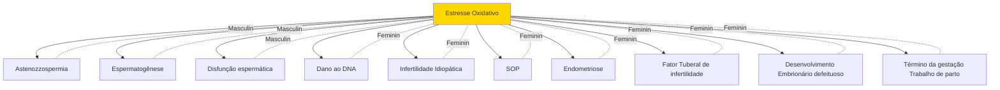
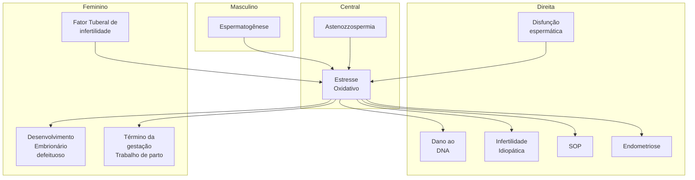

# UROLOGIA: INFERTILIDADE

## Fisiopatologia da infertilidade

## 1. INTRODUÇÃO

**Definição de infertilidade conjugal:**
- Casal sexualmente ativo (≥ 1 relação sexual por semana);
- Relações desprotegidas;
- Não há gravidez em um ano;

OBS: casais com mais de 06 meses já podem iniciar investigação.

**Infertilidade conjugal é diferente de infertilidade masculina ou feminina. Na conjugal, investiga-se os dois:**

| ?
13.6%  | Homem
27.3%  |
| ------------ | ---------------- |
| HM
27.3% | Mulher
31.8% |

**Figura 1** Causas na infertilidade conjugal. Mosher WD, Fertil Steril 1991.

**Na investigação da infertilidade, busca-se identificar fatores tratáveis, buscando métodos terapêuticos com menor custo e menor morbidade.**

## 2. ETIOLOGIAS DA INFERTILIDADE MASCULINA

- Distopias Testiculares;
- Varicocele;
- Exposições Ambientais;

**Doenças Sistêmicas:**
- Tumores testiculares, tanto após a orquiectomia como mesmo em vigência do tumor.
- Linfomas;
- Leucemias;
- Sarcomas.

**Distúrbios Obstrutivos:**
- Fibrose Cística;
- Vasectomia;
- Obstrução.

**Hipogonadismo:**
- Síndrome de Klinefelter;
- Kallmann;
- Idiopático;
- Tumores.

## 3. AVALIAÇÃO DO PACIENTE COM INFERTILIDADE

**3.1 HISTÓRIA CLÍNICA, BUSCANDO FATORES DE RISCO:**
- Criptorquidia;
- Torção testicular e trauma;
- Infecções geniturinárias;
- Toxinas ambientais;
- Medicamentos Gonadotóxicos (anabolizantes e quimioterápicos);
- Radiação.

**Figura 2** O estresse oxidativo tem papel fundamental na infertilidade masculina e feminina. Nas causas masculinas, age diretamente na espermatogênese, gera disfunção espermática, podendo levar a dano ao DNA, muitas vezes tida como infertilidade idiopática pela dificuldade de determinar essa causa.

## 3.2 EXAME FÍSICO:

• Características sexuais secundárias anormais (síndrome genética?);
• Volume testicular, avaliação principalmente com

**Tabela 1** Valores de referência do espermograma de acordo com a WHO

|                                      | WHO 1987Normal | WHO 1992Normal | WHO 1999Referência | WHO 2010Percentil 5% (IC 95)unicaudal |
| ------------------------------------ | -------------- | -------------- | ------------------ | ------------------------------------- |
| Volume seminal (ml)                  | 2.0            | 2.0            | 2.0                | 1.5 (1.4-1.7)                         |
| Número total de spz (10⁶)            | 40             | 40             | 40                 | 39 (33-46)                            |
| Concentração (10⁶/ml)                | 20             | 20             | 20                 | 15 (12-16)                            |
| Motilidade Total (%)                 |                |                |                    | 40 (38-42)                            |
| Motilidade progressiva
(a+b) (%) | 50             | 50             | 50                 | 32 (31-34)                            |
| Vitalidade (%)                       | 50             | 75             | 75                 | 58 (55-63)                            |
| Formas Normais (%)                   | 50             | 30             | (15)               | 4.0 (3.0-4.0)                         |

goniômetro (hipogonadismo?);
• Observar massa muscular (hipogonadismo?);
• Massas testiculares;
• Ausência de testículos (criptorquidia?);
• Ginecomastia (manifestação estrogênica?);
• Varicocele;
• Palpação de deferentes.

## 3.3 EXAMES LABORATORIAIS → ESPERMOGRAMA:
Necessárias 2 amostras comparativas.

INFERTILIDADE

| **Normal**
 | **Defeitos de Cabeça**
             | **Ausência de Acrossomo**
 |
| -------------------- | -------------------------------------------- | ----------------------------------- |
|                      | **Defeitos de peça intermediária**
 | **Defeitos de Cauda**
     |

| **Esperado**
 | **Azoospermia Não Obstrutivas**
                                                  |   | **Azoospermias Obstrutivas**
        |
| ---------------------- | ------------------------------------------------------------------------------------------ | - | --------------------------------------------- |
|                        | **Defeito de produção por falência hormonal, disgenesia gonadal ou defeitos testiculares** |   | **Obstrução ou ausência de vasos deferentes** |

**Figura 3** Hipóteses diante do espermograma.

## 3.4 ALTERAÇÕES PRINCIPAIS NO ESPERMOGRAMA QUE CONTRIBUEM PARA A INFERTILIDADE:

**AZOOSPERMIA:**
- Não encontrado espermatozoide na amostra.

**OLIGOZOOSPERMIA:**
- <15 milhões de espermatozoides / mL.

**ASTENOZOOSPERMIA:**
- <32% espermatozoides móveis e progressivos.

**TERATOZOOSPERMIA:**
- <4% das formas normais (Forma de Kriger).
- Confira acima a Figura 3

## 4. VARICOCELE

- A varicocele no contexto da infertilidade é aquela clínica (perceptível ao exame físico);
- A varicocele clínica pode ser dividida em 3 graus:

- Grau 1: Palpável sob valsalva;
- Grau 2: Palpável sem valsalva;
- Grau 3: Visível.
- A influência da varicocele na infertilidade envolve questões como a temperatura, pressão e qualidade do sêmen.
- Confira na página seguinte a Figura 4

## 4.1 INDICAÇÕES CIRÚRGICAS PARA CORREÇÃO DA VARICOCELE:

- Varicocele clínica + infertilidade com alterações no espermograma;
- Varicocele clínica + Adolescentes com falha de crescimento testicular;
- Não indicar cirurgia nos pacientes:
  - Com varicocele subclínica (alteração apenas na ultrassom);
  - Com espermograma normal.

INFERTILIDADE                                                                                                                   5

## 5.1 AZOOSPERMIAS NÃO OBSTRUTIVAS:

Na azoospermia não obstrutiva, a causa é testicular (produção deficiência do espermatozóide no testículo), com isso, a captação do espermatozoide é direto no testículo (por tese/microtese) para a reprodução assistida.

**Figura 6** Captação direta de espermatozóides no testículo.

**Figura 7** Túbulos com espermatozóides (seta azul) e sem espermatozóides (seta vermelha).

## 5.2 AZOOSPERMIAS OBSTRUTIVAS:

- Causadas principalmente pela mutação do CFTR e anomalias dos ductos de Wolf:
  - Agenesia bilateral dos deferentes → até 82% da mutação do CFTR presente;
  - Agenesia unilateral → associado à agenesia renal (Síndrome de Zinner);
- Também pode possuir etiologia pós-infecciosas e iatrogênicas;
- Vasectomia;
- Quanto mais distal mais maduro se torna os espermatozóides, o melhor ponto de captação seria no epidídimo com PESA ou Mesa;
- Em casos que não se torna possível realizar tal captação utiliza-se o FNA, percBIOPSY ou TESA.

**Figura 8** Pontos possíveis de obstrução da saída do espermatozóide → obstrução epididimária bilateral, agenesia congênita dos deferentes e vasectomia ou obstrução dos ductos ejaculatórios.

|    PESA    | FNA | MESA |      |
| :--------: | --- | ---- | ---- |
| percBIOPSY |     |      | TESE |

**Figura 9** Nesses casos, os espermatozoides são captados por meio de técnicas: PENA (punção percutânea do epidídimo), punção com agulha fina ou grossa, tese ou mesa (dissecção do epidídimo).

## 6. REVERSÃO VASECTOMIA

Nos casos de desejo de reprodução, pode-se realizar a reversão da vasectomia ou utilizar técnicas de extração do espermatozoide para fertilização. Decisão individualizada;

**Vasectomia, opta-se quando:**
- Paciente relaciona-se com uma mulher jovem e fértil;
- Intervalo de obstrução < 15 anos;
- Quer mais de um filho.

**Técnicas de extração para ICSI, opta-se quando:**
- Relação com mulher infértil ou idade avançada;
- Intervalo de obstrução > 15 anos;
- Quer só um filho.

# REFERÊNCIAS

**Figura 7** Túbulos com espermatozóides (seta azul) e sem espermatozóides (seta vermelha).

https://nycryo.com/2020/02/29/02292020-microtese-cutting-edge-procedure-male-infertility/
