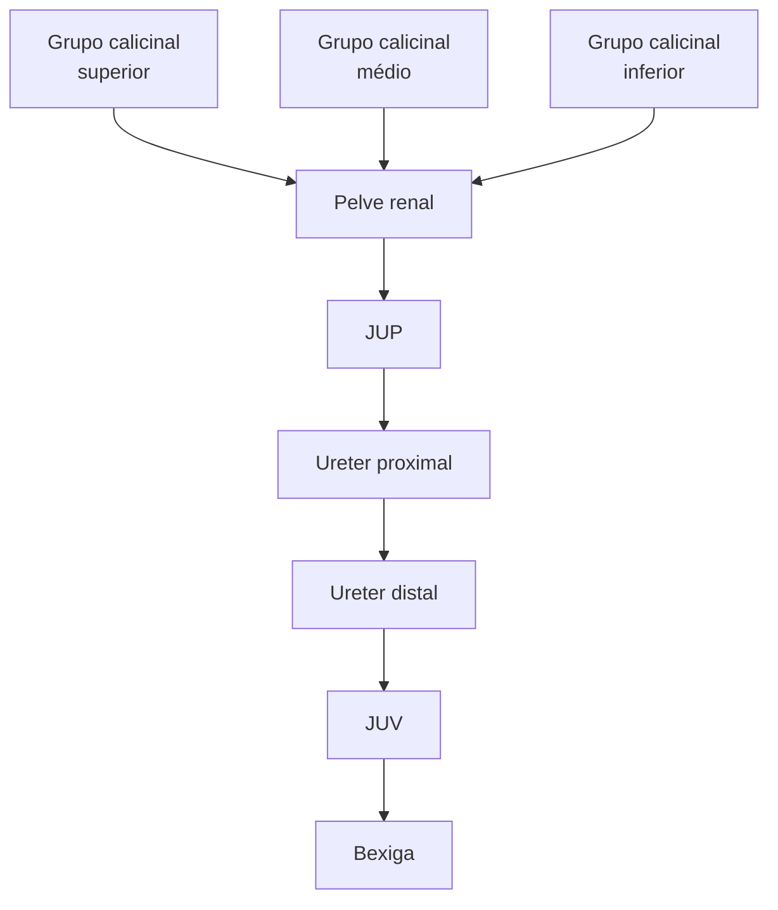
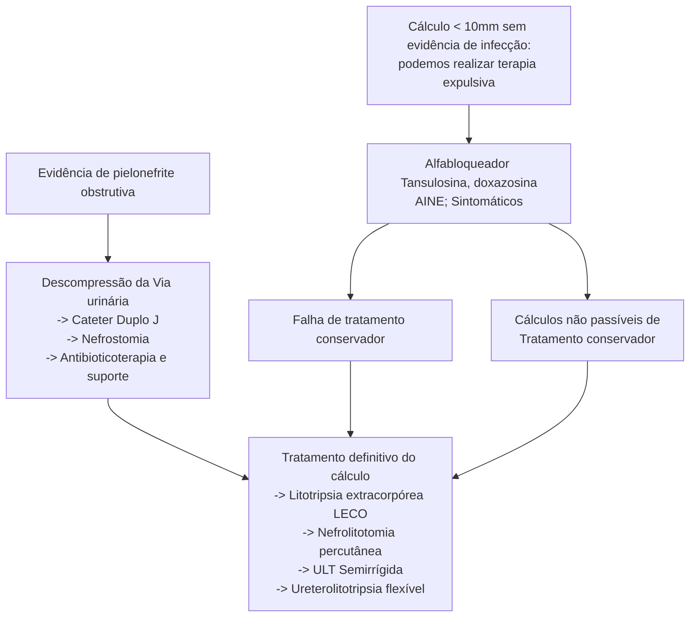
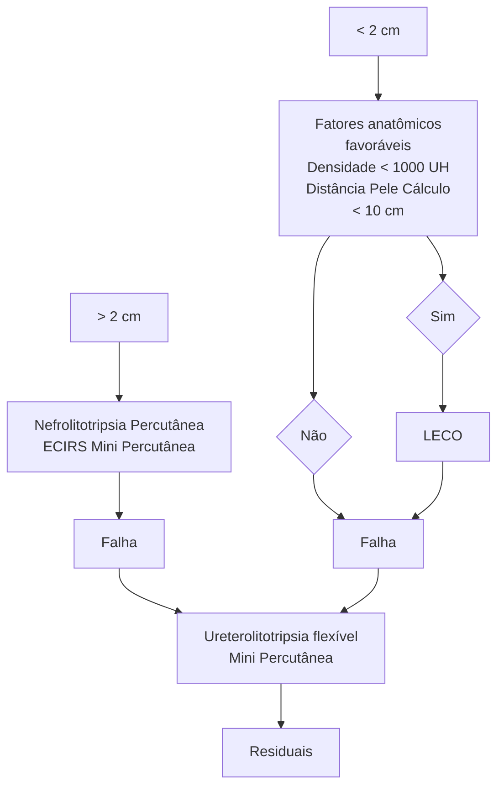

# LITÍASE - AVALIAÇÃO METABÓLICA

|                            | CÁLCULOS DE CÁLCIO                                                                                                                                                                                                                                                                                                                                                                                                                                                                                                                                                                                                                                                                                                                                                                                                                                                                   | CÁLCULOS DE CÁLCIO                                                                                                    | CÁLCULOS DE CÁLCIO                                                                                                                                                                                         | CÁLCULOS DE CÁLCIO                                                                                       | CÁLCULOS DE ÁCIDO ÚRICO                                                                                                                                                                               | CÁLCULOS DE ESTRUVITA                                                                                                                                                                                                                        | CÁLCULOS DE CISTINA                                                                                                                                                                                                              |
| -------------------------- | ------------------------------------------------------------------------------------------------------------------------------------------------------------------------------------------------------------------------------------------------------------------------------------------------------------------------------------------------------------------------------------------------------------------------------------------------------------------------------------------------------------------------------------------------------------------------------------------------------------------------------------------------------------------------------------------------------------------------------------------------------------------------------------------------------------------------------------------------------------------------------------ | --------------------------------------------------------------------------------------------------------------------- | ---------------------------------------------------------------------------------------------------------------------------------------------------------------------------------------------------------- | -------------------------------------------------------------------------------------------------------- | ----------------------------------------------------------------------------------------------------------------------------------------------------------------------------------------------------- | -------------------------------------------------------------------------------------------------------------------------------------------------------------------------------------------------------------------------------------------- | -------------------------------------------------------------------------------------------------------------------------------------------------------------------------------------------------------------------------------- |
| Aspectos Sindrômicos       | **Objetivo** da análise metabólica do paciente com litíase: série de exames para guiar terapêutica e **evitar recorrência** de litíase

**Indicações de análise metabólica:** cálculos múltiplos, litíase recorrente, ITU importante (pielonefrite), crianças, história familiar, osteoporose, doenças disabsortivas intestinais suspeita de síndromes genéticas

**Que exames pedir?** Séricos: creatinina, sódio, potássio, cálcio, cloreto, ácido úrico, fosfato, gasometria, PTH; Urina 24h: pH, densidade, creatinina, cálcio, ácido úrico, oxalato, citrato, magnésio, cistina

**Tratamento geral (independentemente do tipo de cálculo):** normalização de hábitos alimentares, diminuir ingesta de sódio, não diminuir ingesta de cálcio; controle de peso e atividade física; hidratação (suficiente para manter 2 a 2,5 L de urina clara por dia) |                                                                                                                       |                                                                                                                                                                                                            |                                                                                                          |                                                                                                                                                                                                       |                                                                                                                                                                                                                                              |                                                                                                                                                                                                                                  |
|                            | **HIPERCALCIÚRIA**                                                                                                                                                                                                                                                                                                                                                                                                                                                                                                                                                                                                                                                                                                                                                                                                                                                                   | **HIPEROXALÚRIA**                                                                                                     | **HIPERURICOSÚRIA**                                                                                                                                                                                        | **HIPOCITRATÚRIA**                                                                                       |                                                                                                                                                                                                       |                                                                                                                                                                                                                                              |                                                                                                                                                                                                                                  |
| Fisiopatologia             | Hipercalcemia **reabsortiva** (hiperparatireoidismo), falha na reabsorção **renal** (hipercalciúria renal) ou aumento da absorção **intestinal** de cálcio.                                                                                                                                                                                                                                                                                                                                                                                                                                                                                                                                                                                                                                                                                                                          | Causa **genética** (rara), **entérica** (mal-absortivas, bariátrica, desnutrição), ou **dietética** (alimentos ricos) | Relacionado a **dieta** (ingesta protéica) e **genética**. O ácido úrico reduz fatores inibidores de litíase, e cristais de ácido úrico podem agregar oxalato de cálco em volta formando cálculo de cálcio | Citrato é um **fator inibidor** de formação de cálculos, estando diminuído na urina pode ocorrer litíase | Paciente em geral com resistência a insulina, consumo aumentado de proteínas, e urina ácida (pH <5.35). A principal causa é a acidez urinária e não a hiperexcreção de ácido úrico.                   | Relacionado com as **bactérias PPK** (Proteus, Pseudomonas e Klebsiella), que são produtoras de **urease** e causam aumento de amônia que gera aumento do pH urinário. Com isso, precipita magnésio+ amônio+ fosfato (=estruvita) e apatita. | Defeito de transporte intestinal e reabsorção renal de aminoácidos, decorrente de uma doença autossômica **recessiva**. Esse defeito resulta em **aumento de cistina** urinária, que leva a precipitação de cristais de cistina. |
| Epidemiologia              | 35-65% dos casos                                                                                                                                                                                                                                                                                                                                                                                                                                                                                                                                                                                                                                                                                                                                                                                                                                                                     | Menos comum                                                                                                           | Até 60% dos casos                                                                                                                                                                                          | Até 10% dos casos                                                                                        | Cerca de 8% dos cálculos são de ácido úrico                                                                                                                                                           | Associado **com ITUs de repetição** (mulheres, pacientes com derivações, doenças neurológicas, e estase urinária)                                                                                                                            | Presente em até **1:7000**                                                                                                                                                                                                       |
| Diagnóstico                | **Hipercalciúria:** > 4mg/kg/dia                                                                                                                                                                                                                                                                                                                                                                                                                                                                                                                                                                                                                                                                                                                                                                                                                                                     | **Hiperoxalúria:** > 40 mg/dia                                                                                        | **Hiperuricosúria:** > 600 mg/dia                                                                                                                                                                          | **Hipocitratúria:** < 320 mg/dia                                                                         | Análise do cálculo                                                                                                                                                                                    | História clínica + exames complementares                                                                                                                                                                                                     | Presença de cristais de cistina na análise de urina                                                                                                                                                                              |
| Medidas farmacológicas     | Tiazídicos                                                                                                                                                                                                                                                                                                                                                                                                                                                                                                                                                                                                                                                                                                                                                                                                                                                                           | Sem outras medidas específicas                                                                                        | **Alopurinol** se cristal de cálcio, com hiperuricosúria mas cálcio normal                                                                                                                                 | Citrato de potássio VO                                                                                   | **Citrato de potássio:** alcalinização urinária
**Bicarbonato de sódio:** alcalinização urinária em casos que não respondem ao citrato
**Alopurinol** não é medicação de escolha nesses casos | **Antibióticos:** cursos longos podem ser necessários para esterilizar urina

**Ácido aceto-hidroxâmico (AHA):** seu uso diminui recorrência                                                                                         | **Citrato de potássio:** alcalinização urinária
**Tiopronina:** quelante da cistina                                                                                                                                          |

## 1. PATOGÊNESE

A pouca ingestão de água é o maior fator de risco para o desenvolvimento de urolitíase, juntamente com a maior ingesta de sódio:

• **Kps:** coeficiente de solubilidade, influenciado pela quantidade de solvente (água) e soluto (sódio). A pouca quantidade de solvente ou a grande quantidade de soluto, aumenta a chance de precipitação do soluto, formando o cálculo.

Um detalhe importante para lembrar da patogênese da litíase renal é a Placa de Randall, que são calcificações na papila, e auxiliam o início do processo de formação do cálculo, chamado de nucleação, principalmente para cálculos de oxalato de cálcio. Em seguida, há crescimento e agregação de mais cristais, até a formação do cálculo aderido à placa, que eventualmente se desprende da papila e se desloca. O cálculo provoca sintomas quando durante sua migração pelo sistema coletor:

• No processo de formação do cálculo há fatores promotores e inibidores: Inibidores: Ingesta hídrica aumentada; Aumento de citrato: quelante de cálcio; Proteína Tamm Horsfall. Promotores: como já citado, os principais são a baixa ingesta hídrica, grande quantidade de sódio, e síndromes mal absortivas. O sódio pode não estar diretamente no cristal, mas seus níveis têm relação com os níveis de cálcio na urina, pois quanto maior a quantidade de sódio, maior será a de cálcio.

UROLOGIA

**Composição dos cálculos:**
• Oxalato de cálcio é predominante, chegando a 60%, em seguida os mistos de oxalato de cálcio com fosfato de cálcio (15%), fosfato de cálcio puros (10%), ácido úrico (8%), estruvita (6%), cistina (1%).

Há chance de 50% de recorrência em 05 anos.

## 2. ANÁLISE METABÓLICA

Para melhor compreender o quadro de formação de cálculo do paciente, faz-se a análise metabólica, que consiste numa série de exames. Nem sempre essa análise é possível ou indicada. Deve ser feita quando:
• Múltiplos cálculos ou cálculos bilaterais;
• Recorrentes;
• ITU + cálculo;
• História familiar (até 25% dos pacientes têm história familiar positiva);
• Suspeita de doenças genéticas;
• Crianças;
• Osteoporose.

### 2.1 EXAMES
• Avaliação de função renal, distúrbios hidroeletrolíticos, desbalanços hormonais;
• Faz-se análise de urina tipo I também para aferir pH e densidade urinária.

**Tabela 1 Exames laboratoriais séricos e de urina de 24h para realização da análise metabólica do paciente com indicação de investigação de causa de litíase renal. título**

| SÉRICOS     | URINA 24H   |
| ----------- | ----------- |
| Creatinina  | pH          |
| Sódio       | Densidade   |
| Potássio    | Creatinina  |
| Cálcio      | Cálcio      |
| Cloreto     | Ácido Úrico |
| Ácido Úrico | Oxalato     |
| Fosfato     | Citrato     |
| Gasometria  | Magnésio    |
| PTH         | Cistina     |

### 2.2 ORIENTAÇÕES
• Manter dieta e hábitos durante a coleta da urina. São duas coletas separadas para eliminar viés. Na urina de 24h, despreza-se a primeira micção do dia, e coleta toda a urina até a primeira do dia seguinte. A urina deve ser armazenada em geladeira;
• Creatinina (controle de qualidade): H: 20-25 mg/kg de peso; M: 15-20 mg/kg de peso.

## 3. TRATAMENTO

### 3.1 GERAL
• Normalização de hábitos alimentares: diminuir ingesta de sódio, e NÃO de cálcio;
• Controle de peso e atividade física: interfere na necessidade de ingesta hídrica;
• Hidratação - quantidade suficiente para manter 2 a 2,5 L de urina por dia, clara, quase transparente;
• Personalização de cada paciente a depender de composição de cálculo e análise metabólica.

### 3.2 CÁLCULOS DE CÁLCIO
**Hipercalciúria:** (35-65% dos pacientes) > 4mg/kg/d em urina de 24h; Aumento do cálcio urinário, vai se juntar ao citrato, também diminuindo sua quantidade; Existem 03 formas de aumentar a calciúria: Absortiva: aumento de absorção intestinal; Hipercalciúria renal: Ca não é reabsorvido nos túbulos; Reabsortiva: hipercalciúria e hipercalcemia, hiperparatireoidismo primário. **Limitar a ingesta de sódio a 3 – 5 g/dia e manter a de cálcio em 1000 a 1200 mg.** (não limitar a ingesta de cálcio, devido à importância para a estrutura óssea). Se cálcio alto for mantido, mesmo com medidas citadas, pode-se utilizar tiazídicos;

**Hiperoxalúria:** Menos comum. É considerada quando > 40mg/dia de oxalato; 03 principais causas: Genética - rara, pode levar a DRC terminal; Entérica - síndromes mal-absortivas, desnutrição, cirurgias de bypass. Mais importante a título de provas; Dietética - excesso de castanha, chocolate, espinafre, vitamina C. **Limitar chá preto, espinafre, beterraba, nozes e chocolate... todos os alimentos que contém muito oxalato;**

**Hiperuricosúria:** Presente em até 60% dos pacientes, caracterizado quando temos > 600mg/dia de ácido úrico. Influenciado por dieta e fatores genéticos; Diminui fatores inibidores, cristais de ácido úrico com agregação de OxCa. O cálculo no seu início era de ácido úrico, e posteriormente foi agregando oxalato de cálcio. **Limitar a ingestão de proteínas animais. Se hiperuricosúria com cálcio normal → Alopurinol;**

**Hipocitratúria:** até 10% dos pacientes; Caracterizado por < 320mg citrato/d na urina; **Presente em frutas cítricas**, pelo menos 01 copo de suco de laranja por dia. Caso o paciente não consiga, pode-se suplementar com **citrato de potássio via oral**, lembrando que pode causar dispepsia;

**Acidose Tubular Renal:** Defeitos na secreção de H+ e reabsorção de HCO3-; 3 subtipos: **Subtipo 1 (distal)** - mais associada a cálculo, até 70% dos pacientes, composto de **fosfato de cálcio**; Devido ao distúrbio, o paciente vai apresentar hipercalciúria, hipocitratúria e pH urinário alto. Deve-se tratar essas alterações para diminuir a formação de cálculos.

### 3.3 CÁLCULOS DE ÁCIDO ÚRICO
• Paciente pode ter hiperuricosúria e baixo pH urinário, normalmente pH < 5,35;
• Resistência à insulina e consumo aumentado de proteínas;

LITÍASE - AVALIAÇÃO METABÓLICA                                                                                      3

• Fator de risco para cálculos de OxCa;
• **Limitar ingestão de proteínas animais;**
• Citrato de potássio → aumentar pH (**alcalinizar urina**). Caso não seja suficiente, pode-se fazer **bicarbonato de sódio, via oral;**
• Alopurinol não é tratamento de primeira linha para esses cálculos.

## 3.4 CÁLCULOS DE ESTRUVITA

• Relacionado com as bactérias PPK (Proteus, Pseudomonas e Klebsiella), que são produtoras de urease e causam aumento de amônia que gera aumento do pH urinário. Com isso, precipita magnésio, amônio e fosfato (estruvita) e apatita;
• Mais prevalentes em mulheres, pacientes com derivações, doenças neurológicas, e estase urinária. Ou seja, pacientes com risco aumentado de ITU de repetição;
• Primeiro passo no tratamento é deixar o paciente Stone free, livre de cálculos. Se for necessário

intervenção cirúrgica, esta deve ser feita. Não se pode trabalhar com a hipótese de cálculo residual, pois esse fragmento contém bactérias, que vão levar a continuar a formação de cálculos;
• Também é necessário um curso mais arrastado de antibióticos, para esterilizar a urina do paciente;
• Pode-se utilizar o Ácido acetohidroxâmico (AHA).

## 3.5 CÁLCULOS DE CISTINA

• Defeito de transporte intestinal e reabsorção renal de aminoácidos, decorrente de uma doença autossômica recessiva, presente em até 1:7000. Esse defeito resulta em aumento de cistina urinária, que leva à precipitação de cristais de cistina. **É recidivante**, podendo levar à perda do rim por litíase de repetição;
• **Limitar sódio e proteínas animais;**
• **Citrato de potássio via oral → aumentar pH urinário;**
• **Tiopronina → Quelante de cistina.**

# LITÍASE - INTRODUÇÃO

**Litíase:**

* Possui uma prevalência de 1 a 15% na população geral, com chance de recorrência de até 50 % em 05 anos. Cerca de 25% dos pacientes possuem história familiar positiva;
* É visto um aumento de incidência em mulheres;
* O pico de incidência é entre 40 e 60 anos de idade, mais comum em caucasianos;
* O maior fator de risco para a litíase é a baixa ingesta hídrica;
* A principal queixa que leva o paciente ao pronto socorro é a lombalgia.

**A litíase renal é uma patologia muito presente no cotidiano do urologista.**

# UROLOGIA: LITÍASE NO PRONTO-SOCORRO

## 1. DEFINIÇÃO (O QUE É?)

• Dor lombar – maior motivo de procura a urgências;

• Essa dor vem da migração de cálculos renais em via urinária:
  • Os cálculos são formados nos cálices renais e migram pelos ureteres, quando passam por um estreitamento, causam dor.
  • Junção ureteropiélica é o primeiro dos 3 pontos de estreitamento;
  • O segundo é o cruzamento com os vasos ilíacos e deste ponto até a bexiga o ureter é chamado de ureter distal;
  • O terceiro é a junção ureterovesical.

**Figura 1** Anatomia do trato genitourinário e ureteroscopia.

## 2. EPIDEMIOLOGIA (QUANDO É?)

• Prevalência de até 15%;

• Historicamente era mais comum em homens, mas está tendendo ao equilíbrio;

• O pico de incidência é entre 40 e 60 anos (porém é importante saber que essa informação não é suficiente pra guiar as questões);

• O principal fator de risco é a baixa ingesta hídrica.

## 3. SINTOMAS E SINAIS (COMO É?)

• Muitos cálculos podem ser assintomáticos, de forma que os sintomas surgem apenas quando os cálculos migram por entre as vias urinárias;

• Dor:
  • Cólica, súbita e que já chega em intensidade máxima;

• Pode irradiar para região inguinal, região inguino-escrotal e até os grandes lábios;

• Geralmente está associada a inquietação, náuseas e vômitos.

• Obstrução pode acarretar – além de pielonefrite obstrutiva:
  • Hematúria da migração do cálculo;
  • Anúria se o paciente só tiver um rim e este for obstruído pelo cálculo, ou se o paciente tiver os dois rins, porém ambos forem obstruídos;
  • Urinoma, obstrução aguda com distensão e rompimento da via urinária.

• Infecção - pielonefrite obstrutiva:
  • Hematúria;
  • Sepse;
  • Queda EG e instabilidade hemodinâmica.

## 4.EXAMES COMPLEMENTARES (O QUE EU VEJO?)

• Laboratorial – sepse:
  • Hemograma, provas inflamatórias, gasometria arterial, lactato, urocultura e hemocultura.

• UI e URC;
• HMC;
• Atentar função renal e DHE;
• Avaliar comorbidades;
• B-HCG para mulheres em idade fértil;
• Qual o melhor exame de imagem:
  • Tomografia > 90% de sensibilidade e especificidade – padrão-ouro: Tamanho e número de cálculos; Topografia não é um limitante na TC; Densidade do cálculo; Distância pele-cálculo; Não examinador dependente; Anatomia renal; Exceções: Gestantes, crianças e cálculos de indinavir, pois não são radiopacos: Gestantes e crianças – USG; Diagnóstico topográfico em gestantes – RM; Cálculos de indinavir – pode usar TC, mas com contraste, para tentar enxergar falha de enchimento no ureter;
  • Ultrassom: Baixo custo; Sem radiação; Examinador dependente; Bom para Rim e terço proximal e distal do ureter; Dificuldade em obesos;

Figura 2 Duas imagens de USG, mostrando a dilatação no ureter, imagem hiper ecogênica do cálculo e a imagem de um cálculo dentro da bexiga;

Figura 3 Cortes axiais de uma tomografia, mostrando dilatação da via urinária e cálculo no ureter;

Figura 4 Corte coronal, ajudando a ver o tamanho do cálculo.

LITÍASE NO PRONTO-SOCORRO                                                                     3

## 5.DIAGNÓSTICO (CERTEZA QUE É?)

### 5.1 CONCEITOS
• Clínica de ITU alta + obstrução em imagem;
• Urocultura pode vir negativa nos exames iniciais.

### 5.2 PIELONEFRITE XANTOGRANULOMATOSA:
• Pielonefrite + cálculo + obstrução;
• Destruição do parênquima renal;
• Sinal da pata do urso.

**Figura 5** Sinal da pata do urso

• Destruição do parênquima renal;
• Sinal da pata do urso.

**Figura 6** Corte histológico de pielonefrite xantogranulomatosa.

## 6.DIFERENCIAIS (O QUE MAIS PODE SER?)

• Lombalgia mecânica;
• Hérnia discal;
• Causas obstétricas / ginecológicas;
• Outras causas de abdome inflamatório;
• Pielonefrite aguda.

## 7.TRATAMENTO (O QUE FAZER?)

### 7.1 CÓLICA NEFRÉTICA
• Analgésico simples;
• AINEs;
• Antiespasmódico;
• Manter paciente normohidratado;
• Opioides de resgate.

### 7.2 ATENTAR PARA OS SEGUINTES SEMPRE QUE TRATAR UM QUADRO DE LITÍASE:
• Pielonefrite obstrutiva;
• Rim único;
• Imunossuprimido;
• Obstrução bilateral;
• DM;
• DRC.

### 7.3 SE PIELONEFRITE OBSTRUTIVA
• Antibiótico;
• Hidratação;
• O₂ se necessário;
• Monitorização se sepse;
• Desobstrução imediata.

### 7.4 PARA DESOBSTRUÇÃO, HÁ DOIS MÉTODOS — DUPLO J E NEFROSTOMIA PERCUTÂNEA

**Figura 7** Duplo J é um procedimento mais simples e por este motivo costuma ser a primeira opção.

### 7.5 TERAPIA EXPULSIVA
• 95% dos cálculos de até 4mm saem em 40 dias;
• Apenas se não indicar cirurgia imediata;
• Interromper dor refratária, infecção ou piora de Creatinina;
• Cálculos de até 10mm (5mm ideal);
• Alfa bloqueador por até 4 a 6 semanas (Tansulosina).

## 8.SEGUIMENTO (O QUE VAI SER?)

**Figura 8** Fluxograma para condução de pacientes com ureterolitíase não obstrutiva versus obstrutiva

**Tabela 1** Resumo diagnóstico e de condução de suspeita de litíase renal no PS.

| **Definição**             | Migração de cálculo na via urinária                               |
| ------------------------- | ----------------------------------------------------------------- |
| **Epidemiologia**         | 15% da população, 40-60 anos, recorrente                          |
| **Sintomas**              | Dor, infecção e tomografia                                        |
| **EX
complementares** | Laboratoriais, cultura e tomografia                               |
| **Diagnóstico**           | Pielonefrite obstrutiva - clínica + achados em exames de imagem   |
| **Diferenciais**          | Lombalgia mecânica, pielonegrite não obstrutiva, prenhez ectópica |
| **Tratamento**            | Sintomáticos, terapia expulsiva, desobstrução se PNO              |
| **Seguimento**            | Programar tratamento definitivo                                   |

LITÍASE NO PRONTO-SOCORRO                                                                                                                                                     5

# REFERÊNCIAS

**Figura 2** Duas imagens de USG, mostrando a dilatação no ureter, imagem hiper ecogênica do cálculo e a imagem de um cálculo dentro da bexiga;

https://radiopaedia.org/cases/lower-ureteric-stone-1 e

https://radiopaedia.org/articles/ureteric-calculi

**Figura 3** Cortes axiais de uma tomografia, mostrando dilatação da via urinária e cálculo no ureter;

https://radiopaedia.org/articles/ureteric-calculi

**Figura 4** Corte coronal, ajudando a ver o tamanho do cálculo.

https://radiopaedia.org/articles/ureteric-calculi

**Figura 5** Sinal da pata do urso

https://institutoammo.org/noticia.php?n=75

**Figura 6** Corte histológico de pielonefrite xantogranulomatosa.

https://drpixel.fcm.unicamp.br/en/node/197

**Figura 8** Fluxograma para condução de pacientes com ureterolitíase não obstrutiva versus obstrutiva.

Acervo Medcof

# UROLOGIA: LITÍASE - TRATAMENTO ENDOSCÓPICO DE CÁLCULOS

## Tratamento endoscópico de cálculos renais

| **< 2 cm**                                                                                               |           | **> 2 cm**                                             |   |
| -------------------------------------------------------------------------------------------------------- | --------- | ------------------------------------------------------ | - |
| ↓                                                                                                        |           | ↓                                                      |   |
| Fatores anatômicos
favoráveis
Densidade **< 1000 UH**
Distância Pele Cálculo
**< 10 cm** |           | Nefrolitotripsia Percutânea
ECIRS (Minioercutanea) |   |
| ↓                                                                                                        |           | ↑                                                      |   |
| **Sim**                                                                                                  | **Não**   | **Falha**                                              |   |
| ↓                                                                                                        | ↓         | ↑                                                      |   |
| **LECO**                                                                                                 | **Falha** | Ureterolitotripsia flexível
(Mini Percutânea)      |   |
| →                                                                                                        |           | **Residuais**                                          |   |

## 1. CIRURGIA ENDOSCÓPICA

| Cálculo < 10mm sem evidência de infecção:
**podemos realizar terapia expulsiva** | Evidência de pielonefrite obstrutiva                                                                                                                                |
| ------------------------------------------------------------------------------------ | ------------------------------------------------------------------------------------------------------------------------------------------------------------------- |
| ↓                                                                                    | ↓                                                                                                                                                                   |
| Alfabloqueador (Tansulosina doxazosina)
AINE; Sintomáticos                       | **Descompressão da Via urinária**
→ Cateter Duplo J
→ Nefrostomia
→ Antibioticoterapia e suporte                                                        |
| ↓                                                                                    | ↓                                                                                                                                                                   |
| **Falha de tratamento conservador**                                                  | **Tratamento definitivo do cálculo**
→ Litotripsia extracorpórea (LECO)
→ Nefrolitotomia percutanea
→ ULT Semirrígida
→ Ureterolitotripsia flexível |
| **Cálculos não passíveis de
Tratamento conservador**                             | →                                                                                                                                                                   |

**Figura 1** Fluxograma Cirurgia Endoscópica.

• Conforme visto na aula anterior, este fluxograma mostra os caminhos até o tratamento definitivo para o cálculo;
• Para o tratamento definitivo é preciso saber a localização do cálculo, saber, por exemplo, se é proximal ou distal e lembrar que a referência para isso é o cruzamento com os vasos ilíacos.
• Confira na página seguinte a **Figura 2**

## 2. CÁLCULOS URETERAIS

### 2.1 URETER PROXIMAL
• > 10 mm: ULT FLEX (alguns casos pode-se considerar LECO);
• < 10 mm: ULT FLEX ou LECO.

### 2.2 URETER DISTAL
• > 10 mm: ULT SMR (preferível à LECO);
• < 10 mm: ULT SMR ou LECO.

## 2.3 UM POUCO SOBRE OS APARELHOS UTILIZADOS NOS PROCEDIMENTOS ENDOSCÓPICOS

• Cistoscópio Rígido: Lembrar das medidas utilizadas na endoscopia – 1 French = 1/3 mm;

**Figura 2** Ureteroscopia semirrígida para abordagem de cálculo em ureter distal

**Figura 3** Ureteroscopia Semirrígida – chega até os cálculos do ureter distal

1. Cistoscopia e identificação de meatos:

**Figura 4** Visão dos meatos ureterais cateterizados por cistoscopia

2. Pielografia – introduzir cateter ureteral e injetar contraste, para contrastar o ureter e a pelve renal, possibilitando saber a posição do cálculo:

**Figura 5** a- imagem estimativa extensão renal; b- pielografia retrógrada; c- introdução de fio guia

• O fio guia hidrofílico adquire aspecto amolecido quando molhado, de forma a não causar lesão no canal urinário;

• Depois disso, vai ser introduzido o ureteroscópio semirrígido: Distal – 7 Fr; Proximal – 8 a 9 Fr; Canal Trabalho – 3 Fr;

• Ureteroscopia Flexível – consegue chegar aos ureteres proximais.

**Figura 6** Ureteroscopia flexível

LITÍASE - TRATAMENTO ENDOSCÓPICO DE CÁLCULOS

![Diagram showing ureteroscope and its application, with labeled parts including Cesta, Cálculo ureteral, Ureteroscópio, Uréter, Vagina, Uretra, and Bexiga]

**Figura 7** Ureteroscópio flexível, e sua aplicação pelo cirurgião. Observe no desenho como ele é capaz de atingir porções mais proximais do ureter

• Exemplificando o funcionamento básico do ureteroscópio.
• Se o cálculo for muito grande para ser "pescado" pela cesta e retirado, pode ser utilizado outro aparelho para ajudar – Laser.
• Há duas formas para se trabalhar com o Laser de Holmium: Dusting – paralelo com uma lapidação: Quando se utiliza baixa energia e alta frequência; Menos uso da bainha ureteral; Fragmentos menores; Cálculos mais moles; Ruins para pedras duras; Laser de alta potência seriam necessários para melhorar o processo de dusting.
• Fragmentação – paralelo com uma dinamite: Alta energia e baixa frequência; Extração de pedra completa; Cálculos mais duros; Risco de lesão ureteral; Fragmentos maiores.
• Puls: É uma escala de lesão ureteral pós procedimentos endoscópicos; Grade 0 – Sem lesão; Grade 1 – Lesão superficial na mucosa / ou edema significante na mucosa / hematoma; Grade 2 – Lesão submucosa; Grade 3 – Perfuração < 50% de transecção parcial; Grade 4 – > 50% de transecção parcial; Grade 5 – Transecção completa.

[Images showing PULS 0, PULS 1, and PULS 2+ endoscopic views with panels A, B, C, D]

**Figura 8** Puls: escala de lesão ureteral após procedimentos endoscópicos

## 3. CÁLCULOS RENAIS

**Figura 9** Conduta diante de ureterolitíase de acordo com o tamanho do cálculo impactado

## 3.1 CIRURGIA PERCUTÂNEA

• Indicações: Cálculos renais > 2 cm; Cálculos múltiplos ou coraliformes: Falhas terapêuticas com outros métodos; Grandes cálculos em ureter proximal;
• Complicações: Hemorragia importante; Perfuração de cólon; Hidrotórax / Pneumotórax;
• Guy's Score: A importância dessa classificação é a chance da cirurgia dar certo e o paciente ficar livre de cálculos.

**Figura 10** Guy's Score, utilizado para predição de sucesso da abordagem percutânea na nefrolitíase

| 95%
Grade I                                           | 80%
Grade II |
| --------------------------------------------------------- | ---------------- |
| \[Kidney cross-section diagrams showing different grades] |                  |
| 60%
Grade III                                         | 40%
Grade IV |
| \[Kidney cross-section diagrams showing different grades] |                  |

[Anatomical illustration showing kidney with nephroscope access for percutaneous nephrolithotripsy]

**Figura 13** Abordagem de cálculos renais por nefroscópio em paciente submetido a nefrolitotripsia percutânea

[Photograph showing blue dilators and nephroscopy equipment]

**Figura 14** Kit de dilatação para acessar o rim com o nefroscópio rígido

## 3.2 NEFROLITOTRIPSIA PERCUTÂNEA

**Figura 11** Posição Barts Flank-Free, para que o rim fique mais exposto e seja diminuída a probabilidade de se puncionar o cólon

[Illustration showing patient positioning for Barts Flank-Free position with fluoroscopy equipment]

• Pielografia retrógrada, rim recebendo punção com agulha, guiada por escopia, na qual depois é feita dilatação no canal para ter acesso com o nefroscópio rígido.

**Figura 12** Uma visão mais didática de como o rim é acessado na posição de Barts Flank-Free

[Cross-sectional anatomical illustration showing nephroscope access to kidney]

## 3.3 MINI NLPC

• Tendo em vista que a cirurgia nada mais é do que um trauma renal controlado, surgiu a necessidade de se fazer traumas cada vez menores e vias de acesso cada vez mais finas, com isso, surgiu a mini NLPC; Mini percutânea, 14 a 20 Fr, utiliza energia do Laser; Convencional, de 24 a 30 Fr, utiliza-se o ultrassônico.

## 3.4 ECIRS

• Cirurgia Endoscópica Intrarrenal Combinada; Acesso percutâneo com nefroscópio rígido + acesso transureteroscópico flexível, acesso com técnica combinada; Dificuldades do acesso flexível: Cálculos cálice inferior; Ângulo infundíbulo-pélvico < 42 graus.

**Figura 15** Abordagem combinada percutânea e transureteral de nefrolitíase.

[Three kidney diagrams labeled A, B, and C showing combined percutaneous and transureteral approach]

LITÍASE - TRATAMENTO ENDOSCÓPICO DE CÁLCULOS

# REFERÊNCIAS

**Figura 3** Ureteroscopia Semirrígida – chega até os cálculos do ureter distal

https://hsurgical.com.br/produto/instrumental-para-cistoscopia-3/

**Figura 4** Visão dos meatos ureterais cateterizados por cistoscopia

https://link.springer.com/chapter/10.1007/978-3-030-82351-1_5

**Figura 5** a- Imagem estimativa extensão renal b- pielografia retrógrada

c- introdução de fio guia

https://bmcurol.biomedcentral.com/articles/10.1186/s12894-016-0197-8/

figures/2

**Figura 6** Ureteroscopia flexível

Acervo Medcof

**Figura 8** Puls: escala de lesão ureteral após procedimentos endoscópicos

https://www.brainscape.com/flashcards/cirurgia-endoscopica-de-

calculo-11376437/packs/20073416

**Figura 14** Kit de dilatação para acessar o rim com o nefroscópio rígido

chrome-extension://efaidnbmnnnibpcajpcglclefindmkaj/https://

apurologia.pt/wp-content/uploads/2018/09/micro-perc.pdf

# LITÍASE - LITOTRIPSIA EXTRACORPÓREA (LECO)

| **Indicações:**
**Pequenos →** Cálculos até 02 cm (se no grupamento calicial inferior, cálculos < 01 cm);
**Moles →** até 1000UH, observado em TC;
**Perto →** Distância pele-cálculo < 10 cm.
**Fatores de mau prognóstico:**
• Ângulo pielocalicinal < 90° - 70°;
• Largura infundibular < 4 a 5 mm;
• Comprimento infundibular > 03 cm; | • Altura infundibular > 1,5 a 2 cm
**Contraindicações:**
• Gestação;
• ITU: aumenta chance de bacteremia;
• Coagulopatia;
• Aneurisma de aorta;
• HAS grave, descontrolado;
• Obstrução de vias urinárias;
• Má formação. |
| ---------------------------------------------------------------------------------------------------------------------------------------------------------------------------------------------------------------------------------------------------------------------------------------------------------------------------------------------------------------------- | --------------------------------------------------------------------------------------------------------------------------------------------------------------------------------------------------------------------------------------------------------- |

## 1. INTRODUÇÃO

- A primeira utilização foi em 1980;
- A máquina gera a fragmentação do cálculo, através de ondas de choque geradas, que são transmitidas do meio externo até o cálculo nas vias urinárias. Pode estar associada a USG ou RX;
- O procedimento é ideal para cálculos de até 02 cm, podendo ser feito de forma ambulatorial. Em cálculos maiores, aumenta a chance de falha, pois não é feita retirada do cálculo, apenas fragmentação, para que seja expelido;
- Normalmente é feito com anestesia geral e sedação, após recuperação, o paciente pode voltar para casa.

## 2. A MÁQUINA

- Pode ter meio hidráulico ou eletromagnético para gerar as ondas de choque, sendo o hidráulico mais eficiente;
- A frequência fica em torno de 60 a 90 pulsos por segundo, aumentando gradativamente a energia;
- Evitar interface de ar da máquina com a pele do paciente, para evitar perda de energia das ondas.

## 3. VANTAGENS E DESVANTAGENS

### 3.1 VANTAGENS
- Pouco invasivo;
- Ambulatorial;
- Baixo custo.

### 3.2 DESVANTAGENS
- Menor taxa livre de cálculo → 65 a 90%;
- Podem ser necessários múltiplos procedimentos, outra LECO ou outro procedimento;
- Normalmente só é encontrada em serviços especializados.

## 4. INDICAÇÕES E CONTRAINDICAÇÕES

### 4.1 INDICAÇÕES
- Pequenos → Cálculos até 02 cm (se no grupamento calicial inferior, cálculos < 01 cm);
- Moles → até 1000UH, observado em TC;
- Perto → Distância pele-cálculo < 10 cm;
- Fatores de mau prognóstico: nesses casos, há maior chance de que o procedimento não funcione. Ilustrados respectivamente na imagem abaixo. Ângulo pielocalicinal < 90° - 70°; Largura infundibular < 4 a 5 mm; Comprimento infundibular > 03 cm; Altura infundibular > 1,5 a 2 cm.

**Figura 1** Fatores de mau prognóstico para o sucesso da LECO. Primeira imagem: ângulo pielocalininal < 90-70º; segunda imagem: largura infundibular < 4-5mm; terceira imagem: comprimento infundibular > 3cm; quarta imagem: altura infundibular > 1,5 a 2cm.

### 4.2 CONTRAINDICAÇÕES
- Gestação;
- ITU: aumenta chance de bacteremia;
- Coagulopatia;
- Aneurisma de aorta;
- HAS grave, descontrolado;
- Obstrução de vias.

## 5. COMPLICAÇÕES

Podem ocorrer em até 36% dos casos, sendo em sua maior parte leve. As mais comuns são:
• Dor local;
• Equimoses;
• Hematúria.

Podem ocorrer em até 36% dos casos, sendo em sua maior parte leve. As mais comuns são:
• Rua de cálculos: vários cálculos agrupados enfileirados no ureter. Na imagem, à direita. Esse paciente provavelmente necessitará de um procedimento endoscópico, para limpeza da via;
• Hematomas.

**Figura 2** Radiografia de abdômen evidenciando ureterolitíase à direita, na transição L3-L4.

LITÍASE - LITOTRIPSIA EXTRACORPÓREA (LECO)

# REFERÊNCIAS

**Figura 2** Radiografia de abdômen evidenciando ureterolitíase à direita, na transição L3-L4.

Acervo pessoal Medcof
