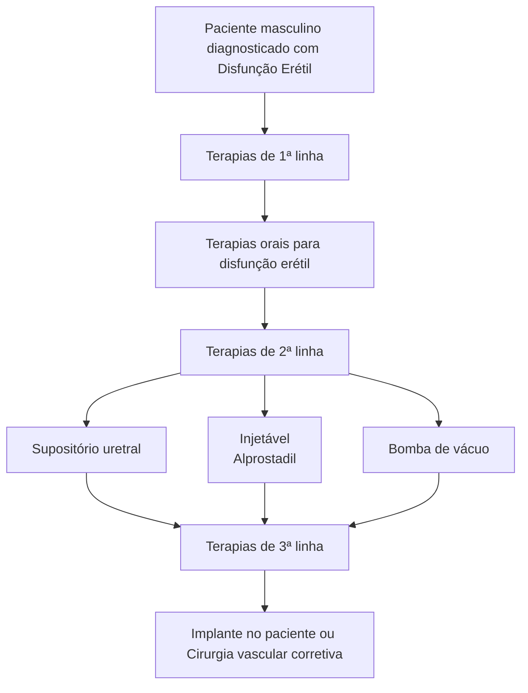
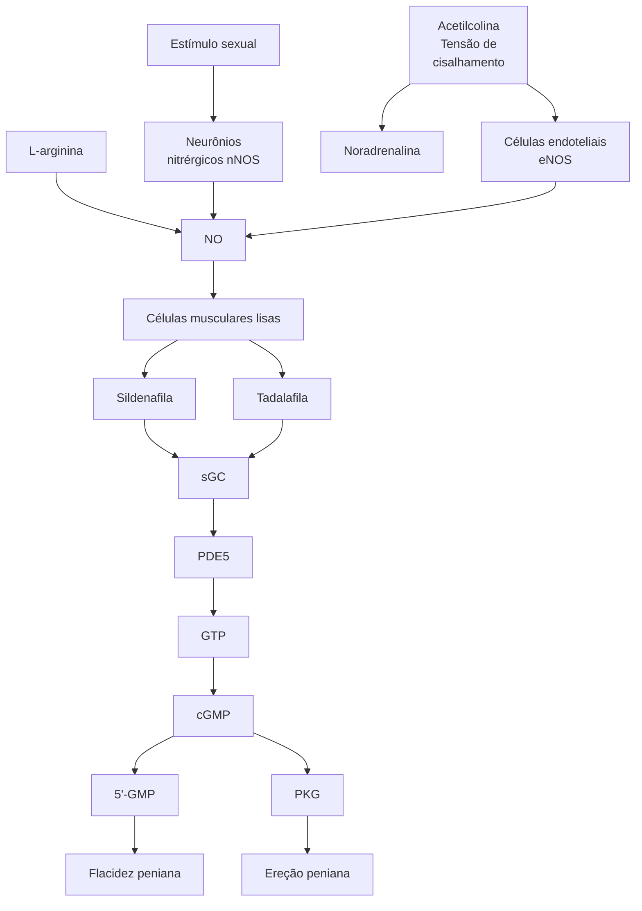

# UROLOGIA: MEDICINA SEXUAL

## 1. INTRODUÇÃO

- Disfunção Erétil: Incapacidade de atingir ou manter uma atividade erétil desejada, ereção insuficiente para a penetração e/ou desempenho sexual insatisfatório.
- Fisiologia da ereção:
  - A ereção é por definição um evento vascular → Com o estímulo sexual, ocorre a produção de acetilcolina pelos nossos neurônios, ela por sua vez irá ativar a via do GMPc, o que favorece a formação de óxido nítrico nas células musculares, permitindo efluxo de Cálcio e, consequente, relaxamento da musculatura lisa, favorecendo a vasodilatação e entrada de sangue nos corpos cavernosos = ereção;
  - O GMP-cíclico é degradado constantemente pela enzima fosfodiesterase-5, dentro das células musculares, levando à flacidez peniana.
- Sítios de ação:
  - noradrenalina → inibe a liberação de óxido nítrico;
  - Sildenafila e Tadalafila → inibidores de fosfodiesterase-5.
  - Estimulantes de ON. Figura 1

**Figura 1** Fisiologia da ereção peniana

## 2.ETIOLOGIAS

- Vascular (principalmente de cunho arterial): aterosclerose, DM, trauma, doença renal crônica (estenose arterial);
- Neurogênica: lesão medular, Parkinson, AVC, cirurgia pélvica;
- Anatômica: Peyronie, fratura, fibrose de corpos cavernosos;
- Hormonal: hipogonadisgmo, ↑ Prolactina;
- Induzida por drogas: anti-hipertensivos, antidepressivos; Abuso de substâncias.
- Psicogênica.
- Outros: Tratamento para o câncer de próstata, tabagismo, SAOS e esclerose sistêmica.

## 3.AVALIAÇÃO

- Anamnese: preferencialmente junto com parceiro (a);
- Exame Físico: buscar placas, volume testicular, lesões;
- Exames: Perfil metabólico (Lipidograma e HbA1c), testosterona matinal.
- Exames de exceção, principalmente se suspeita de etiologia psicogênica, para demonstrar a ausência de alterações nos exames:
  - Ereção farmacodinâmica;
  - USG Doppler.

## 4.TRATAMENTO

• Mudança estilo de vida e psicoterapia, independente se psicogênico ou não, para todos os pacientes;
• Tratamento medicamentoso/ cirúrgico (tripé):
  • inibidores da PDE-5;
  • injeções intracavernosas;
  • Cirúrgico - prótese peniana.

**Paciente masculino diagnosticado com Disfunção Erétil**

Terapias de 1ª linha

↓

Terapias orais para disfunção erétil

Terapias de 2ª linha

↓ ↓ ↓

Supositório uretral | Injetável (Alprostadil) | Bomba de vácuo

Terapias de 3ª linha

↓

Implante no paciente ou Cirurgia vascular corretiva

**Figura 2** Fluxograma do manejo em pacientes com disfunção erétil

### 4.1 INIBIDORES DE PDE-5:
• Sildenafila, Tadalafila;
• Agem inibindo a PDE-5;
• Perfil de Segurança bom e pouco efeito colateral;
• 75% de eficácia;
• Útil no uso diário e/ou sob demanda;
• Contraindicação: USO DE NITRATOS:
  • Doença cardiovascular compensada não é contra indicação

### 4.2 INJEÇÃO INTRACAVERNOSA:
• Alprostadil, papaverina, leucotrieno;
• Vasodilatadores;
• 92% de eficácia;
• Uso sob demanda (apenas quando for ter a relação sexual);
• Efeitos colaterais: dor, fibrose e priapismo.
• Confira ao lado a Figura 3

### 4.3 PRÓTESES PENIANAS (PROCEDIMENTO IRREVERSÍVEL):
• Semirrígida → mais barata, cirurgia menor, o penis do paciente permanecera sempre em ereção;
• Inflável → mais caro, cirurgia maior, vantagem de conforto social (ereção apenas no momento oportuno).
• Deve-se ter em mente que são cirurgias irreversíveis, com retirada de todo o corpo cavernoso e introdução de próteses, normalmente o paciente perde a sensibilidade
• Pode-se também optar por tentativa de correção vascular, quando possível
• Confira ao lado a Figura 4 e Figura 5

**Figura 3** Injeção intracavernosa

**Figura 4** Semirrígida.

**Figura 5** Inflável.

## 5. EJACULAÇÃO PRECOCE

### 5.1 CONCEITOS:
• Antes de ou até 1 minuto depois da penetração;
• Incapacidade de retardar a ejaculação;
• Repercussão negativa (ansiedade, evita relações, frustrações...).

MEDICINA SEXUAL                                                                                          3

## 5.2 PRIMÁRIA X SECUNDÁRIA:
• Primária: sempre teve essa queixa;
• Secundária: momento desencadeante, fator não orgânico. Normalmente, um quadro agudo, como trauma.

## 5.3 TRATAMENTO:
• Inibidores da recaptação de serotonina → Dapoxetina, paroxetina;
• Aconselhamento e psicoterapia;
• Outras alternativas (efeito colateral retardar e ejaculação): tramadol, lidocaína tópica.

## 6. DOENÇA DE PEYRONIE

### 6.1 CONCEITOS:
• Deformidade peniana adquirida;
• Ocorre devido a fibrose da túnica albugínea;
• Causa dor, curvatura, disfunção erétil e traz impacto negativo na vida sexual;
• Pode estar associado a contraturas palmo-plantares, sendo chamada de doença de Dupuytren.

**Figura 6** Contraturas palmo-plantares denotando associação com Doença de Dupuytren.

**Figura 7** Placas formando fibrose da túnica albugínea.

## 6.2 EPIDEMIOLOGIA:
• Homens, 50 a 60 anos;
• Relação com diabetes e doenças do colágeno;
• Dor e curvatura sem trauma evidente;
• Disfunção erétil associada em até 60% dos pacientes.

## 6.3 FISIOPATOLOGIA:
• Predisposição genética;
• Traumas clínicos ou subclínicos;
• Isquemia tecidual;
• Fibrose da túnica albugínea.

## 6.4 FATORES DE RISCO:
• Traumas genitais ou perineais;
• Instrumentação uretral;
• Prostatectomia Radical;
• Timpanosclerose.

## 6.5 FASE AGUDA:
• Dor;
• Piora ativa da curvatura;
• Nódulo palpável.

## 6.6 FASE CRÔNICA:
• Melhora da dor;
• Curvatura estável;
• Placa fibrótica.

## 6.7 TRATAMENTO:
• Fase aguda:
  • Analgesia;
  • AINEs.
• Fase crônica:
  • Injeções intraplaca (menos evidências);
  • Cirurgia (fluxograma abaixo).

| Peyronie                    |                 |
| --------------------------- | --------------- |
| ↓                           |                 |
| Disfunção erétil refratária |                 |
| Não                         | Sim             |
| ↓                           | ↓               |
| Curvatura                   | Prótese Peniana |
| <60°	>60°                   |                 |

</td>
</tr>
<tr><td style="text-align: center;">↓</td><td style="text-align: center;">↓</td></tr>
<tr>
<td style="text-align: center; border: 2px solid #00a0c6;">Plicatura</td>
<td style="text-align: center; border: 2px solid #00a0c6;">Incisão / Excisão da placa + Enxerto</td>
</tr>
</table>

**Figura 8** Fluxograma do manejo do paciente com Doença de Peyronie

**Figura 9** Plicatura.

**Figura 10** Excisão da placa fibrótica + enxerto.

# REFERÊNCIAS

**Figura 3** Injeção intracavernosa

Adaptado de: http://www.americanmedicalsystems.com/

**Figura 4** Semirrígida.

http://www.americanmedicalsystems.com/

**Figura 5** INFLÁVEL

https://andrologiachapeco.com.br/proteses-penianas/

**Figura 6** Contraturas palmo-plantares denotando associação com Doença de Dupuytren.

Seftel AD et al. Campbell-Walsh-Wein Urology, 12nd ed, 2020.
