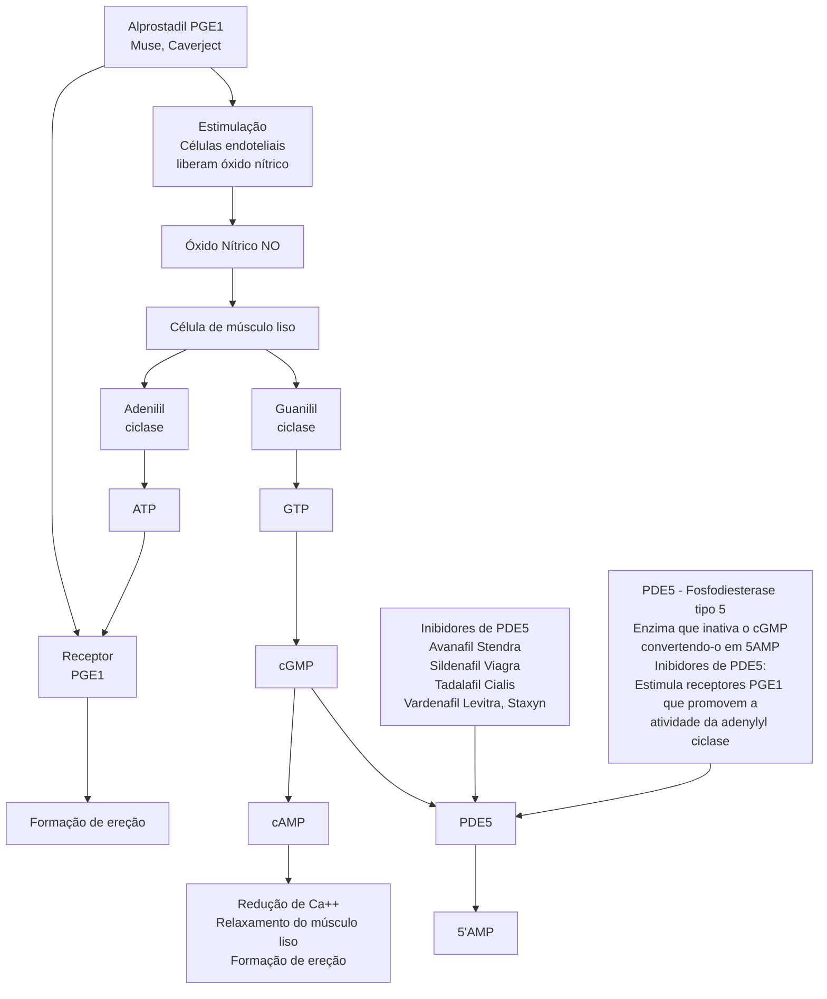
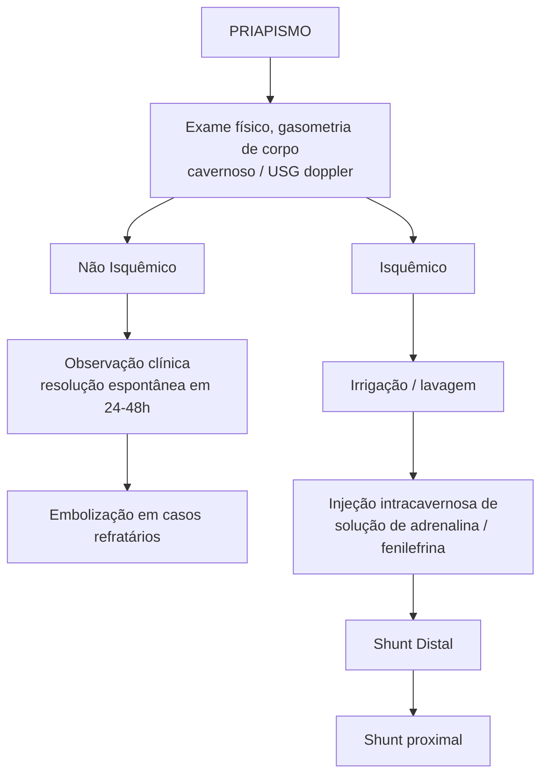

# UROLOGIA: PS - PRIAPISMO

|                                   | PRIAPISMO ISQUÊMICO                                                                                                                                                                                                                                              | PRIAPISMO NÃO ISQUÊMICO                                                                                                                           |
| --------------------------------- | ---------------------------------------------------------------------------------------------------------------------------------------------------------------------------------------------------------------------------------------------------------------- | ------------------------------------------------------------------------------------------------------------------------------------------------- |
| **Aspectos Sindrômicos**          | **Definição de priapismo:** ereção não desejada com duração > 2-3 horas mantida, sem estímulo sexual.
**Fisiologia da ereção:** relaxamento da musculatura lisa permite a entrada de sangue nos sinusoides dos corpos cavernosos penianos, levando à ereção. |                                                                                                                                                   |
| **Sinônimos**                     | Priapismo "isquêmico", "venoso", "de baixo fluxo"                                                                                                                                                                                                                | Priapismo "não-isquêmico", "arterial", "de alto fluxo"                                                                                            |
| **Etiopatogenia**                 | Anemia **falciforme**, uso de medicações, drogas (cocaína), levando a fenômeno vaso-oclusivo                                                                                                                                                                     | Presença de fístula entre a artéria do corpo cavernoso e o corpo cavernoso, normalmente após algum evento traumático (trauma perineal ou peniana) |
| **Quadro Clínico**                | Ereção extremamente **dolorosa**, **enrijecimento máximo** possível (ereção "10/10")
Na evolução, pode levar à **isquemia** dos corpos cavernosos                                                                                                            | Ereção **não dolorosa**, **enrijecimento parcial** (ereção "meia bomba")                                                                          |
| **Gasometria de Corpo Cavernoso** | Sangue com parâmetros **venosos**: cor escura, pO2 baixo, pCO2 alto, pH mais ácido                                                                                                                                                                               | Sangue com parâmetros **arteriais**: cor viva, pO2 alto, pCO2 baixo, pH menos ácido                                                               |
| **USG**                           | **Baixo fluxo** de sangue ao doppler                                                                                                                                                                                                                             | **Alto fluxo e presença de fístula** ao doppler                                                                                                   |
| **Conduta**                       | Seguir esta sequência conforme refratariedade:

**Punção para irrigação/lavagem**

**Injeção intracavernosa** de solução de adrenalina/ fenilefrina

**Shunt distal**

**Shunt proximal**                                        | **Observação clínica:** resolução espontânea em 24-48 horas

**Embolização** em casos refratários                                         |

## 1. DEFINIÇÃO

• Ereção não desejada que pode iniciar durante estímulo, mas perdura sem estímulo de forma prolongada (> 2-3 horas).

• Relembrando:
  • O pênis no seu estado flácido apresenta a cavidade sinusoidal não preenchida e o músculo liso contraído;
  • O pênis ereto apresenta o músculo liso relaxado, cavidades sinusoidais ingurgitadas, colapsando as veias e diminuindo o retorno venoso.

**Figura 1** Demonstração da musculatura peniana durante flacidez (à esquerda) e ereção (à direita)

| M. Liso             | M. Liso Relaxado                         |
| ------------------- | ---------------------------------------- |
| Cavidade Sinusoidal | Sinusóide Ingurgitado
Veia Colapsada |

## 2. FISIOLOGIA DA EREÇÃO

Via do óxido nítrico: ocorre liberação do óxido nítrico pelas células endoteliais, agindo de forma intracelular nas células musculares dos sinusóides, fazendo o estímulo da guanilil ciclase, que, por sua vez, converte GTP em cGMP. O cGMP é a substância ativa que irá promover o decréscimo de cálcio intracelular, levando ao relaxamento do músculo liso e ereção. Nessa mesma via, a fosfodiesterase degrada o cGMP, logo, a sua inibição por medicamentos aumenta a concentração de cGMP e causa a ereção.

• Medicações que inibem a fosfodiesterase (PDE5):
  • Avanafil (Stendra ®);
  • Sildenafil (Viagra ®);
  • Tadalafil (Cialis ®);
  • Vardenafil (Levitra ®, Staxyn ®).
• Via receptores de prostaglandinas:
  • A ativação dos receptores de PGE1 leva à ação na adenilil ciclase, que converte ATP em cAMP, também levando ao decrescimento de cálcio, relaxamento do músculo liso e ereção.
• Medicações que agem diretamente nos receptores de PGE1:

**Figura 2** Fisiopatologia da ativação do GMP culminando na formação do NO, associado a fatores reguladores como sua degradação pela PDE5 com respectivos fármacos que podem a inibir alemã da ativação através de receptores de prostaglandinas

## 2.1 ISQUÊMICO (BAIXO FLUXO):
• Envolve fenômenos veno-oclusivos;
• Fatores de risco: anemia falciforme ou uso de medicações (medicação intracavernosa para ereção ou cocaína).

## 2.2 NÃO ISQUÊMICO (ALTO FLUXO):
• Envolve fístula artério-venosa (sangue arterial entra nos corpos cavernosos, causando a ereção);
• Fator de risco: Trauma Perineal;
• Não configura urgência urológica, pois não causa isquemia.

## 3. SINAIS E SINTOMAS

**Isquêmico:**
• Extremamente doloroso;
• Ereção 10/10 (importante):
  • Pode levar à isquemia tecidual (urgente).

**Não Isquêmico:**
• Geralmente indolor;
• Ereção pode ser "meia bomba" (o sangue não está totalmente represado).

## 4. EXAMES COMPLEMENTARES

• Gasometria de Corpos Cavernosos (aspirado do sangue do corpo cavernoso): **Tabela 1**

**USG Doppler de Pênis:**
• Achados no Priapismo Isquêmico:
  • Fluxo reduzido ou ausente na artéria Cavernosa;
  • Índice de Resistividade aumentado;
  • Sinais de trombose em corpo cavernoso ou esponjoso.

**Tabela 1** Gasometria de corpo cavernoso no priapismo isquêmico e não isquêmico

| Aspecto     | Isquêmico | Não Isquêmico |
| ----------- | --------- | ------------- |
| Aspecto     | Escuro    | Vermelho vivo |
| pO2 (mmHg)  | < 30      | > 90          |
| pCO2 (mmHg) | > 60      | < 40          |
| pH          | < 7,25    | > 7,35        |

**Figura 3** USG Doppler de um priapismo isquêmico (não há fluxo na artéria cavernosa)

• Não isquêmico:
  • Fístula artério-venosa pode ser vista;
  • Velocidades normais ou aumentadas em artérias penianas. **Figura 4**

PS - PRIAPISMO                                                                                                   3

## 5. TRATAMENTO

• Punção com lavagem do corpo cavernosos (introduz soro fisiológico, podendo-se diluir alfa-adrenérgico); Figura 5
• Abordagem cirúrgica: Shunt distal (produção de fístula entre o corpo cavernoso e esponjoso para drenagem do sangue represado); Figura 6
  • Procedimentos: Winter, Ebbehoj, T-Shunt e Al-Ghorab.

• Abordagem cirúrgica: Shunt proximal.
  • Fator negativo: dificulta mais a colocação de prótese peniana em casos que evoluem com disfunção erétil;
  • Procedimentos: Grayhack (comunicação do corpo cavernoso com a safena proximalmente) e Quackles (comunicação proximal do corpo cavernoso com o esponjoso). Figura 7
• Confira na página seguinte Figura 6 Figura 7

Figura 4 Fluxograma. Condutas no Priapismo no Pronto Socorro até o Diagnóstico. No isquêmico, os passos são progressivos, iniciando pela irrigação/ lavagem dos corpos cavernosos, injeção intracavernosa de solução de adrenalina/ fenilefrina, e, se refratário, parte para condutas cirúrgicas, o Shunt Distal e Shunt Proximal

UROLOGIA

![Figura 5 - Irrigação e lavagem do corpo cavernoso - Diagram showing irrigation and washing of the cavernous body with a syringe connected via tubing to the penis, with blue bands wrapped around the shaft]

**Figura 5** Irrigação e lavagem do corpo cavernoso

![Figura 6 - Técnicas para confecção de shunt distal - Diagram showing four different surgical techniques (Winter, Ebbehoj, T-Shunt, and Al-Ghorab) for creating distal shunts, with cross-sectional views and a graph showing waveform patterns]

**Figura 6** Técnicas para confecção de shunt distal

PS - PRIAPISMO

**Quackles**

**Grayhack**

**Figura 7** Técnicas para confecção de shunt proximal

## 6. SEGUIMENTO

• Importante se atentar para a disfunção erétil, principalmente quanto maior o tempo de isquemia (risco maior após 6 horas);

• A isquemia prolongada causa fibrose, inviabilizando o tecido do corpo cavernoso, somado à necessidade que muitos pacientes têm de realizar Shunt, resultado em uma situação de maior dificuldade técnica para colocação da prótese.

**Disfunção Erétil -> Risco maior após 6h**

**Fibrose**

Isquemia → + → Dificuldades técnicas para prótese

**Shunt**

**Figura 8** Dificuldade de confecção de próteses penianas apos longo tempo de isquemia e fibrose com confecção de shunt durante primeira cirurgia

UROLOGIA

# REFERÊNCIAS

**Figura 3** USG Doppler de um priapismo isquêmico (não há fluxo na artéria cavernosa)
